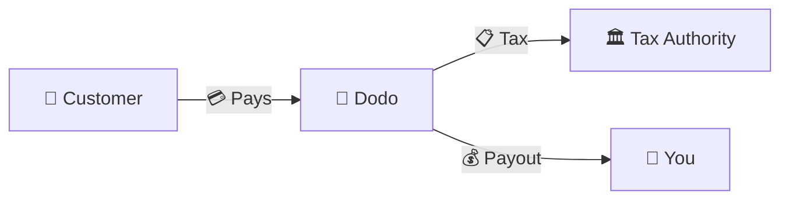
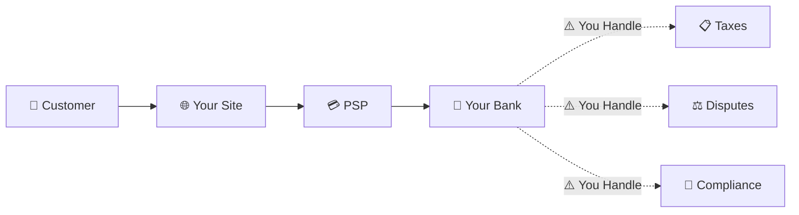
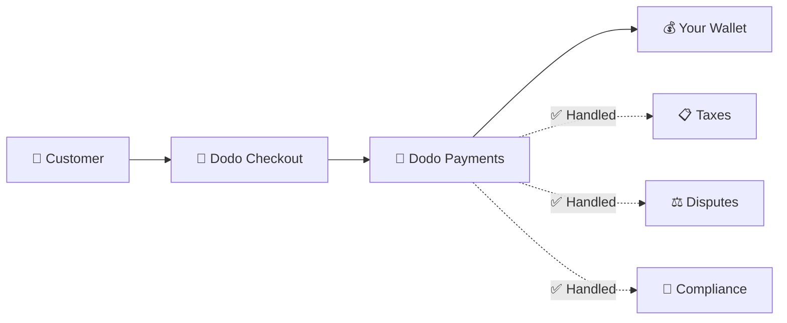
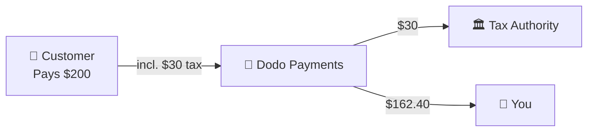

Dodo Paymentsは**Merchant of Record（MoR）**として運営されます。つまり、お客様のデジタルプロダクトの法的な販売者となり、決済、税金、不正、コンプライアンスに関する責任を引き受けます。これにより、お客様はプロダクトの構築に専念できます。

<CardGroup cols={3}>
<Card title="220+ Regions" icon="globe">
税務コンプライアンスを自動で処理
</Card>

<Card title="30+ Payment Methods" icon="credit-card">
カード、ウォレット、地域固有の決済手段
</Card>

<Card title="Zero Tax Filing" icon="file-invoice">
送金をすべて処理
</Card>
</CardGroup>

## Merchant of Recordとは？

**Merchant of Record**とは、顧客のクレジットカード明細に記載され、取引に関する責任を負う法的な事業体です。Dodo PaymentsをMoRとして利用する場合：

- **法的な販売者は当社です** — 銀行明細や領収書にはDodoが記載されます
- **お客様はプロダクトのクリエイターです** — プロダクトの構築、価格設定、提供を行います
- **バックオフィスは当社が担当します** — 税金、異議申し立て、コンプライアンス、請求サポートを処理します
- **お客様は純額の支払いを受け取ります** — 収益はお客様のアカウントに直接入金されます

<Note>
Merchant of Recordとは、請求書、税金、各国の請求業務をすべて処理するグローバルな財務チームを、手間をかけずに雇うようなものだと考えてください。
</Note>

## Merchant of Recordを利用する理由

デジタルプロダクトをグローバルに販売するには、欧州のVAT、オーストラリアのGST、米国のSales Taxなど、数多くの要件に対応する必要があります。各地域には異なるルール、税率、基準額、申告期限があります。

| お客様の責任 | MoRなし | DodoをMoRとして利用 |
|---------------------|:-----------:|:----------------:|
| VAT/GST登録 | ❌ お客様 | ✅ Dodo |
| 税額計算 | ❌ お客様 | ✅ Dodo |
| 税務申告と納付 | ❌ お客様 | ✅ Dodo |
| チャージバック責任 | ❌ お客様 | ✅ Dodo |
| PCIコンプライアンス | ❌ お客様 | ✅ Dodo |
| 複数通貨対応 | ❌ 複雑 | ✅ 組み込み済み |
| 地域固有の決済手段 | ❌ それぞれ統合 | ✅ 30種類以上を含む |

<Tip>
**例**：フランスの顧客に月額50ユーロのサブスクリプションを販売する場合？

**MoRなしの場合**：フランスのVATに登録し、60ユーロ（VAT 20%）を請求し、四半期ごとにフランス語で申告書を提出し、監査に対応します。

**Dodoの場合**：当社が60ユーロを徴収し、10ユーロのVATをフランスに納付したうえで、手数料を差し引いた50ユーロをお客様に支払います。お客様はコードを書くことに集中できます。
</Tip>

## PSPとMoR：主な違い

**Payment Service Provider**（Stripeなど）と**Merchant of Record**の違いを理解することは重要です。

### Payment Service Provider（PSP）

PSPは取引を処理しますが、法的な販売者としての立場はお客様に残ります。

<Warning>
PSPを利用する場合、顧客がいるすべての地域で、税務登録、徴収、申告、納付を行う責任は**お客様**にあります。
</Warning>

### Merchant of Record（Dodo）

MoRは法的な販売者となり、コンプライアンスを最初から最後まで処理します。

<Check>
DodoをMoRとして利用する場合、税金、異議申し立て、コンプライアンスを当社が処理します。お客様は書類作業なしで、純額の支払いを受け取れます。
</Check>

### 比較表

| 項目 | PSP（Stripeなど） | MoR（Dodo） |
|--------|:------------------:|:----------:|
| 法的な販売者 | お客様の会社 | Dodo |
| 顧客の明細に記載される名称 | お客様の名称 | Dodo |
| 税務登録 | ❌ お客様 | ✅ Dodo |
| 税額計算 | ❌ お客様 | ✅ Dodo |
| 税金の納付 | ❌ お客様 | ✅ Dodo |
| チャージバックリスク | ❌ お客様 | ✅ Dodo |
| PCIコンプライアンス | ❌ お客様 | ✅ Dodo |
| グローバル展開の準備 | 複雑 | 簡単 |

<Info>
**重要**：PSPもMoRも決済処理を担います。重要な違いは、税務コンプライアンスと取引責任を**法的に誰が負うか**です。
</Info>

## 税務コンプライアンスの仕組み

Dodoは税務に関するライフサイクル全体を自動で処理します。

<Steps>
<Step title="Customer Location">
顧客の国を検出し、VAT、GST、Sales Taxなど、適用される税務ルールやその他の地域要件を判断します。
</Step>

<Step title="Rate Calculation">
プロダクトの種類、顧客の所在地、B2B/B2Cの区分に基づいて正しい税率を計算します。有効なVAT番号を持つEUの法人顧客には、リバースチャージが適用されます。
</Step>

<Step title="Collection at Checkout">
税額をチェックアウト時に明確に表示して徴収します。顧客は支払う金額を正確に確認できます。
</Step>

<Step title="Filing & Remittance">
申告書を提出し、徴収した税金を関連当局へ期日どおりに納付します。お客様が税務フォームを目にすることはありません。
</Step>
</Steps>

## 収益の流れ

顧客からお客様のアカウントへ、資金がどのように移動するかを説明します。

### 支払い内訳の例

| 項目 | 金額 |
|-----------|-------:|
| 顧客からの支払い | $200.00 |
| Sales Tax（VAT 15%） | −$30.00 |
| Dodoプラットフォーム手数料（4%） | −$8.00 |
| 決済処理手数料 | −$0.60 |
| **お客様への支払い額** | **$162.40** |

## MoRとPSPの選び方

<Tabs>
<Tab title="Choose Dodo (MoR)">
**次のような場合はDodo Paymentsが適しています：**

- デジタルプロダクト、SaaS、サブスクリプションを販売している
- 複数の国に顧客がいる
- 税務登録に関する煩雑な作業を避けたい
- 予測可能なアウトソース型のコンプライアンスを希望している
- 最大限のコントロールより市場投入までの速さを重視している
- 異議申し立てや不正を自分で管理したくない
</Tab>

<Tab title="Consider a PSP">
**次のような場合はPSPが適している可能性があります：**

- 主に1つの国で事業を運営している
- 社内に財務・コンプライアンスチームがある
- チェックアウトUXを完全に管理する必要がある
- 利益率が非常に低い
- 物理的な商品を販売している（MoRはデジタル商品に注力しています）
</Tab>
</Tabs>

<Note>
多くの事業者はPSPから始め、国際的に成長するにつれてMoRに切り替えます。Dodoは、この移行をスムーズに進めるための移行サポートを提供しています。
</Note>

## よくある質問

<AccordionGroup>
<Accordion title="What appears on my customer's credit card statement?">
加盟店としてDodo Paymentsが表示されます。文字数制限が許す場合は、お客様のプロダクトやブランドに関する情報を含めます。また、顧客にはお客様のプロダクト情報を記載した詳細な領収書が発行されます。
</Accordion>

<Accordion title="Do I still own the customer relationship?">
はい。価格設定、ブランディング、プロダクトの提供、顧客との直接的なコミュニケーションはお客様が管理します。Dodoは請求処理を担いますが、顧客はお客様から購入していることを把握できます。チェックアウト、メール、請求書にはお客様のブランドが目立つように表示されます。
</Accordion>

<Accordion title="How does B2B VAT reverse charge work?">
EUでB2B販売を行う場合、顧客はチェックアウト時にVAT番号を入力できます。当社が番号を検証し、リバースチャージを自動的に適用します。税金は徴収されず、購入者のVAT申告に移ります。
</Accordion>

<Accordion title="Can I use my own payment processor?">
Dodoは独自の決済インフラを使用した完全なソリューションとして運営されています。この統合により、当社は税金と不正に関する責任を引き受けることができます。将来的には、他の決済プロセッサとの統合も提供する予定です。
</Accordion>

<Accordion title="How do refunds work?">
ダッシュボードから返金を開始できます。返金は顧客が元の支払いに使用した決済手段と通貨で処理されます。税額は自動的に調整され、照合されます。
</Accordion>

<Accordion title="What about my income tax?">
Dodoは顧客との取引にかかる**Sales Tax**（VAT、GST、Sales Tax）を処理します。所得税、法人税、および受け取った支払いに対する税務上の義務は、お客様が引き続き負います。
</Accordion>

<Accordion title="Which countries can I sell to?">
現在、220以上の国と地域からの支払いを受け付けており、対応地域を継続的に拡大しています。全リストはこちら：

<Card title="Supported Regions" icon="globe" href="/miscellaneous/list-of-countries-we-accept-payments-from">
支払いを受け付けている220以上の国と地域をすべて表示します。
</Card>
</Accordion>
</AccordionGroup>

## 始める

<CardGroup cols={2}>
<Card title="Create Account" icon="rocket" href="https://app.dodopayments.com/signup">
無料で登録し、数分でグローバル決済の受付を開始できます。
</Card>

<Card title="MoR vs PG Deep Dive" icon="scale-balanced" href="/features/mor-vs-pg">
例やユースケースを含む詳細な比較をご覧いただけます。
</Card>

<Card title="Acceptance Policy" icon="building-shield" href="/miscellaneous/merchant-acceptance">
サポート対象の事業者についてご確認ください。
</Card>

<Card title="Talk to Us" icon="envelope" href="mailto:founders@dodopayments.com">
当社チームから、お客様に合わせた guidanceをご案内します。
</Card>
</CardGroup>
