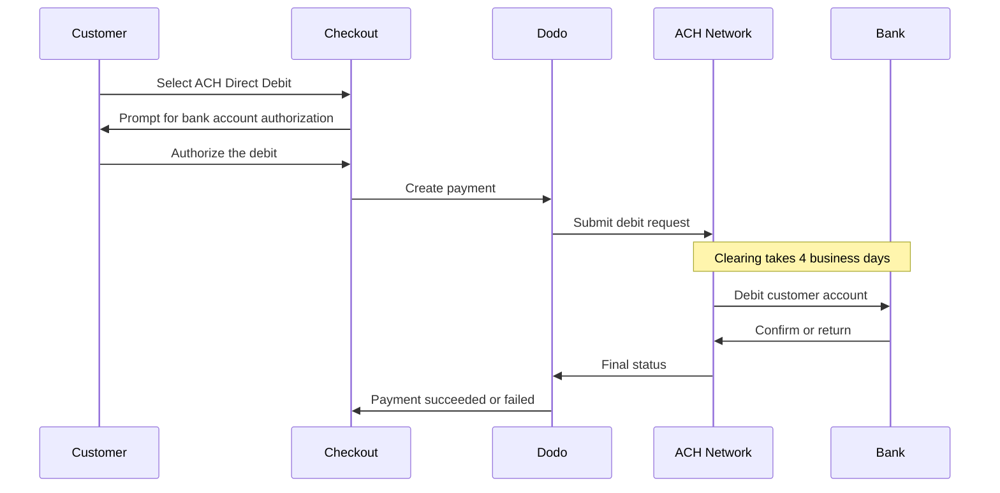

ACH Direct Debitを使用すると、米国の顧客はカードを使わず、銀行口座から直接支払えます。これはAutomated Clearing House network上で処理され、one-time paymentsのUSD checkoutsで利用できます。

## ACH Direct Debitを提供する理由

<CardGroup cols={3}>
<Card title="Lower Processing Cost" icon="piggy-bank">
銀行引き落としは、特に高額注文の場合、通常カード決済よりも処理コストが低くなります。
</Card>

<Card title="No Card Required" icon="building-columns">
銀行口座からの支払いを好む顧客や、高額購入でカードを使いたくない米国の顧客にも対応できます。
</Card>

<Card title="Higher Value Orders" icon="chart-line">
カード決済に対するコスト面の優位性は注文額が大きいほど高まるため、ACHは高額なone-time purchasesに適しています。
</Card>
</CardGroup>

## 概要

| 詳細 | 値 |
| :----- | :---- |
| **請求通貨** | USD |
| **対応国** | 米国 |
| **Subscriptions** | なし |
| **最小金額** | $0.50 |
| **決済確定** | 4 business days |

<Warning>
ACH Direct Debitは即時決済ではありません。支払いの確認には**4 business days**かかるため、authorizationをsettlementとして扱わないでください。支払いがsucceeded stateになるまで、履行を実行しないでください。
</Warning>

## 仕組み



## 顧客体験

1. 顧客がcheckoutでACH Direct Debitを選択する
2. 顧客が米国の銀行口座からの引き落としを承認する
3. 支払いがACH networkに送信され、processing stateに移行する
4. その後のbusiness daysにわたってclearingが完了する
5. 支払いがsucceeded stateに移行するか、銀行によって返却された場合は失敗する

<Info>
clearingは非同期で行われるため、最終結果を確認するにはcheckout redirectではなく[webhooks](/developer-resources/webhooks)を使用してください。redirectが成功したことは、顧客が引き落としを承認したことだけを意味します。

引き落としが送信されると、支払いは`payment.processing`を発行し、clearingが完了すると`payment.succeeded`または`payment.failed`を発行します。履行を実行して安全なのは`payment.succeeded`のみです。
</Info>

## 利用条件

ACH Direct Debitは、次のすべての条件を満たす場合にcheckoutに表示されます。

- **請求通貨**が`USD`である
- **請求先国**が`US`である
- 取引が**one-time payment**である

<Note>
ACH Direct Debitはsubscriptionsでは利用できません。複数日にわたるclearing windowは、recurring billing cyclesには適していません。recurring paymentsには、cardsまたはsubscriptionsに対応する別のmethodを使用してください。[Payment Methods overview](/features/payment-methods)を参照してください。
</Note>

## 設定

```javascript
const session = await client.checkoutSessions.create({
  product_cart: [{ product_id: 'pdt_123', quantity: 1 }],
  allowed_payment_method_types: ['ach', 'credit', 'debit'],
  billing_currency: 'USD',
  billing_address: {
    country: 'US',
    zipcode: '94102'
  },
  return_url: 'https://example.com/success'
});
```

<Note>
ACH Direct Debitには、**USD**のbilling currencyと、**US**のbilling addressが必要です。別の通貨で価格を提示している場合は、[Adaptive Currency](/features/adaptive-currency)を有効にして、米国の顧客への請求をUSDにすると、ACHを利用できるようになります。
</Note>

## API Method Type

| Type | Method | Country |
| :--- | :----- | :------ |
| `ach` | ACH Direct Debit | United States |

## RefundsとDisputes

ACH paymentsのRefundsとdisputesには、他のすべてのpayment methodsと同じAPIとdashboard flowsを使用します。実装するACH-specific handlingはありません。

<Warning>
ACH paymentsは処理済みに見えた後でも顧客の銀行によって返却される可能性があるため、元の支払いがsucceeded stateに達するまでrefundsの発行は避けてください。
</Warning>

## テスト

<Steps>
<Step title="Enable test mode">
Dodo Paymentsのtest API keysを使用してください。
</Step>

<Step title="Set currency and billing address">
billing currencyを`USD`に設定し、billing addressのcountryを`US`に設定します。
</Step>

<Step title="Include `ach` in allowed methods">
`allowed_payment_method_types`に`ach`を渡すか、対象となるすべてのmethodを表示するにはfieldを完全に省略します。
</Step>

<Step title="Enter the test bank details">
以下のtest routing and account number pairsのいずれかを入力し、webhook handlerが最終的なpayment statusを受信することを確認します。
</Step>
</Steps>

### テスト用銀行口座

顧客はcheckoutでaccount numberとrouting numberを直接入力します。test modeでは、特定の結果を発生させるために、routing number `110000000`と以下のaccount numbersのいずれかを使用します。

| Account Number | Routing Number | 動作 |
| :------------- | :------------- | :------- |
| `000123456789` | `110000000` | 支払いが成功します。 |
| `000222222227` | `110000000` | 残高不足により支払いが失敗します。 |
| `000111111113` | `110000000` | 口座が閉鎖されているため支払いが失敗します。 |
| `000111111116` | `110000000` | 口座が見つからないため支払いが失敗します。 |
| `000333333335` | `110000000` | 口座で引き落としが承認されていないため支払いが失敗します。 |
| `000444444440` | `110000000` | 通貨が無効なため支払いが失敗します。 |
| `000555555559` | `110000000` | 支払いは成功した後、disputeが発生します。 |
| `000000000009` | `110000000` | 支払いがprocessing状態のまま無期限に留まります。pending-state UIのテストに便利です。 |

<Note>
ほとんどのtest paymentsは、実際のclearing windowよりもはるかに早く最終statusに到達するため、integrationの検証に数日待つ必要はありません。例外は`000000000009`で、processing状態が続くよう設計されています。
</Note>

## ベストプラクティス

<AccordionGroup>
<Accordion title="Don't fulfill on authorization">
ACH authorizationはpaymentではありません。アクセスを許可したり商品を発送したりする前に、paymentがsucceeded stateに達するまで待ってください。引き落としは顧客の銀行によって返却される可能性があります。
</Accordion>

<Accordion title="Set customer expectations at checkout">
銀行決済は即時にはclearingされないことを顧客に伝えてください。これにより、注文がまだpendingである理由を尋ねるサポートチケットを減らせます。
</Accordion>

<Accordion title="Provide card fallbacks">
`ach`と併せて、常に`credit`および`debit`を含めてください。これにより、商品への即時アクセスが必要な顧客が、より速いmethodを選択できます。
</Accordion>

<Accordion title="Use ACH for high-value one-time purchases">
ACHのコスト面の優位性は注文額が大きいほど高まるため、小額の購入よりも高額なone-time purchasesで最も有効です。
</Accordion>
</AccordionGroup>

## トラブルシューティング

<AccordionGroup>
<Accordion title="ACH not appearing at checkout">
**確認項目:**
1. billing currencyは`USD`に設定されていますか？
2. 顧客のbilling countryは`US`ですか？
3. `ach`は`allowed_payment_method_types`に含まれていますか？
4. one-time paymentですか？ACHはsubscriptionsでは提供されません。

**解決策:** `allowed_payment_method_types`を一時的に削除して、対象となるすべてのmethodを表示します。その後、API requestでbilling currencyとaddress countryを確認してください。
</Accordion>

<Accordion title="ACH not appearing on a subscription checkout">
**原因:** ACH Direct Debitはone-time paymentsでのみ提供されます。

**解決策:** recurring billingには、cardsまたは別のsubscription-capable methodを使用してください。
</Accordion>

<Accordion title="Payment stuck in processing">
**原因:** これは想定された動作です。ACH paymentsはclearing window全体にわたってprocessing stateに留まるため、カード決済よりもはるかに時間がかかります。

**解決策:** 最終webhookを待ってください。paymentを再試行しないでください。再試行すると、顧客に二重に請求される可能性があります。
</Accordion>

<Accordion title="Payment failed after initially succeeding at checkout">
**原因:** 顧客の銀行が引き落としを返却しました。最も一般的な原因は残高不足または口座の閉鎖です。

**解決策:** paymentを失敗として扱い、別のpayment methodで再試行するよう顧客に依頼してください。これを避けるため、必ずsucceeded stateを条件に履行を実行してください。
</Accordion>
</AccordionGroup>

## 関連ページ

<CardGroup cols={2}>
<Card title="Payment Methods Overview" icon="credit-card" href="/features/payment-methods">
対応しているすべてのpayment methodsを確認します。
</Card>

<Card title="Adaptive Currency" icon="globe" href="/features/adaptive-currency">
通貨の対応状況と自動換算。
</Card>

<Card title="Checkout Guide" icon="book" href="/developer-resources/checkout-session">
checkoutの完全な実装ガイド。
</Card>

<Card title="Webhooks" icon="webhook" href="/developer-resources/webhooks">
遅延するpayment confirmationsを非同期で処理します。
</Card>
</CardGroup>
