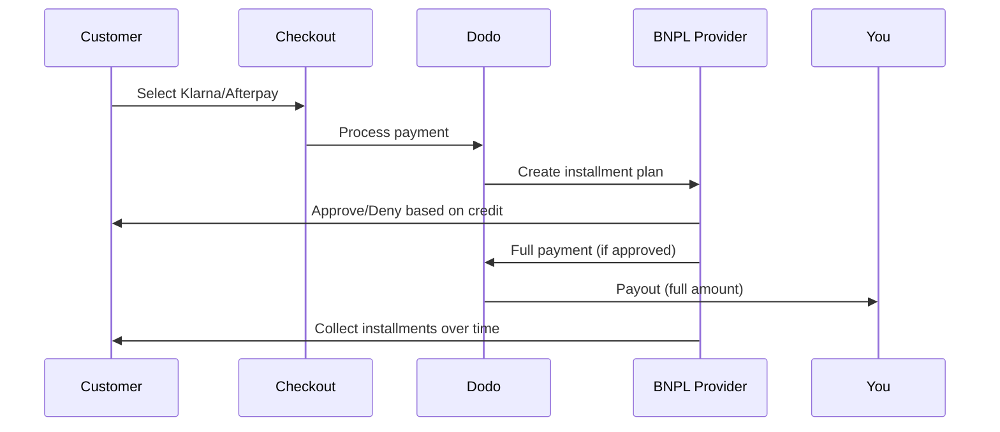

今すぐ購入、後で支払い (BNPL) を利用すると、顧客は購入を金利なしで分割払いにすることができ、平均注文額を20-50%、適格な取引に対するコンバージョンレートを10-30%増加させます。

## なぜBNPLを提供するのか？

<CardGroup cols={3}>
<Card title="Higher AOV" icon="chart-line">
顧客は支払いを分割できると、より多くの支出をする傾向があります。平均注文額は20-50%増加します。
</Card>

<Card title="Better Conversion" icon="percent">
チェックアウト時の支払いの摩擦を取り除きます。高額商品に対するコンバージョン率は10-30%改善します。
</Card>

<Card title="Zero Risk" icon="shield-check">
BNPLプロバイダーが信用リスクと回収を担当します。あなたは前払いで全額を受け取ります。
</Card>
</CardGroup>

## サポートされているプロバイダー

### Klarna

| 機能 | 詳細 |
| :------ | :------ |
| **利用可能地域** | 米国 + 19の欧州諸国 |
| **通貨** | USD、EUR、GBP、DKK、NOK、SEK、CZK、RON、PLN、CHF |
| **最低金額** | $50.01 (または同等) |
| **サブスクリプション** | なし |

**サポート国:** オーストリア、ベルギー、チェコ共和国、デンマーク、フィンランド、フランス、ドイツ、ギリシャ、アイルランド、イタリア、オランダ、ノルウェー、ポーランド、ポルトガル、ルーマニア、スペイン、スウェーデン、スイス、英国、米国

**支払いオプション:**
- **4回払い** — 4回の金利なしの支払いに分割
- **30日後に支払い** — 30日後に全額支払い
- **ファイナンス** — 長期の分割払いプラン

### Afterpay (Clearpay)

| 機能 | 詳細 |
| :------ | :------ |
| **利用可能地域** | 米国、英国 |
| **通貨** | USD、GBP |
| **最低金額** | $50.01 (または同等) |
| **サブスクリプション** | なし |

**支払いオプション:**
- **4回払い** — 2週間ごとに4回の金利なしの支払い

<Note>
英国では、Afterpayは「Clearpay」として運営されていますが、同じAPIタイプを使用しています (`afterpay_clearpay`)。
</Note>

### Billie

| 機能 | 詳細 |
| :------ | :------ |
| **利用可能地域** | グローバル |
| **通貨** | GBP |
| **最低金額** | なし |
| **サブスクリプション** | なし |

**Billieについて:**
BillieはB2Bの今すぐ購入、後で支払いソリューションで、企業が顧客に柔軟な支払い条件を提供できるようにします。請求書ベースの支払いオプションを必要とするビジネス間取引向けに設計されています。

**支払いオプション:**
- **請求書支払い** — 合意された支払い条件内で支払い
- **柔軟な条件** — ビジネスフレンドリーな支払いスケジュール

## 設定

### APIメソッドタイプ

| タイプ | プロバイダー |
| :--- | :------- |
| `klarna` | Klarna |
| `afterpay_clearpay` | Afterpay / Clearpay |
| `billie` | Billie (B2B) |

### 例

```javascript
const session = await client.checkoutSessions.create({
  product_cart: [{ product_id: 'prod_123', quantity: 1 }],
  allowed_payment_method_types: [
    'klarna',
    'afterpay_clearpay',
    'credit',
    'debit'
  ],
  customer: {
    email: 'customer@example.com',
    name: 'Jane Smith'
  },
  billing_address: {
    country: 'US',
    zipcode: '10001'
  },
  return_url: 'https://example.com/success'
});
```

<Warning>
常に `credit` と `debit` をフォールバックとして含めてください。すべての顧客がBNPLに適格なわけではなく、$50.01未満の取引は適格になりません。
</Warning>

## 最低取引額

**KlarnaとAfterpayの両方とも、最低$50.01 USDを要求します**（またはサポートされている通貨での同等額）。

この閾値以下の取引:
- BNPLオプションはチェックアウト時に表示されません
- エラーは発生しません — オプションは単に表示されません
- カード払いは利用可能です

これは期待される動作です。$50未満の製品には、`allowed_payment_method_types`にBNPLを含めないでください。

## 分割払いの仕組み



**主なポイント:**
- BNPLプロバイダーから**全額前払い**を受け取ります
- BNPLプロバイダーが**信用リスクと回収**を担当します
- 顧客はプロバイダーに**4回分割**で支払いを行います（通常）
- 分割払いの失敗による**チャージバックはありません** — それはプロバイダーのリスクです

## テスト

### Klarnaテストデータ

テストモードでは以下の詳細を使用します：

| フィールド | 承認 | 拒否 |
| :---- | :------- | :----- |
| **生年月日** | 1970年10月7日 | 1970年10月7日 |
| **名** | テスト | テスト |
| **姓** | パーソン-us | パーソン-us |
| **メール** | customer@email.us | customer+denied@email.us |
| **住所** | アムステルダムアベニュー | アムステルダムアベニュー |
| **番地** | 509 | 509 |
| **市** | ニューヨーク | ニューヨーク |
| **州** | ニューヨーク | ニューヨーク |
| **郵便番号** | 10024-3941 | 10024-3941 |
| **電話** | +13106683312 | +13106354386 |

<Note>
取引は、Klarnaのオプションが表示されるために、最低$50でなければなりません。
</Note>

### Afterpayテスト

<Steps>
<Step title="Afterpayを選択">
チェックアウトでAfterpayを選択し、支払いをクリックします。
</Step>

<Step title="成功した支払い">
有効なメールアドレスと郵送先住所を使用します。
</Step>

<Step title="認証失敗">
失敗をテストするには：リダイレクトページでAfterpayモーダルを閉じます。支払いステータスは `requires_payment_method` に遷移します。
</Step>
</Steps>

## ベストプラクティス

<AccordionGroup>
<Accordion title="高額商品をターゲットにする">
BNPLは$100-$1000の商品に最も適しています。「時間をかけて支払う」という価値提案が、この範囲で最も魅力的です。
</Accordion>

<Accordion title="分割払いの金額を表示する">
「$25の4回払い」は「Klarnaで$100」と言うよりも魅力的です。可能な限り、支払いごとの金額を表示してください。
</Accordion>

<Accordion title="低価値商品にBNPLを強制しない">
$50未満では、BNPLは表示されません。$100未満では、ほとんどの顧客がカードを好みます。BNPLのプロモーションを高額商品に集中させます。
</Accordion>

<Accordion title="請求先住所を収集する">
BNPLプロバイダーは信用チェックのために請求情報を必要とします。チェックアウトで完全な住所情報を収集することを確認してください。
</Accordion>

<Accordion title="明確な期待を設定する">
顧客は、Klarna/Afterpayとの信用契約に参加していることを理解しているべきです。あなたとはではありません。
</Accordion>
</AccordionGroup>

## 制限事項

### サブスクリプションなし
BNPLの支払い方法は**定期的な支払いをサポートしていません**。サブスクリプション商品には、カードまたはその他の定期支払いに適した方法を使用してください。

### クレジットベースの承認
BNPLプロバイダーは即座にクレジットチェックを行います。すべての顧客が承認されるわけではありません。承認率は以下によって異なります：
- プロバイダーとの顧客のクレジット履歴
- 取引額
- 顧客の所在国

### 通貨と国のマッピング
各通貨は、対応する地域に制限されています：

| 通貨 | サポートされている国 |
| :------- | :------------------ |
| **USD** | 米国のみ |
| **EUR** | サポートされているすべての欧州諸国（オーストリア、ベルギー、チェコ共和国、デンマーク、フィンランド、フランス、ドイツ、ギリシャ、アイルランド、イタリア、オランダ、ノルウェー、ポーランド、ポルトガル、ルーマニア、スペイン、スウェーデン、スイス） |
| **GBP** | 英国およびすべてのサポートされている欧州諸国 |

他のKlarnaサポート通貨（DKK、NOK、SEK、CZK、RON、PLN、CHF）は、各国で機能します。

<Info>
例えば、USD取引は米国の顧客にのみBNPLオプションを表示します。EUR取引はサポートされているすべての欧州諸国にBNPLオプションを表示します。GBP取引は、英国およびすべてのサポートされている欧州諸国にBNPLオプションを表示します。
</Info>

| プロバイダー | サポートされている通貨 |
| :------- | :------------------- |
| Klarna | USD、EUR、GBP、DKK、NOK、SEK、CZK、RON、PLN、CHF |
| Afterpay | USD（米国）、GBP（英国） |

## トラブルシューティング

<AccordionGroup>
<Accordion title="チェックアウトにBNPLが表示されない">
**確認:**
1. 取引額は$50.01以上ですか？
2. 顧客の所在国はサポートされていますか？
3. BNPLプロバイダーにより通貨はサポートされていますか？
4. `allowed_payment_method_types` にBNPLメソッドは含まれていますか？

**解決策:** 最も一般的な理由は、取引が最低金額を下回ることです。金額が$50.01の閾値を満たしているか確認してください。
</Accordion>

<Accordion title="顧客がBNPLプロバイダーに拒否される">
**原因:**
- プロバイダーとの信用履歴不足
- アクティブな分割払いプランが多すぎる
- 身元確認に失敗した

**解決策:** これは一部の顧客には期待されることです。カードのフォールバックが利用可能であることを確認してください。具体的な拒否理由は公開しないでください。
</Accordion>

<Accordion title="支払いが保留中">
**原因:** 顧客がBNPLプロバイダーとの認証フローを完了しませんでした。

**解決策:** 支払いはタイムアウトし、失敗します。顧客はリトライするか、別の方法を使用できます。
</Accordion>
</AccordionGroup>

## 関連ページ

<CardGroup cols={2}>
<Card title="支払い方法の概要" icon="credit-card" href="/features/payment-methods">
すべてのサポートされている支払い方法を参照してください。
</Card>

<Card title="チェックアウトガイド" icon="book" href="/developer-resources/checkout-session">
チェックアウトの完全な実装ガイド。
</Card>

<Card title="テストプロセス" icon="flask" href="/miscellaneous/testing-process">
すべての支払い方法のテストデータ。
</Card>

<Card title="適応通貨" icon="globe" href="/features/adaptive-currency">
通貨のサポートと変換。
</Card>
</CardGroup>

<Card title="Adaptive Currency" icon="globe" href="/features/adaptive-currency">
Currency support and conversion.
</Card>
</CardGroup>