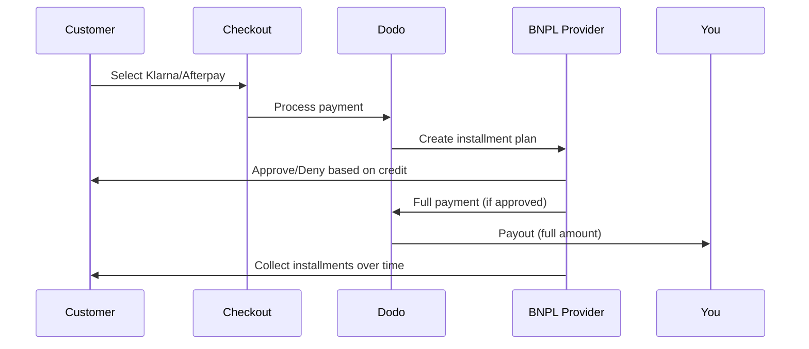

Buy Now Pay Later (BNPL)では、顧客が購入を利息なしの分割で支払えるようになるため、対象取引において平均注文額が20〜50%、コンバージョン率が10〜30%向上します。

## BNPLを提供する理由

<CardGroup cols={3}>
<Card title="Higher AOV" icon="chart-line">
顧客は支払いを分割できるとより多く購入します。平均注文額は20〜50%増加します。
</Card>

<Card title="Better Conversion" icon="percent">
チェックアウトでの支払いの摩擦をなくすことで、ハイチケット商品のコンバージョン率は10〜30%改善されます。
</Card>

<Card title="Zero Risk" icon="shield-check">
BNPLプロバイダーが信用リスクと回収を担当します。あなたは前払いで全額を受け取ります。
</Card>
</CardGroup>

## 対応プロバイダー

### Klarna

| 機能 | 詳細 |
| :------ | :------ |
| **提供地域** | 米国 + 19のヨーロッパ諸国 |
| **通貨** | USD, EUR, GBP, DKK, NOK, SEK, CZK, RON, PLN, CHF |
| **最低** | $50.01（または同等） |
| **サブスクリプション** | はい |

**対応国:** オーストリア、ベルギー、チェコ共和国、デンマーク、フィンランド、フランス、ドイツ、ギリシャ、アイルランド、イタリア、オランダ、ノルウェー、ポーランド、ポルトガル、ルーマニア、スペイン、スウェーデン、スイス、英国、米国

**支払いオプション:**
- **Pay in 4** — 利息なしの4回分割払い
- **Pay in 30 days** — 30日以内での一括支払い
- **Financing** — 長期の分割プラン

### Afterpay (Clearpay)

| Feature | Details |
| :------ | :------ |
| **Availability** | 米国、英国 |
| **Currencies** | USD, GBP |
| **Minimum** | $50.01（または同等額） |
| **Subscriptions** | なし |

**支払いオプション:**
- **Pay in 4** — 2週間ごとの利息なし4回払い

<Note>
英国ではAfterpayは「Clearpay」として運用されますが、同じAPIタイプ（`afterpay_clearpay`）を使用します。
</Note>

### Billie

| Feature | Details |
| :------ | :------ |
| **Availability** | グローバル |
| **Currencies** | GBP |
| **Minimum** | なし |
| **Subscriptions** | なし |

**Billieについて:**
BillieはB2B向けのBuy Now Pay Laterソリューションで、企業が顧客に柔軟な支払い条件を提供できるようにします。請求書ベースの支払いオプションが必要な法人取引向けに設計されています。

**支払いオプション:**
- **Invoice Payment** — 合意した支払い条件内で決済
- **Flexible Terms** — 企業向けの柔軟な支払いスケジュール

## 設定

### APIメソッドの種類

| 種類 | プロバイダー |
| :--- | :------- |
| `klarna` | Klarna |
| `afterpay_clearpay` | Afterpay / Clearpay |
| `billie` | Billie (B2B) |

### 例

```javascript
const session = await client.checkoutSessions.create({
  product_cart: [{ product_id: 'prod_123', quantity: 1 }],
  allowed_payment_method_types: [
    'klarna',
    'afterpay_clearpay',
    'credit',
    'debit'
  ],
  customer: {
    email: 'customer@example.com',
    name: 'Jane Smith'
  },
  billing_address: {
    country: 'US',
    zipcode: '10001'
  },
  return_url: 'https://example.com/success'
});
```

<Warning>
フォールバックとして、常に`credit`と`debit`を含めてください。すべての顧客がBNPLの利用資格を持つわけではなく、プロバイダーの最低金額を下回る取引は対象外となります。
</Warning>

## 取引金額の上限と下限

各BNPLプロバイダーには、独自の最低取引金額（場合によっては最高取引金額）があります。

| プロバイダー | 最低金額 | 最高金額 |
| :------- | :------ | :------ |
| Klarna | $50.01 | — |
| Afterpay | $50.01 | — |

これらのしきい値の範囲外の取引では、次のようになります。
- BNPLのオプションはチェックアウトに表示されません
- エラーは発生せず、オプションが表示されないだけです
- カード決済は引き続き利用できます

これは想定された動作です。商品の価格がそのプロバイダーの対応範囲内に収まる可能性が低い場合は、`allowed_payment_method_types`にBNPLメソッドを含めないでください。

## 分割払いの仕組み



**重要なポイント:**
- BNPLプロバイダーから**全額を前払いで受け取ります**
- **信用リスクと回収**はBNPLプロバイダーが負担します
- 顧客は通常、**4回の分割払い**でプロバイダーに直接支払います
- 分割払いの失敗による**チャージバックはありません**。これはプロバイダーが負うリスクです

## テスト

### Klarnaのテストデータ

テストモードでは、以下の情報を使用してください。

| フィールド | 承認 | 拒否 |
| :---- | :------- | :----- |
| **Date of Birth** | 07-10-1970 | 07-10-1970 |
| **First Name** | Test | Test |
| **Last Name** | Person-us | Person-us |
| **Email** | customer@email.us | customer+denied@email.us |
| **Street** | Amsterdam Ave | Amsterdam Ave |
| **House Number** | 509 | 509 |
| **City** | New York | New York |
| **State** | New York | New York |
| **Postal Code** | 10024-3941 | 10024-3941 |
| **Phone** | +13106683312 | +13106354386 |

<Note>
Klarnaをオプションとして表示するには、取引金額が少なくとも$50である必要があります。
</Note>

### Afterpayのテスト

<Steps>
<Step title="Select Afterpay">
チェックアウトでAfterpayを選択し、「Pay」をクリックします。
</Step>

<Step title="Successful payment">
有効なメールアドレスと配送先住所を使用してください。
</Step>

<Step title="Failed authentication">
失敗をテストするには、リダイレクトページでAfterpayモーダルを閉じます。Payment statusは`requires_payment_method`に遷移します。
</Step>
</Steps>

## ベストプラクティス

<AccordionGroup>
<Accordion title="Target high-ticket items">
BNPLは、$100～$1000の商品に最適です。この価格帯では、「後払い」の価値提案が最も魅力的になります。
</Accordion>

<Accordion title="Show installment amounts">
「$25を4回払い」のほうが、「Klarnaで$100」よりも魅力的です。可能な場合は、1回あたりの支払額を表示してください。
</Accordion>

<Accordion title="Don't force BNPL for low-value products">
$50未満では、いずれにしてもBNPLは表示されません。$100未満では、ほとんどの顧客がカードを選びます。BNPLのプロモーションは、より高額な商品に集中させてください。
</Accordion>

<Accordion title="Collect billing address">
BNPLプロバイダーは、信用審査のために請求先情報を必要とします。チェックアウトで住所の完全な情報を収集できるようにしてください。
</Accordion>

<Accordion title="Set clear expectations">
顧客には、自社ではなくKlarna/Afterpayとの信用契約を締結することを理解してもらう必要があります。
</Accordion>
</AccordionGroup>

## 制限事項

### サブスクリプションには非対応
BNPLの支払い方法は、**継続支払いに対応していません**。サブスクリプション商品には、カードまたはその他の継続支払いに対応した方法を使用してください。

### 信用情報に基づく承認
BNPLプロバイダーは即時に信用審査を実行します。すべての顧客が承認されるわけではありません。承認率は次の要因によって異なります。
- プロバイダーでの顧客の信用履歴
- 取引金額
- 顧客の所在地

### 通貨と国の対応関係

各通貨は、対応する地域に限定されています。

| 通貨 | 対応国 |
| :------- | :------------------ |
| **USD** | 米国のみ |
| **EUR** | 対応するすべての欧州諸国（オーストリア、ベルギー、チェコ共和国、デンマーク、フィンランド、フランス、ドイツ、ギリシャ、アイルランド、イタリア、オランダ、ノルウェー、ポーランド、ポルトガル、ルーマニア、スペイン、スウェーデン、スイス） |
| **GBP** | 英国および対応するすべての欧州諸国 |

Klarnaが対応するその他の通貨（DKK、NOK、SEK、CZK、RON、PLN、CHF）は、それぞれの対応国で利用できます。

<Info>
たとえば、USDの取引では、米国の顧客にのみBNPLオプションが表示されます。EURの取引では、対応するすべての欧州諸国でBNPLオプションが表示されます。GBPの取引では、英国および対応するすべての欧州諸国の顧客にBNPLオプションが表示されます。
</Info>

| プロバイダー | 対応通貨 |
| :------- | :------------------- |
| Klarna | USD, EUR, GBP, DKK, NOK, SEK, CZK, RON, PLN, CHF |
| Afterpay | USD (US), GBP (UK) |

## トラブルシューティング

<AccordionGroup>
<Accordion title="BNPL not appearing at checkout">
**確認事項:**
1. 取引金額はプロバイダーの対応範囲内ですか？（Klarna/Afterpay: 最低$50.01）
2. 顧客の所在地は対応国ですか？
3. 通貨はBNPLプロバイダーに対応していますか？
4. BNPLメソッドは`allowed_payment_method_types`に含まれていますか？

**解決策:** 最も一般的な原因は、取引金額が最低金額を下回っているか、最高金額を上回っていることです。金額がプロバイダーの対応範囲内に収まっていることを確認してください。
</Accordion>

<Accordion title="Customer denied by BNPL provider">
**原因:**
- プロバイダーでの信用履歴が不十分
- 有効な分割払いプランが多すぎる
- 本人確認に失敗した

**解決策:** 一部の顧客にとっては想定された結果です。カードのフォールバックを利用できるようにしてください。具体的な拒否理由は表示しないでください。
</Accordion>

<Accordion title="Payment stuck in pending">
**原因:** 顧客がBNPLプロバイダーでの認証フローを完了しなかった。

**解決策:** Payment will timeout and fail. 顧客は再試行するか、別の方法を使用できます。
</Accordion>
</AccordionGroup>

## 関連ページ

<CardGroup cols={2}>
<Card title="Payment Methods Overview" icon="credit-card" href="/features/payment-methods">
対応しているすべての支払い方法を確認します。
</Card>

<Card title="Checkout Guide" icon="book" href="/developer-resources/checkout-session">
チェックアウト実装ガイドを確認します。
</Card>

<Card title="Testing Process" icon="flask" href="/miscellaneous/testing-process">
支払い方法に関するすべてのテストデータを確認します。
</Card>

<Card title="Adaptive Currency" icon="globe" href="/features/adaptive-currency">
通貨の対応状況と換算について説明します。
</Card>
</CardGroup>