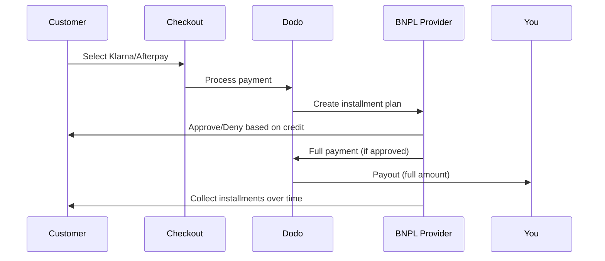

Buy Now Pay Later (BNPL)では、顧客が購入を利息なしの分割で支払えるようになるため、対象取引において平均注文額が20〜50%、コンバージョン率が10〜30%向上します。

## BNPLを提供する理由

<CardGroup cols={3}>
<Card title="Higher AOV" icon="chart-line">
顧客は支払いを分割できるとより多く購入します。平均注文額は20〜50%増加します。
</Card>

<Card title="Better Conversion" icon="percent">
チェックアウトでの支払いの摩擦をなくすことで、ハイチケット商品のコンバージョン率は10〜30%改善されます。
</Card>

<Card title="Zero Risk" icon="shield-check">
BNPLプロバイダーが信用リスクと回収を担当します。あなたは前払いで全額を受け取ります。
</Card>
</CardGroup>

## 対応プロバイダー

### Klarna

| 機能 | 詳細 |
| :------ | :------ |
| **提供地域** | 米国 + 19のヨーロッパ諸国 |
| **通貨** | USD, EUR, GBP, DKK, NOK, SEK, CZK, RON, PLN, CHF |
| **最低** | $50.01（または同等） |
| **サブスクリプション** | はい |

**対応国:** オーストリア、ベルギー、チェコ共和国、デンマーク、フィンランド、フランス、ドイツ、ギリシャ、アイルランド、イタリア、オランダ、ノルウェー、ポーランド、ポルトガル、ルーマニア、スペイン、スウェーデン、スイス、英国、米国

**支払いオプション:**
- **Pay in 4** — 利息なしの4回分割払い
- **Pay in 30 days** — 30日以内での一括支払い
- **Financing** — 長期の分割プラン

### Afterpay (Clearpay)

| Feature | Details |
| :------ | :------ |
| **Availability** | 米国、英国 |
| **Currencies** | USD, GBP |
| **Minimum** | $50.01（または同等額） |
| **Subscriptions** | なし |

**支払いオプション:**
- **Pay in 4** — 2週間ごとの利息なし4回払い

<Note>
英国ではAfterpayは「Clearpay」として運用されますが、同じAPIタイプ（`afterpay_clearpay`）を使用します。
</Note>

### Billie

| Feature | Details |
| :------ | :------ |
| **Availability** | グローバル |
| **Currencies** | GBP |
| **Minimum** | なし |
| **Subscriptions** | なし |

**Billieについて:**
BillieはB2B向けのBuy Now Pay Laterソリューションで、企業が顧客に柔軟な支払い条件を提供できるようにします。請求書ベースの支払いオプションが必要な法人取引向けに設計されています。

**支払いオプション:**
- **Invoice Payment** — 合意した支払い条件内で決済
- **Flexible Terms** — 企業向けの柔軟な支払いスケジュール

### Sunbit

| 機能 | 詳細 |
| :------ | :------ |
| **利用可能性** | US |
| **通貨** | USD |
| **最小額** | $60.00 |
| **最大額** | $19,999.00 |
| **サブスクリプション** | なし |

**支払いオプション：**
- **分割払いファイナンス** — 購入を管理可能な月々の支払いに分けます

## 設定

### APIメソッドの種類

| 種類 | プロバイダー |
| :--- | :------- |
| `klarna` | Klarna |
| `afterpay_clearpay` | Afterpay / Clearpay |
| `billie` | Billie (B2B) |
| `sunbit` | Sunbit |

### 例

```javascript
const session = await client.checkoutSessions.create({
  product_cart: [{ product_id: 'prod_123', quantity: 1 }],
  allowed_payment_method_types: [
    'klarna',
    'afterpay_clearpay',
    'credit',
    'debit'
  ],
  customer: {
    email: 'customer@example.com',
    name: 'Jane Smith'
  },
  billing_address: {
    country: 'US',
    zipcode: '10001'
  },
  return_url: 'https://example.com/success'
});
```

<Warning>
常に`credit`と`debit`をフォールバックとして含めてください。すべての顧客がBNPLに適格ではなく、プロバイダーの最小額を下回る取引は適格ではありません。
</Warning>

## 取引額の制限

各BNPLプロバイダーにはそれぞれの最低（および時には最大）取引額があります：

| プロバイダー | 最小額 | 最大額 |
| :------- | :------ | :------ |
| Klarna | $50.01 | — |
| Afterpay | $50.01 | — |
| Sunbit | $60.00 | $19,999.00 |

これらの基準を超えた取引：
- BNPLオプションはチェックアウトに表示されません
- エラーは表示されません — 単にオプションが表示されません
- カード決済は利用可能なままです

これは予想される動作です。あなたの製品価格がそのプロバイダーのサポート範囲に収まる可能性が低い場合は、`allowed_payment_method_types`にBNPL方法を含めないでください。

## 分割払いの仕組み



**重要ポイント：**
- あなたにはBNPLプロバイダーから**全額前払い**が支払われます
- BNPLプロバイダーが**信用リスクと回収業務**を担当します
- 顧客はプロバイダーに直接**通常4回の支払い**で支払います
- 分割払いの失敗による**チャージバックはありません** — それはプロバイダーのリスクです

## テスト

### Klarnaテストデータ

テストモードで次の詳細を使用します：

| 項目 | 承認済み | 拒否されました |
| :---- | :------- | :----- |
| **生年月日** | 07-10-1970 | 07-10-1970 |
| **名前** | Test | Test |
| **姓** | Person-us | Person-us |
| **メール** | customer@email.us | customer+denied@email.us |
| **通り** | Amsterdam Ave | Amsterdam Ave |
| **番地** | 509 | 509 |
| **市区町村** | New York | New York |
| **州** | New York | New York |
| **郵便番号** | 10024-3941 | 10024-3941 |
| **電話** | +13106683312 | +13106354386 |

<Note>
Klarnaがオプションとして表示されるには、トランザクションは少なくとも$50でなければなりません。
</Note>

### Afterpayテスト

<Steps>
<Step title="Select Afterpay">
チェックアウトでAfterpayを選び、支払いをクリックします。
</Step>

<Step title="Successful payment">
有効なメールと配送先住所を使用します。
</Step>

<Step title="Failed authentication">
失敗をテストするには、リダイレクトページでAfterpayモーダルを閉じてください。支払い状態は`requires_payment_method`に遷移します。
</Step>
</Steps>

### Sunbitテスト

<Steps>
<Step title="Set billing country and currency">
チェックアウトセッションには`billing_address.country`が`US`に設定され、`billing_currency`が`USD`に設定されていることを確認してください。
</Step>

<Step title="Use a qualifying amount">
トランザクション額を**$60.00から$19,999.00**の間に設定します。この範囲外ではSunbitは表示されません。
</Step>

<Step title="Select Sunbit">
チェックアウトでSunbitを選び、Sunbitモーダルでファイナンス申請フローを完了します。
</Step>

<Step title="Test failure">
申請が拒否されるのをシミュレートするには、フローを完了する前にSunbitモーダルを閉じます。支払いは`requires_payment_method`に遷移します。
</Step>
</Steps>

<Note>
SunbitはUSの顧客でUSDの支払いを行う場合にのみ利用可能です。取引額は$60.00から$19,999.00の間でなければなりません。
</Note>

## ベストプラクティス

<AccordionGroup>
<Accordion title="Target high-ticket items">
BNPLは$100-$1000の製品で最も効果的です。「時間をかけて支払う」という価値提案はこの範囲で最も説得力があります。
</Accordion>

<Accordion title="Show installment amounts">
「4回の支払い $25」は、「$100をKlarnaで支払い」と比べてより説得力があります。可能な場合は支払いごとの金額を表示してください。
</Accordion>

<Accordion title="Don't force BNPL for low-value products">
$50未満ではBNPLは表示されません。$100未満では多くの顧客がカードを好みます。高価格商品のプロモーションにBNPLを集中させます。
</Accordion>

<Accordion title="Collect billing address">
BNPLプロバイダーはクレジットチェックのために請求情報を必要とします。チェックアウト時に完全な住所の詳細を収集してください。
</Accordion>

<Accordion title="Set clear expectations">
顧客はKlarna/Afterpayとクレジット契約に入ることを理解する必要があります。
</Accordion>
</AccordionGroup>

## 制限事項

### サブスクリプションなし
BNPL支払い方法は**定期支払いをサポートしていません**。サブスクリプション製品には、カードまたは他の定期互換の方法を使用します。

### クレジットベースの承認
BNPLプロバイダーは即座に信用調査を行います。すべての顧客が承認されるわけではありません。承認率は以下によって異なります：
- プロバイダーとの顧客の信用履歴
- 取引額
- 顧客の所在地

### 通貨と国の対応

各通貨はそれに対応する地域に制限されています：

| 通貨 | 対応する国 |
| :------- | :------------------ |
| **USD** | アメリカ合衆国のみ |
| **EUR** | すべての対応する欧州国（オーストリア、ベルギー、チェコ共和国、デンマーク、フィンランド、フランス、ドイツ、ギリシャ、アイルランド、イタリア、オランダ、ノルウェー、ポーランド、ポルトガル、ルーマニア、スペイン、スウェーデン、スイス） |
| **GBP** | イギリスおよびすべての対応する欧州国 |

Klarnaがサポートする他の通貨（DKK、NOK、SEK、CZK、RON、PLN、CHF）は、それぞれの国で利用可能です。

<Info>
例えば、USDの取引は米国の顧客にのみBNPLオプションを表示します。EURの取引はすべての対応する欧州国にBNPLオプションを表示し、GBPの取引は英国内およびすべての対応する欧州国の顧客にBNPLオプションを表示します。
</Info>

| プロバイダー | サポートされている通貨 |
| :------- | :------------------- |
| Klarna | USD、EUR、GBP、DKK、NOK、SEK、CZK、RON、PLN、CHF |
| Afterpay | USD（米国）、GBP（英国） |
| Sunbit | USD（米国） |

## トラブルシューティング

<AccordionGroup>
<Accordion title="BNPL not appearing at checkout">
**確認事項：**
1. 取引額がプロバイダーのサポート範囲内か？（Klarna/Afterpay：最小$50.01；Sunbit：$60.00–$19,999.00）
2. 顧客の所在地がサポートされている国にあるか？
3. 通貨がBNPLプロバイダーでサポートされているか？
4. BNPL方法が`allowed_payment_method_types`に含まれているか？

**解決策：** 最も一般的な問題は、取引が最小または最大を下回ることです。金額がプロバイダーのサポート範囲内にあることを確認してください。
</Accordion>

<Accordion title="Customer denied by BNPL provider">
**原因：**
- プロバイダーとの信用履歴が不十分
- アクティブな分割払いプランが多すぎる
- 身元確認が失敗した

**解決策：** これは一部の顧客には予想されることです。カードのフォールバックが利用可能であることを確認してください。特定の否認理由を公開しないでください。
</Accordion>

<Accordion title="Payment stuck in pending">
**原因：** 顧客がBNPLプロバイダーとの認証フローを完了しなかった。

**解決策：** 支払いはタイムアウトし失敗します。顧客は再試行するか別の方法を使用することができます。
</Accordion>
</AccordionGroup>

## 関連ページ

<CardGroup cols={2}>
<Card title="Payment Methods Overview" icon="credit-card" href="/features/payment-methods">
サポートされているすべての支払い方法を確認してください。
</Card>

<Card title="Checkout Guide" icon="book" href="/developer-resources/checkout-session">
完全なチェックアウト実装ガイド。
</Card>

<Card title="Testing Process" icon="flask" href="/miscellaneous/testing-process">
支払い方法のテストデータの詳細。
</Card>

<Card title="Adaptive Currency" icon="globe" href="/features/adaptive-currency">
通貨サポートと変換。
</Card>
</CardGroup>