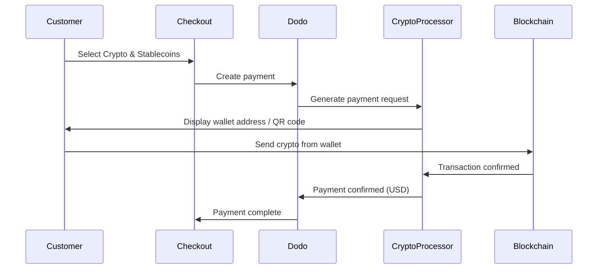

暗号通貨 & ステーブルコイン決済では、インドを除く世界中のどこからでも暗号通貨やステーブルコインを使用して支払うことができます。取引はUSDで請求されるため、顧客は好みの暗号ウォレットで支払いながら、あなたは法定通貨を受け取ります。

## 暗号通貨 & ステーブルコインを提供する理由は？

<CardGroup cols={3}>
<Card title="Global Reach" icon="globe">
顧客側に銀行インフラが不要で、どの国からでも支払いを受け入れられます。
</Card>

<Card title="No Chargebacks" icon="shield-check">
暗号取引は取り消し不可能であり、チャージバック詐欺を完全に排除します。
</Card>

<Card title="USD Settlement" icon="dollar-sign">
USDを受け取り、暗号のボラティリティやウォレットを管理する必要はありません。
</Card>
</CardGroup>

## 概要

| 詳細 | 値 |
| :----- | :---- |
| **請求通貨** | USD |
| **対応国** | グローバル（インドを除く） |
| **サブスクリプション** | なし |
| **最小金額** | $0.50 |
| **精算** | USD |

## 仕組み



## 顧客体験

1. 顧客がチェックアウトで暗号通貨 & ステーブルコインを選択
2. 暗号での金額と一緒にウォレットアドレスとQRコードを表示
3. 顧客が暗号ウォレットから正確な金額を送信
4. トランザクションがブロックチェーンで確認される
5. 顧客は成功ページにリダイレクトされる

<Info>
暗号支払いはUSDで請求されます。チェックアウト時に表示される暗号金額は、支払い時点でのリアルタイムの為替レートを反映しています。
</Info>

## 対応通貨とネットワーク

| 通貨 | ネットワーク |
| :------- | :------- |
| **USDC** | Ethereum, Solana, Polygon, Base |
| **USDP** | Ethereum, Solana |
| **USDG** | Ethereum |

## 設定

```javascript
const session = await client.checkoutSessions.create({
  product_cart: [{ product_id: 'prod_123', quantity: 1 }],
  allowed_payment_method_types: ['crypto', 'credit', 'debit'],
  return_url: 'https://example.com/success'
});
```

## API メソッドタイプ

| タイプ | メソッド | 国 |
| :--- | :----- | :------ |
| `crypto` | 暗号通貨 & ステーブルコイン | グローバル（インドを除く） |

## テスト

<Steps>
<Step title="Enable test mode">
Dodo Payments のテストAPIキーを使用してください。
</Step>

<Step title="Create a test checkout">
許可された支払い方法に `crypto` を含むチェックアウトセッションを作成します。
</Step>

<Step title="Complete the test flow">
テスト環境で暗号支払いのシミュレートフローに従ってください。
</Step>
</Steps>

## ベストプラクティス

<AccordionGroup>
<Accordion title="Always include card fallbacks">
すべての顧客が暗号ウォレットを持っているわけではありません。常に `credit` および `debit` をフォールバック支払い方法として含めてください。
</Accordion>

<Accordion title="Set clear expectations on confirmation time">
ネットワークによっては、ブロックチェーンの確認に時間がかかることがあります。チェックアウト時にこれを顧客に通知するようにしてください。
</Accordion>

<Accordion title="Handle underpayments and overpayments">
暗号支払いは、ネットワーク料金により請求額が若干異なることがあります。支払いステータスの更新を監視するためにWebhookを使用してください。
</Accordion>
</AccordionGroup>

## トラブルシューティング

<AccordionGroup>
<Accordion title="Crypto not appearing at checkout">
**確認:**
1. `crypto` が `allowed_payment_method_types` に含まれていますか？
2. トランザクション金額が最低額（$0.50）を満たしていますか？

**解決策:** 支払い方法のタイプがAPIリクエストで正しく渡されていることを確認してください。
</Accordion>

<Accordion title="Payment not confirming">
**原因:** ブロックチェーンの確認時間は異なります。一部のネットワークは他よりも長くかかります。

**解決策:** Webhookの確認を待ちます。確認ウィンドウが終了するまでは支払いを失敗と見なさないでください。
</Accordion>

<Accordion title="Amount mismatch">
**原因:** 支払い開始から送信までの間に暗号通貨の為替レートが変動することがあります。

**解決策:** Webhookで最終確認済みの金額を監視してください。小さな差異は自動的に処理されます。
</Accordion>
</AccordionGroup>

## 関連ページ

<CardGroup cols={2}>
<Card title="Payment Methods Overview" icon="credit-card" href="/features/payment-methods">
サポートされているすべての支払い方法をご覧ください。
</Card>

<Card title="Checkout Guide" icon="book" href="/developer-resources/checkout-session">
完全なチェックアウト実装ガイド。
</Card>

<Card title="Webhooks" icon="webhook" href="/developer-resources/webhooks">
非同期で支払い確認を処理します。
</Card>

<Card title="Testing Process" icon="flask" href="/miscellaneous/testing-process">
すべての支払い方法の完全なテストガイド。
</Card>
</CardGroup>
