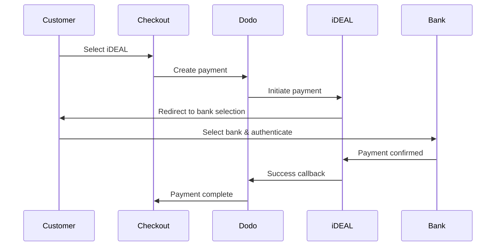
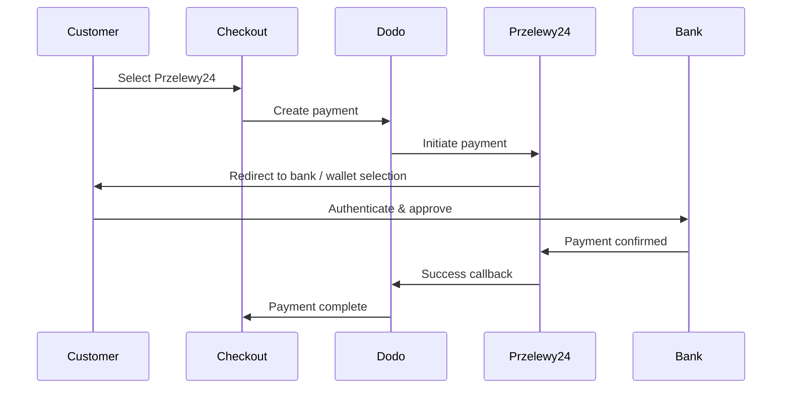

ヨーロッパの顧客は、銀行システムと統合されたローカルな支払い方法を強く好みます。これらの方法を提供することで、ターゲット市場でのコンバージョン率が20〜40％向上します。

## なぜローカルなヨーロッパの支払い方法が必要なのか？

<CardGroup cols={3}>
<Card title="Higher Conversion" icon="chart-line">
iDEALはオランダのオンライン決済の約60%を占めます。提供しないと顧客を失うことになります。
</Card>

<Card title="Lower Fraud" icon="shield-check">
銀行で認証される支払いは不正がほぼゼロでチャージバックもありません。
</Card>

<Card title="Real-Time Settlement" icon="bolt">
ほとんどのヨーロッパの決済手段は即時の支払い確認を提供します。
</Card>
</CardGroup>

## 対応方法

| Method | Country | Market Share | Currency | Subscriptions |
| :----- | :------ | :----------- | :------- | :-----------: |
| **iDEAL** | オランダ | ~60% | EUR | No |
| **Bancontact** | ベルギー | ~50% | EUR | No |
| **EPS** | オーストリア | ~30% | EUR | No |
| **Multibanco** | ポルトガル | ~40% | EUR | No |
| **Przelewy24 (P24)** | ポーランド | ~30% | PLN | No |

## iDEAL（オランダ）

iDEALはオランダにおける主要なオンライン支払い方法であり、すべての主要なオランダの銀行に直接接続しています。

### 仕組み



### 対応銀行

すべての主要なオランダの銀行がサポートされています：
- ABN AMRO
- ASN Bank
- Bunq
- ING
- Knab
- Rabobank
- RegioBank
- Revolut
- SNS
- Triodos Bank
- Van Lanschot

### 設定

```javascript
const session = await client.checkoutSessions.create({
  product_cart: [{ product_id: 'prod_123', quantity: 1 }],
  allowed_payment_method_types: ['ideal', 'credit', 'debit'],
  billing_currency: 'EUR',
  billing_address: {
    country: 'NL',
    zipcode: '1012JS'
  },
  return_url: 'https://example.com/success'
});
```

## Bancontact（ベルギー）

Bancontactはベルギーの全国的な支払いスキームであり、ほぼすべてのベルギーの銀行がオンライン支払いに利用しています。

### 特徴
- 既存のベルギーのデビットカードと連携
- モバイルアプリのサポート（Payconiq by Bancontact）
- 即時の支払い確認
- 顧客の追加登録不要

### 設定

```javascript
const session = await client.checkoutSessions.create({
  product_cart: [{ product_id: 'prod_123', quantity: 1 }],
  allowed_payment_method_types: ['bancontact_card', 'credit', 'debit'],
  billing_currency: 'EUR',
  billing_address: {
    country: 'BE',
    zipcode: '1000'
  },
  return_url: 'https://example.com/success'
});
```

## EPS（オーストリア）

EPS（電子決済標準）は、オーストリアの顧客のための直接オンライン銀行振込を可能にします。

### 特徴
- オーストリアの銀行との直接統合
- リアルタイムの支払い確認
- オーストリアの消費者の間で高い信頼性
- チャージバックなし

### 対応銀行

主要なオーストリアの銀行には：
- Erste Bank
- Bank Austria
- Raiffeisen
- BAWAG
- Volksbank

### 設定

```javascript
const session = await client.checkoutSessions.create({
  product_cart: [{ product_id: 'prod_123', quantity: 1 }],
  allowed_payment_method_types: ['eps', 'credit', 'debit'],
  billing_currency: 'EUR',
  billing_address: {
    country: 'AT',
    zipcode: '1010'
  },
  return_url: 'https://example.com/success'
});
```

## Multibanco（ポルトガル）

Multibancoはポルトガルのインターバンクネットワークであり、オンライン支払いとATMベースの支払いの両方を提供しています。

### 支払いオプション

1. **オンラインバンキング** — インターネットバンキングを介した直接銀行振込
2. **ATM支払い** — 顧客は、任意のMultibancoATMで支払うためのリファレンスを受け取ります
3. **モバイルバンキング** — 銀行モバイルアプリを通じた支払い

### ATM支払いの仕組み

ATM支払いの場合、顧客は支払いリファレンスを受け取ります：

```
Entity: 12345
Reference: 123 456 789
Amount: €50.00
Expiry: 24 hours
```

顧客はこのリファレンスを使って、任意のポルトガルのATMまたはオンラインバンキングで支払うことができます。

### 設定

```javascript
const session = await client.checkoutSessions.create({
  product_cart: [{ product_id: 'prod_123', quantity: 1 }],
  allowed_payment_method_types: ['multibanco', 'credit', 'debit'],
  billing_currency: 'EUR',
  billing_address: {
    country: 'PT',
    zipcode: '1000-001'
  },
  return_url: 'https://example.com/success'
});
```

<Note>
MultibancoのATM支払いはチェックアウトと実際の支払いの間に遅延が生じる場合があります。支払い確認にはWebhookを監視してください。
</Note>

## Przelewy24 (ポーランド)

Przelewy24 (P24) はポーランドで主要なオンライン決済方法で、すべての主要なポーランドの銀行を対象に銀行振込と地域のウォレットを集約しています。他のヨーロッパの方法とは異なり、Przelewy24 は **PLN**（ポーランドズロチ）で決済され、EUR ではありません。

### 仕組み



### 利用可能性

- **請求通貨:** PLNのみ
- **取引タイプ:** 一回払いのみ（サブスクリプションは利用不可）
- **カバー範囲:** すべての主要なポーランドの銀行と人気のローカルウォレット

### 設定

```javascript
const session = await client.checkoutSessions.create({
  product_cart: [{ product_id: 'prod_123', quantity: 1 }],
  allowed_payment_method_types: ['przelewy24', 'credit', 'debit'],
  billing_currency: 'PLN',
  billing_address: {
    country: 'PL',
    zipcode: '00-001'
  },
  return_url: 'https://example.com/success'
});
```

Przelewy24 requires a **PLN** billing currency. If you quote your prices in EUR, enable [Adaptive Currency](/features/adaptive-currency) so Polish customers are billed in PLN and Przelewy24 becomes available.

## API メソッドタイプ

| Type | Method | Country |
| :--- | :----- | :------ |
| `ideal` | iDEAL | オランダ |
| `bancontact_card` | Bancontact | ベルギー |
| `eps` | EPS | オーストリア |
| `multibanco` | Multibanco | ポルトガル |
| `przelewy24` | Przelewy24 (P24) | ポーランド |

## マルチカントリー欧州チェックアウト

複数のヨーロッパ諸国にサービスを提供する企業は、すべての地域の方法を含めてください：

```javascript
const session = await client.checkoutSessions.create({
  product_cart: [{ product_id: 'prod_123', quantity: 1 }],
  allowed_payment_method_types: [
    'ideal',           // Netherlands
    'bancontact_card', // Belgium
    'eps',             // Austria
    'multibanco',      // Portugal
    'przelewy24',      // Poland (requires PLN billing currency)
    'credit',          // Fallback
    'debit'            // Fallback
  ],
  billing_currency: 'EUR',
  return_url: 'https://example.com/success'
});
```

Dodoは顧客の所在地に基づいて関連する方法のみを自動的に表示します。オランダの顧客にはiDEALが表示され、ベルギーの顧客にはBancontactが表示されます。

## テスト

ヨーロッパの決済方法はサンドボックスモードでテストできます。テストフローは銀行の認証プロセスをシミュレートします。

Use your Dodo Payments test API keys.

Set the billing address country to match the payment method:
- `NL` for iDEAL
- `BE` for Bancontact
- `AT` for EPS
- `PT` for Multibanco
- `PL` for Przelewy24 (with PLN billing currency)

Follow the simulated bank authentication flow in the test environment.

## ベストプラクティス

If you sell to Dutch customers, include iDEAL. Not doing so is like not accepting Visa in the US — you'll lose significant sales.

Most European payment methods require EUR — ensure your pricing supports Euro transactions. The one exception is Przelewy24, which is offered only on **PLN** (Polish Złoty) billing.

All European methods involve redirects to bank sites. Ensure your return URL handling is robust and accounts for users who abandon mid-flow.

Not all European customers have access to these regional methods (tourists, expats, etc.). Always include `credit` and `debit` as fallbacks.

Multibanco ATM payments may take hours to complete. Don't block fulfillment on immediate payment — use webhooks for async confirmation.

## トラブルシューティング

**Check:**
1. Customer billing country matches method's country?
2. Currency set to EUR?
3. Method included in `allowed_payment_method_types`?

**Solution:** European methods are strictly regional. A customer with billing country `DE` (ドイツ) won't see iDEAL, which is Netherlands-only.

**Causes:**
- Customer cancelled during bank authentication
- Bank's authentication system temporarily unavailable
- Customer entered incorrect credentials

**Solution:** Customer should retry. If persistent, suggest trying a different payment method.

**Causes:**
- Customer closed browser during bank redirect
- Network issues during authentication
- Return URL misconfigured

**Solution:** Verify return URL is correct and accessible. Ensure it handles both success and failure states.

**Cause:** Customer received payment reference but hasn't paid yet.

**Solution:** This is expected for ATM-based payments. Wait for webhook confirmation. Reference typically expires in 24-72 hours.

## PSD2コンプライアンス

すべてのヨーロッパの決済方法はPSD2（決済サービス指令2）の規制に準拠しています：

- **強力な顧客認証（SCA）** — 銀行認証フローに組み込み
- **安全な通信** — すべてのデータは安全なチャネルを通じて送信
- **消費者保護** — EUの消費者権利に完全準拠

## 関連ページ

See all supported payment methods.

Currency support and automatic conversion.

Complete checkout implementation guide.

Handle payment confirmations asynchronously.