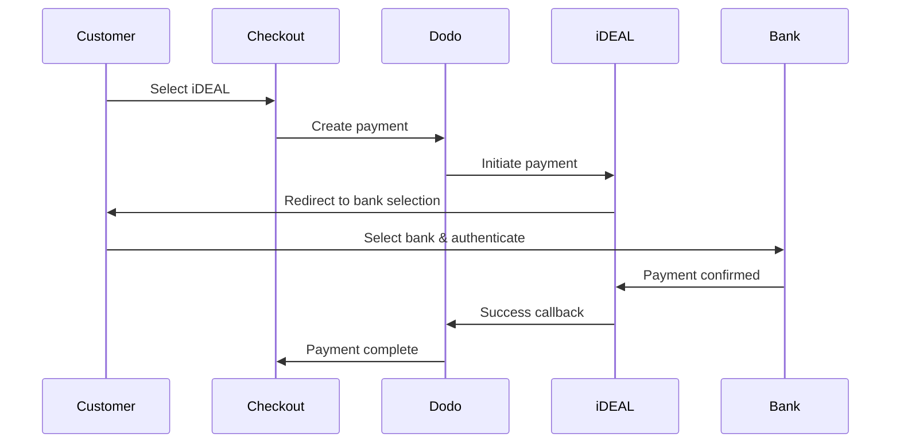
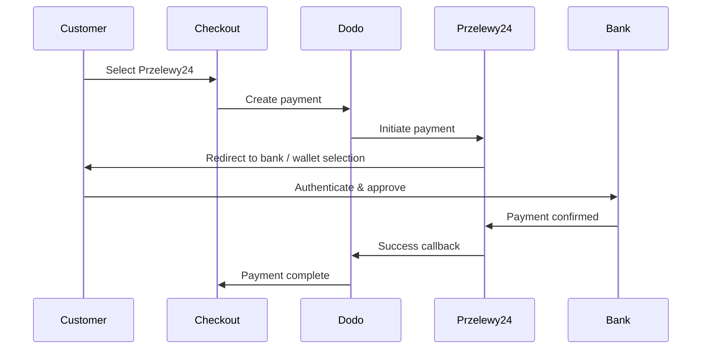
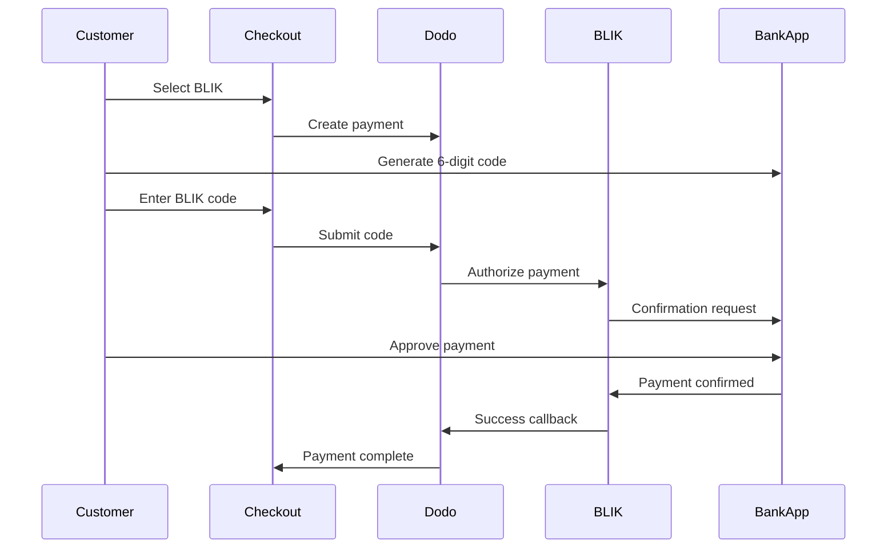

ヨーロッパの顧客は、銀行システムと連携する現地の決済方法を強く好みます。これらの決済方法を提供することで、対象市場のコンバージョン率を20～40%向上させられます。

## なぜヨーロッパの現地決済方法なのか？

<CardGroup cols={3}>
<Card title="Higher Conversion" icon="chart-line">
iDEALはオランダのオンライン決済の約60%を占めています。対応しなければ、顧客を失うことになります。
</Card>

<Card title="Lower Fraud" icon="shield-check">
銀行認証による決済は不正利用率がほぼゼロで、チャージバックもありません。
</Card>

<Card title="Real-Time Settlement" icon="bolt">
ヨーロッパの多くの決済方法では、決済確認が即座に行われます。
</Card>
</CardGroup>

## 対応している決済方法

| Method | Country | Market Share | Currency | Subscriptions |
| :----- | :------ | :----------- | :------- | :-----------: |
| **iDEAL** | オランダ | 約60% | EUR | No |
| **Bancontact** | ベルギー | 約50% | EUR | No |
| **EPS** | オーストリア | 約30% | EUR | No |
| **Multibanco** | ポルトガル | 約40% | EUR | No |
| **Przelewy24 (P24)** | ポーランド | 約30% | PLN | No |
| **BLIK** | ポーランド | 約60% | PLN | No |
| **SEPA Direct Debit** | ユーロ圏 | 広く利用 | EUR | No |
| **Satispay** | ヨーロッパ（イタリア） | 成長中 | EUR | Yes |

## iDEAL（オランダ）

iDEALはオランダで主流のオンライン決済方法で、オランダの主要銀行すべてに直接接続します。

### 仕組み



### 対応銀行

オランダの主要銀行すべてに対応しています。
- ABN AMRO
- ASN Bank
- Bunq
- ING
- Knab
- Rabobank
- RegioBank
- Revolut
- SNS
- Triodos Bank
- Van Lanschot

### 設定

```javascript
const session = await client.checkoutSessions.create({
  product_cart: [{ product_id: 'prod_123', quantity: 1 }],
  allowed_payment_method_types: ['ideal', 'credit', 'debit'],
  billing_currency: 'EUR',
  billing_address: {
    country: 'NL',
    zipcode: '1012JS'
  },
  return_url: 'https://example.com/success'
});
```

## Bancontact（ベルギー）

Bancontactはベルギーの国営決済スキームで、オンライン決済ではほぼすべてのベルギーの銀行で利用されています。

### 特徴
- 既存のベルギーのデビットカードで利用可能
- モバイルアプリに対応（Payconiq by Bancontact）
- 決済確認が即座に行われる
- 顧客による追加登録が不要

### 設定

```javascript
const session = await client.checkoutSessions.create({
  product_cart: [{ product_id: 'prod_123', quantity: 1 }],
  allowed_payment_method_types: ['bancontact_card', 'credit', 'debit'],
  billing_currency: 'EUR',
  billing_address: {
    country: 'BE',
    zipcode: '1000'
  },
  return_url: 'https://example.com/success'
});
```

## EPS（オーストリア）

EPS（Electronic Payment Standard）は、オーストリアの顧客向けにオンライン銀行からの直接振込を可能にします。

### 特徴
- オーストリアの銀行と直接連携
- リアルタイムの決済確認
- オーストリアの消費者から高い信頼
- チャージバックなし

### 対応銀行

以下を含むオーストリアの主要銀行に対応しています。
- Erste Bank
- Bank Austria
- Raiffeisen
- BAWAG
- Volksbank

### 設定

```javascript
const session = await client.checkoutSessions.create({
  product_cart: [{ product_id: 'prod_123', quantity: 1 }],
  allowed_payment_method_types: ['eps', 'credit', 'debit'],
  billing_currency: 'EUR',
  billing_address: {
    country: 'AT',
    zipcode: '1010'
  },
  return_url: 'https://example.com/success'
});
```

## Multibanco（ポルトガル）

Multibancoはポルトガルの銀行間ネットワークで、オンライン決済とATM決済の両方を提供します。

### 決済オプション

1. **オンラインバンキング** — インターネットバンキングによる直接銀行振込
2. **ATM決済** — 顧客はMultibancoのATMで支払うための照会番号を受け取ります
3. **モバイルバンキング** — 銀行のモバイルアプリで決済

### ATM決済の仕組み

ATM決済では、顧客が決済用の照会番号を受け取ります。

```
Entity: 12345
Reference: 123 456 789
Amount: €50.00
Expiry: 24 hours
```

顧客はこの照会番号を使って、ポルトガル国内の任意のATMまたはオンラインバンキングから支払えます。

### 設定

```javascript
const session = await client.checkoutSessions.create({
  product_cart: [{ product_id: 'prod_123', quantity: 1 }],
  allowed_payment_method_types: ['multibanco', 'credit', 'debit'],
  billing_currency: 'EUR',
  billing_address: {
    country: 'PT',
    zipcode: '1000-001'
  },
  return_url: 'https://example.com/success'
});
```

<Note>
MultibancoのATM決済では、チェックアウトから実際の支払いまでに遅延が発生する場合があります。決済確認についてはwebhookを監視してください。
</Note>

## Przelewy24（ポーランド）

Przelewy24（P24）はポーランドを代表するオンライン決済方法で、ポーランドの主要銀行すべての銀行振込と現地ウォレットを集約します。ほかのヨーロッパの決済方法とは異なり、Przelewy24の決済通貨はEURではなく**PLN**（ポーランドズウォティ）です。

### 仕組み



### 利用可能状況

- **請求通貨:** PLNのみ
- **取引タイプ:** 1回限りの決済のみ（サブスクリプションには利用できません）
- **対応範囲:** ポーランドの主要銀行すべて、および人気の現地ウォレット

### 設定

```javascript
const session = await client.checkoutSessions.create({
  product_cart: [{ product_id: 'prod_123', quantity: 1 }],
  allowed_payment_method_types: ['przelewy24', 'credit', 'debit'],
  billing_currency: 'PLN',
  billing_address: {
    country: 'PL',
    zipcode: '00-001'
  },
  return_url: 'https://example.com/success'
});
```

<Note>
Przelewy24には**PLN**の請求通貨が必要です。EURで価格を提示している場合は[Adaptive Currency](/features/adaptive-currency)を有効にすると、ポーランドの顧客にはPLNで請求され、Przelewy24を利用できるようになります。
</Note>

## BLIK（ポーランド）

BLIKはポーランドで最も人気のあるモバイル決済方法です。顧客は、銀行アプリで生成した1回限りの6桁コードを使って支払えます。Przelewy24と同様に、BLIKの決済通貨はEURではなく**PLN**（ポーランドズウォティ）です。

### 仕組み



### 利用可能状況

- **請求通貨:** PLNのみ
- **取引タイプ:** 1回限りの決済のみ（サブスクリプションには利用できません）
- **対応範囲:** BLIKに対応するポーランドの主要銀行すべて

### 設定

```javascript
const session = await client.checkoutSessions.create({
  product_cart: [{ product_id: 'prod_123', quantity: 1 }],
  allowed_payment_method_types: ['blik', 'credit', 'debit'],
  billing_currency: 'PLN',
  billing_address: {
    country: 'PL',
    zipcode: '00-001'
  },
  return_url: 'https://example.com/success'
});
```

<Note>
BLIKには**PLN**の請求通貨が必要です。EURで価格を提示している場合は[Adaptive Currency](/features/adaptive-currency)を有効にすると、ポーランドの顧客にはPLNで請求され、BLIKを利用できるようになります。
</Note>

## SEPA Direct Debit（ユーロ圏）

SEPA Direct Debitを利用すると、ユーロ圏全域の顧客はカードを使わず、銀行口座から直接支払えます。1回限りの支払いでは、EURチェックアウトで利用できます。

### 仕組み

顧客はチェックアウト中に引き落としを承認し、支払いは銀行口座から回収されます。このページにあるほとんどのヨーロッパの決済手段とは異なり、確認は即時ではありません。

<Warning>
SEPA Direct Debitは即時決済ではありません。支払いの確認には**6営業日**かかるため、承認を決済完了として扱わないでください。支払いが成功状態になるまで、フルフィルメントを実行しないでください。
</Warning>

### 利用可能状況

- **請求通貨:** EUR
- **取引タイプ:** 1回限りの支払いのみ（サブスクリプションでは利用できません）

### 設定

```javascript
const session = await client.checkoutSessions.create({
  product_cart: [{ product_id: 'prod_123', quantity: 1 }],
  allowed_payment_method_types: ['sepa', 'credit', 'debit'],
  billing_currency: 'EUR',
  billing_address: {
    country: 'DE',
    zipcode: '10115'
  },
  return_url: 'https://example.com/success'
});
```

## Satispay（ヨーロッパ）

Satispayは、特にイタリアで広く利用されているヨーロッパのモバイル決済ネットワークです。カード情報や銀行情報を共有せず、Satispayアプリから直接支払えます。Satispayの決済通貨は**EUR**です。

### 機能

- カードネットワークに依存しないアプリベースの決済
- イタリアで高い普及率を持ち、その他のヨーロッパ市場でも拡大中
- 1回限りの支払いとサブスクリプションの両方に対応

### 利用可能状況

- **請求通貨:** EUR
- **取引タイプ:** 1回限りの支払いとサブスクリプション

### 設定

```javascript
const session = await client.checkoutSessions.create({
  product_cart: [{ product_id: 'prod_123', quantity: 1 }],
  allowed_payment_method_types: ['satispay', 'credit', 'debit'],
  billing_currency: 'EUR',
  billing_address: {
    country: 'IT',
    zipcode: '00100'
  },
  return_url: 'https://example.com/success'
});
```

## API Method Types

| Type | Method | Country |
| :--- | :----- | :------ |
| `ideal` | iDEAL | オランダ |
| `bancontact_card` | Bancontact | ベルギー |
| `eps` | EPS | オーストリア |
| `multibanco` | Multibanco | ポルトガル |
| `przelewy24` | Przelewy24 (P24) | ポーランド |
| `blik` | BLIK | ポーランド |
| `sepa` | SEPA Direct Debit | ユーロ圏 |
| `satispay` | Satispay | ヨーロッパ（イタリア） |

## 複数のヨーロッパ諸国に対応するチェックアウト

複数のヨーロッパ諸国の顧客にサービスを提供する事業者は、地域ごとのすべての決済手段を含めてください。

```javascript
const session = await client.checkoutSessions.create({
  product_cart: [{ product_id: 'prod_123', quantity: 1 }],
  allowed_payment_method_types: [
    'ideal',           // Netherlands
    'bancontact_card', // Belgium
    'eps',             // Austria
    'multibanco',      // Portugal
    'przelewy24',      // Poland (requires PLN billing currency)
    'blik',            // Poland (requires PLN billing currency)
    'sepa',            // Eurozone (one-time payments only)
    'satispay',        // Europe / Italy
    'credit',          // Fallback
    'debit'            // Fallback
  ],
  billing_currency: 'EUR',
  return_url: 'https://example.com/success'
});
```

Dodoは、顧客の所在地に基づいて関連する決済手段のみを自動的に表示します。オランダの顧客にはiDEALが表示され、ベルギーの顧客にはBancontactが表示されます。

## テスト

ヨーロッパの決済手段はsandboxモードでテストできます。テストフローでは、銀行認証プロセスをシミュレートします。

<Steps>
<Step title="Enable test mode">
Dodo PaymentsのテストAPIキーを使用してください。
</Step>

<Step title="Set appropriate billing address">
請求先住所の国を決済手段に合わせて設定してください。
- `NL`（iDEALの場合）
- `BE`（Bancontactの場合）
- `AT`（EPSの場合）
- `PT`（Multibancoの場合）
- `PL`（Przelewy24とBLIKの場合。請求通貨はPLN）
- `IT`（Satispayの場合）
</Step>

<Step title="Complete the test flow">
テスト環境でシミュレートされた銀行認証フローに従ってください。
</Step>
</Steps>

## ベストプラクティス

<AccordionGroup>
<Accordion title="Always include regional methods for target markets">
オランダの顧客に販売する場合は、iDEALを含めてください。これは、米国でVisaに対応しないようなもので、大きな売上機会を失うことになります。
</Accordion>

<Accordion title="Match currency to region">
ヨーロッパの決済手段の多くではEURが必要です。料金設定がユーロでの取引に対応していることを確認してください。唯一の例外はPrzelewy24で、**PLN**（ポーランドズウォティ）の請求でのみ利用できます。
</Accordion>

<Accordion title="Handle redirects gracefully">
ヨーロッパのすべての決済手段では、銀行サイトへのリダイレクトが発生します。return URLの処理が堅牢で、フローの途中で離脱したユーザーにも対応できることを確認してください。
</Accordion>

<Accordion title="Provide card fallbacks">
ヨーロッパの顧客すべてが、これらの地域固有の決済手段（旅行者、国外居住者など）を利用できるとは限りません。必ず`credit`と`debit`をフォールバックとして含めてください。
</Accordion>

<Accordion title="Consider Multibanco timing">
MultibancoのATM支払いは完了までに数時間かかる場合があります。即時の支払い完了を条件にフルフィルメントをブロックせず、非同期確認にはwebhooksを使用してください。
</Accordion>
</AccordionGroup>

## トラブルシューティング

<AccordionGroup>
<Accordion title="European method not appearing">
**確認項目:**
1. 顧客の請求先国は決済手段の国と一致していますか？
2. 通貨はEURに設定されていますか？
3. `allowed_payment_method_types`に決済手段が含まれていますか？

**解決策:** ヨーロッパの決済手段は地域が厳密に限定されています。請求先国が`DE`（ドイツ）の顧客には、オランダでのみ利用できるiDEALは表示されません。
</Accordion>

<Accordion title="Bank authentication failed">
**原因:**
- 銀行認証中に顧客がキャンセルした
- 銀行の認証システムが一時的に利用できない
- 顧客が誤った認証情報を入力した

**解決策:** 顧客に再試行してもらってください。問題が続く場合は、別の決済手段を試すよう案内してください。
</Accordion>

<Accordion title="Redirect not completing">
**原因:**
- 銀行へのリダイレクト中に顧客がブラウザを閉じた
- 認証中にネットワークの問題が発生した
- return URLの設定が正しくない

**解決策:** return URLが正しく、アクセス可能であることを確認してください。成功状態と失敗状態の両方を処理できることを確認してください。
</Accordion>

<Accordion title="Multibanco payment pending">
**原因:** 顧客は支払い参照番号を受け取りましたが、まだ支払っていません。

**解決策:** ATMベースの支払いでは想定される状態です。webhookによる確認を待ってください。参照番号は通常24～72時間で期限切れになります。
</Accordion>
</AccordionGroup>

## PSD2への準拠

ヨーロッパのすべての決済手段は、PSD2（Payment Services Directive 2）の規制に準拠しています。

- **Strong Customer Authentication (SCA)** — 銀行認証フローに組み込まれています
- **Secure Communication** — すべてのデータは安全なチャネル経由で送信されます
- **Consumer Protection** — EUの消費者権利に完全準拠しています

## 関連ページ

<CardGroup cols={2}>
<Card title="Payment Methods Overview" icon="credit-card" href="/features/payment-methods">
対応しているすべての決済手段を確認します。
</Card>

<Card title="Adaptive Currency" icon="globe" href="/features/adaptive-currency">
通貨の対応状況と自動変換について説明します。
</Card>

<Card title="Checkout Guide" icon="book" href="/developer-resources/checkout-session">
チェックアウト実装の完全ガイドです。
</Card>

<Card title="Webhooks" icon="webhook" href="/developer-resources/webhooks">
支払い確認を非同期で処理します。
</Card>
</CardGroup>