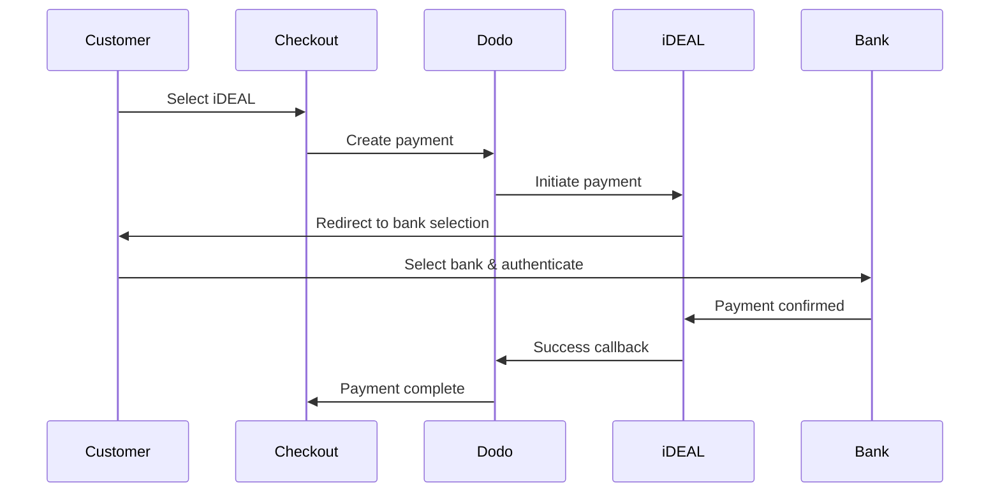
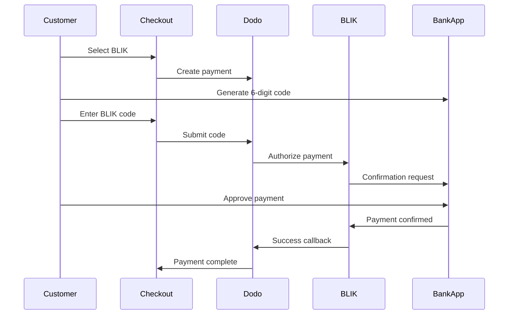
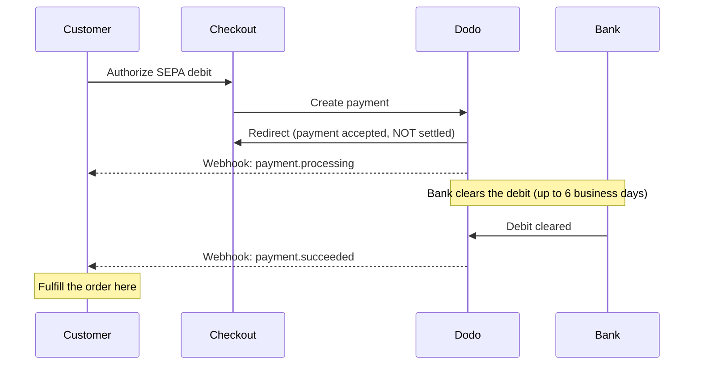

ヨーロッパの顧客は、銀行システムと連携する現地の決済方法を強く好みます。これらの決済方法を提供することで、対象市場のコンバージョン率を20～40%向上させられます。

## なぜヨーロッパの現地決済方法なのか？

<CardGroup cols={3}>
<Card title="Higher Conversion" icon="chart-line">
iDEALはオランダのオンライン決済の約60%を占めています。対応しなければ、顧客を失うことになります。
</Card>

<Card title="Lower Fraud" icon="shield-check">
銀行認証による決済は不正利用率がほぼゼロで、チャージバックもありません。
</Card>

<Card title="Real-Time Settlement" icon="bolt">
ヨーロッパの多くの決済方法では、決済確認が即座に行われます。
</Card>
</CardGroup>

## 対応している決済方法

| Method | Country | Market Share | Currency | Subscriptions |
| :----- | :------ | :----------- | :------- | :-----------: |
| **iDEAL** | オランダ | 約60% | EUR | No |
| **Bancontact** | ベルギー | 約50% | EUR | No |
| **EPS** | オーストリア | 約30% | EUR | No |
| **Multibanco** | ポルトガル | 約40% | EUR | No |
| **BLIK** | ポーランド | 約60% | PLN | No |
| **SEPA Direct Debit** | ユーロ圏 | 広く利用 | EUR | No |
| **Satispay** | ヨーロッパ（イタリア） | 成長中 | EUR | Yes |

## iDEAL（オランダ）

iDEALはオランダで主流のオンライン決済方法で、オランダの主要銀行すべてに直接接続します。

### 仕組み



### 対応銀行

オランダの主要銀行すべてに対応しています。
- ABN AMRO
- ASN Bank
- Bunq
- ING
- Knab
- Rabobank
- RegioBank
- Revolut
- SNS
- Triodos Bank
- Van Lanschot

### 設定

```javascript
const session = await client.checkoutSessions.create({
  product_cart: [{ product_id: 'pdt_123', quantity: 1 }],
  allowed_payment_method_types: ['ideal', 'credit', 'debit'],
  billing_currency: 'EUR',
  billing_address: {
    country: 'NL',
    zipcode: '1012JS'
  },
  return_url: 'https://example.com/success'
});
```

## Bancontact（ベルギー）

Bancontactはベルギーの国営決済スキームで、オンライン決済ではほぼすべてのベルギーの銀行で利用されています。

### 特徴
- 既存のベルギーのデビットカードで利用可能
- モバイルアプリに対応（Payconiq by Bancontact）
- 決済確認が即座に行われる
- 顧客による追加登録が不要

### 設定

```javascript
const session = await client.checkoutSessions.create({
  product_cart: [{ product_id: 'pdt_123', quantity: 1 }],
  allowed_payment_method_types: ['bancontact_card', 'credit', 'debit'],
  billing_currency: 'EUR',
  billing_address: {
    country: 'BE',
    zipcode: '1000'
  },
  return_url: 'https://example.com/success'
});
```

## EPS（オーストリア）

EPS（Electronic Payment Standard）は、オーストリアの顧客向けにオンライン銀行からの直接振込を可能にします。

### 特徴
- オーストリアの銀行と直接連携
- リアルタイムの決済確認
- オーストリアの消費者から高い信頼
- チャージバックなし

### 対応銀行

以下を含むオーストリアの主要銀行に対応しています。
- Erste Bank
- Bank Austria
- Raiffeisen
- BAWAG
- Volksbank

### 設定

```javascript
const session = await client.checkoutSessions.create({
  product_cart: [{ product_id: 'pdt_123', quantity: 1 }],
  allowed_payment_method_types: ['eps', 'credit', 'debit'],
  billing_currency: 'EUR',
  billing_address: {
    country: 'AT',
    zipcode: '1010'
  },
  return_url: 'https://example.com/success'
});
```

## Multibanco（ポルトガル）

Multibancoはポルトガルの銀行間ネットワークで、オンライン決済とATM決済の両方を提供します。

### 決済オプション

1. **オンラインバンキング** — インターネットバンキングによる直接銀行振込
2. **ATM決済** — 顧客はMultibancoのATMで支払うための照会番号を受け取ります
3. **モバイルバンキング** — 銀行のモバイルアプリで決済

### ATM決済の仕組み

ATM決済では、顧客が決済用の照会番号を受け取ります。

```
Entity: 12345
Reference: 123 456 789
Amount: €50.00
Expiry: 24 hours
```

顧客はこの照会番号を使って、ポルトガル国内の任意のATMまたはオンラインバンキングから支払えます。

### 設定

```javascript
const session = await client.checkoutSessions.create({
  product_cart: [{ product_id: 'pdt_123', quantity: 1 }],
  allowed_payment_method_types: ['multibanco', 'credit', 'debit'],
  billing_currency: 'EUR',
  billing_address: {
    country: 'PT',
    zipcode: '1000-001'
  },
  return_url: 'https://example.com/success'
});
```

<Note>
MultibancoのATM決済では、チェックアウトから実際の支払いまでに遅延が発生する場合があります。決済確認についてはwebhookを監視してください。
</Note>

## BLIK（ポーランド）

BLIKはポーランドで最も普及しているモバイル決済方法です。顧客は、銀行アプリで生成された一度限りの6桁コードを使って支払えます。BLIKの決済通貨はEURではなく、**PLN**（ポーランドズウォティ）です。

### 仕組み



### 利用可能状況

- **請求通貨:** PLNのみ
- **取引タイプ:** 1回限りの支払いのみ（サブスクリプションでは利用不可）
- **対応範囲:** BLIKに対応するポーランドの主要銀行すべて

### 設定

```javascript
const session = await client.checkoutSessions.create({
  product_cart: [{ product_id: 'pdt_123', quantity: 1 }],
  allowed_payment_method_types: ['blik', 'credit', 'debit'],
  billing_currency: 'PLN',
  billing_address: {
    country: 'PL',
    zipcode: '00-001'
  },
  return_url: 'https://example.com/success'
});
```

<Note>
BLIKには**PLN**の請求通貨が必要です。EURで価格を提示している場合は、[Adaptive Currency](/features/adaptive-currency)を有効にして、ポーランドの顧客への請求をPLNにすると、BLIKを利用できるようになります。
</Note>

## SEPA Direct Debit（ユーロ圏）

SEPA Direct Debitを利用すると、ユーロ圏の顧客はカードを使わず、銀行口座から直接支払えます。1回限りの支払いでは、EURのチェックアウトで利用できます。

<Warning>
**SEPA Direct Debit は即時ではありません — 支払いの確認には最大 6 営業日かかります。** このページにある他のすべての方法とは異なり、チェックアウト時に顧客が引き落としを承認しても、**入金が確定したことを意味しません**。チェックアウトのリダイレクト時、または `payment.processing` の時点では、決して注文を履行しないでください。`payment.succeeded` webhook を待ってください。
</Warning>

### 仕組み

顧客がチェックアウト中に引き落としを承認すると、Dodo Payments が顧客の銀行口座から資金を回収します。銀行による引き落としの決済は非同期で行われるため、支払いは最終的な結果に到達する前に `processing` 状態を経由します。



### 支払いのタイムライン

| 段階 | タイミング | 支払いステータス | 意味 |
| :---- | :--- | :------------- | :------------ |
| **承認** | チェックアウト時 | `processing` | 顧客が引き落としを承認し、リダイレクトされて戻ってきた状態です。まだ資金は移動していないため、履行しないでください。 |
| **確認** | 最大 **6 営業日**後 | `succeeded` | 銀行が引き落としを決済した状態です。この時点で注文を履行してください。 |
| **失敗** | 最大 **6 営業日**後 | `failed` | 引き落としを回収できなかった状態です（例：残高不足）。履行せず、顧客に通知してください。 |

顧客がサイトを離れてから数日後に確認が届くため、アクセスを付与する処理はチェックアウトのリダイレクトではなく webhook ハンドラーで行う必要があります。以下の [確認の遅延への対処](#handling-the-confirmation-delay) を参照してください。

### 利用可否

- **請求通貨:** EUR
- **取引タイプ:** 1 回限りの支払いのみ（サブスクリプションでは利用できません）

### 設定

```javascript
const session = await client.checkoutSessions.create({
  product_cart: [{ product_id: 'pdt_123', quantity: 1 }],
  allowed_payment_method_types: ['sepa', 'credit', 'debit'],
  billing_currency: 'EUR',
  billing_address: {
    country: 'DE',
    zipcode: '10115'
  },
  return_url: 'https://example.com/success'
});
```

### SEPA Test IBAN

テストモードでは、チェックアウト時に以下の IBAN のいずれかを入力すると、特定の結果を強制できます。

| Test IBAN | 動作 |
| :-------- | :------- |
| `DE89370400440532013000` | 支払いが成功します。 |
| `DE08370400440532013003` | 少なくとも 3 分の遅延後に支払いが成功します。 |
| `DE62370400440532013001` | 支払いが失敗します。 |
| `DE78370400440532013004` | 少なくとも 3 分の遅延後に支払いが失敗します。 |
| `DE35370400440532013002` | 支払いが成功した直後に dispute されます。 |
| `DE65370400440002222227` | 残高不足により支払いが失敗します。 |
| `DE18370400440000066666` | 銀行口座を使用できないため、支払い方法を作成できません。 |

国固有の動作をテストするには、別の Eurozone 国に対応する成功用 IBAN を使用してください。

| 国 | 成功用 IBAN |
| :------ | :----------- |
| Austria | `AT611904300234573201` |
| Belgium | `BE62510007547061` |
| Estonia | `EE382200221020145685` |
| Finland | `FI2112345600000785` |
| France | `FR1420041010050500013M02606` |
| Ireland | `IE29AIBK93115212345678` |
| Luxembourg | `LU280019400644750000` |

<Note>
遅延テスト用 IBAN は、アクセスを付与する処理がチェックアウトのリダイレクトではなく webhook ハンドラーによって行われることを確認するのに役立ちます。SEPA の支払いは、顧客がチェックアウトを離れたかなり後に確認されるためです。
</Note>

### 確認の遅延への対処

SEPA はチェックアウト後、最大 6 営業日かけて決済されるため、支払いが確定したかどうかをブラウザーのリダイレクトだけで判断することはできません。代わりに、webhook イベントに基づいて履行を進めてください。`payload.type` を有効にし、各段階を処理します。

| イベントタイプ | 発生時点 | 対応 |
| :--------- | :------------ | :--------- |
| `payment.processing` | 顧客がチェックアウト時に引き落としを承認し、リダイレクトされて戻った時点。 | **履行しないでください。** 注文を保留中としてマークし、必要に応じて支払いを処理中であることを顧客に伝えます。 |
| `payment.succeeded` | 銀行が引き落としを決済した時点（最大 6 営業日後）。 | 注文を履行します — アクセスを付与し、商品をプロビジョニングし、レシートを送信します。 |
| `payment.failed` | 引き落としを回収できなかった時点。 | 顧客に通知して再試行を促します。履行しないでください。 |

```javascript Handling SEPA payment events expandable
app.post('/webhooks/dodo', async (req, res) => {
  const event = req.body;

  switch (event.type) {
    case 'payment.processing': {
      // SEPA debit authorized but NOT settled — this can last up to 6 business days.
      // Record the order as pending; do not grant access yet.
      await markOrderPending(event.data.payment_id);
      break;
    }
    case 'payment.succeeded': {
      // The debit cleared — safe to fulfill now.
      await fulfillOrder(event.data.payment_id);
      break;
    }
    case 'payment.failed': {
      // The debit could not be collected (e.g. insufficient funds).
      await markOrderFailed(event.data.payment_id);
      // Notify the customer and prompt a retry.
      break;
    }
  }

  res.json({ received: true });
});
```

<Tip>
必ず **webhook の `payment.succeeded` で履行**し、チェックアウトのリダイレクト時や `payment.processing` の時点では決して履行しないでください。リダイレクトは顧客が引き落としを承認した瞬間、つまり実際に入金が確定する数日前に発生します。処理前に webhook の署名を検証してください。設定については [Webhooks ガイド](/developer-resources/webhooks)、イベント一覧については [Webhook Event Guide](/developer-resources/webhooks/intents/webhook-events-guide) を参照してください。
</Tip>

<Warning>
チェックアウト時に顧客の期待値を適切に設定してください。アクセスは引き落としが決済された後にのみ付与されるため、SEPA の顧客には注文を処理中であり、支払いが確認され次第通知されることを伝えます。そうしないと、カード決済のように即時アクセスできると期待する可能性があります。
</Warning>

## Satispay（Europe）

Satispay は、特に Italy で普及している European のモバイル決済ネットワークです。カード情報や銀行情報を共有せず、顧客が Satispay アプリから直接支払えるようにします。Satispay の決済通貨は **EUR** です。

### 特徴

- カードネットワークに依存しないアプリベースの支払い
- Italy 全域で高い普及率があり、他の European 市場でも拡大中
- 1 回限りの支払いとサブスクリプションの両方をサポート

### 利用可否

- **請求通貨:** EUR
- **取引タイプ:** 1 回限りの支払いとサブスクリプション

### 設定

```javascript
const session = await client.checkoutSessions.create({
  product_cart: [{ product_id: 'pdt_123', quantity: 1 }],
  allowed_payment_method_types: ['satispay', 'credit', 'debit'],
  billing_currency: 'EUR',
  billing_address: {
    country: 'IT',
    zipcode: '00100'
  },
  return_url: 'https://example.com/success'
});
```

## API Method Types

| Type | Method | Country |
| :--- | :----- | :------ |
| `ideal` | iDEAL | Netherlands |
| `bancontact_card` | Bancontact | Belgium |
| `eps` | EPS | Austria |
| `multibanco` | Multibanco | Portugal |
| `blik` | BLIK | Poland |
| `sepa` | SEPA Direct Debit | Eurozone |
| `satispay` | Satispay | Europe (Italy) |

## 複数国向け European チェックアウト

複数の European 国の顧客にサービスを提供するビジネスでは、地域に対応するすべての支払い方法を含めてください。

```javascript
const session = await client.checkoutSessions.create({
  product_cart: [{ product_id: 'pdt_123', quantity: 1 }],
  allowed_payment_method_types: [
    'ideal',           // Netherlands
    'bancontact_card', // Belgium
    'eps',             // Austria
    'multibanco',      // Portugal
    'blik',            // Poland (requires PLN billing currency)
    'sepa',            // Eurozone (one-time payments only)
    'satispay',        // Europe / Italy
    'credit',          // Fallback
    'debit'            // Fallback
  ],
  billing_currency: 'EUR',
  return_url: 'https://example.com/success'
});
```

Dodo は、顧客の所在地に基づいて関連する支払い方法のみを自動的に表示します。Dutch の顧客には iDEAL が、Belgian の顧客には Bancontact が表示されます。

## テスト

European の支払い方法は Test Mode でテストできます。テストフローでは、銀行認証プロセスをシミュレートします。

<Note>
SEPA Direct Debit のテスト方法は異なります。シミュレートされた銀行フローの代わりに、テスト用 IBAN を直接入力します。[SEPA Test IBAN](#sepa-test-ibans) を参照してください。
</Note>

<Steps>
<Step title="Enable test mode">
Dodo Payments のテスト API キーを使用してください。
</Step>

<Step title="Set appropriate billing address">
支払い方法に合わせて請求先住所の国を設定してください。
- `NL`（iDEAL）
- `BE`（Bancontact）
- `AT`（EPS）
- `PT`（Multibanco）
- `PL`（BLIK、請求通貨は PLN）
- `IT`（Satispay）
</Step>

<Step title="Complete the test flow">
テスト環境でシミュレートされた銀行認証フローに従ってください。
</Step>
</Steps>

## ベストプラクティス

<AccordionGroup>
<Accordion title="Always include regional methods for target markets">
Dutch の顧客に販売する場合は、iDEAL を含めてください。これは US で Visa を受け付けないようなもので、大幅に売上を失うことになります。
</Accordion>

<Accordion title="Match currency to region">
European の支払い方法のほとんどでは EUR が必要です。価格設定が Euro 取引に対応していることを確認してください。唯一の例外は BLIK で、**PLN**（Polish Złoty）の請求でのみ提供されます。
</Accordion>

<Accordion title="Handle redirects gracefully">
European のすべての支払い方法では、銀行サイトへのリダイレクトが発生します。return URL の処理が堅牢で、フローの途中で離脱するユーザーにも対応できることを確認してください。
</Accordion>

<Accordion title="Provide card fallbacks">
European の顧客全員がこれらの地域固有の支払い方法を利用できるわけではありません（観光客、国外居住者など）。常に `credit` と `debit` をフォールバックとして含めてください。
</Accordion>

<Accordion title="Consider Multibanco timing">
Multibanco の ATM 支払いは完了までに数時間かかることがあります。即時の支払い完了を条件に履行をブロックせず、非同期の確認には webhook を使用してください。
</Accordion>

<Accordion title="Account for the SEPA 6-day delay">
SEPA Direct Debit の確認には最大 **6 営業日**かかります。チェックアウトのリダイレクト時や `payment.processing` の時点では決して履行せず、`payment.succeeded` webhook からのみアクセスを付与してください。また、顧客が注文は保留中であると理解できるよう、チェックアウト時に期待値を設定してください。[確認の遅延への対処](#handling-the-confirmation-delay) を参照してください。
</Accordion>
</AccordionGroup>

## トラブルシューティング

<AccordionGroup>
<Accordion title="European method not appearing">
**確認項目:**
1. 顧客の請求先の国は支払い方法の国と一致していますか？
2. 通貨は EUR に設定されていますか？
3. 支払い方法は `allowed_payment_method_types` に含まれていますか？

**解決策:** European の支払い方法は地域が厳密に限定されています。請求先の国が `DE`（Germany）の顧客には、Netherlands 専用の iDEAL は表示されません。
</Accordion>

<Accordion title="Bank authentication failed">
**原因:**
- 顧客が銀行認証中にキャンセルした
- 銀行の認証システムが一時的に利用できない
- 顧客が誤った認証情報を入力した

**解決策:** 顧客に再試行してもらってください。問題が続く場合は、別の支払い方法を試すよう案内してください。
</Accordion>

<Accordion title="Redirect not completing">
**原因:**
- 顧客が銀行へのリダイレクト中にブラウザーを閉じた
- 認証中にネットワークの問題が発生した
- return URL の設定が誤っている

**解決策:** return URL が正しく、アクセス可能であることを確認してください。成功状態と失敗状態の両方を処理できることを確認してください。
</Accordion>

<Accordion title="Multibanco payment pending">
**原因:** 顧客は支払い参照番号を受け取りましたが、まだ支払っていません。

**解決策:** ATM ベースの支払いでは想定される動作です。webhook による確認を待ってください。通常、参照番号は 24～72 時間で期限切れになります。
</Accordion>

<Accordion title="SEPA payment stuck in processing">
**原因:** SEPA Direct Debit は顧客の銀行を通じて非同期に決済されます。

**解決策:** 想定される動作です。`payment.processing` 状態は、引き落としが決済されるまで最大 **6 営業日**続くことがあります。最終状態である `payment.succeeded`（履行）または `payment.failed`（履行しない）の webhook を待ってください。チェックアウトのリダイレクトを確認として扱わないでください。[確認の遅延への対処](#handling-the-confirmation-delay) を参照してください。
</Accordion>
</AccordionGroup>

## PSD2 コンプライアンス

European のすべての支払い方法は PSD2（Payment Services Directive 2）規制に準拠しています。

- **Strong Customer Authentication (SCA)** — 銀行認証フローに組み込まれています
- **Secure Communication** — すべてのデータが安全なチャネル経由で送信されます
- **Consumer Protection** — EU の消費者権利に完全準拠しています

## 関連ページ

<CardGroup cols={2}>
<Card title="Payment Methods Overview" icon="credit-card" href="/features/payment-methods">
サポートされているすべての支払い方法を確認します。
</Card>

<Card title="Adaptive Currency" icon="globe" href="/features/adaptive-currency">
通貨のサポートと自動換算について説明します。
</Card>

<Card title="Checkout Guide" icon="book" href="/developer-resources/checkout-session">
チェックアウト実装の完全ガイドです。
</Card>

<Card title="Webhooks" icon="webhook" href="/developer-resources/webhooks">
支払い確認を非同期で処理します。
</Card>
</CardGroup>