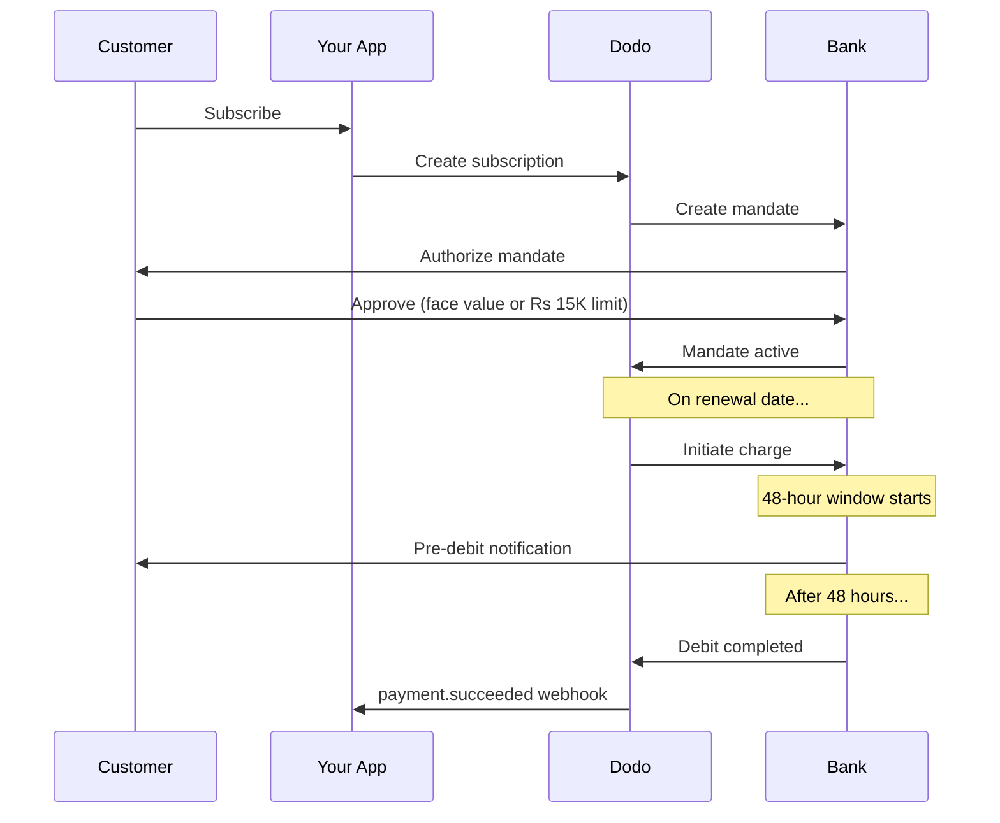

インドには独自の決済インフラがあり、UPI（デジタル取引の60%以上）とインド発行のカード（Visa、Mastercard、Rupayなど）が中心です。Dodo Paymentsは、サブスクリプションmandateに関するRBIの完全なコンプライアンスとともに、これらすべてに対応しています。

## インドの決済方法が重要な理由

<CardGroup cols={3}>
<Card title="UPI Dominance" icon="mobile">
UPIは月間100億件以上の取引を処理します。多くのインドの顧客は国際カードを持っていません。
</Card>

<Card title="Low Transaction Costs" icon="indian-rupee-sign">
UPIの取引手数料はほぼゼロです。取引量が多く、取引単価が低い場合に最適です。
</Card>

<Card title="Subscription Support" icon="repeat">
ほとんどの代替決済方法とは異なり、UPIおよびインド発行のすべてのカード（Visa、Mastercard、Rupayなど）は、RBI mandateによる継続課金に対応しています。
</Card>
</CardGroup>

## 対応している方法

| 方法 | 種類 | サブスクリプション | 最低金額 |
| :----- | :--- | :-----------: | :--------- |
| **UPI Collect** | QRコード / VPA | Yes* | ₹1 |
| **Rupay Credit** | カード | Yes* | ₹1 |
| **Rupay Debit** | カード | Yes* | ₹1 |

*サブスクリプションには、特別な処理ルールを伴うRBI準拠のmandateが必要です。48時間の処理遅延は、インド発行のすべてのカードとUPIに適用されます。

## 設定

### API Method Types

| 種類 | 説明 |
| :--- | :---------- |
| `upi_collect` | QRコードまたはVPA入力によるUPI |
| `credit` | Rupayを含むクレジットカード |
| `debit` | Rupayを含むデビットカード |

### 例：インド向けCheckout

```javascript
const session = await client.checkoutSessions.create({
  product_cart: [{ product_id: 'pdt_123', quantity: 1 }],
  allowed_payment_method_types: [
    'upi_collect',
    'credit',
    'debit'
  ],
  billing_currency: 'INR',
  customer: {
    email: 'customer@example.in',
    name: 'Priya Sharma',
    phone_number: '+919876543210'
  },
  billing_address: {
    country: 'IN',
    zipcode: '560001'
  },
  return_url: 'https://example.com/success'
});
```

### UPIの要件

UPIをCheckoutに表示するには、次の条件を満たす必要があります。
1. **Billing country**がインドであること（`IN`）
2. **Currency**がINRであること
3. インド国外のMerchantの場合：**Adaptive Currency**が有効になっていること

<Warning>
インド国外のMerchantで、Adaptive Currencyが有効になっていない場合、顧客はUPIを利用できません。
</Warning>

## RBI Mandateによるサブスクリプション

インドの決済方法を使用するサブスクリプションは、RBI（Reserve Bank of India）の規制に基づいて運用され、独自の要件があります。

### RBI Mandateの仕組み



### Mandateの種類

| サブスクリプション金額 | Mandateの種類 | 上限 |
| :------------------ | :----------- | :---- |
| **mandate floor未満** | オンデマンドmandate | Mandate floor（デフォルト₹15,000） |
| **mandate floor以上** | 固定金額mandate | サブスクリプションの正確な金額 |

顧客の銀行に登録される金額は`max(mandate_floor, billing_amount)`です。そのため、floorを下回る金額を請求する場合、floorは実質的に顧客に表示される**承認上限**となります。

**プラン変更に関する重要事項：**アップグレードによって既存のmandate上限を超える請求が発生する場合、請求は失敗し、顧客は再承認する必要があります。

### 設定可能なMandate Floor

INR e-mandateのmandate floorは、`mandate_min_amount_inr_paise`フィールド（**INR paise**単位 — 1 INR = 100 paise）で設定できます。システムのデフォルトである₹15,000は、次の3つのレベルで上書きできます。

| レベル | 設定場所 | 範囲 |
|-------|--------------|-------|
| **リクエスト単位** | チェックアウトセッションまたはサブスクリプション上の `mandate_min_amount_inr_paise` | 1件の取引 |
| **マーチャント** | ビジネス設定 | すべてのINRサブスクリプション |
| **システム** | — | ₹15,000（デフォルト） |

適用の優先順位：リクエスト単位の上書き → Merchant設定 → システムデフォルト。

```typescript
// Per-checkout override
const session = await client.checkoutSessions.create({
  product_cart: [{ product_id: 'pdt_inr_monthly', quantity: 1 }],
  mandate_min_amount_inr_paise: 2_000_000, // ₹20,000 ceiling
  return_url: 'https://yoursite.com/return'
});

// Per-subscription override
const subscription = await client.subscriptions.create({
  product_id: 'pdt_inr_monthly',
  quantity: 1,
  customer: { email: 'customer@example.in' },
  billing: { country: 'IN', /* ... */ },
  mandate_min_amount_inr_paise: 2_000_000
});
```

| フィールド | 型 | Validation | 適用対象 |
|-------|------|------------|------------|
| `mandate_min_amount_inr_paise` | `integer`（INR paise） | `>= 1` | Airwallex以外のconnectorにおける、インド発行カードによるINRサブスクリプション |

<Info>
floorを高く設定すると、顧客に再承認を求めることなく、後からより高額な単発請求（たとえばプランのアップグレードや従量課金による超過料金）に対応できます。floorを低く設定すると、顧客の承認額を実際の請求額に近づけられますが、将来の変動請求に対応する余裕は小さくなります。
</Info>

<Warning>
この設定は、INRサブスクリプションでインド発行カード（Visa、Mastercard、RuPay）に登録されたe-mandateにのみ影響します。UPIサブスクリプションは独自のAutoPayフローに従うため、影響を受けません。
</Warning>

### 48時間の処理遅延

これは国際カード決済との最も重要な違いです。

<Steps>
<Step title="Charge Initiated (Day 0)">
スケジュールされた更新日に、Dodoが銀行に請求を開始します。
</Step>

<Step title="Pre-Debit Notification">
顧客は、今後予定されている引き落としについて銀行から通知を受け取ります。
</Step>

<Step title="48-Hour Window">
顧客はこの期間中、銀行アプリからmandateをキャンセルできます。
</Step>

<Step title="Debit Completed (~48-51 hours)">
48時間後（銀行の処理にさらに最大3時間かかる場合があります）に、資金が引き落とされます。
</Step>

<Step title="Webhook Sent">
`payment.succeeded` webhookは、開始時ではなく実際の引き落とし後に送信されます。
</Step>
</Steps>

<Warning>
**請求開始時に特典を付与しないでください。**`payment.succeeded` webhookを待ってください。このwebhookは、スケジュールされた請求日の約48〜51時間後に届きます。
</Warning>

### 48時間の猶予期間の処理

```javascript
// DON'T do this:
async function handleSubscriptionRenewal(subscription) {
  // ❌ Bad: Granting access immediately when charge is initiated
  grantPremiumAccess(subscription.customer_id);
}

// DO this:
async function handlePaymentWebhook(event) {
  if (event.type === 'payment.succeeded') {
    // ✅ Good: Only grant access after payment is confirmed
    grantPremiumAccess(event.data.customer_id);
  }
  
  if (event.type === 'payment.failed') {
    // Handle failed payment (mandate cancelled, insufficient funds)
    revokePremiumAccess(event.data.customer_id);
  }
}
```

### インドのサブスクリプション向けWebhookイベント

| Event | タイミング | Action |
| :---- | :--- | :----- |
| `subscription.active` | Mandateが承認されたとき | サブスクリプションの開始を記録 |
| `payment.succeeded` | 請求日から約48時間後 | アクセスを付与／継続 |
| `payment.failed` | 引き落としに失敗したとき | 顧客に通知し、アクセスを一時停止 |
| `subscription.on_hold` | Paymentに失敗したとき | Payment methodの更新を促す |
| `subscription.active` | Payment後に再有効化されたとき | アクセスを復元 |

## テスト

### UPIテストID

| Status | UPI ID |
| :----- | :----- |
| Success | `success@upi` |
| Failure | `failure@upi` |

### インドのカードテスト番号

| Brand | Scenario | Card Number | Expiry | CVV |
| :---- | :------- | :---------- | :----- | :-- |
| Visa | Success | `4576238912771450` | 06/32 | 123 |
| Visa | Declined | `4706131211212123` | 06/32 | 123 |
| Mastercard | Success | `5409162669381034` | 06/32 | 123 |
| Mastercard | Declined | `5105105105105100` | 06/32 | 123 |

## ベストプラクティス

<AccordionGroup>
<Accordion title="Plan for the 48-hour delay">
請求開始から実際のPaymentまでの間隔に対応できるよう、アプリケーションを構築してください。次の点を検討します。
- サブスクリプションアクセスの猶予期間
- 処理時間について顧客に明確に伝えること
- 日付ではなくwebhookを起点としたfulfillment
</Accordion>

<Accordion title="Handle mandate cancellations">
顧客はいつでも銀行アプリからmandateをキャンセルできます。`subscription.on_hold` webhookを監視し、再度サブスクライブするかPayment methodを更新するよう顧客に促してください。
</Accordion>

<Accordion title="Set appropriate mandate amounts">
変動価格（例：従量課金）では、Rs 15,000のオンデマンドmandateで十分かどうかを検討してください。請求額がこれを超える可能性がある場合、顧客は再承認する必要があります。
</Accordion>

<Accordion title="Offer UPI prominently">
インドの顧客には、UPIを主要な決済オプションにすることを推奨します。多くのユーザーは、使い慣れていて手間が少ないため、カードよりもUPIを好みます。
</Accordion>
</AccordionGroup>

## トラブルシューティング

<AccordionGroup>
<Accordion title="UPI not appearing at checkout">
**確認事項：**
1. Billing countryが`IN`に設定されていますか？
2. Currencyが`INR`に設定されていますか？
3. インド国外のMerchantの場合：Adaptive Currencyが有効になっていますか？
4. `upi_collect`が`allowed_payment_method_types`に含まれていますか？

**解決策：**Billing addressに`country: "IN"`と`billing_currency: "INR"`が含まれていることを確認してください。
</Accordion>

<Accordion title="Subscription charge failed after upgrade">
**原因：**新しい請求額が既存のmandate上限（Rs 15,000のしきい値）を超えています。

**解決策：**顧客はPayment methodを更新し、正しい上限で新しいmandateを設定する必要があります。
</Accordion>

<Accordion title="Subscription on hold but customer claims they didn't cancel">
**原因：**顧客が48時間の期間中にmandateをキャンセルしたか、銀行が引き落としを拒否した可能性があります。

**解決策：**顧客はmandateを再承認するか、Payment methodを更新する必要があります。
</Accordion>

<Accordion title="Payment deduction delayed beyond 48 hours">
**原因：**銀行APIの遅延により、処理にさらに2〜3時間かかる場合があります。

**解決策：**これは想定される動作です。合計で約51時間までの変動する遅延に対応できるよう、システムを構築してください。
</Accordion>

<Accordion title="Mandate cancelled but subscription still active">
**原因：**RBI規制におけるエッジケースです。処理期間中のmandateのキャンセルは、サブスクリプションを直ちにはキャンセルしません。

**解決策：**次回の請求は失敗し、サブスクリプションは`on_hold`に移行します。`payment.failed`のwebhookを監視してください。
</Accordion>
</AccordionGroup>

## 関連ページ

<CardGroup cols={2}>
<Card title="Payment Methods Overview" icon="credit-card" href="/features/payment-methods">
対応しているすべての決済方法を確認できます。
</Card>

<Card title="Subscriptions" icon="repeat" href="/features/subscription">
RBI mandateを含むサブスクリプションの完全なドキュメントです。
</Card>

<Card title="Webhooks" icon="webhook" href="/developer-resources/webhooks">
Paymentイベントのwebhook処理について説明します。
</Card>

<Card title="Testing Process" icon="flask" href="/miscellaneous/testing-process">
UPI IDやインドのカードを含むすべてのテストデータです。
</Card>
</CardGroup>