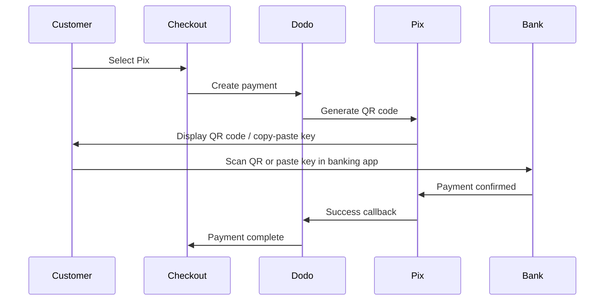

Pixはブラジル中央銀行（Banco Central do Brasil）が作成したブラジルの即時決済システムです。週末や祝日を含む24時間リアルタイムでの振込を可能にし、ブラジルで最も人気のある支払い方法となっています。

## Pixを提供する理由

<CardGroup cols={3}>
<Card title="Dominant in Brazil" icon="chart-line">
Pixはブラジルで最も使用されている支払い方法であり、クレジットカードやボレートを超えています。
</Card>

<Card title="Instant Settlement" icon="bolt">
支払いは数秒で確認され、24/7/365銀行の処理待ち時間はありません。
</Card>

<Card title="Low Friction" icon="mobile">
顧客はQRコードやコピーペーストキーで支払います—カード番号や銀行口座情報は不要です。
</Card>
</CardGroup>

## 概要

| 詳細 | 値 |
| :----- | :---- |
| **請求通貨** | BRL |
| **対応国** | ブラジル |
| **サブスクリプション** | いいえ |
| **最低額** | $0.50 |
| **決済** | 即時 |

## 仕組み



## 顧客体験

1. 顧客がチェックアウト時にPixを選択
2. QRコードとコピーペーストキーが表示される
3. 顧客は銀行アプリを開き、QRコードをスキャンするかキーを貼り付ける
4. 支払いが即時に確認される
5. 顧客は成功ページにリダイレクトされる

<Info>
Pix QRコードは通常、設定された期間後に期限切れになります。顧客が支払いを完了しない場合、チェックアウトを再開する必要があります。
</Info>

## 設定

```javascript
const session = await client.checkoutSessions.create({
  product_cart: [{ product_id: 'pdt_123', quantity: 1 }],
  allowed_payment_method_types: ['pix', 'credit', 'debit'],
  billing_currency: 'BRL',
  return_url: 'https://example.com/success'
});
```

## APIメソッドタイプ

| タイプ | メソッド | 国 |
| :--- | :----- | :------ |
| `pix` | Pix | ブラジル |

## テスト

<Steps>
<Step title="Enable test mode">
ご自分のDodo PaymentsテストAPIキーを使用してください。
</Step>

<Step title="Set billing currency to BRL">
請求通貨をチェックアウトリクエストで`BRL`に設定してください。
</Step>

<Step title="Enter test CPF and scan the QR code">
Pix CPFの入力を求められたら、`1234567890`を入力してください。テスト用のQRコードが生成されます — 通常のスマートフォンのカメラでスキャンしてください（Pixアプリは必要ありません）。テストページにリダイレクトされ、取引を成功または失敗としてシミュレートできます。
</Step>
</Steps>

## ベストプラクティス

<AccordionGroup>
<Accordion title="Set billing currency to BRL">
PixはBRLでのみ機能します。ブラジル市場向けに、価格設定がブラジルレアルの取引をサポートしていることを確認してください。
</Accordion>

<Accordion title="Provide card fallbacks">
すべてのブラジルの顧客がPixを好むわけではないかもしれません。常にインラインコードPLACEHOLDER_0a28ad3c4a720a34_ENDとインラインコードPLACEHOLDER_5bcf2e9635db1396_ENDを代替オプションとして含めます。
</Accordion>

<Accordion title="Handle QR code expiration">
Pix QRコードは一定期間後に期限切れになります。お客様のチェックアウトで有効期限を上手に処理し、コードを再生成できるようにしてください。
</Accordion>
</AccordionGroup>

## トラブルシューティング

<AccordionGroup>
<Accordion title="Pix not appearing at checkout">
**確認点:**
1. 請求通貨が`BRL`に設定されていますか？
2. `pix`が`allowed_payment_method_types`に含まれていますか？
3. 顧客の請求国はブラジルですか？

**解決策:** PixはBRL取引でのみ利用可能です。APIリクエストでの通貨と請求住所を確認してください。
</Accordion>

<Accordion title="QR code expired">
**原因:** 顧客が有効期限内に支払いを完了しませんでした。

**解決策:** 顧客はチェックアウトを再開して新しいQRコードを生成する必要があります。
</Accordion>

<Accordion title="Payment pending">
**原因:** Pixの支払いは通常即時に確認されますが、銀行側の遅延が時折発生することがあります。

**解決策:** 支払い確認のためのWebhookを監視してください。支払いが数分以内に確認されない場合は、失敗として処理します。
</Accordion>
</AccordionGroup>

## 関連ページ

<CardGroup cols={2}>
<Card title="Payment Methods Overview" icon="credit-card" href="/features/payment-methods">
サポートされているすべての支払い方法をご覧ください。
</Card>

<Card title="Adaptive Currency" icon="globe" href="/features/adaptive-currency">
通貨サポートと自動変換。
</Card>

<Card title="Checkout Guide" icon="book" href="/developer-resources/checkout-session">
完全なチェックアウト実装ガイド。
</Card>

<Card title="Webhooks" icon="webhook" href="/developer-resources/webhooks">
非同期での支払い確認を扱います。
</Card>
</CardGroup>
