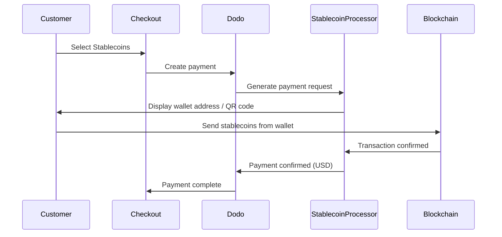

Stablecoin決済では、世界中（インドを除く）のお客様がStablecoinを使って支払えます。取引はUSDで請求されるため、お客様が希望するStablecoinウォレットで支払う一方、受け取るのは法定通貨です。

## Stablecoinsを提供する理由

<CardGroup cols={3}>
<Card title="Global Reach" icon="globe">
お客様側に銀行インフラがなくても、どの国からでも決済を受け付けられます。
</Card>

<Card title="No Chargebacks" icon="shield-check">
Stablecoin取引は取り消しできないため、チャージバック詐欺を完全に排除できます。
</Card>

<Card title="USD Settlement" icon="dollar-sign">
USDを受け取れるため、価格変動やウォレットを管理する必要はありません。
</Card>
</CardGroup>

## 概要

| 詳細 | 値 |
| :----- | :---- |
| **Billing Currency** | USD |
| **Supported Countries** | Global (Excl. IN) |
| **Subscriptions** | No |
| **Min Amount** | $0.50 |
| **Settlement** | USD |

## 仕組み



## お客様の利用体験

1. お客様がチェックアウトでStablecoinsを選択します
2. Stablecoinでの金額とともに、ウォレットアドレスとQRコードが表示されます
3. お客様がStablecoinウォレットから正確な金額を送信します
4. ブロックチェーン上で取引が確認されます
5. お客様が成功ページにリダイレクトされます

<Info>
Stablecoin決済はUSDで請求されます。チェックアウトに表示されるStablecoinの金額は、支払い時点のリアルタイムの為替レートを反映しています。
</Info>

## 対応通貨とネットワーク

| 通貨 | ネットワーク |
| :------- | :------- |
| **USDC** | Ethereum, Solana, Polygon, Base |
| **USDP** | Ethereum, Solana |
| **USDG** | Ethereum |

## 設定

```javascript
const session = await client.checkoutSessions.create({
  product_cart: [{ product_id: 'prod_123', quantity: 1 }],
  allowed_payment_method_types: ['crypto_currency', 'credit', 'debit'],
  return_url: 'https://example.com/success'
});
```

## API Method Type

| Type | Method | Country |
| :--- | :----- | :------ |
| `crypto_currency` | Stablecoins | Global (Excl. IN) |

## テスト

<Steps>
<Step title="Enable test mode">
Dodo Payments のテストAPI keysを使用します。
</Step>

<Step title="Create a test checkout">
許可するpayment methodsに`crypto_currency`を指定してcheckout sessionを作成します。
</Step>

<Step title="Complete the test flow">
テスト環境でStablecoin決済のシミュレーションフローに従います。
</Step>
</Steps>

## ベストプラクティス

<AccordionGroup>
<Accordion title="Always include card fallbacks">
すべてのお客様がStablecoinウォレットを持っているわけではありません。代替のpayment methodsとして、必ず`credit`と`debit`を含めてください。
</Accordion>

<Accordion title="Set clear expectations on confirmation time">
ブロックチェーンの確認には、ネットワークによって数分かかる場合があります。チェックアウトでこのことをお客様に伝えるようにしてください。
</Accordion>

<Accordion title="Handle underpayments and overpayments">
ネットワーク手数料により、Stablecoin決済の金額が正確な金額とわずかに異なる場合があります。決済ステータスの更新をwebhooksで監視してください。
</Accordion>
</AccordionGroup>

## トラブルシューティング

<AccordionGroup>
<Accordion title="Stablecoins not appearing at checkout">
**確認事項:**
1. `crypto_currency`は`allowed_payment_method_types`に含まれていますか？
2. 取引金額は最低金額（$0.50）を満たしていますか？

**解決策:** API requestでpayment method typeが正しく渡されていることを確認してください。
</Accordion>

<Accordion title="Payment not confirming">
**原因:** ブロックチェーンの確認時間は変動します。ネットワークによっては、他より時間がかかります。

**解決策:** webhookの確認を待ってください。確認ウィンドウが過ぎるまでは、決済を失敗として扱わないでください。
</Accordion>

<Accordion title="Amount mismatch">
**原因:** ネットワーク手数料により、受け取った金額が要求された金額とわずかに異なる場合があります。

**解決策:** 最終的に確認された金額をwebhooksで監視してください。わずかな差異は自動的に処理されます。
</Accordion>
</AccordionGroup>

## 関連ページ

<CardGroup cols={2}>
<Card title="Payment Methods Overview" icon="credit-card" href="/features/payment-methods">
対応しているすべてのpayment methodsを確認します。
</Card>

<Card title="Checkout Guide" icon="book" href="/developer-resources/checkout-session">
checkout実装ガイドを確認します。
</Card>

<Card title="Webhooks" icon="webhook" href="/developer-resources/webhooks">
payment confirmationを非同期で処理します。
</Card>

<Card title="Testing Process" icon="flask" href="/miscellaneous/testing-process">
すべてのpayment methodsに対応したテストガイドを確認します。
</Card>
</CardGroup>
