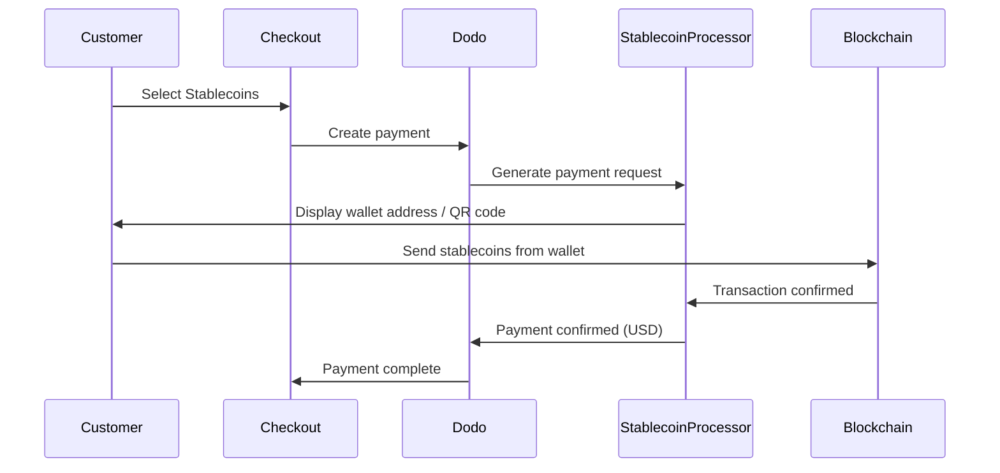

ステーブルコインを使用した支払いは、世界中のどこからでも（インドを除く）可能です。取引はUSDで請求されるため、顧客は好みのステーブルコインウォレットを使用しつつ、あなたは法定通貨を受け取れます。

## なぜステーブルコインを提供するのか？

Accept payments from any country — no banking infrastructure required on the customer's side.


Stablecoin transactions are irreversible, eliminating chargeback fraud entirely.


You receive USD — no need to manage volatility or wallets.


## 概要

| 詳細 | 値 |
| :----- | :---- |
| **請求通貨** | USD |
| **対応国** | グローバル（インド除く） |
| **サブスクリプション** | いいえ |
| **最小金額** | $0.50 |
| **清算** | USD |

## 動作のしくみ



## 顧客の体験

1. 顧客がチェックアウトでステーブルコインを選択
2. ウォレットアドレスとQRコードが表示され、ステーブルコインでの金額が示される
3. 顧客が自分のステーブルコインウォレットから正確な金額を送信
4. 取引がブロックチェーン上で確認される
5. 顧客は成功ページにリダイレクトされる

Stablecoin payments are billed in USD. The stablecoin amount displayed at checkout reflects the real-time exchange rate at the time of payment.


## 対応通貨とネットワーク

| 通貨 | ネットワーク |
| :------- | :------- |
| **USDC** | Ethereum, Solana, Polygon, Base |
| **USDP** | Ethereum, Solana |
| **USDG** | Ethereum |

## 設定

```javascript
const session = await client.checkoutSessions.create({
  product_cart: [{ product_id: 'prod_123', quantity: 1 }],
  allowed_payment_method_types: ['crypto', 'credit', 'debit'],
  return_url: 'https://example.com/success'
});
```

## API メソッドタイプ

| Type | Method | Country |
| :--- | :----- | :------ |
| `crypto` | Stablecoins | Global (Excl. IN) |

## テスト

Use your Dodo Payments test API keys.


Create a checkout session with `crypto` in the allowed payment methods.


Follow the simulated stablecoin payment flow in the test environment.


## ベストプラクティス

Not all customers have stablecoin wallets. Always include `credit` and `debit` as fallback payment methods.


Blockchain confirmations can take minutes depending on the network. Ensure your checkout communicates this to customers.


Stablecoin payments may occasionally differ slightly from the exact amount due to network fees. Monitor webhooks for payment status updates.


## トラブルシューティング

**Check:**
1. `crypto` included in `allowed_payment_method_types`?
2. Transaction amount meets minimum ($0.50)?

**Solution:** Verify the payment method type is correctly passed in your API request.


**Cause:** Blockchain confirmation times vary. Some networks take longer than others.

**Solution:** Wait for webhook confirmation. Do not treat the payment as failed until the confirmation window has passed.


**Cause:** Network fees can cause the received amount to differ slightly from the requested amount.

**Solution:** Monitor webhooks for the final confirmed amount. Small discrepancies are handled automatically.


## 関連ページ

See all supported payment methods.


Complete checkout implementation guide.


Handle payment confirmations asynchronously.


Complete testing guide for all payment methods.
