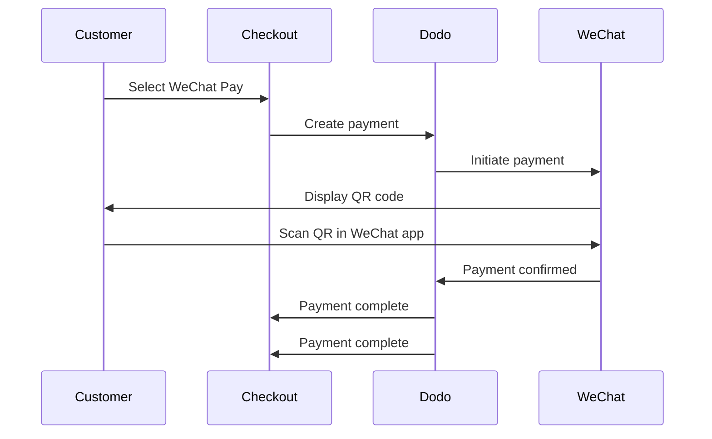

WeChat Payは、中国の二大モバイル決済プラットフォームの一つで、10億人以上が利用しています。WeChatアプリ内でQRコードを介した支払いを可能にし、中国の消費者をターゲットにするビジネスにとって不可欠です。

## WeChat Payを提供する理由

WeChat Payは、10億人以上が利用しており、世界最大級の決済プラットフォームの一つです。

支払いはWeChatアプリ内で完全に完了し、中国のお客様にとって迅速で馴染み深く、スムーズです。

USDとCNYの両方で支払いを受け入れ、クロスボーダーと国内の取引に柔軟性を持たせることができます。

## 概要

| 詳細 | 値 |
| :----- | :---- |
| **請求通貨** | USD, CNY |
| **サブスクリプション** | なし |
| **最小金額** | $0.50 / ¥1.00 |
| **決済** | USD |

## 仕組み



## カスタマーエクスペリエンス

1. お客様がチェックアウトでWeChat Payを選択
2. QRコードがチェックアウトページに表示される
3. お客様がスマートフォンでWeChatを開き、QRコードをスキャン
4. お客様がWeChatアプリで支払いを確認
5. 支払いが瞬時に確認され、お客様は成功ページにリダイレクトされる

お客様はUSDまたはCNYで支払い、決済はUSDで受け取ります。

## 設定

```javascript
const session = await client.checkoutSessions.create({
  product_cart: [{ product_id: 'prod_123', quantity: 1 }],
  allowed_payment_method_types: ['wechat_pay', 'credit', 'debit'],
  return_url: 'https://example.com/success'
});
```

## APIメソッドタイプ

| タイプ | メソッド | 通貨 |
| :--- | :----- | :--------- |
| `wechat_pay` | WeChat Pay | USD, CNY |

## テスト

Dodo PaymentsのテストAPIキーを使用してください。

`wechat_pay`を許可される決済方法に含めて、チェックアウトセッションを作成します。

テスト用のQRコードが生成されます — 通常の電話カメラでスキャンします（WeChatアプリは不要です）。テストページにリダイレクトされ、トランザクションを成功または失敗としてシミュレートできます。

## ベストプラクティス

WeChat Payは主に中国の消費者によって使用されます。顧客層に中国のバイヤーが含まれている場合や、中国市場をターゲットにしている場合に含めてください。

すべての顧客がWeChatを持っているわけではありません。常に`credit`および`debit`をフォールバックの支払い方法として含めてください。

多くのWeChat Payユーザーはモバイルで閲覧します。チェックアウトページがレスポンシブであることを確認してください — QRコードのスキャンは、チェックアウトがデスクトップまたはタブレットで表示され、顧客が携帯電話でスキャンするときに最適に機能します。

WeChat PayはUSDとCNYの両方をサポートします。ターゲット市場に最適な請求通貨を選択してください — クロスボーダーにはUSD、国内の中国の取引にはCNY。

## トラブルシューティング

**確認:**
1. `wechat_pay`が`allowed_payment_method_types`に含まれていますか？
2. 請求通貨がUSDまたはCNYに設定されていますか？
3. 取引金額が最小を満たしていますか？

 **解決策:** 支払い方法のタイプと通貨がAPIリクエストで正しく渡されていることを確認してください。

**原因:** QRコードが期限切れか、顧客のWeChatのバージョンが古い可能性があります。

**解決策:** チェックアウトページを更新して新しいQRコードを生成します。顧客が最新バージョンのWeChatを使用していることを確認してください。

**原因:** WeChat Payは通常瞬時に確認しますが、ネットワーク遅延が発生することがあります。

**解決策:** 支払い確認用Webhooksを監視します。支払いが数分以内に確認されない場合、顧客は再試行する必要があるかもしれません。

## 関連ページ

サポートされているすべての支払い方法を参照してください。

完全なチェックアウト実装ガイド。

支払い確認を非同期で処理。

すべての支払い方法の完全なテストガイド。
