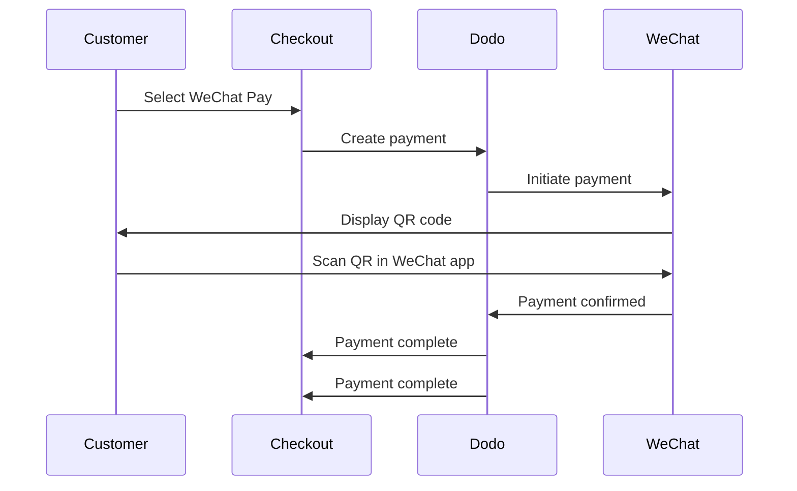

WeChat Payは、中国で主要な2つのモバイル決済プラットフォームの1つで、10億人を超える人々に利用されています。WeChatアプリ内でQRコードを使った決済を可能にするため、中国の消費者をターゲットとするビジネスにとって不可欠です。

## WeChat Payを提供する理由

<CardGroup cols={3}>
<Card title="1B+ Users" icon="users">
WeChat Payは10億人を超える人々に利用されており、世界最大級の決済プラットフォームの1つです。
</Card>

<Card title="Mobile-First" icon="mobile">
決済はWeChatアプリ内ですべて完了します。中国の顧客にとって、迅速で、使い慣れており、スムーズです。
</Card>

<Card title="Dual Currency" icon="money-bill-transfer">
USDとCNYの両方で決済を受け付けられるため、越境取引と国内取引の両方に柔軟に対応できます。
</Card>
</CardGroup>

## 概要

| 詳細 | 値 |
| :----- | :---- |
| **請求通貨** | USD, CNY |
| **サブスクリプション** | なし |
| **最小金額** | $0.50 / ¥1.00 |
| **決済通貨** | USD |

## 仕組み



## 顧客体験

1. 顧客がチェックアウトでWeChat Payを選択します
2. チェックアウトページにQRコードが表示されます
3. 顧客がスマートフォンでWeChatを開き、QRコードをスキャンします
4. 顧客がWeChatアプリで決済を確定します
5. 決済が即座に確認され、顧客は成功ページにリダイレクトされます

<Info>
顧客はUSDまたはCNYで支払い、受け取る決済金額はUSDで精算されます。
</Info>

## 設定

```javascript
const session = await client.checkoutSessions.create({
  product_cart: [{ product_id: 'pdt_123', quantity: 1 }],
  allowed_payment_method_types: ['we_chat_pay', 'credit', 'debit'],
  return_url: 'https://example.com/success'
});
```

## APIメソッドタイプ

| タイプ | メソッド | 通貨 |
| :--- | :----- | :--------- |
| `we_chat_pay` | WeChat Pay | USD, CNY |

## テスト

<Steps>
<Step title="Enable test mode">
Dodo Paymentsのtest API keysを使用してください。
</Step>

<Step title="Create a test checkout">
許可するpayment methodsに`we_chat_pay`を指定してcheckout sessionを作成します。
</Step>

<Step title="Scan the QR code">
テスト用QRコードが生成されます。通常のスマートフォンのカメラでスキャンしてください（WeChatアプリは必要ありません）。取引を成功または失敗としてシミュレートできるテストページにリダイレクトされます。
</Step>
</Steps>

## ベストプラクティス

<AccordionGroup>
<Accordion title="Target Chinese customers">
WeChat Payは主に中国の消費者に利用されています。顧客層に中国の購入者が含まれる場合や、中国市場をターゲットとする場合は、必ず含めてください。
</Accordion>

<Accordion title="Always include card fallbacks">
すべての顧客がWeChatを利用しているわけではありません。代替のpayment methodsとして、`credit`と`debit`を必ず含めてください。
</Accordion>

<Accordion title="Optimize for mobile">
WeChat Payのユーザーの多くはモバイルで閲覧します。チェックアウトページがレスポンシブであることを確認してください。顧客がスマートフォンでスキャンする際、チェックアウトをデスクトップまたはタブレットに表示すると、QRコードを最もスムーズにスキャンできます。
</Accordion>

<Accordion title="Consider both currencies">
WeChat PayはUSDとCNYの両方に対応しています。ターゲット市場に最も適した請求通貨を選択してください。越境取引にはUSD、中国国内の取引にはCNYが適しています。
</Accordion>
</AccordionGroup>

## トラブルシューティング

<AccordionGroup>
<Accordion title="WeChat Pay not appearing at checkout">
**確認事項:**
1. `we_chat_pay`は`allowed_payment_method_types`に含まれていますか？
2. 請求通貨はUSDまたはCNYに設定されていますか？
3. 取引金額は最低金額を満たしていますか？

**解決策:** APIリクエストでpayment method typeと通貨が正しく渡されていることを確認してください。
</Accordion>

<Accordion title="QR code not scanning">
**原因:** QRコードの有効期限が切れているか、顧客のWeChatのバージョンが古い可能性があります。

**解決策:** チェックアウトページを更新して、新しいQRコードを生成してください。顧客が最新バージョンのWeChatを使用していることを確認してください。
</Accordion>

<Accordion title="Payment not confirming">
**原因:** WeChat Payでは通常、即座に確認されますが、ネットワークの遅延が発生する場合があります。

**解決策:** 決済確認のwebhooksを監視してください。数分以内に決済が確認されない場合、顧客が再試行する必要がある可能性があります。
</Accordion>
</AccordionGroup>

## 関連ページ

<CardGroup cols={2}>
<Card title="Payment Methods Overview" icon="credit-card" href="/features/payment-methods">
対応しているすべてのpayment methodsを確認します。
</Card>

<Card title="Checkout Guide" icon="book" href="/developer-resources/checkout-session">
チェックアウト実装ガイドを確認します。
</Card>

<Card title="Webhooks" icon="webhook" href="/developer-resources/webhooks">
決済確認を非同期で処理します。
</Card>

<Card title="Testing Process" icon="flask" href="/miscellaneous/testing-process">
すべてのpayment methodsに対応した完全なテストガイドです。
</Card>
</CardGroup>
