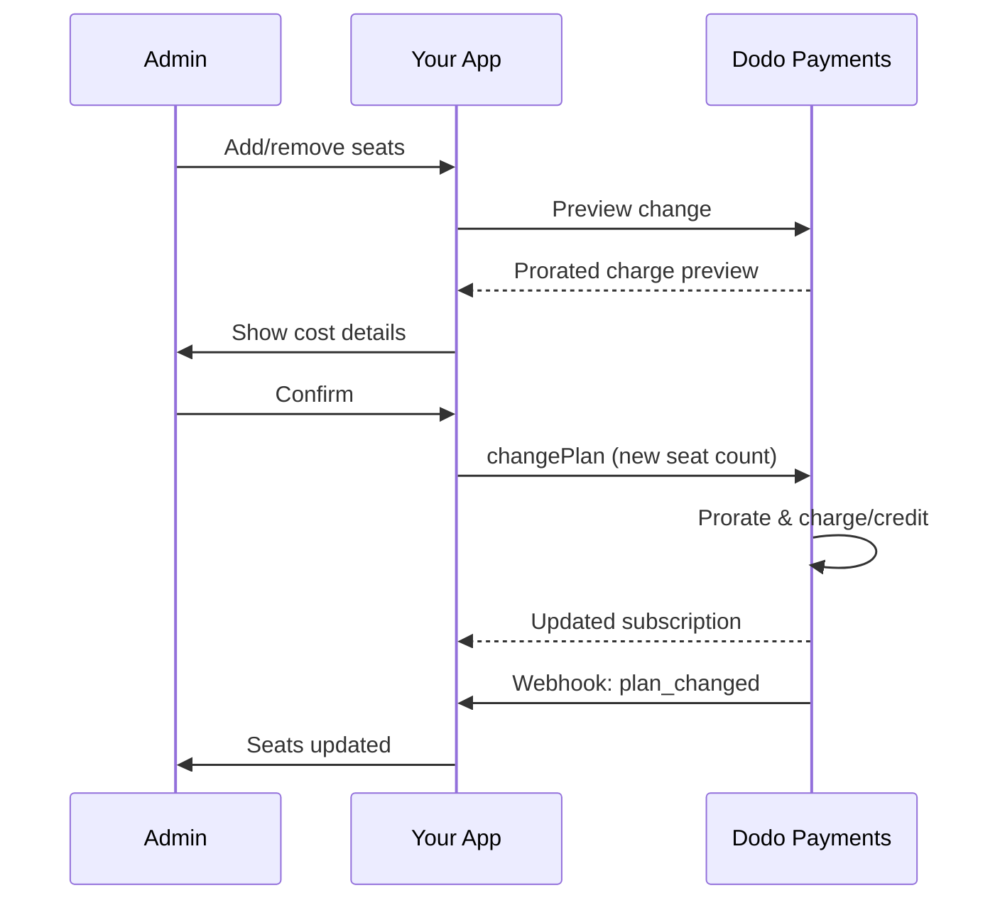

<Info>
シートベースの請求は、顧客が必要とするユーザー、チームメンバー、またはライセンスの数に基づいて料金を請求することを可能にします。これは、チームコラボレーションツール、エンタープライズソフトウェア、B2B SaaS製品の標準的な価格モデルです。
</Info>

<CardGroup cols={2}>
<Card title="実装チュートリアル" icon="code" href="/developer-resources/seat-based-pricing">
  コード例を含むステップバイステップガイド。
</Card>

<Card title="アドオンのドキュメント" icon="puzzle" href="/features/addons">
  シートベースの請求を支えるアドオンシステムについて学びます。
</Card>

<Card title="サブスクリプション管理" icon="repeat" href="/features/subscription">
  シートベースのサブスクリプションとプラン変更を管理します。
</Card>

<Card title="Webhook" icon="bell" href="/developer-resources/webhooks/intents/subscription">
  サブスクリプションWebhookでシートの変更を追跡します。
</Card>
</CardGroup>

---

## シートベースの請求とは？

シートベースの請求（ユーザーごとまたはシートごとの価格設定とも呼ばれる）は、製品にアクセスするユーザーの数に基づいて顧客に料金を請求します。定額料金の代わりに、価格はチームのサイズに応じてスケールします。

### 一般的な使用例

| 業界 | 例 | 価格モデル |
|----------|---------|---------------|
| チームコラボレーション | Slack, Notion, Asana | アクティブユーザー/月ごと |
| 開発者ツール | GitHub, GitLab, Jira | シート/月ごと |
| CRMソフトウェア | Salesforce, HubSpot | ユーザーライセンスごと |
| デザインツール | Figma, Canva | エディターシートごと |
| セキュリティソフトウェア | 1Password, Okta | ユーザー/月ごと |
| ビデオ会議 | Zoom, Teams | ホストライセンスごと |

### シートベースの価格設定の利点

**あなたのビジネスにとって:**
- 顧客が成長するにつれて収益が自然にスケール
- 顧客が予算を立てやすい予測可能な価格設定
- 個人からチーム、エンタープライズへの明確なアップグレードパス
- チームが拡大するにつれて高いライフタイムバリュー

**顧客にとって:**
- 使用した分だけ支払う
- コストを理解しやすく予測しやすい
- 必要に応じてユーザーを追加/削除する柔軟性
- チームのサイズに合った公正な価格設定

---

## Dodo Paymentsにおけるシートベースの請求の仕組み

Dodo Paymentsは、**アドオン**システムを使用してシートベースの請求を実装しています。以下がその仕組みです：

### アーキテクチャの概要

チームプロのサブスクリプションは月額99ドルで、5つの席が含まれています。5人以上のユーザーがいる場合、追加の席ごとに月額15ドルがかかります。

例えば、あなたのチームが15席を必要とする場合:
- 基本プラン: 月額99ドル（5つの席が含まれています）
- アドオン: 10の追加席 × 月額15ドル = 月額150ドル
- 合計月額費用: 99ドル + 150ドル = 15席で249ドル

### 主要コンポーネント

| コンポーネント | 目的 | 例 |
|-----------|---------|---------|
| 基本製品 | 含まれるシートのコアサブスクリプション | "チームプラン - 月額\$99（5シート含む）" |
| シートアドオン | 追加ユーザーのためのシートごとの料金 | "追加シート - 各月額\$15" |
| 数量 | 購入した追加シートの数 | 10シート |

---

## 価格設定戦略

ビジネスに合ったシートベースの価格設定戦略を選択してください：

### 戦略1: 基本 + シートごとのアドオン

基本プランに設定された数のシートを含め、追加シートに対して料金を請求します。

**例:**

```
Starter Plan: $49/month
├── Includes: 3 seats
├── Extra seats: $10/month each
└── 8 total seats = $49 + (5 × $10) = $99/month
```

**最適:** 小規模チームが基本提供で機能できる製品。

### 戦略2: 純粋なシートごとの価格設定

基本料金なしでシートごとに定額料金を請求します。

**例:**

```
Per User: $12/month
├── 5 users = $60/month
├── 20 users = $240/month
└── 100 users = $1,200/month
```

**実装:** 基本プランの価格を\$0に設定し、シートアドオンのみを使用します。

**最適:** シンプルで透明な価格設定; 使用ベースのモデル。

### 戦略3: 階層型シート価格設定

異なる基本プランに異なるシートごとの料金。

**例:**

```
Starter: $0/month base + $15/seat
├── Lower features, higher per-seat cost

Professional: $99/month base + $10/seat
├── More features, lower per-seat cost

Enterprise: $499/month base + $7/seat
└── All features, volume discount on seats
```

**実装:** 各階層のために異なるアドオン価格で別々の製品を作成します。

**最適:** 高い階層へのアップグレードを促進する; エンタープライズ販売。

### 戦略4: シートバンドル

シートを個別ではなくパックで販売します。

**例:**

```
5-Seat Pack: $50/month ($10/seat)
10-Seat Pack: $80/month ($8/seat)
25-Seat Pack: $175/month ($7/seat)
```

**実装:** 異なるパックサイズのために複数のアドオンを作成します。

**最適:** 購入決定を簡素化する; 大きなコミットメントを促進する。

---

## シートベースの請求の設定

### ステップ1: 価格設定を計画する

実装前に、価格構造を定義します：

<Steps>
<Step title="基本プランを定義する">
基本サブスクリプションに含まれるものを決定します：
- 基本価格（純粋なシートごとの場合は\$0にすることができます）
- 含まれるシートの数
- この階層で利用可能な機能
</Step>

<Step title="シート価格を設定する">
シートごとのアドオンコストを決定します：
- 追加シートごとの価格
- ボリュームディスカウント（複数のアドオンを通じて）
- 許可される最大シート数（該当する場合）
</Step>

<Step title="請求頻度を考慮する">
シート価格を請求サイクルに合わせます：
- 月額サブスクリプション → 月額シート料金
- 年間サブスクリプション → 年間シート料金（通常は割引あり）
</Step>
</Steps>

### ステップ2: シートアドオンを作成する

Dodo Paymentsダッシュボードで：

1. **製品** → **アドオン**に移動します
2. **アドオンを作成**をクリックします
3. アドオンを設定します：

| フィールド | 値 | メモ |
|-------|-------|-------|
| 名前 | "追加シート"または"チームメンバー" | 明確でユーザーフレンドリーな名前 |
| 説明 | "ワークスペースに別のチームメンバーを追加" | 顧客が得られるものを説明 |
| 価格 | あなたのシートごとの価格 | 例: \$10.00 |
| 通貨 | 基本製品と一致させる | 同じ通貨でなければなりません |
| 税カテゴリ | 基本製品と同じ | 一貫した税処理を確保 |

<Tip>
請求書で意味のある説明的なアドオン名を作成してください。"追加チームシート"は、請求書を確認している顧客にとって"シートアドオン"よりも明確です。
</Tip>

### ステップ3: 基本サブスクリプションを作成する

サブスクリプション製品を作成します：

1. **製品** → **製品を作成**に移動します
2. **サブスクリプション**を選択します
3. 価格と詳細を設定します
4. **アドオン**セクションで、シートアドオンを添付します

### ステップ4: 製品にアドオンを添付する

シートアドオンをサブスクリプションにリンクします：

1. サブスクリプション製品を編集します
2. **アドオン**セクションまでスクロールします
3. **アドオンを追加**をクリックします
4. シートアドオンを選択します
5. 変更を保存します

<Check>
あなたのサブスクリプション製品は現在、シートベースの価格設定をサポートしています。顧客はチェックアウト中に追加シートの任意の数量を購入できます。
</Check>

---

## シートの管理

### 新しいサブスクリプションへのシートの追加

チェックアウトセッションを作成する際に、シートの数量を指定します：

```typescript
const session = await client.checkoutSessions.create({
  product_cart: [{
    product_id: 'prod_team_plan',
    quantity: 1,
    addons: [{
      addon_id: 'addon_seat',
      quantity: 10  // 10 additional seats
    }]
  }],
  customer: { email: 'admin@company.com' },
  return_url: 'https://yourapp.com/success'
});
```

### 既存のサブスクリプションのシート数の変更

シートを調整するためにChange Plan APIを使用します：

```typescript
// Add 5 more seats to existing subscription
await client.subscriptions.changePlan('sub_123', {
  product_id: 'prod_team_plan',
  quantity: 1,
  proration_billing_mode: 'prorated_immediately',
  addons: [{
    addon_id: 'addon_seat',
    quantity: 15  // New total: 15 additional seats
  }]
});
```

### シートの削除

シート数を減らすには、より少ない数量を指定します：

```typescript
// Reduce from 15 to 8 additional seats
await client.subscriptions.changePlan('sub_123', {
  product_id: 'prod_team_plan',
  quantity: 1,
  proration_billing_mode: 'difference_immediately',
  addons: [{
    addon_id: 'addon_seat',
    quantity: 8  // Reduced to 8 additional seats
  }]
});
```

### すべての追加シートの削除

すべてのアドオンを削除するには、空のアドオン配列を渡します：

```typescript
// Remove all additional seats, keep only base plan seats
await client.subscriptions.changePlan('sub_123', {
  product_id: 'prod_team_plan',
  quantity: 1,
  proration_billing_mode: 'difference_immediately',
  addons: []  // Removes all add-ons
});
```

---

## シート変更の按分

顧客がシートを追加または削除する際、按分が請求方法を決定します。



### プロレートモード

| モード | 席の追加 | 席の削除 |
|------|-------------|----------------|
| `prorated_immediately` | サイクル内の残りの日数に対して課金 | 使用していない日のクレジット |
| `difference_immediately` | フル席価格を課金 | 将来の更新に適用されるクレジット |
| `full_immediately` | フル席価格を課金し、請求サイクルをリセット | クレジットなし |

### プロレートの例

**シナリオ：残り15日間の請求サイクルで、5席を追加する場合（10ドル/席）**

<Tabs>
<Tab title="プロレート直後">

```
Prorated charge = ($10 × 5 seats) × (15 days / 30 days)
                = $50 × 0.5
                = $25 immediate charge
```

顧客は今すぐ25ドルを支払い、更新時に50ドル/月を支払います。
</Tab>

<Tab title="差額直後">

```
Immediate charge = $10 × 5 seats = $50
```

顧客はサイクルの位置に関係なく、今すぐフルの50ドルを支払います。
</Tab>

<Tab title="フル直後">

```
Immediate charge = Full subscription + add-ons
Billing cycle resets to today
```

顧客は全額を支払い、新しい請求サイクルが始まります。
</Tab>
</Tabs>

**シナリオ：プロレート直後に3席をサイクルの途中で削除する場合**

```
Current: Team Plan ($99/month) + 10 extra seats × $10/seat = $199/month
Change: Remove 3 seats (10 → 7 extra seats) on day 20 of 30-day cycle
Remaining: 10 days

Credit for removed seats:
  = ($10 × 3 seats) × (10 days / 30 days)
  = $30 × 0.333
  = $10.00 credit

→ $10.00 credit added to subscription
→ Next renewal: $99 + (7 × $10) = $169.00/month
→ Credit auto-applies: $169.00 − $10.00 = $159.00 on next invoice
```

<Tip>
**席変更のためのプロレートモードの選択**：チームが頻繁に席を調整する場合は、日数ベースの公正課金のために`prorated_immediately`を使用してください。計算を簡単にしたい場合は、フル席価格を請求またはクレジットするために`difference_immediately`を使用してください。詳細な比較については、[プロレートガイド](/developer-resources/subscription-upgrade-downgrade#proration-modes)を参照してください。
</Tip>

### 変更前のプレビュー

変更を加える前に、常にプロレートをプレビューしてください：

```typescript
const preview = await client.subscriptions.previewChangePlan('sub_123', {
  product_id: 'prod_team_plan',
  quantity: 1,
  proration_billing_mode: 'prorated_immediately',
  addons: [{ addon_id: 'addon_seat', quantity: 20 }]
});

console.log('Immediate charge:', preview.immediate_charge.summary);
// Show customer: "Adding 5 seats will cost $25 today"
```

---

## Webhookでの席の追跡

サブスクリプションのWebhookをリッスンして席の変更を監視します：

### 関連イベント

| イベント | トリガーされるタイミング | 使用ケース |
|-------|----------------|----------|
| `subscription.active` | 新しいサブスクリプションがアクティブになった | 初期席をプロビジョニング |
| `subscription.plan_changed` | 席が追加/削除された | アプリ内の席数を更新 |
| `subscription.renewed` | サブスクリプションが更新された | 席数が変わっていないことを確認 |
| `subscription.cancelled` | サブスクリプションがキャンセルされた | すべての席を非プロビジョニング |

### Webhookハンドラーの例

```typescript
app.post('/webhooks/dodo', async (req, res) => {
  const event = req.body;

  switch (event.type) {
    case 'subscription.active':
      // New subscription - provision seats
      const seats = calculateTotalSeats(event.data);
      await provisionSeats(event.data.customer_id, seats);
      break;

    case 'subscription.plan_changed':
      // Seats changed - update access
      const newSeats = calculateTotalSeats(event.data);
      await updateSeatCount(event.data.subscription_id, newSeats);
      break;

    case 'subscription.cancelled':
      // Subscription cancelled - deprovision
      await deprovisionAllSeats(event.data.subscription_id);
      break;
  }

  res.json({ received: true });
});

function calculateTotalSeats(subscriptionData) {
  const baseSeats = 5;  // Included in plan
  const addonSeats = subscriptionData.addons?.reduce(
    (total, addon) => total + addon.quantity, 0
  ) || 0;
  return baseSeats + addonSeats;
}
```

---

## 席の制限の強制

アプリケーションは席の制限を強制する必要があります。Dodo Paymentsは請求を追跡しますが、アクセスはあなたが制御します。

### 強制戦略

<Tabs>
<Tab title="ハードリミット">
ユーザーを席数以上に追加することを厳密に防ぎます。

```typescript
async function inviteUser(teamId: string, email: string) {
  const team = await getTeam(teamId);
  const subscription = await getSubscription(team.subscriptionId);
  const totalSeats = calculateTotalSeats(subscription);
  const usedSeats = await countTeamMembers(teamId);

  if (usedSeats >= totalSeats) {
    throw new Error('No seats available. Please upgrade your plan.');
  }

  await sendInvitation(teamId, email);
}
```

</Tab>

<Tab title="警告付きソフトリミット">
警告と猶予期間付きで超えることを許可します。

```typescript
async function inviteUser(teamId: string, email: string) {
  const team = await getTeam(teamId);
  const { totalSeats, usedSeats } = await getSeatInfo(team);

  if (usedSeats >= totalSeats) {
    // Allow but flag for billing
    await flagOverage(teamId, usedSeats - totalSeats + 1);
    await notifyAdmin(team.adminEmail, 'You have exceeded your seat limit');
  }

  await sendInvitation(teamId, email);
}
```

</Tab>

<Tab title="自動アップグレード">
制限に達した場合に、自動的に席を追加します。

```typescript
async function inviteUser(teamId: string, email: string) {
  const team = await getTeam(teamId);
  const { totalSeats, usedSeats, subscriptionId } = await getSeatInfo(team);

  if (usedSeats >= totalSeats) {
    // Automatically add a seat
    await client.subscriptions.changePlan(subscriptionId, {
      product_id: team.productId,
      quantity: 1,
      proration_billing_mode: 'prorated_immediately',
      addons: [{ addon_id: 'addon_seat', quantity: totalSeats - baseSeats + 1 }]
    });

    await notifyAdmin(team.adminEmail, 'A new seat was added to your plan');
  }

  await sendInvitation(teamId, email);
}
```

</Tab>
</Tabs>

---

## 高度なパターン

### 異なる席の種類

異なる価格設定の異なる席の種類を提供します：

```
Full Seats: $20/month - Full access to all features
View-Only Seats: $5/month - Read-only access
Guest Seats: $0/month - Limited external collaborator access
```

**実装**：各席の種類のために別々のアドオンを作成します。

```typescript
const session = await client.checkoutSessions.create({
  product_cart: [{
    product_id: 'prod_team_plan',
    quantity: 1,
    addons: [
      { addon_id: 'addon_full_seat', quantity: 10 },
      { addon_id: 'addon_viewer_seat', quantity: 25 },
      { addon_id: 'addon_guest_seat', quantity: 50 }
    ]
  }]
});
```

### 年間席割引

割引された年間席料金を提供します：

```
Monthly: $15/seat/month
Annual: $12/seat/month (20% savings)
```

**実装**：月額プランと年間プランのために異なるアドオン価格で別々の製品を作成します。

### 最小席数要件

特定のプランに対して最小数の席を要求します：

```typescript
async function validateSeatCount(planId: string, seatCount: number) {
  const minimums = {
    'prod_starter': 1,
    'prod_team': 5,
    'prod_enterprise': 25
  };

  if (seatCount < minimums[planId]) {
    throw new Error(`${planId} requires at least ${minimums[planId]} seats`);
  }
}
```

---

## ベストプラクティス

### 価格設定のベストプラクティス

- **明確なコミュニケーション**: 価格ページに1席あたりの価格を目立たせて表示
- **含まれた席**: 摩擦を減らすために基本料金にいくつかの席を含めることを検討
- **ボリュームディスカウント**: 大規模なチーム向けに1席あたりの料金を引き下げてエンタープライズの契約を勝ち取る
- **年間インセンティブ**: キャッシュフローと保持を改善するために年間プランを割引

### 技術的なベストプラクティス

- **席数をキャッシュ**: API呼び出しを避けるためにローカルでサブスクリプションの席数をキャッシュします
- **定期的に同期**: Dodo PaymentsとAPIを介して定期的にローカル席数を同期します
- **失敗を処理**: 席の変更が失敗した場合は、明確なエラーメッセージと再試行のオプションを表示します
- **監査証跡**: 請求の不一致とコンプライアンスのためにすべての席の変更を記録します

### ユーザーエクスペリエンスのベストプラクティス

- **リアルタイムフィードバック**: 席を調整するときに即座にコストの影響を見せます
- **確認ステップ**: 請求の変更前に確認を必要とします
- **プロレートの透明性**: 適用前にプロレート料金を明確に説明します
- **簡単なダウングレード**: 席を減らすのを難しくしないでください（信頼が築けます）

---

## トラブルシューティング

<AccordionGroup>
<Accordion title="アプリと請求の席数の不一致">
**症状**: アプリがサブスクリプションと異なる席数を表示します。

**原因**:
- Webhookが受信または処理されなかった
- 席の変更中のレースコンディション
- キャッシュデータが更新されていない

**解決策**:
1. `subscription.plan_changed`のWebhookハンドラーを実装します
2. 現在のサブスクリプションを取得する「請求と同期」ボタンを追加します
3. 定期的な更新を確保するためのキャッシュTTLを設定します
</Accordion>

<Accordion title="予期しないプロレート費用">
**症状**: 顧客がサイクル途中の請求金額に困惑しています。

**原因**:
- プロレートモードが明確に伝達されていない
- 顧客が確認前にプレビューを見ていない

**解決策**:
1. 変更を行う前に常に`previewChangePlan`を使用してください
2. 明確な内訳を表示: 「X席の追加 = 今すぐYドル（Z日分にプロレート）」
3. ヘルプセンターにプロレートポリシーを文書化します
</Accordion>

<Accordion title="チェックアウトに表示されないアドオン">
**症状**: チェックアウト中に席のアドオンが利用できない。

**原因**:
- アドオンが製品に添付されていない
- アドオンがアーカイブまたは削除されている
- 製品とアドオン間で通貨が一致していない

**解決策**:
1. 製品設定でアドオンが添付されていることを確認します
2. アドオンダッシュボードでアドオンのステータスを確認します
3. 通貨が正確に一致していることを確認します
</Accordion>

<Accordion title="現在の使用状況を下回る席の削減ができない">
**症状**: 顧客は席を減らしたいが、ユーザーが割り当てられている。

**解決策**:
1. 席を減らす前に削除しなければならないユーザーを示します
2. ワークフローを実装: ユーザーを削除 → 席を減らす
3. 席削減を強制する前に猶予期間を考慮してください
</Accordion>
</AccordionGroup>

---

## 関連文書

<CardGroup cols={2}>
<Card title="席ベースの価格設定チュートリアル" icon="code" href="/developer-resources/seat-based-pricing">
  コード付きの完全な実装ガイドです。
</Card>

<Card title="アドオン" icon="puzzle" href="/features/addons">
  アドオンシステムについて深く理解します。
</Card>

<Card title="プラン変更とプロレート" icon="arrows-rotate" href="/developer-resources/subscription-upgrade-downgrade">
  サブスクリプションの変更を処理します。
</Card>

<Card title="サブスクリプションWebhook" icon="bell" href="/developer-resources/webhooks/intents/subscription">
  サブスクリプションイベントを追跡します。
</Card>
</CardGroup>
