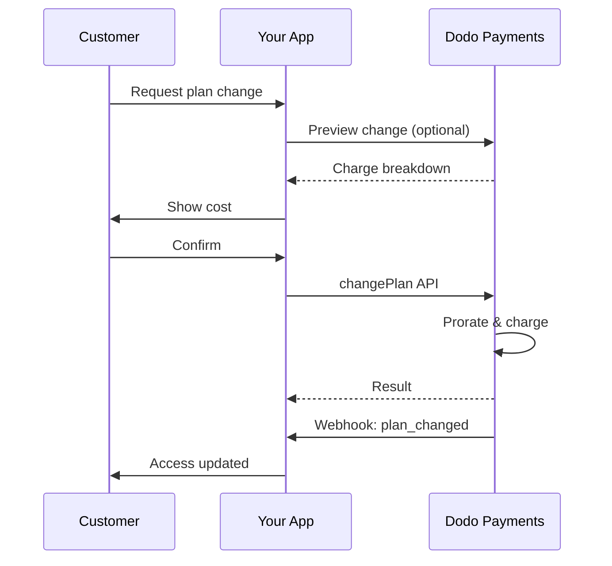
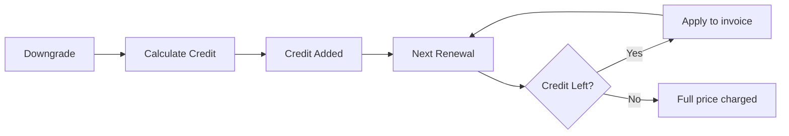
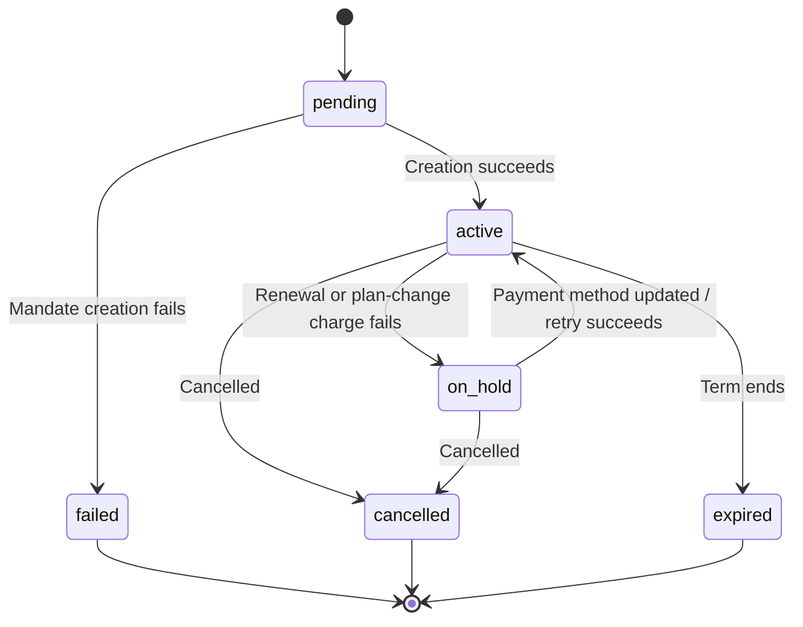

<Info>
Subscriptions let you sell ongoing access with automated renewals. Use flexible billing cycles, free trials, plan changes, and add‑ons to tailor pricing for each customer.
</Info>

<CardGroup cols={2}>
<Card title="Upgrade & Downgrade" icon="repeat" href="/developer-resources/subscription-upgrade-downgrade">
Control plan changes with proration and quantity updates.
</Card>

<Card title="On‑Demand Subscriptions" icon="bolt" href="/developer-resources/ondemand-subscriptions">
Authorize a mandate now and charge later with custom amounts.
</Card>

<Card title="Customer Portal" icon="id-card" href="/features/customer-portal">
Let customers manage plans, billing, and cancellations.
</Card>

<Card title="Subscription Webhooks" icon="code" href="/developer-resources/webhooks/intents/subscription">
React to lifecycle events like created, renewed, and canceled.
</Card>
</CardGroup>

## What Are Subscriptions?

Subscriptions are recurring products customers purchase on a schedule. They’re ideal for:

- **SaaS licenses**: Apps, APIs, or platform access
- **Memberships**: Communities, programs, or clubs
- **Digital content**: Courses, media, or premium content
- **Support plans**: SLAs, success packages, or maintenance

## Key Benefits

- **Predictable revenue**: Recurring billing with automated renewals
- **Flexible cycles**: Monthly, annual, custom intervals, and trials
- **Plan agility**: Proration for upgrades and downgrades
- **Add‑ons and seats**: Attach optional, quantifiable upgrades
- **Seamless checkout**: Hosted checkout and customer portal
- **Developer-first**: Clear APIs for creation, changes, and usage tracking

## Creating Subscriptions

Create subscription products in your Dodo Payments dashboard, then sell them through checkout or your API. Separating products from active subscriptions lets you version pricing, attach add‑ons, and track performance independently.

### Subscription product creation

Configure the fields in the dashboard to define how your subscription sells, renews, and bills. The sections below map directly to what you see in the creation form.

#### Product details

- **Product Name** (required): The display name shown in checkout, customer portal, and invoices.
- **Product Description** (required): A clear value statement that appears in checkout and invoices.
- **Product Image** (required): PNG/JPG/WebP up to 3 MB. Used on checkout and invoices.
- **Brand**: Associate the product with a specific brand for theming and emails.
- **Tax Category** (required): Choose the category (for example, SaaS) to determine tax rules.

<Tip>
Pick the most accurate tax category to ensure correct tax collection per region.
</Tip>

#### Pricing

- **価格タイプ**: <b>サブスクリプション</b>を選択します（このガイド）。代替案として、一括払いと使用量ベースの請求があります。
- **価格**（必須）: 通貨付きの基本的な定期価格。価格は最低でも**$1**（または選択した通貨の同等額）でなければなりません。この最低額未満はサポートされず、サブスクリプションは機能しません。
- **割引適用(%)**: ベース価格に適用される任意の割引率。チェックアウトや請求書に反映されます。
- **支払いの繰り返し頻度**（必須）: 更新の間隔、例: 毎月。月や年の頻度と数量を選択します。
- **サブスクリプション期間**（必須）: サブスクリプションがアクティブなままである総期間（例: 10年）。この期間が終了した後、延長しない限り更新は終了します。
- **試用期間の日数**（必須）: 試用期間の長さを日数で設定します。0を使用して試用を無効にします。試用が終了すると最初の課金が自動的に行われます。
- **アドオンの選択**: 基本プランに加えて購入可能なアドオンを最大10個まで添付します。

<Warning>
Changing pricing on an active product affects new purchases. Existing subscriptions follow your plan‑change and proration settings.
</Warning>

<Info>
Add‑ons are ideal for quantifiable extras such as seats or storage. You can control allowed quantities and proration behavior when customers change them.
</Info>

#### Advanced settings

- **Tax Inclusive Pricing**: Display prices inclusive of applicable taxes. Final tax calculation still varies by customer location.
- **Generate license keys**: Issue a unique key to each customer after purchase. See the <a href="/features/license-keys">License Keys</a> guide.
- **Digital Product Delivery**: Deliver files or content automatically after purchase. Learn more in <a href="/features/digital-product-delivery">Digital Product Delivery</a>.
- **Metadata**: Attach custom key–value pairs for internal tagging or client integrations. See <a href="/api-reference/metadata">Metadata</a>.

<Tip>
Use metadata to store identifiers from your system (e.g., accountId) so you can reconcile events and invoices later.
</Tip>

## Subscription Trials

Trials let customers access subscriptions without immediate payment. The first charge occurs automatically when the trial ends.

### Configuring Trials

Set **Trial Period Days** in the product pricing section (use `0` to disable). You can override this when creating subscriptions:

```typescript
// Via subscription creation
const subscription = await client.subscriptions.create({
  customer_id: 'cus_123',
  product_id: 'prod_monthly',
  trial_period_days: 14  // Overrides product's trial period
});

// Via checkout session
const session = await client.checkoutSessions.create({
  product_cart: [{ product_id: 'prod_monthly', quantity: 1 }],
  subscription_data: { trial_period_days: 14 }
});
```

<Warning>
The `trial_period_days` value must be between 0 and 10,000 days.
</Warning>

### Detecting Trial Status

<Warning>
Currently, there is no direct field to detect trial status. The following is a workaround that requires querying payments, which is inefficient. We are working on a more efficient solution.
</Warning>

To determine if a subscription is in trial, retrieve the list of payments for the subscription. If there is exactly one payment with amount 0, the subscription is in trial period:

```typescript
const subscription = await client.subscriptions.retrieve('sub_123');
const payments = await client.payments.list({
  subscription_id: subscription.subscription_id
});

// Check if subscription is in trial
const isInTrial = payments.items.length === 1 && 
                  payments.items[0].total_amount === 0;
```

### Updating Trial Period

Extend the trial by updating `next_billing_date`:

```typescript
await client.subscriptions.update('sub_123', {
  next_billing_date: '2025-02-15T00:00:00Z'  // New trial end date
});
```

<Warning>
You cannot set `next_billing_date` to a past time. The date must be in the future.
</Warning>

## Subscription Plan Changes

プラン変更によりサブスクリプションをアップグレードまたはダウングレードしたり、数量を調整したり、別の製品に移行したりできます。選択した比例計算モードに応じて、変更は即時課金をトリガーしたり、クレジットを生成したり、請求調整を適用しない場合があります。

<Tip>
You can change subscription plans and update the next billing date directly from the Dodo Payments dashboard. This provides a quick way to adjust subscriptions for customer support requests, promotional upgrades, or plan migrations without making API calls.
</Tip>

<Tip>
**Enable self-service plan changes:** Want customers to upgrade or downgrade their own subscriptions via the Customer Portal? Add your subscription products to a Product Collection and enable "Allow Subscription Updates" in your Subscription Settings.
</Tip>



<Card title="Product Collections" icon="layer-group" href="/features/product-collections">
  Group related products into collections to enable seamless upgrade/downgrade paths in the Customer Portal.
</Card>

### Proration Modes

Choose how customers are billed when changing plans:

<Info>
**4つの比例計算モードの簡単な比較：**

| | `prorated_immediately` | `difference_immediately` | `full_immediately` | `do_not_bill` |
|---|---|---|---|---|
| **アップグレード** | 残りの日数に対する日割り課金 | 差額の全額課金 | 新しいプランの全額課金 | 無料 — 即時切替 |
| **ダウングレード** | 残りの日数に対する日割りクレジット | 差額の全額がクレジット | クレジットなし、全額課金 | クレジットなし — 即時切替 |
| **請求サイクル** | 今日から再設定 | 今日から再設定 | 今日から再設定 | 変更なし |
| **最適な用途** | 公平な時間ベースの請求 | シンプルなティア変更 | 請求サイクルのリセット | 無料移行または特別スイッチ |
</Info>

#### `prorated_immediately`
Charges prorated amount based on remaining time in the current billing cycle. Best for fair billing that accounts for unused time.

```typescript
await client.subscriptions.changePlan('sub_123', {
  product_id: 'prod_pro',
  quantity: 1,
  proration_billing_mode: 'prorated_immediately'
});
```

#### `difference_immediately`
Charges the price difference immediately (upgrade) or adds credit for future renewals (downgrade). Best for simple upgrade/downgrade scenarios.

```typescript
// Upgrade: charges $50 (difference between $30 and $80)
// Downgrade: credits remaining value, auto-applied to renewals
await client.subscriptions.changePlan('sub_123', {
  product_id: 'prod_pro',
  quantity: 1,
  proration_billing_mode: 'difference_immediately'
});
```

<Info>
`difference_immediately` を使用したダウングレードによるクレジットはサブスクリプション単位で適用され、今後の更新に自動的に適用されます。これらは<a href="/features/credit-based-billing">Credit-Based Billing</a> の権利とは異なります。
</Info>

When a customer downgrades with `difference_immediately`, the unused value becomes a subscription-scoped credit that automatically offsets future renewals:



#### `full_immediately`
Charges full new plan amount immediately, ignoring remaining time. Best for resetting billing cycles.

```typescript
await client.subscriptions.changePlan('sub_123', {
  product_id: 'prod_monthly',
  quantity: 1,
  proration_billing_mode: 'full_immediately'
});
```

#### `do_not_bill`
請求調整なしで新しいプランに切り替えます。比例課金もクレジットもなし—単に新しいプランに移行します。特に丁寧な移行、無料プランの切り替え、またはコスト差異を吸収したい場合に適しています。

```typescript
await client.subscriptions.changePlan('sub_123', {
  product_id: 'prod_new_plan',
  quantity: 1,
  proration_billing_mode: 'do_not_bill'
});
```

<AccordionGroup>
<Accordion title="Example: Prorated upgrade calculation">

**シナリオ**: BASIC（$30/月）の顧客が30日間サイクルの16日目にPRO ($80/月)にアップグレードする場合は`prorated_immediately`を使用します。

```
Unused credit from Basic = $30 × (15 remaining / 30 total) = $15.00
Prorated cost of Pro     = $80 × (15 remaining / 30 total) = $40.00
────────────────────────────────────────────────────────────────────
Immediate charge         = $40.00 − $15.00 = $25.00
```

次回更新日: **2月15日**（1月16日 + 30日）： **$80.00/月**。

<Tip>
より詳細な計算例やコーナーケースについては、完全な[アップグレード&ダウングレードガイド](/developer-resources/subscription-upgrade-downgrade)をご覧ください。
</Tip>

</Accordion>
<Accordion title="Example: Downgrade credit calculation">

**シナリオ**: PRO（$80/月）の顧客が`difference_immediately`を使用してスターター（$20/月）にダウングレードする。

```
Credit = Old plan − New plan = $80 − $20 = $60.00
```

$60のクレジットは自動的に将来の更新に適用されます:
- 更新1: $20 − $20 (クレジット) = **$0.00** ($40 クレジット残)
- 更新2: $20 − $20 (クレジット) = **$0.00** ($20 クレジット残)  
- 更新3: $20 − $20 (クレジット) = **$0.00** (クレジット消費済)
- 更新4: **$20.00** (全額)

<Info>
クレジットがどのように管理されるかについては、[アップグレード&ダウングレードガイド](/developer-resources/subscription-upgrade-downgrade)をご覧ください。
</Info>

</Accordion>
</AccordionGroup>

### アドオンを伴うプラン変更

プラン変更時にアドオンを修正します。アドオンは比例計算に含まれます：

```typescript
await client.subscriptions.changePlan('sub_123', {
  product_id: 'prod_pro',
  quantity: 1,
  proration_billing_mode: 'difference_immediately',
  addons: [{ addon_id: 'addon_extra_seats', quantity: 2 }]  // Add add-ons
  // addons: []  // Empty array removes all existing add-ons
});
```

<Info>
プラン変更は即時課金を引き起こします。課金が失敗した場合、サブスクリプションは`on_hold`状態に移行することがあります。変更の追跡は`subscription.plan_changed` webhookイベントを介して行います。
</Info>

### プラン変更のプレビュー

プラン変更をコミットする前に、正確な料金と結果としてのサブスクリプションをプレビューします：

```typescript
const preview = await client.subscriptions.previewChangePlan('sub_123', {
  product_id: 'prod_pro',
  quantity: 1,
  proration_billing_mode: 'prorated_immediately'
});

// Show customer the charge before confirming
console.log('You will be charged:', preview.immediate_charge.summary);
```

<Card title="Preview Change Plan API" icon="eye" href="/api-reference/subscriptions/preview-change-plan">
  プラン変更をコミットする前にプレビューします。
</Card>

## サブスクリプション状態

サブスクリプションはそのライフサイクルを通じて、定義された一連のステータスを移動します。この表は各ステータス、その原因、回復方法（または回復の可否）に関する参照です。

| ステータス | 意味 | 回復可能? | 回復経路 / 次のステップ |
|--------|---------------|--------------|---------------------------|
| `pending` | サブスクリプションの作成または処理中です | — | `subscription.active`（または`subscription.failed`）を待ちます |
| `active` | サブスクリプションがアクティブで、自動的に更新されます | — | 何もする必要はありません |
| `on_hold` | 更新支払い（またはプラン変更料）が失敗し、サブスクリプションが一時停止されています | **はい** | [支払い再試行](/features/recovery/payment-retries)と[督促](/features/recovery/subscription-dunning)を使用して自動的に、または[支払い方法更新API](/api-reference/subscriptions/update-payment-method)を通じて手動で支払い方法を更新して再有効化します |
| `cancelled` | サブスクリプションがキャンセルされ、更新されません | 再購入のみ | 顧客は新しいサブスクリプションを開始する必要があります。[督促](/features/recovery/subscription-dunning)は再購入を促す可能性があります |
| `failed` | サブスクリプションの**作成**が失敗しました（初期の支払いが成功しませんでした） | **いいえ — 終端** | 顧客は機能している支払い方法で新しいサブスクリプションを作成する必要があります |
| `expired` | サブスクリプションがその期間の終わりに到達しました | — | 顧客が必要とすれば、新しいサブスクリプションを開始する必要があります |

<Warning>
`on_hold` と `failed` はよく混同されます。`on_hold` は、すでにアクティブなサブスクリプションの更新が失敗した際の**回復可能**な状態です。`failed` は、**初期**のサブスクリプションの作成が失敗した場合にのみ発生する**終端**状態であり、再有効化することはできません。
</Warning>

### ステートマシン



### 保留状態

サブスクリプションが `on_hold` 状態になるとき:

- 更新支払いの失敗（資金不足、カードの期限切れなど）
- プラン変更料の失敗
- 支払い方法の承認失敗

<Warning>
サブスクリプションが `on_hold` 状態にある場合、自動で更新されません。サブスクリプションを再有効化するには、支払い方法を更新する必要があります。
</Warning>

### 保留からの再有効化

`on_hold` 状態のサブスクリプションを再有効化するには、支払い方法を更新します。これにより、自動的に:

1. 残額の請求が行われます
2. 請求書が作成されます
3. 新しい支払い方法での支払いが処理されます
4. 支払いが成功すると、サブスクリプションが `active` 状態に再有効化されます

```typescript
// Reactivate subscription from on_hold
const response = await client.subscriptions.updatePaymentMethod('sub_123', {
  type: 'new',
  return_url: 'https://example.com/return'
});

// For on_hold subscriptions, a charge is automatically created
if (response.payment_id) {
  console.log('Charge created:', response.payment_id);
  // Redirect customer to response.payment_link to complete payment
  // Monitor webhooks for payment.succeeded and subscription.active
}
```

<Info>
`on_hold` サブスクリプションの支払い方法の更新に成功すると、`payment.succeeded` が続く `subscription.active` Webhook イベントが受信されます。
</Info>

### トランジションによるWebhookイベント

各トランジションはWebhookを出力し、ポーリングせずに権利のロジックを駆動できます:

| トランジション | イベント |
|------------|-------|
| サブスクリプションがアクティブ化 | `subscription.active` |
| 更新が成功 | `subscription.renewed` |
| 更新失敗 → 一時停止 | `subscription.on_hold` |
| 作成失敗 | `subscription.failed` |
| プランのアップグレード/ダウングレード | `subscription.plan_changed` |
| キャンセル | `subscription.cancelled` |
| 期間終了 | `subscription.expired` |
| フィールドの変更 | `subscription.updated` |

<Card title="Subscription Webhook Payloads" icon="webhook" href="/developer-resources/webhooks/intents/subscription">
サブスクリプションライフサイクルイベントの完全なペイロードスキーマを表示します。
</Card>

## API管理

<AccordionGroup>
<Accordion title="Create subscriptions">
`POST /subscriptions` を使用して、商品からプログラム的にサブスクリプションを作成し、オプションのトライアルやアドオンを追加します。

<Card title="API Reference" icon="code" href="/api-reference/subscriptions/post-subscriptions">
サブスクリプション作成APIを表示します。
</Card>
</Accordion>

<Accordion title="Update subscriptions">
`PATCH /subscriptions/{id}` を使用して、数量を更新し、次の請求日にキャンセルするか、メタデータを変更します。

<Card title="API Reference" icon="code" href="/api-reference/subscriptions/patch-subscriptions">
サブスクリプションの詳細を更新する方法を学びます。
</Card>
</Accordion>

<Accordion title="Change plans (proration)">
アクティブな商品と数量を変えて、比率調整を行います。

<Card title="API Reference" icon="code" href="/api-reference/subscriptions/change-plan">
プラン変更のオプションを確認します。
</Card>
</Accordion>

<Accordion title="On‑demand charges">
オンデマンドサブスクリプションで、特定の金額を請求します。

<Card title="API Reference" icon="code" href="/api-reference/subscriptions/create-charge">
オンデマンドサブスクリプションを請求します。
</Card>
</Accordion>

<Accordion title="List and retrieve">
`GET /subscriptions`を使用してすべてのサブスクリプションをリストし、`GET /subscriptions/{id}`を使用して1つを取得します。

<Card title="API Reference" icon="code" href="/api-reference/subscriptions/get-subscriptions">
リストおよび取得APIを参照します。
</Card>
</Accordion>

<Accordion title="Usage history">
記録された使用量をメーター制またはハイブリッド価格モデルで取得します。

<Card title="API Reference" icon="code" href="/api-reference/subscriptions/get-usage-history">
使用履歴APIを表示します。
</Card>
</Accordion>

<Accordion title="Update payment method">
サブスクリプションの支払い方法を更新します。アクティブなサブスクリプションでは、今後の更新に対して支払い方法を更新します。`on_hold` 状態のサブスクリプションの場合、残額の請求を作成することでサブスクリプションを再有効化します。

新しい支払い方法リンク（`New`リクエストタイプ）を生成する際、顧客がそのページで見える支払い方法を制限するために`allowed_payment_method_types`を渡すことができます。顧客はリストにない方法を見ることはありませんが、方法を含めることがそれが表示されることを保証するわけではありません（可用性は、顧客の所在地やビジネスの設定などの要因に依存します）。

<Card title="API Reference" icon="code" href="/api-reference/subscriptions/update-payment-method">
支払い方法を更新してサブスクリプションを再有効化する方法を学びます。
</Card>
</Accordion>
</AccordionGroup>

## 一般的なユースケース

- **SaaSとAPI**: 座席や使用量のアドオン付きの階層的なアクセス
- **コンテンツとメディア**: オープニングトライアル付きの月額アクセス
- **B2Bサポートプラン**: プレミアムサポートアドオン付きの年間契約
- **ツールとプラグイン**: ライセンスキーとバージョンリリース

## 統合例

### チェックアウトセッション（サブスクリプション）
チェックアウトセッションを作成するとき、サブスクリプション商品とオプションのアドオンを含めます:

```typescript
const session = await client.checkoutSessions.create({
  product_cart: [
    {
      product_id: 'prod_subscription',
      quantity: 1
    }
  ]
});
```

### 比率調整を伴うプラン変更
サブスクリプションをアップグレードまたはダウングレードし、比率調整の動作を制御します:

```typescript
await client.subscriptions.changePlan('sub_123', {
  product_id: 'prod_new',
  quantity: 1,
  proration_billing_mode: 'difference_immediately'
});
```

### 次の請求日でのキャンセル
現在の請求期間の終わりに発効するキャンセルをスケジュールします:

```typescript
await client.subscriptions.update('sub_123', {
  cancel_at_next_billing_date: true
});
```

### オンデマンドサブスクリプション
必要に応じて後で請求するオンデマンドサブスクリプションを作成します:

```typescript
const onDemand = await client.subscriptions.create({
  customer_id: 'cus_123',
  product_id: 'prod_on_demand',
  on_demand: true
});

await client.subscriptions.charge(onDemand.id, {
  amount: 4900,
  currency: 'USD',
  description: 'Extra usage for September'
});
```

### アクティブなサブスクリプションの支払い方法の更新
アクティブなサブスクリプションの支払い方法を更新します:

```typescript
// Update with new payment method
const response = await client.subscriptions.updatePaymentMethod('sub_123', {
  type: 'new',
  return_url: 'https://example.com/return'
});

// Or use existing payment method
await client.subscriptions.updatePaymentMethod('sub_123', {
  type: 'existing',
  payment_method_id: 'pm_abc123'
});
```

### on_holdからのサブスクリプション再有効化
支払いの失敗により一時停止されたサブスクリプションを再有効化します:

```typescript
// Update payment method - automatically creates charge for remaining dues
const response = await client.subscriptions.updatePaymentMethod('sub_123', {
  type: 'new',
  return_url: 'https://example.com/return'
});

if (response.payment_id) {
  // Charge created for remaining dues
  // Redirect customer to response.payment_link
  // Monitor webhooks: payment.succeeded → subscription.active
}
```

## RBI準拠のマンダテを持つサブスクリプション

UPIとインドのカードサブスクリプションは、RBI（インド準備銀行）の規制の下で運営され、特定のマンダテ要件があります:

### マンダテ制限

お客様のサブスクリプションの定期的な請求に応じて、マンダテのタイプと金額が決まります:

- **マンダテフロア（デフォルト₹15,000）未満の請求:** マンダテフロアの金額分のオンデマンドマンダテを作成します。サブスクリプション金額は、サブスクリプションの頻度に従って定期的に、マンダテ制限内で請求されます。
- **マンダテフロアと同額またはそれ以上の請求:** 正確なサブスクリプション金額のサブスクリプションマンダテ（またはオンデマンドマンダテ）を作成します。

マンダテフロアは、商人ごとまたは `mandate_min_amount_inr_paise`（インドルピーのパイセ単位）を通じて要求ごとに構成可能です。銀行に登録される金額は `max(mandate_floor, billing_amount)` ですので、請求が低い場合にはフロアは実質的に顧客向けの認証上限になります。

インドの支払い方法に関するRBI準拠のマンダテと構成可能なマンダテフロアの詳細については、「<a href="/features/payment-methods/india#configurable-mandate-floor">インドの支払い方法</a>」ページを参照してください。

### アップグレードとダウングレード時の考慮事項

重要: サブスクリプションをアップグレードまたはダウングレードするときは、マンダテ制限を慎重に考慮してください:

- アップグレード/ダウングレードがRs 15,000を超える請求額になり、既存のオンデマンド支払い限度を超えた場合、トランザクション請求が失敗する可能性があります。
- その場合、お客様は支払い方法を更新するか、正しい限度で新しいマンダテを設定するためにサブスクリプションを再度変更する必要があるかもしれません。

### 高額請求の承認

Rs 15,000以上のサブスクリプション請求の場合:

- お客様は銀行によりトランザクションの承認を求められます。
- お客様がトランザクションを承認できない場合、トランザクションは失敗し、サブスクリプションは一時停止されます。

### 48時間の処理遅延

処理タイムライン: インドのカードとUPIサブスクリプションの定期的な請求は独自の処理パターンに従います:

- 請求はサブスクリプション頻度に従って予定された日に**開始**されます。
- 実際の顧客口座からの**控除**は、支払い開始から48時間後にのみ行われます。
- この48時間のウィンドウは、銀行のAPI応答に応じて**2〜3時間**延長される可能性があります。

### マンダテキャンセルウィンドウ

48時間の処理ウィンドウ中:

- 顧客は銀行アプリを通じてマンダテをキャンセルできます。
- 顧客がこの期間中にマンダテをキャンセルした場合、サブスクリプションは**アクティブ**のままです（これはインドのカードおよびUPI自動支払いサブスクリプションに特有のエッジケースです）。
- しかし、実際の控除が失敗した場合、サブスクリプションは**一時停止**されます。

エッジケースの処理: 支払い開始時に顧客に利益、クレジット、またはサブスクリプション利用を即時提供する場合、この48時間ウィンドウを適切に処理する必要があります。考慮事項:

- 支払い確認まで利益提供を遅延させる
- 猶予期間や一時的なアクセスを実施する
- マンダテキャンセルのためにサブスクリプション状況を監視する
- アプリケーションロジックでサブスクリプションの保持状態を処理する

<Tip>
支払い状況の変更を追跡し、48時間ウィンドウ中にマンダテがキャンセルされるエッジケースを処理するためにサブスクリプション webhook を監視してください。
</Tip>

## ベストプラクティス

- **明確な階層で始める**: 2〜3の計画で明確な違いを持つ
- **価格を明確にする**: 合計、比率、次回の更新を表示
- **トライアルを賢く使う**: 時間だけでなくオンボーディングで変換を促進
- **アドオンを活用する**: 基本プランをシンプルに保ち、追加をアップセル
- **変更をテストする**: テストモードでプラン変更と比率を検証する

<Info>
サブスクリプションは、繰り返し収益を得るための柔軟な基盤です。シンプルに開始し、徹底的にテストし、採用率、チャーン、拡張メトリクスに基づいて反復を行います。
</Info>