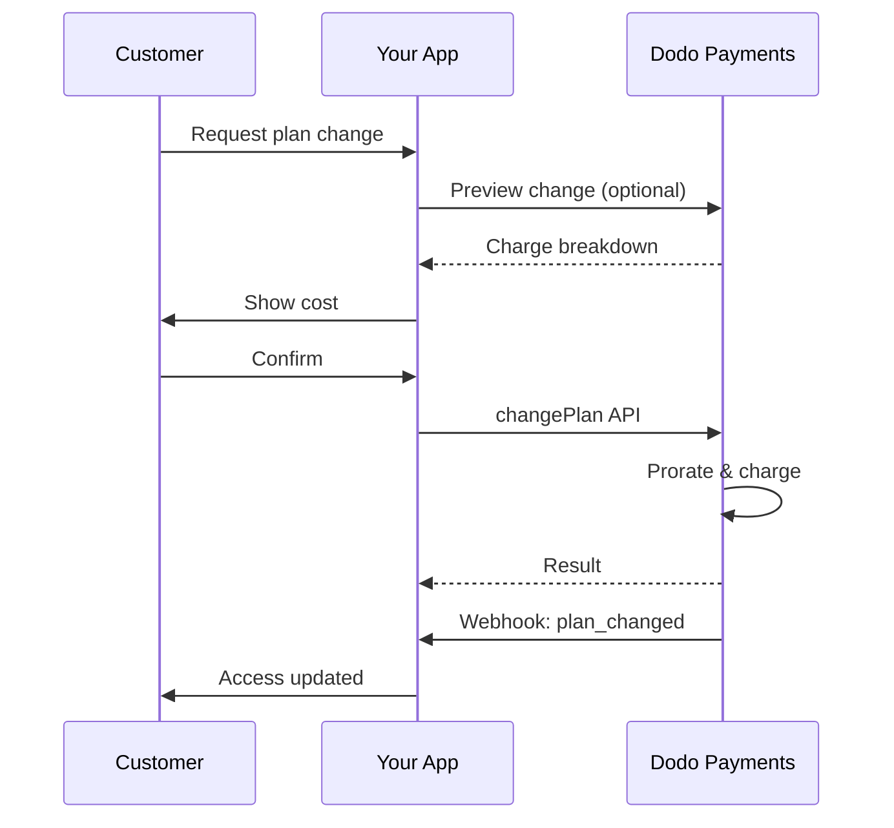
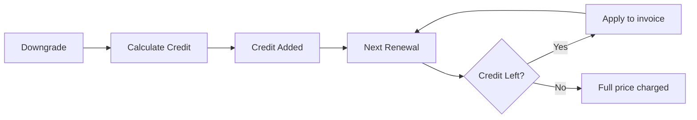

<Info>
サブスクリプションを使用すると、自動更新で継続的なアクセスを販売できます。柔軟な請求サイクル、無料トライアル、プラン変更、アドオンを使用して、各顧客に合わせた価格設定を行います。
</Info>

<CardGroup cols={2}>
<Card title="アップグレードとダウングレード" icon="repeat" href="/developer-resources/subscription-upgrade-downgrade">
按分と数量の更新でプラン変更を管理します。
</Card>

<Card title="オンデマンドサブスクリプション" icon="bolt" href="/developer-resources/ondemand-subscriptions">
今すぐ命令を承認し、後でカスタム金額で請求します。
</Card>

<Card title="顧客ポータル" icon="id-card" href="/features/customer-portal">
顧客がプラン、請求、キャンセルを管理できるようにします。
</Card>

<Card title="サブスクリプションWebhook" icon="code" href="/developer-resources/webhooks/intents/subscription">
作成、更新、キャンセルなどのライフサイクルイベントに反応します。
</Card>
</CardGroup>

## サブスクリプションとは？

サブスクリプションは、顧客がスケジュールに従って購入する定期的な製品です。以下に最適です：

- **SaaSライセンス**: アプリ、API、またはプラットフォームアクセス
- **メンバーシップ**: コミュニティ、プログラム、またはクラブ
- **デジタルコンテンツ**: コース、メディア、またはプレミアムコンテンツ
- **サポートプラン**: SLA、成功パッケージ、またはメンテナンス

## 主な利点

- **予測可能な収益**: 自動更新による定期請求
- **柔軟なサイクル**: 月次、年次、カスタム間隔、トライアル
- **プランの柔軟性**: アップグレードとダウングレードのための按分
- **アドオンと席数**: オプションの数量化可能なアップグレードを添付
- **シームレスなチェックアウト**: ホストされたチェックアウトと顧客ポータル
- **開発者ファースト**: 作成、変更、使用状況追跡のための明確なAPI

## サブスクリプションの作成

Dodo Paymentsダッシュボードでサブスクリプション製品を作成し、チェックアウトまたはAPIを通じて販売します。製品をアクティブなサブスクリプションから分離することで、価格設定のバージョン管理、アドオンの添付、パフォーマンスの独立した追跡が可能になります。

### サブスクリプション製品の作成

ダッシュボードでフィールドを設定して、サブスクリプションの販売、更新、請求の方法を定義します。以下のセクションは、作成フォームで見る内容に直接対応しています。

#### 製品の詳細

- **製品名** (必須): チェックアウト、顧客ポータル、請求書に表示される名前。
- **製品説明** (必須): チェックアウトと請求書に表示される明確な価値声明。
- **製品画像** (必須): PNG/JPG/WebP 最大3MB。チェックアウトと請求書で使用されます。
- **ブランド**: 特定のブランドに製品を関連付けてテーマやメールに使用します。
- **税カテゴリ** (必須): 税ルールを決定するためにカテゴリ（例: SaaS）を選択します。

<Tip>
正確な税カテゴリを選択して、地域ごとの正しい税金の徴収を確保してください。
</Tip>

#### 価格設定

- **料金タイプ**: <b>サブスクリプション</b>（このガイド）を選択します。代替として、単一支払いと使用量ベースの請求があります。
- **価格**（必須）: 通貨付きの基本的な定期価格。
- **適用可能な割引 (%)**: 基本価格に適用されるオプションのパーセンテージ割引; チェックアウトおよび請求書に反映されます。
- **毎回の支払い**（必須）: 更新の間隔、例: 1ヶ月ごと。カデンツ（ヶ月または年）と数量を選択します。
- **サブスクリプション期間**（必須）: サブスクリプションがアクティブな総期間（例: 10年）。この期間が終了すると、延長されない限り更新は停止します。
- **トライアル期間日数**（必須）: トライアルの長さを日数で設定します。トライアルを無効にするには0を使用します。トライアルが終了すると、自動的に最初の請求が発生します。
- **アドオンを選択**: 顧客が基本プランと一緒に購入できる最大10個のアドオンを添付します。

<Warning>
アクティブな製品の価格を変更すると、新しい購入に影響します。既存のサブスクリプションは、プラン変更と按分設定に従います。
</Warning>

<Info>
アドオンは、席数やストレージなどの数量化可能な追加に最適です。顧客が変更したときに許可される数量と按分の動作を制御できます。
</Info>

#### 高度な設定

- **税金を含む価格設定**: 適用される税金を含む価格を表示します。最終的な税金計算は顧客の所在地によって異なります。
- **ライセンスキーを生成**: 購入後に各顧客にユニークなキーを発行します。<a href="/features/license-keys">ライセンスキー</a>ガイドを参照してください。
- **デジタル製品の配信**: 購入後にファイルやコンテンツを自動的に配信します。<a href="/features/digital-product-delivery">デジタル製品の配信</a>で詳細を学びます。
- **メタデータ**: 内部タグ付けやクライアント統合のためにカスタムキー–バリューのペアを添付します。<a href="/api-reference/metadata">メタデータ</a>を参照してください。

<Tip>
メタデータを使用して、システムからの識別子（例: accountId）を保存し、後でイベントと請求書を照合できるようにします。
</Tip>

## サブスクリプショントライアル

トライアルを使用すると、顧客は即時の支払いなしでサブスクリプションにアクセスできます。最初の請求はトライアルが終了すると自動的に発生します。

### トライアルの設定

製品の価格設定セクションで**試用期間日数**を設定します（無効化するには`0`を使用してください）。サブスクリプションを作成する際にこれをオーバーライドできます:

```typescript
// Via subscription creation
const subscription = await client.subscriptions.create({
  customer_id: 'cus_123',
  product_id: 'prod_monthly',
  trial_period_days: 14  // Overrides product's trial period
});

// Via checkout session
const session = await client.checkoutSessions.create({
  product_cart: [{ product_id: 'prod_monthly', quantity: 1 }],
  subscription_data: { trial_period_days: 14 }
});
```

<Warning>
`trial_period_days`の値は0日から10,000日の間である必要があります。
</Warning>

### トライアルステータスの検出

<Warning>
現在、トライアルステータスを検出するための直接的なフィールドはありません。以下は、支払いをクエリする必要がある回避策であり、効率的ではありません。より効率的なソリューションに取り組んでいます。
</Warning>

サブスクリプションがトライアル中かどうかを判断するには、サブスクリプションの支払いリストを取得します。金額が0の支払いが正確に1件ある場合、サブスクリプションはトライアル期間中です：

```typescript
const subscription = await client.subscriptions.retrieve('sub_123');
const payments = await client.payments.list({
  subscription_id: subscription.subscription_id
});

// Check if subscription is in trial
const isInTrial = payments.items.length === 1 && 
                  payments.items[0].total_amount === 0;
```

### トライアル期間の更新

`next_billing_date`を更新することで試用期間を延長します:

```typescript
await client.subscriptions.update('sub_123', {
  next_billing_date: '2025-02-15T00:00:00Z'  // New trial end date
});
```

<Warning>
`next_billing_date`を過去の時間に設定することはできません。日付は未来の日付である必要があります。
</Warning>

## サブスクリプションプランの変更

プラン変更により、サブスクリプションをアップグレードまたはダウングレードしたり、数量を調整したり、異なる製品に移行したりできます。各変更は、選択した按分モードに基づいて即時の請求をトリガーします。

<Tip>
Dodo Payments ダッシュボードから直接サブスクリプションプランを変更し、次回の請求日を更新できます。これにより、API コールを行うことなく、カスタマーサポートリクエスト、プロモーションアップグレード、またはプラン移行のためにサブスクリプションを迅速に調整する方法が提供されます。
</Tip>

<Tip>
**セルフサービスのプラン変更を有効にする:** 顧客がカスタマーポータルで自分のサブスクリプションをアップグレードまたはダウングレードできるようにしますか？ サブスクリプション製品を製品コレクションに追加し、サブスクリプション設定で「サブスクリプション更新を許可」を有効にしてください。
</Tip>



<Card title="製品コレクション" icon="layer-group" href="/features/product-collections">
  関連製品をコレクションにまとめて、カスタマーポータルでのシームレスなアップグレード/ダウングレードパスを有効にします。
</Card>

### プロレーションモード

プランを変更する際の顧客の請求方法を選択します:

<Info>
**3つのプロレーションモードの簡単な比較:**

| | `prorated_immediately` | `difference_immediately` | `full_immediately` |
|---|---|---|---|
| **アップグレード** | 残りの日数に対する按分請求 | フル価格差を請求 | フル新プラン価格を請求 |
| **ダウングレード** | 残りの日数に対する按分クレジット | フル価格差をクレジットとして付与 | クレジットなし、フルチャージ |
| **請求サイクル** | 同じまま | 同じまま | 今日にリセット |
| **最適** | 公正な時間ベースの請求 | シンプルな階層変更 | 請求サイクルリセット |
</Info>

#### `prorated_immediately`
現在の請求サイクルの残存時間に基づいて按分された金額を請求します。使われていない時間を考慮する公正な請求に最適です。

```typescript
await client.subscriptions.changePlan('sub_123', {
  product_id: 'prod_pro',
  quantity: 1,
  proration_billing_mode: 'prorated_immediately'
});
```

#### `difference_immediately`
価格の差額を即座に請求します（アップグレード）または将来の更新に対してクレジットを追加します（ダウングレード）。シンプルなアップグレード/ダウングレードシナリオに最適です。

```typescript
// Upgrade: charges $50 (difference between $30 and $80)
// Downgrade: credits remaining value, auto-applied to renewals
await client.subscriptions.changePlan('sub_123', {
  product_id: 'prod_pro',
  quantity: 1,
  proration_billing_mode: 'difference_immediately'
});
```

<Info>
`difference_immediately`を使用してのダウングレードからのクレジットは、サブスクリプションスコープであり、将来の更新に自動的に適用されます。これらは<a href="/features/customer-credit">カスタマークレジット</a>とは異なります。
</Info>

顧客が`difference_immediately`を使用してダウングレードすると、未使用の価値はサブスクリプションスコープのクレジットとなり、将来の更新を自動的に相殺します:



#### `full_immediately`
残りの時間を無視して、新しいプラン全額を即座に請求します。請求サイクルをリセットするのに最適です。

```typescript
await client.subscriptions.changePlan('sub_123', {
  product_id: 'prod_monthly',
  quantity: 1,
  proration_billing_mode: 'full_immediately'
});
```

<AccordionGroup>
<Accordion title="例: プロレーションのアップグレード計算">

**シナリオ**: 基本プラン（$30/月）の顧客が30日サイクルの16日目にプロプラン（$80/月）にアップグレードする場合、`prorated_immediately`を使用します。

```
Unused credit from Basic = $30 × (15 remaining / 30 total) = $15.00
Prorated cost of Pro     = $80 × (15 remaining / 30 total) = $40.00
────────────────────────────────────────────────────────────────────
Immediate charge         = $40.00 − $15.00 = $25.00
```

元の請求日での次回更新: **$80.00/月**。

<Tip>
詳細な計算例やエッジケースについては、完全な[アップグレードとダウングレードガイド](/developer-resources/subscription-upgrade-downgrade)を参照してください。
</Tip>

</Accordion>
<Accordion title="例: ダウングレードクレジット計算">

**シナリオ**: プロプラン（$80/月）の顧客がスタートプラン（$20/月）にダウングレードします。`difference_immediately`を使用します。

```
Credit = Old plan − New plan = $80 − $20 = $60.00
```

$60のクレジットは将来の更新に自動的に適用されます:
- 更新1: $20 − $20（クレジット） = **$0.00**（$40のクレジット残り）
- 更新2: $20 − $20（クレジット） = **$0.00**（$20のクレジット残り）  
- 更新3: $20 − $20（クレジット） = **$0.00**（クレジット消費済み）
- 更新4: **$20.00**（フルプライス）

<Info>
将来の更新においてクレジットがどのように管理されているかについては、[アップグレードとダウングレードガイド](/developer-resources/subscription-upgrade-downgrade)を参照してください。
</Info>

</Accordion>
</AccordionGroup>

### アドオンを使用したプラン変更

プランを変更する際にアドオンを修正します。アドオンはプロレーション計算に含まれます:

```typescript
await client.subscriptions.changePlan('sub_123', {
  product_id: 'prod_pro',
  quantity: 1,
  proration_billing_mode: 'difference_immediately',
  addons: [{ addon_id: 'addon_extra_seats', quantity: 2 }]  // Add add-ons
  // addons: []  // Empty array removes all existing add-ons
});
```

<Info>
プラン変更は即時請求を引き起こします。失敗した請求はサブスクリプションを`on_hold`ステータスに移行させる可能性があります。`subscription.plan_changed` Webhookイベントを使用して変更を追跡します。
</Info>

### プラン変更のプレビュー

プラン変更を確定する前に、正確な請求と結果的なサブスクリプションをプレビューします:

```typescript
const preview = await client.subscriptions.previewChangePlan('sub_123', {
  product_id: 'prod_pro',
  quantity: 1,
  proration_billing_mode: 'prorated_immediately'
});

// Show customer the charge before confirming
console.log('You will be charged:', preview.immediate_charge.summary);
```

<Card title="プラン変更プレビュAPI" icon="eye" href="/api-reference/subscriptions/preview-change-plan">
  プラン変更を確定する前にプレビューします。
</Card>

## サブスクリプション状態

サブスクリプションは、そのライフサイクルの中で異なる状態にある可能性があります:

- **`active`**: サブスクリプションはアクティブで自動的に更新されます
- **`on_hold`**: 支払いの失敗によりサブスクリプションが一時停止されています。再活性化には支払い方法の更新が必要です
- **`cancelled`**: サブスクリプションはキャンセルされ、更新されません
- **`expired`**: サブスクリプションの終了日が達成されました
- **`pending`**: サブスクリプションが作成または処理中です

### 保留状態

サブスクリプションは次の理由で`on_hold`状態に入ります:

- 更新支払いが失敗した場合（資金不足、有効期限切れのカードなど）
- プラン変更の請求が失敗した場合
- 支払い方法の承認が失敗した場合

<Warning>
サブスクリプションが`on_hold`状態の場合、自動的に更新されません。サブスクリプションを再活性化するには、支払い方法を更新する必要があります。
</Warning>

### 保留からの再活性化

保留状態のサブスクリプションを再活性化するには、支払い方法を更新します。これにより、自動的に:
1. 残りの支払いを請求します
2. 請求書を生成します
3. 新しい支払い方法を使用して支払いを処理します
4. 支払い成功後、サブスクリプションが`active`状態に再活性化されます

```typescript
// Reactivate subscription from on_hold
const response = await client.subscriptions.updatePaymentMethod('sub_123', {
  type: 'new',
  return_url: 'https://example.com/return'
});

// For on_hold subscriptions, a charge is automatically created
if (response.payment_id) {
  console.log('Charge created:', response.payment_id);
  // Redirect customer to response.payment_link to complete payment
  // Monitor webhooks for payment.succeeded and subscription.active
}
```

<Info>
`on_hold`サブスクリプションの支払い方法が正常に更新された後、`payment.succeeded`と`subscription.active` webhookイベントが受信されます。
</Info>

## 統合例

## API管理

<AccordionGroup>
<Accordion title="サブスクリプションの作成">
`POST /subscriptions`を使用して、製品からプログラム的にサブスクリプションを作成します。オプショントライアルやアドオンも可能です。

<Card title="APIリファレンス" icon="code" href="/api-reference/subscriptions/post-subscriptions">
サブスクリプション作成APIを表示します。
</Card>
</Accordion>

<Accordion title="サブスクリプションの更新">
`PATCH /subscriptions/{id}`を使用して、数量を更新したり、次の請求日でキャンセルしたり、メタデータを修正したりします。

<Card title="APIリファレンス" icon="code" href="/api-reference/subscriptions/patch-subscriptions">
サブスクリプションの詳細を更新する方法を学びます。
</Card>
</Accordion>

<Accordion title="プラン変更（プロレーション）">
プロレーション制御を使用して、アクティブな製品と数量を変更します。

<Card title="APIリファレンス" icon="code" href="/api-reference/subscriptions/change-plan">
プラン変更のオプションを見直します。
</Card>
</Accordion>

<Accordion title="オンデマンド請求">
オンデマンドサブスクリプションに対して、必要に応じて特定の金額を請求します。

<Card title="APIリファレンス" icon="code" href="/api-reference/subscriptions/create-charge">
オンデマンドサブスクリプションを請求します。
</Card>
</Accordion>

<Accordion title="リストと取得">
`GET /subscriptions`を使用してすべてのサブスクリプションをリストし、`GET /subscriptions/{id}`を使用して1つを取得します。

<Card title="APIリファレンス" icon="code" href="/api-reference/subscriptions/get-subscriptions">
リストと取得APIを参照します。
</Card>
</Accordion>

<Accordion title="使用履歴">
メーターまたはハイブリッド価格モデルの記録された使用状況を取得します。

<Card title="APIリファレンス" icon="code" href="/api-reference/subscriptions/get-usage-history">
使用履歴APIを参照します。
</Card>
</Accordion>

<Accordion title="支払い方法の更新">
サブスクリプションの支払い方法を更新します。アクティブなサブスクリプションの場合、これは将来の更新のために支払い方法を更新します。`on_hold`状態のサブスクリプションの場合、これは残りの支払いの請求を作成することでサブスクリプションを再活性化します。

<Card title="APIリファレンス" icon="code" href="/api-reference/subscriptions/update-payment-method">
支払い方法を更新し、サブスクリプションを再活性化する方法を学びます。
</Card>
</Accordion>
</AccordionGroup>

## 一般的なユースケース

- **SaaSおよびAPI**: 座席や使用量に対するティアアクセス
- **コンテンツおよびメディア**: 初回トライアル付きの月額アクセス
- **B2Bサポートプラン**: プレミアムサポートアドオン付きの年間契約
- **ツールおよびプラグイン**: ライセンスキーやバージョン付きリリース

## 統合例

### チェックアウトセッション（サブスクリプション）
チェックアウトセッションを作成する際には、サブスクリプション製品とオプションのアドオンを含めます:

```typescript
const session = await client.checkoutSessions.create({
  product_cart: [
    {
      product_id: 'prod_subscription',
      quantity: 1
    }
  ]
});
```

### プロレーション付きのプラン変更
サブスクリプションをアップグレードまたはダウングレードし、プロレーションの動作を制御します:

```typescript
await client.subscriptions.changePlan('sub_123', {
  product_id: 'prod_new',
  quantity: 1,
  proration_billing_mode: 'difference_immediately'
});
```

### 次の請求日でキャンセル
現在の請求期間の最後で効果を発揮するキャンセルをスケジュールします:

```typescript
await client.subscriptions.update('sub_123', {
  cancel_at_next_billing_date: true
});
```

### オンデマンドサブスクリプション
オンデマンドサブスクリプションを作成し、必要に応じて後で請求します:

```typescript
const onDemand = await client.subscriptions.create({
  customer_id: 'cus_123',
  product_id: 'prod_on_demand',
  on_demand: true
});

await client.subscriptions.createCharge(onDemand.id, {
  amount: 4900,
  currency: 'USD',
  description: 'Extra usage for September'
});
```

### アクティブなサブスクリプションの支払い方法を更新
アクティブなサブスクリプションの支払い方法を更新します:

```typescript
// Update with new payment method
const response = await client.subscriptions.updatePaymentMethod('sub_123', {
  type: 'new',
  return_url: 'https://example.com/return'
});

// Or use existing payment method
await client.subscriptions.updatePaymentMethod('sub_123', {
  type: 'existing',
  payment_method_id: 'pm_abc123'
});
```

### 保留からのサブスクリプションの再活性化
支払いの失敗により保留になったサブスクリプションを再活性化します:

```typescript
// Update payment method - automatically creates charge for remaining dues
const response = await client.subscriptions.updatePaymentMethod('sub_123', {
  type: 'new',
  return_url: 'https://example.com/return'
});

if (response.payment_id) {
  // Charge created for remaining dues
  // Redirect customer to response.payment_link
  // Monitor webhooks: payment.succeeded → subscription.active
}
```

## RBI準拠の命令を伴うサブスクリプション

UPIおよびインドのカードのサブスクリプションは、特定の命令要件とともにRBI（インド準備銀行）の規制に基づいて運営されています:

### 命令制限

命令の種類と金額は、サブスクリプションの定期的な請求に依存します:

- **Rs 15,000未満の請求:** Rs 15,000 INRのオンデマンド命令を作成します。サブスクリプション金額はサブスクリプションの頻度に従って定期的に請求され、命令制限までを適用します。
- **Rs 15,000以上の請求:** 正確なサブスクリプション金額のためにサブスクリプション命令（またはオンデマンド命令）を作成します。

インドの支払い方法に対するRBI準拠の命令について詳しい情報は、<a href="/features/payment-methods/india">インドの支払い方法</a>ページを参照してください。

### アップグレードおよびダウングレードの考慮事項

**重要:** サブスクリプションをアップグレードまたはダウングレードする際には、命令制限を慎重に考慮してください:

- アップグレード/ダウングレードがRs 15,000を超える請求金額をもたらし、既存のオンデマンド支払い制限を超える場合、そのトランザクション請求が失敗する可能性があります。
- その場合、顧客は支払い方法を更新する必要があるか、正しい制限の新しい命令を確立するためにサブスクリプションを再度変更する必要があります。

### 高額請求の承認

Rs 15,000以上のサブスクリプション請求について:

- 顧客は銀行によってトランザクションの承認を求められます。
- 顧客がトランザクションを承認しなかった場合、そのトランザクションは失敗し、サブスクリプションは保留になります。

### 48時間の処理遅延

**処理タイムライン:** インドのカードとUPIサブスクリプションの定期的な請求は、独自の処理パターンに従います:

- 請求は、サブスクリプションの頻度に応じてスケジュールされた日に**開始**されます。
- 顧客のアカウントからの実際の**差引**は、支払い開始から**48時間**後にのみ行われます。
- この48時間のウィンドウは、銀行APIの応答に応じて最大**2-3時間**延長される可能性があります。

### 命令キャンセルウィンドウ

48時間の処理ウィンドウ中に:

- 顧客は銀行アプリを介して命令をキャンセルできます。
- 顧客がこの期間中に命令をキャンセルした場合、サブスクリプションは**アクティブのまま**となります（これはインドのカードとUPI自動請求サブスクリプションに特有のエッジケースです）。
- ただし、実際の差引が失敗する可能性があり、その場合、サブスクリプションは**保留**状態になります。

**エッジケースの処理:** 顧客への特典、クレジット、またはサブスクリプションの使用を請求開始時に即座に提供する場合、この48時間のウィンドウをアプリケーション内で適切に処理する必要があります。考慮すべき点:

- 支払い確認まで特典のアクティベーションを遅らせる
- グレース期間や一時的なアクセスを実装する
- 命令キャンセルについてサブスクリプション状態を監視する
- アプリケーションロジックでサブスクリプション保留状態を処理する

<Tip>
サブスクリプションのWebhookを監視して、支払いステータスの変更を追跡し、48時間のウィンドウ中に命令がキャンセルされた場合のエッジケースを処理してください。
</Tip>

## ベストプラクティス

- **明確なティアから始める:** 2〜3のプランで明らかな違いを持たせる
- **価格を伝える:** 合計、プロレーション、次回更新を表示する
- **トライアルを賢く使用する:** 時間だけでなく、オンボーディングで変換する
- **アドオンを活用する:** 基本プランをシンプルに保ち、追加をアップセルする
- **変更をテストする:** テストモードでプラン変更とプロレーションを検証する

<Info>
サブスクリプションは、定期収入のための柔軟な基盤です。シンプルに始め、徹底的にテストし、採用、解約、拡張の指標に基づいて反復してください。
</Info>