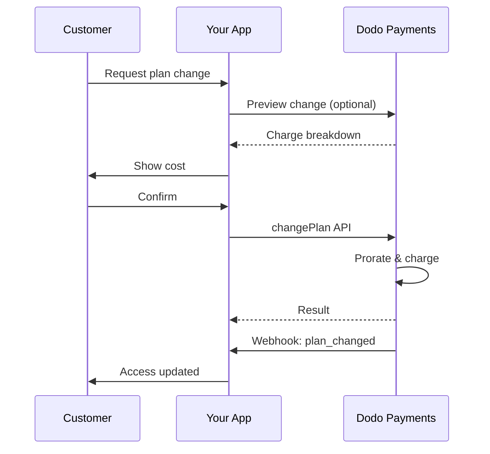
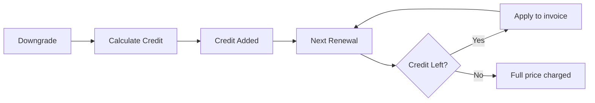
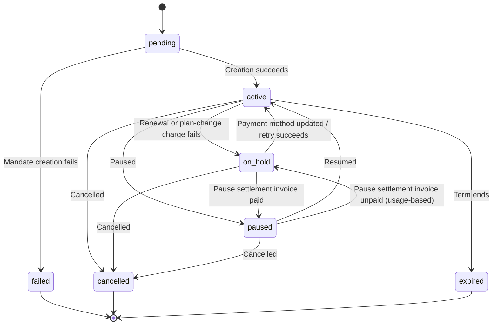

<Info>
Subscriptions let you sell ongoing access with automated renewals. Use flexible billing cycles, free trials, plan changes, and add‑ons to tailor pricing for each customer.
</Info>

<CardGroup cols={2}>
<Card title="Upgrade & Downgrade" icon="repeat" href="/developer-resources/subscription-upgrade-downgrade">
Control plan changes with proration and quantity updates.
</Card>

<Card title="On‑Demand Subscriptions" icon="bolt" href="/developer-resources/ondemand-subscriptions">
Authorize a mandate now and charge later with custom amounts.
</Card>

<Card title="Customer Portal" icon="id-card" href="/features/customer-portal">
Let customers manage plans, billing, and cancellations.
</Card>

<Card title="Subscription Webhooks" icon="code" href="/developer-resources/webhooks/intents/subscription">
React to lifecycle events like created, renewed, and canceled.
</Card>
</CardGroup>

## What Are Subscriptions?

Subscriptions are recurring products customers purchase on a schedule. They’re ideal for:

- **SaaS licenses**: Apps, APIs, or platform access
- **Memberships**: Communities, programs, or clubs
- **Digital content**: Courses, media, or premium content
- **Support plans**: SLAs, success packages, or maintenance

## Key Benefits

- **Predictable revenue**: Recurring billing with automated renewals
- **Flexible cycles**: Monthly, annual, custom intervals, and trials
- **Plan agility**: Proration for upgrades and downgrades
- **Add‑ons and seats**: Attach optional, quantifiable upgrades
- **Seamless checkout**: Hosted checkout and customer portal
- **Developer-first**: Clear APIs for creation, changes, and usage tracking

## Creating Subscriptions

Create subscription products in your Dodo Payments dashboard, then sell them through checkout or your API. Separating products from active subscriptions lets you version pricing, attach add‑ons, and track performance independently.

### Subscription product creation

Configure the fields in the dashboard to define how your subscription sells, renews, and bills. The sections below map directly to what you see in the creation form.

#### Product details

- **Product Name** (required): The display name shown in checkout, customer portal, and invoices.
- **Product Description** (required): A clear value statement that appears in checkout and invoices.
- **Product Image** (required): PNG/JPG/WebP up to 3 MB. Used on checkout and invoices.
- **Brand**: Associate the product with a specific brand for theming and emails.
- **Tax Category** (required): Choose the category (for example, SaaS) to determine tax rules.

<Tip>
Pick the most accurate tax category to ensure correct tax collection per region.
</Tip>

#### Pricing

- **Pricing Type**: <b>Subscription</b>（このガイド）を選択します。代替 विकल्पは Single Payment と Usage Based Billing です。
- **Price**（必須）: 通貨を含む基本の継続価格。価格は**$1**以上（または選択した通貨での相当額）である必要があります。この最低額未満はサポートされないため、サブスクリプションは機能しません。
- **Discount Applicable (%)**: 基本価格に適用する任意の割引率。チェックアウトと請求書に反映されます。
- **Repeat payment every**（必須）: 更新間隔（例: 1 Month ごと）。間隔（months または years）と数量を選択します。
- **Subscription Period**（必須）: サブスクリプションが有効である総期間（例: 10 Years）。この期間が終了すると、延長されない限り更新は停止します。
- **Trial Period Days**（必須）: トライアル期間を日数で設定します。トライアルを無効にするには 0 を使用します。トライアル終了時に最初の請求が自動的に行われます。
- **Trial Amount**: 有料トライアルの任意の前払い料金。無料トライアルの場合は未設定のままにします。[Paid Trials](#paid-trials) を参照してください。
- **Select add‑on**: 顧客が基本プランと一緒に購入できるアドオンを最大 10 個まで追加します。

<Warning>
Changing pricing on an active product affects new purchases. Existing subscriptions follow your plan‑change and proration settings.
</Warning>

<Info>
Add‑ons are ideal for quantifiable extras such as seats or storage. You can control allowed quantities and proration behavior when customers change them.
</Info>

#### Advanced settings

- **Tax Inclusive Pricing**: Display prices inclusive of applicable taxes. Final tax calculation still varies by customer location.
- **Generate license keys**: Issue a unique key to each customer after purchase. See the <a href="/features/license-keys">License Keys</a> guide.
- **Digital Product Delivery**: Deliver files or content automatically after purchase. Learn more in <a href="/features/digital-product-delivery">Digital Product Delivery</a>.
- **Metadata**: Attach custom key–value pairs for internal tagging or client integrations. See <a href="/api-reference/metadata">Metadata</a>.

<Tip>
Use metadata to store identifiers from your system (e.g., accountId) so you can reconcile events and invoices later.
</Tip>

## Subscription Trials

トライアルを利用すると、顧客は継続料金全額を支払う前にサブスクリプションを評価できます。トライアルには、終了まで料金が発生しない**無料**トライアルと、前払いで減額料金を請求する**有料**トライアルがあります。どちらの場合も、トライアル終了後の最初の更新から全額が適用されます。

### Configuring Trials

Set **Trial Period Days** in the product pricing section (use `0` to disable). You can override this when creating subscriptions:

```typescript
// Via subscription creation
const subscription = await client.subscriptions.create({
  customer: { customer_id: 'cus_123' },
  billing: { country: 'US' },
  product_id: 'pdt_monthly',
  quantity: 1,
  trial_period_days: 14  // Overrides product's trial period
});

// Via checkout session
const session = await client.checkoutSessions.create({
  product_cart: [{ product_id: 'pdt_monthly', quantity: 1 }],
  subscription_data: { trial_period_days: 14 }
});
```

<Warning>
The `trial_period_days` value must be between 0 and 10,000 days.
</Warning>

### Paid Trials

トライアルは無料である必要はありません。サブスクリプション商品の継続価格に**Trial Amount**を設定すると、トライアル期間に減額された前払い料金を請求できます。その後、最初の更新時から通常の継続価格が適用されます。

<Frame>

</Frame>

有料トライアルは、サブスクリプション単位やチェックアウトセッション単位ではなく、商品の価格に設定します。

| Field | Type | Description |
|-------|------|-------------|
| `trial_amount` | integer | トライアルに対して本日請求する金額。価格通貨の最小単位で指定します（例: $5.00 の場合は `500`）。`trial_period_days > 0` が必要です。無料トライアルの場合は省略するか `null` に設定します。 |
| `trial_apply_discounts` | boolean | checkout の割引コードでトライアル料金を減額するかどうか。デフォルトは `false` です。そのため、継続価格に割引が適用されてもトライアル料金は全額請求されます。 |

```typescript
const product = await client.products.create({
  name: 'Pro Plan',
  tax_category: 'saas',
  price: {
    type: 'recurring_price',
    price: 2900,                      // $29.00 per month after the trial
    currency: 'USD',
    discount: 0,
    purchasing_power_parity: false,
    payment_frequency_count: 1,
    payment_frequency_interval: 'Month',
    subscription_period_count: 1,
    subscription_period_interval: 'Year',
    trial_period_days: 14,            // A paid trial requires a positive trial period
    trial_amount: 500,                // $5.00 charged today
    trial_apply_discounts: false      // Discounts apply to the recurring price only
  }
});
```

有料トライアルも checkout を通過します。トライアル料金には税金がかかり、checkout セッションの計算と payment link の価格に表示され、Adaptive Currency のマークアップが通貨ごとに適用されます。[preview endpoint](/developer-resources/checkout-session) は `trial_amount` と `trial_period_days` を返すため、サブスクリプション作成前に本日支払う金額を表示できます。

<Info>
無料トライアルの動作は変わりません。**Trial Amount**を未設定にすると、従来どおり最初の請求は `0` となり、トライアル終了時に全額が請求されます。
</Info>

### トライアルの不正利用を防止する

**Prevent Trial Misuse** は、同じビジネスに対して顧客がトライアルを繰り返し申し込むことを防ぎます。有効にすると、すでにトライアルを利用した顧客は、新しいトライアルを受ける代わりに自動的に**有料・トライアルなしの購入**へ変更されます。

<Frame>

</Frame>

**Settings** の **Subscriptions** タブから有効にします。有効にすると、次のようになります。

- 顧客は**正規化されたメールアドレス**で照合され、plus エイリアスは除去されます。そのため `user+trial@example.com` と `user@example.com` は同一人物として扱われます。
- 利用記録は**トライアル有効化時**に保存されるため、同日にキャンセルした顧客もトライアルを消費したものとして扱われます。
- 既存顧客については、過去のトライアル履歴がメールアドレスでバックフィルされるため、過去のトライアル利用者もすぐに認識されます。

<Info>
この設定はデフォルトで**オフ**です。ビジネス単位のサブスクリプション制御の一覧については、[Subscription Settings](/features/product-collections#subscription-settings) を参照してください。
</Info>

### トライアル状態の検出

<Warning>
現在、トライアル状態を検出する直接的なフィールドはありません。以下は payments の取得が必要な回避策ですが、効率的ではありません。より効率的な解決策に取り組んでいます。
</Warning>

**無料トライアル**のサブスクリプションがトライアル中かどうかを確認するには、サブスクリプションの payments 一覧を取得します。金額が 0 の payment がちょうど 1 件ある場合、サブスクリプションはトライアル期間中です。

```typescript
const subscription = await client.subscriptions.retrieve('sub_123');
const payments = await client.payments.list({
  subscription_id: subscription.subscription_id
});

// Check if subscription is in trial
const isInTrial = payments.items.length === 1 && 
                  payments.items[0].total_amount === 0;
```

<Warning>
この金額 0 の確認は無料トライアルでのみ機能します。[有料トライアル](#paid-trials)では、最初の payment は `0` ではなくトライアル料金と同額です。最初の payment をサブスクリプションの `trial_amount` と比較するか、`next_billing_date` がまだトライアル期間内かどうかを確認してください。
</Warning>

### トライアル期間の更新

`next_billing_date` を更新してトライアルを延長します。

```typescript
await client.subscriptions.update('sub_123', {
  next_billing_date: '2025-02-15T00:00:00Z'  // New trial end date
});
```

<Warning>
`next_billing_date` に過去の時刻を設定することはできません。日付は未来である必要があります。
</Warning>

## サブスクリプションプランの変更

プラン変更では、サブスクリプションのアップグレードやダウングレード、数量の調整、別の商品への移行ができます。選択した日割り計算モードによっては、変更時に即時請求が発生したり、クレジットが作成されたり、請求調整が行われなかったりします。

<Tip>
Dodo Payments ダッシュボードから、サブスクリプションプランと次回請求日を直接変更できます。API 呼び出しを行わずに、カスタマーサポートへの依頼、プロモーションによるアップグレード、プラン移行にすばやく対応できます。
</Tip>

<Tip>
**セルフサービスのプラン変更を有効にする:** 顧客が Customer Portal から自分でサブスクリプションをアップグレードまたはダウングレードできるようにしますか？サブスクリプション商品を Product Collection に追加し、Subscription Settings で「Allow Subscription Updates」を有効にしてください。
</Tip>



<Card title="Product Collections" icon="layer-group" href="/features/product-collections">
  関連商品をコレクションにまとめると、Customer Portal でスムーズなアップグレード／ダウングレード経路を有効にできます。
</Card>

### 日割り計算モード

プラン変更時の顧客への請求方法を選択します。

<Info>
**4 つの日割り計算モードの比較:**

| | `prorated_immediately` | `difference_immediately` | `full_immediately` | `do_not_bill` |
|---|---|---|---|---|
| **アップグレード** | 残り日数分の日割り請求 | 価格差額を全額請求 | 新プラン価格を全額請求 | 請求なし — 即時切り替え |
| **ダウングレード** | 残り日数分の日割りクレジット | 価格差額を全額クレジット | クレジットなし、全額請求 | クレジットなし — 即時切り替え |
| **請求サイクル** | 本日にリセット | 本日にリセット | 本日にリセット | 変更なし |
| **最適な用途** | 時間に応じた公平な請求 | シンプルなティア変更 | 請求サイクルのリセット | 無料移行または特別対応 |
</Info>

#### `prorated_immediately`
現在の請求サイクルの残り時間に基づいて日割り金額を請求します。未使用期間を考慮した公平な請求に適しています。

```typescript
await client.subscriptions.changePlan('sub_123', {
  product_id: 'pdt_pro',
  quantity: 1,
  proration_billing_mode: 'prorated_immediately'
});
```

#### `difference_immediately`
価格差額を即時に請求（アップグレード）するか、今後の更新に使用するクレジットを追加（ダウングレード）します。シンプルなアップグレード／ダウングレードに適しています。

```typescript
// Upgrade: charges $50 (difference between $30 and $80)
// Downgrade: credits remaining value, auto-applied to renewals
await client.subscriptions.changePlan('sub_123', {
  product_id: 'pdt_pro',
  quantity: 1,
  proration_billing_mode: 'difference_immediately'
});
```

<Info>
`difference_immediately` を使用したダウングレードのクレジットはサブスクリプション単位で管理され、今後の更新に自動適用されます。<a href="/features/credit-based-billing">Credit-Based Billing</a> の特典とは異なります。
</Info>

顧客が `difference_immediately` でダウングレードすると、未使用分がサブスクリプション単位のクレジットとなり、今後の更新に自動的に充当されます。



#### `full_immediately`
残り時間を考慮せず、新プランの全額を即時請求します。請求サイクルのリセットに適しています。

```typescript
await client.subscriptions.changePlan('sub_123', {
  product_id: 'pdt_monthly',
  quantity: 1,
  proration_billing_mode: 'full_immediately'
});
```

#### `do_not_bill`
請求調整なしで新プランに切り替えます。日割り請求もクレジットもなく、顧客はそのまま新プランへ移行します。特別対応による移行、無料プランへの切り替え、価格差額を事業者が負担する場合に適しています。

```typescript
await client.subscriptions.changePlan('sub_123', {
  product_id: 'pdt_new_plan',
  quantity: 1,
  proration_billing_mode: 'do_not_bill'
});
```

<AccordionGroup>
<Accordion title="Example: Prorated upgrade calculation">

**シナリオ**: Basic（$30/月）の顧客が、30 日サイクルの 16 日目に `prorated_immediately` を使用して Pro（$80/月）へアップグレードします。

```
Unused credit from Basic = $30 × (15 remaining / 30 total) = $15.00
Prorated cost of Pro     = $80 × (15 remaining / 30 total) = $40.00
────────────────────────────────────────────────────────────────────
Immediate charge         = $40.00 − $15.00 = $25.00
```

次回更新日は**2 月 15 日**（1 月 16 日 + 30 日）で、料金は**$80.00/月**です。

<Tip>
計算例とエッジケースの詳細については、[Upgrade & Downgrade Guide](/developer-resources/subscription-upgrade-downgrade) を参照してください。
</Tip>

</Accordion>
<Accordion title="Example: Downgrade credit calculation">

**シナリオ**: Pro（$80/月）の顧客が、`difference_immediately` を使用して Starter（$20/月）へダウングレードします。

```
Credit = Old plan − New plan = $80 − $20 = $60.00
```

$60 のクレジットが今後の更新に自動適用されます。
- 更新 1: $20 − $20（クレジット）= **$0.00**（残りのクレジット $40）
- 更新 2: $20 − $20（クレジット）= **$0.00**（残りのクレジット $20）  
- 更新 3: $20 − $20（クレジット）= **$0.00**（クレジット消化）
- 更新 4: **$20.00**（全額）

<Info>
クレジットの管理方法については、[Upgrade & Downgrade Guide](/developer-resources/subscription-upgrade-downgrade) を参照してください。
</Info>

</Accordion>
</AccordionGroup>

### アドオン付きプランの変更

プラン変更時にアドオンを変更できます。アドオンは日割り計算に含まれます。

```typescript
await client.subscriptions.changePlan('sub_123', {
  product_id: 'pdt_pro',
  quantity: 1,
  proration_billing_mode: 'difference_immediately',
  addons: [{ addon_id: 'addon_extra_seats', quantity: 2 }]  // Add add-ons
  // addons: []  // Empty array removes all existing add-ons
});
```

<Info>
デフォルトでは、`effective_at: 'immediately'` プランの変更によって即時に請求が発生します。変更を次回の請求日にスケジュールするには `effective_at: 'next_billing_date'` を渡してください。保留中の変更はサブスクリプション上で `scheduled_change` として返され、[スケジュール済みプラン変更をキャンセル](/api-reference/subscriptions/cancel-change-plan)でキャンセルできます。請求に失敗すると、サブスクリプションが `on_hold` ステータスに移行する場合があります。ただし `on_payment_failure: 'prevent_change'` を渡すと、支払いが成功するまでサブスクリプションは現在のプランに維持されます。変更は `subscription.plan_changed` webhook イベントで追跡できます。
</Info>

### プラン変更のプレビュー

プラン変更を確定する前に、正確な請求額と変更後のサブスクリプションをプレビューします。

```typescript
const preview = await client.subscriptions.previewChangePlan('sub_123', {
  product_id: 'pdt_pro',
  quantity: 1,
  proration_billing_mode: 'prorated_immediately'
});

// Show customer the charge before confirming
console.log('You will be charged:', preview.immediate_charge.summary);
```

<Card title="Preview Change Plan API" icon="eye" href="/api-reference/subscriptions/preview-change-plan">
  確定する前にプラン変更をプレビューします。
</Card>

## サブスクリプションの一時停止と再開

一時停止すると、サブスクリプションを終了せずに凍結できます。請求が停止され、アクセスが取り消されますが、サブスクリプションのプランと履歴は保持されるため、顧客は停止した場所からそのまま再開できます。キャンセルに代わる顧客維持の手段として使用してください。

**Sales → Subscriptions** で任意のアクティブなサブスクリプションを開き、**Pause subscription** をクリックします。ステータスが `paused` に変わり、サブスクリプションが再開されるまで更新が停止します。

<Frame>
    
</Frame>

### 一時停止するとどうなるか

- **更新が停止します。** サブスクリプションの一時停止中は、invoice が生成されず、更新料金の請求も試行されません。
- **アクセスが直ちに取り消されます。** 一時停止すると、サブスクリプションで付与済みおよび保留中のすべての [entitlement grant](/features/entitlements/introduction) が取り消され、[license keys](/features/license-keys) が無効になり、新しい [digital product](/features/digital-product-delivery) のダウンロード URL が発行されなくなります。再開すると、`on_hold` から復旧する場合と同様に、これらが再付与されます。
- **請求時計が停止します。** `next_billing_date` と `expires_at` は、どちらも一時停止期間とまったく同じ長さだけ先送りされるため、顧客はすでに支払った時間を保持できます。
- **一時停止期間に制限はありません。** 一時停止されたサブスクリプションは、誰かが再開するまで一時停止されたままです。あらかじめ停止期間を設定する必要はありません。

<Warning>
一時停止すると、請求期間の終了時ではなく直ちにアクセスが取り消されます。サブスクリプションによってプロダクトへのアクセスを制御している場合は、顧客が確定する前にその点を明確に伝えてください。
</Warning>

再開すると、サブスクリプションは `active` に戻り、entitlement が復元されます。時計が停止していたため、次回の更新は当初の予定より一時停止期間分だけ後になります。たとえば、12日間一時停止したサブスクリプションは、12日遅れて更新されます。

### Usage-Based Subscription の一時停止

[Usage-Based](/features/usage-based-billing/introduction) subscription は、一時停止時点で記録済みだがまだ請求されていない usage を持つ場合があります。**Settings → Subscriptions** の **Bill Usage at Pause** により、その usage の処理方法を決定します。

| Setting | Behavior |
|---------|----------|
| **On** (default) | Dodo Payments は、前回の請求日以降に累積した usage に対する invoice を発行し、直ちに回収します。 |
| **Off** | 未払いの usage は繰り越され、サブスクリプションの次回通常 invoice で請求されます。 |

この方法で精算されるのは meter された usage のみです。recurring base fee が一時停止時に請求されることはありません。Standard subscription と on-demand subscription には精算対象がないため、この設定は影響しません。

<Info>
**Bill Usage at Pause** は billing cycle ごとに記録されます。cycle の途中で変更しても、すでに進行中の cycle の精算方法は変わりません。新しい値は次の cycle 以降に適用されます。
</Info>

<Warning>
精算 invoice は他の invoice と同様に回収されるため、失敗する可能性があります。[dunning](/features/recovery/subscription-dunning) の猶予期間を過ぎても未払いの場合、サブスクリプションは一時停止フラグが付いたまま `on_hold` に移行します。
</Warning>

その状態のサブスクリプションには、未払いの usage を誰が負担するかによって異なる、2つの解決方法があります。

| Exit | Result |
|------|--------|
| 精算 invoice が支払われる | サブスクリプションは `paused` に戻ります。`active` には戻りません。顧客の準備が整ったら、明示的に再開してください。 |
| 直接再開する | サブスクリプションは `active` に直接移行し、未払いの精算 invoice は保留中の retry とともに **voided** になります。未払いの usage は放棄扱いになります。 |

<Info>
再開はこの保留状態からの有効な解決方法です。先に精算 invoice を回収する必要はありません。ただし、再開すると未払いの usage は繰り越されず免除される点に注意してください。
</Info>

### 顧客自身によるサブスクリプションの一時停止を許可する

**Settings → Subscriptions** の **Allow Subscription Pause** は、顧客が Customer Portal から一時停止と再開を行えるかどうかを制御します。**デフォルトではオフ**のため、セルフサービスによる一時停止はオプトインです。

<Frame>
    
</Frame>

この設定が制御するのは Customer Portal のみです。トグルの設定に関係なく、ダッシュボードまたは API からいつでも一時停止と再開を行えます。

オフにすると、顧客による新たな一時停止は停止します。ただし、すでに一時停止中の顧客が閉じ込められることはありません。顧客自身が開始した一時停止は引き続き再開できます。あなたが開始した一時停止は、引き続きあなたが管理できます。

<Card title="Pausing from the Customer Portal" icon="id-card" href="/features/customer-portal#pausing-a-subscription">
確認ダイアログを含め、顧客に表示される内容を確認できます。
</Card>

### API による一時停止

一時停止と再開は、サブスクリプション更新エンドポイントの `status` フィールドを通じて実行します。個別の一時停止エンドポイントはありません。

```typescript
// Pause
await client.subscriptions.update('sub_123', { status: 'paused' });

// Resume
await client.subscriptions.update('sub_123', { status: 'active' });
```

<Warning>
`paused` または `active` を単独で送信してください。いずれかを他のフィールドと組み合わせると、`422` が返されて拒否されます。以前の boolean 型の `pause` フィールドは削除され、現在は常に `422` で失敗します。そのため、まだこのフィールドを使用している呼び出し元には、サイレントな no-op ではなく明確なエラーが返されます。
</Warning>

一時停止すると `subscription.paused` が発行され、再開すると `subscription.unpaused` が発行されます。どちらも完全な subscription object を含み、一時停止中は `paused_at` が設定され、再開後は `null` が設定されます。

### 一時停止とその他のサブスクリプション操作

- **キャンセルは引き続き機能します。** 一時停止中のサブスクリプションも、アクティブなサブスクリプションと同じ方法でキャンセルできます。実行すると、一時停止に関連する未確定の精算 invoice は voided になります。
- **スケジュール済みのプラン変更は破棄されず、延期されます。** 次回 billing date に予定された [plan change](#subscription-plan-changes) は、サブスクリプションの一時停止中も変更されずに保持され、再開後、変更後の billing date に適用されます。その `scheduled_change.effective_at` はスケジュール時点の snapshot であり、一時停止に合わせて調整されません。そのため、過去の日付が表示される場合があります。これは「予定されていた日付」と解釈し、確定した日付とはみなさないでください。変更を適用せず破棄する場合は、[Cancel Scheduled Plan Change](/api-reference/subscriptions/cancel-change-plan) を使用してください。

## Subscription States

サブスクリプションは、存続期間中に定義済みの一連の status を遷移します。この table は、すべての status、その原因、復旧方法（または復旧できるかどうか）を確認するためのリファレンスです。

| ステータス | 意味 | 復旧可能か | 復旧方法 / 次のステップ |
|--------|---------------|--------------|---------------------------|
| `pending` | サブスクリプションを作成または処理しています | — | `subscription.active`（または `subscription.failed`）を待ちます |
| `active` | サブスクリプションは有効で、自動的に更新されます | — | 対応は不要です |
| `on_hold` | 更新時の支払い（またはプラン変更による請求）が失敗し、更新が停止しています | **はい** | 支払い方法を更新して再有効化します。[Payment Retries](/features/recovery/payment-retries) と [Dunning](/features/recovery/subscription-dunning) による自動更新、または [Update Payment Method API](/api-reference/subscriptions/update-payment-method) による手動更新が可能です |
| `paused` | サブスクリプションはあなたまたは顧客によって意図的に一時停止され、請求が凍結されてアクセスが取り消されています | **はい** | `status: active` で再開するか、セルフサービスの一時停止が有効になっている場合は Customer Portal から再開します。詳細は [サブスクリプションの一時停止と再開](#pausing-and-resuming-subscriptions) を参照してください |
| `cancelled` | サブスクリプションはキャンセルされ、更新されません | 再購入のみ | 顧客は新しいサブスクリプションを開始する必要があります。[Dunning](/features/recovery/subscription-dunning) によって再購入を促すことができます |
| `failed` | サブスクリプションの **作成** に失敗しました（初回の mandate または支払いが成功しませんでした） | **いいえ — 終端状態** | 顧客は、利用可能な支払い方法を使用して新しいサブスクリプションを作成する必要があります |
| `expired` | サブスクリプションが契約期間の終了に達しました | — | 顧客が希望する場合は、新しいサブスクリプションを開始する必要があります |

<Warning>
`on_hold` と `failed` は混同されがちです。`on_hold` は、すでにアクティブなサブスクリプションの更新が失敗した場合の **recoverable** な state です。`failed` は、**initial** subscription creation が失敗した場合にのみ発生する **terminal** state で、再有効化できません。
</Warning>

<Info>
`on_hold` と `paused` も異なる status です。`on_hold` は非自発的な状態で、payment が失敗した場合に発生します。`paused` は意図的な状態で、あなたまたは顧客がサブスクリプションの凍結を選択した場合に発生し、一時停止中は更新が試行されません。Usage-based subscription は、一時停止時点で one-off の精算 invoice が未払いになる場合があります。[Pausing Usage-Based Subscriptions](#pausing-usage-based-subscriptions) を参照してください。
</Info>

### State Machine



### On Hold State

サブスクリプションは、次の場合に `on_hold` state になります。

- 更新 payment が失敗した（残高不足、カードの有効期限切れなど）
- plan change charge が失敗した
- payment method の authorization が失敗した
- Usage-based subscription の [pause settlement invoice](#pausing-usage-based-subscriptions) が未払いになった

<Warning>
サブスクリプションが `on_hold` state の場合、自動的には更新されません。サブスクリプションを再有効化するには、payment method を更新する必要があります。
</Warning>

### On Hold からの再有効化

`on_hold` state のサブスクリプションを再有効化するには、payment method を更新します。これにより、次の処理が自動的に行われます。

1. 未払い残高に対する charge を作成
2. invoice を生成
3. 新しい payment method を使用して payment を処理
4. payment が成功すると、サブスクリプションを `active` state に再有効化

<Note>
唯一の例外は、未払いの pause settlement invoice が原因で保留になっている場合です。その invoice を支払うと、サブスクリプションは `active` ではなく `paused` に戻ります。これは、payment が失敗する前の状態が一時停止だったためです。invoice の精算後、明示的に再開してください。
</Note>

```typescript
// Reactivate subscription from on_hold
const response = await client.subscriptions.updatePaymentMethod('sub_123', {
  payment_method: {
    type: 'new',
    return_url: 'https://example.com/return'
  }
});

// For on_hold subscriptions, a charge is automatically created
if (response.payment_id) {
  console.log('Charge created:', response.payment_id);
  // Redirect customer to response.payment_link to complete payment
  // Monitor webhooks for payment.succeeded and subscription.active
}
```

<Info>
`on_hold` のサブスクリプションで payment method の更新に成功すると、`payment.succeeded` に続いて `subscription.active` webhook event が届きます。
</Info>

### Transition ごとの Webhook Event

各 transition は webhook を発行するため、polling なしで entitlement logic を実行できます。

| Transition | Event |
|------------|-------|
| Subscription activated | `subscription.active` |
| Renewal succeeds | `subscription.renewed` |
| Renewal fails → on hold | `subscription.on_hold` |
| Subscription paused | `subscription.paused` |
| Paused subscription resumed | `subscription.unpaused` |
| Creation fails | `subscription.failed` |
| Plan upgraded/downgraded | `subscription.plan_changed` |
| Cancelled | `subscription.cancelled` |
| Term ended | `subscription.expired` |
| Any field changes | `subscription.updated` |

<Card title="Subscription Webhook Payloads" icon="webhook" href="/developer-resources/webhooks/intents/subscription">
subscription lifecycle event の完全な payload schema を確認できます。
</Card>

## API Management

<AccordionGroup>
<Accordion title="Create subscriptions">
`POST /checkouts` を使用して、optional trial（`subscription_data.trial_period_days`）および add-on（`product_cart[].addons`）付きの subscription を product から programmatically に作成します。

<Warning>
`POST /subscriptions` は deprecated です。既存の integration は引き続き動作しますが、新しい integration では [Checkout Sessions](/api-reference/checkout-sessions/create) を使用してください。
</Warning>

<Card title="API Reference" icon="code" href="/api-reference/checkout-sessions/create">
create checkout session API を確認できます。
</Card>
</Accordion>

<Accordion title="Update subscriptions">
`PATCH /subscriptions/{subscription_id}` を使用して、次回 billing date でのキャンセル、subscription period の延長、billing details の更新、metadata の変更を行えます。quantity を変更するには、代わりに [Change Plan API](/api-reference/subscriptions/change-plan) を使用してください。`PATCH` は `quantity` を受け付けません。

<Card title="API Reference" icon="code" href="/api-reference/subscriptions/patch-subscriptions">
subscription details の更新方法を確認できます。
</Card>
</Accordion>

<Accordion title="Pause and resume subscriptions">
一時停止と再開には、`status` フィールドを使用して同じ `PATCH /subscriptions/{subscription_id}` エンドポイントを使用します。`status: paused` は有効なサブスクリプションを一時停止し、`status: active` は再開します。同じリクエスト内で、どちらの値も他のフィールドと組み合わせることはできません。動作の詳細、請求への影響、および関連するビジネス設定については、[サブスクリプションの一時停止と再開](#pausing-and-resuming-subscriptions) を参照してください。

<Card title="API Reference" icon="code" href="/api-reference/subscriptions/patch-subscriptions">
`status` フィールドを含むサブスクリプション更新 API を確認できます。
</Card>
</Accordion>

<Accordion title="Change plans (proration)">
proration controls を使用して、アクティブな product と quantity を変更します。

<Card title="API Reference" icon="code" href="/api-reference/subscriptions/change-plan">
plan change options を確認します。
</Card>
</Accordion>

<Accordion title="On‑demand charges">
on-demand subscription では、指定した金額をオンデマンドで請求します。

<Card title="API Reference" icon="code" href="/api-reference/subscriptions/create-charge">
on-demand subscription の請求を行います。
</Card>
</Accordion>

<Accordion title="List and retrieve">
`GET /subscriptions` ですべての subscription を一覧表示し、`GET /subscriptions/{id}` で1つを取得します。

<Card title="API Reference" icon="code" href="/api-reference/subscriptions/get-subscriptions">
一覧表示および取得 API を確認できます。
</Card>
</Accordion>

<Accordion title="Usage history">
metered または hybrid pricing model の記録済み usage を取得します。

<Card title="API Reference" icon="code" href="/api-reference/subscriptions/get-usage-history">
usage history API を確認できます。
</Card>
</Accordion>

<Accordion title="Update payment method">
subscription の payment method を更新します。アクティブな subscription では、今後の更新に使用する payment method が更新されます。`on_hold` state の subscription では、未払い残高に対する charge を作成して subscription を再有効化します。

新しい payment-method link（`New` request type）を生成するとき、`allowed_payment_method_types` を渡すことで、そのページで顧客に表示する payment method を制限できます。顧客にはリストにない method は表示されません。ただし、method を含めても表示が保証されるわけではありません（利用可能性は顧客の location や business settings などにも左右されます）。

<Card title="API Reference" icon="code" href="/api-reference/subscriptions/update-payment-method">
payment method の更新と subscription の再有効化の方法を確認できます。
</Card>
</Accordion>
</AccordionGroup>

## 一般的なユースケース

- **SaaS と API**: seat または usage 用の add-on を備えた段階的な access
- **コンテンツとメディア**: introductory trial 付きの月額 access
- **B2B support plan**: premium support add-on 付きの年間契約
- **ツールと plugin**: license key と versioned release

## Integration の例

### Checkout Sessions（subscription）
checkout session を作成するときは、subscription product と optional add-on を含めます。

```typescript
const session = await client.checkoutSessions.create({
  product_cart: [
    {
      product_id: 'pdt_subscription',
      quantity: 1
    }
  ]
});
```

### proration を伴う plan change
subscription を upgrade または downgrade し、proration の動作を制御します。

```typescript
await client.subscriptions.changePlan('sub_123', {
  product_id: 'pdt_new',
  quantity: 1,
  proration_billing_mode: 'difference_immediately'
});
```

### 次回 billing date でキャンセル
現在の billing period の終了時に有効になるキャンセルをスケジュールします。

```typescript
await client.subscriptions.update('sub_123', {
  cancel_at_next_billing_date: true
});
```

### subscription period の延長
新しい `subscription_period_count` と `subscription_period_interval` を `PATCH /subscriptions/{subscription_id}` に渡して、subscription の実行期間を延長します。subscription の expiry は新しい count と interval から再計算されます。たとえば、顧客に現在の plan の追加期間を付与する場合は次のようにします。

```typescript
await client.subscriptions.update('sub_123', {
  subscription_period_count: 5,
  subscription_period_interval: 'Month'
});
```

<Note>
subscription の period は **増加のみ**可能で、短縮することはできません。
</Note>

### On-demand subscription
On-demand subscription を作成し、必要に応じて後から請求します。

```typescript
const onDemand = await client.subscriptions.create({
  customer: { customer_id: 'cus_123' },
  billing: { country: 'US' },
  product_id: 'pdt_on_demand',
  quantity: 1,
  on_demand: { mandate_only: true }
});

await client.subscriptions.charge(onDemand.subscription_id, {
  product_price: 4900,
  product_currency: 'USD',
  product_description: 'Extra usage for September'
});
```

### アクティブな subscription の payment method を更新
アクティブな subscription の payment method を更新します。

```typescript
// Update with new payment method
const response = await client.subscriptions.updatePaymentMethod('sub_123', {
  payment_method: {
    type: 'new',
    return_url: 'https://example.com/return'
  }
});

// Or use existing payment method
await client.subscriptions.updatePaymentMethod('sub_123', {
  payment_method: {
    type: 'existing',
    payment_method_id: 'pm_abc123'
  }
});
```

### on_hold から subscription を再有効化
payment 失敗により on hold になった subscription を再有効化します。

```typescript
// Update payment method - automatically creates charge for remaining dues
const response = await client.subscriptions.updatePaymentMethod('sub_123', {
  payment_method: {
    type: 'new',
    return_url: 'https://example.com/return'
  }
});

if (response.payment_id) {
  // Charge created for remaining dues
  // Redirect customer to response.payment_link
  // Monitor webhooks: payment.succeeded → subscription.active
}
```

## RBI-Compliant Mandate を使用する Subscription

  UPI と Indian card の subscription は、特定の mandate 要件を伴う RBI（Reserve Bank of India）規制に基づいて運用されます。

  ### Mandate の上限

  mandate の type と amount は、subscription の recurring charge によって異なります。

  - **mandate floor 未満の charge（デフォルト ₹15,000）:** floor amount に対する on-demand mandate を作成します。subscription amount は、subscription frequency に従って mandate limit まで定期的に請求されます。
  - **mandate floor 以上の charge:** subscription amount と同額の subscription mandate（または on-demand mandate）を作成します。

  mandate floor は、`mandate_min_amount_inr_paise`（INR paise）を使用して merchant 単位または request 単位で設定できます。bank に登録される amount は `max(mandate_floor, billing_amount)` です。そのため、billing がそれより低い場合、floor は実質的に顧客向けの authorization ceiling になります。

RBI-compliant mandate と、Indian payment method 用に設定可能な mandate floor の詳細については、<a href="/features/payment-methods/india#configurable-mandate-floor">India Payment Methods</a> ページを参照してください。

  ### Upgrade と Downgrade に関する考慮事項

  **重要:** subscription を upgrade または downgrade するときは、mandate limit を慎重に考慮してください。

  - upgrade または downgrade によって charge amount が Rs 15,000 を超え、既存の on-demand payment limit も超過すると、transaction charge が失敗する可能性があります。
  - この場合、顧客は payment method を更新するか、subscription を再度変更して、正しい limit の新しい mandate を設定する必要がある場合があります。

  ### 高額 charge の Authorization

  Rs 15,000 以上の subscription charge では、次のようになります。

  - 顧客は bank から transaction の authorization を求められます。
  - 顧客が transaction の authorization に失敗すると、transaction は失敗し、subscription は on hold になります。

  ### 48時間の Processing Delay

  **Processing Timeline:** Indian card と UPI subscription の recurring charge には、固有の processing pattern があります。

  - charge は、subscription frequency に従って scheduled date に **initiated** されます。
  - 顧客の account から実際に **deduction** されるのは、payment initiation から **48時間後** です。
  - この48時間の window は、bank API の response によって **追加で2〜3時間** 延長される場合があります。

  ### Mandate Cancellation Window

  48時間の processing window 中は、次のことが可能です。

  - 顧客は banking app から mandate をキャンセルできます。
  - 顧客がこの期間中に mandate をキャンセルしても、subscription は **active** のままです（これは Indian card と UPI AutoPay subscription に固有の edge case です）。
  - ただし、実際の deduction は失敗する可能性があり、その場合 subscription は **on hold** になります。

  **Edge Case Handling:** charge initiation の直後に顧客へ benefits、credits、または subscription usage を提供する場合は、アプリケーションでこの48時間の window を適切に処理する必要があります。次の対応を検討してください。

  - payment confirmation まで benefit activation を遅延させる
  - grace period または一時的な access を実装する
  - mandate cancellation に備えて subscription status を監視する
  - アプリケーションの logic で subscription hold state を処理する

  <Tip>
  subscription webhook を監視して payment status の変更を追跡し、48時間の window 中に mandate がキャンセルされた場合の edge case に対応してください。
  </Tip>

## ベストプラクティス

- **明確な tier から始める:** 違いが明確な2〜3個の plan を用意する
- **pricing を伝える:** total、proration、次回の renewal を表示する
- **trial を適切に活用する:** 単に期間を設けるのではなく、onboarding で conversion する
- **add-on を活用する:** base plan をシンプルに保ち、追加機能を upsell する
- **変更をテストする:** test mode で plan change と proration を検証する

<Info>
Subscription は recurring revenue のための柔軟な基盤です。シンプルに始め、十分にテストし、adoption、churn、expansion の metric に基づいて改善を重ねてください。
</Info>