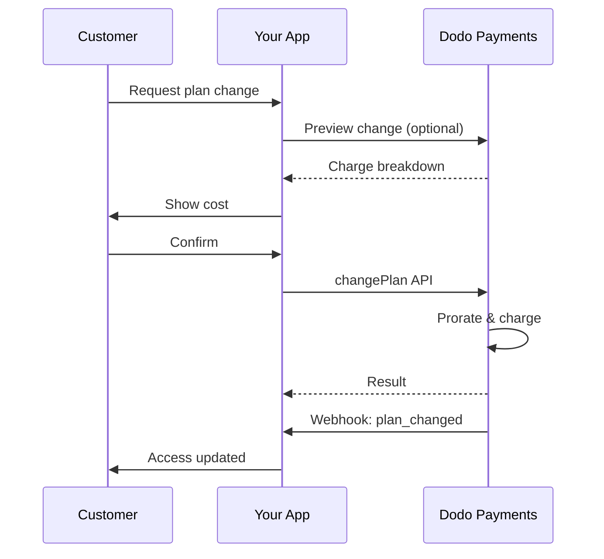
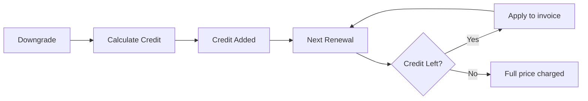
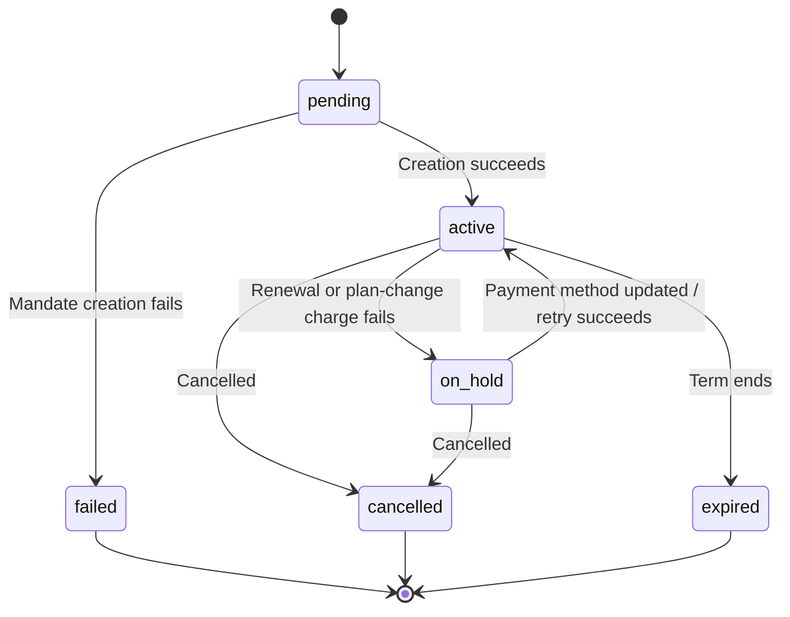

<Info>
Subscriptions let you sell ongoing access with automated renewals. Use flexible billing cycles, free trials, plan changes, and add‑ons to tailor pricing for each customer.
</Info>

<CardGroup cols={2}>
<Card title="Upgrade & Downgrade" icon="repeat" href="/developer-resources/subscription-upgrade-downgrade">
Control plan changes with proration and quantity updates.
</Card>

<Card title="On‑Demand Subscriptions" icon="bolt" href="/developer-resources/ondemand-subscriptions">
Authorize a mandate now and charge later with custom amounts.
</Card>

<Card title="Customer Portal" icon="id-card" href="/features/customer-portal">
Let customers manage plans, billing, and cancellations.
</Card>

<Card title="Subscription Webhooks" icon="code" href="/developer-resources/webhooks/intents/subscription">
React to lifecycle events like created, renewed, and canceled.
</Card>
</CardGroup>

## What Are Subscriptions?

Subscriptions are recurring products customers purchase on a schedule. They’re ideal for:

- **SaaS licenses**: Apps, APIs, or platform access
- **Memberships**: Communities, programs, or clubs
- **Digital content**: Courses, media, or premium content
- **Support plans**: SLAs, success packages, or maintenance

## Key Benefits

- **Predictable revenue**: Recurring billing with automated renewals
- **Flexible cycles**: Monthly, annual, custom intervals, and trials
- **Plan agility**: Proration for upgrades and downgrades
- **Add‑ons and seats**: Attach optional, quantifiable upgrades
- **Seamless checkout**: Hosted checkout and customer portal
- **Developer-first**: Clear APIs for creation, changes, and usage tracking

## Creating Subscriptions

Create subscription products in your Dodo Payments dashboard, then sell them through checkout or your API. Separating products from active subscriptions lets you version pricing, attach add‑ons, and track performance independently.

### Subscription product creation

Configure the fields in the dashboard to define how your subscription sells, renews, and bills. The sections below map directly to what you see in the creation form.

#### Product details

- **Product Name** (required): The display name shown in checkout, customer portal, and invoices.
- **Product Description** (required): A clear value statement that appears in checkout and invoices.
- **Product Image** (required): PNG/JPG/WebP up to 3 MB. Used on checkout and invoices.
- **Brand**: Associate the product with a specific brand for theming and emails.
- **Tax Category** (required): Choose the category (for example, SaaS) to determine tax rules.

<Tip>
Pick the most accurate tax category to ensure correct tax collection per region.
</Tip>

#### Pricing

- **Pricing Type**: <b>Subscription</b>（このガイド）を選択します。代替 विकल्पは Single Payment と Usage Based Billing です。
- **Price**（必須）: 通貨を含む基本の継続価格。価格は**$1**以上（または選択した通貨での相当額）である必要があります。この最低額未満はサポートされないため、サブスクリプションは機能しません。
- **Discount Applicable (%)**: 基本価格に適用する任意の割引率。チェックアウトと請求書に反映されます。
- **Repeat payment every**（必須）: 更新間隔（例: 1 Month ごと）。間隔（months または years）と数量を選択します。
- **Subscription Period**（必須）: サブスクリプションが有効である総期間（例: 10 Years）。この期間が終了すると、延長されない限り更新は停止します。
- **Trial Period Days**（必須）: トライアル期間を日数で設定します。トライアルを無効にするには 0 を使用します。トライアル終了時に最初の請求が自動的に行われます。
- **Trial Amount**: 有料トライアルの任意の前払い料金。無料トライアルの場合は未設定のままにします。[Paid Trials](#paid-trials) を参照してください。
- **Select add‑on**: 顧客が基本プランと一緒に購入できるアドオンを最大 10 個まで追加します。

<Warning>
Changing pricing on an active product affects new purchases. Existing subscriptions follow your plan‑change and proration settings.
</Warning>

<Info>
Add‑ons are ideal for quantifiable extras such as seats or storage. You can control allowed quantities and proration behavior when customers change them.
</Info>

#### Advanced settings

- **Tax Inclusive Pricing**: Display prices inclusive of applicable taxes. Final tax calculation still varies by customer location.
- **Generate license keys**: Issue a unique key to each customer after purchase. See the <a href="/features/license-keys">License Keys</a> guide.
- **Digital Product Delivery**: Deliver files or content automatically after purchase. Learn more in <a href="/features/digital-product-delivery">Digital Product Delivery</a>.
- **Metadata**: Attach custom key–value pairs for internal tagging or client integrations. See <a href="/api-reference/metadata">Metadata</a>.

<Tip>
Use metadata to store identifiers from your system (e.g., accountId) so you can reconcile events and invoices later.
</Tip>

## Subscription Trials

トライアルを利用すると、顧客は継続料金全額を支払う前にサブスクリプションを評価できます。トライアルには、終了まで料金が発生しない**無料**トライアルと、前払いで減額料金を請求する**有料**トライアルがあります。どちらの場合も、トライアル終了後の最初の更新から全額が適用されます。

### Configuring Trials

Set **Trial Period Days** in the product pricing section (use `0` to disable). You can override this when creating subscriptions:

```typescript
// Via subscription creation
const subscription = await client.subscriptions.create({
  customer: { customer_id: 'cus_123' },
  billing: { country: 'US' },
  product_id: 'pdt_monthly',
  quantity: 1,
  trial_period_days: 14  // Overrides product's trial period
});

// Via checkout session
const session = await client.checkoutSessions.create({
  product_cart: [{ product_id: 'pdt_monthly', quantity: 1 }],
  subscription_data: { trial_period_days: 14 }
});
```

<Warning>
The `trial_period_days` value must be between 0 and 10,000 days.
</Warning>

### Paid Trials

トライアルは無料である必要はありません。サブスクリプション商品の継続価格に**Trial Amount**を設定すると、トライアル期間に減額された前払い料金を請求できます。その後、最初の更新時から通常の継続価格が適用されます。

<Frame>

</Frame>

有料トライアルは、サブスクリプション単位やチェックアウトセッション単位ではなく、商品の価格に設定します。

| Field | Type | Description |
|-------|------|-------------|
| `trial_amount` | integer | トライアルに対して本日請求する金額。価格通貨の最小単位で指定します（例: $5.00 の場合は `500`）。`trial_period_days > 0` が必要です。無料トライアルの場合は省略するか `null` に設定します。 |
| `trial_apply_discounts` | boolean | checkout の割引コードでトライアル料金を減額するかどうか。デフォルトは `false` です。そのため、継続価格に割引が適用されてもトライアル料金は全額請求されます。 |

```typescript
const product = await client.products.create({
  name: 'Pro Plan',
  tax_category: 'saas',
  price: {
    type: 'recurring_price',
    price: 2900,                      // $29.00 per month after the trial
    currency: 'USD',
    discount: 0,
    purchasing_power_parity: false,
    payment_frequency_count: 1,
    payment_frequency_interval: 'Month',
    subscription_period_count: 1,
    subscription_period_interval: 'Year',
    trial_period_days: 14,            // A paid trial requires a positive trial period
    trial_amount: 500,                // $5.00 charged today
    trial_apply_discounts: false      // Discounts apply to the recurring price only
  }
});
```

有料トライアルも checkout を通過します。トライアル料金には税金がかかり、checkout セッションの計算と payment link の価格に表示され、Adaptive Currency のマークアップが通貨ごとに適用されます。[preview endpoint](/developer-resources/checkout-session) は `trial_amount` と `trial_period_days` を返すため、サブスクリプション作成前に本日支払う金額を表示できます。

<Info>
無料トライアルの動作は変わりません。**Trial Amount**を未設定にすると、従来どおり最初の請求は `0` となり、トライアル終了時に全額が請求されます。
</Info>

### トライアルの不正利用を防止する

**Prevent Trial Misuse** は、同じビジネスに対して顧客がトライアルを繰り返し申し込むことを防ぎます。有効にすると、すでにトライアルを利用した顧客は、新しいトライアルを受ける代わりに自動的に**有料・トライアルなしの購入**へ変更されます。

<Frame>

</Frame>

**Settings** の **Subscriptions** タブから有効にします。有効にすると、次のようになります。

- 顧客は**正規化されたメールアドレス**で照合され、plus エイリアスは除去されます。そのため `user+trial@example.com` と `user@example.com` は同一人物として扱われます。
- 利用記録は**トライアル有効化時**に保存されるため、同日にキャンセルした顧客もトライアルを消費したものとして扱われます。
- 既存顧客については、過去のトライアル履歴がメールアドレスでバックフィルされるため、過去のトライアル利用者もすぐに認識されます。

<Info>
この設定はデフォルトで**オフ**です。ビジネス単位のサブスクリプション制御の一覧については、[Subscription Settings](/features/product-collections#subscription-settings) を参照してください。
</Info>

### トライアル状態の検出

<Warning>
現在、トライアル状態を検出する直接的なフィールドはありません。以下は payments の取得が必要な回避策ですが、効率的ではありません。より効率的な解決策に取り組んでいます。
</Warning>

**無料トライアル**のサブスクリプションがトライアル中かどうかを確認するには、サブスクリプションの payments 一覧を取得します。金額が 0 の payment がちょうど 1 件ある場合、サブスクリプションはトライアル期間中です。

```typescript
const subscription = await client.subscriptions.retrieve('sub_123');
const payments = await client.payments.list({
  subscription_id: subscription.subscription_id
});

// Check if subscription is in trial
const isInTrial = payments.items.length === 1 && 
                  payments.items[0].total_amount === 0;
```

<Warning>
この金額 0 の確認は無料トライアルでのみ機能します。[有料トライアル](#paid-trials)では、最初の payment は `0` ではなくトライアル料金と同額です。最初の payment をサブスクリプションの `trial_amount` と比較するか、`next_billing_date` がまだトライアル期間内かどうかを確認してください。
</Warning>

### トライアル期間の更新

`next_billing_date` を更新してトライアルを延長します。

```typescript
await client.subscriptions.update('sub_123', {
  next_billing_date: '2025-02-15T00:00:00Z'  // New trial end date
});
```

<Warning>
`next_billing_date` に過去の時刻を設定することはできません。日付は未来である必要があります。
</Warning>

## サブスクリプションプランの変更

プラン変更では、サブスクリプションのアップグレードやダウングレード、数量の調整、別の商品への移行ができます。選択した日割り計算モードによっては、変更時に即時請求が発生したり、クレジットが作成されたり、請求調整が行われなかったりします。

<Tip>
Dodo Payments ダッシュボードから、サブスクリプションプランと次回請求日を直接変更できます。API 呼び出しを行わずに、カスタマーサポートへの依頼、プロモーションによるアップグレード、プラン移行にすばやく対応できます。
</Tip>

<Tip>
**セルフサービスのプラン変更を有効にする:** 顧客が Customer Portal から自分でサブスクリプションをアップグレードまたはダウングレードできるようにしますか？サブスクリプション商品を Product Collection に追加し、Subscription Settings で「Allow Subscription Updates」を有効にしてください。
</Tip>



<Card title="Product Collections" icon="layer-group" href="/features/product-collections">
  関連商品をコレクションにまとめると、Customer Portal でスムーズなアップグレード／ダウングレード経路を有効にできます。
</Card>

### 日割り計算モード

プラン変更時の顧客への請求方法を選択します。

<Info>
**4 つの日割り計算モードの比較:**

| | `prorated_immediately` | `difference_immediately` | `full_immediately` | `do_not_bill` |
|---|---|---|---|---|
| **アップグレード** | 残り日数分の日割り請求 | 価格差額を全額請求 | 新プラン価格を全額請求 | 請求なし — 即時切り替え |
| **ダウングレード** | 残り日数分の日割りクレジット | 価格差額を全額クレジット | クレジットなし、全額請求 | クレジットなし — 即時切り替え |
| **請求サイクル** | 本日にリセット | 本日にリセット | 本日にリセット | 変更なし |
| **最適な用途** | 時間に応じた公平な請求 | シンプルなティア変更 | 請求サイクルのリセット | 無料移行または特別対応 |
</Info>

#### `prorated_immediately`
現在の請求サイクルの残り時間に基づいて日割り金額を請求します。未使用期間を考慮した公平な請求に適しています。

```typescript
await client.subscriptions.changePlan('sub_123', {
  product_id: 'prod_pro',
  quantity: 1,
  proration_billing_mode: 'prorated_immediately'
});
```

#### `difference_immediately`
価格差額を即時に請求（アップグレード）するか、今後の更新に使用するクレジットを追加（ダウングレード）します。シンプルなアップグレード／ダウングレードに適しています。

```typescript
// Upgrade: charges $50 (difference between $30 and $80)
// Downgrade: credits remaining value, auto-applied to renewals
await client.subscriptions.changePlan('sub_123', {
  product_id: 'prod_pro',
  quantity: 1,
  proration_billing_mode: 'difference_immediately'
});
```

<Info>
`difference_immediately` を使用したダウングレードのクレジットはサブスクリプション単位で管理され、今後の更新に自動適用されます。<a href="/features/credit-based-billing">Credit-Based Billing</a> の特典とは異なります。
</Info>

顧客が `difference_immediately` でダウングレードすると、未使用分がサブスクリプション単位のクレジットとなり、今後の更新に自動的に充当されます。



#### `full_immediately`
残り時間を考慮せず、新プランの全額を即時請求します。請求サイクルのリセットに適しています。

```typescript
await client.subscriptions.changePlan('sub_123', {
  product_id: 'prod_monthly',
  quantity: 1,
  proration_billing_mode: 'full_immediately'
});
```

#### `do_not_bill`
請求調整なしで新プランに切り替えます。日割り請求もクレジットもなく、顧客はそのまま新プランへ移行します。特別対応による移行、無料プランへの切り替え、価格差額を事業者が負担する場合に適しています。

```typescript
await client.subscriptions.changePlan('sub_123', {
  product_id: 'prod_new_plan',
  quantity: 1,
  proration_billing_mode: 'do_not_bill'
});
```

<AccordionGroup>
<Accordion title="Example: Prorated upgrade calculation">

**シナリオ**: Basic（$30/月）の顧客が、30 日サイクルの 16 日目に `prorated_immediately` を使用して Pro（$80/月）へアップグレードします。

```
Unused credit from Basic = $30 × (15 remaining / 30 total) = $15.00
Prorated cost of Pro     = $80 × (15 remaining / 30 total) = $40.00
────────────────────────────────────────────────────────────────────
Immediate charge         = $40.00 − $15.00 = $25.00
```

次回更新日は**2 月 15 日**（1 月 16 日 + 30 日）で、料金は**$80.00/月**です。

<Tip>
計算例とエッジケースの詳細については、[Upgrade & Downgrade Guide](/developer-resources/subscription-upgrade-downgrade) を参照してください。
</Tip>

</Accordion>
<Accordion title="Example: Downgrade credit calculation">

**シナリオ**: Pro（$80/月）の顧客が、`difference_immediately` を使用して Starter（$20/月）へダウングレードします。

```
Credit = Old plan − New plan = $80 − $20 = $60.00
```

$60 のクレジットが今後の更新に自動適用されます。
- 更新 1: $20 − $20（クレジット）= **$0.00**（残りのクレジット $40）
- 更新 2: $20 − $20（クレジット）= **$0.00**（残りのクレジット $20）  
- 更新 3: $20 − $20（クレジット）= **$0.00**（クレジット消化）
- 更新 4: **$20.00**（全額）

<Info>
クレジットの管理方法については、[Upgrade & Downgrade Guide](/developer-resources/subscription-upgrade-downgrade) を参照してください。
</Info>

</Accordion>
</AccordionGroup>

### アドオン付きプランの変更

プラン変更時にアドオンを変更できます。アドオンは日割り計算に含まれます。

```typescript
await client.subscriptions.changePlan('sub_123', {
  product_id: 'prod_pro',
  quantity: 1,
  proration_billing_mode: 'difference_immediately',
  addons: [{ addon_id: 'addon_extra_seats', quantity: 2 }]  // Add add-ons
  // addons: []  // Empty array removes all existing add-ons
});
```

<Info>
デフォルトでは、`effective_at: 'immediately'` プランの変更によって即時に請求が発生します。変更を次回の請求日にスケジュールするには `effective_at: 'next_billing_date'` を渡してください。保留中の変更はサブスクリプション上で `scheduled_change` として返され、[スケジュール済みプラン変更をキャンセル](/api-reference/subscriptions/cancel-change-plan)でキャンセルできます。請求に失敗すると、サブスクリプションが `on_hold` ステータスに移行する場合があります。ただし `on_payment_failure: 'prevent_change'` を渡すと、支払いが成功するまでサブスクリプションは現在のプランに維持されます。変更は `subscription.plan_changed` webhook イベントで追跡できます。
</Info>

### プラン変更のプレビュー

プラン変更を確定する前に、正確な請求額と変更後のサブスクリプションをプレビューします。

```typescript
const preview = await client.subscriptions.previewChangePlan('sub_123', {
  product_id: 'prod_pro',
  quantity: 1,
  proration_billing_mode: 'prorated_immediately'
});

// Show customer the charge before confirming
console.log('You will be charged:', preview.immediate_charge.summary);
```

<Card title="Preview Change Plan API" icon="eye" href="/api-reference/subscriptions/preview-change-plan">
  確定する前にプラン変更をプレビューします。
</Card>

## サブスクリプションの状態

サブスクリプションは存続期間中、定義された一連の状態を遷移します。この表は、各状態、その原因、復旧可能かどうか、復旧方法または次の手順を示します。

| Status | 意味 | 復旧可能か | 復旧方法／次の手順 |
|--------|---------------|--------------|---------------------------|
| `pending` | サブスクリプションを作成または処理中 | — | `subscription.active`（または `subscription.failed`）を待ちます |
| `active` | サブスクリプションは有効で、自動的に更新されます | — | 対応不要 |
| `on_hold` | 更新 payment（またはプラン変更請求）に失敗し、サブスクリプションが一時停止しています | **はい** | Payment Retries と Dunning により自動的に、または [Update Payment Method API](/api-reference/subscriptions/update-payment-method) により手動で支払い方法を更新して再有効化します |
| `cancelled` | サブスクリプションはキャンセルされ、更新されません | 再購入のみ | 顧客は新しいサブスクリプションを開始する必要があります。Dunning で再購入を促せます |
| `failed` | サブスクリプションの**作成**に失敗しました（初回 mandate または payment が成功しませんでした） | **不可 — 終端状態** | 顧客は有効な支払い方法で新しいサブスクリプションを作成する必要があります |
| `expired` | サブスクリプションが契約期間の終了に達しました | — | 希望する場合、顧客は新しいサブスクリプションを開始する必要があります |

<Warning>
`on_hold` と `failed` は混同されがちです。`on_hold` は、すでに有効なサブスクリプションの更新に失敗した場合の**復旧可能**な状態です。`failed` は、**初回**のサブスクリプション作成に失敗した場合のみ発生する**終端状態**で、再有効化できません。
</Warning>

### 状態機械



### On Hold 状態

サブスクリプションは、次の場合に `on_hold` 状態になります。

- 更新 payment に失敗した（残高不足、カード期限切れなど）
- プラン変更の請求に失敗した
- 支払い方法の認証に失敗した

<Warning>
サブスクリプションが `on_hold` 状態の場合、自動更新されません。サブスクリプションを再有効化するには、支払い方法を更新する必要があります。
</Warning>

### On Hold からの再有効化

サブスクリプションを `on_hold` 状態から再有効化するには、支払い方法を更新します。これにより自動的に次の処理が行われます。

1. 未払い残額の請求を作成
2. 請求書を生成
3. 新しい支払い方法で payment を処理
4. payment 成功時にサブスクリプションを `active` 状態へ再有効化

```typescript
// Reactivate subscription from on_hold
const response = await client.subscriptions.updatePaymentMethod('sub_123', {
  payment_method: {
    type: 'new',
    return_url: 'https://example.com/return'
  }
});

// For on_hold subscriptions, a charge is automatically created
if (response.payment_id) {
  console.log('Charge created:', response.payment_id);
  // Redirect customer to response.payment_link to complete payment
  // Monitor webhooks for payment.succeeded and subscription.active
}
```

<Info>
`on_hold` のサブスクリプションについて支払い方法の更新に成功すると、`payment.succeeded` に続いて `subscription.active` webhook event が届きます。
</Info>

### 遷移ごとの Webhook Events

各遷移では webhook が発行されるため、ポーリングなしで entitlement ロジックを実行できます。

| 遷移 | Event |
|------------|-------|
| サブスクリプションが有効化 | `subscription.active` |
| 更新成功 | `subscription.renewed` |
| 更新失敗 → 一時停止 | `subscription.on_hold` |
| 作成失敗 | `subscription.failed` |
| プランをアップグレード／ダウングレード | `subscription.plan_changed` |
| キャンセル | `subscription.cancelled` |
| 期間終了 | `subscription.expired` |
| 任意のフィールド変更 | `subscription.updated` |

<Card title="Subscription Webhook Payloads" icon="webhook" href="/developer-resources/webhooks/intents/subscription">
サブスクリプションのライフサイクルイベントについて、完全な payload schema を確認してください。
</Card>

## API 管理

<AccordionGroup>
<Accordion title="Create subscriptions">
`POST /subscriptions` を使用すると、任意のトライアルとアドオンを含め、商品からプログラムでサブスクリプションを作成できます。

<Card title="API Reference" icon="code" href="/api-reference/subscriptions/post-subscriptions">
サブスクリプション作成 API を確認してください。
</Card>
</Accordion>

<Accordion title="Update subscriptions">
`PATCH /subscriptions/{id}` を使用すると、次回の請求日にキャンセルしたり、サブスクリプション期間を延長したり、請求の詳細を更新したり、メタデータを変更したりできます。数量を変更するには、代わりに [Change Plan API](/api-reference/subscriptions/change-plan) を使用してください。`PATCH` は `quantity` を受け付けません。

<Card title="API Reference" icon="code" href="/api-reference/subscriptions/patch-subscriptions">
サブスクリプション詳細の更新方法を確認してください。
</Card>
</Accordion>

<Accordion title="Change plans (proration)">
日割り計算の制御を使用して、現在の商品と数量を変更します。

<Card title="API Reference" icon="code" href="/api-reference/subscriptions/change-plan">
プラン変更のオプションを確認してください。
</Card>
</Accordion>

<Accordion title="On‑demand charges">
オンデマンドサブスクリプションでは、必要に応じて指定した金額を請求します。

<Card title="API Reference" icon="code" href="/api-reference/subscriptions/create-charge">
オンデマンドサブスクリプションに請求します。
</Card>
</Accordion>

<Accordion title="List and retrieve">
`GET /subscriptions` ですべてのサブスクリプションを一覧表示し、`GET /subscriptions/{id}` で 1 件を取得します。

<Card title="API Reference" icon="code" href="/api-reference/subscriptions/get-subscriptions">
一覧表示および取得 API を確認してください。
</Card>
</Accordion>

<Accordion title="Usage history">
従量制またはハイブリッド価格モデルで記録された usage を取得します。

<Card title="API Reference" icon="code" href="/api-reference/subscriptions/get-usage-history">
Usage history API を参照してください。
</Card>
</Accordion>

<Accordion title="Update payment method">
サブスクリプションの支払い方法を更新します。有効なサブスクリプションでは、今後の更新に使用する支払い方法が更新されます。`on_hold` 状態のサブスクリプションでは、未払い残額の請求を作成して再有効化します。

新しい payment-method link（`New` request type）を生成する際、`allowed_payment_method_types` を渡すと、そのページで顧客に表示する支払い方法を制限できます。顧客にはリストにない方法は表示されません。ただし、方法を含めても表示が保証されるわけではありません（利用可能性は顧客の所在地やビジネス設定などにも依存します）。

<Card title="API Reference" icon="code" href="/api-reference/subscriptions/update-payment-method">
支払い方法の更新とサブスクリプションの再有効化について確認してください。
</Card>
</Accordion>
</AccordionGroup>

## 一般的なユースケース

- **SaaS と API**: シート数や usage に対応したアドオン付きの段階的アクセス
- **コンテンツとメディア**: 導入トライアル付きの月額アクセス
- **B2B サポートプラン**: プレミアムサポートアドオン付きの年間契約
- **ツールとプラグイン**: license key とバージョン管理されたリリース

## 統合例

### Checkout Sessions（サブスクリプション）
checkout session を作成する際は、サブスクリプション商品と任意のアドオンを含めます。

```typescript
const session = await client.checkoutSessions.create({
  product_cart: [
    {
      product_id: 'prod_subscription',
      quantity: 1
    }
  ]
});
```

### 日割り計算を使用したプラン変更
サブスクリプションをアップグレードまたはダウングレードし、日割り計算の動作を制御します。

```typescript
await client.subscriptions.changePlan('sub_123', {
  product_id: 'prod_new',
  quantity: 1,
  proration_billing_mode: 'difference_immediately'
});
```

### 次回請求日にキャンセル
現在の請求期間の終了時に有効になるキャンセルを予約します。

```typescript
await client.subscriptions.update('sub_123', {
  cancel_at_next_billing_date: true
});
```

### サブスクリプション期間の延長
新しい `subscription_period_count` と `subscription_period_interval` を `PATCH /subscriptions/{id}` に渡して、サブスクリプションの継続期間を延長します。新しい count と interval に基づいて有効期限が再計算されます。たとえば、現在のプランに追加期間を付与する場合に使用できます。

```typescript
await client.subscriptions.update('sub_123', {
  subscription_period_count: 5,
  subscription_period_interval: 'Month'
});
```

<Note>
サブスクリプション期間は**延長のみ**可能で、短縮することはできません。
</Note>

### オンデマンドサブスクリプション
オンデマンドサブスクリプションを作成し、必要に応じて後から請求します。

```typescript
const onDemand = await client.subscriptions.create({
  customer: { customer_id: 'cus_123' },
  billing: { country: 'US' },
  product_id: 'pdt_on_demand',
  quantity: 1,
  on_demand: { mandate_only: true }
});

await client.subscriptions.charge(onDemand.subscription_id, {
  product_price: 4900,
  product_currency: 'USD',
  product_description: 'Extra usage for September'
});
```

### 有効なサブスクリプションの支払い方法を更新
有効なサブスクリプションの支払い方法を更新します。

```typescript
// Update with new payment method
const response = await client.subscriptions.updatePaymentMethod('sub_123', {
  payment_method: {
    type: 'new',
    return_url: 'https://example.com/return'
  }
});

// Or use existing payment method
await client.subscriptions.updatePaymentMethod('sub_123', {
  payment_method: {
    type: 'existing',
    payment_method_id: 'pm_abc123'
  }
});
```

### on_hold のサブスクリプションを再有効化
支払い失敗により on hold になったサブスクリプションを再有効化します。

```typescript
// Update payment method - automatically creates charge for remaining dues
const response = await client.subscriptions.updatePaymentMethod('sub_123', {
  payment_method: {
    type: 'new',
    return_url: 'https://example.com/return'
  }
});

if (response.payment_id) {
  // Charge created for remaining dues
  // Redirect customer to response.payment_link
  // Monitor webhooks: payment.succeeded → subscription.active
}
```

## RBI 準拠の Mandate を使用したサブスクリプション

  UPI とインドのカードによるサブスクリプションは、特定の mandate 要件を定めた RBI（Reserve Bank of India）規制に従って運用されます。

  ### Mandate の上限

  mandate の種類と金額は、サブスクリプションの継続料金によって決まります。

  - **mandate 下限（デフォルト ₹15,000）未満の請求:** 下限額のオンデマンド mandate を作成します。サブスクリプション金額は、mandate 上限まで、サブスクリプション頻度に応じて定期的に請求されます。
  - **mandate 下限以上の請求:** サブスクリプション金額と同額の subscription mandate（またはオンデマンド mandate）を作成します。

  mandate 下限は、`mandate_min_amount_inr_paise`（INR paise）を使用して merchant 単位または request 単位で設定できます。銀行に登録される金額は `max(mandate_floor, billing_amount)` です。そのため、請求額が低い場合、下限が実質的に顧客向けの認証上限になります。

RBI 準拠の mandate と、インドの支払い方法で設定可能な mandate 下限の詳細については、<a href="/features/payment-methods/india#configurable-mandate-floor">India Payment Methods</a> ページを参照してください。

  ### アップグレードとダウングレードに関する考慮事項

  **重要:** サブスクリプションをアップグレードまたはダウングレードする場合は、mandate の上限を慎重に考慮してください。

  - アップグレードまたはダウングレードによる請求額が Rs 15,000 を超え、既存のオンデマンド payment limit を上回る場合、transaction charge に失敗する可能性があります。
  - この場合、顧客は支払い方法を更新するか、正しい上限の新しい mandate を設定するためにサブスクリプションを再度変更する必要があります。

  ### 高額請求の認証

  Rs 15,000 以上のサブスクリプション請求については、次のようになります。

  - 顧客には、銀行から transaction の認証を求める通知が表示されます。
  - 顧客が transaction を認証できない場合、transaction は失敗し、サブスクリプションは on hold になります。

  ### 48 時間の処理遅延

  **処理タイムライン:** インドのカードおよび UPI サブスクリプションの継続請求には、独自の処理パターンがあります。

  - 請求は、サブスクリプション頻度に従って予定日に**開始**されます。
  - 顧客口座からの実際の**引き落とし**は、payment 開始から**48 時間後**にのみ行われます。
  - この 48 時間の期間は、銀行 API の応答によって**さらに 2～3 時間**延長される場合があります。

  ### Mandate のキャンセル可能期間

  48 時間の処理期間中は、次のことが可能です。

  - 顧客は banking app から mandate をキャンセルできます。
  - この期間中に顧客が mandate をキャンセルしても、サブスクリプションは**有効**なままです（これはインドのカードおよび UPI AutoPay サブスクリプション固有のエッジケースです）。
  - ただし、実際の引き落としは失敗する可能性があり、その場合サブスクリプションは**on hold**になります。

  **エッジケースへの対応:** 請求開始直後に顧客へ特典、クレジット、またはサブスクリプション利用権を提供する場合は、アプリケーションでこの 48 時間の期間を適切に処理する必要があります。次の対応を検討してください。

  - payment 確認まで特典の有効化を遅延する
  - grace period または一時的なアクセスを実装する
  - mandate のキャンセルについてサブスクリプション状態を監視する
  - アプリケーションロジックでサブスクリプションの hold 状態を処理する

  <Tip>
  サブスクリプション webhook を監視して payment status の変更を追跡し、48 時間の期間中に mandate がキャンセルされた場合のエッジケースに対応します。
  </Tip>

## ベストプラクティス

- **明確なティアから始める**: 違いが明確な 2～3 個のプラン
- **価格を明示する**: 合計額、日割り計算、次回更新を表示する
- **トライアルを適切に使用する**: 期間だけでなくオンボーディングで転換を促す
- **アドオンを活用する**: 基本プランをシンプルに保ち、追加機能をアップセルする
- **変更をテストする**: test mode でプラン変更と日割り計算を検証する

<Info>
サブスクリプションは、継続収益のための柔軟な基盤です。シンプルに始め、十分にテストし、導入率、解約率、拡張指標に基づいて改善を繰り返してください。
</Info>