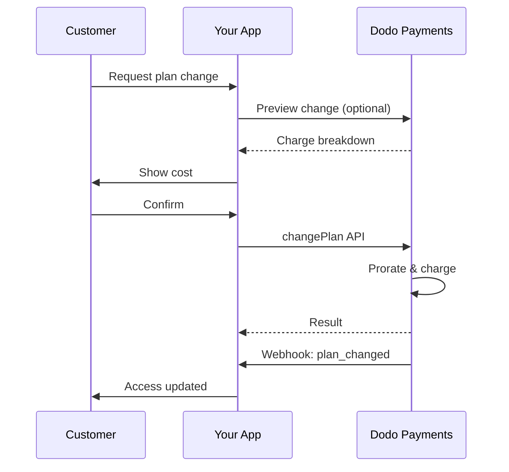
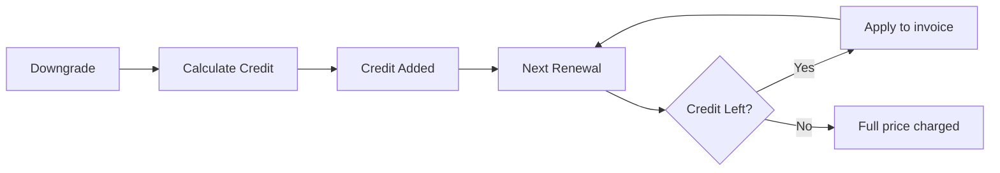

<Info>
Subscriptions let you sell ongoing access with automated renewals. Use flexible billing cycles, free trials, plan changes, and add‑ons to tailor pricing for each customer.
</Info>

<CardGroup cols={2}>
<Card title="Upgrade & Downgrade" icon="repeat" href="/developer-resources/subscription-upgrade-downgrade">
Control plan changes with proration and quantity updates.
</Card>

<Card title="On‑Demand Subscriptions" icon="bolt" href="/developer-resources/ondemand-subscriptions">
Authorize a mandate now and charge later with custom amounts.
</Card>

<Card title="Customer Portal" icon="id-card" href="/features/customer-portal">
Let customers manage plans, billing, and cancellations.
</Card>

<Card title="Subscription Webhooks" icon="code" href="/developer-resources/webhooks/intents/subscription">
React to lifecycle events like created, renewed, and canceled.
</Card>
</CardGroup>

## What Are Subscriptions?

Subscriptions are recurring products customers purchase on a schedule. They’re ideal for:

- **SaaS licenses**: Apps, APIs, or platform access
- **Memberships**: Communities, programs, or clubs
- **Digital content**: Courses, media, or premium content
- **Support plans**: SLAs, success packages, or maintenance

## Key Benefits

- **Predictable revenue**: Recurring billing with automated renewals
- **Flexible cycles**: Monthly, annual, custom intervals, and trials
- **Plan agility**: Proration for upgrades and downgrades
- **Add‑ons and seats**: Attach optional, quantifiable upgrades
- **Seamless checkout**: Hosted checkout and customer portal
- **Developer-first**: Clear APIs for creation, changes, and usage tracking

## Creating Subscriptions

Create subscription products in your Dodo Payments dashboard, then sell them through checkout or your API. Separating products from active subscriptions lets you version pricing, attach add‑ons, and track performance independently.

### Subscription product creation

Configure the fields in the dashboard to define how your subscription sells, renews, and bills. The sections below map directly to what you see in the creation form.

#### Product details

- **Product Name** (required): The display name shown in checkout, customer portal, and invoices.
- **Product Description** (required): A clear value statement that appears in checkout and invoices.
- **Product Image** (required): PNG/JPG/WebP up to 3 MB. Used on checkout and invoices.
- **Brand**: Associate the product with a specific brand for theming and emails.
- **Tax Category** (required): Choose the category (for example, SaaS) to determine tax rules.

<Tip>
Pick the most accurate tax category to ensure correct tax collection per region.
</Tip>

#### Pricing

- **Pricing Type**: Choose <b>Subscription</b> (this guide). Alternatives are Single Payment and Usage Based Billing.
- **Price** (required): Base recurring price with currency.
- **Discount Applicable (%)**: Optional percentage discount applied to the base price; reflected in checkout and invoices.
- **Repeat payment every** (required): Interval for renewals, e.g., every 1 Month. Select the cadence (months or years) and quantity.
- **Subscription Period** (required): Total term for which the subscription remains active (e.g., 10 Years). After this period ends, renewals stop unless extended.
- **Trial Period Days** (required): Set trial length in days. Use 0 to disable trials. The first charge occurs automatically when the trial ends.
- **Select add‑on**: Attach up to 10 add‑ons that customers can purchase alongside the base plan.

<Warning>
Changing pricing on an active product affects new purchases. Existing subscriptions follow your plan‑change and proration settings.
</Warning>

<Info>
Add‑ons are ideal for quantifiable extras such as seats or storage. You can control allowed quantities and proration behavior when customers change them.
</Info>

#### Advanced settings

- **Tax Inclusive Pricing**: Display prices inclusive of applicable taxes. Final tax calculation still varies by customer location.
- **Generate license keys**: Issue a unique key to each customer after purchase. See the <a href="/features/license-keys">License Keys</a> guide.
- **Digital Product Delivery**: Deliver files or content automatically after purchase. Learn more in <a href="/features/digital-product-delivery">Digital Product Delivery</a>.
- **Metadata**: Attach custom key–value pairs for internal tagging or client integrations. See <a href="/api-reference/metadata">Metadata</a>.

<Tip>
Use metadata to store identifiers from your system (e.g., accountId) so you can reconcile events and invoices later.
</Tip>

## Subscription Trials

Trials let customers access subscriptions without immediate payment. The first charge occurs automatically when the trial ends.

### Configuring Trials

Set **Trial Period Days** in the product pricing section (use `0` to disable). You can override this when creating subscriptions:

```typescript
// Via subscription creation
const subscription = await client.subscriptions.create({
  customer_id: 'cus_123',
  product_id: 'prod_monthly',
  trial_period_days: 14  // Overrides product's trial period
});

// Via checkout session
const session = await client.checkoutSessions.create({
  product_cart: [{ product_id: 'prod_monthly', quantity: 1 }],
  subscription_data: { trial_period_days: 14 }
});
```

<Warning>
The `trial_period_days` value must be between 0 and 10,000 days.
</Warning>

### Detecting Trial Status

<Warning>
Currently, there is no direct field to detect trial status. The following is a workaround that requires querying payments, which is inefficient. We are working on a more efficient solution.
</Warning>

To determine if a subscription is in trial, retrieve the list of payments for the subscription. If there is exactly one payment with amount 0, the subscription is in trial period:

```typescript
const subscription = await client.subscriptions.retrieve('sub_123');
const payments = await client.payments.list({
  subscription_id: subscription.subscription_id
});

// Check if subscription is in trial
const isInTrial = payments.items.length === 1 && 
                  payments.items[0].total_amount === 0;
```

### Updating Trial Period

Extend the trial by updating `next_billing_date`:

```typescript
await client.subscriptions.update('sub_123', {
  next_billing_date: '2025-02-15T00:00:00Z'  // New trial end date
});
```

<Warning>
You cannot set `next_billing_date` to a past time. The date must be in the future.
</Warning>

## Subscription Plan Changes

プラン変更によりサブスクリプションをアップグレードまたはダウングレードしたり、数量を調整したり、別の製品に移行したりできます。選択した比例計算モードに応じて、変更は即時課金をトリガーしたり、クレジットを生成したり、請求調整を適用しない場合があります。

<Tip>
You can change subscription plans and update the next billing date directly from the Dodo Payments dashboard. This provides a quick way to adjust subscriptions for customer support requests, promotional upgrades, or plan migrations without making API calls.
</Tip>

<Tip>
**Enable self-service plan changes:** Want customers to upgrade or downgrade their own subscriptions via the Customer Portal? Add your subscription products to a Product Collection and enable "Allow Subscription Updates" in your Subscription Settings.
</Tip>



<Card title="Product Collections" icon="layer-group" href="/features/product-collections">
  Group related products into collections to enable seamless upgrade/downgrade paths in the Customer Portal.
</Card>

### Proration Modes

Choose how customers are billed when changing plans:

<Info>
**4つの比例計算モードの簡単な比較：**

| | `prorated_immediately` | `difference_immediately` | `full_immediately` | `do_not_bill` |
|---|---|---|---|---|
| **アップグレード** | 残り日数に対する比例課金 | 差額を全額課金 | 新しいプランの全額課金 | 無料で即時切り替え |
| **ダウングレード** | 残り日数に対する比例クレジット | 差額全額をクレジットとして付与 | クレジットなし、全額課金 | クレジットなしで即時切り替え |
| **請求サイクル** | 同じまま | 同じまま | 今日からリセット | 同じまま |
| **最適な用途** | 公正な時間ベースの請求 | 簡単なティア変更 | 請求サイクルのリセット | 無料移行または無償切り替え | 
</Info>

#### `prorated_immediately`
Charges prorated amount based on remaining time in the current billing cycle. Best for fair billing that accounts for unused time.

```typescript
await client.subscriptions.changePlan('sub_123', {
  product_id: 'prod_pro',
  quantity: 1,
  proration_billing_mode: 'prorated_immediately'
});
```

#### `difference_immediately`
Charges the price difference immediately (upgrade) or adds credit for future renewals (downgrade). Best for simple upgrade/downgrade scenarios.

```typescript
// Upgrade: charges $50 (difference between $30 and $80)
// Downgrade: credits remaining value, auto-applied to renewals
await client.subscriptions.changePlan('sub_123', {
  product_id: 'prod_pro',
  quantity: 1,
  proration_billing_mode: 'difference_immediately'
});
```

<Info>
`difference_immediately` を使用したダウングレードによるクレジットはサブスクリプション単位で適用され、今後の更新に自動的に適用されます。これらは<a href="/features/credit-based-billing">Credit-Based Billing</a> の権利とは異なります。
</Info>

When a customer downgrades with `difference_immediately`, the unused value becomes a subscription-scoped credit that automatically offsets future renewals:



#### `full_immediately`
Charges full new plan amount immediately, ignoring remaining time. Best for resetting billing cycles.

```typescript
await client.subscriptions.changePlan('sub_123', {
  product_id: 'prod_monthly',
  quantity: 1,
  proration_billing_mode: 'full_immediately'
});
```

#### `do_not_bill`
請求調整なしで新しいプランに切り替えます。比例課金もクレジットもなし—単に新しいプランに移行します。特に丁寧な移行、無料プランの切り替え、またはコスト差異を吸収したい場合に適しています。

```typescript
await client.subscriptions.changePlan('sub_123', {
  product_id: 'prod_new_plan',
  quantity: 1,
  proration_billing_mode: 'do_not_bill'
});
```

<AccordionGroup>
<Accordion title="Example: Prorated upgrade calculation">

**シナリオ**: BASIC（$30/月）の顧客が30日間サイクルの16日目にPRO ($80/月)にアップグレードする場合は`prorated_immediately`を使用します。

```
Unused credit from Basic = $30 × (15 remaining / 30 total) = $15.00
Prorated cost of Pro     = $80 × (15 remaining / 30 total) = $40.00
────────────────────────────────────────────────────────────────────
Immediate charge         = $40.00 − $15.00 = $25.00
```

次回の更新は元の請求日: **$80.00/月**。

<Tip>
より詳細な計算例やコーナーケースについては、完全な[アップグレード&ダウングレードガイド](/developer-resources/subscription-upgrade-downgrade)をご覧ください。
</Tip>

</Accordion>
<Accordion title="Example: Downgrade credit calculation">

**シナリオ**: PRO（$80/月）の顧客が`difference_immediately`を使用してスターター（$20/月）にダウングレードする。

```
Credit = Old plan − New plan = $80 − $20 = $60.00
```

$60のクレジットは自動的に将来の更新に適用されます:
- 更新1: $20 − $20 (クレジット) = **$0.00** ($40 クレジット残)
- 更新2: $20 − $20 (クレジット) = **$0.00** ($20 クレジット残)  
- 更新3: $20 − $20 (クレジット) = **$0.00** (クレジット消費済)
- 更新4: **$20.00** (全額)

<Info>
クレジットがどのように管理されるかについては、[アップグレード&ダウングレードガイド](/developer-resources/subscription-upgrade-downgrade)をご覧ください。
</Info>

</Accordion>
</AccordionGroup>

### アドオンを伴うプラン変更

プラン変更時にアドオンを修正します。アドオンは比例計算に含まれます：

```typescript
await client.subscriptions.changePlan('sub_123', {
  product_id: 'prod_pro',
  quantity: 1,
  proration_billing_mode: 'difference_immediately',
  addons: [{ addon_id: 'addon_extra_seats', quantity: 2 }]  // Add add-ons
  // addons: []  // Empty array removes all existing add-ons
});
```

<Info>
プラン変更は即時課金を引き起こします。課金が失敗した場合、サブスクリプションは`on_hold`状態に移行することがあります。変更の追跡は`subscription.plan_changed` webhookイベントを介して行います。
</Info>

### プラン変更のプレビュー

プラン変更をコミットする前に、正確な料金と結果としてのサブスクリプションをプレビューします：

```typescript
const preview = await client.subscriptions.previewChangePlan('sub_123', {
  product_id: 'prod_pro',
  quantity: 1,
  proration_billing_mode: 'prorated_immediately'
});

// Show customer the charge before confirming
console.log('You will be charged:', preview.immediate_charge.summary);
```

<Card title="Preview Change Plan API" icon="eye" href="/api-reference/subscriptions/preview-change-plan">
  プラン変更をコミットする前にプレビューします。
</Card>

## サブスクリプション状態

サブスクリプションはライフサイクルの中で異なる状態にあることができます：

- **`active`**: サブスクリプションはアクティブで、自動で更新されます
- **`on_hold`**: 支払い失敗によりサブスクリプションが一時停止されています。再活性化には支払い方法の更新が必要です
- **`cancelled`**: サブスクリプションはキャンセルされており、更新されません
- **`expired`**: サブスクリプションは終了日を迎えました
- **`pending`**: サブスクリプションは作成中または処理中です

### 保留状態

サブスクリプションは以下のときに`on_hold`状態に入ります：

- 更新支払いが失敗する場合（資金不足、カードの有効期限切れなど）
- プラン変更の課金が失敗する場合
- 支払い方法の認証が失敗する場合

<Warning>
サブスクリプションが`on_hold`状態にある場合、それは自動で更新されません。サブスクリプションを再開するには、支払い方法を更新する必要があります。
</Warning>

### 保留からの再活性化

`on_hold`状態からサブスクリプションを再開するには、支払い方法を更新します。これにより自動的に：

1. 未払い金額を請求します
2. 請求書を生成します
3. 新しい支払い方法を用いて支払いを処理します
4. 支払い成功後にサブスクリプションを`active`状態に再活性化します

```typescript
// Reactivate subscription from on_hold
const response = await client.subscriptions.updatePaymentMethod('sub_123', {
  type: 'new',
  return_url: 'https://example.com/return'
});

// For on_hold subscriptions, a charge is automatically created
if (response.payment_id) {
  console.log('Charge created:', response.payment_id);
  // Redirect customer to response.payment_link to complete payment
  // Monitor webhooks for payment.succeeded and subscription.active
}
```

<Info>
`on_hold`サブスクリプションの支払い方法を正常に更新した後、`payment.succeeded`および`subscription.active` webhookイベントが送信されます。
</Info>

## API管理

<AccordionGroup>
<Accordion title="Create subscriptions">
`POST /subscriptions`を使用して、製品からサブスクリプションをプログラムで作成し、オプショントライアルやアドオンを追加します。

<Card title="API Reference" icon="code" href="/api-reference/subscriptions/post-subscriptions">
サブスクリプション作成APIを表示します。
</Card>
</Accordion>

<Accordion title="Update subscriptions">
`PATCH /subscriptions/{id}`を使用して、数量を更新したり、次の請求日でキャンセルしたり、メタデータを修正したりします。

<Card title="API Reference" icon="code" href="/api-reference/subscriptions/patch-subscriptions">
サブスクリプションの詳細を更新する方法を学びます。
</Card>
</Accordion>

<Accordion title="Change plans (proration)">
比例計算コントロールを利用して、アクティブな製品と数量を変更します。

<Card title="API Reference" icon="code" href="/api-reference/subscriptions/change-plan">
プラン変更オプションをレビューします。
</Card>
</Accordion>

<Accordion title="On‑demand charges">
オンデマンドサブスクリプションの料金を需要に応じて請求します。

<Card title="API Reference" icon="code" href="/api-reference/subscriptions/create-charge">
オンデマンドサブスクリプションを請求します。
</Card>
</Accordion>

<Accordion title="List and retrieve">
`GET /subscriptions`を使用してすべてのサブスクリプションをリストし、`GET /subscriptions/{id}`を使用して1つを取得します。

<Card title="API Reference" icon="code" href="/api-reference/subscriptions/get-subscriptions">
リストと取得APIを閲覧します。
</Card>
</Accordion>

<Accordion title="Usage history">
メーターまたはハイブリッド料金モデルのために記録された使用状況を取得します。

<Card title="API Reference" icon="code" href="/api-reference/subscriptions/get-usage-history">
使用履歴APIを参照します。
</Card>
</Accordion>

<Accordion title="Update payment method">
サブスクリプションの支払い方法を更新します。アクティブなサブスクリプションの場合、これにより将来の更新のために支払い方法が更新されます。`on_hold`状態のサブスクリプションの場合、残金を請求して再活性化します。

<Card title="API Reference" icon="code" href="/api-reference/subscriptions/update-payment-method">
支払い方法を更新してサブスクリプションを再活性化する方法を学びます。
</Card>
</Accordion>
</AccordionGroup>

## 共通ユースケース

- **SaaSおよびAPI**: 席や使用量に応じた追加機能を備えたティアードアクセス
- **コンテンツおよびメディア**: 特典トライアル付きの月額アクセス
- **B2Bサポートプラン**: プレミアムサポートアドオンを含む年間契約
- **ツールおよびプラグイン**: ライセンスキーおよびバージョンリリース

## 統合例

### チェックアウトセッション（サブスクリプション）
チェックアウトセッションを作成する際には、サブスクリプション製品とオプションのアドオンを含めます：

```typescript
const session = await client.checkoutSessions.create({
  product_cart: [
    {
      product_id: 'prod_subscription',
      quantity: 1
    }
  ]
});
```

### プラン変更と比例計算
サブスクリプションをアップグレードまたはダウングレードし、比例計算の動作を制御します：

```typescript
await client.subscriptions.changePlan('sub_123', {
  product_id: 'prod_new',
  quantity: 1,
  proration_billing_mode: 'difference_immediately'
});
```

### 次の請求日にキャンセル
現在の請求期間の終了時に適用されるキャンセルをスケジュールします：

```typescript
await client.subscriptions.update('sub_123', {
  cancel_at_next_billing_date: true
});
```

### オンデマンドサブスクリプション
オンデマンドサブスクリプションを作成し、必要に応じて後で課金します：

```typescript
const onDemand = await client.subscriptions.create({
  customer_id: 'cus_123',
  product_id: 'prod_on_demand',
  on_demand: true
});

await client.subscriptions.createCharge(onDemand.id, {
  amount: 4900,
  currency: 'USD',
  description: 'Extra usage for September'
});
```

### アクティブなサブスクリプションの支払い方法を更新
アクティブなサブスクリプションの支払い方法を更新します：

```typescript
// Update with new payment method
const response = await client.subscriptions.updatePaymentMethod('sub_123', {
  type: 'new',
  return_url: 'https://example.com/return'
});

// Or use existing payment method
await client.subscriptions.updatePaymentMethod('sub_123', {
  type: 'existing',
  payment_method_id: 'pm_abc123'
});
```

### 保留からのサブスクリプションの再活性化
支払い失敗によって保留になったサブスクリプションを再活性化します：

```typescript
// Update payment method - automatically creates charge for remaining dues
const response = await client.subscriptions.updatePaymentMethod('sub_123', {
  type: 'new',
  return_url: 'https://example.com/return'
});

if (response.payment_id) {
  // Charge created for remaining dues
  // Redirect customer to response.payment_link
  // Monitor webhooks: payment.succeeded → subscription.active
}
```

## RBI準拠のマンドートによるサブスクリプション

  UPIとインドのカードサブスクリプションは、特定のマンドート要件を持つRBI（インド準備銀行）の規制の下で運営されています：

  ### マンドートの制限

  マンドートのタイプと金額は、サブスクリプションの定期的な請求に依存します：

  - **Rs 15,000未満の請求**: Rs 15,000 INRのオンデマンドマンドートを作成します。マンドートの制限まで、サブスクリプションの頻度に応じて料金を定期的に請求します。
  - **Rs 15,000以上の料金**: 正確なサブスクリプション金額のサブスクリプションマンドート（またはオンデマンドマンドート）を作成します。

インドの支払い方法に関するRBI準拠のマンドートに関する詳細情報については、<a href="/features/payment-methods/india">インドの支払い方法</a>ページをご覧ください。

  ### アップグレードとダウングレードの考慮事項

  **重要:** サブスクリプションをアップグレードまたはダウングレードする際には、マンドートの制限を注意深く考慮します：

  - アップグレード/ダウングレードにより、Rs 15,000を超え、既存のオンデマンド支払い制限を超える金額が発生した場合、トランザクションが失敗する可能性があります。
  - そのような場合、顧客は支払い方法を更新するか、適切な制限を持つ新しいマンドートを確立するためにサブスクリプションを再変更する必要があります。

  ### 高額請求の承認

  Rs 15,000以上のサブスクリプション請求について：

  - 顧客は取引を承認するように銀行から指示されます。
  - 顧客が取引を承認しない場合、取引は失敗し、サブスクリプションが保留になります。

  ### 48時間の処理遅延

  **処理タイムライン:** インドのカードとUPIサブスクリプションの定期的な料金は、固有の処理パターンに従います：

  - 指定された日にサブスクリプションの頻度に従って料金が**開始**されます。
  - 実際の**引き落とし**は、支払い開始から**48時間後**にのみ発生します。
  - 銀行のAPI応答によって、この48時間のウィンドウは**2-3時間以上**延長されることがあります。

  ### マンドートキャンセルウィンドウ

  48時間の処理ウィンドウ中に：

  - 顧客は銀行アプリを通じてマンドートをキャンセルできます。
  - この期間中に顧客がマンドートをキャンセルすると、サブスクリプションは**アクティブなまま**になります（これはインドのカードおよびUPI AutoPayサブスクリプションに特有のエッジケースです）。
  - しかし、実際の引き落としは失敗する可能性があり、その場合、サブスクリプションは**保留**になります。

  **エッジケースの処理:** 顧客に料金開始と同時に利点、クレジット、またはサブスクリプション利用を提供する場合、アプリケーションでこの48時間のウィンドウを適切に処理する必要があります。考慮すべき事項：

  - 支払い確認まで利点の有効化を遅らせる
  - グレース期間または一時的なアクセスを実装する
  - マンドートキャンセルのためにサブスクリプションステータスを監視する
  - アプリケーションロジックでサブスクリプションの保留状態を処理する

  <Tip>
  支払いステータスの変化を追跡し、48時間ウィンドウ中にマンドートがキャンセルされる場合のエッジケースを処理するためにサブスクリプションウェブフックを監視します。
  </Tip>

## ベストプラクティス

- **明確なティアで始める**: 2〜3つのプランで明確な違いを持たせる
- **価格を伝える**: 合計、比例計算、次回更新を表示する
- **慎重にトライアルを使用する**: 時間だけでなくオンボーディングで変換を促す
- **アドオンを活用する**: 基本プランをシンプルに保ち、追加機能をアップセルする
- **変更をテストする**: テストモードでプラン変更と比例計算を検証する

<Info>
サブスクリプションは定期収入の柔軟な基盤です。シンプルに始め、徹底的にテストし、採用、解約、拡張メトリクスに基づいて進化させます。
</Info>