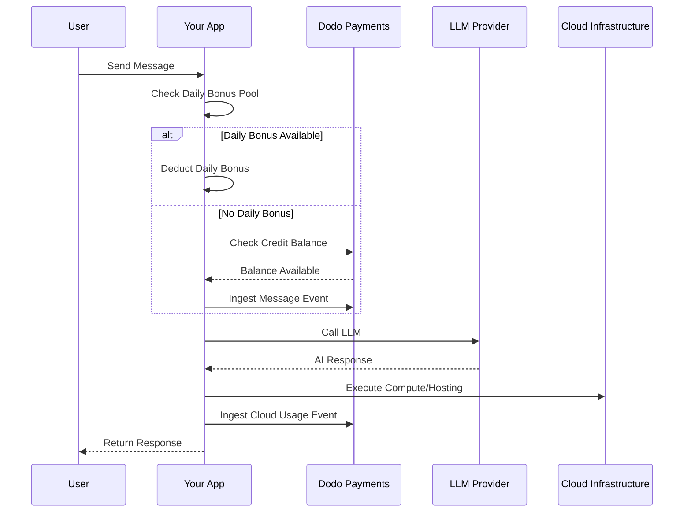

Lovable(lovable.dev)은 크레딧 기반 구독 모델을 사용하는 AI 웹 앱 빌더입니다. 토큰 기반 시스템과 달리 Lovable은 메시지당 크레딧 1개를 부과하여 사용자 경험을 단순화합니다. 이 모델은 월간 크레딧 풀과 일일 보너스 지급을 결합하여, 집중적인 사용도 허용하면서 지속적인 참여를 유도합니다.

## Lovable의 결제 모델

Lovable의 가격 책정은 메시지 크레딧과 클라우드 인프라에 대한 별도의 사용량 기반 결제를 중심으로 구성됩니다.

| 플랜 | 가격 | 월간 크레딧 | 일일 보너스 | 주요 기능 |
| :--- | :--- | :--- | :--- | :--- |
| Free | \$0/월 | 0 | 5/일 (월 최대 30개) | 공개 프로젝트만 |
| Pro | \$25/월 | 100 | 5/일 (총 월 최대 150개) | 온디맨드 추가 충전, 사용량 기반 Cloud + AI, 사용자 지정 도메인 |
| Business | \$50/월 | 100 | 5/일 | SSO, 팀 워크스페이스, 디자인 템플릿, 보안 센터 |
| Enterprise | 맞춤형 | 맞춤형 | 맞춤형 | SCIM, 전담 지원, 감사 로그 |

- **크레딧 기반 구독**: 크레딧 1개 = AI에 보내는 메시지/프롬프트 1개입니다.
- **크레딧은 무제한 사용자 간 공유**: 사용자별이 아닌 팀 전체 풀입니다.
- **크레딧은 각 결제 주기에 초기화**: 월간 크레딧은 갱신 시 새로 충전됩니다.
- **온디맨드 크레딧 추가 충전**: 크레딧을 모두 사용한 경우 사용자가 추가 크레딧을 구매할 수 있습니다.
- **별도의 사용량 기반 Cloud + AI 결제**: 호스팅 및 컴퓨팅에 대한 미터링 결제입니다.
- **일일 보너스 크레딧은 매일 초기화**: 사용하지 않으면 소멸되는 일일 크레딧 5개의 지급입니다.

## 차별화된 특징

- **메시지 기반의 단순성**: 복잡도와 관계없이 크레딧 1개 = 메시지 1개입니다. 토큰을 계산하거나 모델별 가중치를 적용하지 않습니다.
- **일일 지급 + 월간 풀 하이브리드**: 일일 보너스 크레딧 5개는 매일 참여하도록 유도하고, 월간 크레딧 100개는 집중적인 사용을 가능하게 합니다.
- **팀 전체 공유 풀**: 사용자별이 아니라 고정된 팀 요금으로 무제한 사용자 간 크레딧을 공유합니다.
- **2계층 결제**: AI 상호작용에는 크레딧을 사용하고, 클라우드 인프라에는 별도의 미터링 결제를 적용합니다.

## Dodo Payments을(를) 사용하여 구축하기

Dodo Payments의 크레딧 entitlement 및 사용량 기반 미터를 사용하여 Lovable의 하이브리드 모델을 재현할 수 있습니다.

<Steps>
  <Step title="Create a Custom Unit Credit Entitlement">
    Dodo Payments 대시보드에서 메시지 크레딧 시스템을 정의합니다. 이 entitlement가 월간 크레딧 풀을 관리합니다.

    - **크레딧 유형**: Custom Unit
    - **단위 이름**: "Messages"
    - **정밀도**: 0
    - **크레딧 만료**: 30일
    - **초과 사용량**: 비활성화됨 (크레딧이 0에 도달하면 하드 캡 적용)
  </Step>

  <Step title="Create Subscription Products">
    플랜을 생성하고 크레딧 entitlement를 연결합니다. Free 플랜에서는 애플리케이션 로직을 통해 일일 보너스를 처리합니다.

    - **Free**: \$0/월, 크레딧 0개 (일일 보너스는 앱 로직으로 처리)
    - **Pro**: \$25/월, 주기당 크레딧 100개, 크레딧 entitlement 연결
    - **Business**: \$50/월, 주기당 크레딧 100개, 크레딧 entitlement 연결

    ```typescript
    import DodoPayments from 'dodopayments';

    const client = new DodoPayments({
      bearerToken: process.env.DODO_PAYMENTS_API_KEY,
    });

    const session = await client.checkoutSessions.create({
      product_cart: [
        { product_id: 'prod_lovable_pro', quantity: 1 }
      ],
      customer: { email: 'user@example.com' },
      return_url: 'https://lovable.dev/dashboard'
    });
    ```

  </Step>

  <Step title="Create a Usage Meter for Cloud + AI">
    Lovable은 클라우드 인프라에 대해 별도로 결제합니다. 이러한 비용을 추적할 미터를 생성합니다.

    - **미터 이름**: `cloud.compute_seconds`
    - **집계**: `compute_seconds` 속성에 대한 합계

    이 미터를 단위당 가격이 적용된 구독 제품에 연결합니다. 사용량을 수집하면 Dodo이(가) 요금에 따라 비용을 계산합니다.

    ```typescript
    await client.usageEvents.ingest({
      events: [{
        event_id: `compute_${Date.now()}`,
        customer_id: 'cust_123',
        event_name: 'cloud.compute_seconds',
        timestamp: new Date().toISOString(),
        metadata: {
          compute_seconds: 3600,
          project_id: 'proj_abc'
        }
      }]
    });
    ```

  </Step>

  <Step title="Implement Daily Bonus Credits (Application Logic)">
    일일 보너스 지급은 애플리케이션 수준에서 처리합니다. cron job을 사용하여 이러한 크레딧을 지급하거나 데이터베이스에서 별도로 추적할 수 있습니다.

    기본 entitlement 잔액을 즉시 차감하지 않고 Dodo에서 이러한 보너스 크레딧의 사용량을 추적하려면 별도의 event name을 사용하거나 앱에서 보너스 풀을 먼저 확인하는 로직을 처리할 수 있습니다.

    ```typescript
    // Example cron job logic (pseudo-code)
    // Every day at midnight UTC:
    // 1. Reset 'daily_bonus_used' to 0 for all users in your DB
    
    // When a user sends a message:
    async function handleMessage(userId: string) {
      const user = await db.users.findUnique({ where: { id: userId } });
      
      if (user.daily_bonus_used < 5) {
        // Use daily bonus
        await db.users.update({
          where: { id: userId },
          data: { daily_bonus_used: { increment: 1 } }
        });
        // Track for analytics but don't deduct from Dodo credits yet
        await client.usageEvents.ingest({
          events: [{
            event_id: `msg_bonus_${Date.now()}`,
            customer_id: userId,
            event_name: 'ai.message.bonus',
            timestamp: new Date().toISOString(),
            metadata: { type: 'daily_bonus' }
          }]
        });
      } else {
        // Deduct from Dodo credit entitlement
        await client.usageEvents.ingest({
          events: [{
            event_id: `msg_${Date.now()}`,
            customer_id: userId,
            event_name: 'ai.message',
            timestamp: new Date().toISOString(),
            metadata: { type: 'subscription_credit' }
          }]
        });
      }
    }
    ```

  </Step>

  <Step title="Send Usage Events for Messages">
    각 AI 메시지를 usage event로 추적합니다. `ai.message` event를 Dodo 대시보드의 "Messages" 크레딧 entitlement에 연결합니다.

    ```typescript
    await client.usageEvents.ingest({
      events: [{
        event_id: `msg_${Date.now()}`,
        customer_id: 'cust_123',
        event_name: 'ai.message',
        timestamp: new Date().toISOString(),
        metadata: {
          content_length: 450,
          project_id: 'proj_abc',
          feature_type: 'editor'
        }
      }]
    });
    ```

  </Step>

  <Step title="Handle Webhooks for Low Balance">
    사용자가 크레딧을 거의 다 사용했을 때 알림을 보내 추가 충전 또는 업그레이드를 진행할 수 있도록 합니다.

    ```typescript
    import DodoPayments from 'dodopayments';
    import express from 'express';

    const app = express();
    app.use(express.raw({ type: 'application/json' }));

    const client = new DodoPayments({
      bearerToken: process.env.DODO_PAYMENTS_API_KEY,
      webhookKey: process.env.DODO_PAYMENTS_WEBHOOK_KEY,
    });

    app.post('/webhooks/dodo', async (req, res) => {
      try {
        const event = client.webhooks.unwrap(req.body.toString(), {
          headers: {
            'webhook-id': req.headers['webhook-id'] as string,
            'webhook-signature': req.headers['webhook-signature'] as string,
            'webhook-timestamp': req.headers['webhook-timestamp'] as string,
          },
        });

        if (event.type === 'credit.balance_low') {
          const { customer_id, available_balance } = event.data;
          await notifyUser(customer_id, `Your balance is low: ${available_balance} messages left.`);
        }

        res.json({ received: true });
      } catch (error) {
        res.status(401).json({ error: 'Invalid signature' });
      }
    });
    ```

  </Step>
</Steps>

## LLM Ingestion Blueprint로 가속하기

[LLM Ingestion Blueprint](/developer-resources/ingestion-blueprints/llm)는 AI client를 래핑하여 추적을 간소화합니다.

```typescript
import { createLLMTracker } from '@dodopayments/ingestion-blueprints';
import OpenAI from 'openai';

const tracker = createLLMTracker({
  apiKey: process.env.DODO_PAYMENTS_API_KEY,
  environment: 'live_mode',
  eventName: 'ai.message',
});

const trackedClient = tracker.wrap({
  client: new OpenAI(),
  customerId: 'cust_123',
});

// Automatically tracks the message and deducts 1 credit (if configured)
await trackedClient.chat.completions.create({
  model: 'gpt-4o',
  messages: [{ role: 'user', content: 'Build a landing page' }],
});
```

<Tip>
  자동 추적에 대한 자세한 내용은 [전체 blueprint 문서](/developer-resources/ingestion-blueprints/llm)를 참조하세요.
</Tip>

## 아키텍처 개요



## 사용된 주요 Dodo 기능

이 구현을 가능하게 하는 기능을 살펴보세요.

<CardGroup cols={2}>
  <Card title="Credit-Based Billing" icon="coins" href="/features/credit-based-billing">
    메시지 크레딧과 공유 팀 풀을 관리합니다.
  </Card>
  <Card title="Subscriptions" icon="calendar" href="/features/subscription">
    Pro 및 Business 티어에 대한 반복 플랜을 설정합니다.
  </Card>
  <Card title="Usage-Based Billing" icon="chart-line" href="/features/usage-based-billing/introduction">
    클라우드 인프라 사용량을 AI 크레딧과 별도로 미터링합니다.
  </Card>
  <Card title="Event Ingestion" icon="bolt" href="/features/usage-based-billing/event-ingestion">
    대규모 메시지 및 컴퓨팅 이벤트를 Dodo(으)로 전송합니다.
  </Card>
  <Card title="Webhooks" icon="webhook" href="/developer-resources/webhooks/intents/credit">
    크레딧 잔액 부족 알림을 자동화합니다.
  </Card>
  <Card title="LLM Ingestion Blueprint" icon="brain-circuit" href="/developer-resources/ingestion-blueprints/llm">
    사전 구축된 통합으로 AI 사용량 추적을 간소화합니다.
  </Card>
</CardGroup>

Explore the features that make this implementation possible.

<CardGroup cols={2}>
  <Card title="Credit-Based Billing" icon="coins" href="/features/credit-based-billing">
    Manage message credits and shared team pools.
  </Card>
  <Card title="Subscriptions" icon="calendar" href="/features/subscription">
    Set up recurring plans for Pro and Business tiers.
  </Card>
  <Card title="Usage-Based Billing" icon="chart-line" href="/features/usage-based-billing/introduction">
    Meter cloud infrastructure usage separately from AI credits.
  </Card>
  <Card title="Event Ingestion" icon="bolt" href="/features/usage-based-billing/event-ingestion">
    Send high-volume message and compute events to Dodo.
  </Card>
  <Card title="Webhooks" icon="webhook" href="/developer-resources/webhooks/intents/credit">
    Automate notifications for low credit balances.
  </Card>
  <Card title="LLM Ingestion Blueprint" icon="brain-circuit" href="/developer-resources/ingestion-blueprints/llm">
    Simplify AI usage tracking with pre-built integrations.
  </Card>
</CardGroup>
