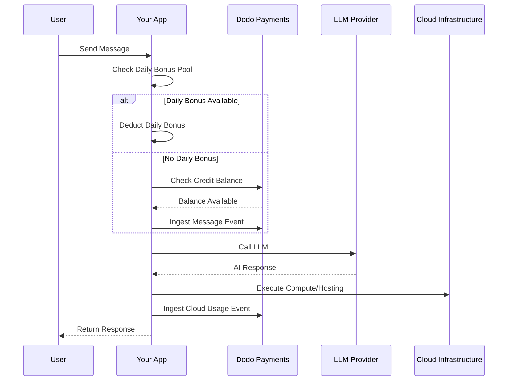

Lovable (lovable.dev)는 크레딧 기반 구독 모델을 사용하는 AI 웹 앱 빌더입니다. 토큰 기반 시스템과 달리, Lovable은 메시지당 한 크레딧을 청구하여 사용자 경험을 단순화합니다. 이 모델은 월간 크레딧 풀과 일일 보너스 드립을 결합하여 꾸준한 참여를 장려하고 폭발적 사용을 가능하게 합니다.

## Lovable의 청구 모델

Lovable의 가격 책정은 메시지 크레딧과 클라우드 인프라에 대한 별도의 미터링 청구를 중심으로 구축되었습니다.

| Plan | Price | Monthly Credits | Daily Bonus | Key Features |
| :--- | :--- | :--- | :--- | :--- |
| Free | \$0/month | 0 | 5/day (up to 30/month) | Public projects only |
| Pro | \$25/month | 100 | 5/day (up to 150/month total) | On-demand top-ups, usage-based Cloud + AI, custom domains |
| Business | \$50/month | 100 | 5/day | SSO, team workspace, design templates, security center |
| Enterprise | Custom | Custom | Custom | SCIM, dedicated support, audit logs |

- **크레딧 기반 구독**: 1 크레딧 = AI의 메시지/프롬프트 1개.
- **무제한 사용자 공유 크레딧**: 팀 전체 풀, 사용자별 아님.
- **각 청구 주기마다 크레딧 초기화**: 월간 크레딧은 갱신 시 새로고침.
- **필요 시 크레딧 추가 구입 가능**: 크레딧을 다 쓴 경우 더 구입 가능.
- **별도의 사용 기반 클라우드 + AI 청구**: 호스팅 및 컴퓨팅에 대한 미터 청구.
- **일일 보너스 크레딧은 매일 초기화**: 사용하지 않으면 소멸되는 5개의 일일 드립.

## 독창적인 점

- **메시지 기반의 단순함**: 복잡도에 관계없이 1 메시지는 1 크레딧. 토큰 계산이나 모델 가중치 없음.
- **일일 드립 + 월간 풀 하이브리드**: 5개의 일일 보너스 크레딧은 일일 참여 유인을 만들어내고, 100개의 월간 크레딧은 폭발적 사용을 가능하게 합니다.
- **팀 전체 공유 풀**: 사용자당 요금이 아닌 팀 전체의 고정 가격으로 크레딧 공유.
- **이중 계층 청구**: AI 상호작용을 위한 크레딧 + 클라우드 인프라에 대한 별도의 미터 청구.

## Dodo Payments로 이것을 구축하기

Dodo Payments의 크레딧 권한과 사용 기반 미터를 사용하여 Lovable의 하이브리드 모델을 복제할 수 있습니다.

    Define the message credit system in your Dodo Payments dashboard. This entitlement handles the monthly credit pool.

    - **Credit Type**: Custom Unit
    - **Unit Name**: "Messages"
    - **Precision**: 0
    - **Credit Expiry**: 30 days
    - **Overage**: Disabled (hard cap when credits hit 0)

    Create your plans and attach the credit entitlement. For the Free plan, you'll handle the daily bonus via application logic.

    - **Free**: \$0/mo, 0 credits (daily bonus handled by app logic)
    - **Pro**: \$25/mo, 100 credits/cycle, attach credit entitlement
    - **Business**: \$50/mo, 100 credits/cycle, attach credit entitlement

    Lovable bills separately for cloud infrastructure. Create a meter to track these costs.

    - **Meter name**: 
    - **Aggregation**: Sum on  property

    Attach this meter to your subscription products with per-unit pricing. When you ingest usage, Dodo calculates the cost based on your rates.

    The daily bonus drip is handled at the application level. You can use a cron job to grant these credits or track them separately in your database.

    To track the usage of these bonus credits in Dodo without depleting the main entitlement balance immediately, you can use a separate event name or handle the logic in your app to check the bonus pool first.

    Track each AI message as a usage event. Link the  event to your "Messages" credit entitlement in the Dodo dashboard.

    Notify users when they are running low on credits so they can top up or upgrade.

## LLM Ingestion Blueprint로 가속화

[LLM Ingestion Blueprint](/developer-resources/ingestion-blueprints/llm)는 AI 클라이언트를 래핑하여 추적을 간소화합니다.

  Check out the [full blueprint documentation](/developer-resources/ingestion-blueprints/llm) for more details on automatic tracking.

## 아키텍처 개요

## 사용된 주요 Dodo 기능

Explore the features that make this implementation possible.

    Manage message credits and shared team pools.

    Set up recurring plans for Pro and Business tiers.

    Meter cloud infrastructure usage separately from AI credits.

    Send high-volume message and compute events to Dodo.

    Automate notifications for low credit balances.

    Simplify AI usage tracking with pre-built integrations.

```typescript
import { createLLMTracker } from '@dodopayments/ingestion-blueprints';
import OpenAI from 'openai';

const tracker = createLLMTracker({
  apiKey: process.env.DODO_PAYMENTS_API_KEY,
  environment: 'live_mode',
  eventName: 'ai.message',
});

const trackedClient = tracker.wrap({
  client: new OpenAI(),
  customerId: 'cust_123',
});

// Automatically tracks the message and deducts 1 credit (if configured)
await trackedClient.chat.completions.create({
  model: 'gpt-4o',
  messages: [{ role: 'user', content: 'Build a landing page' }],
});
```

<Tip>
  Check out the [full blueprint documentation](/developer-resources/ingestion-blueprints/llm) for more details on automatic tracking.
</Tip>

## Architecture Overview



## Key Dodo Features Used

Explore the features that make this implementation possible.

<CardGroup cols={2}>
  <Card title="Credit-Based Billing" icon="coins" href="/features/credit-based-billing">
    Manage message credits and shared team pools.
  </Card>
  <Card title="Subscriptions" icon="calendar" href="/features/subscription">
    Set up recurring plans for Pro and Business tiers.
  </Card>
  <Card title="Usage-Based Billing" icon="chart-line" href="/features/usage-based-billing/introduction">
    Meter cloud infrastructure usage separately from AI credits.
  </Card>
  <Card title="Event Ingestion" icon="bolt" href="/features/usage-based-billing/event-ingestion">
    Send high-volume message and compute events to Dodo.
  </Card>
  <Card title="Webhooks" icon="webhook" href="/developer-resources/webhooks/intents/credit">
    Automate notifications for low credit balances.
  </Card>
  <Card title="LLM Ingestion Blueprint" icon="brain-circuit" href="/developer-resources/ingestion-blueprints/llm">
    Simplify AI usage tracking with pre-built integrations.
  </Card>
</CardGroup>
