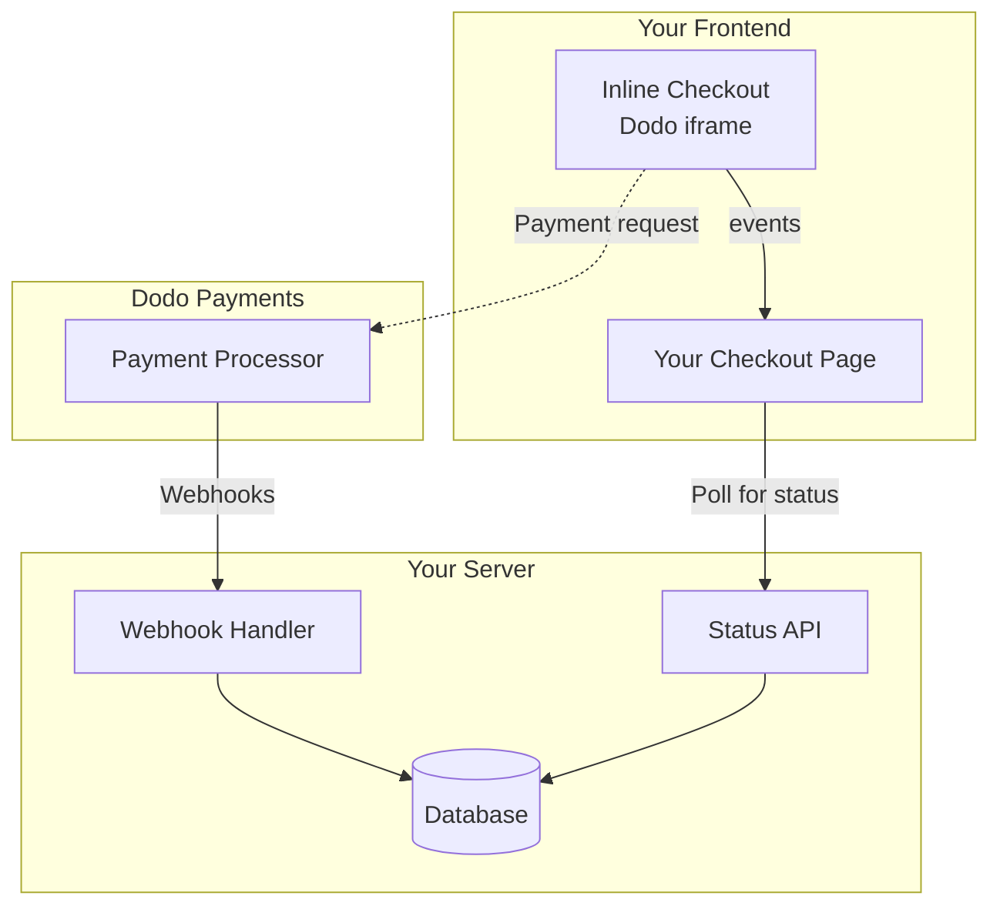

## 개요

인라인 체크아웃을 사용하면 웹사이트나 애플리케이션과 원활하게 통합된 체크아웃 경험을 생성할 수 있습니다. 페이지 위에 모달로 열리는 [오버레이 체크아웃](/developer-resources/overlay-checkout)과 달리, 인라인 체크아웃은 결제 양식을 페이지 레이아웃에 직접 임베드합니다.

인라인 체크아웃을 사용하면 다음을 수행할 수 있습니다:

- 앱이나 웹사이트와 완전히 통합된 체크아웃 경험 생성
- Dodo Payments가 고객 및 결제 정보를 안전하게 캡처하도록 최적화된 체크아웃 프레임 사용
- 페이지에 Dodo Payments의 항목, 총액 및 기타 정보 표시
- SDK 메서드 및 이벤트를 사용하여 고급 체크아웃 경험 구축

<Frame>
    
</Frame>

## 작동 방식

인라인 체크아웃은 웹사이트나 앱에 안전한 Dodo Payments 프레임을 임베드하여 작동합니다.

체크아웃 프레임은 고객 정보를 수집하고 결제 세부 정보를 캡처하는 역할을 합니다. 페이지는 항목 목록, 총액 및 체크아웃에서 변경할 수 있는 옵션을 표시합니다. SDK를 사용하면 페이지와 체크아웃 프레임이 상호작용할 수 있습니다.

Dodo Payments는 체크아웃이 완료되면 자동으로 구독을 생성하여 프로비저닝할 준비를 합니다.

<Note>
인라인 결제 프레임은 모든 민감한 결제 정보를 안전하게 처리하여, 귀사가 추가 인증 없이도 PCI 기준을 준수할 수 있도록 합니다.
</Note>

## 좋은 인라인 체크아웃의 조건

고객이 누구에게서 구매하고 있는지, 무엇을 구매하고 있는지, 얼마를 지불하고 있는지 아는 것이 중요합니다.

준수 및 전환 최적화를 위한 인라인 체크아웃을 구축하려면 구현에 다음이 포함되어야 합니다:

<Frame caption="Example inline checkout layout showing required elements">
    
</Frame>

1. **정기 정보**: 정기적인 경우, 얼마나 자주 반복되는지 및 갱신 시 지불할 총액. 체험판인 경우, 체험판 기간.
2. **항목 설명**: 구매하는 항목에 대한 설명.
3. **거래 총액**: 거래 총액, 포함된 소계, 총 세금 및 총합. 통화도 포함해야 합니다.
4. **Dodo Payments 바닥글**: Dodo Payments에 대한 정보, 판매 조건 및 개인정보 보호정책이 포함된 전체 인라인 체크아웃 프레임.
5. **환불 정책**: Dodo Payments의 표준 환불 정책과 다를 경우 환불 정책에 대한 링크.

<Warning>
인라인 결제 프레임 전체, 푸터를 포함한 모든 요소를 항상 표시하세요. 법적 정보를 제거하거나 숨기는 것은 준수 요구 사항을 위반합니다.
</Warning>

## 고객 여정

체크아웃 흐름은 체크아웃 세션 구성에 따라 결정됩니다. 체크아웃 세션을 구성하는 방식에 따라 고객은 모든 정보를 단일 페이지에서 또는 여러 단계에 걸쳐 제공받는 체크아웃을 경험하게 됩니다.

<Steps>
<Step title="Customer opens checkout">

아이템 또는 기존 거래를 전달하여 인라인 결제를 열 수 있습니다. 페이지 정보 표시 및 갱신을 위해 SDK를 사용하고, 고객 상호작용 기반으로 아이템을 업데이트하기 위해 SDK 메서드를 사용하세요.
    

</Step>

<Step title="Customer enters their details">

인라인 체크아웃은 먼저 고객에게 이메일 주소를 입력하고, 국가를 선택하며, (필요한 경우) 우편번호를 입력하도록 요청합니다. 이 단계에서는 세금 및 사용 가능한 결제 옵션을 결정하는 데 필요한 모든 정보를 수집합니다.

고객 세부 정보를 미리 채우고 저장된 주소를 제시하여 경험을 간소화할 수 있습니다.

</Step>

<Step title="Customer selects payment method">

세부 정보를 입력한 후 고객은 사용 가능한 결제 방법과 결제 양식을 제시받습니다. 옵션에는 신용 카드, 직불 카드, PayPal, Apple Pay, Google Pay 및 고객의 위치에 따라 다른 지역 결제 방법이 포함될 수 있습니다.

가능한 경우 저장된 결제 방법을 표시하여 체크아웃 속도를 높입니다.


</Step>

<Step title="Checkout completed">

Dodo Payments는 모든 결제를 해당 판매에 가장 적합한 인수자에게 라우팅하여 성공 가능성을 극대화합니다. 고객은 귀하가 구축할 수 있는 성공 워크플로우로 들어갑니다.


</Step>

<Step title="Dodo Payments creates subscription">

Dodo Payments는 고객을 위해 자동으로 구독을 생성하여 귀하가 프로비저닝할 준비를 합니다. 고객이 사용한 결제 방법은 갱신 또는 구독 변경을 위해 파일에 보관됩니다.


</Step>
</Steps>

## 빠른 시작

몇 줄의 코드로 Dodo Payments 인라인 체크아웃을 시작하세요:

```typescript
import { DodoPayments } from "dodopayments-checkout";

// Initialize the SDK for inline mode
DodoPayments.Initialize({
  mode: "test",
  displayType: "inline",
  onEvent: (event) => {
    console.log("Checkout event:", event);
  },
});

// Open checkout in a specific container
DodoPayments.Checkout.open({
  checkoutUrl: "https://test.dodopayments.com/session/cks_123",
  elementId: "dodo-inline-checkout" // ID of the container element
});
```

<Tip>
페이지에 해당 `id`가 있는 컨테이너 요소를 포함하고 있는지 확인하세요: `<div id="dodo-inline-checkout"></div>`.
</Tip>

## 단계별 통합 가이드

<Steps>
<Step title="Install the SDK">

Dodo Payments Checkout SDK를 설치하세요:

<CodeGroup>

```bash npm
npm install dodopayments-checkout
```

```bash yarn
yarn add dodopayments-checkout
```

```bash pnpm
pnpm add dodopayments-checkout
```

</CodeGroup>

</Step>

<Step title="Initialize the SDK for Inline Display">

SDK를 초기화하고 `displayType: 'inline'`을 지정하세요. `checkout.breakdown` 이벤트를 청취하여 실시간 세금 및 총계 계산으로 UI를 업데이트하는 것도 권장합니다.

```typescript
import { DodoPayments } from "dodopayments-checkout";

DodoPayments.Initialize({
  mode: "test",
  displayType: "inline",
  onEvent: (event) => {
    if (event.event_type === "checkout.breakdown") {
      const breakdown = event.data?.message;
      // Update your UI with breakdown.subTotal, breakdown.tax, breakdown.total, etc.
    }
  },
});
```

</Step>

<Step title="Create a Container Element">

체크아웃 프레임이 삽입될 HTML 요소를 추가하세요:

```html
<div id="dodo-inline-checkout"></div>
```

</Step>

<Step title="Open the Checkout">

`checkoutUrl`와 컨테이너의 `elementId`를 사용하여 `DodoPayments.Checkout.open()`을 호출하세요:

```typescript
DodoPayments.Checkout.open({
  checkoutUrl: "https://test.dodopayments.com/session/cks_123",
  elementId: "dodo-inline-checkout"
});
```

</Step>

<Step title="Test Your Integration">

1. 개발 서버를 시작하세요:

```bash
npm run dev
```

2. 체크아웃 흐름을 테스트하세요:
   - 인라인 프레임에 이메일 및 주소 세부 정보를 입력하세요.
   - 사용자 정의 주문 요약이 실시간으로 업데이트되는지 확인하세요.
   - 테스트 자격 증명을 사용하여 결제 흐름을 테스트하세요.
   - 리디렉션이 올바르게 작동하는지 확인하세요.

<Check>
`onEvent` 콜백에 콘솔 로그를 추가한 경우, 브라우저 콘솔에 `checkout.breakdown` 이벤트가 기록되는 것을 확인할 수 있습니다.
</Check>

</Step>

<Step title="Go Live">

프로덕션 준비가 되었을 때:

1. 모드를 `'live'`로 변경하세요:

```typescript
DodoPayments.Initialize({
  mode: "live",
  displayType: "inline",
  onEvent: (event) => {
    // Handle events
  }
});
```

2. 체크아웃 URL을 백엔드에서 라이브 체크아웃 세션을 사용하도록 업데이트하세요.
3. 프로덕션에서 전체 흐름을 테스트하세요.

</Step>
</Steps>

## 완전한 React 예제

이 예시는 인라인 결제와 함께 사용자 정의 주문 요약을 구현하는 방법을 보여주며, `checkout.breakdown` 이벤트를 사용하여 두 요소를 동기화합니다.

```tsx
"use client";

import { useEffect, useState } from 'react';
import { DodoPayments, CheckoutBreakdownData } from 'dodopayments-checkout';

export default function CheckoutPage() {
  const [breakdown, setBreakdown] = useState<Partial<CheckoutBreakdownData>>({});

  useEffect(() => {
    // 1. Initialize the SDK
    DodoPayments.Initialize({
      mode: 'test',
      displayType: 'inline',
      onEvent: (event) => {
        // 2. Listen for the 'checkout.breakdown' event
        if (event.event_type === "checkout.breakdown") {
          const message = event.data?.message as CheckoutBreakdownData;
          if (message) setBreakdown(message);
        }
      }
    });

    // 3. Open the checkout in the specified container
    DodoPayments.Checkout.open({
      checkoutUrl: 'https://test.dodopayments.com/session/cks_123',
      elementId: 'dodo-inline-checkout'
    });

    return () => DodoPayments.Checkout.close();
  }, []);

  const format = (amt: number | null | undefined, curr: string | null | undefined) => 
    amt != null && curr ? `${curr} ${(amt/100).toFixed(2)}` : '0.00';

  const currency = breakdown.currency ?? breakdown.finalTotalCurrency ?? '';

  return (
    <div className="flex flex-col md:flex-row min-h-screen">
      {/* Left Side - Checkout Form */}
      <div className="w-full md:w-1/2 flex items-center">
        <div id="dodo-inline-checkout" className='w-full' />
      </div>

      {/* Right Side - Custom Order Summary */}
      <div className="w-full md:w-1/2 p-8 bg-gray-50">
        <h2 className="text-2xl font-bold mb-4">Order Summary</h2>
        <div className="space-y-2">
          {breakdown.subTotal && (
            <div className="flex justify-between">
              <span>Subtotal</span>
              <span>{format(breakdown.subTotal, currency)}</span>
            </div>
          )}
          {breakdown.discount && (
            <div className="flex justify-between">
              <span>Discount</span>
              <span>{format(breakdown.discount, currency)}</span>
            </div>
          )}
          {breakdown.tax != null && (
            <div className="flex justify-between">
              <span>Tax</span>
              <span>{format(breakdown.tax, currency)}</span>
            </div>
          )}
          <hr />
          {(breakdown.finalTotal ?? breakdown.total) && (
            <div className="flex justify-between font-bold text-xl">
              <span>Total</span>
              <span>{format(breakdown.finalTotal ?? breakdown.total, breakdown.finalTotalCurrency ?? currency)}</span>
            </div>
          )}
        </div>
      </div>
    </div>
  );
}

```

## API 참조

### 구성

#### 초기화 옵션

```typescript
interface InitializeOptions {
  mode: "test" | "live";
  displayType: "inline"; // Required for inline checkout
  onEvent: (event: CheckoutEvent) => void;
}
```

| 옵션 | 유형 | 필수 | 설명 |
|--------|------|----------|-------------|
| `mode` | `"test" \| "live"` | 예 | 환경 모드입니다. |
| `displayType` | `"inline" \| "overlay"` | 예 | 결제를 임베드하려면 `"inline"`으로 설정해야 합니다. |
| `onEvent` | `function` | 예 | 결제 이벤트를 처리하는 콜백 함수입니다. |

#### 체크아웃 옵션

```typescript
export type FontSize = "xs" | "sm" | "md" | "lg" | "xl" | "2xl";
export type FontWeight = "normal" | "medium" | "bold" | "extraBold";

interface CheckoutOptions {
  checkoutUrl: string;
  elementId: string; // Required for inline checkout
  options?: {
    showTimer?: boolean;
    showSecurityBadge?: boolean;
    payButtonText?: string;
    fontSize?: FontSize;
    fontWeight?: FontWeight;
  };
}
```

| Option | Type | Required | Description |
|--------|------|----------|-------------|
| `checkoutUrl` | `string` | Yes | 결제 세션 URL. |
| `elementId` | `string` | Yes | 결제가 렌더링되어야 할 DOM 요소의 `id`. |
| `options.showTimer` | `boolean` | No | 결제 타이머 표시 또는 숨김. 기본값은 `true` 입니다. 비활성화하면 세션이 만료될 경우 `checkout.link_expired` 이벤트를 받게 됩니다. |
| `options.showSecurityBadge` | `boolean` | No | 보안 배지 표시 또는 숨김. 기본값은 `true` 입니다. |
| `options.payButtonText` | `string` | No | 결제 버튼에 표시할 사용자 지정 텍스트. |
| `options.fontSize` | `FontSize` | No | 결제를 위한 전역 글꼴 크기. |
| `options.fontWeight` | `FontWeight` | No | 결제를 위한 전역 글꼴 두께. |

### 메서드

#### 체크아웃 열기

지정된 컨테이너에서 체크아웃 프레임을 엽니다.

```typescript
DodoPayments.Checkout.open({
  checkoutUrl: "https://test.dodopayments.com/session/cks_123",
  elementId: "dodo-inline-checkout"
});
```

체크아웃 동작을 사용자 정의하기 위해 추가 옵션을 전달할 수도 있습니다:

```typescript
DodoPayments.Checkout.open({
  checkoutUrl: "https://test.dodopayments.com/session/cks_123",
  elementId: "dodo-inline-checkout",
  options: {
    showTimer: false,
    showSecurityBadge: false,
    payButtonText: "Pay Now",
  },
});
```

#### 결제 닫기

프로그래밍 방식으로 결제 프레임을 제거하고 이벤트 리스너를 정리합니다.

```typescript
DodoPayments.Checkout.close();
```

#### 상태 확인

결제 프레임이 현재 주입되었는지 여부를 반환합니다.

```typescript
const isOpen = DodoPayments.Checkout.isOpen();
// Returns: boolean
```

### 이벤트

SDK는 `onEvent` 콜백을 통해 실시간 이벤트를 제공합니다. 인라인 결제의 경우, UI 동기화를 위해 `checkout.breakdown`가 특히 유용합니다.

| Event Type | Description |
|------------|-------------|
| `checkout.opened` | 결제 프레임이 로드되었습니다. |
| `checkout.form_ready` | 결제 양식이 사용자 입력을 받을 준비가 되었습니다. 로딩 상태를 숨기고 결제 UI를 표시하는 데 유용합니다. |
| `checkout.breakdown` | 가격, 세금 또는 할인이 업데이트될 때 발생합니다. |
| `checkout.customer_details_submitted` | 고객 세부 정보가 제출되었습니다. |
| `checkout.pay_button_clicked` | 고객이 결제 버튼을 클릭할 때 발생합니다. 분석 및 전환 퍼널 추적에 유용합니다. |
| `checkout.redirect` | 결제가 리디렉션됩니다(예: 은행 페이지로). |
| `checkout.error` | 결제 중 오류가 발생했습니다. |
| `checkout.link_expired` | 결제 세션이 만료될 때 발생합니다. `showTimer`이 `false`로 설정된 경우에만 수신됩니다. |

#### 결제 분해 데이터

`checkout.breakdown` 이벤트는 다음 데이터를 제공합니다:

```typescript
interface CheckoutBreakdownData {
  subTotal?: number;          // Amount in cents
  discount?: number;         // Amount in cents
  tax?: number;              // Amount in cents
  total?: number;            // Amount in cents
  currency?: string;         // e.g., "USD"
  finalTotal?: number;       // Final amount including adjustments
  finalTotalCurrency?: string; // Currency for the final total
}
```

#### 분해 이벤트 이해하기

`checkout.breakdown` 이벤트는 Dodo Payments 결제 상태와 애플리케이션 UI를 동기화하는 주요 방법입니다.

**발생 시점:**
- **초기화 시**: 결제 프레임이 로드되고 준비된 직후.
- **주소 변경 시**: 고객이 나라를 선택하거나 세금 재계산을 초래하는 우편번호를 입력할 때마다.

**필드 설명:**

| Field | Description |
|-------|-------------|
| `subTotal` | 할인이나 세금이 적용되기 전, 세션 내 모든 항목의 합계. |
| `discount` | 적용된 모든 할인의 총액. |
| `tax` | 계산된 세금 금액. `inline` 모드에서는 사용자가 주소 필드와 상호작용할 때마다 동적으로 업데이트됩니다. |
| `total` | 세션의 기본 통화에서 `subTotal - discount + tax`의 수학적 결과. |
| `currency` | 표준 소계, 할인 및 세금 값에 대한 ISO 통화 코드(예: `"USD"`). |
| `finalTotal` | 고객에게 청구되는 실제 금액. 기본 가격 분해의 일부가 아닌 추가 외환 조정이나 지역 결제 수단 수수료가 포함될 수 있습니다. |
| `finalTotalCurrency` | 고객이 실제로 지불하는 통화. 구매력 패리티 또는 지역 통화 변환이 활성화된 경우 `currency`와 다를 수 있습니다. |

**통합 주요 팁:**

1.  **통화 포맷팅**: 가격은 항상 가장 작은 통화 단위로 정수 형태로 반환됩니다(예: USD의 센트, JPY의 엔). 표시하려면 100 또는 적절한 10의 제곱으로 나누거나 `Intl.NumberFormat`와 같은 포맷팅 라이브러리를 사용하세요.
2.  **초기 상태 처리**: 결제가 처음 로드되면 `tax` 및 `discount`가 `0` 또는 `null`일 수 있습니다. UI는 이러한 상태를 우아하게 처리해야 합니다(예: 대시 `—` 표시 또는 행 숨기기).
3.  **"최종 합계" 대 "총합"**: `total`는 표준 가격 계산을 제공하지만 `finalTotal`는 거래의 진실의 근원입니다. `finalTotal`가 존재하면 모든 동적 조정을 포함하여 고객 카드에 청구될 정확한 금액을 반영합니다.
4.  **실시간 피드백**: `tax` 필드를 사용하여 사용자에게 세금이 실시간으로 계산되고 있음을 보여주세요. 이는 결제 페이지에 "라이브" 느낌을 주고 주소 입력 단계에서 마찰을 줄입니다.

## 구현 옵션

### 패키지 관리자 설치

[단계별 통합 가이드](#step-by-step-integration-guide)에서 설명한 대로 npm, yarn 또는 pnpm을 통해 설치합니다.

### CDN 구현

빌드 단계 없이 빠르게 통합하려면 다음 CDN을 사용할 수 있습니다:

```html
<!DOCTYPE html>
<html lang="en">
<head>
    <meta charset="UTF-8">
    <meta name="viewport" content="width=device-width, initial-scale=1.0">
    <title>Dodo Payments Inline Checkout</title>
    
    <!-- Load DodoPayments -->
    <script src="https://cdn.jsdelivr.net/npm/dodopayments-checkout@latest/dist/index.js"></script>
    <script>
        // Initialize the SDK
        DodoPaymentsCheckout.DodoPayments.Initialize({
            mode: "test",
            displayType: "inline",
            onEvent: (event) => {
                console.log('Checkout event:', event);
            }
        });
    </script>
</head>
<body>
    <div id="dodo-inline-checkout"></div>

    <script>
        // Open the checkout
        DodoPaymentsCheckout.DodoPayments.Checkout.open({
            checkoutUrl: "https://test.dodopayments.com/session/cks_123",
            elementId: "dodo-inline-checkout"
        });
    </script>
</body>
</html>
```

## 결제 수단 업데이트

인라인 결제는 구독에 대한 **결제 수단 업데이트**를 지원합니다. 고객이 결제 수단을 업데이트해야 할 때 - 활성 구독이든 보류 중인 구독을 재활성화하든 - 페이지 레이아웃 내에서 업데이트 흐름을 렌더링할 수 있습니다.

### 작동 방식

1. [결제 수단 업데이트 API](/features/subscription#update-payment-method-for-active-subscription)를 호출하여 `payment_link`를 가져옵니다:

```typescript
const response = await client.subscriptions.updatePaymentMethod('sub_123', {
  type: 'new',
  return_url: 'https://example.com/return'
});
```

2. 반환된 `payment_link`를 `checkoutUrl`로 전달하여 인라인 결제를 엽니다:

```typescript
DodoPayments.Checkout.open({
  checkoutUrl: response.payment_link,
  elementId: "dodo-inline-checkout"
});
```

인라인 프레임은 결제 수단 수집 양식만 렌더링합니다. 고객은 페이지를 벗어나지 않고 새 카드 세부 정보를 입력하거나 저장된 결제 수단을 선택할 수 있습니다.

### 보류 중인 구독의 경우

`on_hold` 상태에 있는 구독의 경우 결제 수단을 업데이트할 때 Dodo Payments는 자동으로 남은 금액에 대한 청구를 생성합니다. `payment.succeeded` 및 `subscription.active` 웹훅을 모니터링하여 재활성화를 확인하세요.

```typescript
const response = await client.subscriptions.updatePaymentMethod('sub_123', {
  type: 'new',
  return_url: 'https://example.com/return'
});

if (response.payment_id) {
  // Charge created for remaining dues
  // Open inline checkout for payment collection
  DodoPayments.Checkout.open({
    checkoutUrl: response.payment_link,
    elementId: "dodo-inline-checkout"
  });
}
```

<Tip>
기존 저장된 결제 수단을 사용하려면 새로운 세부 정보를 수집하는 대신, `type: 'existing'`에 `payment_method_id`를 전달하여 결제 수단 업데이트 API를 사용할 수 있습니다.
</Tip>

## 오류 처리

SDK는 이벤트 시스템을 통해 자세한 오류 정보를 제공합니다. 항상 `onEvent` 콜백에서 적절한 오류 처리를 구현하세요:

```typescript
DodoPayments.Initialize({
  mode: "test",
  displayType: "inline",
  onEvent: (event: CheckoutEvent) => {
    if (event.event_type === "checkout.error") {
      console.error("Checkout error:", event.data?.message);
      // Handle error appropriately
    }
  }
});
```

<Warning>
문제가 발생했을 때 좋은 사용자 경험을 제공하기 위해 `checkout.error` 이벤트를 항상 처리하세요.
</Warning>

## 모범 사례

1. **반응형 디자인**: 컨테이너 요소에 충분한 너비와 높이가 있는지 확인하세요. iframe은 일반적으로 컨테이너를 채우도록 확장됩니다.
2. **동기화**: `checkout.breakdown` 이벤트를 사용하여 사용자 정의 주문 요약 또는 가격표를 결제 프레임에서 사용자에게 보이는 내용과 동기화하세요.
3. **스켈레톤 상태**: `checkout.opened` 이벤트가 발생할 때까지 컨테이너에 로딩 표시기를 보여주세요.
4. **정리**: 구성 요소 마운트 해제 시 `DodoPayments.Checkout.close()`를 호출하여 iframe 및 이벤트 리스너를 정리하세요.

<Info>
다크 모드 구현의 경우, 인라인 결제 프레임과의 최적 시각적 통합을 위해 배경색으로 `#0d0d0d`를 사용하는 것이 좋습니다.
</Info>

## 결제 상태 검증

<Warning>
결제 성공 또는 실패를 결정하기 위해 인라인 결제 이벤트에만 의존하지 마세요. 웹훅 및/또는 폴링을 사용하여 서버 측 검증을 항상 구현하세요.
</Warning>

### 서버 측 검증이 필수적인 이유

인라인 결제 이벤트는 실시간 피드백을 제공하지만, 결제 상태에 대한 유일한 진실의 근원이 되어서는 **안됩니다**. 네트워크 문제, 브라우저 충돌, 사용자가 페이지를 닫는 경우 이벤트가 누락될 수 있습니다. 신뢰할 수 있는 결제 검증을 보장하기 위해:

1. **귀하의 서버는 웹훅 이벤트를 수신해야 합니다** - Dodo Payments는 결제 상태 변경에 대한 웹훅을 전송합니다
2. **폴링 메커니즘을 구현하세요** - 프론트엔드가 서버에 상태 업데이트를 폴링해야 합니다
3. **두 가지 접근을 결합하세요** - 웹훅을 주요 소스로 사용하고 폴링을 보완 수단으로 사용하세요

### 권장 아키텍처



### 구현 단계

**1. 결제 이벤트 수신 대기** - 사용자가 결제를 클릭하면 상태를 검증할 준비를 시작합니다:

```typescript
onEvent: (event) => {
  if (event.event_type === 'checkout.pay_button_clicked') {
    // Start polling your server for confirmed status
    startPolling();
  }
}
```

**2. 서버를 폴링** - 결제 상태를 데이터베이스에서 확인하는 엔드포인트를 만드세요 (웹훅에 의해 업데이트됨):

```typescript
// Poll every 2 seconds until status is confirmed
const interval = setInterval(async () => {
  const { status } = await fetch(`/api/payments/${paymentId}/status`).then(r => r.json());
  if (status === 'succeeded' || status === 'failed') {
    clearInterval(interval);
    handlePaymentResult(status);
  }
}, 2000);
```

**3. 서버 측에서 웹훅을 처리** - Dodo가 `payment.succeeded` 또는 `payment.failed` 웹훅을 보낼 때 데이터베이스를 업데이트하세요. 자세한 내용은 [웹훅 문서](/developer-resources/webhooks)를 참조하세요.

## 문제 해결

<AccordionGroup>
<Accordion title="Checkout frame is not appearing">
- `elementId`이 실제로 DOM에 존재하는 `div`와 일치하는지 확인하세요.
- `displayType: 'inline'`가 `Initialize`에 전달되었는지 확인하세요.
- `checkoutUrl`이 유효한지 확인하세요.
</Accordion>

<Accordion title="Taxes are not updating in my UI">
- `checkout.breakdown` 이벤트를 수신하고 있는지 확인하세요.
- 사용자가 결제 프레임에 유효한 국가 및 우편번호를 입력한 후에만 세금이 계산됩니다.
</Accordion>
</AccordionGroup>

## 디지털 월렛 활성화

Apple Pay, Google Pay 및 기타 디지털 월렛 설정에 대한 자세한 정보는 <a href="/features/payment-methods/digital-wallets">디지털 월렛</a> 페이지를 참조하세요.

### Apple Pay 빠른 설정

<Info>
도메인 확인은 **인라인(임베디드) 결제**에 대해서만 필요합니다. 오버레이 결제, 호스팅 결제, 결제 링크는 필요하지 않습니다.
</Info>

Apple Pay는 대시보드에서 도메인별로 인증됩니다.

<Steps>
<Step title="Open Wallet domains">
**설정 → 결제 수단**으로 이동하여 **Apple Pay** 행에서 **도메인 관리**를 클릭합니다.

<Frame caption="Open Wallet domains from the Apple Pay row">
  
</Frame>
</Step>

<Step title="Download the domain association file">
지갑 도메인 패널에서 연관 파일을 다운로드합니다.

<Frame caption="Download the Apple Pay domain association file">
  
</Frame>
</Step>

<Step title="Register your domain">
**도메인 등록**을 클릭하고 인라인 체크아웃을 임베드할 도메인을 입력한 후 **계속**을 클릭합니다(e.g. `shop.example.com`).

<Frame caption="Register the domain where you embed inline checkout">
  
</Frame>
</Step>

<Step title="Host the file on your domain">
다음 위치에 호스팅합니다:

```
https://shop.example.com/.well-known/apple-developer-merchantid-domain-association
```

HTTPS를 통해 제공되어야 하고, 리디렉션 없이 접속 가능하며 `Content-Type: application/octet-stream` 또는 `text/plain`로 제공되어야 합니다.
</Step>

<Step title="Verify the domain">
**도메인 확인**을 클릭합니다. Dodo Payments가 파일이 활성 상태인지 확인하고 도메인을 Apple에 제출합니다.

<Frame caption="Verify the hosted association file">
  
</Frame>
</Step>

<Step title="Confirm it's active">
상태가 **활성**으로 표시되면, 해당 도메인에 대해 Apple Pay가 활성화됩니다. 도메인별로 **활성화** 토글을 사용하여 켜거나 끌 수 있습니다.

<Frame caption="Verified domains show an Active status">
  
</Frame>
</Step>

<Step title="Test the integration">
1. Apple 기기에서 체크아웃 열기
2. Apple Pay 버튼이 나타나는지 확인
3. 테스트 거래 완료
</Step>
</Steps>

## 브라우저 지원

Dodo Payments Checkout SDK는 다음 브라우저를 지원합니다:

- Chrome (최신)
- Firefox (최신)
- Safari (최신)
- Edge (최신)
- IE11+

## 인라인 vs 오버레이 체크아웃

사용 사례에 맞는 체크아웃 유형을 선택하세요:

| 기능 | 인라인 체크아웃 | 오버레이 체크아웃 |
|---------|-----------------|------------------|
| 통합 깊이 | 페이지에 완전히 내장 | 페이지 상단의 모달 |
| 레이아웃 제어 | 완전 제어 | 제한적 |
| 브랜딩 | 원활함 | 페이지와 분리 |
| 구현 노력 | 높음 | 낮음 |
| 적합한 용도 | 맞춤형 체크아웃 페이지, 높은 전환율 흐름 | 빠른 통합, 기존 페이지 |

<Tip>
최대의 체크아웃 경험 제어 및 원활한 브랜딩을 원할 때 **인라인 체크아웃**을 사용하십시오. 기존 페이지에 최소한의 변경으로 빠르게 통합하려면 **오버레이 체크아웃**을 사용하십시오.
</Tip>

## 관련 리소스

<CardGroup cols={2}>
<Card title="Overlay Checkout" icon="layer-group" href="/developer-resources/overlay-checkout">
    빠른 모달 기반 통합을 위해 오버레이 체크아웃을 사용하세요.
</Card>

<Card title="Checkout Sessions API" icon="code" href="/api-reference/checkout-sessions/create">
    체크아웃 경험을 제공하기 위한 체크아웃 세션을 생성하세요.
</Card>

<Card title="Webhooks" icon="webhook" href="/developer-resources/webhooks">
    웹훅으로 서버 측에서 결제 이벤트를 처리하세요.
</Card>

<Card title="Integration Guide" icon="book" href="/developer-resources/integration-guide">
    Dodo Payments 통합에 대한 완벽한 가이드.
</Card>
</CardGroup>

더 많은 도움이 필요하시면, [Discord 커뮤니티](https://discord.gg/bYqAp4ayYh)를 방문하거나 개발자 지원 팀에 문의하세요.
