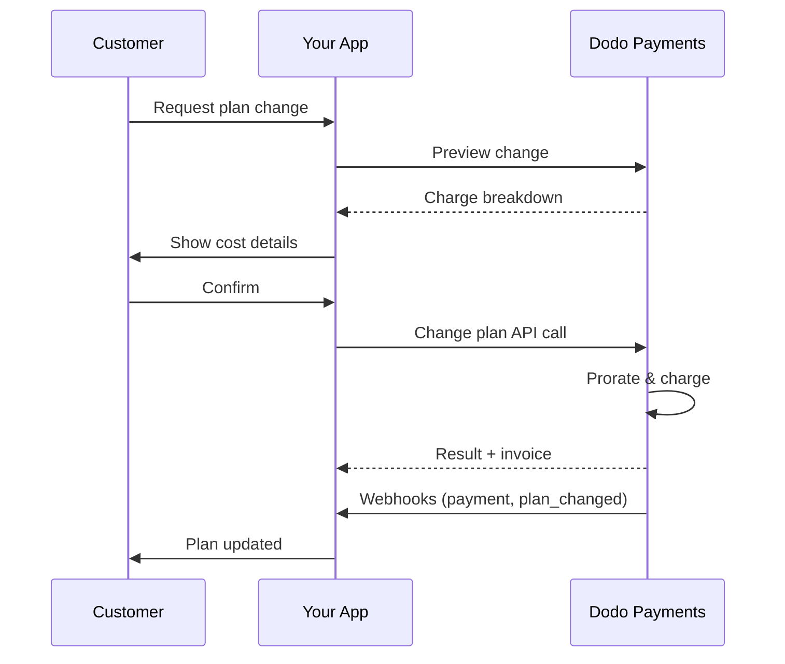
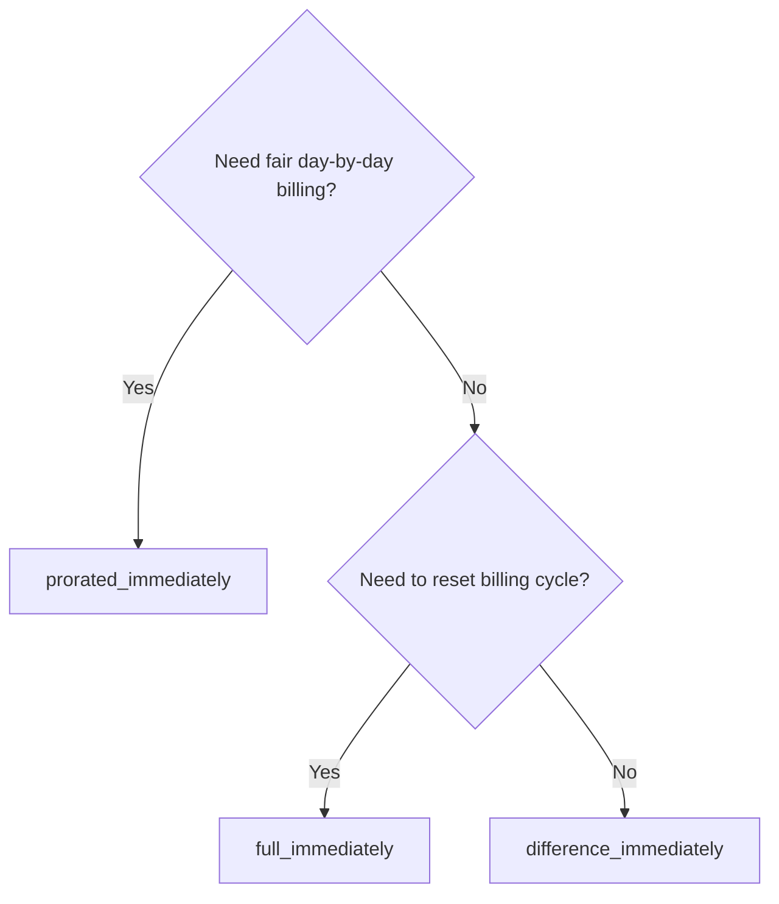
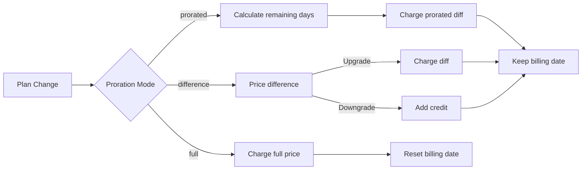

<CardGroup cols={3}>
<Card title="변경 계획 API" icon="code" href="/api-reference/subscriptions/change-plan">
  구독 업데이트를 위한 전체 API 문서입니다.
</Card>
<Card title="계획 변경 미리보기" icon="eye" href="/api-reference/subscriptions/preview-change-plan">
  계획을 변경하기 전에 요금액을 확인하세요.
</Card>
<Card title="통합 가이드" icon="book" href="/developer-resources/subscription-integration-guide">
  단계별 구독 설정.
</Card>
</CardGroup>

## 구독 업그레이드 또는 다운그레이드란 무엇인가요?

계획을 변경하면 고객을 구독 계층 또는 수량 간에 이동시킬 수 있습니다. 이를 사용하여:
- 사용량 또는 기능에 따라 가격을 조정
- 월간에서 연간으로 전환 (또는 그 반대)
- 좌석 기반 제품의 수량 조정

<Info>
계획 변경은 선택한 비례 모드에 따라 즉각적인 요금을 발생시킬 수 있습니다.
</Info>

## 계획 변경을 언제 사용해야 하나요?

- 고객이 더 많은 기능, 사용량 또는 좌석이 필요할 때 업그레이드
- 사용량이 감소할 때 다운그레이드
- 구독을 취소하지 않고 새 제품이나 가격으로 사용자 이전

## 계획 변경 흐름



## 전제 조건

구독 계획 변경을 구현하기 전에 다음을 확인하세요:

- 활성 구독 제품이 있는 Dodo Payments 상인 계정
- 대시보드에서 API 자격 증명 (API 키 및 웹훅 비밀 키)
- 수정할 기존 활성 구독
- 구독 이벤트를 처리할 웹훅 엔드포인트 구성

<Info>
자세한 설정 지침은 [통합 가이드](/developer-resources/integration-guide#dashboard-setup)를 참조하세요.
</Info>

## 단계별 구현 가이드

애플리케이션에서 구독 계획 변경을 구현하기 위한 포괄적인 가이드를 따르세요:

<Steps>
<Step title="플랜 변경 요구 사항 이해하기">
구현하기 전에 다음을 결정하세요:
- 어떤 구독 제품을 어떤 다른 제품으로 변경할 수 있는지
- 어떤 비례 배분 모드가 비즈니스 모델에 적합한지
- 실패한 플랜 변경을 어떻게 우아하게 처리할 것인지
- 상태 관리를 위해 어떤 웹훅 이벤트를 추적할 것인지

<Tip>
생산 환경에 구현하기 전에 테스트 모드에서 플랜 변경을 철저히 테스트하세요.
</Tip>
</Step>

<Step title="비례 배분 전략 선택하기">
비즈니스 요구에 맞는 청구 방식을 선택하세요:

<Tabs>
<Tab title="prorated_immediately">
최고의 경우: 사용하지 않은 시간에 대해 공정하게 요금을 부과하고자 하는 SaaS 애플리케이션
- 남은 주기 시간에 따라 정확한 비례 배분 금액을 계산
- 주기 내 남은 사용하지 않은 시간에 따라 비례 배분 금액을 부과
- 고객에게 투명한 청구 제공
</Tab>

<Tab title="difference_immediately">
최고의 경우: 명확한 업그레이드/다운그레이드 시나리오
- 업그레이드: 즉각적인 차액 부과 (예: $30→$80 = $50 부과)
- 다운그레이드: 향후 갱신을 위한 남은 가치 크레딧
- 청구 로직 및 고객 커뮤니케이션 단순화
</Tab>

<Tab title="full_immediately">
최고의 경우: 청구 주기를 재설정하고자 할 때
- 새로운 플랜의 전체 금액을 즉시 부과
- 이전 플랜의 남은 시간을 무시
- 연간에서 월간으로 전환할 때 유용
</Tab>
</Tabs>
</Step>

<Step title="변경 플랜 API 구현하기">
변경 플랜 API를 사용하여 구독 세부정보를 수정하세요:

<ParamField path="subscription_id" type="string" required>
수정할 활성 구독의 ID입니다.
</ParamField>

<ParamField path="product_id" type="string" required>
구독을 변경할 새로운 제품 ID입니다.
</ParamField>

<ParamField path="quantity" type="integer" default="1">
새로운 플랜의 단위 수 (좌석 기반 제품의 경우).
</ParamField>

<ParamField path="proration_billing_mode" type="string" required>
즉각적인 청구를 처리하는 방법: `prorated_immediately`, `full_immediately` 또는 `difference_immediately`.
</ParamField>

<ParamField path="addons" type="array">
새 계획에 대한 선택적 애드온. 이 항목을 비워두면 기존 애드온이 제거됩니다.
</ParamField>

<ParamField path="on_payment_failure" type="string">
계획 변경 결제 실패 시 동작을 제어합니다:
- `prevent_change`: 결제가 성공할 때까지 현재 계획에 구독 유지
- `apply_change` (기본값): 결제 결과와 관계없이 즉시 계획 변경 적용
</ParamField>

지정하지 않으면 비즈니스 수준 기본 설정을 사용합니다.
</ParamField>
</Step>

<Step title="웹훅 이벤트 처리">
계획 변경 결과를 추적하기 위해 웹훅 처리를 설정하세요:

- `subscription.active`: 계획 변경 성공, 구독 업데이트됨
- `subscription.plan_changed`: 구독 계획 변경됨 (업그레이드/다운그레이드/애드온 업데이트)
- `subscription.on_hold`: 계획 변경 요금이 실패하여 구독이 일시 중지됨
- `payment.succeeded`: 계획 변경에 대한 즉각적인 요금 성공
- `payment.failed`: 즉각적인 요금 실패

<Warning>
웹훅 서명을 항상 확인하고 idempotent 이벤트 처리를 구현하세요.
</Warning>
</Step>

<Step title="응용 프로그램 상태 업데이트">
웹훅 이벤트를 기반으로 응용 프로그램을 업데이트하세요:
- 새로운 계획에 따라 기능 부여/회수
- 고객 대시보드를 새로운 계획 세부정보로 업데이트
- 계획 변경에 대한 확인 이메일 전송
- 감사 목적으로 청구 변경 기록
</Step>

<Step title="테스트 및 모니터링">
구현 사항을 철저히 테스트하세요:
- 다양한 시나리오에서 모든 비례 모드를 테스트하세요
- 웹훅 처리가 제대로 작동하는지 확인하세요
- 계획 변경 성공률 모니터링
- 실패한 계획 변경에 대한 경고 설정

<Check>
귀하의 구독 계획 변경 구현은 이제 생산 사용을 위해 준비되었습니다.
</Check>
</Step>
</Steps>

## 계획 변경 미리보기

계획 변경을 확정하기 전에 Preview API를 사용하여 고객에게 정확히 청구될 금액을 보여주세요:

<Tabs>
<Tab title="Node.js SDK">

```javascript
const preview = await client.subscriptions.previewChangePlan('sub_123', {
  product_id: 'prod_pro',
  quantity: 1,
  proration_billing_mode: 'prorated_immediately'
});

// Show customer the charge before confirming
console.log('Immediate charge:', preview.immediate_charge.summary);
console.log('New plan details:', preview.new_plan);
```

</Tab>

<Tab title="Python SDK">

```python
preview = client.subscriptions.preview_change_plan(
    subscription_id="sub_123",
    product_id="prod_pro",
    quantity=1,
    proration_billing_mode="prorated_immediately"
)

# Show customer the charge before confirming
print("Immediate charge:", preview.immediate_charge.summary)
print("New plan details:", preview.new_plan)
```

</Tab>
</Tabs>

<Tip>
Preview API를 사용하여 고객이 계획 변경을 확인하기 전에 정확한 요금액을 보여주는 확인 대화를 구축하세요.
</Tip>

## 변경 계획 API

활성 구독의 제품, 수량 및 비례 동작을 수정하려면 변경 계획 API를 사용하세요.

### 빠른 시작 예제

<Tabs>
  <Tab title="Node.js SDK">

    ```javascript
    import DodoPayments from 'dodopayments';

    const client = new DodoPayments({
      bearerToken: process.env.DODO_PAYMENTS_API_KEY,
      environment: 'test_mode', // defaults to 'live_mode'
    });

    async function changePlan() {
      const result = await client.subscriptions.changePlan('sub_123', {
        product_id: 'prod_new',
        quantity: 3,
        proration_billing_mode: 'prorated_immediately',
        on_payment_failure: 'prevent_change', // Optional: control behavior on payment failure
      });
      console.log(result.status, result.invoice_id, result.payment_id);
    }

    changePlan();
    ```

  </Tab>
  <Tab title="Python SDK">

    ```python
    import os
    from dodopayments import DodoPayments

    client = DodoPayments(
        bearer_token=os.environ.get("DODO_PAYMENTS_API_KEY"),
        environment="test_mode",  # defaults to "live_mode"
    )

    result = client.subscriptions.change_plan(
        subscription_id="sub_123",
        product_id="prod_new",
        quantity=3,
        proration_billing_mode="prorated_immediately",
        on_payment_failure="prevent_change",  # Optional: control behavior on payment failure
    )
    print(result.status, result.get("invoice_id"), result.get("payment_id"))
    ```

  </Tab>
  <Tab title="Go SDK">

    ```go
    package main

    import (
      "context"
      "fmt"
      "github.com/dodopayments/dodopayments-go"
      "github.com/dodopayments/dodopayments-go/option"
    )

    func main() {
      client := dodopayments.NewClient(option.WithBearerToken("YOUR_TOKEN"))
      res, err := client.Subscriptions.ChangePlan(context.TODO(), dodopayments.SubscriptionChangePlanParams{
        SubscriptionID: dodopayments.F("sub_123"),
        ProductID:             dodopayments.F("prod_new"),
        Quantity:              dodopayments.F(int64(3)),
        ProrationBillingMode:  dodopayments.F(dodopayments.SubscriptionChangePlanParamsProrationBillingModeProratedImmediately),
        OnPaymentFailure:      dodopayments.F(dodopayments.OnPaymentFailurePreventChange), // Optional
      })
      if err != nil { panic(err) }
      fmt.Println(res.Status, res.InvoiceID, res.PaymentID)
    }
    ```

  </Tab>
  <Tab title="HTTP">

    ```bash
    curl -X POST "$DODO_API_BASE/subscriptions/sub_123/change-plan" \
      -H "Authorization: Bearer $DODO_PAYMENTS_API_KEY" \
      -H "Content-Type: application/json" \
      -d '{
        "product_id": "prod_new",
        "quantity": 3,
        "proration_billing_mode": "prorated_immediately",
        "on_payment_failure": "prevent_change"
      }'
    ```

  </Tab>
</Tabs>

```json Success
{
  "status": "processing",
  "subscription_id": "sub_123",
  "invoice_id": "inv_789",
  "payment_id": "pay_456",
  "proration_billing_mode": "prorated_immediately"
}
```

<Note>
<code>invoice_id</code>와 <code>payment_id</code>와 같은 필드는 계획 변경 중 즉각적인 요금 및/또는 인보이스가 생성될 때만 반환됩니다. 항상 웹훅 이벤트(<code>payment.succeeded</code>, <code>subscription.plan_changed</code>)에 의존하여 결과를 확인하세요.
</Note>

<Warning>
즉각적인 요금이 실패하면 구독이 `subscription.on_hold`로 이동할 수 있습니다. 결제가 성공할 때까지.
</Warning>

## 애드온 관리

구독 계획을 변경할 때 애드온도 수정할 수 있습니다:

```javascript
// Add addons to the new plan
await client.subscriptions.changePlan('sub_123', {
  product_id: 'prod_new',
  quantity: 1,
  proration_billing_mode: 'difference_immediately',
  addons: [
    { addon_id: 'addon_123', quantity: 2 }
  ]
});

// Remove all existing addons
await client.subscriptions.changePlan('sub_123', {
  product_id: 'prod_new',
  quantity: 1,
  proration_billing_mode: 'difference_immediately',
  addons: [] // Empty array removes all existing addons
});
```

<Info>
애드온은 비례 계산에 포함되며 선택한 비례 모드에 따라 청구됩니다.
</Info>

## 비례 모드

계획을 변경할 때 고객에게 청구하는 방법을 선택하세요:

#### `prorated_immediately`
- 현재 사이클에서 부분 차액에 대해 요금을 부과합니다.
- 시험 중인 경우 즉시 요금을 부과하고 지금 새로운 계획으로 전환합니다.
- 다운그레이드: 향후 갱신에 적용될 비례 크레딧을 생성할 수 있습니다.

#### `full_immediately`
- 새로운 계획의 전체 금액을 즉시 청구합니다.
- 이전 계획의 남은 시간을 무시합니다.

<Info>
<code>difference_immediately</code>를 사용하여 생성된 크레딧은 구독 범위에 한정되며 <a href="/features/customer-credit">고객 크레딧</a>과는 구별됩니다. 동일한 구독의 향후 갱신에 자동으로 적용되며 구독 간에 이체할 수 없습니다.
</Info>

#### `difference_immediately`
- 업그레이드: 이전과 새로운 계획 간의 가격 차이에 대해 즉시 요금을 청구합니다.
- 다운그레이드: 잔여 가치를 구독에 내부 크레딧으로 추가하고 갱신 시 자동 적용합니다.

| 기능 | `prorated_immediately` | `difference_immediately` | `full_immediately` |
|---------|----------------------|------------------------|-------------------|
| **업그레이드 요금** | 남은 일수에 대한 비례 차액 | 계획 간의 전체 가격 차액 | 전체 새로운 계획 가격 |
| **다운그레이드 크레딧** | 남은 일수에 대한 비례 크레딧 | 크레딧으로서의 전체 가격 차액 | 크레딧 없음 |
| **청구 주기** | 변경되지 않음 | 변경되지 않음 | 오늘로 초기화 |
| **시험 행동** | 시험 종료, 즉시 요금 부과 | 시험 종료, 즉시 요금 부과 | 시험 종료, 전체 금액 청구 |
| **최고의 경우** | 공정한 시간 기반 청구 | 단순한 업그레이드/다운그레이드 수학 | 청구 주기 초기화 |
| **복잡성** | 중간 (일 계산) | 낮음 (단순한 뺄셈) | 낮음 (전체 청구)



### 예시 시나리오

이 정식 번호를 일관되게 사용하세요:
- 현재 계획: **기본** 월 **$30**
- 업그레이드 대상: **전문** 월 **$80**
- 다운그레이드 대상 (전문에서): **스타터** 월 **$20**
- 청구 주기: **30일**, **1월 1일** 시작
- 계획 변경은 **1월 16일**에 발생 (15일 남음, 15일 사용됨)

<AccordionGroup>
  <Accordion title="업그레이드: 기본 ($30) → 전문 ($80) 비례_즉시">

    ```
    Step 1: Calculate unused credit from current plan
      Unused days = 15 out of 30 days
      Credit = $30 × (15/30) = $15.00

    Step 2: Calculate prorated cost of new plan
      Remaining days = 15 out of 30 days
      New plan cost = $80 × (15/30) = $40.00

    Step 3: Calculate immediate charge
      Charge = New plan cost − Credit
      Charge = $40.00 − $15.00 = $25.00

    → Customer pays $25.00 now
    → Next renewal (Feb 1): $80.00/month
    ```

    ```javascript
    await client.subscriptions.changePlan('sub_123', {
      product_id: 'prod_pro',
      quantity: 1,
      proration_billing_mode: 'prorated_immediately'
    })
    ```

  </Accordion>

  <Accordion title="다운그레이드: 전문 ($80) → 스타터 ($20) 비례_즉시">

    ```
    Step 1: Calculate unused credit from current plan
      Unused days = 15 out of 30 days
      Credit = $80 × (15/30) = $40.00

    Step 2: Calculate prorated cost of new plan
      Remaining days = 15 out of 30 days
      New plan cost = $20 × (15/30) = $10.00

    Step 3: Calculate credit balance
      Credit = $40.00 − $10.00 = $30.00

    → No charge — $30.00 credit added to subscription
    → Credit auto-applies to future renewals
    → Next renewal (Feb 1): $20.00 − $30.00 credit = $0.00
    → Following renewal (Mar 1): $20.00 − $10.00 remaining credit = $10.00
    ```

    ```javascript
    await client.subscriptions.changePlan('sub_123', {
      product_id: 'prod_starter',
      quantity: 1,
      proration_billing_mode: 'prorated_immediately'
    })
    ```

  </Accordion>

  <Accordion title="업그레이드: 기본 ($30) → 전문 ($80) 차이_즉시">

    ```
    Immediate charge = New plan price − Old plan price
                     = $80 − $30
                     = $50.00

    → Customer pays $50.00 now (regardless of cycle position)
    → Next renewal (Feb 1): $80.00/month
    ```

    ```javascript
    await client.subscriptions.changePlan('sub_123', {
      product_id: 'prod_pro',
      quantity: 1,
      proration_billing_mode: 'difference_immediately'
    })
    ```

  </Accordion>

  <Accordion title="다운그레이드: 전문 ($80) → 스타터 ($20) 차이_즉시">

    ```
    Credit = Old plan price − New plan price
           = $80 − $20
           = $60.00

    → No charge — $60.00 credit added to subscription
    → Credit auto-applies to future renewals
    → Next renewal: $20.00 − $20.00 (from credit) = $0.00
    → Following renewal: $20.00 − $20.00 (from credit) = $0.00
    → Third renewal: $20.00 − $20.00 (from remaining credit) = $0.00
    ```

    ```javascript
    await client.subscriptions.changePlan('sub_123', {
      product_id: 'prod_starter',
      quantity: 1,
      proration_billing_mode: 'difference_immediately'
    })
    ```

  </Accordion>

  <Accordion title="업그레이드: 기본 ($30) → 전문 ($80) 전체_즉시">

    ```
    Immediate charge = Full new plan price = $80.00

    → Customer pays $80.00 now
    → No credit for unused time on old plan
    → Billing cycle resets to today (January 16)
    → Next renewal: February 16 at $80.00/month
    ```

    ```javascript
    await client.subscriptions.changePlan('sub_123', {
      product_id: 'prod_pro',
      quantity: 1,
      proration_billing_mode: 'full_immediately'
    })
    ```

  </Accordion>

  <Accordion title="중간 주기 업그레이드 및 애드온 사용 비례_즉시">

    ```
    Current: Basic plan ($30/month), no add-ons
    New: Pro plan ($80/month) + Extra Seats add-on ($10/seat × 3 seats = $30/month)
    Change on day 16 of 30 (15 days remaining)

    Step 1: Credit from current plan
      Credit = $30 × (15/30) = $15.00

    Step 2: Prorated cost of new plan + add-ons
      New plan = $80 × (15/30) = $40.00
      Add-ons = $30 × (15/30) = $15.00
      Total new = $55.00

    Step 3: Immediate charge
      Charge = $55.00 − $15.00 = $40.00

    → Customer pays $40.00 now
    → Next renewal: $80.00 + $30.00 = $110.00/month
    ```

    ```javascript
    await client.subscriptions.changePlan('sub_123', {
      product_id: 'prod_pro',
      quantity: 1,
      proration_billing_mode: 'prorated_immediately',
      addons: [
        { addon_id: 'addon_seats', quantity: 3 }
      ]
    })
    ```

  </Accordion>
</AccordionGroup>

### 각 모드의 청구 처리 방법



<Tip>
공정한 시간 회계를 위해 `prorated_immediately`를 선택하고; 청구를 재설정하려면 `full_immediately`을 선택하며; 간단한 업그레이드와 다운그레이드 시 자동 크레딧을 위해 `difference_immediately`를 사용하세요.
</Tip>

## 결제 실패 처리

계획 변경 결제가 실패할 때 발생하는 상황을 `on_payment_failure` 매개변수를 사용하여 제어할 수 있습니다.

### 결제 실패 모드

<Tabs>
<Tab title="prevent_change (중요한 업그레이드에 권장)">
**동작**: 결제가 성공할 때까지 구독을 현재 계획에 유지합니다.

- 계획 변경이 "대기 중"으로 표시됨
- 고객이 현재 계획에 대한 액세스를 유지함
- 구독은 성공적인 결제 후에만 `active` 상태로 이동함
- 업그레이드 기능을 부여하기 전에 결제를 보장하고 싶을 때 유용함

```javascript
await client.subscriptions.changePlan('sub_123', {
  product_id: 'prod_pro',
  quantity: 1,
  proration_billing_mode: 'prorated_immediately',
  on_payment_failure: 'prevent_change'
});
```

</Tab>

<Tab title="apply_change (기본값)">
**동작**: 결제 결과와 관계없이 즉시 계획 변경을 적용합니다.

- 결제 실패 시에도 계획 변경이 적용됨
- 고객은 새로운 계획에 즉시 액세스
- 결제가 실패하면 구독이 `on_hold`로 이동할 수 있음
- 중요한 업그레이드가 아닐 때나 고객을 신뢰할 때에 좋음

```javascript
await client.subscriptions.changePlan('sub_123', {
  product_id: 'prod_pro',
  quantity: 1,
  proration_billing_mode: 'prorated_immediately',
  on_payment_failure: 'apply_change' // This is the default
});
```

</Tab>
</Tabs>

<Info>
지정하지 않으면 `on_payment_failure` 매개변수는 대시보드에 구성된 비즈니스 수준의 기본 설정을 사용합니다.
</Info>

### 각 모드를 사용해야 하는 경우

| 시나리오 | 권장 모드 | 이유 |
|----------|------------------|--------|
| 프리미엄 기능으로 업그레이드 | `prevent_change` | 액세스를 부여하기 전에 결제를 보장 |
| 수량 증가 (더 많은 좌석) | `prevent_change` | 결제 없이 사용을 방지 |
| 계획 다운그레이드 | `apply_change` | 고객이 지출을 줄이기 때문 |
| 신뢰할 수 있는 기업 고객 | `apply_change` | 미수금 위험이 낮음 |
| 시험에서 유료 전환 | `prevent_change` | 중요한 결제 시점 |

## 웹훅 처리

웹훅을 통해 구독 상태를 추적하여 계획 변경 및 결제를 확인하세요.

### 처리할 이벤트 유형
- `subscription.active`: 구독 활성화됨
- `subscription.plan_changed`: 구독 계획 변경됨 (업그레이드/다운그레이드/애드온 변경)
- `subscription.on_hold`: 요금 실패, 구독 일시 중지됨
- `subscription.renewed`: 갱신 성공
- `payment.succeeded`: 계획 변경 또는 갱신에 대한 결제 성공
- `payment.failed`: 결제 실패

<Info>
비즈니스 로직을 구독 이벤트에서 유도하고 결제 이벤트를 확인 및 조정 용도로 사용하는 것이 좋습니다.
</Info>

### 서명 확인 및 의도 처리

<Tabs>
  <Tab title="Next.js 라우트 핸들러">

    ```javascript
    import { NextRequest, NextResponse } from 'next/server';
    
    export async function POST(req) {
      const webhookId = req.headers.get('webhook-id');
      const webhookSignature = req.headers.get('webhook-signature');
      const webhookTimestamp = req.headers.get('webhook-timestamp');
      const secret = process.env.DODO_WEBHOOK_SECRET;
    
      const payload = await req.text();
      // verifySignature is a placeholder – in production, use a Standard Webhooks library
      const { valid, event } = await verifySignature(
        payload,
        { id: webhookId, signature: webhookSignature, timestamp: webhookTimestamp },
        secret
      );
      if (!valid) return NextResponse.json({ error: 'Invalid signature' }, { status: 400 });
    
      switch (event.type) {
        case 'subscription.active':
          // mark subscription active in your DB
          break;
        case 'subscription.plan_changed':
          // refresh entitlements and reflect the new plan in your UI
          break;
        case 'subscription.on_hold':
          // notify user to update payment method
          break;
        case 'subscription.renewed':
          // extend access window
          break;
        case 'payment.succeeded':
          // reconcile payment for plan change
          break;
        case 'payment.failed':
          // log and alert
          break;
        default:
          // ignore unknown events
          break;
      }
    
      return NextResponse.json({ received: true });
    }
    ```

  </Tab>
  <Tab title="Express.js">

    ```javascript
    import express from 'express';
    
    const app = express();
    app.post('/webhooks/dodo', express.raw({ type: 'application/json' }), async (req, res) => {
      const webhookId = req.header('webhook-id');
      const webhookSignature = req.header('webhook-signature');
      const webhookTimestamp = req.header('webhook-timestamp');
      const secret = process.env.DODO_WEBHOOK_SECRET;
      const payload = req.body.toString('utf8');
    
      const { valid, event } = await verifySignature(
        payload,
        { id: webhookId, signature: webhookSignature, timestamp: webhookTimestamp },
        secret
      );
      if (!valid) return res.status(400).send('Invalid signature');
    
      // handle events like above
      res.json({ received: true });
    });
    
    app.listen(3000);
    ```

  </Tab>
</Tabs>

<Note>
자세한 페이로드 스키마는 <a href="/developer-resources/webhooks/intents/subscription">구독 웹훅 페이로드</a> 및 <a href="/developer-resources/webhooks/intents/payment">결제 웹훅 페이로드</a>를 참조하세요.
</Note>

## 모범 사례

신뢰할 수 있는 구독 계획 변경을 위한 권장 사항을 따르세요:

### 계획 변경 전략
- **철저히 테스트**: 프로덕션에 배포하기 전에 항상 테스트 모드에서 계획 변경을 테스트하세요
- **비례 조심스럽게 선택**: 비즈니스 모델에 맞는 비례 모드를 선택하세요
- **실패를 우아하게 처리**: 적절한 오류 처리 및 재시도 로직을 구현하세요
- **성공률 모니터링**: 계획 변경 성공/실패 비율을 추적하고 문제를 조사하세요

### 웹훅 구현
- **서명 검증**: 항상 웹훅 서명을 검증하여 신뢰성을 확보하세요
- **idempotency 구현**: 중복 웹훅 이벤트를 우아하게 처리하세요
- **비동기적으로 처리**: 무거운 작업으로 웹훅 응답을 차단하지 마세요
- **모든 것을 기록**: 디버깅 및 감사 용도로 상세한 로그를 유지하세요

### 사용자 경험
- **명확하게 소통**: 고객에게 청구 변경 사항 및 타이밍에 대해 알리세요
- **확인 제공**: 성공적인 계획 변경에 대한 이메일 확인서를 전송하세요
- **엣지 케이스 처리**: 시험 기간, 비례 및 결제 실패를 고려하세요
- **UI 즉시 업데이트**: 귀하의 응용 프로그램 인터페이스에서 계획 변경 사항을 반영하세요

## 일반적인 문제와 해결책

구독 계획 변경 중에 발생하는 전형적인 문제를 해결하세요:

<AccordionGroup>
<Accordion title="청구 생성되었지만 구독이 업데이트되지 않음">
**증상**: API 호출이 성공하지만 구독이 이전 계획으로 유지됨

**일반적인 원인**:
- 웹훅 처리 실패 또는 지연
- 웹훅 수신 후 응용 프로그램 상태가 업데이트되지 않음
- 상태 업데이트 중 데이터베이스 트랜잭션 문제

**해결 방법**:
- 재시도 로직을 갖춘 강력한 웹훅 처리를 구현하세요
- 상태 업데이트를 위해 idempotent 작업을 사용하세요
- 놓친 웹훅 이벤트를 감지하고 경고하도록 모니터링을 추가하세요
- 웹훅 엔드포인트가 확인 가능하고 제대로 응답하는지 확인하세요
</Accordion>

<Accordion title="다운그레이드 후 크레딧이 적용되지 않음">
**증상**: 고객이 다운그레이드했지만 크레딧 잔고를 보지 못함

**일반적인 원인**:
- 비례 모드 기대: 다운그레이드는 `difference_immediately`로 전체 계획 가격 차이를 크레딧으로 제공하고, `prorated_immediately`는 사이클의 남은 시간에 대해 비례 크레딧을 생성합니다.
- 크레딧은 구독별로 한정되며 구독 간에 이체되지 않음
- 고객 대시보드에서 크레딧 잔고를 보이지 않음

**해결 방법**:
- 자동 크레딧을 원할 경우 다운그레이드에 `difference_immediately`를 사용하세요
- 크레딧이 동일한 구독의 향후 갱신에 적용됨을 고객에게 설명하세요
- 크레딧 잔고를 보여주는 고객 포털을 구현하세요
- 다음 인보이스 미리보기에서 적용된 크레딧 확인하세요
</Accordion>

<Accordion title="웹훅 서명 검증 실패">
**증상**: 잘못된 서명으로 인해 웹훅 이벤트가 거부됨

**일반적인 원인**:
- 잘못된 웹훅 비밀키
- 서명 검증 전에 원본 요청 본문이 수정됨
- 잘못된 서명 검증 알고리즘

**해결 방법**:
- 대시보드에서 올바른 `DODO_WEBHOOK_SECRET`을(를) 사용하고 있는지 확인하세요
- JSON 파싱 미들웨어 전에 원본 요청 본문을 읽으세요
- 플랫폼의 표준 웹훅 검증 라이브러리를 사용하세요
- 개발 환경에서 웹훅 서명 검증 테스트하세요
</Accordion>

<Accordion title="계획 변경이 422 오류로 실패함">
**증상**: API가 422 처리할 수 없는 엔터티 오류를 반환함

**일반적인 원인**:
- 잘못된 구독 ID 또는 제품 ID
- 구독이 활성 상태가 아님
- 필수 매개변수가 누락됨
- 계획 변경에 사용할 수 없는 제품

**해결 방법**:
- 구독이 존재하고 활성 상태인지 확인하세요
- 제품 ID가 유효하고 사용 가능한지 확인하세요
- 모든 필수 매개변수가 제공되었는지 확인하세요
- 매개변수 요구 사항에 대한 API 문서를 검토하세요
</Accordion>

<Accordion title="계획 변경 중 즉각적인 청구 실패">
**증상**: 계획 변경이 시작되었으나 즉각적인 청구에 실패함

**일반적인 원인**:
- 고객의 결제 수단에 잔액이 부족함
- 결제 수단이 만료되었거나 잘못됨
- 은행이 거래를 거부함
- 사기 감지로 인해 청구가 차단됨

**해결 방법**:
- `payment.failed` 웹훅 이벤트를 적절하게 처리하세요
- 고객에게 결제 수단을 업데이트하라고 알리세요
- 일시적인 실패에 대한 재시도 로직을 구현하세요
- 즉각적인 청구가 실패했을 때 계획 변경을 허용하는 것을 고려하세요
</Accordion>

<Accordion title="계획 변경 후 구독 정지">
**증상**: 계획 변경 요금이 실패하고 구독이 `on_hold` 상태로 이동함

**무슨 일이 발생하나요**:
계획 변경 요금이 실패하면 구독은 자동으로 `on_hold` 상태에 배치됩니다. 결제 수단이 업데이트될 때까지 구독은 자동으로 갱신되지 않습니다.

**해결 방법**: 결제 수단을 업데이트하여 구독을 재활성화하세요

계획 변경 실패 후 `on_hold` 상태에서 구독을 재활성화하려면:

1. **결제 수단 업데이트**: 결제 수단 업데이트 API를 사용하세요
2. **자동 요금 생성**: API가 잔여 채무에 대한 요금을 자동 생성합니다.
3. **인보이스 생성**: 요금에 대한 인보이스가 생성됩니다.
4. **결제 처리**: 새 결제 수단을 사용하여 결제가 처리됩니다.
5. **재활성화**: 결제가 성공하면 구독이 `active` 상태로 재활성화됩니다.

<CodeGroup>

```javascript Node.js
// Reactivate subscription from on_hold after failed plan change
async function reactivateAfterFailedPlanChange(subscriptionId) {
  // Update payment method - automatically creates charge for remaining dues
  const response = await client.subscriptions.updatePaymentMethod(subscriptionId, {
    type: 'new',
    return_url: 'https://example.com/return'
  });
  
  if (response.payment_id) {
    console.log('Charge created for remaining dues:', response.payment_id);
    console.log('Payment link:', response.payment_link);
    
    // Redirect customer to payment_link to complete payment
    // Monitor webhooks for:
    // 1. payment.succeeded - charge succeeded
    // 2. subscription.active - subscription reactivated
  }
  
  return response;
}

// Or use existing payment method if available
async function reactivateWithExistingPaymentMethod(subscriptionId, paymentMethodId) {
  const response = await client.subscriptions.updatePaymentMethod(subscriptionId, {
    type: 'existing',
    payment_method_id: paymentMethodId
  });
  
  // Monitor webhooks for payment.succeeded and subscription.active
  return response;
}
```

```python Python
# Reactivate subscription from on_hold after failed plan change
def reactivate_after_failed_plan_change(subscription_id):
    # Update payment method - automatically creates charge for remaining dues
    response = client.subscriptions.update_payment_method(
        subscription_id=subscription_id,
        type="new",
        return_url="https://example.com/return"
    )
    
    if response.payment_id:
        print("Charge created for remaining dues:", response.payment_id)
        print("Payment link:", response.payment_link)
        
        # Redirect customer to payment_link to complete payment
        # Monitor webhooks for:
        # 1. payment.succeeded - charge succeeded
        # 2. subscription.active - subscription reactivated
    
    return response

# Or use existing payment method if available
def reactivate_with_existing_payment_method(subscription_id, payment_method_id):
    response = client.subscriptions.update_payment_method(
        subscription_id=subscription_id,
        type="existing",
        payment_method_id=payment_method_id
    )
    
    # Monitor webhooks for payment.succeeded and subscription.active
    return response
```

</CodeGroup>

**모니터링할 웹훅 이벤트**:
- `subscription.on_hold`: 구독이 일시 중지됨 (계획 변경 요금 실패 시 수신됨)
- `payment.succeeded`: 남은 채무에 대한 결제가 성공함 (결제 수단을 업데이트한 후)
- `subscription.active`: 결제가 성공적으로 이루어진 후 구독이 재활성화됨

**모범 사례**:
- 계획 변경 요금이 실패할 때 고객에게 즉시 알리세요
- 결제 수단을 업데이트하는 방법에 대한 명확한 지침을 제공하세요
- 재활성화 상태를 추적하기 위해 웹훅 이벤트를 모니터링하세요
- 일시적인 결제 실패를 위한 자동 재시도 로직 구현을 고려하세요

<Card title="결제 수단 업데이트 API 참조" icon="code" href="/api-reference/subscriptions/update-payment-method">
결제 수단 업데이트 및 구독 재활성화를 위한 전체 API 문서를 참조하세요.
</Card>
</Accordion>
</AccordionGroup>

## 구현 테스트

구독 계획 변경 구현을 철저하게 테스트하기 위해 다음 단계를 따르세요:

<Steps>
<Step title="테스트 환경 설정">
- 테스트 API 키 및 테스트 제품 사용
- 다양한 계획 유형으로 테스트 구독 생성
- 테스트 웹훅 엔드포인트 구성
- 모니터링 및 로깅 설정
</Step>

<Step title="다양한 비례 모드 테스트">
- 다양한 청구 주기에서 `prorated_immediately` 테스트
- 업그레이드 및 다운그레이드를 위해 `difference_immediately` 테스트
- 청구 주기를 재설정하기 위해 `full_immediately` 테스트
- 크레딧 계산이 올바른지 확인
</Step>

<Step title="웹훅 처리 테스트">
- 관련된 모든 웹훅 이벤트가 수신되었는지 확인하세요
- 웹훅 서명 검증 테스트
- 중복 웹훅 이벤트를 우아하게 처리하세요
- 웹훅 처리 실패 시나리오 테스트
</Step>

<Step title="오류 시나리오 테스트">
- 잘못된 구독 ID로 테스트
- 만료된 결제 수단으로 테스트
- 네트워크 실패 및 타임아웃 테스트
- 잔액 부족으로 테스트
</Step>

<Step title="운영에서 모니터링">
- 실패한 계획 변경에 대한 경고 설정
- 웹훅 처리 시간 모니터링
- 계획 변경 성공률 추적
- 계획 변경 문제에 대한 고객 지원 티켓 검토
</Step>
</Steps>

## 오류 처리

구현에서 일반적인 API 오류를 우아하게 처리하세요:

### HTTP 상태 코드

<AccordionGroup>
<Accordion title="200 OK">
계획 변경 요청이 성공적으로 처리되었습니다. 구독이 업데이트되고 결제 처리가 시작되었습니다.
</Accordion>

<Accordion title="400 잘못된 요청">
잘못된 요청 매개변수. 모든 필수 필드가 제공되고 적절히 형식화되었는지 확인하세요.
</Accordion>

<Accordion title="401 인증되지 않음">
잘못된 또는 누락된 API 키. `DODO_PAYMENTS_API_KEY`이(가) 올바른지 및 적절한 권한이 부여되었는지 확인하세요.
</Accordion>

<Accordion title="404 찾을 수 없음">
구독 ID가 없거나 귀하의 계정에 속하지 않습니다.
</Accordion>

<Accordion title="422 처리할 수 없는 엔터티">
구독을 변경할 수 없습니다 (예: 이미 취소되었거나, 사용할 수 없는 제품 등).
</Accordion>

<Accordion title="500 내부 서버 오류">
서버 오류가 발생했습니다. 잠시 후 요청을 재시도하세요.
</Accordion>
</AccordionGroup>

### 오류 응답 형식

```json
{
  "error": {
    "code": "subscription_not_found",
    "message": "The subscription with ID 'sub_123' was not found",
    "details": {
      "subscription_id": "sub_123"
    }
  }
}
```

## 다음 단계

- <a href="/api-reference/subscriptions/change-plan">계획 변경 API</a> 검토
- <a href="/features/customer-credit">고객 크레딧</a> 탐색
- `subscription.on_hold`에 대한 경고 구현
- <a href="/developer-resources/webhooks">웹훅 통합 가이드</a> 확인
