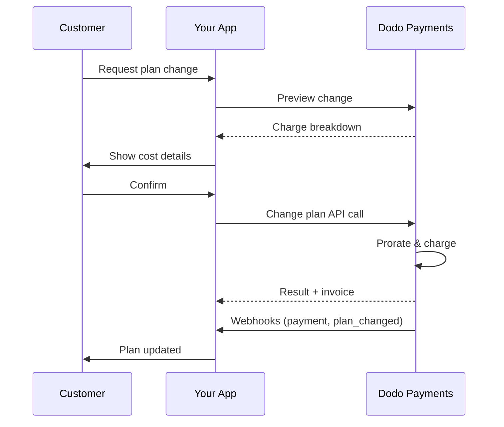
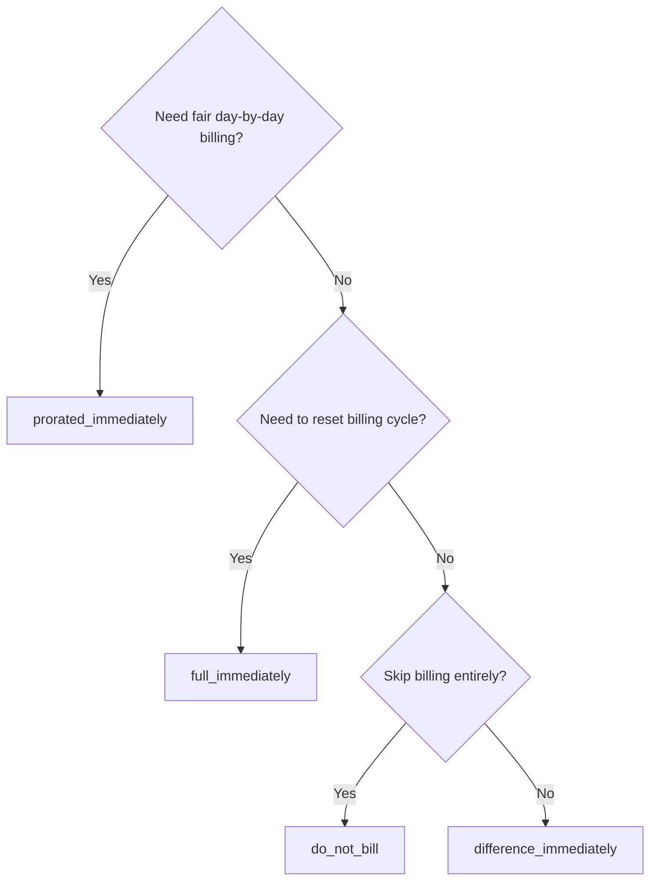
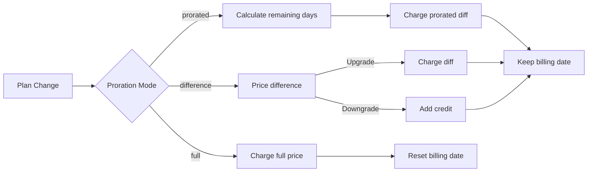

<CardGroup cols={3}>
<Card title="Change Plan API" icon="code" href="/api-reference/subscriptions/change-plan">
  Full API docs for updating subscriptions.
</Card>
<Card title="Plan Change Preview" icon="eye" href="/api-reference/subscriptions/preview-change-plan">
  See charge amounts before changing plans.
</Card>
<Card title="Integration Guide" icon="book" href="/developer-resources/subscription-integration-guide">
  Step-by-step subscription setup.
</Card>
</CardGroup>

## What is a subscription upgrade or downgrade?

Changing plans lets you move a customer between subscription tiers or quantities. Use it to:
- Align pricing with usage or features
- Move from monthly to annual (or vice versa)
- Adjust quantity for seat-based products

<Info>
Plan changes can trigger an immediate charge depending on the proration mode you choose.
</Info>

## When to use plan changes

- Upgrade when a customer needs more features, usage, or seats
- Downgrade when usage decreases
- Migrate users to a new product or price without cancelling their subscription

## Plan Change Flow



## Prerequisites

Before implementing subscription plan changes, ensure you have:

- A Dodo Payments merchant account with active subscription products
- API credentials (API key and webhook secret key) from the dashboard
- An existing active subscription to modify
- Webhook endpoint configured to handle subscription events

<Info>
For detailed setup instructions, see our [Integration Guide](/developer-resources/integration-guide#dashboard-setup).
</Info>

## Step-by-Step Implementation Guide

Follow this comprehensive guide to implement subscription plan changes in your application:

<Steps>
<Step title="Understand Plan Change Requirements">
Before implementing, determine:
- Which subscription products can be changed to which others
- What proration mode fits your business model
- How to handle failed plan changes gracefully
- Which webhook events to track for state management

<Tip>
Test plan changes thoroughly in test mode before implementing in production.
</Tip>
</Step>

<Step title="Choose Your Proration Strategy">
Select the billing approach that aligns with your business needs:

<Tabs>
<Tab title="prorated_immediately">
Best for: SaaS applications wanting to charge fairly for unused time
- Calculates exact prorated amount based on remaining cycle time
- Charges a prorated amount based on unused time remaining in the cycle
- Provides transparent billing to customers
</Tab>

<Tab title="difference_immediately">
Best for: Clear upgrade/downgrade scenarios
- Upgrade: Charge immediate difference (e.g., $30→$80 = charge $50)
- Downgrade: Credit remaining value for future renewals
- Simplifies billing logic and customer communication
</Tab>

<Tab title="full_immediately">
Best for: When you want to reset the billing cycle
- Charges full amount of new plan immediately
- Ignores remaining time from old plan
- Useful for annual to monthly transitions
</Tab>

<Tab title="do_not_bill">
Best for: Free migrations, courtesy switches, or absorbing cost differences
- No charges or credits calculated
- Customer moves to the new plan immediately without any billing adjustment
- Billing cycle remains unchanged
</Tab>
</Tabs>
</Step>

<Step title="Implement the Change Plan API">
Use the Change Plan API to modify subscription details:

<ParamField path="subscription_id" type="string" required>
The ID of the active subscription to modify.
</ParamField>

<ParamField path="product_id" type="string" required>
The new product ID to change the subscription to.
</ParamField>

<ParamField path="quantity" type="integer" default="1">
Number of units for the new plan (for seat-based products).
</ParamField>

<ParamField path="proration_billing_mode" type="string" required>
How to handle immediate billing: `prorated_immediately`, `full_immediately`, `difference_immediately`, or `do_not_bill`.
</ParamField>

<ParamField path="addons" type="array">
Optional addons for the new plan. Leaving this empty removes any existing addons.
</ParamField>

<ParamField path="on_payment_failure" type="string">
Controls behavior when the plan change payment fails:
- `prevent_change`: Keep subscription on current plan until payment succeeds
- `apply_change` (default): Apply plan change immediately regardless of payment outcome

If not specified, uses the business-level default setting.
</ParamField>

<ParamField path="discount_codes" type="array">
새로운 플랜에 적용할 선택적 **중첩** 할인 코드(최대 20개, 배열 순서대로 적용). 전달하는 내용에 따른 동작:

- **미제공 / `null`** — 새로운 제품에 적용 가능한 경우 기존 할인은 `preserve_on_plan_change=true`와 함께 유지됩니다.
- **`[]` (빈 배열)** — 구독에서 모든 기존 할인을 제거합니다.
- **`["CODE_A", "CODE_B", ...]`** — 기존 할인을 이 중첩 세트로 교체합니다.
</ParamField>

<ParamField path="discount_code" type="string" deprecated>
**사용 중단됨** — 새로운 통합에 `discount_codes` 사용 권장. 이 필드는 하위 호환성을 위해 여전히 작동하지만, 같은 요청에서 `discount_codes`와 결합할 수 없습니다.
</ParamField>

<ParamField path="effective_at" type="string" default="immediately">
플랜 변경을 적용할 시기:
- `immediately` (기본값): 즉시 플랜 변경 적용
- `next_billing_date`: 다음 청구 날짜에 변경 예약. 고객은 청구 기간이 끝날 때까지 현재 플랜을 유지합니다.

다운그레이드의 경우 `next_billing_date`를 사용하여 고객이 청구 기간이 끝날 때까지 현재 플랜 혜택을 유지하도록 합니다.
</ParamField>
</Step>

<Step title="Handle Webhook Events">
플랜 변경 결과를 추적하기 위한 웹훅 처리 설정:

- `subscription.active`: 플랜 변경 성공, 구독 업데이트됨
- `subscription.plan_changed`: 구독 플랜 변경 (업그레이드/다운그레이드/애드온 업데이트)
- `subscription.on_hold`: 플랜 변경 요금 실패, 구독이 일시 중지됨
- `payment.succeeded`: 플랜 변경의 즉시 요금 성공
- `payment.failed`: 즉시 요금 실패

<Warning>
항상 웹훅 서명을 확인하고 불변 이벤트 처리를 구현하십시오.
</Warning>
</Step>

<Step title="Update Your Application State">
웹훅 이벤트에 기반하여 애플리케이션 업데이트:
- 새 플랜에 따라 기능 부여/취소
- 새 플랜 세부 정보로 고객 대시보드 업데이트
- 플랜 변경 확인 이메일 발송
- 감사 목적을 위한 청구 변경 로그
</Step>

<Step title="Test and Monitor">
구현을 철저히 테스트하십시오:
- 다양한 시나리오로 모든 비례 모드 테스트
- 웹훅 처리가 올바르게 작동하는지 확인
- 플랜 변경 성공률 모니터링
- 실패한 플랜 변경에 대한 알림 설정

<Check>
이제 구독 플랜 변경 구현이 프로덕션에서 사용될 준비가 되었습니다.
</Check>
</Step>
</Steps>

## 플랜 변경 미리보기

플랜 변경을 확정하기 전에 Preview API를 사용하여 고객에게 정확히 청구될 금액을 보여주십시오:

<Tabs>
<Tab title="Node.js SDK">

```javascript
const preview = await client.subscriptions.previewChangePlan('sub_123', {
  product_id: 'prod_pro',
  quantity: 1,
  proration_billing_mode: 'prorated_immediately'
});

// Show customer the charge before confirming
console.log('Immediate charge:', preview.immediate_charge.summary);
console.log('New plan details:', preview.new_plan);
```

</Tab>

<Tab title="Python SDK">

```python
preview = client.subscriptions.preview_change_plan(
    subscription_id="sub_123",
    product_id="prod_pro",
    quantity=1,
    proration_billing_mode="prorated_immediately"
)

# Show customer the charge before confirming
print("Immediate charge:", preview.immediate_charge.summary)
print("New plan details:", preview.new_plan)
```

</Tab>
</Tabs>

<Tip>
Preview API를 사용하여 고객이 플랜 변경을 확인하기 전 정확히 청구될 금액을 보여주는 확인 대화 상자를 만드십시오.
</Tip>

## 플랜 변경 API

Change Plan API를 사용하여 활성 구독의 제품, 수량 및 비례 동작을 수정하십시오.

### 빠른 시작 예제

<Tabs>
  <Tab title="Node.js SDK">

    ```javascript
    import DodoPayments from 'dodopayments';

    const client = new DodoPayments({
      bearerToken: process.env.DODO_PAYMENTS_API_KEY,
      environment: 'test_mode', // defaults to 'live_mode'
    });

    async function changePlan() {
      const result = await client.subscriptions.changePlan('sub_123', {
        product_id: 'prod_new',
        quantity: 3,
        proration_billing_mode: 'prorated_immediately',
        on_payment_failure: 'prevent_change', // Optional: control behavior on payment failure
      });
      console.log(result.status, result.invoice_id, result.payment_id);
    }

    changePlan();
    ```

  </Tab>
  <Tab title="Python SDK">

    ```python
    import os
    from dodopayments import DodoPayments

    client = DodoPayments(
        bearer_token=os.environ.get("DODO_PAYMENTS_API_KEY"),
        environment="test_mode",  # defaults to "live_mode"
    )

    result = client.subscriptions.change_plan(
        subscription_id="sub_123",
        product_id="prod_new",
        quantity=3,
        proration_billing_mode="prorated_immediately",
        on_payment_failure="prevent_change",  # Optional: control behavior on payment failure
    )
    print(result.status, result.get("invoice_id"), result.get("payment_id"))
    ```

  </Tab>
  <Tab title="Go SDK">

    ```go
    package main

    import (
      "context"
      "fmt"
      "github.com/dodopayments/dodopayments-go"
      "github.com/dodopayments/dodopayments-go/option"
    )

    func main() {
      client := dodopayments.NewClient(option.WithBearerToken("YOUR_TOKEN"))
      res, err := client.Subscriptions.ChangePlan(context.TODO(), dodopayments.SubscriptionChangePlanParams{
        SubscriptionID: dodopayments.F("sub_123"),
        ProductID:             dodopayments.F("prod_new"),
        Quantity:              dodopayments.F(int64(3)),
        ProrationBillingMode:  dodopayments.F(dodopayments.SubscriptionChangePlanParamsProrationBillingModeProratedImmediately),
        OnPaymentFailure:      dodopayments.F(dodopayments.OnPaymentFailurePreventChange), // Optional
      })
      if err != nil { panic(err) }
      fmt.Println(res.Status, res.InvoiceID, res.PaymentID)
    }
    ```

  </Tab>
  <Tab title="HTTP">

    ```bash
    curl -X POST "$DODO_API_BASE/subscriptions/sub_123/change-plan" \
      -H "Authorization: Bearer $DODO_PAYMENTS_API_KEY" \
      -H "Content-Type: application/json" \
      -d '{
        "product_id": "prod_new",
        "quantity": 3,
        "proration_billing_mode": "prorated_immediately",
        "on_payment_failure": "prevent_change"
      }'
    ```

  </Tab>
</Tabs>

```json Success
{
  "status": "processing",
  "subscription_id": "sub_123",
  "invoice_id": "inv_789",
  "payment_id": "pay_456",
  "proration_billing_mode": "prorated_immediately"
}
```

<Note>
<code>invoice_id</code> 및 <code>payment_id</code>와 같은 필드는 플랜 변경 중 즉시 요금 및/또는 인보이스가 생성될 때만 반환됩니다. 항상 결과를 확인하기 위해 웹훅 이벤트(예: <code>payment.succeeded</code>, <code>subscription.plan_changed</code>)를 신뢰하십시오.
</Note>

<Warning>
즉시 요금이 실패하면 구독은 `subscription.on_hold` 상태로 전환될 수 있습니다.
</Warning>

## Addons 관리

구독 플랜을 변경할 때 Addons도 수정할 수 있습니다:

```javascript
// Add addons to the new plan
await client.subscriptions.changePlan('sub_123', {
  product_id: 'prod_new',
  quantity: 1,
  proration_billing_mode: 'difference_immediately',
  addons: [
    { addon_id: 'addon_123', quantity: 2 }
  ]
});

// Remove all existing addons
await client.subscriptions.changePlan('sub_123', {
  product_id: 'prod_new',
  quantity: 1,
  proration_billing_mode: 'difference_immediately',
  addons: [] // Empty array removes all existing addons
});
```

<Info>
Addons는 비례 계산에 포함되며 선택한 비례 모드에 따라 청구됩니다.
</Info>

## 할인 코드 적용

구독 플랜 변경 시 하나 이상의 **중첩 할인 코드**를 적용할 수 있습니다 (최대 20개, 배열 순서대로 적용). 이는 업그레이드나 마이그레이션 시 프로모션 가격을 제공하는 데 유용합니다.

<Tabs>
<Tab title="Node.js SDK">

```javascript
// Apply stacked discount codes during plan change
await client.subscriptions.changePlan('sub_123', {
  product_id: 'prod_pro',
  quantity: 1,
  proration_billing_mode: 'prorated_immediately',
  discount_codes: ['UPGRADE20']
});
```

</Tab>
<Tab title="Python SDK">

```python
# Apply stacked discount codes during plan change
client.subscriptions.change_plan(
    subscription_id="sub_123",
    product_id="prod_pro",
    quantity=1,
    proration_billing_mode="prorated_immediately",
    discount_codes=["UPGRADE20"]
)
```

</Tab>
<Tab title="HTTP">

```bash
curl -X POST "$DODO_API_BASE/subscriptions/sub_123/change-plan" \
  -H "Authorization: Bearer $DODO_PAYMENTS_API_KEY" \
  -H "Content-Type: application/json" \
  -d '{
    "product_id": "prod_pro",
    "quantity": 1,
    "proration_billing_mode": "prorated_immediately",
    "discount_codes": ["UPGRADE20"]
  }'
```

</Tab>
</Tabs>

### 플랜 변경 시 할인 적용 동작

| `discount_codes` 값 | 동작 |
|------------------------|----------|
| 미제공 / `null` | 새로운 제품에 적용 가능한 경우 `preserve_on_plan_change=true`와 함께 기존 할인이 자동으로 유지됩니다. |
| `[]` (빈 배열) | **모든** 기존 할인이 구독에서 제거됩니다. |
| `["CODE_A", "CODE_B", ...]` | 이 중첩 세트로 기존 할인을 교체하고, 배열 순서대로 검증 및 적용됩니다. |

<Info>
이 엔드포인트의 단수 `discount_code` 필드는 **사용 중단됨**이지만 여전히 하위 호환성을 위해 작동합니다 — 기존 통합은 즉시 변경할 필요가 없습니다. 같은 요청에서 `discount_codes`와 결합할 수 없습니다. 편리할 때 배열 형식으로 마이그레이션하십시오.
</Info>

<Tip>
[Preview Plan Change API](/api-reference/subscriptions/preview-change-plan)를 `discount_codes`와 함께 사용하여 고객이 플랜 변경을 확인하기 전에 정확히 얼마나 절약할지 보여주십시오.
</Tip>

## 비례 모드

플랜 변경 시 고객 청구 방식을 선택하십시오:

#### `prorated_immediately`
- 현재 사이클의 부분 차액에 대해 청구
- 트라이얼 중인 경우 즉시 청구하고 새 플랜으로 전환
- 다운그레이드: 미래 갱신에 적용될 비례 크레딧 생성 가능

#### `full_immediately`
- 새 플랜의 전체 금액을 즉시 청구
- 이전 플랜의 남은 시간을 무시

<Info>
<code>difference_immediately</code>를 사용한 다운그레이드에서 생성된 크레딧은 구독 범위 내에서 정확히 사용되며 <a href="/features/credit-based-billing">Credit-Based Billing</a> 권한과는 별개입니다. 동일한 구독의 미래 갱신에 자동으로 적용되고 다른 구독 간에 양도될 수 없습니다.
</Info>

#### `difference_immediately`
- 업그레이드: 이전 플랜과 새 플랜 간의 가격 차이를 즉시 청구
- 다운그레이드: 남은 가치를 구독의 내부 크레딧으로 추가하고 갱신 시 자동 적용

#### `do_not_bill`
- 청구나 크레딧이 계산되지 않음
- 고객은 청구 조정 없이 즉시 새 플랜으로 전환
- 청구 주기는 변경되지 않음
- 무료 마이그레이션, 플랜 변경 시 또는 비용 차이를 흡수하는 데 적합

| 기능 | `prorated_immediately` | `difference_immediately` | `full_immediately` | `do_not_bill` |
|---------|----------------------|------------------------|-------------------|--------------|
| **업그레이드 요금** | 남은 날에 대한 비례 차액 | 플랜 간의 전체 금액 차이 | 새 플랜의 전체 금액 | 요금 없음 |
| **다운그레이드 크레딧** | 남은 날에 대한 비례 크레딧 | 전체 금액 차이로 크레딧 | 크레딧 없음 | 크레딧 없음 |
| **청구 주기** | 변경 없음 | 변경 없음 | 오늘로 재설정 | 변경 없음 |
| **트라이얼 동작** | 트라이얼 종료, 즉시 청구 | 트라이얼 종료, 즉시 청구 | 트라이얼 종료, 전체 금액 청구 | 트라이얼 종료, 요금 없음 |
| **최적 사용 사례** | 공정한 시간 기반 청구 | 간단한 업그레이드/다운그레이드 계산 | 청구 주기 재설정 | 무료 마이그레이션 또는 예우 제공 |
| **복잡성** | 중간 (일 계산) | 낮음 (간단한 뺄셈) | 낮음 (전체 청구) | 없음 |



### 예제 시나리오

이 표준 숫자를 일관되게 사용하십시오:
- 현재 플랜: **Basic** 월 **$30**
- 업그레이드 대상: **Pro** 월 **$80**
- 다운그레이드 대상 (Pro에서): **Starter** 월 **$20**
- 청구 주기: **30일**, **1월 1일** 시작
- 플랜 변경은 **1월 16일**에 발생 (15일 남음, 15일 사용)

<AccordionGroup>
  <Accordion title="Upgrade: Basic ($30) → Pro ($80) with prorated_immediately">

    ```
    Step 1: Calculate unused credit from current plan
      Unused days = 15 out of 30 days
      Credit = $30 × (15/30) = $15.00

    Step 2: Calculate prorated cost of new plan
      Remaining days = 15 out of 30 days
      New plan cost = $80 × (15/30) = $40.00

    Step 3: Calculate immediate charge
      Charge = New plan cost − Credit
      Charge = $40.00 − $15.00 = $25.00

    → Customer pays $25.00 now
    → Next renewal (Feb 1): $80.00/month
    ```

    ```javascript
    await client.subscriptions.changePlan('sub_123', {
      product_id: 'prod_pro',
      quantity: 1,
      proration_billing_mode: 'prorated_immediately'
    })
    ```

  </Accordion>

  <Accordion title="Downgrade: Pro ($80) → Starter ($20) with prorated_immediately">

    ```
    Step 1: Calculate unused credit from current plan
      Unused days = 15 out of 30 days
      Credit = $80 × (15/30) = $40.00

    Step 2: Calculate prorated cost of new plan
      Remaining days = 15 out of 30 days
      New plan cost = $20 × (15/30) = $10.00

    Step 3: Calculate credit balance
      Credit = $40.00 − $10.00 = $30.00

    → No charge — $30.00 credit added to subscription
    → Credit auto-applies to future renewals
    → Next renewal (Feb 1): $20.00 − $30.00 credit = $0.00
    → Following renewal (Mar 1): $20.00 − $10.00 remaining credit = $10.00
    ```

    ```javascript
    await client.subscriptions.changePlan('sub_123', {
      product_id: 'prod_starter',
      quantity: 1,
      proration_billing_mode: 'prorated_immediately'
    })
    ```

  </Accordion>

  <Accordion title="Upgrade: Basic ($30) → Pro ($80) with difference_immediately">

    ```
    Immediate charge = New plan price − Old plan price
                     = $80 − $30
                     = $50.00

    → Customer pays $50.00 now (regardless of cycle position)
    → Next renewal (Feb 1): $80.00/month
    ```

    ```javascript
    await client.subscriptions.changePlan('sub_123', {
      product_id: 'prod_pro',
      quantity: 1,
      proration_billing_mode: 'difference_immediately'
    })
    ```

  </Accordion>

  <Accordion title="Downgrade: Pro ($80) → Starter ($20) with difference_immediately">

    ```
    Credit = Old plan price − New plan price
           = $80 − $20
           = $60.00

    → No charge — $60.00 credit added to subscription
    → Credit auto-applies to future renewals
    → Next renewal: $20.00 − $20.00 (from credit) = $0.00
    → Following renewal: $20.00 − $20.00 (from credit) = $0.00
    → Third renewal: $20.00 − $20.00 (from remaining credit) = $0.00
    ```

    ```javascript
    await client.subscriptions.changePlan('sub_123', {
      product_id: 'prod_starter',
      quantity: 1,
      proration_billing_mode: 'difference_immediately'
    })
    ```

  </Accordion>

  <Accordion title="Upgrade: Basic ($30) → Pro ($80) with full_immediately">

    ```
    Immediate charge = Full new plan price = $80.00

    → Customer pays $80.00 now
    → No credit for unused time on old plan
    → Billing cycle resets to today (January 16)
    → Next renewal: February 16 at $80.00/month
    ```

    ```javascript
    await client.subscriptions.changePlan('sub_123', {
      product_id: 'prod_pro',
      quantity: 1,
      proration_billing_mode: 'full_immediately'
    })
    ```

  </Accordion>

  <Accordion title="Mid-cycle upgrade with add-ons using prorated_immediately">

    ```
    Current: Basic plan ($30/month), no add-ons
    New: Pro plan ($80/month) + Extra Seats add-on ($10/seat × 3 seats = $30/month)
    Change on day 16 of 30 (15 days remaining)

    Step 1: Credit from current plan
      Credit = $30 × (15/30) = $15.00

    Step 2: Prorated cost of new plan + add-ons
      New plan = $80 × (15/30) = $40.00
      Add-ons = $30 × (15/30) = $15.00
      Total new = $55.00

    Step 3: Immediate charge
      Charge = $55.00 − $15.00 = $40.00

    → Customer pays $40.00 now
    → Next renewal: $80.00 + $30.00 = $110.00/month
    ```

    ```javascript
    await client.subscriptions.changePlan('sub_123', {
      product_id: 'prod_pro',
      quantity: 1,
      proration_billing_mode: 'prorated_immediately',
      addons: [
        { addon_id: 'addon_seats', quantity: 3 }
      ]
    })
    ```

  </Accordion>
</AccordionGroup>

### 각 모드가 청구를 처리하는 방법



<Tip>
`prorated_immediately`를 공정한 시간 회계를 위해 선택하십시오; 청구를 재시작하려면 `full_immediately`를 선택하십시오; 간단한 업그레이드 및 자동 크레딧 다운그레이드를 위해 `difference_immediately`를 사용하십시오; 청구 조정 없이 플랜을 전환하려면 `do_not_bill`를 사용하십시오.
</Tip>

## 결제 실패 처리

플랜 변경 결제 실패 시 `on_payment_failure` 매개변수를 사용하여 결과를 제어합니다.

### 결제 실패 모드

<Tabs>
<Tab title="prevent_change (Recommended for critical upgrades)">
**동작**: 결제가 성공할 때까지 구독을 현재 플랜에 유지합니다.

- 플랜 변경은 "보류 중"으로 표시됩니다
- 고객은 현재 플랜에 대한 접근을 유지합니다
- 결제가 성공한 후에만 구독이 `active` 상태로 이동
- 업그레이드된 기능을 제공하기 전에 결제를 보장하고자 할 때 유용

```javascript
await client.subscriptions.changePlan('sub_123', {
  product_id: 'prod_pro',
  quantity: 1,
  proration_billing_mode: 'prorated_immediately',
  on_payment_failure: 'prevent_change'
});
```

</Tab>

<Tab title="apply_change (Default)">
**동작**: 결제 결과에 상관없이 즉시 플랜 변경을 적용합니다.

- 결제가 실패하더라도 플랜 변경은 적용됩니다
- 고객은 즉시 새 플랜에 대한 접근을 얻게 됩니다
- 결제가 실패하면 구독은 `on_hold`으로 이동할 수 있습니다
- 비중요한 업그레이드 또는 고객을 신뢰할 때 적합

```javascript
await client.subscriptions.changePlan('sub_123', {
  product_id: 'prod_pro',
  quantity: 1,
  proration_billing_mode: 'prorated_immediately',
  on_payment_failure: 'apply_change' // This is the default
});
```

</Tab>
</Tabs>

<Info>
명시되지 않은 경우, `on_payment_failure` 매개변수는 대시보드에서 구성된 비즈니스 수준 기본 설정을 사용합니다.
</Info>

### 각 모드를 사용할 시기

| 시나리오 | 권장 모드 | 이유 |
|----------|------------------|--------|
| 프리미엄 기능으로 업그레이드 | `prevent_change` | 기능을 제공하기 전에 결제 보장 |
| 수량 증가 (더 많은 좌석) | `prevent_change` | 결제 없이 사용 방지 |
| 플랜 다운그레이드 | `apply_change` | 고객이 지출을 줄임 |
| 신뢰할 수 있는 엔터프라이즈 고객 | `apply_change` | 미결제 위험 낮음 |
| 시도에서 유료 전환 | `prevent_change` | 중요한 결제 순간 |

## 웹훅 처리

웹훅을 통해 구독 상태를 추적하여 플랜 변경 및 결제를 확인합니다.

### 처리할 이벤트 유형
- `subscription.active`: 구독 활성화됨
- `subscription.plan_changed`: 구독 플랜 변경 (업그레이드/다운그레이드/애드온 변경)
- `subscription.on_hold`: 요금 실패, 구독 일시 중단
- `subscription.renewed`: 갱신 성공
- `payment.succeeded`: 플랜 변경 또는 갱신에 대한 결제 성공
- `payment.failed`: 결제 실패

<Info>
구독 이벤트에서 비즈니스 로직을 실행하고 결제 이벤트를 확인 및 조정에 사용하기를 권장합니다.
</Info>

### 서명 확인 및 의도 처리

<Tabs>
  <Tab title="Next.js Route Handler">

    ```javascript
    import { NextRequest, NextResponse } from 'next/server';
    
    export async function POST(req) {
      const webhookId = req.headers.get('webhook-id');
      const webhookSignature = req.headers.get('webhook-signature');
      const webhookTimestamp = req.headers.get('webhook-timestamp');
      const secret = process.env.DODO_WEBHOOK_SECRET;
    
      const payload = await req.text();
      // verifySignature is a placeholder – in production, use a Standard Webhooks library
      const { valid, event } = await verifySignature(
        payload,
        { id: webhookId, signature: webhookSignature, timestamp: webhookTimestamp },
        secret
      );
      if (!valid) return NextResponse.json({ error: 'Invalid signature' }, { status: 400 });
    
      switch (event.type) {
        case 'subscription.active':
          // mark subscription active in your DB
          break;
        case 'subscription.plan_changed':
          // refresh entitlements and reflect the new plan in your UI
          break;
        case 'subscription.on_hold':
          // notify user to update payment method
          break;
        case 'subscription.renewed':
          // extend access window
          break;
        case 'payment.succeeded':
          // reconcile payment for plan change
          break;
        case 'payment.failed':
          // log and alert
          break;
        default:
          // ignore unknown events
          break;
      }
    
      return NextResponse.json({ received: true });
    }
    ```

  </Tab>
  <Tab title="Express.js">

    ```javascript
    import express from 'express';
    
    const app = express();
    app.post('/webhooks/dodo', express.raw({ type: 'application/json' }), async (req, res) => {
      const webhookId = req.header('webhook-id');
      const webhookSignature = req.header('webhook-signature');
      const webhookTimestamp = req.header('webhook-timestamp');
      const secret = process.env.DODO_WEBHOOK_SECRET;
      const payload = req.body.toString('utf8');
    
      const { valid, event } = await verifySignature(
        payload,
        { id: webhookId, signature: webhookSignature, timestamp: webhookTimestamp },
        secret
      );
      if (!valid) return res.status(400).send('Invalid signature');
    
      // handle events like above
      res.json({ received: true });
    });
    
    app.listen(3000);
    ```

  </Tab>
</Tabs>

<Note>
자세한 페이로드 스키마는 <a href="/developer-resources/webhooks/intents/subscription">Subscription webhook payloads</a> 및 <a href="/developer-resources/webhooks/intents/payment">Payment webhook payloads</a>를 참조하십시오.
</Note>

## 모범 사례

신뢰할 수 있는 구독 플랜 변경을 위한 이 권장사항을 따르십시오:

### 플랜 변경 전략
- **철저히 테스트**: 항상 테스트 모드에서 플랜 변경을 테스트한 후 프로덕션으로 전환
- **비례 검토를 신중히 선택**: 비즈니스 모델에 맞는 비례 모드를 선택
- **실패를 우아하게 처리**: 적절한 오류 처리 및 재시도 로직 구현
- **성공률 모니터링**: 플랜 변경 성공/실패율을 추적하고 문제 조사

### 웹훅 구현
- **서명 확인**: 항상 웹훅 서명을 확인하여 진위를 보장
- **불변성 구현**: 중복된 웹훅 이벤트를 우아하게 처리
- **비동기식 처리**: 웹훅 응답을 무거운 작업으로 차단하지 않기
- **모든 것을 로그**: 디버깅 및 감사 목적을 위한 세부 로그 유지

### 사용자 경험
- **명확하게 커뮤니케이션**: 고객에게 청구 변경 및 시기를 알림
- **확인 제공**: 성공적인 플랜 변경에 대해 이메일 확인 발송
- **경계 사례 처리**: 트라이얼 기간, 비례, 실패한 결제를 고려
- **즉시 UI 업데이트**: 플랜 변경을 애플리케이션 인터페이스에 반영

## 일반 문제 및 솔루션

구독 플랜 변경 중 발생하는 일반적인 문제 해결:

<AccordionGroup>
<Accordion title="Charge created but subscription not updated">
**징후**: API 호출이 성공했지만 구독이 이전 플랜에 남아 있음

**일반 원인**:
- 웹훅 처리가 실패했거나 지연됨
- 웹훅 수신 후 애플리케이션 상태가 업데이트되지 않음
- 상태 업데이트 중 데이터베이스 트랜잭션 문제

**해결책**:
- 강력한 웹훅 처리를 구현하여 재시도 로직 추가
- 상태 업데이트를 위한 불변 작업 사용
- 누락된 웹훅 이벤트를 감지하고 경고하는 모니터링 추가
- 웹훅 엔드포인트가 접근 가능하고 올바르게 응답하는지 확인
</Accordion>

<Accordion title="Credits not applied after downgrade">
**징후**: 고객이 다운그레이드했지만 크레딧 잔액을 보지 못함

**일반 원인**:
- 비례 모드 기대치: 다운그레이드는 `difference_immediately`로 전체 플랜 가격 차액을 크레딧으로 적립하고, `prorated_immediately`는 남은 시간 기반으로 비례 크레딧 생성
- 크레딧은 구독 전용이며 다른 구독 간에 양도되지 않음
- 고객 대시보드에서 크레딧 잔액이 보이지 않음

**해결책**:
- 다운그레이드 시 자동 크레딧을 원하면 `difference_immediately` 사용
- 크레딧은 동일한 구독의 미래 갱신에 적용됨을 고객에게 설명
- 크레딧 잔액을 보여주는 고객 포털 구현
- 다음 인보이스 미리보기를 확인하여 적용된 크레딧 확인
</Accordion>

<Accordion title="Webhook signature verification fails">
**징후**: 웹훅 이벤트가 잘못된 서명으로 인해 거부됨

**일반 원인**:
- 잘못된 웹훅 비밀 키
- 서명 확인 전 원시 요청 본문 수정됨
- 잘못된 서명 확인 알고리즘

**해결책**:
- 대시보드에서 올바른 `DODO_WEBHOOK_SECRET` 사용을 확인
- JSON 구문 분석 미들웨어 전 원시 요청 본문 읽기
- 플랫폼에 맞는 표준 웹훅 확인 라이브러리 사용
- 개발 환경에서 웹훅 서명 확인 테스트
</Accordion>

<Accordion title="Plan change fails with 422 error">
**징후**: API가 422 Unprocessable Entity 오류를 반환

**일반 원인**:
- 잘못된 구독 ID나 제품 ID
- 구독이 활성 상태가 아님
- 필수 매개변수 누락
- 플랜 변경에 사용 불가능한 제품

**해결책**:
- 구독이 존재하고 활성 상태인지 확인
- 제품 ID가 유효하고 사용 가능한지 확인
- 모든 필수 매개변수가 제공되었는지 확인
- 매개변수 요건에 대한 API 문서를 검토
</Accordion>

<Accordion title="Immediate charge fails during plan change">
**징후**: 플랜 변경이 시작되었으나 즉시 요금이 실패함

**일반 원인**:
- 고객 결제 수단의 자금 부족
- 결제 수단 만료 또는 무효
- 은행이 거래를 거부함
- 사기 감지로 요금이 차단됨

**해결책**:
- `payment.failed` 웹훅 이벤트를 적절히 처리
- 고객에게 결제 수단 업데이트 알림
- 임시 실패에 대한 재시도 로직 구현
- 실패한 즉시 요금으로 플랜 변경 허용 고려
</Accordion>

<Accordion title="Subscription on hold after plan change">
**징후**: 플랜 변경 요금이 실패하고 구독이 `on_hold` 상태로 이동

**발생 현상**:
플랜 변경 요금이 실패하면 구독이 자동으로 `on_hold` 상태로 배치됩니다. 결제 수단이 업데이트될 때까지 구독은 자동 갱신되지 않습니다.

**해결책**: 결제 수단을 업데이트하여 구독을 재활성화

실패한 플랜 변경 후 `on_hold` 상태에서 구독을 재활성화하려면:

1. **결제 수단 업데이트**를 Update Payment Method API를 사용하여 수행
2. **자동 요금 생성**: API는 남은 금액에 대한 요금을 자동으로 생성
3. **인보이스 생성**: 요금에 대한 인보이스 생성
4. **결제 처리**: 새 결제 수단을 사용하여 결제 처리
5. **재활성화**: 결제가 성공하면 구독이 `active` 상태로 재활성화

<CodeGroup>

```javascript Node.js
// Reactivate subscription from on_hold after failed plan change
async function reactivateAfterFailedPlanChange(subscriptionId) {
  // Update payment method - automatically creates charge for remaining dues
  const response = await client.subscriptions.updatePaymentMethod(subscriptionId, {
    type: 'new',
    return_url: 'https://example.com/return'
  });
  
  if (response.payment_id) {
    console.log('Charge created for remaining dues:', response.payment_id);
    console.log('Payment link:', response.payment_link);
    
    // Redirect customer to payment_link to complete payment
    // Monitor webhooks for:
    // 1. payment.succeeded - charge succeeded
    // 2. subscription.active - subscription reactivated
  }
  
  return response;
}

// Or use existing payment method if available
async function reactivateWithExistingPaymentMethod(subscriptionId, paymentMethodId) {
  const response = await client.subscriptions.updatePaymentMethod(subscriptionId, {
    type: 'existing',
    payment_method_id: paymentMethodId
  });
  
  // Monitor webhooks for payment.succeeded and subscription.active
  return response;
}
```

```python Python
# Reactivate subscription from on_hold after failed plan change
def reactivate_after_failed_plan_change(subscription_id):
    # Update payment method - automatically creates charge for remaining dues
    response = client.subscriptions.update_payment_method(
        subscription_id=subscription_id,
        type="new",
        return_url="https://example.com/return"
    )
    
    if response.payment_id:
        print("Charge created for remaining dues:", response.payment_id)
        print("Payment link:", response.payment_link)
        
        # Redirect customer to payment_link to complete payment
        # Monitor webhooks for:
        # 1. payment.succeeded - charge succeeded
        # 2. subscription.active - subscription reactivated
    
    return response

# Or use existing payment method if available
def reactivate_with_existing_payment_method(subscription_id, payment_method_id):
    response = client.subscriptions.update_payment_method(
        subscription_id=subscription_id,
        type="existing",
        payment_method_id=payment_method_id
    )
    
    # Monitor webhooks for payment.succeeded and subscription.active
    return response
```

</CodeGroup>

**모니터링할 웹훅 이벤트**:
- `subscription.on_hold`: 플랜 변경 요금 실패 시 구독이 홀드됨
- `payment.succeeded`: 결제 수단 업데이트 후 남은 금액 결제 성공
- `subscription.active`: 결제 성공 후 구독이 재활성화됨

**모범 사례**:
- 플랜 변경 요금 실패 시 고객에게 즉시 알림
- 결제 수단 업데이트 방법에 대한 명확한 지침 제공
- 재활성화 상태 추적을 위한 웹훅 이벤트 모니터링
- 임시 결제 실패에 대한 자동 재시도 로직 구현 고려

<Card title="Update Payment Method API Reference" icon="code" href="/api-reference/subscriptions/update-payment-method">
결제 수단 업데이트 및 구독 재활성화에 대한 전체 API 문서를 보십시오.
</Card>
</Accordion>
</AccordionGroup>

## 구현 테스트

구독 플랜 변경 구현을 철저히 테스트하려면 다음 단계를 따르십시오:

<Steps>
<Step title="Set up test environment">
- 테스트 API 키 및 테스트 제품 사용
- 다른 플랜 유형으로 테스트 구독 생성
- 테스트 웹훅 엔드포인트 구성
- 모니터링 및 로깅 설정
</Step>

<Step title="Test different proration modes">
- 다양한 청구 주기 상태로 `prorated_immediately` 테스트
- 업그레이드 및 다운그레이드를 위한 `difference_immediately` 테스트
- 청구 주기 재설정을 위한 `full_immediately` 테스트
- 청구/크레딧 없는 플랜 변경을 위한 `do_not_bill` 테스트
- 크레딧 계산이 올바른지 확인
</Step>

<Step title="Test webhook handling">
- 모든 관련 웹훅 이벤트가 수신됨을 확인
- 웹훅 서명 확인 테스트
- 중복 웹훅 이벤트를 우아하게 처리
- 웹훅 처리 실패 시나리오 테스트
</Step>

<Step title="Test error scenarios">
- 잘못된 구독 ID로 테스트
- 만료된 결제 수단으로 테스트
- 네트워크 실패 및 타임아웃 테스트
- 자금 부족으로 테스트
</Step>

<Step title="Monitor in production">
- 실패한 플랜 변경에 대한 알림 설정
- 웹훅 처리 시간 모니터링
- 플랜 변경 성공률 추적
- 플랜 변경 문제를 위한 고객 지원 티켓 검토
</Step>
</Steps>

## 오류 처리

구현에서 일반적인 API 오류를 우아하게 처리하십시오:

### HTTP 상태 코드

<AccordionGroup>
<Accordion title="200 OK">
플랜 변경 요청이 성공적으로 처리되었습니다. 구독이 업데이트 중이며 결제 처리가 시작되었습니다.
</Accordion>

<Accordion title="400 Bad Request">
잘못된 요청 매개변수. 모든 필수 필드가 제공되고 올바르게 형식화되었는지 확인하십시오.
</Accordion>

<Accordion title="401 Unauthorized">
잘못되었거나 누락된 API 키. `DODO_PAYMENTS_API_KEY`가 정확하며 올바른 권한이 있는지 확인하십시오.
</Accordion>

<Accordion title="404 Not Found">
구독 ID가 없거나 계정에 속하지 않습니다.
</Accordion>

<Accordion title="422 Unprocessable Entity">
구독을 변경할 수 없습니다 (예: 이미 취소됨, 사용 불가능한 제품 등).
</Accordion>

<Accordion title="500 Internal Server Error">
서버 오류가 발생했습니다. 짧은 지연 후 요청을 재시도하십시오.
</Accordion>
</AccordionGroup>

### 오류 응답 형식

```json
{
  "error": {
    "code": "subscription_not_found",
    "message": "The subscription with ID 'sub_123' was not found",
    "details": {
      "subscription_id": "sub_123"
    }
  }
}
```

## 다음 단계

- <a href="/api-reference/subscriptions/change-plan">플랜 변경 API</a>를 검토하십시오
- <a href="/features/credit-based-billing">크레딧 기반 청구</a>을 탐색하십시오
- `subscription.on_hold`에 대한 경고를 구현하십시오
- 우리의 <a href="/developer-resources/webhooks">웹훅 통합 가이드</a>를 확인하십시오
