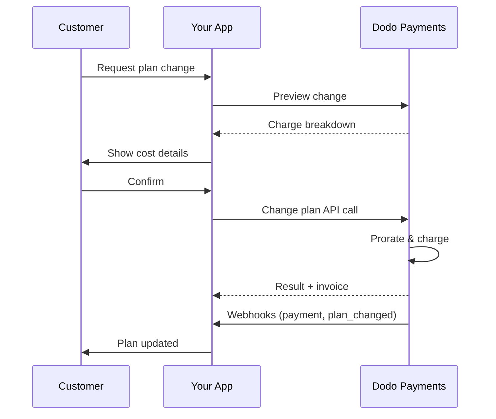
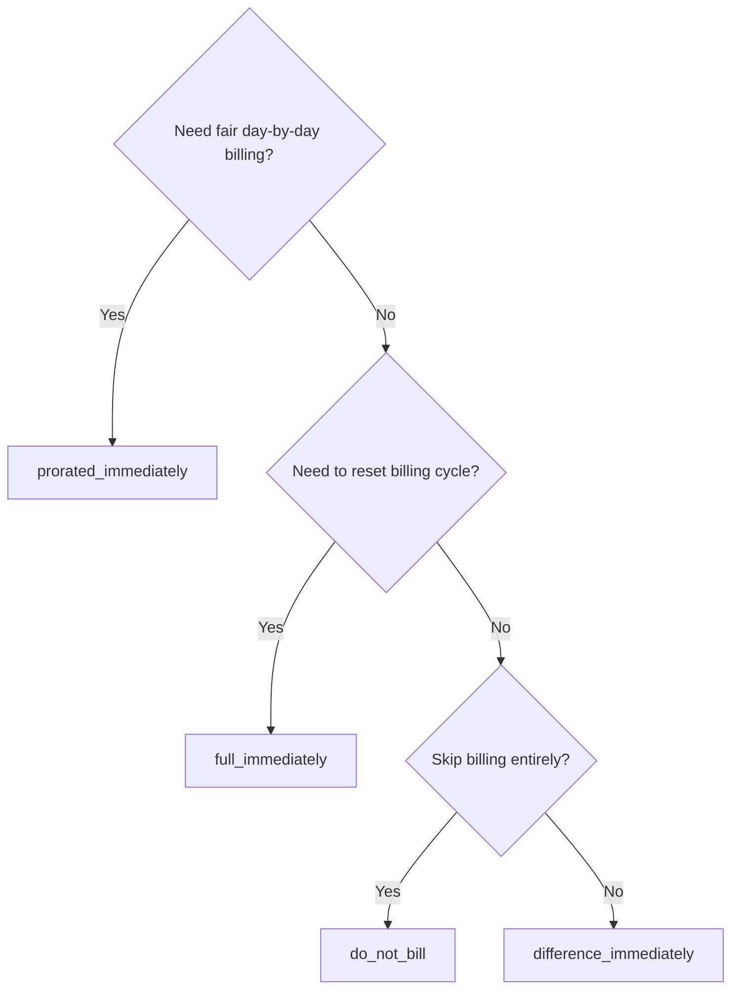
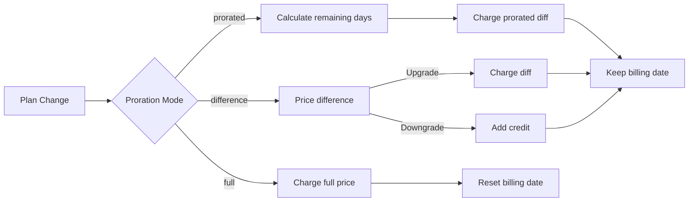

<CardGroup cols={3}>
<Card title="Change Plan API" icon="code" href="/api-reference/subscriptions/change-plan">
  Full API docs for updating subscriptions.
</Card>
<Card title="Plan Change Preview" icon="eye" href="/api-reference/subscriptions/preview-change-plan">
  See charge amounts before changing plans.
</Card>
<Card title="Integration Guide" icon="book" href="/developer-resources/subscription-integration-guide">
  Step-by-step subscription setup.
</Card>
</CardGroup>

## What is a subscription upgrade or downgrade?

Changing plans lets you move a customer between subscription tiers or quantities. Use it to:
- Align pricing with usage or features
- Move from monthly to annual (or vice versa)
- Adjust quantity for seat-based products

<Info>
Plan changes can trigger an immediate charge depending on the proration mode you choose.
</Info>

## When to use plan changes

- Upgrade when a customer needs more features, usage, or seats
- Downgrade when usage decreases
- Migrate users to a new product or price without cancelling their subscription

## Plan Change Flow



## Prerequisites

Before implementing subscription plan changes, ensure you have:

- A Dodo Payments merchant account with active subscription products
- API credentials (API key and webhook secret key) from the dashboard
- An existing active subscription to modify
- Webhook endpoint configured to handle subscription events

<Info>
For detailed setup instructions, see our [Integration Guide](/developer-resources/integration-guide#dashboard-setup).
</Info>

## Step-by-Step Implementation Guide

Follow this comprehensive guide to implement subscription plan changes in your application:

<Steps>
<Step title="Understand Plan Change Requirements">
Before implementing, determine:
- Which subscription products can be changed to which others
- What proration mode fits your business model
- How to handle failed plan changes gracefully
- Which webhook events to track for state management

<Tip>
Test plan changes thoroughly in test mode before implementing in production.
</Tip>
</Step>

<Step title="Choose Your Proration Strategy">
Select the billing approach that aligns with your business needs:

<Tabs>
<Tab title="prorated_immediately">
Best for: SaaS applications wanting to charge fairly for unused time
- Calculates exact prorated amount based on remaining cycle time
- Charges a prorated amount based on unused time remaining in the cycle
- Provides transparent billing to customers
</Tab>

<Tab title="difference_immediately">
Best for: Clear upgrade/downgrade scenarios
- Upgrade: Charge immediate difference (e.g., $30→$80 = charge $50)
- Downgrade: Credit remaining value for future renewals
- Simplifies billing logic and customer communication
</Tab>

<Tab title="full_immediately">
Best for: 결제 주기 재설정 시
- 새 플랜의 전체 금액을 즉시 청구
- 이전 플랜의 남은 시간 무시
- 연간에서 월간 전환에 유용
</Tab>

{/* LOCKED_PATTERN_7fa7f81fc66b83c441dd56aff76d586c */}
Best for: 무료 마이그레이션, 호의적인 스위치, 비용 차이를 흡수할 때
- 청구 또는 크레딧 계산 없음
- 청구 조정 없이 고객이 새 플랜으로 즉시 이동
- 청구 주기는 변경되지 않음
</Tab>
</Tabs>
</Step>

<Step title="Implement the Change Plan API">
구독 세부 사항을 수정하려면 Change Plan API를 사용하세요:

<ParamField path="subscription_id" type="string" required>
수정할 활성 구독의 ID입니다.
</ParamField>

<ParamField path="product_id" type="string" required>
구독을 변경할 새 제품 ID입니다.
</ParamField>

<ParamField path="quantity" type="integer" default="1">
새 플랜을 위한 유닛 수 (좌석 기반 제품의 경우).
</ParamField>

<ParamField path="proration_billing_mode" type="string" required>
즉시 청구 처리 방법: `prorated_immediately`, `full_immediately`, `difference_immediately`, 또는 `do_not_bill`.
</ParamField>

<ParamField path="addons" type="array">
새 플랜에 대한 선택적 애드온. 비워두면 기존 애드온이 제거됩니다.
</ParamField>

<ParamField path="on_payment_failure" type="string">
플랜 변경 결제가 실패할 때의 동작 제어:
- `prevent_change`: 결제가 성공할 때까지 현재 플랜에 구독 유지
- `apply_change` (기본값): 결제 결과와 상관없이 즉시 플랜 변경 적용

명시되지 않으면, 비즈니스 수준의 기본 설정을 사용합니다.
</ParamField>

<ParamField path="discount_code" type="string">
새 플랜에 적용할 선택적 할인 코드입니다. 제공된 경우, 할인은 플랜 변경에 대해 확인하고 적용됩니다. 제공되지 않은 경우, 구독에 `preserve_on_plan_change=true`와 관련된 기존 할인이 있는 경우 (새 제품에 적용 가능한 경우) 기존 할인이 유지됩니다.
</ParamField>
</Step>

<Step title="Handle Webhook Events">
웹훅 처리를 설정하여 플랜 변경 결과 추적:

- `subscription.active`: 플랜 변경 성공, 구독 업데이트됨
- `subscription.plan_changed`: 구독 플랜 변경 (업그레이드/다운그레이드/애드온 업데이트)
- `subscription.on_hold`: 플랜 변경 청구 실패, 구독 일시 중지
- `payment.succeeded`: 플랜 변경에 대한 즉시 청구 성공
- `payment.failed`: 즉시 청구 실패

<Warning>
항상 웹훅 서명을 확인하고 멱등성 이벤트 처리를 구현하세요.
</Warning>
</Step>

<Step title="Update Your Application State">
웹훅 이벤트에 따라 애플리케이션을 업데이트:
- 새 플랜에 따라 기능 부여/회수
- 고객 대시보드에 새 플랜 세부 정보 업데이트
- 플랜 변경에 대한 확인 이메일 발송
- 감사 목적으로 청구 변경 사항 기록
</Step>

<Step title="Test and Monitor">
구현을 철저히 테스트하세요:
- 다양한 시나리오로 모든 비례 계산 모드 테스트
- 웹훅 처리가 정확히 작동하는지 확인
- 플랜 변경 성공률 모니터링
- 실패한 플랜 변경에 대한 알림 설정

<Check>
구독 플랜 변경 구현이 이제 프로덕션용으로 준비되었습니다.
</Check>
</Step>
</Steps>

## 플랜 변경 미리 보기

플랜 변경을 확정하기 전에 고객에게 정확한 청구 금액을 보여주기 위해 미리 보기 API를 사용하세요:

<Tabs>
<Tab title="Node.js SDK">

```javascript
const preview = await client.subscriptions.previewChangePlan('sub_123', {
  product_id: 'prod_pro',
  quantity: 1,
  proration_billing_mode: 'prorated_immediately'
});

// Show customer the charge before confirming
console.log('Immediate charge:', preview.immediate_charge.summary);
console.log('New plan details:', preview.new_plan);
```

</Tab>

<Tab title="Python SDK">

```python
preview = client.subscriptions.preview_change_plan(
    subscription_id="sub_123",
    product_id="prod_pro",
    quantity=1,
    proration_billing_mode="prorated_immediately"
)

# Show customer the charge before confirming
print("Immediate charge:", preview.immediate_charge.summary)
print("New plan details:", preview.new_plan)
```

</Tab>
</Tabs>

<Tip>
미리 보기 API를 사용하여 고객에게 플랜 변경을 확인하기 전에 청구 금액을 보여주는 확인 대화 상자를 만드세요.
</Tip>

## Change Plan API

활성 구독에 대해 제품, 수량, 비율 처리 방식을 수정하려면 Change Plan API를 사용하세요.

### 빠른 시작 예제

<Tabs>
  <Tab title="Node.js SDK">

    ```javascript
    import DodoPayments from 'dodopayments';

    const client = new DodoPayments({
      bearerToken: process.env.DODO_PAYMENTS_API_KEY,
      environment: 'test_mode', // defaults to 'live_mode'
    });

    async function changePlan() {
      const result = await client.subscriptions.changePlan('sub_123', {
        product_id: 'prod_new',
        quantity: 3,
        proration_billing_mode: 'prorated_immediately',
        on_payment_failure: 'prevent_change', // Optional: control behavior on payment failure
      });
      console.log(result.status, result.invoice_id, result.payment_id);
    }

    changePlan();
    ```

  </Tab>
  <Tab title="Python SDK">

    ```python
    import os
    from dodopayments import DodoPayments

    client = DodoPayments(
        bearer_token=os.environ.get("DODO_PAYMENTS_API_KEY"),
        environment="test_mode",  # defaults to "live_mode"
    )

    result = client.subscriptions.change_plan(
        subscription_id="sub_123",
        product_id="prod_new",
        quantity=3,
        proration_billing_mode="prorated_immediately",
        on_payment_failure="prevent_change",  # Optional: control behavior on payment failure
    )
    print(result.status, result.get("invoice_id"), result.get("payment_id"))
    ```

  </Tab>
  <Tab title="Go SDK">

    ```go
    package main

    import (
      "context"
      "fmt"
      "github.com/dodopayments/dodopayments-go"
      "github.com/dodopayments/dodopayments-go/option"
    )

    func main() {
      client := dodopayments.NewClient(option.WithBearerToken("YOUR_TOKEN"))
      res, err := client.Subscriptions.ChangePlan(context.TODO(), dodopayments.SubscriptionChangePlanParams{
        SubscriptionID: dodopayments.F("sub_123"),
        ProductID:             dodopayments.F("prod_new"),
        Quantity:              dodopayments.F(int64(3)),
        ProrationBillingMode:  dodopayments.F(dodopayments.SubscriptionChangePlanParamsProrationBillingModeProratedImmediately),
        OnPaymentFailure:      dodopayments.F(dodopayments.OnPaymentFailurePreventChange), // Optional
      })
      if err != nil { panic(err) }
      fmt.Println(res.Status, res.InvoiceID, res.PaymentID)
    }
    ```

  </Tab>
  <Tab title="HTTP">

    ```bash
    curl -X POST "$DODO_API_BASE/subscriptions/sub_123/change-plan" \
      -H "Authorization: Bearer $DODO_PAYMENTS_API_KEY" \
      -H "Content-Type: application/json" \
      -d '{
        "product_id": "prod_new",
        "quantity": 3,
        "proration_billing_mode": "prorated_immediately",
        "on_payment_failure": "prevent_change"
      }'
    ```

  </Tab>
</Tabs>

```json Success
{
  "status": "processing",
  "subscription_id": "sub_123",
  "invoice_id": "inv_789",
  "payment_id": "pay_456",
  "proration_billing_mode": "prorated_immediately"
}
```

<Note>
<code>invoice_id</code> 및 <code>payment_id</code>와 같은 필드는 플랜 변경 중 즉시 청구 및/또는 청구서가 생성될 때만 반환됩니다. 항상 결과를 확인하기 위해 웹훅 이벤트 (예: <code>payment.succeeded</code>, <code>subscription.plan_changed</code>)에 의존하세요.
</Note>

<Warning>
즉시 청구가 실패하면 구독은 `subscription.on_hold`로 이동할 수 있습니다.
</Warning>

## 애드온 관리

구독 플랜을 변경할 때 애드온도 수정할 수 있습니다:

```javascript
// Add addons to the new plan
await client.subscriptions.changePlan('sub_123', {
  product_id: 'prod_new',
  quantity: 1,
  proration_billing_mode: 'difference_immediately',
  addons: [
    { addon_id: 'addon_123', quantity: 2 }
  ]
});

// Remove all existing addons
await client.subscriptions.changePlan('sub_123', {
  product_id: 'prod_new',
  quantity: 1,
  proration_billing_mode: 'difference_immediately',
  addons: [] // Empty array removes all existing addons
});
```

<Info>
애드온은 비례 계산에 포함되며 선택한 비례 모드에 따라 청구됩니다.
</Info>

## 할인 코드 적용

구독 플랜을 변경할 때 할인 코드를 적용할 수 있습니다. 이는 업그레이드 또는 마이그레이션에 대해 프로모션 가격을 제공하는 데 유용합니다.

<Tabs>
<Tab title="Node.js SDK">

```javascript
// Apply a discount code during plan change
await client.subscriptions.changePlan('sub_123', {
  product_id: 'prod_pro',
  quantity: 1,
  proration_billing_mode: 'prorated_immediately',
  discount_code: 'UPGRADE20'
});
```

</Tab>
<Tab title="Python SDK">

```python
# Apply a discount code during plan change
client.subscriptions.change_plan(
    subscription_id="sub_123",
    product_id="prod_pro",
    quantity=1,
    proration_billing_mode="prorated_immediately",
    discount_code="UPGRADE20"
)
```

</Tab>
<Tab title="HTTP">

```bash
curl -X POST "$DODO_API_BASE/subscriptions/sub_123/change-plan" \
  -H "Authorization: Bearer $DODO_PAYMENTS_API_KEY" \
  -H "Content-Type: application/json" \
  -d '{
    "product_id": "prod_pro",
    "quantity": 1,
    "proration_billing_mode": "prorated_immediately",
    "discount_code": "UPGRADE20"
  }'
```

</Tab>
</Tabs>

### 플랜 변경 시 할인 동작

| 시나리오 | 동작 |
|----------|----------|
| `discount_code` 제공됨 | 새 플랜에 할인을 확인 및 적용합니다. |
| 코드 제공되지 않음, `preserve_on_plan_change=true`와 기존 할인 있음 | 새 제품에 적용 가능한 경우 기존 할인을 자동으로 유지합니다. |
| 코드 제공되지 않음, 유지 가능한 할인 없음 | 새 플랜에 할인이 적용되지 않습니다. |

<Tip>
[Preview Plan Change API](/api-reference/subscriptions/preview-change-plan)와 `discount_code`를 사용하여 고객에게 플랜 변경을 확인하기 전에 얼마나 절약할 수 있는지 정확히 보여주십시오.
</Tip>

## 비율 모드

플랜을 변경할 때 고객에게 청구할 방식을 선택하세요:

#### `prorated_immediately`
- 현재 사이클의 부분 차이에 대해 청구
- 체험 중일 경우 즉시 청구하고 새 플랜으로 전환
- 다운그레이드: 미래 갱신에 적용되는 비례 크레딧이 생성될 수 있음

#### `full_immediately`
- 새 플랜의 전체 금액을 즉시 청구
- 이전 플랜의 남은 시간을 무시

<Info>
<code>difference_immediately</code>를 사용한 다운그레이드에 의해 생성된 크레딧은 구독 범위이며, <a href="/features/credit-based-billing">Credit-Based Billing</a> 권한과는 별개입니다. 이들은 동일한 구독의 미래 갱신에 자동으로 적용되며, 구독 간에 이전할 수 없습니다.
</Info>

#### `difference_immediately`
- 업그레이드: 오래된 플랜과 새 플랜 간의 가격 차이를 즉시 청구
- 다운그레이드: 남은 가치를 구독에 내부 크레딧으로 추가하고 갱신 시 자동 적용

#### `do_not_bill`
- 청구 또는 크레딧이 계산되지 않음
- 고객이 청구 조정 없이 새 플랜으로 즉시 전환
- 청구 주기는 변경되지 않음
- 호의적인 마이그레이션, 무료 플랜 스위치 또는 비용 차이 흡수에 최적

| 기능 | `prorated_immediately` | `difference_immediately` | `full_immediately` | `do_not_bill` |
|---------|----------------------|------------------------|-------------------|--------------|
| **업그레이드 청구** | 남은 날에 대한 비례 차이 | 플랜 간의 전체 가격 차이 | 새 플랜의 전체 가격 | 청구 없음 |
| **다운그레이드 크레딧** | 남은 날에 대한 비례 크레딧 | 크레딧으로 전체 가격 차이 | 크레딧 없음 | 크레딧 없음 |
| **청구 주기** | 변경 없음 | 변경 없음 | 오늘로 재설정 | 변경 없음 |
| **체험 동작** | 체험 종료, 즉시 청구 | 체험 종료, 즉시 청구 | 체험 종료, 전체 금액 청구 | 체험 종료, 청구 없음 |
| **최적 용도** | 공정한 시간 기반 청구 | 간단한 업그레이드/다운그레이드 수학 | 결제 주기 재설정 | 무료 마이그레이션 또는 호의적인 스위치 |
| **복잡성** | 중간 (일 계산) | 낮음 (간단한 뺄셈) | 낮음 (전체 청구) | 없음 |



### 예 시나리오

이러한 정형화된 숫자를 일관되게 사용하세요:
- 현재 플랜: **Basic** 월 **30달러**
- 업그레이드 대상: **Pro** 월 **80달러**
- 다운그레이드 대상 (Pro에서): **Starter** 월 **20달러**
- 청구 주기: **30일**, **1월 1일**에 시작
- 플랜 변경은 **1월 16일**에 발생 (15일 남음, 15일 사용)

<AccordionGroup>
  <Accordion title="Upgrade: Basic ($30) → Pro ($80) with prorated_immediately">

    ```
    Step 1: Calculate unused credit from current plan
      Unused days = 15 out of 30 days
      Credit = $30 × (15/30) = $15.00

    Step 2: Calculate prorated cost of new plan
      Remaining days = 15 out of 30 days
      New plan cost = $80 × (15/30) = $40.00

    Step 3: Calculate immediate charge
      Charge = New plan cost − Credit
      Charge = $40.00 − $15.00 = $25.00

    → Customer pays $25.00 now
    → Next renewal (Feb 1): $80.00/month
    ```

    ```javascript
    await client.subscriptions.changePlan('sub_123', {
      product_id: 'prod_pro',
      quantity: 1,
      proration_billing_mode: 'prorated_immediately'
    })
    ```

  </Accordion>

  <Accordion title="Downgrade: Pro ($80) → Starter ($20) with prorated_immediately">

    ```
    Step 1: Calculate unused credit from current plan
      Unused days = 15 out of 30 days
      Credit = $80 × (15/30) = $40.00

    Step 2: Calculate prorated cost of new plan
      Remaining days = 15 out of 30 days
      New plan cost = $20 × (15/30) = $10.00

    Step 3: Calculate credit balance
      Credit = $40.00 − $10.00 = $30.00

    → No charge — $30.00 credit added to subscription
    → Credit auto-applies to future renewals
    → Next renewal (Feb 1): $20.00 − $30.00 credit = $0.00
    → Following renewal (Mar 1): $20.00 − $10.00 remaining credit = $10.00
    ```

    ```javascript
    await client.subscriptions.changePlan('sub_123', {
      product_id: 'prod_starter',
      quantity: 1,
      proration_billing_mode: 'prorated_immediately'
    })
    ```

  </Accordion>

  <Accordion title="Upgrade: Basic ($30) → Pro ($80) with difference_immediately">

    ```
    Immediate charge = New plan price − Old plan price
                     = $80 − $30
                     = $50.00

    → Customer pays $50.00 now (regardless of cycle position)
    → Next renewal (Feb 1): $80.00/month
    ```

    ```javascript
    await client.subscriptions.changePlan('sub_123', {
      product_id: 'prod_pro',
      quantity: 1,
      proration_billing_mode: 'difference_immediately'
    })
    ```

  </Accordion>

  <Accordion title="Downgrade: Pro ($80) → Starter ($20) with difference_immediately">

    ```
    Credit = Old plan price − New plan price
           = $80 − $20
           = $60.00

    → No charge — $60.00 credit added to subscription
    → Credit auto-applies to future renewals
    → Next renewal: $20.00 − $20.00 (from credit) = $0.00
    → Following renewal: $20.00 − $20.00 (from credit) = $0.00
    → Third renewal: $20.00 − $20.00 (from remaining credit) = $0.00
    ```

    ```javascript
    await client.subscriptions.changePlan('sub_123', {
      product_id: 'prod_starter',
      quantity: 1,
      proration_billing_mode: 'difference_immediately'
    })
    ```

  </Accordion>

  <Accordion title="Upgrade: Basic ($30) → Pro ($80) with full_immediately">

    ```
    Immediate charge = Full new plan price = $80.00

    → Customer pays $80.00 now
    → No credit for unused time on old plan
    → Billing cycle resets to today (January 16)
    → Next renewal: February 16 at $80.00/month
    ```

    ```javascript
    await client.subscriptions.changePlan('sub_123', {
      product_id: 'prod_pro',
      quantity: 1,
      proration_billing_mode: 'full_immediately'
    })
    ```

  </Accordion>

  <Accordion title="Mid-cycle upgrade with add-ons using prorated_immediately">

    ```
    Current: Basic plan ($30/month), no add-ons
    New: Pro plan ($80/month) + Extra Seats add-on ($10/seat × 3 seats = $30/month)
    Change on day 16 of 30 (15 days remaining)

    Step 1: Credit from current plan
      Credit = $30 × (15/30) = $15.00

    Step 2: Prorated cost of new plan + add-ons
      New plan = $80 × (15/30) = $40.00
      Add-ons = $30 × (15/30) = $15.00
      Total new = $55.00

    Step 3: Immediate charge
      Charge = $55.00 − $15.00 = $40.00

    → Customer pays $40.00 now
    → Next renewal: $80.00 + $30.00 = $110.00/month
    ```

    ```javascript
    await client.subscriptions.changePlan('sub_123', {
      product_id: 'prod_pro',
      quantity: 1,
      proration_billing_mode: 'prorated_immediately',
      addons: [
        { addon_id: 'addon_seats', quantity: 3 }
      ]
    })
    ```

  </Accordion>
</AccordionGroup>

### 각 모드가 청구를 처리하는 방법



<Tip>
공정한 타임 회계를 위해서는 `prorated_immediately`을 선택하세요; 결제 일정을 다시 시작하려면 `full_immediately`를 선택하세요; 업그레이드를 간편하게 하고 다운그레이드 시 자동 크레딧을 배정하려면 `difference_immediately`를 사용하세요; 또는 청구 조정 없이 플랜을 전환하려면 `do_not_bill`를 사용하세요.
</Tip>

## 결제 실패 처리

`on_payment_failure` 매개 변수를 사용하여 플랜 변경 결제가 실패할 때의 동작을 제어하세요.

### 결제 실패 모드

<Tabs>
<Tab title="prevent_change (Recommended for critical upgrades)">
**동작**: 구독을 현재 플랜에 결제가 성공할 때까지 유지합니다.

- 플랜 변경이 "대기 중"으로 표시됩니다
- 고객은 현재 플랜에 대한 액세스를 유지합니다
- 결제가 성공한 후에만 구독이 `active` 상태로 이동합니다
- 업그레이드 기능 제공 전에 결제를 보장하고자 할 때 유용

```javascript
await client.subscriptions.changePlan('sub_123', {
  product_id: 'prod_pro',
  quantity: 1,
  proration_billing_mode: 'prorated_immediately',
  on_payment_failure: 'prevent_change'
});
```

</Tab>

<Tab title="apply_change (Default)">
**동작**: 결제 결과와 상관없이 즉시 플랜 변경을 적용합니다.

- 결제가 실패해도 플랜 변경이 적용됩니다
- 고객은 즉시 새 플랜에 액세스할 수 있습니다
- 결제가 실패하면 구독이 `on_hold`로 이동할 수 있습니다
- 비중요 업그레이드나 고객을 신뢰할 때 좋음

```javascript
await client.subscriptions.changePlan('sub_123', {
  product_id: 'prod_pro',
  quantity: 1,
  proration_billing_mode: 'prorated_immediately',
  on_payment_failure: 'apply_change' // This is the default
});
```

</Tab>
</Tabs>

<Info>
명시되지 않으면, `on_payment_failure` 매개 변수는 대시보드에서 구성된 비즈니스 수준 기본 설정을 사용합니다.
</Info>

### 각 모드의 사용 시기

| 시나리오 | 권장 모드 | 이유 |
|----------|------------------|--------|
| 프리미엄 기능으로 업그레이드 | `prevent_change` | 액세스를 허용하기 전에 결제 보장 |
| 수량 증가 (더 많은 좌석) | `prevent_change` | 결제 없이 사용을 방지 |
| 플랜 다운그레이드 | `apply_change` | 고객이 지출을 줄임 |
| 신뢰할 수 있는 기업 고객 | `apply_change` | 미결제 위험 적음 |
| 체험판에서 유료 전환 | `prevent_change` | 중요한 결제 순간 |

## 웹훅 처리

구독 상태를 웹훅을 통해 추적하여 플랜 변경 및 결제를 확인하세요.

### 처리할 이벤트 유형
- `subscription.active`: 구독 활성화됨
- `subscription.plan_changed`: 구독 플랜 변경 (업그레이드/다운그레이드/애드온 변경)
- `subscription.on_hold`: 청구 실패, 구독 일시 중지됨
- `subscription.renewed`: 갱신 성공
- `payment.succeeded`: 플랜 변경 또는 갱신에 대한 결제 성공
- `payment.failed`: 결제 실패

<Info>
구독 이벤트에서 비즈니스 로직을 구동하고 결제 이벤트를 확인 및 조정에 사용하도록 권장합니다.
</Info>

### 서명 확인 및 인텐트 처리

<Tabs>
  <Tab title="Next.js Route Handler">

    ```javascript
    import { NextRequest, NextResponse } from 'next/server';
    
    export async function POST(req) {
      const webhookId = req.headers.get('webhook-id');
      const webhookSignature = req.headers.get('webhook-signature');
      const webhookTimestamp = req.headers.get('webhook-timestamp');
      const secret = process.env.DODO_WEBHOOK_SECRET;
    
      const payload = await req.text();
      // verifySignature is a placeholder – in production, use a Standard Webhooks library
      const { valid, event } = await verifySignature(
        payload,
        { id: webhookId, signature: webhookSignature, timestamp: webhookTimestamp },
        secret
      );
      if (!valid) return NextResponse.json({ error: 'Invalid signature' }, { status: 400 });
    
      switch (event.type) {
        case 'subscription.active':
          // mark subscription active in your DB
          break;
        case 'subscription.plan_changed':
          // refresh entitlements and reflect the new plan in your UI
          break;
        case 'subscription.on_hold':
          // notify user to update payment method
          break;
        case 'subscription.renewed':
          // extend access window
          break;
        case 'payment.succeeded':
          // reconcile payment for plan change
          break;
        case 'payment.failed':
          // log and alert
          break;
        default:
          // ignore unknown events
          break;
      }
    
      return NextResponse.json({ received: true });
    }
    ```

  </Tab>
  <Tab title="Express.js">

    ```javascript
    import express from 'express';
    
    const app = express();
    app.post('/webhooks/dodo', express.raw({ type: 'application/json' }), async (req, res) => {
      const webhookId = req.header('webhook-id');
      const webhookSignature = req.header('webhook-signature');
      const webhookTimestamp = req.header('webhook-timestamp');
      const secret = process.env.DODO_WEBHOOK_SECRET;
      const payload = req.body.toString('utf8');
    
      const { valid, event } = await verifySignature(
        payload,
        { id: webhookId, signature: webhookSignature, timestamp: webhookTimestamp },
        secret
      );
      if (!valid) return res.status(400).send('Invalid signature');
    
      // handle events like above
      res.json({ received: true });
    });
    
    app.listen(3000);
    ```

  </Tab>
</Tabs>

<Note>
자세한 페이로드 스키마는 <a href="/developer-resources/webhooks/intents/subscription">구독 웹훅 페이로드</a> 및 <a href="/developer-resources/webhooks/intents/payment">결제 웹훅 페이로드</a>를 참조하세요.
</Note>

## 모범 사례

신뢰할 수 있는 구독 플랜 변경을 위해 다음 권장 사항을 따르세요:

### 플랜 변경 전략
- **철저히 테스트**: 항상 프로덕션 전 테스트 모드에서 플랜 변경을 테스트하세요
- **비율을 신중하게 선택**: 비즈니스 모델에 맞는 비율 모드를 선택하세요
- **실패를 우아하게 처리**: 적절한 오류 처리 및 재시도 로직을 구현하세요
- **성공률 모니터링**: 플랜 변경 성공/실패 비율을 추적하고 문제를 조사하세요

### 웹훅 구현
- **서명 확인**: 항상 웹훅 서명을 확인하여 진본성을 보장하세요
- **멱등성 구현**: 중복 웹훅 이벤트를 우아하게 처리하세요
- **비동기 처리**: 무거운 작업으로 웹훅 응답을 차단하지 마세요
- **모든 것 기록**: 디버깅 및 감사 목적으로 세부 로그를 유지하세요

### 사용자 경험
- **명확하게 소통**: 고객에게 청구 변경 및 일정에 대해 알리세요
- **확인 제공**: 성공적인 플랜 변경에 대해 이메일 확인을 보내세요
- **엣지 케이스 처리**: 체험 기간, 비례 및 실패한 결제를 고려하세요
- **UI 즉시 업데이트**: 애플리케이션 인터페이스에 플랜 변경을 반영하세요

## 일반적인 문제 및 해결책

구독 플랜 변경 시 발생하는 일반적인 문제 해결:

<AccordionGroup>
<Accordion title="Charge created but subscription not updated">
**증상**: API 호출은 성공했지만 구독이 이전 플랜에 남아 있음

**일반적인 원인**:
- 웹훅 처리가 실패하거나 지연됨
- 웹훅을 수신한 후 응용 프로그램 상태가 업데이트되지 않음
- 상태 업데이트 중 데이터베이스 트랜잭션 문제

**해결책**:
- 재시도 로직을 사용하여 견고한 웹훅 처리를 구현하세요
- 상태 업데이트에 멱등 연산을 사용하세요
- 누락된 웹훅 이벤트를 감지 및 경고하도록 모니터링을 추가하세요
- 웹훅 엔드포인트가 접근 가능하고 올바르게 응답하는지 확인하세요
</Accordion>

<Accordion title="Credits not applied after downgrade">
**증상**: 고객이 다운그레이드 했지만 크레딧 잔액을 보지 못함

**일반적인 원인**:
- 비율 처리 모드에 대한 기대 사항: 다운그레이드는 `difference_immediately`를 사용하여 전체 플랜 가격 차이를 크레딧으로 제공하고, `prorated_immediately`는 남은 시간에 기반하여 비례 크레딧을 생성
- 크레딧은 구독에 특정하며 구독 간에 이전되지 않음
- 고객 대시보드에 크레딧 잔액이 표시되지 않음

**해결책**:
- 자동 크레딧을 원할 때는 다운그레이드에 `difference_immediately`를 사용하세요
- 크레딧은 동일한 구독의 미래 갱신에 적용된다는 것을 고객에게 설명하세요
- 크레딧 잔액을 표시하는 고객 포털을 구현하세요
- 적용된 크레딧을 보려면 다음 청구서 미리 보기를 확인하세요
</Accordion>

<Accordion title="Webhook signature verification fails">
**증상**: 잘못된 서명으로 인해 웹훅 이벤트가 거부됨

**일반적인 원인**:
- 잘못된 웹훅 비밀 키
- 서명 확인 전에 수정된 원시 요청 본문
- 잘못된 서명 확인 알고리즘

**해결책**:
- 대시보드에서 올바른 `DODO_WEBHOOK_SECRET`를 사용하고 있는지 확인하세요
- JSON 구문 분석 미들웨어 전에 원시 요청 본문을 읽으세요
- 플랫폼에 맞는 표준 웹훅 확인 라이브러리를 사용하세요
- 개발 환경에서 웹훅 서명 확인을 테스트하세요
</Accordion>

<Accordion title="Plan change fails with 422 error">
**증상**: API가 422 Unprocessable Entity 오류 반환

**일반적인 원인**:
- 잘못된 구독 ID 또는 제품 ID
- 활성 상태가 아닌 구독
- 누락된 필수 매개 변수
- 플랜 변경에 사용할 수 없는 제품

**해결책**:
- 구독이 존재하고 활성 상태인지 확인하세요
- 제품 ID가 유효하고 사용 가능한지 확인하세요
- 모든 필수 매개 변수가 제공되었는지 확인하세요
- 매개 변수 요구 사항에 대한 API 문서를 검토하세요
</Accordion>

<Accordion title="Immediate charge fails during plan change">
**증상**: 플랜 변경이 시작되었지만 즉시 청구가 실패함

**일반적인 원인**:
- 고객의 결제 수단에 자금 부족
- 만료되거나 잘못된 결제 수단
- 은행이 거래를 거부
- 사기 방지로 인해 차단

**해결책**:
- `payment.failed` 웹훅 이벤트를 적절히 처리하세요
- 고객에게 결제 수단을 갱신하도록 알림
- 일시적 실패에 대한 재시도 로직 구현
- 즉시 청구 실패 시 플랜 변경 허용 고려
</Accordion>

<Accordion title="Subscription on hold after plan change">
**증상**: 플랜 변경 청구가 실패하고 구독이 `on_hold` 상태로 이동

**무슨 일이 생깁니까**:
플랜 변경 청구가 실패했을 때 구독은 자동으로 `on_hold` 상태에 놓입니다. 결제 수단이 갱신될 때까지 구독은 자동으로 갱신되지 않습니다.

**해결책**: 결제 수단을 갱신하여 구독을 재활성화하세요

플랜 변경 실패 후 `on_hold` 상태에서 구독을 재활성화하려면:

1. **결제 수단 갱신**: Update Payment Method API를 사용하여
2. **자동 청구 생성**: API는 남은 금액에 대해 자동으로 청구 생성
3. **청구서 생성**: 청구서가 생성됨
4. **결제 처리**: 새로운 결제 수단을 사용하여 결제 처리
5. **재활성화**: 결제가 성공하면 구독이 `active` 상태로 재활성화됨

<CodeGroup>

```javascript Node.js
// Reactivate subscription from on_hold after failed plan change
async function reactivateAfterFailedPlanChange(subscriptionId) {
  // Update payment method - automatically creates charge for remaining dues
  const response = await client.subscriptions.updatePaymentMethod(subscriptionId, {
    type: 'new',
    return_url: 'https://example.com/return'
  });
  
  if (response.payment_id) {
    console.log('Charge created for remaining dues:', response.payment_id);
    console.log('Payment link:', response.payment_link);
    
    // Redirect customer to payment_link to complete payment
    // Monitor webhooks for:
    // 1. payment.succeeded - charge succeeded
    // 2. subscription.active - subscription reactivated
  }
  
  return response;
}

// Or use existing payment method if available
async function reactivateWithExistingPaymentMethod(subscriptionId, paymentMethodId) {
  const response = await client.subscriptions.updatePaymentMethod(subscriptionId, {
    type: 'existing',
    payment_method_id: paymentMethodId
  });
  
  // Monitor webhooks for payment.succeeded and subscription.active
  return response;
}
```

```python Python
# Reactivate subscription from on_hold after failed plan change
def reactivate_after_failed_plan_change(subscription_id):
    # Update payment method - automatically creates charge for remaining dues
    response = client.subscriptions.update_payment_method(
        subscription_id=subscription_id,
        type="new",
        return_url="https://example.com/return"
    )
    
    if response.payment_id:
        print("Charge created for remaining dues:", response.payment_id)
        print("Payment link:", response.payment_link)
        
        # Redirect customer to payment_link to complete payment
        # Monitor webhooks for:
        # 1. payment.succeeded - charge succeeded
        # 2. subscription.active - subscription reactivated
    
    return response

# Or use existing payment method if available
def reactivate_with_existing_payment_method(subscription_id, payment_method_id):
    response = client.subscriptions.update_payment_method(
        subscription_id=subscription_id,
        type="existing",
        payment_method_id=payment_method_id
    )
    
    # Monitor webhooks for payment.succeeded and subscription.active
    return response
```

</CodeGroup>

**모니터링할 웹훅 이벤트**:
- `subscription.on_hold`: 구독 보류 상태로 놓임 (플랜 변경 청구 실패 시 수신됨)
- `payment.succeeded`: 남은 금액에 대한 결제 성공 (결제 수단 갱신 후)
- `subscription.active`: 결제 성공 후 구독 재활성화

**모범 사례**:
- 플랜 변경 청구 실패 시 즉시 고객에게 알림
- 결제 수단을 업데이트하는 방법에 대한 명확한 지침 제공
- 재활성화 상태를 추적하기 위한 웹훅 이벤트 모니터링
- 일시적인 결제 실패를 위한 자동 재시도 로직 구현 고려
<Card title="Update Payment Method API Reference" icon="code" href="/api-reference/subscriptions/update-payment-method">
결제 수단 갱신 및 구독 재활성화에 대한 전체 API 문서를 확인하세요.
</Card>
</Accordion>
</AccordionGroup>

구독 플랜 변경 구현을 철저히 테스트하기 위해 다음 단계를 따르세요:

## 구현 테스트

구독 플랜 변경 구현을 철저히 테스트하려면 다음 단계를 따르세요:

<Steps>
<Step title="Set up test environment">
- 테스트 API 키와 테스트 제품 사용
- 다양한 플랜 유형으로 테스트 구독 생성
- 테스트 웹훅 엔드포인트 구성
- 모니터링 및 로깅 설정
</Step>

<Step title="Test different proration modes">
- 다양한 청구 주기 위치로 `prorated_immediately` 테스트
- 업그레이드 및 다운그레이드를 위한 `difference_immediately` 테스트
- 결제 주기를 재설정하기 위한 `full_immediately` 테스트
- 청구 없음/크레딧 없음의 플랜 전환을 위한 `do_not_bill` 테스트
- 크레딧 계산이 정확한지 확인
</Step>

<Step title="Test webhook handling">
- 모든 관련 웹훅 이벤트가 수신되는지 확인
- 웹훅 서명 확인 테스트
- 중복 웹훅 이벤트 우아하게 처리
- 웹훅 처리 실패 시나리오 테스트
</Step>

<Step title="Test error scenarios">
- 잘못된 구독 ID로 테스트
- 만료된 결제 수단으로 테스트
- 네트워크 실패 및 시간 초과 테스트
- 자금 부족으로 테스트
</Step>

<Step title="Monitor in production">
- 실패한 플랜 변경에 대한 알림 설정
- 웹훅 처리 시간 모니터링
- 플랜 변경 성공률 추적
- 플랜 변경 문제에 대한 고객 지원 티켓 검토
</Step>
</Steps>

## 오류 처리

구현에서 일반적인 API 오류를 우아하게 처리하세요:

### HTTP 상태 코드

<AccordionGroup>
<Accordion title="200 OK">
플랜 변경 요청이 성공적으로 처리되었습니다. 구독이 업데이트 중이며 결제 처리가 시작되었습니다.
</Accordion>

<Accordion title="400 Bad Request">
잘못된 요청 매개 변수. 모든 필수 필드가 제공되고 올바르게 형식화되었는지 확인하세요.
</Accordion>

<Accordion title="401 Unauthorized">
잘못되었거나 없는 API 키. `DODO_PAYMENTS_API_KEY`이 올바르고 적절한 권한이 있는지 확인하세요.
</Accordion>

<Accordion title="404 Not Found">
구독 ID가 없거나 계정에 속하지 않습니다.
</Accordion>

<Accordion title="422 Unprocessable Entity">
플랜을 변경할 수 없습니다 (예: 이미 취소됨, 사용 가능한 제품이 아님 등).
</Accordion>

<Accordion title="500 Internal Server Error">
서버 오류가 발생했습니다. 짧은 지연 후 요청을 다시 시도하세요.
</Accordion>
</AccordionGroup>

### 오류 응답 형식

```json
{
  "error": {
    "code": "subscription_not_found",
    "message": "The subscription with ID 'sub_123' was not found",
    "details": {
      "subscription_id": "sub_123"
    }
  }
}
```

## 다음 단계

- <a href="/api-reference/subscriptions/change-plan">Change Plan API</a> 검토하기
- <a href="/features/credit-based-billing">크레딧 기반 청구</a> 탐색하기
- `subscription.on_hold`에 대한 알림 구현
- <a href="/developer-resources/webhooks">웹훅 통합 가이드</a>를 확인하세요
