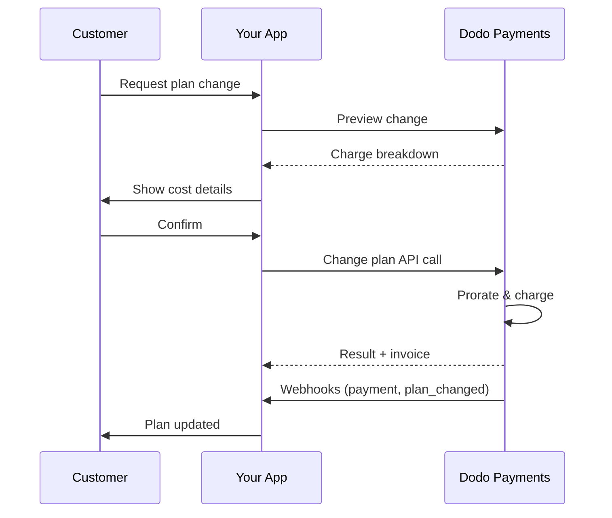
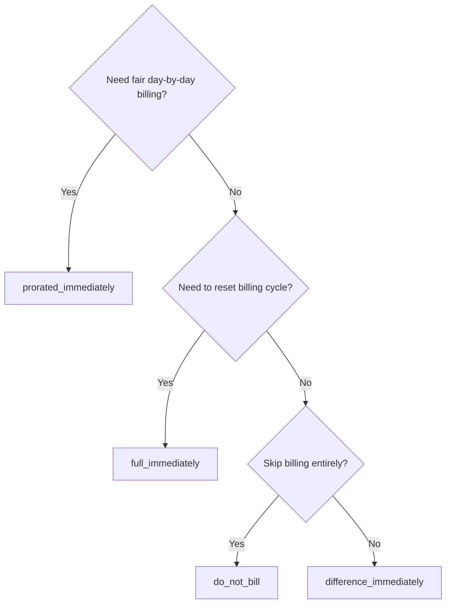
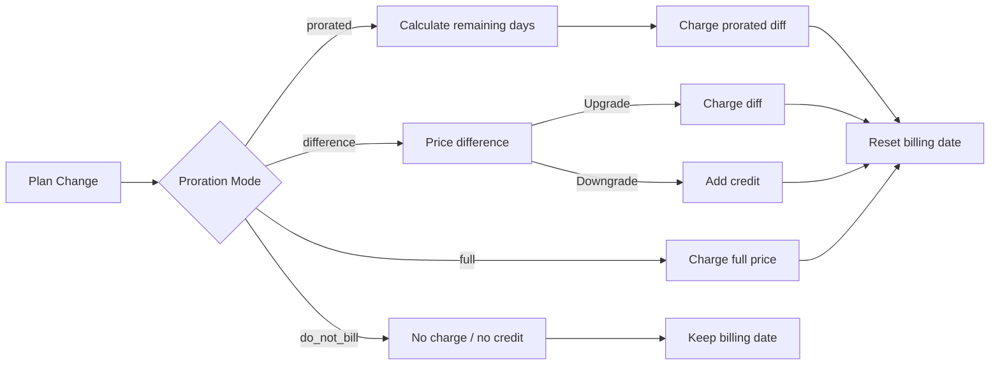

<CardGroup cols={3}>
<Card title="Change Plan API" icon="code" href="/api-reference/subscriptions/change-plan">
  Full API docs for updating subscriptions.
</Card>
<Card title="Plan Change Preview" icon="eye" href="/api-reference/subscriptions/preview-change-plan">
  See charge amounts before changing plans.
</Card>
<Card title="Integration Guide" icon="book" href="/developer-resources/subscription-integration-guide">
  Step-by-step subscription setup.
</Card>
</CardGroup>

## What is a subscription upgrade or downgrade?

Changing plans lets you move a customer between subscription tiers or quantities. Use it to:
- Align pricing with usage or features
- Move from monthly to annual (or vice versa)
- Adjust quantity for seat-based products

<Info>
Plan changes can trigger an immediate charge depending on the proration mode you choose.
</Info>

## When to use plan changes

- Upgrade when a customer needs more features, usage, or seats
- Downgrade when usage decreases
- Migrate users to a new product or price without cancelling their subscription

## Plan Change Flow



## Prerequisites

Before implementing subscription plan changes, ensure you have:

- A Dodo Payments merchant account with active subscription products
- API credentials (API key and webhook secret key) from the dashboard
- An existing active subscription to modify
- Webhook endpoint configured to handle subscription events

<Info>
For detailed setup instructions, see our [Integration Guide](/developer-resources/integration-guide#dashboard-setup).
</Info>

## Step-by-Step Implementation Guide

Follow this comprehensive guide to implement subscription plan changes in your application:

<Steps>
<Step title="Understand Plan Change Requirements">
Before implementing, determine:
- Which subscription products can be changed to which others
- What proration mode fits your business model
- How to handle failed plan changes gracefully
- Which webhook events to track for state management

<Tip>
Test plan changes thoroughly in test mode before implementing in production.
</Tip>
</Step>

<Step title="Choose Your Proration Strategy">
Select the billing approach that aligns with your business needs:

<Tabs>
<Tab title="prorated_immediately">
Best for: SaaS applications wanting to charge fairly for unused time
- Calculates exact prorated amount based on remaining cycle time
- Charges a prorated amount based on unused time remaining in the cycle
- Provides transparent billing to customers
</Tab>

<Tab title="difference_immediately">
Best for: Clear upgrade/downgrade scenarios
- Upgrade: Charge immediate difference (e.g., $30→$80 = charge $50)
- Downgrade: Credit remaining value for future renewals
- Simplifies billing logic and customer communication
</Tab>

<Tab title="full_immediately">
Best for: When you want to reset the billing cycle
- Charges full amount of new plan immediately
- Ignores remaining time from old plan
- Useful for annual to monthly transitions
</Tab>

<Tab title="do_not_bill">
Best for: Free migrations, courtesy switches, or absorbing cost differences
- No charges or credits calculated
- Customer moves to the new plan immediately without any billing adjustment
- Billing cycle remains unchanged
</Tab>
</Tabs>
</Step>

<Step title="Implement the Change Plan API">
Use the Change Plan API to modify subscription details:

<ParamField path="subscription_id" type="string" required>
The ID of the active subscription to modify.
</ParamField>

<ParamField path="product_id" type="string" required>
The new product ID to change the subscription to.
</ParamField>

<ParamField path="quantity" type="integer" required>
Number of units for the new plan (for seat-based products).
</ParamField>

<ParamField path="proration_billing_mode" type="string" required>
How to handle immediate billing: `prorated_immediately`, `full_immediately`, `difference_immediately`, or `do_not_bill`.
</ParamField>

<ParamField path="addons" type="array">
Optional addons for the new plan. Leaving this empty removes any existing addons.
</ParamField>

<ParamField path="on_payment_failure" type="string">
Controls behavior when the plan change payment fails:
- `prevent_change`: Keep subscription on current plan until payment succeeds
- `apply_change` (default): Apply plan change immediately regardless of payment outcome

If not specified, uses the business-level default setting.
</ParamField>

<ParamField path="collect_via_payment_link" type="boolean">
subscription의 저장된 payment method로 청구하는 대신 payment link를 사용하여 플랜 변경 금액을 수금합니다. 고객은 호스팅된 checkout 페이지에서 결제합니다.

비즈니스의 `allow_plan_change_via_payment_link` capability(**Settings → Subscriptions → Collect Plan Change Payments by Payment Link**), `effective_at: immediately` 및 `on_payment_failure: prevent_change`가 필요합니다. [Collecting Payment via a Checkout Link](#collecting-payment-via-a-checkout-link)을 참조하세요.

preview route에서는 무시됩니다.
</ParamField>

<ParamField path="discount_codes" type="array">
새 플랜에 적용할 선택적 **stacked** discount code입니다(최대 20개, 배열 순서대로 적용). 전달하는 값에 따라 동작이 달라집니다:

- **제공하지 않음 / `null`** — 새 product에 적용 가능한 경우 `preserve_on_plan_change=true`가 있는 기존 discount가 유지됩니다.
- **`[]`(빈 배열)** — subscription에서 모든 기존 discount를 제거합니다.
- **`["CODE_A", "CODE_B", ...]`** — 기존 discount를 이 stacked set으로 대체합니다.
</ParamField>

<ParamField path="discount_code" type="string" deprecated>
**Deprecated** — 새로운 integration에는 `discount_codes`를 사용하세요. 이 field는 backward compatibility를 위해 계속 작동하지만, 동일한 request에서 `discount_codes`와 함께 사용할 수 없습니다.
</ParamField>

<ParamField path="effective_at" type="string" default="immediately">
플랜 변경을 적용할 시점:
- `immediately`(기본값): 플랜 변경을 즉시 적용합니다.
- `next_billing_date`: 다음 billing date에 변경을 예약합니다. billing period가 끝날 때까지 고객은 현재 플랜을 유지합니다.

downgrade에는 `next_billing_date`를 사용하여 고객이 billing period 종료 시점까지 현재 플랜의 혜택을 유지하도록 하세요.
</ParamField>
</Step>

<Step title="Handle Webhook Events">
플랜 변경 결과를 추적하도록 webhook 처리를 설정하세요:

- `subscription.active`: 플랜 변경 성공, subscription 업데이트됨
- `subscription.plan_changed`: Subscription plan 변경됨(upgrade/downgrade/addon 업데이트)
- `subscription.on_hold`: 플랜 변경 charge 실패, renewal 중지됨
- `payment.succeeded`: 플랜 변경을 위한 즉시 charge 성공
- `payment.failed`: 즉시 charge 실패

<Warning>
항상 webhook signature를 검증하고 멱등적인 event 처리를 구현하세요.
</Warning>
</Step>

<Step title="Update Your Application State">
webhook event를 기반으로 애플리케이션을 업데이트하세요:
- 새 플랜에 따라 기능을 부여하거나 취소
- 새 플랜 세부정보로 customer dashboard 업데이트
- 플랜 변경 확인 email 전송
- audit 목적으로 billing 변경 사항 기록
</Step>

<Step title="Test and Monitor">
구현을 철저히 테스트하세요:
- 다양한 시나리오에서 모든 proration mode 테스트
- webhook 처리가 올바르게 작동하는지 확인
- 플랜 변경 성공률 모니터링
- 실패한 플랜 변경에 대한 alert 설정

<Check>
subscription plan 변경 구현이 이제 production에서 사용할 준비가 되었습니다.
</Check>
</Step>
</Steps>

## 플랜 변경 미리보기

플랜 변경을 확정하기 전에 Preview API를 사용하여 고객에게 실제로 청구될 금액을 정확히 표시하세요:

<Tabs>
<Tab title="Node.js SDK">

```javascript
const preview = await client.subscriptions.previewChangePlan('sub_123', {
  product_id: 'pdt_pro',
  quantity: 1,
  proration_billing_mode: 'prorated_immediately'
});

// Show customer the charge before confirming
console.log('Immediate charge:', preview.immediate_charge.summary);
console.log('New plan details:', preview.new_plan);
```

</Tab>

<Tab title="Python SDK">

```python
preview = client.subscriptions.preview_change_plan(
    subscription_id="sub_123",
    product_id="pdt_pro",
    quantity=1,
    proration_billing_mode="prorated_immediately"
)

# Show customer the charge before confirming
print("Immediate charge:", preview.immediate_charge.summary)
print("New plan details:", preview.new_plan)
```

</Tab>
</Tabs>

<Tip>
Preview API를 사용하여 고객이 플랜 변경을 확정하기 전에 정확히 얼마를 청구받는지 보여 주는 confirmation dialog를 구성하세요.
</Tip>

## Change Plan API

Change Plan API를 사용하여 활성 subscription의 product, quantity 및 proration 동작을 수정하세요.

### 빠른 시작 예시

<Tabs>
  <Tab title="Node.js SDK">

    ```javascript
    import DodoPayments from 'dodopayments';

    const client = new DodoPayments({
      bearerToken: process.env.DODO_PAYMENTS_API_KEY,
      environment: 'test_mode', // defaults to 'live_mode'
    });

    async function changePlan() {
      // change-plan returns 200 with an empty body.
      await client.subscriptions.changePlan('sub_123', {
        product_id: 'pdt_new',
        quantity: 3,
        proration_billing_mode: 'prorated_immediately',
        on_payment_failure: 'prevent_change', // Optional: control behavior on payment failure
      });
      console.log('Plan change accepted; awaiting webhooks');
    }

    changePlan();
    ```

  </Tab>
  <Tab title="Python SDK">

    ```python
    import os
    from dodopayments import DodoPayments

    client = DodoPayments(
        bearer_token=os.environ.get("DODO_PAYMENTS_API_KEY"),
        environment="test_mode",  # defaults to "live_mode"
    )

    # change_plan returns 200 with an empty body.
    client.subscriptions.change_plan(
        subscription_id="sub_123",
        product_id="pdt_new",
        quantity=3,
        proration_billing_mode="prorated_immediately",
        on_payment_failure="prevent_change",  # Optional: control behavior on payment failure
    )
    print("Plan change accepted; awaiting webhooks")
    ```

  </Tab>
  <Tab title="Go SDK">

    ```go
    package main

    import (
      "context"
      "fmt"
      "github.com/dodopayments/dodopayments-go"
      "github.com/dodopayments/dodopayments-go/option"
    )

    func main() {
      client := dodopayments.NewClient(option.WithBearerToken("YOUR_TOKEN"))
      // ChangePlan returns no response body; a nil error means the change succeeded.
      err := client.Subscriptions.ChangePlan(context.TODO(), "sub_123", dodopayments.SubscriptionChangePlanParams{
        UpdateSubscriptionPlanReq: dodopayments.UpdateSubscriptionPlanReqParam{
          ProductID:            dodopayments.F("pdt_new"),
          Quantity:             dodopayments.F(int64(3)),
          ProrationBillingMode: dodopayments.F(dodopayments.UpdateSubscriptionPlanReqProrationBillingModeProratedImmediately),
          OnPaymentFailure:     dodopayments.F(dodopayments.UpdateSubscriptionPlanReqOnPaymentFailurePreventChange), // Optional
        },
      })
      if err != nil { panic(err) }
      fmt.Println("Plan change applied")
    }
    ```

  </Tab>
  <Tab title="HTTP">

    ```bash
    curl -X POST "$DODO_API_BASE/subscriptions/sub_123/change-plan" \
      -H "Authorization: Bearer $DODO_PAYMENTS_API_KEY" \
      -H "Content-Type: application/json" \
      -d '{
        "product_id": "pdt_new",
        "quantity": 3,
        "proration_billing_mode": "prorated_immediately",
        "on_payment_failure": "prevent_change"
      }'
    ```

  </Tab>
</Tabs>

성공한 플랜 변경은 실제 charge가 정산되기 전에 즉시 `200 OK`를 반환합니다. body(`ChangePlanResponse`)의 내용은 변경 사항을 수금한 방식에 따라 달라집니다:

| Case | `payment_id` / `payment_link` / `client_secret` / `expires_on` |
|------|------------------------------------------------------------|
| 예약된 변경(`effective_at: next_billing_date`) | 모든 `null` — 아직 청구되지 않음 |
| `proration_billing_mode: do_not_bill` | 모든 `null` — 청구할 금액 없음 |
| 일반 즉시 charge(저장된 payment method) | 모든 `null` |
| `collect_via_payment_link: true`(link 발급됨) | 모두 **채워짐** — 고객을 위한 checkout handle |

<Note>
모든 경우에 이 response는 payment 결과가 아니라 request 자체가 수락되었다는 의미일 뿐입니다. 즉시 charge가 실제로 성공했는지는 알려 주지 않습니다.

**일반 즉시 charge**의 경우 해당 결과는 call 직후 off-session에서 결정됩니다.

**`collect_via_payment_link` request**의 경우 결과가 나중에 비동기적으로 결정됩니다. response는 checkout link만 전달하고, subscription은 현재 플랜을 유지하며, 고객이 해당 link에서 실제로 결제를 완료하기 전까지 결과를 알 수 없습니다.

어느 경우든 이 response에서 결과를 추론하지 마세요. webhook(<code>payment.succeeded</code>, <code>payment.failed</code>, <code>subscription.plan_changed</code>)을 통해 확인하거나 <code>GET /subscriptions/&#123;subscription_id&#125;</code>로 subscription을 다시 조회하세요. payment-link의 경우에는 [What Happens While the Link Is Unpaid](#what-happens-while-the-link-is-unpaid)를 참조하세요.
</Note>

<Warning>
즉시 charge가 실패하면 결제가 성공할 때까지 subscription이 `subscription.on_hold`로 이동할 수 있습니다.
</Warning>

## Checkout Link을 통한 결제 수금

기본적으로 즉시 플랜 변경은 subscription의 저장된 payment method에 직접 charge합니다. `collect_via_payment_link: true`를 설정하면 고객을 호스팅된 checkout 페이지로 보낼 수 있습니다. off-session으로 charge할 수 있는 저장된 payment method가 없거나 고객이 새 가격을 직접 확인하도록 하려는 경우에 유용합니다.

<Info>
이는 **Settings → Subscriptions**의 **Collect Plan Change Payments by Payment Link** toggle을 구동하는 방식이기도 합니다. 기본 제공되는 [Customer Portal](/features/customer-portal#collecting-plan-change-payments-by-payment-link)의 플랜 변경 flow를 저장된 card 대신 checkout으로 라우팅합니다.
</Info>

### Requirements

`collect_via_payment_link: true`는 다음 조건을 **모두** 충족할 때만 성공합니다. 그렇지 않으면 `422`와 함께 request가 실패합니다:

- 비즈니스에서 `allow_plan_change_via_payment_link` capability가 활성화되어 있어야 합니다(**Settings → Subscriptions → Collect Plan Change Payments by Payment Link**).
- `effective_at`가 `immediately`여야 합니다(기본값). 예약된 변경(`next_billing_date`)은 적용될 때까지 아무것도 청구되지 않으므로 checkout 페이지가 필요하지 않습니다.
- **effective** `on_payment_failure`가 `prevent_change`로 resolve되어야 합니다. 명시적으로 전송할 필요는 없습니다. 비즈니스 수준 기본값(아래 **Business & Collection Defaults** 참조)이 이미 `prevent_change`이면 field를 생략해도 이 조건을 충족합니다. 명시적인 `apply_change` 또는 resolve된 기본값이 `apply_change`이면 `422`와 함께 실패합니다.

<Info>
`collect_via_payment_link`는 upgrade에만 한정되지 않습니다. 위 요구사항을 충족하는 한 downgrade를 포함하여 charge가 발생하는 모든 즉시 변경에 적용됩니다.
</Info>

변경 결과가 **0 또는 credit**인 경우(`proration_billing_mode: do_not_bill` 또는 이번 cycle의 합계가 0이 되는 다른 mode)에는 checkout 페이지에 추가할 항목이 없습니다. payment link가 발급되지 않고 `payment_link` 등은 `null`로 반환되며, `collect_via_payment_link` 없이 처리하는 경우와 동일하게 변경이 즉시 적용됩니다. 이는 `422`가 아닙니다. 이 flag는 수금할 양수 금액이 있을 때만 적용됩니다. 명확한 upgrade가 아닌 일반적인 플랜 변경에 `collect_via_payment_link`를 설정하는 경우 먼저 [Preview Plan Change](/api-reference/subscriptions/preview-change-plan)를 호출하고, preview된 금액을 수금할 가치가 있을 때만 link를 요청하세요.

<Tabs>
<Tab title="Node.js SDK">

```javascript
const response = await client.subscriptions.changePlan('sub_123', {
  product_id: 'pdt_pro',
  quantity: 1,
  proration_billing_mode: 'prorated_immediately',
  effective_at: 'immediately',
  on_payment_failure: 'prevent_change',
  collect_via_payment_link: true,
});

// Hand response.payment_link to your frontend and send the customer there
console.log(response.payment_link);
```

</Tab>
<Tab title="Python SDK">

```python
response = client.subscriptions.change_plan(
    subscription_id="sub_123",
    product_id="pdt_pro",
    quantity=1,
    proration_billing_mode="prorated_immediately",
    effective_at="immediately",
    on_payment_failure="prevent_change",
    collect_via_payment_link=True,
)

# Hand response.payment_link to your frontend and send the customer there
print(response.payment_link)
```

</Tab>
<Tab title="HTTP">

```bash
curl -X POST "$DODO_API_BASE/subscriptions/sub_123/change-plan" \
  -H "Authorization: Bearer $DODO_PAYMENTS_API_KEY" \
  -H "Content-Type: application/json" \
  -d '{
    "product_id": "pdt_pro",
    "quantity": 1,
    "proration_billing_mode": "prorated_immediately",
    "effective_at": "immediately",
    "on_payment_failure": "prevent_change",
    "collect_via_payment_link": true
  }'
```

</Tab>
</Tabs>

성공한 request는 checkout handle을 반환합니다:

```json
{
  "payment_id": "<payment_id>",
  "payment_link": "https://checkout.dodopayments.com/...",
  "client_secret": "<client_secret>",
  "expires_on": "<expires_on>"
}
```

### Link가 결제되지 않은 동안 발생하는 일

- subscription은 **현재** 플랜을 유지합니다. link가 결제될 때까지 `product_id`, `recurring_pre_tax_amount` 및 `next_billing_date`는 모두 변경되지 않습니다.
- link가 pending인 동안 동일한 subscription에 대한 추가 `change-plan` request는 `409 PendingPlanChangeExists`와 함께 거부됩니다. 필요한 경우 `DELETE /subscriptions/{subscription_id}/change-plan/scheduled`로 *예약된* 변경을 취소할 수 있지만, 해당 endpoint는 pending payment-link 변경을 취소하지 않습니다. 성공적인 결제 또는 만료만 이를 처리합니다.
- decline 후에도 고객은 **동일한** checkout session에서 card 결제를 재시도할 수 있습니다. 새로운 `change-plan` call은 재시도 방법이 아닙니다.
- link가 결제되지 않으면 `expires_on` 후 작동을 중지하며, subscription은 곧 새 플랜 변경 request를 받을 수 있는 상태가 됩니다.
- *예약된* 변경(`next_billing_date`)이 이미 존재하고 이를 `cancel_scheduled_change_plan: true`로 대체한 경우, link가 결제되지 않은 동안 기존 schedule은 유지됩니다. link가 결제된 후 새 플랜이 적용되는 동일한 transaction에서만 취소됩니다.

<Warning>
즉시 payment-link 변경이 발급되면 link가 resolve될 때까지 해당 subscription에 대한 모든 추가 플랜 변경 request가 차단됩니다. side-effect가 없는 preview도 포함됩니다. 고객이 즉시 결제할 의도가 없는 link는 발급하지 마세요.
</Warning>

## Addon 관리

subscription 플랜을 변경할 때 addon도 수정할 수 있습니다:

```javascript
// Add addons to the new plan
await client.subscriptions.changePlan('sub_123', {
  product_id: 'pdt_new',
  quantity: 1,
  proration_billing_mode: 'difference_immediately',
  addons: [
    { addon_id: 'addon_123', quantity: 2 }
  ]
});

// Remove all existing addons
await client.subscriptions.changePlan('sub_123', {
  product_id: 'pdt_new',
  quantity: 1,
  proration_billing_mode: 'difference_immediately',
  addons: [] // Empty array removes all existing addons
});
```

<Info>
Addon은 proration 계산에 포함되며 선택한 proration mode에 따라 charge됩니다.
</Info>

## Discount Code 적용

subscription 플랜을 변경할 때 하나 이상의 **stacked discount code**를 적용할 수 있습니다(최대 20개, 배열 순서대로 적용). upgrade 또는 migration에 promotional pricing을 제공할 때 유용합니다.

<Tabs>
<Tab title="Node.js SDK">

```javascript
// Apply stacked discount codes during plan change
await client.subscriptions.changePlan('sub_123', {
  product_id: 'pdt_pro',
  quantity: 1,
  proration_billing_mode: 'prorated_immediately',
  discount_codes: ['UPGRADE20']
});
```

</Tab>
<Tab title="Python SDK">

```python
# Apply stacked discount codes during plan change
client.subscriptions.change_plan(
    subscription_id="sub_123",
    product_id="pdt_pro",
    quantity=1,
    proration_billing_mode="prorated_immediately",
    discount_codes=["UPGRADE20"]
)
```

</Tab>
<Tab title="HTTP">

```bash
curl -X POST "$DODO_API_BASE/subscriptions/sub_123/change-plan" \
  -H "Authorization: Bearer $DODO_PAYMENTS_API_KEY" \
  -H "Content-Type: application/json" \
  -d '{
    "product_id": "pdt_pro",
    "quantity": 1,
    "proration_billing_mode": "prorated_immediately",
    "discount_codes": ["UPGRADE20"]
  }'
```

</Tab>
</Tabs>

### 플랜 변경 시 discount 동작

| `discount_codes` value | 동작 |
|------------------------|----------|
| 제공하지 않음 / `null` | 새 product에 적용 가능한 경우 `preserve_on_plan_change=true`가 있는 기존 discount가 자동으로 유지됩니다. |
| `[]`(빈 배열) | subscription에서 기존 discount가 **모두** 제거됩니다. |
| `["CODE_A", "CODE_B", ...]` | 기존 discount를 이 stacked set으로 대체하고, 검증한 후 배열 순서대로 적용합니다. |

<Info>
이 endpoint의 단일 `discount_code` field는 **deprecated** 상태지만 backward compatibility를 위해 계속 작동합니다. 기존 integration을 즉시 변경할 필요는 없습니다. 동일한 request에서 `discount_codes`와 함께 사용할 수 없습니다. 편리한 시점에 array 형식으로 migration하세요.
</Info>

<Tip>
`discount_codes`와 함께 [Preview Plan Change API](/api-reference/subscriptions/preview-change-plan)를 사용하여 플랜 변경을 확정하기 전에 고객에게 정확한 절약 금액을 보여 주세요.
</Tip>

## Proration mode

플랜 변경 시 고객에게 청구할 방식을 선택하세요:

#### `prorated_immediately`
- 현재 cycle의 부분 차액을 charge합니다.
- trial 중이면 즉시 charge하고 지금 새 플랜으로 전환합니다.
- Downgrade: 향후 renewal에 적용되는 prorated credit이 생성될 수 있습니다.

#### `full_immediately`
- 새 플랜의 전체 금액을 즉시 charge합니다.
- 기존 플랜의 남은 기간을 무시합니다.

<Info>
<code>difference_immediately</code>를 사용한 downgrade로 생성된 credit은 subscription 범위에 속하며 <a href="/features/credit-based-billing">Credit-Based Billing</a> entitlement와는 별개입니다. 동일한 subscription의 향후 renewal에 자동으로 적용되며 subscription 간에 이전할 수 없습니다.
</Info>

#### `difference_immediately`
- Upgrade: 기존 플랜과 새 플랜의 가격 차액을 즉시 charge합니다.
- Downgrade: 남은 가치를 subscription의 internal credit으로 추가하고 renewal에 자동 적용합니다.

#### `do_not_bill`
- charge 또는 credit을 계산하지 않습니다.
- billing 조정 없이 고객이 즉시 새 플랜으로 전환합니다.
- billing cycle은 변경되지 않습니다.
- courtesy migration, free plan 전환 또는 비용 차액을 흡수하는 경우에 적합합니다.

| 기능 | `prorated_immediately` | `difference_immediately` | `full_immediately` | `do_not_bill` |
|---------|----------------------|------------------------|-------------------|--------------|
| **Upgrade charge** | 남은 날짜에 대한 prorated 차액 | 플랜 간 전체 가격 차액 | 새 플랜의 전체 가격 | charge 없음 |
| **Downgrade credit** | 남은 날짜에 대한 prorated credit | 전체 가격 차액을 credit으로 적용 | credit 없음 | credit 없음 |
| **Billing cycle** | 오늘로 reset | 오늘로 reset | 오늘로 reset | 변경 없음 |
| **Trial 동작** | trial 종료, 즉시 charge | trial 종료, 전체 금액 charge | trial 종료, 전체 금액 charge | trial 종료, charge 없음 |
| **적합한 경우** | 시간에 따른 공정한 billing | 단순한 upgrade/downgrade 계산 | billing cycle reset | 무료 migration 또는 courtesy 전환 |
| **복잡도** | 중간(day 계산) | 낮음(단순 뺄셈) | 낮음(전체 charge) | 없음 |



### 예시 시나리오

다음 기준 숫자를 일관되게 사용하세요:
- 현재 플랜: **Basic**, **월 $30**
- Upgrade 대상: **Pro**, **$80**
- Downgrade 대상(Pro에서): **Starter**, **$20**
- Billing cycle: **30일**, **January 1**에 시작
- 플랜 변경일: **January 16**(15일 남음, 15일 사용)

<AccordionGroup>
  <Accordion title="Upgrade: Basic ($30) → Pro ($80) with prorated_immediately">

    ```
    Step 1: Calculate unused credit from current plan
      Unused days = 15 out of 30 days
      Credit = $30 × (15/30) = $15.00

    Step 2: Calculate prorated cost of new plan
      Remaining days = 15 out of 30 days
      New plan cost = $80 × (15/30) = $40.00

    Step 3: Calculate immediate charge
      Charge = New plan cost − Credit
      Charge = $40.00 − $15.00 = $25.00

    → Customer pays $25.00 now
    → Billing cycle resets to today (January 16)
    → Next renewal (Feb 15): $80.00/month
    ```

    ```javascript
    await client.subscriptions.changePlan('sub_123', {
      product_id: 'pdt_pro',
      quantity: 1,
      proration_billing_mode: 'prorated_immediately'
    })
    ```

  </Accordion>

  <Accordion title="Downgrade: Pro ($80) → Starter ($20) with prorated_immediately">

    ```
    Step 1: Calculate unused credit from current plan
      Unused days = 15 out of 30 days
      Credit = $80 × (15/30) = $40.00

    Step 2: Calculate prorated cost of new plan
      Remaining days = 15 out of 30 days
      New plan cost = $20 × (15/30) = $10.00

    Step 3: Calculate credit balance
      Credit = $40.00 − $10.00 = $30.00

    → No charge — $30.00 credit added to subscription
    → Billing cycle resets to today (January 16)
    → Credit auto-applies to future renewals
    → Next renewal (Feb 15): $20.00 − $20.00 (from credit) = $0.00 ($10.00 credit remaining)
    → Following renewal (Mar 15): $20.00 − $10.00 remaining credit = $10.00
    ```

    ```javascript
    await client.subscriptions.changePlan('sub_123', {
      product_id: 'pdt_starter',
      quantity: 1,
      proration_billing_mode: 'prorated_immediately'
    })
    ```

  </Accordion>

  <Accordion title="Upgrade: Basic ($30) → Pro ($80) with difference_immediately">

    ```
    Immediate charge = New plan price − Old plan price
                     = $80 − $30
                     = $50.00

    → Customer pays $50.00 now (regardless of cycle position)
    → Billing cycle resets to today (January 16)
    → Next renewal (Feb 15): $80.00/month
    ```

    ```javascript
    await client.subscriptions.changePlan('sub_123', {
      product_id: 'pdt_pro',
      quantity: 1,
      proration_billing_mode: 'difference_immediately'
    })
    ```

  </Accordion>

  <Accordion title="Downgrade: Pro ($80) → Starter ($20) with difference_immediately">

    ```
    Credit = Old plan price − New plan price
           = $80 − $20
           = $60.00

    → No charge — $60.00 credit added to subscription
    → Credit auto-applies to future renewals
    → Next renewal: $20.00 − $20.00 (from credit) = $0.00
    → Following renewal: $20.00 − $20.00 (from credit) = $0.00
    → Third renewal: $20.00 − $20.00 (from remaining credit) = $0.00
    ```

    ```javascript
    await client.subscriptions.changePlan('sub_123', {
      product_id: 'pdt_starter',
      quantity: 1,
      proration_billing_mode: 'difference_immediately'
    })
    ```

  </Accordion>

  <Accordion title="Upgrade: Basic ($30) → Pro ($80) with full_immediately">

    ```
    Immediate charge = Full new plan price = $80.00

    → Customer pays $80.00 now
    → No credit for unused time on old plan
    → Billing cycle resets to today (January 16)
    → Next renewal: February 16 at $80.00/month
    ```

    ```javascript
    await client.subscriptions.changePlan('sub_123', {
      product_id: 'pdt_pro',
      quantity: 1,
      proration_billing_mode: 'full_immediately'
    })
    ```

  </Accordion>

  <Accordion title="Mid-cycle upgrade with add-ons using prorated_immediately">

    ```
    Current: Basic plan ($30/month), no add-ons
    New: Pro plan ($80/month) + Extra Seats add-on ($10/seat × 3 seats = $30/month)
    Change on day 16 of 30 (15 days remaining)

    Step 1: Credit from current plan
      Credit = $30 × (15/30) = $15.00

    Step 2: Prorated cost of new plan + add-ons
      New plan = $80 × (15/30) = $40.00
      Add-ons = $30 × (15/30) = $15.00
      Total new = $55.00

    Step 3: Immediate charge
      Charge = $55.00 − $15.00 = $40.00

    → Customer pays $40.00 now
    → Next renewal: $80.00 + $30.00 = $110.00/month
    ```

    ```javascript
    await client.subscriptions.changePlan('sub_123', {
      product_id: 'pdt_pro',
      quantity: 1,
      proration_billing_mode: 'prorated_immediately',
      addons: [
        { addon_id: 'addon_seats', quantity: 3 }
      ]
    })
    ```

  </Accordion>
</AccordionGroup>

### 각 mode의 billing 처리 방식



<Tip>
공정한 시간 기반 accounting에는 `prorated_immediately`를 선택하세요. billing을 다시 시작하려면 `full_immediately`를 선택하고, 간단한 upgrade와 downgrade 시 자동 credit에는 `difference_immediately`를 사용하세요. billing 조정 없이 플랜을 전환하려면 `do_not_bill`를 사용하세요.
</Tip>

## Payment Failure 처리

`on_payment_failure` parameter를 사용하여 플랜 변경 payment가 실패할 때의 동작을 제어하세요.

### Payment Failure Mode

<Tabs>
<Tab title="prevent_change (Recommended for critical upgrades)">
**동작**: payment가 성공할 때까지 subscription을 현재 플랜으로 유지합니다.

- 플랜 변경이 "pending"으로 표시됩니다.
- 고객은 현재 플랜에 계속 액세스할 수 있습니다.
- 성공적인 payment 이후에만 subscription이 `active` state로 이동합니다.
- 업그레이드된 기능을 제공하기 전에 payment를 확인하려는 경우에 유용합니다.

```javascript
await client.subscriptions.changePlan('sub_123', {
  product_id: 'pdt_pro',
  quantity: 1,
  proration_billing_mode: 'prorated_immediately',
  on_payment_failure: 'prevent_change'
});
```

</Tab>

<Tab title="apply_change (Default)">
**동작**: payment 결과와 관계없이 플랜 변경을 즉시 적용합니다.

- payment가 실패하더라도 플랜 변경이 적용됩니다.
- 고객은 새 플랜에 즉시 액세스할 수 있습니다.
- payment가 실패하면 subscription이 `on_hold`로 이동할 수 있습니다.
- 중요하지 않은 upgrade 또는 고객을 신뢰할 수 있는 경우에 적합합니다.

```javascript
await client.subscriptions.changePlan('sub_123', {
  product_id: 'pdt_pro',
  quantity: 1,
  proration_billing_mode: 'prorated_immediately',
  on_payment_failure: 'apply_change' // This is the default
});
```

</Tab>
</Tabs>

<Info>
지정하지 않으면 `on_payment_failure` parameter는 dashboard에 설정된 비즈니스 수준 기본값을 사용합니다.
</Info>

### 각 mode를 사용하는 시점

| 시나리오 | 권장 Mode | 이유 |
|----------|------------------|--------|
| premium 기능으로 Upgrade | `prevent_change` | 액세스 권한을 부여하기 전에 payment 확인 |
| Quantity 증가(좌석 추가) | `prevent_change` | payment 없이 사용하지 못하도록 방지 |
| 플랜 Downgrade | `apply_change` | 고객이 지출을 줄이는 경우 |
| 신뢰할 수 있는 enterprise 고객 | `apply_change` | 미결제 위험 감소 |
| Trial에서 paid로 전환 | `prevent_change` | 중요한 payment 시점 |

## Business & Collection Defaults

모든 플랜 변경에 proration parameter를 전달하는 대신 비즈니스 수준에서 **기본 upgrade 및 downgrade 동작**을 한 번 설정할 수 있습니다. 이러한 기본값은 모든 customer-portal 플랜 변경에 적용되며, **product collection별로 재정의**할 수 있습니다.

Upgrade와 downgrade에는 별도의 기본값이 있습니다:

| Setting | Field (upgrade / downgrade) | Default (upgrade) | Default (downgrade) |
|---------|-----------------------------|-------------------|---------------------|
| 새 플랜이 시작되는 시점 | `effective_at_on_upgrade` / `effective_at_on_downgrade` | `immediately` | `next_billing_date` |
| 고객에게 청구하는 방식 | `proration_billing_mode_on_upgrade` / `proration_billing_mode_on_downgrade` | `difference_immediately` | `difference_immediately` |
| 고객의 payment가 실패하는 경우 | `on_payment_failure` | `apply_change` | `apply_change` |

**Settings → Subscriptions**에서 비즈니스 기본값을 구성하고, 각 product collection에서 collection override를 구성하세요. 각 collection field는 독립적입니다. 설정하지 않으면 **비즈니스 기본값을 상속**하고, 값을 설정하면 해당 collection에만 override합니다.

### Resolution order

특정 플랜 변경에서 각 setting은 다음 순서로 resolve됩니다:

```
per-request value (Change Plan API) → collection field (if set) → business field → system default
```

<Info>
[Change Plan API](/api-reference/subscriptions/change-plan)에 명시적으로 전달된 값이 항상 우선합니다. 비즈니스 및 collection 기본값은 명시적인 값이 제공되지 않을 때만 적용되며, customer portal에서 시작된 모든 플랜 변경이 이에 해당합니다.
</Info>

<Tip>
일반적인 설정은 다음과 같습니다. upgrade는 `immediately` + `difference_immediately`로 유지하여 고객이 차액을 지불하고 즉시 액세스하도록 하고, downgrade는 `next_billing_date`로 유지하여 cycle이 끝날 때까지 현재 플랜을 유지하도록 합니다.
</Tip>

## webhook 처리

webhook을 통해 subscription state를 추적하여 플랜 변경과 payment를 확인하세요.

### 처리할 Event type
- `subscription.active`: subscription 활성화
- `subscription.plan_changed`: subscription plan 변경(upgrade/downgrade/addon 변경)
- `subscription.on_hold`: charge 실패, renewal 중지
- `subscription.renewed`: renewal 성공
- `payment.succeeded`: 플랜 변경 또는 renewal payment 성공
- `payment.failed`: payment 실패

<Info>
비즈니스 로직은 subscription event를 기반으로 실행하고, payment event는 확인 및 reconciliation에 사용하는 것을 권장합니다.
</Info>

### Signature 검증 및 intent 처리

<Tabs>
  <Tab title="Next.js Route Handler">

    ```javascript
    import { NextRequest, NextResponse } from 'next/server';
    
    export async function POST(req) {
      const webhookId = req.headers.get('webhook-id');
      const webhookSignature = req.headers.get('webhook-signature');
      const webhookTimestamp = req.headers.get('webhook-timestamp');
      const secret = process.env.DODO_WEBHOOK_SECRET;
    
      const payload = await req.text();
      // verifySignature is a placeholder – in production, use a Standard Webhooks library
      const { valid, event } = await verifySignature(
        payload,
        { id: webhookId, signature: webhookSignature, timestamp: webhookTimestamp },
        secret
      );
      if (!valid) return NextResponse.json({ error: 'Invalid signature' }, { status: 400 });
    
      switch (event.type) {
        case 'subscription.active':
          // mark subscription active in your DB
          break;
        case 'subscription.plan_changed':
          // refresh entitlements and reflect the new plan in your UI
          break;
        case 'subscription.on_hold':
          // notify user to update payment method
          break;
        case 'subscription.renewed':
          // extend access window
          break;
        case 'payment.succeeded':
          // reconcile payment for plan change
          break;
        case 'payment.failed':
          // log and alert
          break;
        default:
          // ignore unknown events
          break;
      }
    
      return NextResponse.json({ received: true });
    }
    ```

  </Tab>
  <Tab title="Express.js">

    ```javascript
    import express from 'express';
    
    const app = express();
    app.post('/webhooks/dodo', express.raw({ type: 'application/json' }), async (req, res) => {
      const webhookId = req.header('webhook-id');
      const webhookSignature = req.header('webhook-signature');
      const webhookTimestamp = req.header('webhook-timestamp');
      const secret = process.env.DODO_WEBHOOK_SECRET;
      const payload = req.body.toString('utf8');
    
      const { valid, event } = await verifySignature(
        payload,
        { id: webhookId, signature: webhookSignature, timestamp: webhookTimestamp },
        secret
      );
      if (!valid) return res.status(400).send('Invalid signature');
    
      // handle events like above
      res.json({ received: true });
    });
    
    app.listen(3000);
    ```

  </Tab>
</Tabs>

<Note>
상세 payload schema는 <a href="/developer-resources/webhooks/intents/subscription">Subscription webhook payloads</a> 및 <a href="/developer-resources/webhooks/intents/payment">Payment webhook payloads</a>를 참조하세요.
</Note>

## Best Practices

안정적인 subscription plan 변경을 위해 다음 권장사항을 따르세요:

### 플랜 변경 전략
- **철저히 테스트**: production 전에 항상 test mode에서 플랜 변경을 테스트하세요.
- **Proration을 신중하게 선택**: 비즈니스 모델에 맞는 proration mode를 선택하세요.
- **실패를 적절히 처리**: 적절한 error handling 및 retry logic을 구현하세요.
- **성공률 모니터링**: 플랜 변경 성공/실패율을 추적하고 문제를 조사하세요.

### Webhook 구현
- **Signature 검증**: authenticity를 확인하기 위해 항상 webhook signature를 검증하세요.
- **Idempotency 구현**: 중복 webhook event를 적절히 처리하세요.
- **비동기로 처리**: 무거운 작업으로 webhook response를 차단하지 마세요.
- **모두 기록**: debugging 및 audit 목적으로 상세한 log를 유지하세요.

### User Experience
- **명확하게 전달**: billing 변경 및 시점을 고객에게 알리세요.
- **확인 제공**: 성공적인 플랜 변경에 대해 confirmation email을 보내세요.
- **Edge case 처리**: trial period, proration 및 payment 실패를 고려하세요.
- **UI 즉시 업데이트**: 애플리케이션 interface에 플랜 변경을 반영하세요.

## 일반적인 문제 및 해결 방법

subscription 플랜 변경 중 발생하는 일반적인 문제를 해결하세요:

<AccordionGroup>
<Accordion title="Charge created but subscription not updated">
**증상**: API call은 성공하지만 subscription이 기존 플랜에 남아 있음

**일반적인 원인**:
- Webhook 처리가 실패했거나 지연됨
- webhook 수신 후 application state가 업데이트되지 않음
- state 업데이트 중 database transaction 문제

**해결 방법**:
- retry logic를 포함한 견고한 webhook handling 구현
- state 업데이트에 idempotent operation 사용
- 누락된 webhook event를 감지하고 alert하는 monitoring 추가
- webhook endpoint가 액세스 가능하고 올바르게 응답하는지 확인
</Accordion>

<Accordion title="Credits not applied after downgrade">
**증상**: 고객이 downgrade했지만 credit balance가 표시되지 않음

**일반적인 원인**:
- Proration mode에 대한 예상 차이: downgrade는 `difference_immediately`에서 전체 플랜 가격 차액을 credit으로 제공하는 반면, `prorated_immediately`는 cycle의 남은 시간을 기준으로 prorated credit을 생성함
- Credit은 subscription별로 적용되며 subscription 간에 이전되지 않음
- 고객 dashboard에 credit balance가 표시되지 않음

**해결 방법**:
- 자동 credit을 원할 때 downgrade에 `difference_immediately` 사용
- credit은 동일한 subscription의 향후 renewal에 적용된다고 고객에게 설명
- credit balance를 표시하도록 customer portal 구현
- 다음 invoice preview에서 적용된 credit 확인
</Accordion>

<Accordion title="Webhook signature verification fails">
**증상**: 잘못된 signature로 인해 webhook event가 거부됨

**일반적인 원인**:
- 잘못된 webhook secret key
- signature 검증 전에 raw request body가 수정됨
- 잘못된 signature verification algorithm

**해결 방법**:
- dashboard의 올바른 `DODO_WEBHOOK_SECRET`를 사용하는지 확인
- JSON parsing middleware 전에 raw request body 읽기
- platform에 맞는 standard webhook verification library 사용
- development environment에서 webhook signature verification 테스트
</Accordion>

<Accordion title="Plan change fails with 422 error">
**증상**: API가 422 Unprocessable Entity error 반환

**일반적인 원인**:
- 유효하지 않은 subscription ID 또는 product ID
- Subscription이 active state가 아님
- 필수 parameter 누락
- Product를 플랜 변경에 사용할 수 없음

**해결 방법**:
- subscription이 존재하고 active인지 확인
- product ID가 유효하고 사용 가능한지 확인
- 모든 필수 parameter가 제공되었는지 확인
- parameter 요구사항에 대한 API documentation 검토
</Accordion>

<Accordion title="Immediate charge fails during plan change">
**증상**: 플랜 변경이 시작되었지만 즉시 charge가 실패함

**일반적인 원인**:
- 고객 payment method의 잔액 부족
- payment method 만료 또는 유효하지 않음
- 은행에서 transaction 거부
- Fraud detection이 charge 차단

**해결 방법**:
- `payment.failed` webhook event를 적절히 처리
- 고객에게 payment method 업데이트를 알림
- 일시적 실패에 대한 retry logic 구현
- 즉시 charge가 실패한 플랜 변경을 허용하는 방안 고려
</Accordion>

<Accordion title="Subscription on hold after plan change">
**증상**: 플랜 변경 charge가 실패하고 subscription이 `on_hold` state로 이동함

**발생하는 일**:
플랜 변경 charge가 실패하면 subscription은 자동으로 `on_hold` state가 됩니다. payment method를 업데이트할 때까지 subscription은 자동으로 renewal되지 않습니다.

**해결 방법**: payment method를 업데이트하여 subscription 재활성화

플랜 변경 실패 후 `on_hold` state의 subscription을 재활성화하려면:

1. **payment method 업데이트**: Update Payment Method API 사용
2. **자동 charge 생성**: API가 미납 잔액에 대한 charge를 자동으로 생성
3. **Invoice 생성**: charge에 대한 invoice 생성
4. **Payment 처리**: 새 payment method를 사용하여 payment 처리
5. **재활성화**: payment 성공 시 subscription이 `active` state로 재활성화

<CodeGroup>

```javascript Node.js
// Reactivate subscription from on_hold after failed plan change
async function reactivateAfterFailedPlanChange(subscriptionId) {
  // Update payment method - automatically creates charge for remaining dues
  const response = await client.subscriptions.updatePaymentMethod(subscriptionId, {
    payment_method: { type: 'new', return_url: 'https://example.com/return' }
  });
  
  if (response.payment_id) {
    console.log('Charge created for remaining dues:', response.payment_id);
    console.log('Payment link:', response.payment_link);
    
    // Redirect customer to payment_link to complete payment
    // Monitor webhooks for:
    // 1. payment.succeeded - charge succeeded
    // 2. subscription.active - subscription reactivated
  }
  
  return response;
}

// Or use existing payment method if available
async function reactivateWithExistingPaymentMethod(subscriptionId, paymentMethodId) {
  const response = await client.subscriptions.updatePaymentMethod(subscriptionId, {
    payment_method: { type: 'existing', payment_method_id: paymentMethodId }
  });
  
  // Monitor webhooks for payment.succeeded and subscription.active
  return response;
}
```

```python Python
# Reactivate subscription from on_hold after failed plan change
def reactivate_after_failed_plan_change(subscription_id):
    # Update payment method - automatically creates charge for remaining dues
    response = client.subscriptions.update_payment_method(
        subscription_id=subscription_id,
        payment_method={"type": "new", "return_url": "https://example.com/return"},
    )
    
    if response.payment_id:
        print("Charge created for remaining dues:", response.payment_id)
        print("Payment link:", response.payment_link)
        
        # Redirect customer to payment_link to complete payment
        # Monitor webhooks for:
        # 1. payment.succeeded - charge succeeded
        # 2. subscription.active - subscription reactivated
    
    return response

# Or use existing payment method if available
def reactivate_with_existing_payment_method(subscription_id, payment_method_id):
    response = client.subscriptions.update_payment_method(
        subscription_id=subscription_id,
        payment_method={"type": "existing", "payment_method_id": payment_method_id},
    )
    
    # Monitor webhooks for payment.succeeded and subscription.active
    return response
```

</CodeGroup>

**모니터링할 Webhook event**:
- `subscription.on_hold`: Subscription이 hold 상태가 됨(플랜 변경 charge 실패 시 수신)
- `payment.succeeded`: 미납 잔액에 대한 payment 성공(payment method 업데이트 후)
- `subscription.active`: payment 성공 후 subscription 재활성화

**Best practices**:
- 플랜 변경 charge 실패 시 고객에게 즉시 알림
- payment method 업데이트 방법에 대한 명확한 안내 제공
- 재활성화 상태 추적을 위해 webhook event 모니터링
- 일시적인 payment 실패에 대한 자동 retry logic 구현 고려

<Card title="Update Payment Method API Reference" icon="code" href="/api-reference/subscriptions/update-payment-method">
payment method 업데이트 및 subscription 재활성화에 대한 전체 API documentation을 확인하세요.
</Card>
</Accordion>
</AccordionGroup>

## 구현 테스트

subscription plan 변경 구현을 철저히 테스트하려면 다음 단계를 따르세요:

<Steps>
<Step title="Set up test environment">
- test API key와 test product 사용
- 다양한 plan type으로 test subscription 생성
- test webhook endpoint 구성
- monitoring 및 logging 설정
</Step>

<Step title="Test different proration modes">
- 다양한 billing cycle 위치에서 `prorated_immediately` 테스트
- upgrade 및 downgrade에 `difference_immediately` 테스트
- billing cycle을 reset하도록 `full_immediately` 테스트
- charge/credit 없는 플랜 전환에 `do_not_bill` 테스트
- credit 계산이 올바른지 확인
</Step>

<Step title="Test webhook handling">
- 관련된 모든 webhook event가 수신되는지 확인
- webhook signature verification 테스트
- 중복 webhook event를 적절히 처리
- webhook 처리 실패 시나리오 테스트
</Step>

<Step title="Test error scenarios">
- 유효하지 않은 subscription ID로 테스트
- 만료된 payment method로 테스트
- network failure 및 timeout 테스트
- 잔액 부족 상태로 테스트
</Step>

<Step title="Monitor in production">
- 실패한 플랜 변경에 대한 alert 설정
- webhook 처리 시간 모니터링
- 플랜 변경 성공률 추적
- 플랜 변경 문제에 대한 customer support ticket 검토
</Step>
</Steps>

## Error Handling

구현에서 일반적인 API error를 적절히 처리하세요:

### HTTP Status Codes

<AccordionGroup>
<Accordion title="200 OK">
플랜 변경 request가 성공적으로 처리되었습니다. 성공한 `collect_via_payment_link` request를 제외하면 response body는 비어 있으며, 해당 request는 checkout handle을 반환합니다. [Collecting Payment via a Checkout Link](#collecting-payment-via-a-checkout-link)을 참조하세요. `on_payment_failure=prevent_change`인 경우 payment가 성공할 때까지 플랜 변경이 pending 상태로 유지됩니다.
</Accordion>

<Accordion title="400 Bad Request">
유효하지 않은 request parameter입니다. 모든 필수 field가 제공되었고 올바른 형식인지 확인하세요.
</Accordion>

<Accordion title="401 Unauthorized">
API key가 유효하지 않거나 누락되었습니다. `DODO_PAYMENTS_API_KEY`가 올바르고 적절한 permission을 보유하는지 확인하세요.
</Accordion>

<Accordion title="404 Not Found">
Subscription ID를 찾을 수 없거나 계정에 속하지 않습니다.
</Accordion>

<Accordion title="409 Conflict">
이 subscription에는 이미 pending 플랜 변경(`PendingPlanChangeExists`)이 존재합니다. *예약된* 변경의 경우 새 변경을 제출하기 전에 `DELETE /subscriptions/{subscription_id}/change-plan/scheduled`로 취소하세요. pending *payment-link* 변경에는 cancel endpoint가 없습니다. 고객이 결제하거나 link가 만료된 후에만 subscription이 새 플랜 변경 request를 받을 수 있습니다.
</Accordion>

<Accordion title="422 Unprocessable Entity">
Subscription이 inactive 또는 on-demand 상태이거나 request가 `collect_via_payment_link`에 적합하지 않습니다. 비즈니스에 capability가 활성화되지 않았거나, `effective_at`가 `immediately`가 아니거나, `on_payment_failure`가 `prevent_change`가 아닐 수 있습니다. [Requirements](#requirements)를 참조하세요.
</Accordion>

<Accordion title="500 Internal Server Error">
Server error가 발생했습니다. 잠시 후 request를 다시 시도하세요.
</Accordion>
</AccordionGroup>

### Error Response Format

```json
{
  "error": {
    "code": "subscription_not_found",
    "message": "The subscription with ID 'sub_123' was not found",
    "details": {
      "subscription_id": "sub_123"
    }
  }
}
```

## 다음 단계

- <a href="/api-reference/subscriptions/change-plan">Change Plan API</a> 검토
- <a href="/features/credit-based-billing">Credit-Based Billing</a> 살펴보기
- `subscription.on_hold`에 대한 alert 구현
- <a href="/developer-resources/webhooks">Webhook Integration Guide</a> 확인
