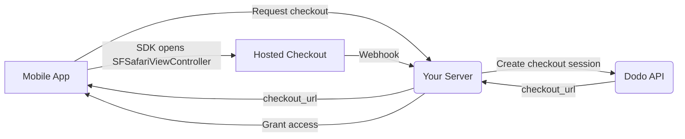

## 소개

Dodo Payments는 개발자가 iOS 앱에서 디지털 상품 및 서비스를 판매할 수 있도록 지원하며, 세금 준수, 통화 변환 및 지급과 같은 복잡한 측면을 처리합니다. 이 포괄적인 가이드는 SaaS 도구, 콘텐츠 구독 및 디지털 유틸리티를 위해 Dodo Payments를 iOS 앱에 통합하는 방법을 자세히 설명합니다.

## 개요

Dodo Payments는 귀하의 **Merchant of Record (MoR)** 역할을 하여 디지털 비즈니스의 중요한 측면을 관리합니다:

<Tabs>
<Tab title="What We Handle">
- 세금 징수 및 납부 (VAT, GST 및 기타 지역 세금)
- 정책 및 현지 결제 수단에 따른 글로벌 결제
- 통화 환전 및 외환
- 차지백 및 사기 방지
- 최종 고객 인보이스 및 영수증
- 지역 규정 준수
</Tab>

<Tab title="What You Get">
- 웹 및 모바일 플랫폼을 위한 통합 API
- 인앱 체크아웃 지원 (UPI, 카드, 지갑, BNPL)
- 글로벌 지급 지원 (Payoneer, Wise, 현지 은행 송금)
- 분석 및 보고서 대시보드
- 안전한 결제 처리
</Tab>
</Tabs>

## 사용 사례

<CardGroup cols={2}>
<Card title="Subscriptions" icon="repeat">
- 프리미엄 콘텐츠 또는 기능 액세스
- 유연한 옵션을 갖춘 정기 청구, 무료 평가판, 비례 요금 또는 업그레이드 및 다운그레이드
</Card>

<Card title="Courses and Learning" icon="graduation-cap">
- 강좌별 결제
- 번들 콘텐츠 패키지
- 평생 또는 갱신 가능한 라이선스
- 진행 상황 추적 통합
</Card>

<Card title="Digital Downloads" icon="download">
- 일회성 구매 (PDF, 음악, 도구)
- 디지털 자산 전달
- 라이선스 키 관리
</Card>

<Card title="SaaS Tools" icon="screwdriver-wrench">
- SaaS 구독
- 사용량 기반 청구
- 팀 및 엔터프라이즈 요금제
</Card>
</CardGroup>

## 통합 흐름

앱은
[iOS checkout SDK](/developer-resources/sdks/ios)를 사용해 Dodo의 호스팅 checkout을 열고, 이를
`SFSafariViewController`에 표시한 다음 typed result를 반환합니다.

<Warning>
checkout을 `WebView`에 임베드하지 말고 SDK를 사용하세요. Apple Pay는 실제 브라우저 표면에서만
사용할 수 있으므로, `WebView`를 사용하면 지갑
전환을 놓치게 됩니다. 또한 `WebView` 내부의 결제 흐름은 App
Store 심사 거절의 일반적인 원인입니다.
</Warning>

### 통합 단계

<Steps>
<Step title="Mobile App to Your Server">
앱은 로그인한 사용자의 세션 토큰으로 인증하여 자체 backend에 checkout URL을 요청합니다.
</Step>

<Step title="Your Server to Dodo API">
backend는 API key를 사용해 [checkout session](/developer-resources/checkout-session)을 생성하고
`checkout_url`를 앱에 반환합니다.

<Warning>
checkout session은 항상 서버에서 생성하고 앱에서는 생성하지 마세요. 앱 바이너리 내부에 포함된 API key는
번들에서 추출될 수 있습니다.
</Warning>
</Step>

<Step title="Mobile App Opens Checkout">
`checkout_url`를 `DodoCheckout.start(...)`에 전달하세요. SDK는 이를
`SFSafariViewController`에 표시하고, 고객이 checkout을 완료하거나 닫으면
typed result로 처리합니다.
</Step>

<Step title="Dodo Payments to Your Server">
결제가 성공하거나 subscription이 활성화되면 Dodo Payments가 webhook endpoint를 호출합니다.
</Step>

<Step title="Your Server Grants Access">
앱이 받은 result가 아니라 해당 webhook을 통해 구매한 콘텐츠의 잠금을 해제하세요. SDK result는
UI 힌트일 뿐 결제 증명이 아닙니다.
</Step>
</Steps>

<CardGroup cols={2}>
<Card title="iOS Checkout SDK" icon="apple" href="/developer-resources/sdks/ios">
  Swift용 설치 단계와 전체 `start(...)` 계약입니다.
</Card>
<Card title="Mobile Integration Guide" icon="mobile" href="/developer-resources/mobile-integration">
  전체 흐름과 Android, React Native, Flutter에 동일하게 적용되는 계약입니다.
</Card>
</CardGroup>

## 지역별 지원 여부

Dodo Payments는 Apple이 외부 결제를 명시적으로 허용하는 App Store 지역 또는 규제 기관이나 법원 명령에 따라 외부 결제가 의무화된 지역에서만 대체 인앱 구매 흐름을 사용할 수 있도록 지원합니다.

### 지원 지역

<AccordionGroup>
<Accordion title="United States">
현재 법원 명령과 Apple의 업데이트된 가이드라인이 허용하는 범위에서 지원됩니다.

- 법원이 명령한 특정 조항에 따라 사용 가능
- Apple의 법적 요건 준수 여부에 따름
- Apple의 구현 가이드라인을 따라야 함
</Accordion>

<Accordion title="European Union (EU) App Store">
Apple의 EU Alternative Terms 및 External Purchase Entitlement를 통해 지원됩니다.

- Apple의 EU Alternative Terms를 통해 활성화
- External Purchase Entitlement 승인이 필요함
- EU Digital Markets Act 요건을 준수해야 함
</Accordion>

<Accordion title="South Korea">
한국 전용 바이너리에 대해 StoreKit External Purchase Entitlement를 통해 지원됩니다.

- StoreKit External Purchase Entitlement를 통해 사용 가능
- 한국 전용 앱 바이너리가 필요함
- 한국 전기통신사업법을 준수해야 함
</Accordion>
</AccordionGroup>

<Warning>
어떤 storefront에서든 Dodo Payments를 활성화하기 전에 Apple의 지역별 entitlement 및 App Store Connect 요건을 항상 검토하고 준수하세요. 지원되지 않는 지역에서 대체 결제 흐름을 사용하면 앱이 거절되거나 삭제될 수 있습니다.
</Warning>

<Note>
서비스나 특정 콘텐츠 카테고리와 같은 일부 비즈니스 모델에서는 Apple이 인앱 구매(IAP) 사용을 전혀 요구하지 않을 수 있습니다. Dodo Payments는 이러한 모델도 지원합니다. 사용 사례에 IAP가 필수인지 판단하려면 항상 앱의 분류와 Apple의 최신 가이드라인을 확인하세요.
</Note>

### 자세히 알아보기

글로벌 정책, 법적 판례 및 App Store 수수료를 우회하기 위한 전략적 접근 방식에 대한 자세한 내용은 종합 가이드를 참조하세요:

<Card title="Bypassing App Store & Play Store Fees: A Strategic and Legal Playbook" icon="shield-check" href="/features/bypassing-app-store-fees">
최신 지역별 지침과 규정 준수 팁을 통해 대체 결제 흐름을 합법적으로 구현할 수 있는 지역과 방법을 알아보세요.
</Card>