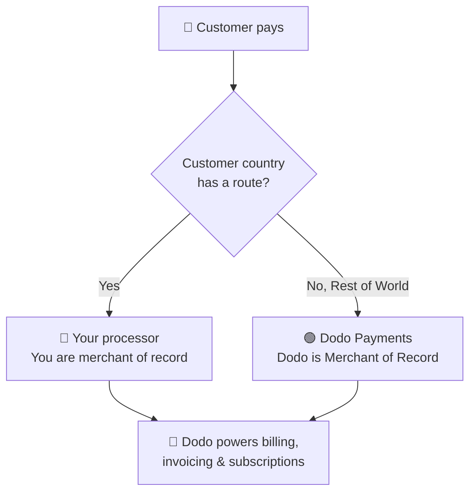

**Bring Your Own Processor (BYOP)**는 현재 **Stripe** 또는 **Adyen**과의 연결을 허용하고, 더 많은 프로세서를 곧 지원할 예정입니다. Dodo Payments를 통해 거래의 상위 항목: 제품, 구독, 라이선스 키 및 권한 엔진, 청구, 고객 포털 및 분석을 계속 사용할 수 있습니다.

국가별 고객을 기준으로 결제를 **자신의 프로세서**로 처리할지 또는 **Dodo Payments**를 통해 처리할지를 결정합니다. 명시적으로 경로를 설정하지 않은 국가는 자동으로 Dodo로 전환됩니다.

<CardGroup cols={2}>
<Card title="Route by geography" icon="globe">
특정 국가의 결제를 자신의 프로세서로 보내고, 나머지는 Dodo로 보내세요.
</Card>

<Card title="Keep your processor accounts" icon="plug">
기존의 Stripe 또는 Adyen 계정 및 관계를 계속 사용할 수 있습니다.
</Card>

<Card title="Stay the merchant of record" icon="building">
자신의 경로에서는 법적 판매자로서 세금, 분쟁 및 지급을 관리합니다.
</Card>

<Card title="One billing layer" icon="layer-group">
Dodo는 두 경로에서 제품, 구독, 청구서 및 분석을 제공합니다.
</Card>
</CardGroup>

## BYOP 대 Dodo 상점

BYOP를 활성화하면 각 결제가 어떻게 처리될지를 선택할 수 있습니다. 두 모델은 고객 국가에 따라 병행 운용할 수 있습니다.

| 기능 | Dodo 상점 | 자신의 프로세서 연결 |
|---------|----------------------------|--------------------------|
| 법적 판매자 | Dodo Payments | 귀사 |
| 세금 (VAT, GST 및 판매세) | 계산, 수집 및 신청 대행 | 등록, 수집 및 신고 |
| 결제 거절 및 사기 | Dodo에서 책임 및 보호 관리 | 자신의 프로세서 도구로 관리 |
| PCI 준수 | Dodo에서 관리 | 직접 관리 |
| 결제 방법 | 30개 이상의 글로벌 및 지역 화폐, 다중 화폐 | 카드 전용 (신용/직불) |
| 지급 | 전 세계 집계 지급 | 자신의 프로세서에서 직접 지급 |
| 설정 | 간단, 몇 분 만에 시작 가능 | 중간, 키 및 라우팅 추가 |
| 최적 | 글로벌 판매, 손쉬운 준수 | 기존 프로세서 및 지역 제어 |

<Tip>
일반적인 설정은 **하이브리드**입니다: 이미 등록된 법인 및 프로세서가 있는 국가(예: 본국 시장)를 자신의 프로세서로 라우팅하고 나머지 세계를 Dodo가 상점으로 처리하도록 합니다.
</Tip>

## 지원 프로세서

현재 **Stripe** 또는 **Adyen**을 연결할 수 있습니다. 더 많은 프로세서에 대한 지원이 곧 추가될 예정입니다.

<CardGroup cols={2}>
<Card title="Stripe" icon="stripe" />
<Card title="Adyen" icon="/images/logos/adyen.svg" />
</CardGroup>

<Note>
현재 자신의 프로세서를 통해 라우팅된 결제는 **신용 및 직불 카드만** 지원합니다. 곧 더 많은 결제 방법이 추가될 예정입니다.
</Note>

<Warning>
**Stripe** 및 **Adyen** 모두 계정에서 **원시 카드 API 액세스**를 활성화해야 합니다. 이 기능을 활성화하려면 프로세서 지원에 문의하여 설정해야 합니다. 세부사항은 [Stripe](/features/byop/stripe) 및 [Adyen](/features/byop/adyen) 가이드를 참조하세요.
</Warning>

<Info>
연결은 **환경별**로 구성됩니다. **테스트 모드**(샌드박스)에서 연결한 프로세서는 **라이브 모드**(프로덕션)과 별개입니다; 시작 전에 테스트를 원하는 경우 둘 다 설정하세요. 설정 마법사는 대시보드의 글로벌 테스트/라이브 토글에 따릅니다.
</Info>

## BYOP 설정

대시보드에서 **설정 → BYOP**를 열고 *자신의 프로세서 연결* 카드에서 **구성**을 선택하여 설정 마법사를 실행하세요.

<Frame>

</Frame>

<Steps>
<Step title="Choose a payment processor">
연결할 프로세서를 선택하고, **Stripe** 또는 **Adyen**을 선택 후 계속하세요.

<Frame>

</Frame>
</Step>

<Step title="Connect your account">
여러 개의 동일한 프로세서 계정을 가지고 있는 경우 **제공자 이름**(예: *Stripe US* 및 *Stripe UK*)을 입력하고, 프로세서의 **비밀 키**(Stripe의 경우 `sk_...` 키)를 입력하세요.

**Adyen**의 경우 **Merchant Account** 식별자도 입력하세요.

<Frame>

</Frame>

저장은 연결을 생성하고 그에 고유한 **웹훅 엔드포인트**를 생성합니다. 해당 URL을 프로세서의 대시보드에 웹훅 대상으로 추가한 다음 **웹훅 서명 비밀**을 Dodo에 다시 입력하여 완료합니다:

- **Stripe**: 추가한 웹훅 엔드포인트에서 서명 비밀을 붙여넣습니다.
- **Adyen**: *고객 영역 → 웹훅*에서 **HMAC 키**를 붙여넣습니다.

<Note>
비밀 키는 안전하게 저장되어 있으며 저장 후에는 볼 수 없거나 변경할 수 없습니다. Dodo에서 생성한 웹훅 URL만을 프로세서에 구성; 기본 인프라와 직접 상호작용하지 않습니다.
</Note>

<Tip>
저장 후 **연결 확인**을 사용하여 프로세서에 대한 테스트 호출을 실행하고 키와 웹훅 비밀이 유효한지 확인한 후 라이브로 전환하세요.
</Tip>
</Step>

<Step title="Configure payment routing">
고객 국가를 프로세서에 매핑하는 **라우팅 규칙**을 추가하십시오. 각 국가는 정확히 하나의 프로세서에 라우팅할 수 있습니다.

- **자신의 프로세서**는 지정된 국가의 결제를 처리합니다.
- **Dodo Payments**는 **나머지 세계**(명시적으로 라우팅하지 않은 모든 국가)를 상점으로 처리합니다.

<Frame>

</Frame>

**라우트 추가**를 사용하여 하나 이상의 국가를 프로세서에 할당합니다.

<Frame>

</Frame>

<Info>
**라우팅 가이드라인**
- "나머지 세계"는 위에서 열거되지 않은 모든 나라를 포괄합니다.
- Dodo Payments 터미널은 자동으로 준수 및 세금을 처리합니다.
- 자신의 프로세서의 경우 필요한 경우 별도의 세금 구성이 필요합니다.
</Info>
</Step>

<Step title="Configure invoice information">
자신의 프로세서를 통해 라우팅된 결제에 대해서는 **당신**이 송장의 판매자가 됩니다. 송장에서 표시될 사업세부사항을 입력하십시오:

- **등록된 사업 이름**(필수)
- **세금 ID**(EIN, SSN 등; 선택 사항으로, 미국 EIN 형식 유효성 검사가 가능)
- **진술 설명**(필수): 고객이 은행 명세서에서 보는 내용(5~22자)
- **등록된 사업 주소**(필수): 입력을 시작하여 검색 및 주소 자동 완성을 사용할 수 있습니다.
- **개인정보 보호 정책** 및 **서비스 약관** 링크(필수)

실시간 **송장 헤더 미리보기**를 통해 세부사항이 어떻게 나타나는지 확인할 수 있습니다. 이러한 세부사항은 **자신의 프로세서**를 통해 처리된 경로의 송장에만 적용됩니다; Dodo 경로 결제에서는 Dodo의 상점 정보가 계속 사용됩니다.

<Frame>

</Frame>
</Step>

<Step title="Review and finish">
프로세서 연결, 라우팅 규칙 및 송장 세부사항을 검토하세요. 라우팅 및 청구 세부 사항이 올바른지 확인한 후 **설정 완료**를 선택하세요.

<Frame>

</Frame>
</Step>
</Steps>

구성 후 BYOP 카드에는 **설정 편집**이 표시되며 **라우팅 규칙 편집**을 사용하여 언제든지 MoR 전용으로 돌아갈 수 있습니다.

<Frame>

</Frame>

## 라우팅 작동 방식

라우팅은 결제 시 **고객의 국가**로 결정됩니다. 동일한 논리가 일회성 결제, 체크아웃 세션 및 구독 등록에 모두 적용됩니다. 갱신 시 구독을 생성한 프로세서를 재사용합니다(자세한 내용은 [Subscriptions](#subscriptions)을 참조하세요).

**자신의 프로세서**에서 처리되는 경로에서:

- 결제는 **귀하의** 프로세서 계정에서 청구 통화로 처리됩니다.
- Dodo는 해당 경로에서 **세금을 계산하거나 수집하지 않습니다**; 세금은 본인이 책임을 져야 합니다.
- 송장은 설정한 **비즈니스 세부사항 및 진술 설명**을 사용하며 상점 참조가 없습니다.
- 지급은 **직접 귀하에게** 프로세서에서 정산됩니다; Dodo의 지갑을 거치지 않습니다.

**Dodo**가 처리하는 경로에서는 Dodo가 귀사의 완전한 서비스 상점으로서 세금, 준수, 분쟁, 사기 및 집계된 지급을 처리합니다.

## 구독

구독은 생성된 프로세서에 그대로 남아 있습니다. 갱신 시 Dodo는 구독 구매에 사용된 동일한 결제 프로세서에서 결제를 수행하며, 그에 저장된 결제 메커니즘을 재사용합니다. 라우팅 규칙은 매 갱신 시 다시 평가되지 않습니다.

## 어떤 프로세서가 결제를 처리했는지 확인하기

BYOP가 구성되면 **결제** 및 **분쟁** 테이블에 각 행 옆에 프로세서 아이콘(Stripe, Adyen, 또는 Dodo)이 표시되며, 결제 및 분쟁 세부사항 페이지에는 **결제 프로세서** 필드가 포함되어 있어 어떤 경로가 특정 거래를 처리했는지 항상 알 수 있습니다.

## 환불, 분쟁 및 지급

<Tabs>
<Tab title="Refunds">
환불은 Dodo 대시보드에서 통상적으로 시작합니다. 자신의 프로세서를 통해 라우팅된 결제에 대한 환불은 해당 프로세서에서 실행됩니다; Dodo에서 라우팅된 결제는 Dodo에서 환불 처리를 수행합니다.
</Tab>

<Tab title="Disputes">
Dodo 대시보드는 **Dodo가 처리한** 결제의 분쟁만을 표시합니다.

> 여기에는 Dodo가 처리한 분쟁만 표시됩니다. 자신의 프로세서(예: Stripe)에서 발생한 분쟁은 해당 프로세서의 대시보드에서 관리합니다.

증거 업로드, 수락 및 도전 동작은 Dodo가 처리한 분쟁에 대해서만 사용 가능합니다. 자신의 프로세서에서 발생한 분쟁은 해당 프로세서의 자체 도구로 처리합니다.
</Tab>

<Tab title="Payouts">
자신의 프로세서를 사용하는 경로에 대한 지급은 **직접** 해당 프로세서에서 이루어지며, Dodo에는 표시되지 않습니다.

> 여기에는 Dodo 지급만 표시됩니다. 자신의 프로세서에서 이루어진 지급은 해당 프로세서에서 발생합니다.

Dodo 지급(나머지 세계 상점 거래량에 대한)은 표준 [지급 구조](/features/payouts/payout-structure)를 따릅니다.
</Tab>
</Tabs>

## 분석

수익, 세금 및 구독 분석에는 **두 경로**가 모두 포함되어 귀하의 청구 내역을 전체적으로 볼 수 있습니다. 분쟁 및 지급 위젯은 **Dodo에서 처리된** 활동만을 표시하며, 귀하의 프로세서 대시보드의 활동을 나타내는 배너가 표시됩니다.

## 청구 수수료

Dodo는 귀하의 프로세서를 통해 라우팅된 결제에 대해 작은 **BYOP 청구 수수료**를 적용합니다. 이는 Dodo가 여전히 해당 거래에서 제품, 구독, 청구 및 분석을 제공하기 때문입니다. 이는 귀하의 잔액 장부에 `byop_fee` 항목으로 표시됩니다. 기본 요율은 **0.5%**이며, BYOP를 계정에 활성화할 때 정확한 요율이 확인됩니다. 자세한 내용은 [문의](mailto:founders@dodopayments.com)하십시오.

## 자주 묻는 질문

<AccordionGroup>
<Accordion title="Which processors can I connect?">
현재 Stripe와 Adyen을 지원하며, 더 많은 프로세서에 대한 지원이 곧 제공될 예정입니다. 둘 다 계정에서 **원시 카드 API 액세스**를 활성화해야 하며, 이를 설정하려면 프로세서 지원에 문의해야 합니다. 세부사항은 [Stripe](/features/byop/stripe) 및 [Adyen](/features/byop/adyen) 가이드를 참조하십시오.
</Accordion>

<Accordion title="Can I route only some countries to my processor?">
예. 특정 국가를 자신의 프로세서에 할당하고 나머지를 **나머지 세계**로 두면 Dodo가 상점으로 처리합니다. 각 국가는 정확히 하나의 프로세서에 라우팅됩니다.
</Accordion>

<Accordion title="Who is the merchant of record on BYOP routes?">
자신입니다. 자신의 프로세서에서 처리된 경로에서는 법적 판매자로서 세금, 결제 거절, PCI 준수 및 지급을 책임집니다.
</Accordion>

<Accordion title="Does Dodo calculate tax on my processor's routes?">
아니요. 자신의 프로세서를 통해 처리된 경로에서는 세금이 계산되거나 수집되지 않습니다; 해당 거래의 세금을 직접 관리합니다. Dodo는 Dodo 라우팅(MoR) 결제의 세금을 계속 처리합니다.
</Accordion>

<Accordion title="What happens to active subscriptions if I disable a processor?">
해당 프로세서에서 갱신이 실패하며 대시보드에 실패한 결제로 표시됩니다. 프로세서를 다시 활성화하여 갱신을 복원하세요.
</Accordion>
</AccordionGroup>

## 시작하기

<Card title="What is Merchant of Record?" icon="building-columns" href="/features/mor-introduction">
Dodo의 완전 서비스 상점 모델이 작동하는 방식을 이해하세요.
</Card>
