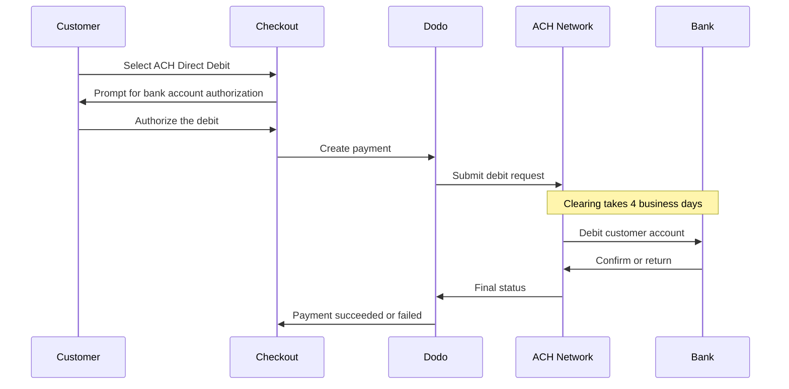

ACH Direct Debit을 사용하면 미국 고객이 카드 대신 은행 계좌에서 직접 결제할 수 있습니다. Automated Clearing House 네트워크를 통해 처리되며, 일회성 결제를 위한 USD 체크아웃에서 제공됩니다.

## ACH Direct Debit을 제공하는 이유

<CardGroup cols={3}>
<Card title="Lower Processing Cost" icon="piggy-bank">
은행 출금은 일반적으로 카드 결제보다 처리 비용이 저렴하며, 특히 고액 주문에서 그 차이가 큽니다.
</Card>

<Card title="No Card Required" icon="building-columns">
은행 계좌 결제를 선호하거나 대규모 구매에 카드를 사용하고 싶어 하지 않는 미국 고객에게 도달할 수 있습니다.
</Card>

<Card title="Higher Value Orders" icon="chart-line">
주문 금액이 클수록 카드 대비 비용 절감 효과가 커지므로 ACH는 대규모 일회성 구매에 적합합니다.
</Card>
</CardGroup>

## 개요

| 세부 정보 | 값 |
| :----- | :---- |
| **청구 통화** | USD |
| **지원 국가** | 미국 |
| **구독** | 아니요 |
| **최소 금액** | $0.50 |
| **정산** | 영업일 기준 4일 |

<Warning>
ACH Direct Debit은 즉시 처리되지 않습니다. 결제가 확인되기까지 **영업일 기준 4일**이 걸리므로, 승인을 정산으로 간주하지 마세요. 결제가 succeeded 상태에 도달한 후에만 상품이나 서비스를 제공하세요.
</Warning>

## 작동 방식



## 고객 경험

1. 고객이 체크아웃에서 ACH Direct Debit을 선택합니다
2. 고객이 미국 은행 계좌에서 출금하는 것을 승인합니다
3. 결제가 ACH 네트워크로 제출되고 processing 상태로 전환됩니다
4. 이후 영업일 동안 청산이 완료됩니다
5. 결제가 succeeded 상태로 전환되거나 은행이 반환하면 실패합니다

<Info>
청산은 비동기적으로 진행되므로 체크아웃 리디렉션이 아니라 [webhooks](/developer-resources/webhooks)를 통해 최종 결과를 확인하세요. 리디렉션이 성공했다는 것은 고객이 출금을 승인했다는 의미일 뿐입니다.

출금이 제출되면 결제는 `payment.processing`를 생성하고, 청산이 완료되면 `payment.succeeded` 또는 `payment.failed`를 생성합니다. `payment.succeeded`인 경우에만 상품이나 서비스를 제공해도 안전합니다.
</Info>

## 제공 조건

다음 조건을 모두 충족하면 체크아웃에 ACH Direct Debit이 표시됩니다:

- **청구 통화**가 `USD`입니다
- **청구 국가**가 `US`입니다
- 거래가 **일회성 결제**입니다

<Note>
ACH Direct Debit은 구독에 사용할 수 없습니다. 며칠이 걸리는 청산 기간은 반복 청구 주기에 적합하지 않습니다. 반복 결제에는 카드 또는 구독을 지원하는 다른 수단을 사용하세요. 자세한 내용은 [Payment Methods 개요](/features/payment-methods)를 참조하세요.
</Note>

## 구성

```javascript
const session = await client.checkoutSessions.create({
  product_cart: [{ product_id: 'pdt_123', quantity: 1 }],
  allowed_payment_method_types: ['ach', 'credit', 'debit'],
  billing_currency: 'USD',
  billing_address: {
    country: 'US',
    zipcode: '94102'
  },
  return_url: 'https://example.com/success'
});
```

<Note>
ACH Direct Debit에는 **USD** 청구 통화와 **미국** 청구 주소가 필요합니다. 다른 통화로 가격을 표시하는 경우 [Adaptive Currency](/features/adaptive-currency)를 활성화하면 미국 고객에게 USD로 청구되고 ACH를 사용할 수 있습니다.
</Note>

## API Method Type

| Type | Method | Country |
| :--- | :----- | :------ |
| `ach` | ACH Direct Debit | 미국 |

## 환불 및 분쟁

ACH 결제의 환불 및 분쟁에는 다른 모든 결제 수단과 동일한 API 및 대시보드 흐름을 사용하므로, ACH 전용 처리를 구현할 필요가 없습니다.

<Warning>
ACH 결제는 처리가 완료된 것처럼 보인 후에도 고객의 은행에서 반환될 수 있으므로, 원래 결제가 succeeded 상태에 도달하기 전에는 환불을 진행하지 마세요.
</Warning>

## 테스트

<Steps>
<Step title="Enable test mode">
Dodo Payments 테스트 API 키를 사용하세요.
</Step>

<Step title="Set currency and billing address">
청구 통화를 `USD`로 설정하고 청구 주소의 국가를 `US`로 설정하세요.
</Step>

<Step title="Include `ach` in allowed methods">
`allowed_payment_method_types`에 `ach`를 전달하거나, 적격한 모든 수단을 표시하려면 필드를 완전히 생략하세요.
</Step>

<Step title="Enter the test bank details">
아래 테스트 라우팅 번호와 계좌 번호 조합 중 하나를 입력한 다음, webhook handler가 최종 결제 상태를 수신하는지 확인하세요.
</Step>
</Steps>

### 테스트 은행 계좌

고객은 체크아웃에서 계좌 번호와 라우팅 번호를 직접 입력합니다. 테스트 모드에서는 라우팅 번호 `110000000`와 아래 계좌 번호 중 하나를 사용하여 특정 결과를 강제로 생성하세요.

| 계좌 번호 | 라우팅 번호 | 동작 |
| :------------- | :------------- | :------- |
| `000123456789` | `110000000` | 결제가 성공합니다. |
| `000222222227` | `110000000` | 잔액 부족으로 결제가 실패합니다. |
| `000111111113` | `110000000` | 계좌가 해지되어 결제가 실패합니다. |
| `000111111116` | `110000000` | 계좌를 찾을 수 없어 결제가 실패합니다. |
| `000333333335` | `110000000` | 계좌에서 출금이 승인되지 않아 결제가 실패합니다. |
| `000444444440` | `110000000` | 통화가 유효하지 않아 결제가 실패합니다. |
| `000555555559` | `110000000` | 결제가 성공한 후 분쟁이 발생합니다. |
| `000000000009` | `110000000` | 결제가 계속 processing 상태로 남습니다. 보류 상태 UI를 테스트하는 데 유용합니다. |

<Note>
대부분의 테스트 결제는 실제 청산 기간보다 훨씬 빠르게 최종 상태에 도달하므로, 통합을 확인하기 위해 며칠을 기다릴 필요가 없습니다. 예외는 processing 상태로 유지되도록 설계된 `000000000009`입니다.
</Note>

## 모범 사례

<AccordionGroup>
<Accordion title="Don't fulfill on authorization">
ACH 승인은 결제가 아닙니다. 고객의 은행에서 출금을 반환할 수 있으므로, 액세스 권한을 부여하거나 상품을 배송하기 전에 결제가 succeeded 상태에 도달할 때까지 기다리세요.
</Accordion>

<Accordion title="Set customer expectations at checkout">
은행 결제는 즉시 청산되지 않는다고 고객에게 안내하세요. 이렇게 하면 주문이 아직 pending 상태인 이유를 묻는 지원 요청을 줄일 수 있습니다.
</Accordion>

<Accordion title="Provide card fallbacks">
제품에 즉시 액세스해야 하는 고객이 더 빠른 수단을 선택할 수 있도록 `ach`와 함께 `credit` 및 `debit`를 항상 포함하세요.
</Accordion>

<Accordion title="Use ACH for high-value one-time purchases">
ACH의 비용 절감 효과는 주문 금액이 클수록 커지므로, 소액 구매보다 대규모 일회성 구매에서 가장 유용합니다.
</Accordion>
</AccordionGroup>

## 문제 해결

<AccordionGroup>
<Accordion title="ACH not appearing at checkout">
**확인할 항목:**
1. 청구 통화가 `USD`로 설정되어 있나요?
2. 고객의 청구 국가가 `US`인가요?
3. `allowed_payment_method_types`에 `ach`가 포함되어 있나요?
4. 일회성 결제인가요? ACH는 구독에 제공되지 않습니다.

**해결 방법:** `allowed_payment_method_types`를 일시적으로 제거하여 모든 적격 수단을 확인한 다음, API 요청에서 청구 통화와 주소 국가를 검증하세요.
</Accordion>

<Accordion title="ACH not appearing on a subscription checkout">
**원인:** ACH Direct Debit은 일회성 결제에만 제공됩니다.

**해결 방법:** 반복 청구에는 카드 또는 구독을 지원하는 다른 수단을 사용하세요.
</Accordion>

<Accordion title="Payment stuck in processing">
**원인:** 이는 예상된 동작입니다. ACH 결제는 카드 결제보다 훨씬 긴 전체 청산 기간 동안 processing 상태로 유지됩니다.

**해결 방법:** 최종 webhook을 기다리세요. 결제를 재시도하지 마세요. 재시도하면 고객에게 두 번 출금될 수 있습니다.
</Accordion>

<Accordion title="Payment failed after initially succeeding at checkout">
**원인:** 고객의 은행이 출금을 반환했습니다. 일반적으로 잔액 부족 또는 계좌 해지가 원인입니다.

**해결 방법:** 결제를 실패로 처리하고 고객에게 다른 결제 수단으로 다시 시도하도록 안내하세요. 이러한 문제를 방지하려면 항상 succeeded 상태를 기준으로 상품이나 서비스 제공 여부를 결정하세요.
</Accordion>
</AccordionGroup>

## 관련 페이지

<CardGroup cols={2}>
<Card title="Payment Methods Overview" icon="credit-card" href="/features/payment-methods">
지원되는 모든 결제 수단을 확인하세요.
</Card>

<Card title="Adaptive Currency" icon="globe" href="/features/adaptive-currency">
통화 지원 및 자동 변환.
</Card>

<Card title="Checkout Guide" icon="book" href="/developer-resources/checkout-session">
체크아웃 구현 전체 가이드.
</Card>

<Card title="Webhooks" icon="webhook" href="/developer-resources/webhooks">
지연된 결제 확인을 비동기적으로 처리하세요.
</Card>
</CardGroup>
