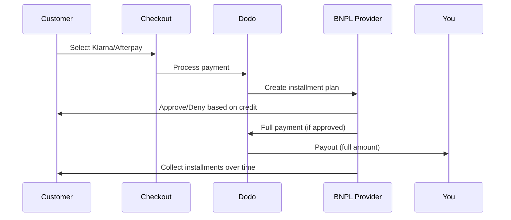

Buy Now Pay Later (BNPL)은 고객이 구매를 무이자 할부로 나눌 수 있게 하여 평균 주문 금액을 20~50% 증가시키고 적격 거래의 전환율을 10~30% 높입니다.

## BNPL을 제공해야 하는 이유

<CardGroup cols={3}>
<Card title="Higher AOV" icon="chart-line">
고객은 결제를 시간을 두고 나눌 수 있을 때 더 많은 금액을 지출합니다. 평균 주문 금액이 20~50% 증가합니다.
</Card>

<Card title="Better Conversion" icon="percent">
결제 단계의 마찰을 제거합니다. 고가 상품의 경우 전환율이 10~30% 향상됩니다.
</Card>

<Card title="Zero Risk" icon="shield-check">
BNPL 제공업체가 신용 위험과 추심을 처리합니다. 가맹점은 선지급을 받습니다.
</Card>
</CardGroup>

## 지원되는 공급업체

### Klarna

| 특징 | 세부사항 |
| :------ | :------ |
| **이용 가능 지역** | 미국 + 19개 유럽 국가 |
| **통화** | USD, EUR, GBP, DKK, NOK, SEK, CZK, RON, PLN, CHF |
| **최소 금액** | $50.01 (또는 동등한 금액) |
| **구독** | 예 |

**지원 국가:** 오스트리아, 벨기에, 체코 공화국, 덴마크, 핀란드, 프랑스, 독일, 그리스, 아일랜드, 이탈리아, 네덜란드, 노르웨이, 폴란드, 포르투갈, 루마니아, 스페인, 스웨덴, 스위스, 영국, 미국

**결제 옵션:**
- **Pay in 4** — 4회의 무이자 결제로 분할
- **Pay in 30 days** — 30일 뒤 일시불
- **Financing** — 장기 할부 계획

### Afterpay (Clearpay)

| Feature | Details |
| :------ | :------ |
| **Availability** | 미국, 영국 |
| **Currencies** | USD, GBP |
| **Minimum** | $50.01 (또는 해당 금액) |
| **Subscriptions** | 없음 |

**결제 옵션:**
- **Pay in 4** — 2주마다 4회의 무이자 결제

<Note>
영국에서는 Afterpay가 "Clearpay"로 운영되지만 같은 API 유형을 사용합니다 (`afterpay_clearpay`).
</Note>

### Billie

| Feature | Details |
| :------ | :------ |
| **Availability** | 전 세계 |
| **Currencies** | GBP |
| **Minimum** | 없음 |
| **Subscriptions** | 없음 |

**Billie 소개:**
Billie는 B2B 전용 Buy Now Pay Later 솔루션으로 기업이 고객에게 유연한 결제 조건을 제공할 수 있게 합니다. 구매자가 송장 기반 결제 옵션이 필요한 기업 간 거래용으로 설계되었습니다.

**결제 옵션:**
- **Invoice Payment** — 합의된 결제 조건 내 결제
- **Flexible Terms** — 기업에 적합한 유연한 결제 일정

### Sunbit

| 기능 | 세부사항 |
| :------ | :------ |
| **사용 가능 지역** | 미국 |
| **통화** | USD |
| **최소 금액** | $60.00 |
| **최대 금액** | $19,999.00 |
| **구독** | 아니요 |

**결제 옵션:**
- **할부 금융** — 구매를 관리 가능한 월별 할부로 분할

## 구성

### API 메소드 타입

| 타입 | 제공자 |
| :--- | :------- |
| `klarna` | Klarna |
| `afterpay_clearpay` | Afterpay / Clearpay |
| `billie` | Billie (B2B) |
| `sunbit` | Sunbit |

### 예시

```javascript
const session = await client.checkoutSessions.create({
  product_cart: [{ product_id: 'prod_123', quantity: 1 }],
  allowed_payment_method_types: [
    'klarna',
    'afterpay_clearpay',
    'credit',
    'debit'
  ],
  customer: {
    email: 'customer@example.com',
    name: 'Jane Smith'
  },
  billing_address: {
    country: 'US',
    zipcode: '10001'
  },
  return_url: 'https://example.com/success'
});
```

<Warning>
`credit`와 `debit`를 항상 예비로 포함하세요. 모든 고객이 BNPL에 적합하지 않으며, 제공자의 최소 금액보다 낮은 거래는 해당되지 않습니다.
</Warning>

## 거래 금액 제한

각 BNPL 제공자는 자체 최소 (그리고 때로는 최대) 거래 금액을 가지고 있습니다:

| 제공자 | 최소 금액 | 최대 금액 |
| :------- | :------ | :------ |
| Klarna | $50.01 | — |
| Afterpay | $50.01 | — |
| Sunbit | $60.00 | $19,999.00 |

이 임계값을 벗어난 거래:
- BNPL 옵션이 결제 화면에 나타나지 않습니다
- 오류는 발생하지 않습니다 — 옵션이 단순히 표시되지 않습니다
- 카드 결제는 계속 가능합니다

이것은 예상된 동작입니다. 제품 가격이 해당 제공자의 지원 범위 내에 속하지 않을 가능성이 높은 경우 `allowed_payment_method_types`에 BNPL 방법을 포함하지 마세요.

## 할부가 작동하는 방식



**핵심 사항:**
- BNPL 제공자로부터 **전액을 미리 받습니다**
- BNPL 제공자가 **신용 위험과 징수**를 처리합니다
- 고객은 제공자에게 직접 **4회 할부**로 지불합니다 (일반적으로)
- 할부 실패로 인한 **차지백이 없습니다** — 이는 제공자의 위험입니다

## 테스트

### Klarna 테스트 데이터

테스트 모드에서 이 세부사항을 사용하세요:

| 필드 | 승인됨 | 거부됨 |
| :---- | :------- | :----- |
| **생년월일** | 07-10-1970 | 07-10-1970 |
| **이름** | Test | Test |
| **성** | Person-us | Person-us |
| **이메일** | customer@email.us | customer+denied@email.us |
| **거리** | Amsterdam Ave | Amsterdam Ave |
| **집 번호** | 509 | 509 |
| **도시** | New York | New York |
| **주** | New York | New York |
| **우편 번호** | 10024-3941 | 10024-3941 |
| **전화** | +13106683312 | +13106354386 |

<Note>
거래는 선택 사항으로 Klarna를 나타내기 위해 최소 $50이어야 합니다.
</Note>

### Afterpay 테스트

<Steps>
<Step title="Select Afterpay">
체크아웃에서 Afterpay를 선택하고 결제 버튼을 클릭하세요.
</Step>

<Step title="Successful payment">
유효한 이메일과 배송 주소를 사용하세요.
</Step>

<Step title="Failed authentication">
실패를 테스트하려면 리디렉션 페이지에서 Afterpay 모달을 닫으세요. 결제 상태가 `requires_payment_method`로 전환됩니다.
</Step>
</Steps>

### Sunbit 테스트

<Steps>
<Step title="Set billing country and currency">
체크아웃 세션에 `billing_address.country`를 `US`로 설정하고 `billing_currency`를 `USD`로 설정하세요.
</Step>

<Step title="Use a qualifying amount">
거래 금액을 **$60.00과 $19,999.00** 사이로 설정하세요. Sunbit는 이 범위를 벗어나면 표시되지 않습니다.
</Step>

<Step title="Select Sunbit">
체크아웃에서 Sunbit를 선택하고 Sunbit 모달에서 금융 신청 흐름을 완료하세요.
</Step>

<Step title="Test failure">
거부된 신청을 시뮬레이트하려면 흐름을 완료하기 전에 Sunbit 모달을 닫으세요. 결제가 `requires_payment_method`로 전환됩니다.
</Step>
</Steps>

<Note>
Sunbit는 $60.00에서 $19,999.00 사이의 거래 금액을 가진 미국 고객에게만 제공됩니다.
</Note>

## 모범 사례

<AccordionGroup>
<Accordion title="Target high-ticket items">
BNPL은 $100-$1000 제품에 가장 적합합니다. "할부로 지불"이라는 가치 제안은 이 범위에서 가장 매력적입니다.
</Accordion>

<Accordion title="Show installment amounts">
"$25의 4회 결제"는 "$100을 Klarna로 결제"보다 더 매력적입니다. 가능한 경우 결제당 금액을 표시하세요.
</Accordion>

<Accordion title="Don't force BNPL for low-value products">
$50 미만에서는 BNPL이 나타나지 않습니다. $100 미만에서는 대부분의 고객이 카드를 선호합니다. BNPL 프로모션은 고가의 품목에 중점을 두세요.
</Accordion>

<Accordion title="Collect billing address">
BNPL 제공자는 신용 검사를 위해 청구 정보를 요구합니다. 체크아웃 시 전체 주소 세부사항을 수집하세요.
</Accordion>

<Accordion title="Set clear expectations">
고객은 Klarna/Afterpay와의 신용 계약에 들어간다는 것을 이해해야 하며, 이는 귀하와의 계약이 아닙니다.
</Accordion>
</AccordionGroup>

## 제한 사항

### 구독 없음
BNPL 결제 수단은 **정기 결제를 지원하지 않습니다**. 구독 제품의 경우 카드 또는 다른 정기 호환 가능한 방법을 사용하세요.

### 신용 기반 승인
BNPL 제공자는 즉각적인 신용 검사를 수행합니다. 모든 고객이 승인되지 않을 수 있습니다. 승인율은 다음에 따라 다릅니다:
- 제공자와의 고객 신용 기록
- 거래 금액
- 고객 위치

### 통화 및 국가 매핑

각 통화는 해당 지역에 제한됩니다:

| 통화 | 지원 국가 |
| :------- | :------------------ |
| **USD** | 미국만 지원 |
| **EUR** | 모든 지원 유럽 국가 (오스트리아, 벨기에, 체코, 덴마크, 핀란드, 프랑스, 독일, 그리스, 아일랜드, 이탈리아, 네덜란드, 노르웨이, 폴란드, 포르투갈, 루마니아, 스페인, 스웨덴, 스위스) |
| **GBP** | 영국 및 모든 지원 유럽 국가 |

Klarna가 지원하는 기타 통화 (DKK, NOK, SEK, CZK, RON, PLN, CHF)는 해당 국가에서 작동합니다.

<Info>
예를 들어, USD 거래는 미국 내 고객에게만 BNPL 옵션을 표시합니다. EUR 거래는 모든 지원 유럽 국가에서 BNPL 옵션을 표시합니다. GBP 거래는 영국 및 모든 지원 유럽 국가의 고객에게 BNPL 옵션을 표시합니다.
</Info>

| 제공자 | 지원 통화 |
| :------- | :------------------- |
| Klarna | USD, EUR, GBP, DKK, NOK, SEK, CZK, RON, PLN, CHF |
| Afterpay | USD (미국), GBP (영국) |
| Sunbit | USD (미국) |

## 문제 해결

<AccordionGroup>
<Accordion title="BNPL not appearing at checkout">
**확인:**
1. 거래 금액이 제공자의 지원 범위 내에 있습니까? (Klarna/Afterpay: 최소 $50.01; Sunbit: $60.00–$19,999.00)
2. 고객 위치가 지원 국가인가요?
3. BNPL 제공자가 지원하는 통화인가요?
4. `allowed_payment_method_types`에 BNPL 방법이 포함되어 있습니까?

**솔루션:** 가장 흔히 거래 금액이 최소보다 낮거나 최대보다 높습니다. 금액이 제공자의 지원 범위 내에 포함되는지 확인하세요.
</Accordion>

<Accordion title="Customer denied by BNPL provider">
**원인:**
- 제공자와의 신용 기록 부족
- 너무 많은 활성 할부 플랜
- 신원 확인 실패

**솔루션:** 이는 일부 고객에게 예상되는 상황입니다. 카드 대체 수단이 제공되도록 하세요. 특정 거부 사유를 노출하지 마세요.
</Accordion>

<Accordion title="Payment stuck in pending">
**원인:** 고객이 BNPL 제공자와의 인증 흐름을 완료하지 않았습니다.

**솔루션:** 결제가 시간 초과되어 실패합니다. 고객은 재시도하거나 다른 방법을 사용할 수 있습니다.
</Accordion>
</AccordionGroup>

## 관련 페이지

<CardGroup cols={2}>
<Card title="Payment Methods Overview" icon="credit-card" href="/features/payment-methods">
모든 지원 결제 방법을 참조하세요.
</Card>

<Card title="Checkout Guide" icon="book" href="/developer-resources/checkout-session">
완벽한 체크아웃 구현 가이드.
</Card>

<Card title="Testing Process" icon="flask" href="/miscellaneous/testing-process">
모든 결제 방법의 테스트 데이터.
</Card>

<Card title="Adaptive Currency" icon="globe" href="/features/adaptive-currency">
통화 지원 및 변환.
</Card>
</CardGroup>