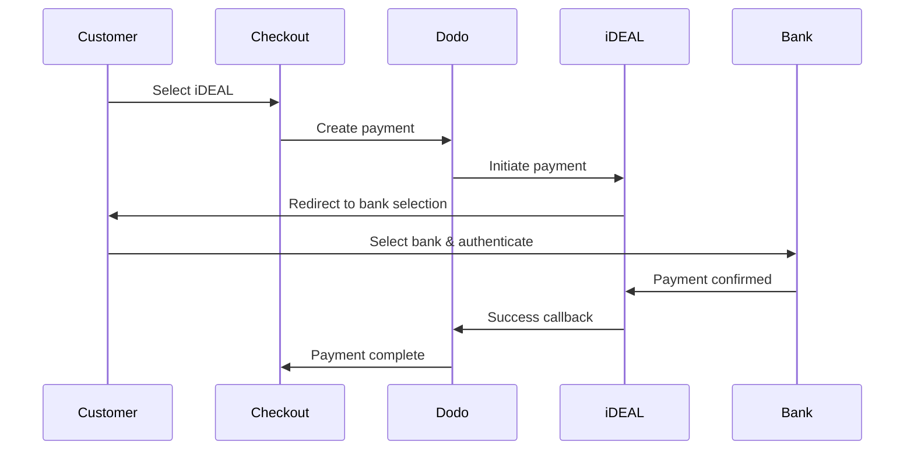
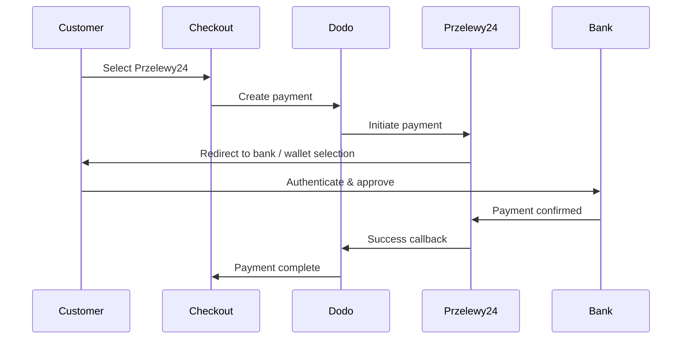

유럽 고객들은 은행 시스템과 통합된 지역 결제 수단을 강하게 선호합니다. 이러한 수단을 제공하면 목표 시장에서 전환율을 20-40% 높일 수 있습니다.

## 지역 유럽 결제 수단이 중요한 이유는?

<CardGroup cols={3}>
<Card title="Higher Conversion" icon="chart-line">
iDEAL는 네덜란드 온라인 결제의 약 60%를 점유합니다. 제공하지 않으면 고객을 잃게 됩니다.
</Card>

<Card title="Lower Fraud" icon="shield-check">
은행 인증 결제는 사기율이 거의 제로이며 청구 취소가 없습니다.
</Card>

<Card title="Real-Time Settlement" icon="bolt">
대부분의 유럽 결제 방식은 즉각적인 결제 확인을 제공합니다.
</Card>
</CardGroup>

## 지원되는 방법

| Method | Country | Market Share | Currency | Subscriptions |
| :----- | :------ | :----------- | :------- | :-----------: |
| **iDEAL** | Netherlands | ~60% | EUR | No |
| **Bancontact** | Belgium | ~50% | EUR | No |
| **EPS** | Austria | ~30% | EUR | No |
| **Multibanco** | Portugal | ~40% | EUR | No |
| **Przelewy24 (P24)** | Poland | ~30% | PLN | No |

## iDEAL (네덜란드)

iDEAL은 네덜란드에서 우세한 온라인 결제 수단으로, 모든 주요 네덜란드 은행에 직접 연결됩니다.

### 작동 방식



### 지원 은행

모든 주요 네덜란드 은행이 지원됩니다:
- ABN AMRO
- ASN Bank
- Bunq
- ING
- Knab
- Rabobank
- RegioBank
- Revolut
- SNS
- Triodos Bank
- Van Lanschot

### 구성

```javascript
const session = await client.checkoutSessions.create({
  product_cart: [{ product_id: 'prod_123', quantity: 1 }],
  allowed_payment_method_types: ['ideal', 'credit', 'debit'],
  billing_currency: 'EUR',
  billing_address: {
    country: 'NL',
    zipcode: '1012JS'
  },
  return_url: 'https://example.com/success'
});
```

## Bancontact (벨기에)

Bancontact는 벨기에의 국가 결제 시스템으로, 사실상 모든 벨기에 은행에서 온라인 결제에 사용됩니다.

### 특징
- 기존 벨기에 직불 카드와 호환
- 모바일 앱 지원 (Payconiq by Bancontact)
- 즉시 결제 확인
- 고객의 추가 등록 필요 없음

### 구성

```javascript
const session = await client.checkoutSessions.create({
  product_cart: [{ product_id: 'prod_123', quantity: 1 }],
  allowed_payment_method_types: ['bancontact_card', 'credit', 'debit'],
  billing_currency: 'EUR',
  billing_address: {
    country: 'BE',
    zipcode: '1000'
  },
  return_url: 'https://example.com/success'
});
```

## EPS (오스트리아)

EPS (Electronic Payment Standard)는 오스트리아 고객을 위한 직접 온라인 은행 송금을 가능하게 합니다.

### 특징
- 오스트리아 은행과의 직접 통합
- 실시간 결제 확인
- 오스트리아 소비자 간의 높은 신뢰
- 환불 없음

### 지원 은행

주요 오스트리아 은행 포함:
- Erste Bank
- Bank Austria
- Raiffeisen
- BAWAG
- Volksbank

### 구성

```javascript
const session = await client.checkoutSessions.create({
  product_cart: [{ product_id: 'prod_123', quantity: 1 }],
  allowed_payment_method_types: ['eps', 'credit', 'debit'],
  billing_currency: 'EUR',
  billing_address: {
    country: 'AT',
    zipcode: '1010'
  },
  return_url: 'https://example.com/success'
});
```

## Multibanco (포르투갈)

Multibanco는 포르투갈의 은행 간 네트워크로, 온라인 결제와 ATM 기반 결제를 제공합니다.

### 결제 옵션

1. **온라인 뱅킹** — 인터넷 뱅킹을 통한 직접 은행 송금
2. **ATM 결제** — 고객은 Multibanco ATM에서 결제할 수 있는 참조를 받습니다
3. **모바일 뱅킹** — 은행 모바일 앱을 통한 결제

### ATM 결제 작동 방식

ATM 결제의 경우, 고객은 결제 참조를 받습니다:

```
Entity: 12345
Reference: 123 456 789
Amount: €50.00
Expiry: 24 hours
```

고객은 이 참조를 사용하여 포르투갈의 모든 ATM에서 결제하거나 인터넷 뱅킹을 통해 결제할 수 있습니다.

### 구성

```javascript
const session = await client.checkoutSessions.create({
  product_cart: [{ product_id: 'prod_123', quantity: 1 }],
  allowed_payment_method_types: ['multibanco', 'credit', 'debit'],
  billing_currency: 'EUR',
  billing_address: {
    country: 'PT',
    zipcode: '1000-001'
  },
  return_url: 'https://example.com/success'
});
```

<Note>
Multibanco ATM 결제는 체크아웃과 실제 결제 사이에 지연이 있을 수 있습니다. 결제 확인을 위해 웹후크를 모니터링하세요.
</Note>

## Przelewy24 (폴란드)

Przelewy24 (P24)는 폴란드의 주요 온라인 결제 방식으로, 주요 폴란드 은행 전반에 걸쳐 은행 송금 및 지역 지갑을 집계합니다. 다른 유럽 방식과는 달리, Przelewy24는 EUR가 아닌 **PLN**(폴란드 즈워티)로 정산됩니다.

### 작동 방식



### 가용성

- **결제 통화:** PLN 전용
- **거래 유형:** 일회성 결제만 가능 (구독 불가)
- **적용 범위:** 주요 폴란드 은행 및 인기 있는 지역 지갑

### 구성

```javascript
const session = await client.checkoutSessions.create({
  product_cart: [{ product_id: 'prod_123', quantity: 1 }],
  allowed_payment_method_types: ['przelewy24', 'credit', 'debit'],
  billing_currency: 'PLN',
  billing_address: {
    country: 'PL',
    zipcode: '00-001'
  },
  return_url: 'https://example.com/success'
});
```

<Note>
Przelewy24는 **PLN** 결제 통화를 필요로 합니다. 가격을 EUR로 표시하는 경우, [Adaptive Currency](/features/adaptive-currency)를 활성화하여 폴란드 고객이 PLN으로 청구되도록 하여 Przelewy24를 사용할 수 있게 합니다.
</Note>

## API 메소드 유형

| Type | Method | Country |
| :--- | :----- | :------ |
| `ideal` | iDEAL | Netherlands |
| `bancontact_card` | Bancontact | Belgium |
| `eps` | EPS | Austria |
| `multibanco` | Multibanco | Portugal |
| `przelewy24` | Przelewy24 (P24) | Poland |

## 다국가 유럽 결제

여러 유럽 국가에 서비스를 제공하는 기업은 모든 지역 방법을 포함해야 합니다:

```javascript
const session = await client.checkoutSessions.create({
  product_cart: [{ product_id: 'prod_123', quantity: 1 }],
  allowed_payment_method_types: [
    'ideal',           // Netherlands
    'bancontact_card', // Belgium
    'eps',             // Austria
    'multibanco',      // Portugal
    'przelewy24',      // Poland (requires PLN billing currency)
    'credit',          // Fallback
    'debit'            // Fallback
  ],
  billing_currency: 'EUR',
  return_url: 'https://example.com/success'
});
```

Dodo는 고객 위치에 따라 관련 방법만 자동으로 표시합니다. 네덜란드 고객에게는 iDEAL이, 벨기에 고객에게는 Bancontact가 표시됩니다.

## 테스트

유럽 결제 방법은 샌드박스 모드에서 테스트할 수 있습니다. 테스트 흐름은 은행 인증 과정을 시뮬레이션합니다.

<Steps>
<Step title="Enable test mode">
Dodo Payments 테스트 API 키를 사용하세요.
</Step>

<Step title="Set appropriate billing address">
결제 주소 국가를 결제 방법과 일치하도록 설정하세요:
- iDEAL의 경우 `NL`
- Bancontact의 경우 `BE`
- EPS의 경우 `AT`
- Multibanco의 경우 `PT`
- Przelewy24 (PLN 결제 통화)인 경우 `PL`
</Step>

<Step title="Complete the test flow">
테스트 환경에서 시뮬레이션된 은행 인증 흐름을 따르세요.
</Step>
</Steps>

## 모범 사례

<AccordionGroup>
<Accordion title="Always include regional methods for target markets">
네덜란드 고객에게 판매하는 경우 iDEAL을 포함하세요. 그렇지 않으면 미국에서 Visa를 받지 않는 것과 마찬가지로 상당한 판매 손실이 발생합니다.
</Accordion>

<Accordion title="Match currency to region">
대부분의 유럽 결제 방법은 EUR을 요구합니다 — 가격이 유로 거래를 지원하는지 확인하세요. 한 가지 예외는 Przelewy24로, **PLN**(폴란드 즈워티) 결제로만 제공됩니다.
</Accordion>

<Accordion title="Handle redirects gracefully">
모든 유럽 방법은 은행 사이트로 리디렉션을 포함합니다. 중도 포기한 사용자를 위한 귀하의 리턴 URL 처리가 안정적인지 확인하세요.
</Accordion>

<Accordion title="Provide card fallbacks">
모든 유럽 고객이 이러한 지역 방법에 접근할 수 있는 것은 아닙니다 (관광객, 외국인 등). 항상 `credit`와 `debit`를 백업으로 포함하세요.
</Accordion>

<Accordion title="Consider Multibanco timing">
Multibanco ATM 결제는 완료까지 몇 시간이 걸릴 수 있습니다. 즉각적인 결제에서 이행을 중단하지 마세요 — 비동기 확인을 위해 웹후크를 사용하세요.
</Accordion>
</AccordionGroup>

## 문제 해결

<AccordionGroup>
<Accordion title="European method not appearing">
**검사:**
1. 고객 결제 국가가 방법의 국가와 일치합니까?
2. 통화가 EUR로 설정되어 있습니까?
3. `allowed_payment_method_types`에 방법이 포함되어 있습니까?

**해결책:** 유럽 방법은 엄격히 지역적입니다. 청구 국가가 `DE` (독일)인 고객은 iDEAL을 볼 수 없습니다. 이는 네덜란드 전용입니다.
</Accordion>

<Accordion title="Bank authentication failed">
**원인:**
- 고객이 은행 인증 중 취소함
- 은행 인증 시스템이 일시적으로 이용 불가
- 고객이 잘못된 자격 증명 입력

**해결책:** 고객이 다시 시도해야 합니다. 지속될 경우 다른 결제 방법을 시도해 보라고 제안하세요.
</Accordion>

<Accordion title="Redirect not completing">
**원인:**
- 고객이 은행 리디렉션 중 브라우저를 닫음
- 인증 중 네트워크 문제
- 리턴 URL이 잘못 구성됨

**해결책:** 리턴 URL이 정확하고 접근 가능한지 확인하세요. 성공과 실패 상태 모두를 처리하는지 확인하세요.
</Accordion>

<Accordion title="Multibanco payment pending">
**원인:** 고객이 결제 참조를 받았지만 아직 결제하지 않음.

**해결책:** ATM 기반 결제의 경우 예상된 상황입니다. 웹후크 확인을 기다리세요. 참조는 보통 24-72시간 내에 만료됩니다.
</Accordion>
</AccordionGroup>

## PSD2 준수

모든 유럽 결제 방식은 PSD2 (결제 서비스 지침 2호) 규정을 준수합니다:

- **강력한 고객 인증 (SCA)** — 은행 인증 흐름에 내장
- **안전한 통신** — 모든 데이터 안전한 채널을 통해 전송
- **소비자 보호** — EU 소비자 권리 완전 준수

## 관련 페이지

<CardGroup cols={2}>
<Card title="Payment Methods Overview" icon="credit-card" href="/features/payment-methods">
지원되는 모든 결제 방법을 참조하세요.
</Card>

<Card title="Adaptive Currency" icon="globe" href="/features/adaptive-currency">
통화 지원 및 자동 변환.
</Card>

<Card title="Checkout Guide" icon="book" href="/developer-resources/checkout-session">
완전한 체크아웃 구현 가이드.
</Card>

<Card title="Webhooks" icon="webhook" href="/developer-resources/webhooks">
결제 확인 비동기 처리.
</Card>
</CardGroup>