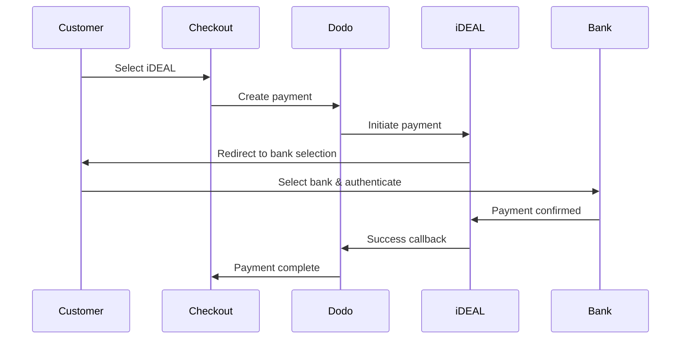
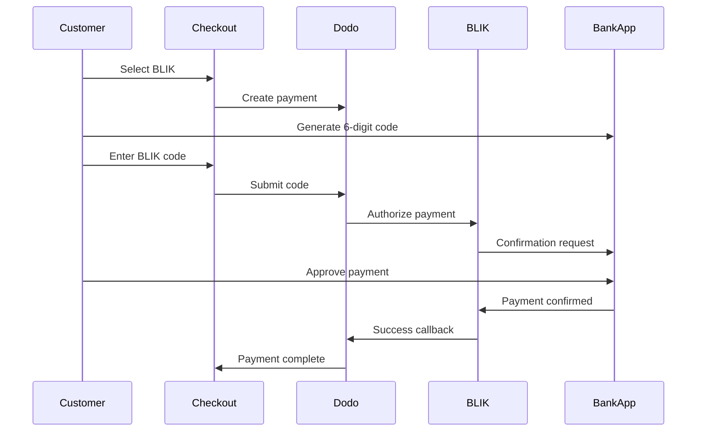

유럽 고객들은 은행 시스템과 통합된 지역 결제 수단을 강하게 선호합니다. 이러한 수단을 제공하면 목표 시장에서 전환율을 20-40% 높일 수 있습니다.

## 지역 유럽 결제 수단이 중요한 이유는?

<CardGroup cols={3}>
<Card title="Higher Conversion" icon="chart-line">
iDEAL는 네덜란드 온라인 결제의 약 60%를 점유합니다. 제공하지 않으면 고객을 잃게 됩니다.
</Card>

<Card title="Lower Fraud" icon="shield-check">
은행 인증 결제는 사기율이 거의 제로이며 청구 취소가 없습니다.
</Card>

<Card title="Real-Time Settlement" icon="bolt">
대부분의 유럽 결제 방식은 즉각적인 결제 확인을 제공합니다.
</Card>
</CardGroup>

## 지원되는 방법

| Method | Country | Market Share | Currency | Subscriptions |
| :----- | :------ | :----------- | :------- | :-----------: |
| **iDEAL** | 네덜란드 | ~60% | EUR | 아니요 |
| **Bancontact** | 벨기에 | ~50% | EUR | 아니요 |
| **EPS** | 오스트리아 | ~30% | EUR | 아니요 |
| **Multibanco** | 포르투갈 | ~40% | EUR | 아니요 |
| **BLIK** | 폴란드 | ~60% | PLN | 아니요 |
| **SEPA Direct Debit** | 유로존 | 널리 사용됨 | EUR | 아니요 |
| **Satispay** | 유럽(이탈리아) | 성장 중 | EUR | 예 |

## iDEAL (네덜란드)

iDEAL은 네덜란드에서 우세한 온라인 결제 수단으로, 모든 주요 네덜란드 은행에 직접 연결됩니다.

### 작동 방식



### 지원 은행

모든 주요 네덜란드 은행이 지원됩니다:
- ABN AMRO
- ASN Bank
- Bunq
- ING
- Knab
- Rabobank
- RegioBank
- Revolut
- SNS
- Triodos Bank
- Van Lanschot

### 구성

```javascript
const session = await client.checkoutSessions.create({
  product_cart: [{ product_id: 'pdt_123', quantity: 1 }],
  allowed_payment_method_types: ['ideal', 'credit', 'debit'],
  billing_currency: 'EUR',
  billing_address: {
    country: 'NL',
    zipcode: '1012JS'
  },
  return_url: 'https://example.com/success'
});
```

## Bancontact (벨기에)

Bancontact는 벨기에의 국가 결제 시스템으로, 사실상 모든 벨기에 은행에서 온라인 결제에 사용됩니다.

### 특징
- 기존 벨기에 직불 카드와 호환
- 모바일 앱 지원 (Payconiq by Bancontact)
- 즉시 결제 확인
- 고객의 추가 등록 필요 없음

### 구성

```javascript
const session = await client.checkoutSessions.create({
  product_cart: [{ product_id: 'pdt_123', quantity: 1 }],
  allowed_payment_method_types: ['bancontact_card', 'credit', 'debit'],
  billing_currency: 'EUR',
  billing_address: {
    country: 'BE',
    zipcode: '1000'
  },
  return_url: 'https://example.com/success'
});
```

## EPS (오스트리아)

EPS (Electronic Payment Standard)는 오스트리아 고객을 위한 직접 온라인 은행 송금을 가능하게 합니다.

### 특징
- 오스트리아 은행과의 직접 통합
- 실시간 결제 확인
- 오스트리아 소비자 간의 높은 신뢰
- 환불 없음

### 지원 은행

주요 오스트리아 은행 포함:
- Erste Bank
- Bank Austria
- Raiffeisen
- BAWAG
- Volksbank

### 구성

```javascript
const session = await client.checkoutSessions.create({
  product_cart: [{ product_id: 'pdt_123', quantity: 1 }],
  allowed_payment_method_types: ['eps', 'credit', 'debit'],
  billing_currency: 'EUR',
  billing_address: {
    country: 'AT',
    zipcode: '1010'
  },
  return_url: 'https://example.com/success'
});
```

## Multibanco (포르투갈)

Multibanco는 포르투갈의 은행 간 네트워크로, 온라인 결제와 ATM 기반 결제를 제공합니다.

### 결제 옵션

1. **온라인 뱅킹** — 인터넷 뱅킹을 통한 직접 은행 송금
2. **ATM 결제** — 고객은 Multibanco ATM에서 결제할 수 있는 참조를 받습니다
3. **모바일 뱅킹** — 은행 모바일 앱을 통한 결제

### ATM 결제 작동 방식

ATM 결제의 경우, 고객은 결제 참조를 받습니다:

```
Entity: 12345
Reference: 123 456 789
Amount: €50.00
Expiry: 24 hours
```

고객은 이 참조를 사용하여 포르투갈의 모든 ATM에서 결제하거나 인터넷 뱅킹을 통해 결제할 수 있습니다.

### 구성

```javascript
const session = await client.checkoutSessions.create({
  product_cart: [{ product_id: 'pdt_123', quantity: 1 }],
  allowed_payment_method_types: ['multibanco', 'credit', 'debit'],
  billing_currency: 'EUR',
  billing_address: {
    country: 'PT',
    zipcode: '1000-001'
  },
  return_url: 'https://example.com/success'
});
```

<Note>
Multibanco ATM 결제는 체크아웃과 실제 결제 사이에 지연이 있을 수 있습니다. 결제 확인을 위해 웹후크를 모니터링하세요.
</Note>

## BLIK (폴란드)

BLIK는 폴란드에서 가장 인기 있는 모바일 결제 수단으로, 고객이 뱅킹 앱에서 생성한 일회성 6자리 코드를 사용해 결제할 수 있도록 합니다. BLIK는 EUR이 아닌 **PLN**(폴란드 즈워티)으로 정산됩니다.

### 작동 방식



### 가용성

- **청구 통화:** PLN만 지원
- **거래 유형:** 일회성 결제만 지원(구독에는 사용할 수 없음)
- **지원 범위:** BLIK를 지원하는 모든 주요 폴란드 은행

### 구성

```javascript
const session = await client.checkoutSessions.create({
  product_cart: [{ product_id: 'pdt_123', quantity: 1 }],
  allowed_payment_method_types: ['blik', 'credit', 'debit'],
  billing_currency: 'PLN',
  billing_address: {
    country: 'PL',
    zipcode: '00-001'
  },
  return_url: 'https://example.com/success'
});
```

<Note>
BLIK에는 **PLN** 청구 통화가 필요합니다. EUR로 가격을 표시하는 경우 [Adaptive Currency](/features/adaptive-currency)를 활성화하면 폴란드 고객에게 PLN으로 청구되며 BLIK를 사용할 수 있습니다.
</Note>

## SEPA Direct Debit (유로존)

SEPA Direct Debit를 사용하면 유로존 전역의 고객이 카드 대신 은행 계좌에서 직접 결제할 수 있습니다. 일회성 결제를 위해 EUR checkout에서 제공됩니다.

### 작동 방식

고객은 checkout 중에 출금을 승인하고, 결제 금액은 은행 계좌에서 인출됩니다. 이 페이지의 대부분의 유럽 결제 수단과 달리 확인이 즉시 이루어지지 않습니다.

<Warning>
SEPA Direct Debit는 즉시 처리되지 않습니다. 결제가 확인되기까지 **영업일 기준 6일**이 걸리므로 승인을 정산 완료로 간주하지 마세요. 결제가 succeeded 상태가 된 후에만 주문을 처리해야 합니다.
</Warning>

### 지원 여부

- **청구 통화:** EUR
- **거래 유형:** 일회성 결제만 지원(구독에는 사용할 수 없음)

### 구성

```javascript
const session = await client.checkoutSessions.create({
  product_cart: [{ product_id: 'pdt_123', quantity: 1 }],
  allowed_payment_method_types: ['sepa', 'credit', 'debit'],
  billing_currency: 'EUR',
  billing_address: {
    country: 'DE',
    zipcode: '10115'
  },
  return_url: 'https://example.com/success'
});
```

### SEPA Test IBANs

Test Mode에서 checkout 시 아래 IBAN 중 하나를 입력하면 특정 결과가 강제로 발생합니다.

| Test IBAN | Behavior |
| :-------- | :------- |
| `DE89370400440532013000` | 결제가 성공합니다. |
| `DE08370400440532013003` | 최소 3분의 지연 후 결제가 성공합니다. |
| `DE62370400440532013001` | 결제가 실패합니다. |
| `DE78370400440532013004` | 최소 3분의 지연 후 결제가 실패합니다. |
| `DE35370400440532013002` | 결제가 성공한 후 즉시 dispute됩니다. |
| `DE65370400440002222227` | 잔액 부족으로 결제가 실패합니다. |
| `DE18370400440000066666` | 은행 계좌를 사용할 수 없어 결제 수단을 생성할 수 없습니다. |

국가별 동작을 테스트하려면 다른 유로존 국가에 해당하는 성공 IBAN을 사용하세요:

| Country | Success IBAN |
| :------ | :----------- |
| 오스트리아 | `AT611904300234573201` |
| 벨기에 | `BE62510007547061` |
| 에스토니아 | `EE382200221020145685` |
| 핀란드 | `FI2112345600000785` |
| 프랑스 | `FR1420041010050500013M02606` |
| 아일랜드 | `IE29AIBK93115212345678` |
| 룩셈부르크 | `LU280019400644750000` |

<Note>
지연 테스트 IBAN은 고객이 checkout을 떠난 후 한참 뒤에 SEPA 결제가 확인되므로, checkout redirect가 아닌 webhook handler가 액세스 권한을 부여하는지 확인하는 데 유용합니다.
</Note>

## Satispay (유럽)

Satispay는 특히 이탈리아에서 널리 사용되는 유럽 모바일 결제 네트워크로, 고객이 카드 또는 은행 정보를 공유하지 않고 Satispay 앱에서 직접 결제할 수 있도록 합니다. Satispay는 **EUR**로 정산됩니다.

### 기능

- 카드 네트워크와 독립적인 앱 기반 결제
- 이탈리아에서 높은 보급률을 보이며 다른 유럽 시장에서도 성장 중
- 일회성 결제와 구독 모두 지원

### 지원 여부

- **청구 통화:** EUR
- **거래 유형:** 일회성 결제 및 구독

### 구성

```javascript
const session = await client.checkoutSessions.create({
  product_cart: [{ product_id: 'pdt_123', quantity: 1 }],
  allowed_payment_method_types: ['satispay', 'credit', 'debit'],
  billing_currency: 'EUR',
  billing_address: {
    country: 'IT',
    zipcode: '00100'
  },
  return_url: 'https://example.com/success'
});
```

## API Method Types

| Type | Method | Country |
| :--- | :----- | :------ |
| `ideal` | iDEAL | 네덜란드 |
| `bancontact_card` | Bancontact | 벨기에 |
| `eps` | EPS | 오스트리아 |
| `multibanco` | Multibanco | 포르투갈 |
| `blik` | BLIK | 폴란드 |
| `sepa` | SEPA Direct Debit | 유로존 |
| `satispay` | Satispay | 유럽(이탈리아) |

## 다국가 유럽 checkout

여러 유럽 국가의 고객을 대상으로 하는 비즈니스라면 모든 지역 결제 수단을 포함하세요:

```javascript
const session = await client.checkoutSessions.create({
  product_cart: [{ product_id: 'pdt_123', quantity: 1 }],
  allowed_payment_method_types: [
    'ideal',           // Netherlands
    'bancontact_card', // Belgium
    'eps',             // Austria
    'multibanco',      // Portugal
    'blik',            // Poland (requires PLN billing currency)
    'sepa',            // Eurozone (one-time payments only)
    'satispay',        // Europe / Italy
    'credit',          // Fallback
    'debit'            // Fallback
  ],
  billing_currency: 'EUR',
  return_url: 'https://example.com/success'
});
```

Dodo는 고객 위치에 따라 관련 결제 수단만 자동으로 표시합니다. 네덜란드 고객에게는 iDEAL이, 벨기에 고객에게는 Bancontact가 표시됩니다.

## 테스트

유럽 결제 수단은 Test Mode에서 테스트할 수 있습니다. 테스트 flow는 은행 인증 프로세스를 시뮬레이션합니다.

<Note>
SEPA Direct Debit는 다른 방식으로 테스트합니다. 시뮬레이션된 은행 flow 대신 테스트 IBAN을 직접 입력합니다. [SEPA Test IBANs](#sepa-test-ibans)를 참조하세요.
</Note>

<Steps>
<Step title="Enable test mode">
Dodo Payments 테스트 API 키를 사용하세요.
</Step>

<Step title="Set appropriate billing address">
결제 수단에 맞게 청구 주소의 국가를 설정하세요:
- `NL`(iDEAL)
- `BE`(Bancontact)
- `AT`(EPS)
- `PT`(Multibanco)
- `PL`(BLIK, PLN 청구 통화 사용)
- `IT`(Satispay)
</Step>

<Step title="Complete the test flow">
테스트 환경에서 시뮬레이션된 은행 인증 flow를 따르세요.
</Step>
</Steps>

## 모범 사례

<AccordionGroup>
<Accordion title="Always include regional methods for target markets">
네덜란드 고객에게 판매한다면 iDEAL을 포함하세요. 이는 미국에서 Visa를 받지 않는 것과 같으며, 상당한 매출을 잃게 됩니다.
</Accordion>

<Accordion title="Match currency to region">
대부분의 유럽 결제 수단에는 EUR이 필요하므로 가격 책정이 Euro 거래를 지원하는지 확인하세요. 유일한 예외는 **PLN**(폴란드 즈워티) 청구에서만 제공되는 BLIK입니다.
</Accordion>

<Accordion title="Handle redirects gracefully">
모든 유럽 결제 수단은 은행 사이트로 redirect됩니다. return URL 처리가 견고하고 flow 중간에 이탈하는 사용자를 고려하는지 확인하세요.
</Accordion>

<Accordion title="Provide card fallbacks">
모든 유럽 고객이 이러한 지역 결제 수단에 액세스할 수 있는 것은 아닙니다(관광객, 해외 거주자 등). 항상 `credit` 및 `debit`를 fallback으로 포함하세요.
</Accordion>

<Accordion title="Consider Multibanco timing">
Multibanco ATM 결제는 완료까지 몇 시간이 걸릴 수 있습니다. 즉시 결제를 전제로 주문 처리를 차단하지 말고, 비동기 확인에는 webhook을 사용하세요.
</Accordion>
</AccordionGroup>

## 문제 해결

<AccordionGroup>
<Accordion title="European method not appearing">
**확인 사항:**
1. 고객의 청구 국가가 결제 수단의 국가와 일치하나요?
2. 통화가 EUR로 설정되어 있나요?
3. 결제 수단이 `allowed_payment_method_types`에 포함되어 있나요?

**해결 방법:** 유럽 결제 수단은 엄격하게 지역별로 제공됩니다. 청구 국가가 `DE`(독일)인 고객에게는 네덜란드에서만 사용할 수 있는 iDEAL이 표시되지 않습니다.
</Accordion>

<Accordion title="Bank authentication failed">
**원인:**
- 은행 인증 중 고객이 취소함
- 은행의 인증 시스템을 일시적으로 사용할 수 없음
- 고객이 잘못된 자격 증명을 입력함

**해결 방법:** 고객이 다시 시도해야 합니다. 문제가 지속되면 다른 결제 수단을 사용해 보도록 안내하세요.
</Accordion>

<Accordion title="Redirect not completing">
**원인:**
- 은행 redirect 중 고객이 브라우저를 닫음
- 인증 중 네트워크 문제 발생
- return URL이 잘못 구성됨

**해결 방법:** return URL이 올바르고 액세스 가능한지 확인하세요. 성공 및 실패 상태를 모두 처리하는지 확인하세요.
</Accordion>

<Accordion title="Multibanco payment pending">
**원인:** 고객이 결제 reference를 받았지만 아직 결제하지 않음.

**해결 방법:** ATM 기반 결제에서는 정상적인 동작입니다. webhook 확인을 기다리세요. reference는 일반적으로 24~72시간 후 만료됩니다.
</Accordion>
</AccordionGroup>

## PSD2 Compliance

모든 유럽 결제 수단은 PSD2(Payment Services Directive 2) 규정을 준수합니다:

- **Strong Customer Authentication (SCA)** — 은행 인증 flow에 내장됨
- **Secure Communication** — 모든 데이터가 보안 채널을 통해 전송됨
- **Consumer Protection** — EU 소비자 권리를 완전히 준수함

## 관련 페이지

<CardGroup cols={2}>
<Card title="Payment Methods Overview" icon="credit-card" href="/features/payment-methods">
지원되는 모든 결제 수단을 확인하세요.
</Card>

<Card title="Adaptive Currency" icon="globe" href="/features/adaptive-currency">
통화 지원 및 자동 변환.
</Card>

<Card title="Checkout Guide" icon="book" href="/developer-resources/checkout-session">
완전한 checkout 구현 가이드.
</Card>

<Card title="Webhooks" icon="webhook" href="/developer-resources/webhooks">
결제 확인을 비동기 방식으로 처리하세요.
</Card>
</CardGroup>