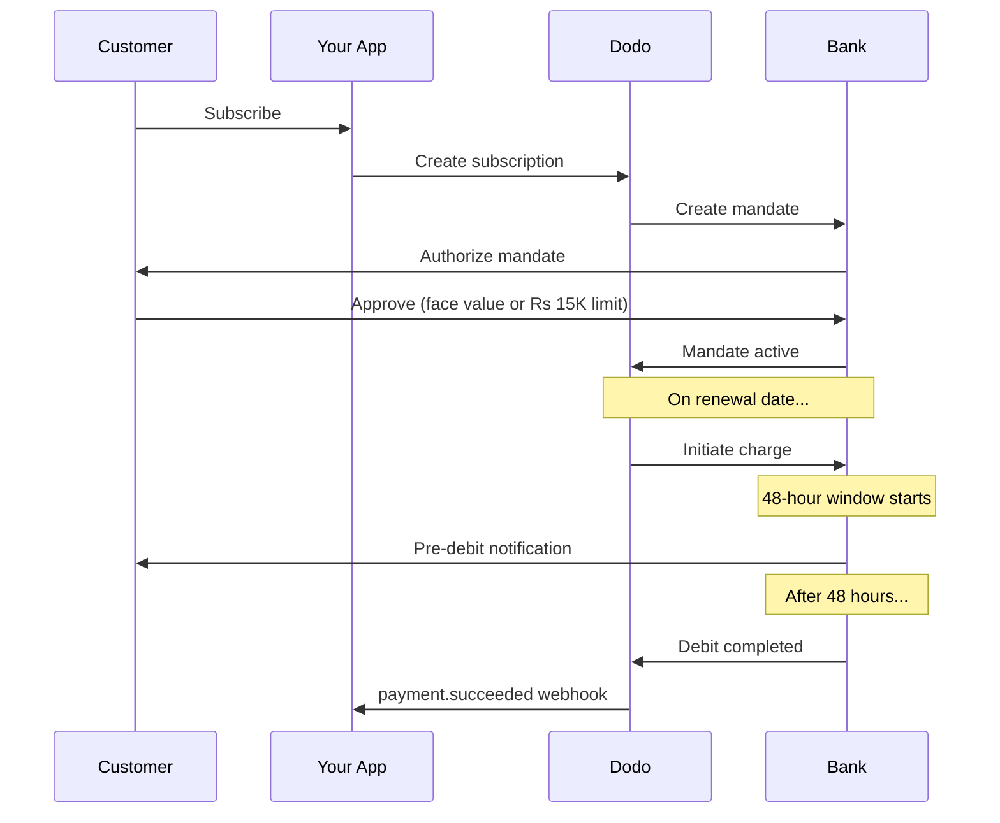

인도는 UPI(60% 이상의 디지털 거래)와 Rupay 카드로 지배되는 독특한 결제 인프라를 갖추고 있습니다. Dodo Payments는 구독 위임에 대한 완전한 RBI 준수를 통해 두 가지 모두를 지원합니다.

## 인도 결제 방법의 중요성

<CardGroup cols={3}>
<Card title="UPI의 우위" icon="mobile">
UPI는 월 100억 건 이상의 거래를 처리합니다. 많은 인도 고객들은 국제 카드를 보유하고 있지 않습니다.
</Card>

<Card title="낮은 거래 비용" icon="indian-rupee-sign">
UPI는 거의 제로에 가까운 거래 수수료를 가지고 있습니다. 대량의 낮은 가치 거래에 적합합니다.
</Card>

<Card title="구독 지원" icon="repeat">
대부분의 대체 결제 방법과 달리 UPI와 Rupay는 RBI 위임을 통해 정기 결제를 지원합니다.
</Card>
</CardGroup>

## 지원되는 방법

| 방법 | 유형 | 구독 | 최소 금액 |
| :----- | :--- | :-----------: | :--------- |
| **UPI 수집** | QR 코드 / VPA | 예* | ₹1 |
| **Rupay 신용** | 카드 | 예* | ₹1 |
| **Rupay 직불** | 카드 | 예* | ₹1 |

*구독은 특별 처리 규칙이 있는 RBI 준수 위임이 필요합니다.

## 설정

### API 방법 유형

| 유형 | 설명 |
| :--- | :---------- |
| `upi_collect` | QR 코드 또는 VPA 입력을 통한 UPI |
| `credit` | Rupay를 포함한 신용 카드 |
| `debit` | Rupay를 포함한 직불 카드 |

### 예시: 인도 중심 체크아웃

```javascript
const session = await client.checkoutSessions.create({
  product_cart: [{ product_id: 'prod_123', quantity: 1 }],
  allowed_payment_method_types: [
    'upi_collect',
    'credit',
    'debit'
  ],
  billing_currency: 'INR',
  customer: {
    email: 'customer@example.in',
    name: 'Priya Sharma',
    phone_number: '+919876543210'
  },
  billing_address: {
    country: 'IN',
    zipcode: '560001'
  },
  return_url: 'https://example.com/success'
});
```

### UPI 요구 사항

체크아웃에서 UPI를 표시하려면:
1. **청구 국가**는 인도여야 합니다 (`IN`)
2. **통화**는 INR여야 합니다.
3. 비인도 상인의 경우: **적응형 통화**가 활성화되어야 합니다.

<Warning>
비인도 상인이라면 적응형 통화가 활성화되지 않으면 고객에게 UPI가 제공되지 않습니다.
</Warning>

## RBI 위임이 있는 구독

인도 결제 방법 구독은 RBI(인도 중앙은행) 규칙에 따라 고유한 요구 사항을 따릅니다.

### RBI 위임 작동 방식



### 위임 유형

| 구독 금액 | 위임 유형 | 한도 |
| :------------------ | :----------- | :---- |
| **₹15,000 미만** | 수요 위임 | ₹15,000 |
| **₹15,000 이상** | 고정 금액 위임 | 정확한 구독 금액 |

**요금 변경 시 중요**: 업그레이드로 인해 요금이 기존 위임 한도를 초과하면 요금이 실패하고 고객은 재승인을 받아야 합니다.

### 48시간 처리 지연

이는 국제 카드 결제와의 가장 중요한 차이점입니다:

<Steps>
<Step title="요금 시작 (0일 차)">
예정된 갱신 날짜에 Dodo가 은행에 요금을 시작합니다.
</Step>

<Step title="사전 차감 알림">
고객은 다가오는 차감에 대한 은행으로부터 알림을 받습니다.
</Step>

<Step title="48시간 기간">
고객은 이 기간 동안 은행 앱을 통해 위임을 취소할 수 있습니다.
</Step>

<Step title="차감 완료 (~48-51시간)">
48시간 후(은행 처리에 따라 최대 3시간 추가), 자금이 차감됩니다.
</Step>

<Step title="웹훅 전송">
`payment.succeeded` 웹훅은 실제 차감 후에 전송되며 시작할 때는 전송되지 않습니다.
</Step>
</Steps>

<Warning>
**요금 시작 시 혜택을 부여하지 마세요.** · 예정된 요금 일자 후 약 48-51시간 내에 도착하는 `payment.succeeded` 웹훅을 기다리세요.
</Warning>

### 48시간 기간 처리

```javascript
// DON'T do this:
async function handleSubscriptionRenewal(subscription) {
  // ❌ Bad: Granting access immediately when charge is initiated
  grantPremiumAccess(subscription.customer_id);
}

// DO this:
async function handlePaymentWebhook(event) {
  if (event.type === 'payment.succeeded') {
    // ✅ Good: Only grant access after payment is confirmed
    grantPremiumAccess(event.data.customer_id);
  }
  
  if (event.type === 'payment.failed') {
    // Handle failed payment (mandate cancelled, insufficient funds)
    revokePremiumAccess(event.data.customer_id);
  }
}
```

### 인도 구독에 대한 웹훅 이벤트

| 이벤트 | 시점 | 조치 |
| :---- | :--- | :----- |
| `subscription.created` | 위임 승인됨 | 구독 시작 기록 |
| `payment.succeeded` | 요금 날짜 ~48시간 후 | 접근 권한 부여/지속 |
| `payment.failed` | 차감 실패 | 고객에게 알림, 접근 권한 중지 |
| `subscription.on_hold` | 결제 실패 | 결제 수단 업데이트 요청 |
| `subscription.active` | 결제 후 재활성화 | 접근 권한 복원 |

## 테스트

### UPI 테스트 ID

| 상태 | UPI ID |
| :----- | :----- |
| 성공 | `success@upi` |
| 실패 | `failure@upi` |

### 인도 카드 테스트 번호

| 브랜드 | 시나리오 | 카드 번호 | 만료 | CVV |
| :---- | :------- | :---------- | :----- | :-- |
| Visa | 성공 | `4576238912771450` | 06/32 | 123 |
| Visa | 거부됨 | `4706131211212123` | 06/32 | 123 |
| Mastercard | 성공 | `5409162669381034` | 06/32 | 123 |
| Mastercard | 거부됨 | `5105105105105100` | 06/32 | 123 |

## 모범 사례

<AccordionGroup>
<Accordion title="48시간 지연 계획">
청구 시작과 실제 결제 사이의 시간 간격을 처리하도록 응용 프로그램을 구성하십시오. 고려 사항:
- 구독 접근을 위한 유예 기간
- 처리 시간에 대한 고객과의 명확한 커뮤니케이션
- 날짜 기반이 아닌 웹훅 기반 이행
</Accordion>

<Accordion title="위임 취소 처리">
고객은 언제든지 은행 앱을 통해 위임을 취소할 수 있습니다. `subscription.on_hold` 웹훅을 모니터링하고 고객에게 재구독 또는 결제 방법 업데이트를 요청하십시오.
</Accordion>

<Accordion title="적절한 위임 금액 설정">
변동 요금(예: 사용 기반)의 경우 ₹15,000의 수요 위임이 충분한지 고려하십시오. 요금이 이를 초과할 가능성이 있는 경우 고객은 재승인해야 합니다.
</Accordion>

<Accordion title="UPI를 눈에 띄게 제공">
인도 고객에게는 UPI가 주요 결제 옵션이 되어야 합니다. 많은 사용자들이 카드보다 친숙함과 낮은 마찰로 인해 UPI를 선호합니다.
</Accordion>
</AccordionGroup>

## 문제 해결

<AccordionGroup>
<Accordion title="체크아웃에 UPI가 나타나지 않음">
**확인 사항:**
1. 청구 국가가 `IN`로 설정되어 있습니까?
2. 통화가 `INR`로 설정되어 있습니까?
3. 비인도 상인이라면: 적응형 통화가 활성화되어 있습니까?
4. `upi_collect`가 `allowed_payment_method_types`에 포함되어 있습니까?

**해결책:** 청구 주소에 `country: "IN"` 및 `billing_currency: "INR"`가 있는지 확인하십시오.
</Accordion>

<Accordion title="업그레이드 후 구독 요금이 실패함">
**원인:** 새로운 요금이 기존 위임 한도(₹15,000 한도)를 초과합니다.

**해결책:** 고객은 올바른 한도로 새로운 위임을 설정하기 위해 결제 방법을 업데이트해야 합니다.
</Accordion>

<Accordion title="구독이 보류 중이지만 고객이 취소하지 않았다고 주장함">
**원인:** 고객이 48시간 기간 중 위임을 취소했거나 은행이 차감을 거부했을 수 있습니다.

**해결책:** 고객은 위임을 재승인하거나 결제 방법을 업데이트해야 합니다.
</Accordion>

<Accordion title="결제 공제 지연이 48시간을 초과함">
**원인:** 은행 API 지연으로 인해 처리 시간이 2-3시간 추가로 연장될 수 있습니다.

**해결책:** 이는 예상되는 사항입니다. 시스템이 총 ~51시간까지의 변동 지연을 처리하도록 구성하십시오.
</Accordion>

<Accordion title="위임이 취소되었지만 구독이 여전히 활성 상태임">
**원인:** RBI 규정의 엣지 케이스 — 처리 기간 중 위임 취소가 즉시 구독을 취소하지 않습니다.

**해결책:** 다음 요금이 실패하고 구독이 `on_hold`으로 변경됩니다. `payment.failed`에 대한 웹훅을 모니터링하십시오.
</Accordion>
</AccordionGroup>

## 관련 페이지

<CardGroup cols={2}>
<Card title="결제 방법 개요" icon="credit-card" href="/features/payment-methods">
모든 지원되는 결제 방법 보기.
</Card>

<Card title="구독" icon="repeat" href="/features/subscription">
RBI 위임을 포함한 전체 구독 문서.
</Card>

<Card title="웹훅" icon="webhook" href="/developer-resources/webhooks">
결제 이벤트에 대한 웹훅 처리.
</Card>

<Card title="테스트 프로세스" icon="flask" href="/miscellaneous/testing-process">
UPI ID와 인도 카드를 포함한 모든 테스트 데이터.
</Card>
</CardGroup>