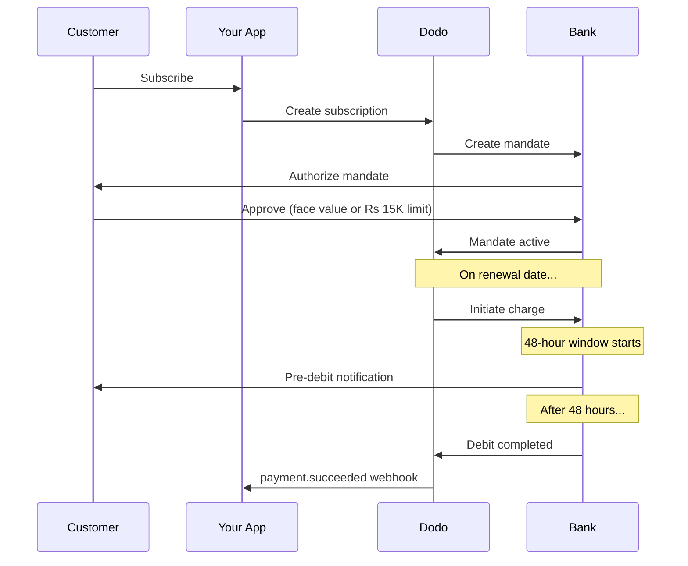

인도는 UPI(디지털 거래의 60% 이상)와 인도 발급 카드(Visa, Mastercard, Rupay 등)가 주도하는 고유한 결제 인프라를 갖추고 있습니다. Dodo Payments는 RBI를 완전히 준수하는 subscription mandate를 통해 이러한 결제 수단을 모두 지원합니다.

## 인도 결제 방법이 중요한 이유

<CardGroup cols={3}>
<Card title="UPI Dominance" icon="mobile">
UPI는 매월 100억 건 이상의 거래를 처리합니다. 많은 인도 고객은 국제 카드를 보유하고 있지 않습니다.
</Card>

<Card title="Low Transaction Costs" icon="indian-rupee-sign">
UPI는 거래 수수료가 거의 없습니다. 거래량이 많고 금액이 낮은 거래에 적합합니다.
</Card>

<Card title="Subscription Support" icon="repeat">
대부분의 대체 결제 방법과 달리 UPI와 모든 인도 발급 카드(Visa, Mastercard, Rupay 등)는 RBI mandate를 통한 recurring payment를 지원합니다.
</Card>
</CardGroup>

## 지원되는 방법

| 방법 | 유형 | 구독 | 최소 금액 |
| :----- | :--- | :-----------: | :--------- |
| **UPI Collect** | QR code / VPA | 예* | ₹1 |
| **Rupay Credit** | 카드 | 예* | ₹1 |
| **Rupay Debit** | 카드 | 예* | ₹1 |

*구독에는 특별한 처리 규칙이 적용되는 RBI 준수 mandate가 필요합니다. 48시간 처리 지연은 모든 인도 발급 카드와 UPI에 적용됩니다.

## 구성

### API 방법 유형

| 유형 | 설명 |
| :--- | :---------- |
| `upi_collect` | QR code 또는 VPA 입력을 통한 UPI |
| `credit` | Rupay를 포함한 신용 카드 |
| `debit` | Rupay를 포함한 직불 카드 |

### 예시: 인도 중심 Checkout

```javascript
const session = await client.checkoutSessions.create({
  product_cart: [{ product_id: 'prod_123', quantity: 1 }],
  allowed_payment_method_types: [
    'upi_collect',
    'credit',
    'debit'
  ],
  billing_currency: 'INR',
  customer: {
    email: 'customer@example.in',
    name: 'Priya Sharma',
    phone_number: '+919876543210'
  },
  billing_address: {
    country: 'IN',
    zipcode: '560001'
  },
  return_url: 'https://example.com/success'
});
```

### UPI 요구 사항

UPI가 checkout에 표시되려면:
1. **Billing country**는 인도여야 합니다(`IN`).
2. **Currency**는 INR이어야 합니다.
3. 인도 외 merchant의 경우 **Adaptive Currency**를 활성화해야 합니다.

<Warning>
인도 외 merchant이고 Adaptive Currency가 활성화되어 있지 않으면 고객은 UPI를 사용할 수 없습니다.
</Warning>

## RBI Mandate를 사용한 구독

인도 결제 방법 구독은 RBI(Reserve Bank of India) 규정에 따라 운영되며, 고유한 요구 사항이 적용됩니다.

### RBI Mandate 작동 방식



### Mandate 유형

| 구독 금액 | Mandate 유형 | 한도 |
| :------------------ | :----------- | :---- |
| **mandate floor 미만** | On-demand mandate | Mandate floor(기본값 ₹15,000) |
| **mandate floor 이상** | Fixed-amount mandate | 정확한 구독 금액 |

고객의 은행에 등록되는 금액은 `max(mandate_floor, billing_amount)`입니다. 따라서 floor보다 낮은 금액을 청구할 때 floor는 사실상 고객에게 표시되는 **authorization ceiling**입니다.

**플랜 변경 시 중요:** 업그레이드로 인해 기존 mandate 한도를 초과하는 금액이 청구되면 청구가 실패하며 고객은 다시 authorization해야 합니다.

### 구성 가능한 Mandate Floor

INR e-mandate의 mandate floor는 `mandate_min_amount_inr_paise` 필드를 통해 구성할 수 있습니다(**INR paise** 단위 — 1 INR = 100 paise). 세 가지 수준에서 시스템 기본값인 ₹15,000을 재정의할 수 있습니다.

| 수준 | 설정 위치 | 범위 |
|-------|--------------|-------|
| **요청별** | checkout session, payment 또는 subscription의 `mandate_min_amount_inr_paise` | 하나의 거래 |
| **Merchant** | Business settings | 모든 INR subscription |
| **시스템** | — | 기본값 ₹15,000 |

적용 우선순위: 요청별 재정의 → merchant 설정 → 시스템 기본값.

```typescript
// Per-checkout override
const session = await client.checkoutSessions.create({
  product_cart: [{ product_id: 'prod_inr_monthly', quantity: 1 }],
  mandate_min_amount_inr_paise: 2_000_000, // ₹20,000 ceiling
  return_url: 'https://yoursite.com/return'
});

// Per-subscription override
const subscription = await client.subscriptions.create({
  product_id: 'prod_inr_monthly',
  customer: { email: 'customer@example.in' },
  billing: { country: 'IN', /* ... */ },
  mandate_min_amount_inr_paise: 2_000_000
});
```

| 필드 | 유형 | 검증 | 적용 대상 |
|-------|------|------------|------------|
| `mandate_min_amount_inr_paise` | `integer` (INR paise) | `>= 1` | Airwallex가 아닌 connector의 인도 카드 INR subscription |

<Info>
더 높은 floor를 설정하면 고객에게 재 authorization을 요구하지 않고 나중에 더 큰 일회성 청구(예: 플랜 업그레이드 또는 사용량 기반 초과분)를 지원할 수 있습니다. 더 낮은 floor를 설정하면 고객의 authorization이 실제 청구 금액에 가까워지지만 향후 변동 청구에 사용할 수 있는 여유가 제한됩니다.
</Info>

<Warning>
이 설정은 INR subscription에서 인도 발급 카드(Visa, Mastercard, RuPay)에 등록된 e-mandate에만 영향을 줍니다. UPI subscription은 자체 AutoPay flow를 따르며 영향을 받지 않습니다.
</Warning>

### 48시간 처리 지연

이는 국제 카드 결제와 가장 큰 차이입니다.

<Steps>
<Step title="Charge Initiated (Day 0)">
예정된 갱신일에 Dodo가 은행에 청구를 시작합니다.
</Step>

<Step title="Pre-Debit Notification">
고객은 예정된 출금에 대한 알림을 은행으로부터 받습니다.
</Step>

<Step title="48-Hour Window">
고객은 이 기간 동안 banking app을 통해 mandate를 취소할 수 있습니다.
</Step>

<Step title="Debit Completed (~48-51 hours)">
48시간 후(은행 처리에 최대 3시간이 추가로 소요될 수 있음) 자금이 출금됩니다.
</Step>

<Step title="Webhook Sent">
실제 출금 후 `payment.succeeded` webhook이 전송되며, 시작 시점에는 전송되지 않습니다.
</Step>
</Steps>

<Warning>
**청구 시작 시점에 혜택을 제공하지 마세요.** 예정된 청구일로부터 약 48~51시간 후 도착하는 `payment.succeeded` webhook을 기다리세요.
</Warning>

### 48시간 기간 처리

```javascript
// DON'T do this:
async function handleSubscriptionRenewal(subscription) {
  // ❌ Bad: Granting access immediately when charge is initiated
  grantPremiumAccess(subscription.customer_id);
}

// DO this:
async function handlePaymentWebhook(event) {
  if (event.type === 'payment.succeeded') {
    // ✅ Good: Only grant access after payment is confirmed
    grantPremiumAccess(event.data.customer_id);
  }
  
  if (event.type === 'payment.failed') {
    // Handle failed payment (mandate cancelled, insufficient funds)
    revokePremiumAccess(event.data.customer_id);
  }
}
```

### 인도 Subscription의 Webhook Event

| Event | 시점 | 작업 |
| :---- | :--- | :----- |
| `subscription.active` | Mandate authorization 완료 | Subscription 시작 기록 |
| `payment.succeeded` | 청구일로부터 약 48시간 후 | 액세스 제공/유지 |
| `payment.failed` | Debit 실패 | 고객에게 알리고 액세스 일시 중지 |
| `subscription.on_hold` | Payment 실패 | payment method 업데이트 요청 |
| `subscription.active` | Payment 후 재활성화 | 액세스 복원 |

## 테스트

### UPI 테스트 ID

| 상태 | UPI ID |
| :----- | :----- |
| 성공 | `success@upi` |
| 실패 | `failure@upi` |

### 인도 카드 테스트 번호

| Brand | 시나리오 | Card Number | 만료일 | CVV |
| :---- | :------- | :---------- | :----- | :-- |
| Visa | 성공 | `4576238912771450` | 06/32 | 123 |
| Visa | 거절됨 | `4706131211212123` | 06/32 | 123 |
| Mastercard | 성공 | `5409162669381034` | 06/32 | 123 |
| Mastercard | 거절됨 | `5105105105105100` | 06/32 | 123 |

## 모범 사례

<AccordionGroup>
<Accordion title="Plan for the 48-hour delay">
청구 시작과 실제 payment 사이의 간격을 처리하도록 애플리케이션을 구축하세요. 다음을 고려하세요.
- Subscription 액세스를 위한 유예 기간
- 처리 시간에 대한 고객과의 명확한 커뮤니케이션
- 날짜 기반이 아닌 webhook 기반 fulfillment
</Accordion>

<Accordion title="Handle mandate cancellations">
고객은 언제든지 은행 app을 통해 mandate를 취소할 수 있습니다. `subscription.on_hold` webhook을 모니터링하고 고객에게 subscription 재가입 또는 payment method 업데이트를 요청하세요.
</Accordion>

<Accordion title="Set appropriate mandate amounts">
가변 가격(예: 사용량 기반)의 경우 Rs 15,000 on-demand mandate가 충분한지 고려하세요. 청구 금액이 이를 초과할 수 있다면 고객은 다시 authorization해야 합니다.
</Accordion>

<Accordion title="Offer UPI prominently">
인도 고객에게는 UPI를 기본 payment option으로 제공해야 합니다. 많은 사용자는 익숙하고 friction이 낮다는 이유로 카드를 선호합니다.
</Accordion>
</AccordionGroup>

## 문제 해결

<AccordionGroup>
<Accordion title="UPI not appearing at checkout">
**확인:**
1. Billing country가 `IN`로 설정되어 있나요?
2. Currency가 `INR`로 설정되어 있나요?
3. 인도 외 merchant인 경우: Adaptive Currency가 활성화되어 있나요?
4. `upi_collect`가 `allowed_payment_method_types`에 포함되어 있나요?

**해결 방법:** Billing address에 `country: "IN"` 및 `billing_currency: "INR"`가 있는지 확인하세요.
</Accordion>

<Accordion title="Subscription charge failed after upgrade">
**원인:** 새 청구 금액이 기존 mandate 한도(Rs 15,000 threshold)를 초과했습니다.

**해결 방법:** 고객은 올바른 한도로 새 mandate를 설정하기 위해 payment method를 업데이트해야 합니다.
</Accordion>

<Accordion title="Subscription on hold but customer claims they didn't cancel">
**원인:** 고객이 48시간 동안의 기간에 mandate를 취소했거나 은행이 debit을 거절했을 수 있습니다.

**해결 방법:** 고객은 mandate를 다시 authorization하거나 payment method를 업데이트해야 합니다.
</Accordion>

<Accordion title="Payment deduction delayed beyond 48 hours">
**원인:** Bank API 지연으로 처리 시간이 2~3시간 더 늘어날 수 있습니다.

**해결 방법:** 이는 예상 가능한 상황입니다. 총 약 51시간까지의 가변적인 지연을 처리하도록 시스템을 구축하세요.
</Accordion>

<Accordion title="Mandate cancelled but subscription still active">
**원인:** RBI 규정의 예외 상황으로, processing window 중 mandate를 취소해도 subscription이 즉시 취소되지 않습니다.

**해결 방법:** 다음 청구가 실패하고 subscription이 `on_hold`로 전환됩니다. `payment.failed`에 대한 webhook을 모니터링하세요.
</Accordion>
</AccordionGroup>

## 관련 페이지

<CardGroup cols={2}>
<Card title="Payment Methods Overview" icon="credit-card" href="/features/payment-methods">
지원되는 모든 결제 방법을 확인하세요.
</Card>

<Card title="Subscriptions" icon="repeat" href="/features/subscription">
RBI mandate를 포함한 전체 subscription 문서입니다.
</Card>

<Card title="Webhooks" icon="webhook" href="/developer-resources/webhooks">
payment event를 위한 webhook 처리입니다.
</Card>

<Card title="Testing Process" icon="flask" href="/miscellaneous/testing-process">
UPI ID와 인도 카드를 포함한 모든 테스트 데이터입니다.
</Card>
</CardGroup>