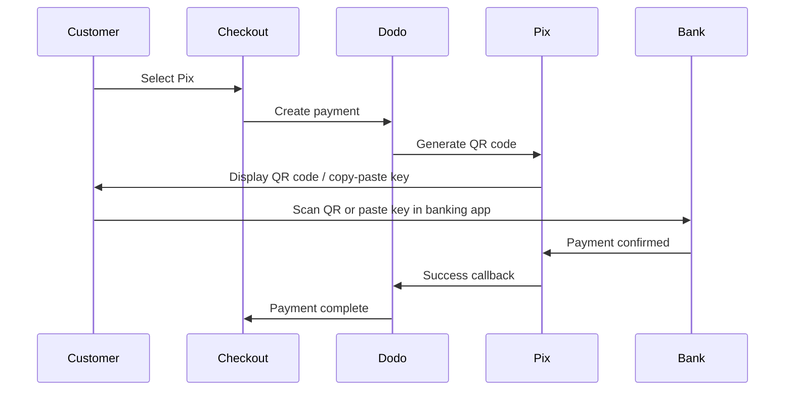

Pix는 브라질 중앙은행(Banco Central do Brasil)이 만든 브라질의 즉시 결제 시스템입니다. 주말 및 공휴일을 포함하여 24/7 실시간 송금을 가능하게 하며, 브라질에서 가장 인기 있는 결제 수단이 되었습니다.

## Pix를 제공하는 이유?

Pix는 브라질에서 가장 많이 사용되는 결제 수단으로, 신용카드와 boleto를 능가합니다.

결제가 일년 내내 24/7/365 몇 초 내에 확인됩니다 — 은행 처리창을 기다릴 필요가 없습니다.

고객은 QR 코드나 복사-붙여넣기 키를 통해 결제합니다 — 카드 번호나 은행 정보가 필요 없습니다.

## 개요

| 세부 정보 | 값 |
| :----- | :---- |
| **청구 통화** | BRL |
| **지원 국가** | 브라질 |
| **구독** | 아니오 |
| **최소 금액** | $0.50 |
| **정산** | 즉각적 |

## 작동 방식



## 고객 경험

1. 고객이 체크아웃 시 Pix를 선택합니다.
2. QR 코드와 복사-붙여넣기 키가 표시됩니다.
3. 고객이 은행 앱을 열어 QR 코드를 스캔하거나 키를 붙여 넣습니다.
4. 결제가 즉시 확인됩니다.
5. 고객은 성공 페이지로 리디렉션됩니다.

Pix QR 코드는 일반적으로 설정된 기간 후에 만료됩니다. 만약 고객이 제때 결제를 완료하지 못하면, 체크아웃을 다시 시작해야 합니다.

## 구성

```javascript
const session = await client.checkoutSessions.create({
  product_cart: [{ product_id: 'prod_123', quantity: 1 }],
  allowed_payment_method_types: ['pix', 'credit', 'debit'],
  billing_currency: 'BRL',
  return_url: 'https://example.com/success'
});
```

## API 메소드 타입

| 타입 | 메소드 | 국가 |
| :--- | :----- | :------ |
| `pix` | Pix | 브라질 |

## 테스트

Dodo Payments 테스트 API 키를 사용하세요.

청구 통화를 체크아웃 요청에서 `BRL`으로 설정했는지 확인하세요.

Pix CPF를 입력하라는 메시지가 나타나면 `1234567890`를 입력하세요. 테스트 QR 코드가 생성되며 — 일반 전화 카메라로 스캔하면 됩니다 (Pix 앱 불필요). Stripe 테스트 페이지로 리디렉션되어 거래 성공 또는 실패를 시뮬레이션할 수 있습니다.

## 모범 사례

Pix는 BRL로만 작동합니다. 브라질 시장을 위해 브라질 레알 결제를 지원하는 가격을 보장하세요.

모든 브라질 고객이 Pix를 선호하지 않을 수 있습니다. 항상 `credit` 및 `debit`를 대체 옵션으로 포함하세요.

Pix QR 코드는 설정된 기간 후에 만료됩니다. 체크아웃에서 만료를 우아하게 처리하고 고객이 코드를 재생성할 수 있도록 하세요.

## 문제 해결

**확인:**
1. 청구 통화가 `BRL`로 설정되었습니까?
2. `pix`이 `allowed_payment_method_types`에 포함되어 있습니까?
3. 고객 청구 국가는 브라질입니까?

**해결 방법:** Pix는 BRL 거래에만 사용할 수 있습니다. API 요청에서 통화 및 청구 주소를 확인하세요.

**원인:** 고객이 만료 시간 내에 결제를 완료하지 않았습니다.

**해결 방법:** 고객이 새로운 QR 코드를 생성하기 위해 체크아웃을 다시 시작해야 합니다.

**원인:** 대부분의 경우 Pix 결제는 즉시 확인되지만, 가끔 은행 측 지연이 발생할 수 있습니다.

**해결 방법:** 결제 확인에 대한 웹훅을 모니터링하세요. 결제가 몇 분 내에 확인되지 않으면 실패로 처리하세요.

## 관련 페이지

모든 지원 결제 방법을 확인하세요.

통화 지원 및 자동 변환.

전체 체크아웃 구현 가이드.

비동기적으로 결제 확인 처리.
