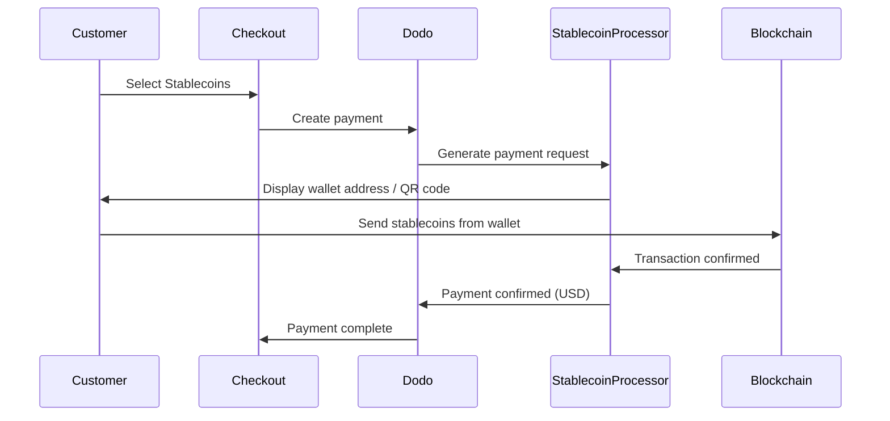

스테이블코인 결제를 통해 고객은 전 세계 어디서든 스테이블코인을 사용하여 결제할 수 있습니다(인도 제외). 거래는 USD로 청구되므로 고객이 선호하는 스테이블코인 지갑으로 결제하는 동안 법정통화를 수령할 수 있습니다.

## 스테이블코인을 제공하는 이유

<CardGroup cols={3}>
<Card title="Global Reach" icon="globe">
고객측 은행 인프라 없이 어느 국가에서든 결제를 수락하세요.
</Card>

<Card title="No Chargebacks" icon="shield-check">
스테이블코인 거래는 되돌릴 수 없으므로 환불 사기를 완전히 제거할 수 있습니다.
</Card>

<Card title="USD Settlement" icon="dollar-sign">
USD를 수령합니다 — 변동성이나 지갑을 관리할 필요가 없습니다.
</Card>
</CardGroup>

## 개요

| 세부사항 | 값 |
| :----- | :---- |
| **청구 통화** | USD |
| **지원 국가** | 전 세계 (인도 제외) |
| **구독** | 없음 |
| **최소 금액** | $0.50 |
| **정산** | USD |

## 작동 원리



## 고객 경험

1. 고객이 결제 시 스테이블코인을 선택합니다.
2. 스테이블코인 금액이 QR 코드와 지갑 주소로 표시됩니다.
3. 고객이 자신의 스테이블코인 지갑에서 정확한 금액을 전송합니다.
4. 거래가 블록체인에서 확인됩니다.
5. 고객은 성공 페이지로 리디렉션됩니다.

<Info>
스테이블코인 결제는 USD로 청구됩니다. 결제 시점의 실시간 환율이 결제 페이지에 표시됩니다.
</Info>

## 지원되는 통화 및 네트워크

| 통화 | 네트워크 |
| :------- | :------- |
| **USDC** | Ethereum, Solana, Polygon, Base |
| **USDP** | Ethereum, Solana |
| **USDG** | Ethereum |

## 구성

```javascript
const session = await client.checkoutSessions.create({
  product_cart: [{ product_id: 'pdt_123', quantity: 1 }],
  allowed_payment_method_types: ['crypto_currency', 'credit', 'debit'],
  return_url: 'https://example.com/success'
});
```

## API 메서드 유형

| Type | Method | Country |
| :--- | :----- | :------ |
| `crypto_currency` | 스테이블코인 | 글로벌 (인도 제외) |

## 테스트

<Steps>
<Step title="Enable test mode">
Dodo Payments 테스트 API 키를 사용하세요.
</Step>

<Step title="Create a test checkout">
허용된 결제 수단에 `crypto_currency`을(를) 포함하여 체크아웃 세션을 만드세요.
</Step>

<Step title="Complete the test flow">
테스트 환경에서 시뮬레이션된 스테이블코인 결제 흐름을 따르세요.
</Step>
</Steps>

## 모범 사례

<AccordionGroup>
<Accordion title="Always include card fallbacks">
모든 고객이 스테이블코인 지갑을 가지고 있지 않습니다. 항상 `credit` 및 `debit` 를 대체 결제 방법으로 포함하세요.
</Accordion>

<Accordion title="Set clear expectations on confirmation time">
네트워크에 따라 블록체인 확인에 몇 분이 걸릴 수 있습니다. 결제 시 고객에게 이를 전달하세요.
</Accordion>

<Accordion title="Handle underpayments and overpayments">
네트워크 수수료로 인해 스테이블코인 금액이 약간 다를 수 있습니다. 결제 상태 업데이트를 웹훅으로 모니터링하세요.
</Accordion>
</AccordionGroup>

## 문제 해결

<AccordionGroup>
<Accordion title="Stablecoins not appearing at checkout">
**확인:**
1. `crypto_currency`이(가) `allowed_payment_method_types`에 포함되어 있습니까?
2. 거래 금액이 최소($0.50)를 충족합니까?

**해결 방법:** 결제 방법 유형이 API 요청에서 올바르게 전달되었는지 확인하세요.
</Accordion>

<Accordion title="Payment not confirming">
**원인:** 블록체인 확인 시간은 네트워크에 따라 다릅니다. 일부 네트워크는 다른 네트워크보다 시간이 더 걸립니다.

**해결 방법:** 웹훅 확인을 기다리세요. 확인 창이 지나가기 전까지 결제가 실패했다고 간주하지 마세요.
</Accordion>

<Accordion title="Amount mismatch">
**원인:** 네트워크 수수료로 인해 수령된 금액이 요청된 금액과 약간 다를 수 있습니다.

**해결 방법:** 최종 확인 금액을 위한 웹훅 모니터링을 하세요. 작은 차이는 자동으로 처리됩니다.
</Accordion>
</AccordionGroup>

## 관련 페이지

<CardGroup cols={2}>
<Card title="Payment Methods Overview" icon="credit-card" href="/features/payment-methods">
모든 지원 결제 방법을 확인하세요.
</Card>

<Card title="Checkout Guide" icon="book" href="/developer-resources/checkout-session">
전체 결제 구현 가이드를 확인하세요.
</Card>

<Card title="Webhooks" icon="webhook" href="/developer-resources/webhooks">
비동기적으로 결제 확인을 처리하세요.
</Card>

<Card title="Testing Process" icon="flask" href="/miscellaneous/testing-process">
모든 결제 방법에 대한 전체 테스트 가이드를 확인하세요.
</Card>
</CardGroup>
