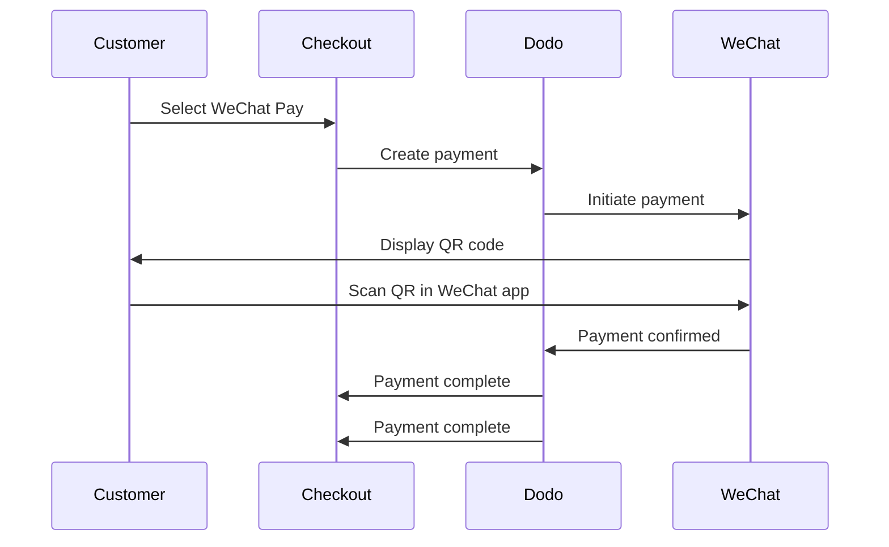

WeChat Pay는 중국의 두 주요 모바일 결제 플랫폼 중 하나로, 10억 명이 넘는 사람들이 사용하고 있습니다. WeChat 앱 내에서 QR 코드를 통해 결제를 가능하게 하여 중국 소비자를 대상으로 하는 비즈니스에 필수적입니다.

## Why Offer WeChat Pay?

<CardGroup cols={3}>
<Card title="1B+ Users" icon="users">
WeChat Pay는 10억 명 이상의 사람들이 사용하고 있어 세계에서 가장 큰 결제 플랫폼 중 하나입니다.
</Card>

<Card title="Mobile-First" icon="mobile">
결제는 WeChat 앱 내에서 완전히 완료되며, 중국 고객들에게 빠르고 친숙하며 마찰이 없는 경험을 제공합니다.
</Card>

<Card title="Dual Currency" icon="money-bill-transfer">
USD와 CNY 모두에서 결제를 수락하여 국경 간 및 국내 거래에 대한 유연성을 제공합니다.
</Card>
</CardGroup>

## Overview

| Detail | Value |
| :----- | :---- |
| **Billing Currency** | USD, CNY |
| **Subscriptions** | No |
| **Min Amount** | $0.50 / ¥1.00 |
| **Settlement** | USD |

## How It Works



## Customer Experience

1. 고객이 체크아웃 시 WeChat Pay를 선택합니다
2. 체크아웃 페이지에 QR 코드가 표시됩니다
3. 고객은 휴대전화에서 WeChat을 열고 QR 코드를 스캔합니다
4. 고객은 WeChat 앱에서 결제를 확인합니다
5. 결제가 즉시 확인되고 고객은 성공 페이지로 리디렉션됩니다

<Info>
고객은 USD 또는 CNY로 결제하고, 귀하는 USD로 결제를 받습니다.
</Info>

## Configuration

```javascript
const session = await client.checkoutSessions.create({
  product_cart: [{ product_id: 'pdt_123', quantity: 1 }],
  allowed_payment_method_types: ['we_chat_pay', 'credit', 'debit'],
  return_url: 'https://example.com/success'
});
```

## API Method Type

| Type | Method | Currencies |
| :--- | :----- | :--------- |
| `we_chat_pay` | WeChat Pay | USD, CNY |

## Testing

<Steps>
<Step title="Enable test mode">
Dodo Payments 테스트 API 키를 사용하세요.
</Step>

<Step title="Create a test checkout">
허용된 결제 방법에 `we_chat_pay`로 체크아웃 세션 만들기.
</Step>

<Step title="Scan the QR code">
테스트 QR 코드가 생성됩니다 — 일반 휴대폰 카메라로 스캔하세요 (WeChat 앱 필요 없음). 거래를 성공 또는 실패로 시뮬레이트할 수 있는 테스트 페이지로 리디렉션됩니다.
</Step>
</Steps>

## Best Practices

<AccordionGroup>
<Accordion title="Target Chinese customers">
WeChat Pay는 주로 중국 소비자가 사용합니다. 고객 기반에 중국 구매자가 포함되거나 중국 시장을 목표로 하고 있다면 포함하세요.
</Accordion>

<Accordion title="Always include card fallbacks">
모든 고객이 WeChat을 사용하는 것은 아닙니다. 항상 `credit` 및 `debit`를 대체 결제 수단으로 포함하세요.
</Accordion>

<Accordion title="Optimize for mobile">
많은 WeChat Pay 사용자가 모바일로 탐색합니다. 체크아웃 페이지가 반응형인지 확인하세요 — QR 코드 스캔은 체크아웃이 데스크톱이나 태블릿에 표시되고 고객이 휴대폰으로 스캔할 때 가장 잘 작동합니다.
</Accordion>

<Accordion title="Consider both currencies">
WeChat Pay는 USD와 CNY 모두를 지원합니다. 목표 시장에 가장 적합한 결제 통화를 선택하세요 — 국경 간 거래는 USD, 중국 국내 거래는 CNY를 사용합니다.
</Accordion>
</AccordionGroup>

## Troubleshooting

<AccordionGroup>
<Accordion title="WeChat Pay not appearing at checkout">
**확인:**
1. `we_chat_pay`가 `allowed_payment_method_types`에 포함되어 있습니까?
2. 청구 통화가 USD 또는 CNY로 설정되어 있습니까?
3. 거래 금액이 최소 금액을 충족합니까?

**해결책:** API 요청에서 결제 수단 유형과 통화를 올바르게 전달했는지 확인하세요.
</Accordion>

<Accordion title="QR code not scanning">
**원인:** QR 코드가 만료되었거나 고객의 WeChat 버전이 구식일 수 있습니다.

**해결책:** QR 코드를 새로 생성하려면 체크아웃 페이지를 새로 고치세요. 고객이 최신 버전의 WeChat을 사용하고 있는지 확인하세요.
</Accordion>

<Accordion title="Payment not confirming">
**원인:** WeChat Pay는 일반적으로 즉시 확인되지만 네트워크 지연이 발생할 수 있습니다.

**해결책:** 결제 확인을 위해 웹훅을 모니터링하세요. 몇 분 내에 결제가 확인되지 않으면 고객이 다시 시도해야 할 수 있습니다.
</Accordion>
</AccordionGroup>

## Related Pages

<CardGroup cols={2}>
<Card title="Payment Methods Overview" icon="credit-card" href="/features/payment-methods">
지원되는 모든 결제 수단을 참조하세요.
</Card>

<Card title="Checkout Guide" icon="book" href="/developer-resources/checkout-session">
완전한 체크아웃 구현 가이드를 확인하세요.
</Card>

<Card title="Webhooks" icon="webhook" href="/developer-resources/webhooks">
비동기적으로 결제 확인을 처리하세요.
</Card>

<Card title="Testing Process" icon="flask" href="/miscellaneous/testing-process">
모든 결제 방법에 대한 완전한 테스트 가이드를 확인하세요.
</Card>
</CardGroup>
