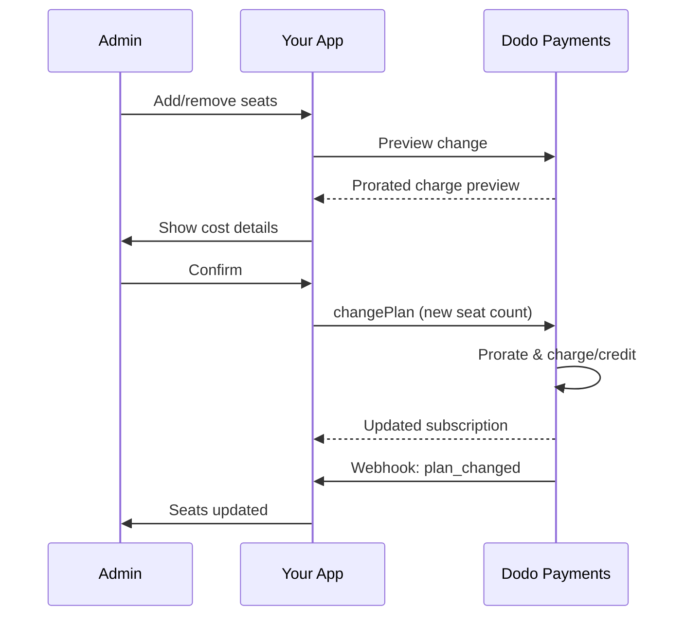

<Info>
좌석 기반 청구는 고객이 필요한 사용자, 팀원 또는 라이센스 수에 따라 요금을 부과할 수 있게 해줍니다. 이는 팀 협업 도구, 기업 소프트웨어 및 B2B SaaS 제품의 표준 가격 모델입니다.
</Info>

<CardGroup cols={2}>
<Card title="구현 튜토리얼" icon="code" href="/developer-resources/seat-based-pricing">
  단계별 가이드와 코드 예제.
</Card>

<Card title="부가 기능 문서" icon="puzzle" href="/features/addons">
  좌석 기반 청구를 지원하는 부가 기능 시스템에 대해 알아보세요.
</Card>

<Card title="구독 관리" icon="repeat" href="/features/subscription">
  좌석 기반 구독 및 요금제 변경 관리.
</Card>

<Card title="웹훅" icon="bell" href="/developer-resources/webhooks/intents/subscription">
  구독 웹훅으로 좌석 변경 사항 추적.
</Card>
</CardGroup>

---

## 좌석 기반 청구란?

좌석 기반 청구(사용자별 또는 좌석별 가격 책정이라고도 함)는 고객이 제품에 접근하는 사용자 수에 따라 요금을 부과합니다. 고정 요금 대신 팀 규모에 따라 가격이 조정됩니다.

### 일반적인 사용 사례

| 산업 | 예시 | 가격 모델 |
|----------|---------|---------------|
| 팀 협업 | Slack, Notion, Asana | 활성 사용자 기준/월 |
| 개발 도구 | GitHub, GitLab, Jira | 좌석 기준/월 |
| CRM 소프트웨어 | Salesforce, HubSpot | 사용자 라이센스 기준 |
| 디자인 도구 | Figma, Canva | 편집자 좌석 기준 |
| 보안 소프트웨어 | 1Password, Okta | 사용자 기준/월 |
| 화상 회의 | Zoom, Teams | 호스트 라이센스 기준 |

### 좌석 기반 가격 책정의 이점

**귀하의 비즈니스를 위해:**
- 고객이 성장함에 따라 수익이 자연스럽게 증가
- 고객이 예산을 세울 수 있는 예측 가능한 가격
- 개인에서 팀, 기업으로의 명확한 업그레이드 경로
- 팀이 확장됨에 따라 더 높은 고객 생애 가치

**고객을 위해:**
- 사용하는 만큼만 지불
- 비용을 이해하고 예측하기 쉬움
- 필요에 따라 사용자 추가/제거의 유연성
- 팀 규모에 맞는 공정한 가격

---

## Dodo Payments에서의 좌석 기반 청구 작동 방식

Dodo Payments는 **부가 기능** 시스템을 사용하여 좌석 기반 청구를 구현합니다. 작동 방식은 다음과 같습니다:

### 아키텍처 개요

팀 프로 구독은 월 $99이며 5명의 좌석을 포함합니다. 5명 이상의 사용자가 있는 경우 각 추가 좌석에 대해 월 $15의 추가 요금을 지불해야 합니다.

예를 들어, 팀에서 15개의 좌석이 필요한 경우:
- 기본 요금제: 월 $99 (5개의 좌석 포함)
- 추가 요금: 10개의 추가 좌석 × $15/월 = 월 $150
- 총 월 요금: $99 + $150 = 15개 좌석에 대해 $249

### 주요 구성 요소

| 구성 요소 | 목적 | 예시 |
|-----------|---------|---------|
| 기본 제품 | 포함된 좌석이 있는 핵심 구독 | "팀 요금제 - \$99/월 (5개 좌석 포함)" |
| 좌석 부가 기능 | 추가 사용자에 대한 좌석 요금 | "추가 좌석 - \$15/월" |
| 수량 | 구매한 추가 좌석 수 | 10개 추가 좌석 |

---

## 가격 책정 전략

비즈니스에 맞는 좌석 기반 가격 책정 전략을 선택하세요:

### 전략 1: 기본 + 좌석별 부가 기능

기본 요금제에 정해진 수의 좌석을 포함하고 추가 좌석에 대해 요금을 부과합니다.

**예시:**

```
Starter Plan: $49/month
├── Includes: 3 seats
├── Extra seats: $10/month each
└── 8 total seats = $49 + (5 × $10) = $99/month
```

**최고의 경우:** 소규모 팀이 기본 제공으로 기능할 수 있는 제품.

### 전략 2: 순수 좌석별 가격 책정

기본 요금 없이 좌석당 고정 요금을 부과합니다.

**예시:**

```
Per User: $12/month
├── 5 users = $60/month
├── 20 users = $240/month
└── 100 users = $1,200/month
```

**구현:** 기본 요금제를 \$0으로 설정하고 좌석 부가 기능만 사용합니다.

**최고의 경우:** 간단하고 투명한 가격 책정; 사용량 기반 모델.

### 전략 3: 계층형 좌석 가격 책정

다양한 기본 요금제와 서로 다른 좌석당 요금.

**예시:**

```
Starter: $0/month base + $15/seat
├── Lower features, higher per-seat cost

Professional: $99/month base + $10/seat
├── More features, lower per-seat cost

Enterprise: $499/month base + $7/seat
└── All features, volume discount on seats
```

**구현:** 각 계층에 대해 서로 다른 부가 기능 가격으로 별도의 제품을 만듭니다.

**최고의 경우:** 더 높은 계층으로의 업그레이드를 장려; 기업 판매.

### 전략 4: 좌석 번들

좌석을 개별적으로 판매하는 대신 묶음으로 판매합니다.

**예시:**

```
5-Seat Pack: $50/month ($10/seat)
10-Seat Pack: $80/month ($8/seat)
25-Seat Pack: $175/month ($7/seat)
```

**구현:** 다양한 묶음 크기에 대해 여러 부가 기능을 만듭니다.

**최고의 경우:** 구매 결정을 단순화; 더 큰 약속을 장려합니다.

---

## 좌석 기반 청구 설정하기

### 1단계: 가격 책정 계획하기

구현 전에 가격 구조를 정의합니다:

<Steps>
<Step title="기본 요금제 정의">
기본 구독에 포함된 내용을 결정합니다:
- 기본 가격 (순수 좌석 기준의 경우 \$0일 수 있음)
- 포함된 좌석 수
- 이 계층에서 사용할 수 있는 기능
</Step>

<Step title="좌석 가격 설정">
좌석당 부가 기능 비용을 결정합니다:
- 추가 좌석당 가격
- 대량 할인 (여러 부가 기능을 통해)
- 허용되는 최대 좌석 수 (해당되는 경우)
</Step>

<Step title="청구 주기 고려하기">
좌석 가격을 청구 주기와 일치시킵니다:
- 월간 구독 → 월간 좌석 요금
- 연간 구독 → 연간 좌석 요금 (종종 할인됨)
</Step>
</Steps>

### 2단계: 좌석 부가 기능 만들기

Dodo Payments 대시보드에서:

1. **제품** → **부가 기능**으로 이동합니다.
2. **부가 기능 만들기**를 클릭합니다.
3. 부가 기능을 구성합니다:

| 필드 | 값 | 비고 |
|-------|-------|-------|
| 이름 | "추가 좌석" 또는 "팀원" | 명확하고 사용자 친화적인 이름 |
| 설명 | "작업 공간에 팀원을 추가하세요" | 고객이 얻는 것 설명 |
| 가격 | 좌석당 가격 | 예: \$10.00 |
| 통화 | 기본 제품과 일치 | 반드시 동일한 통화여야 함 |
| 세금 카테고리 | 기본 제품과 동일 | 일관된 세금 처리를 보장 |

<Tip>
청구서에서 이해하기 쉬운 설명적인 부가 기능 이름을 만드세요. "추가 팀 좌석"은 고객이 청구서를 검토할 때 "좌석 부가 기능"보다 더 명확합니다.
</Tip>

### 3단계: 기본 구독 만들기

구독 제품을 만듭니다:

1. **제품** → **제품 만들기**로 이동합니다.
2. **구독** 선택
3. 가격 및 세부정보 구성
4. **부가 기능** 섹션에서 좌석 부가 기능을 연결합니다.

### 4단계: 제품에 부가 기능 연결하기

좌석 부가 기능을 구독에 연결합니다:

1. 구독 제품을 편집합니다.
2. **부가 기능** 섹션으로 스크롤합니다.
3. **부가 기능 추가** 클릭
4. 좌석 부가 기능 선택
5. 변경 사항 저장

<Check>
귀하의 구독 제품은 이제 좌석 기반 가격 책정을 지원합니다. 고객은 체크아웃 중에 추가 좌석을 원하는 만큼 구매할 수 있습니다.
</Check>

---

## 좌석 관리

### 새로운 구독에 좌석 추가하기

체크아웃 세션을 생성할 때 좌석 수를 지정합니다:

```typescript
const session = await client.checkoutSessions.create({
  product_cart: [{
    product_id: 'prod_team_plan',
    quantity: 1,
    addons: [{
      addon_id: 'addon_seat',
      quantity: 10  // 10 additional seats
    }]
  }],
  customer: { email: 'admin@company.com' },
  return_url: 'https://yourapp.com/success'
});
```

### 기존 구독의 좌석 수 변경하기

좌석을 조정하려면 Change Plan API를 사용합니다:

```typescript
// Add 5 more seats to existing subscription
await client.subscriptions.changePlan('sub_123', {
  product_id: 'prod_team_plan',
  quantity: 1,
  proration_billing_mode: 'prorated_immediately',
  addons: [{
    addon_id: 'addon_seat',
    quantity: 15  // New total: 15 additional seats
  }]
});
```

### 좌석 제거하기

좌석 수를 줄이려면 더 낮은 수량을 지정합니다:

```typescript
// Reduce from 15 to 8 additional seats
await client.subscriptions.changePlan('sub_123', {
  product_id: 'prod_team_plan',
  quantity: 1,
  proration_billing_mode: 'difference_immediately',
  addons: [{
    addon_id: 'addon_seat',
    quantity: 8  // Reduced to 8 additional seats
  }]
});
```

### 모든 추가 좌석 제거하기

모든 부가 기능을 제거하려면 빈 addons 배열을 전달합니다:

```typescript
// Remove all additional seats, keep only base plan seats
await client.subscriptions.changePlan('sub_123', {
  product_id: 'prod_team_plan',
  quantity: 1,
  proration_billing_mode: 'difference_immediately',
  addons: []  // Removes all add-ons
});
```

---

## 좌석 변경에 대한 비례 배분

고객이 중간 주기에 좌석을 추가하거나 제거할 때 비례 배분이 청구 방식을 결정합니다.



### 비율 계산 모드

| 모드 | 좌석 추가 | 좌석 제거 |
|------|-------------|----------------|
| `prorated_immediately` | 사이클의 남은 일수에 대해 요금 부과 | 사용하지 않은 일수에 대한 크레딧 |
| `difference_immediately` | 전체 좌석 요금 부과 | 향후 갱신에 반영된 크레딧 |
| `full_immediately` | 전체 좌석 요금 부과, 청구 주기 리셋 | 크레딧 없음 |

### 비율 계산 예제

**시나리오: 15일 청구 주기가 남아있고,$10/좌석에 대해 5개 좌석 추가**

<Tabs>
<Tab title="즉시 비율 계산">

```
Prorated charge = ($10 × 5 seats) × (15 days / 30 days)
                = $50 × 0.5
                = $25 immediate charge
```

고객은 지금 $25를 지불하고, 갱신 시 월 $50를 지불합니다.
</Tab>

<Tab title="즉시 차이">

```
Immediate charge = $10 × 5 seats = $50
```

고객은 사이클 위치와 관계없이 전체 $50를 지금 지불합니다.
</Tab>

<Tab title="즉시 전체">

```
Immediate charge = Full subscription + add-ons
Billing cycle resets to today
```

고객은 전체 금액을 지불하고 새로운 청구 주기가 시작됩니다.
</Tab>
</Tabs>

**시나리오: 비율 계산 즉시로 중간에 3개 좌석 제거**

```
Current: Team Plan ($99/month) + 10 extra seats × $10/seat = $199/month
Change: Remove 3 seats (10 → 7 extra seats) on day 20 of 30-day cycle
Remaining: 10 days

Credit for removed seats:
  = ($10 × 3 seats) × (10 days / 30 days)
  = $30 × 0.333
  = $10.00 credit

→ $10.00 credit added to subscription
→ Next renewal: $99 + (7 × $10) = $169.00/month
→ Credit auto-applies: $169.00 − $10.00 = $159.00 on next invoice
```

<Tip>
**좌석 변경에 대한 비율 계산 모드 선택**: 팀이 좌석을 자주 조정하는 경우 `prorated_immediately`를 사용하여 공정한 일 기반 청구를 하세요. 전체 좌석 요금을 부과하거나 크레딧을 적용하는 단순한 수학을 원하신다면 `difference_immediately`를 사용하세요. 자세한 비교는 [비율 가이드](/developer-resources/subscription-upgrade-downgrade#proration-modes)를 참조하세요.
</Tip>

### 변경 전에 미리보기

변경을 하기 전에 항상 비율 계산을 미리 보세요:

```typescript
const preview = await client.subscriptions.previewChangePlan('sub_123', {
  product_id: 'prod_team_plan',
  quantity: 1,
  proration_billing_mode: 'prorated_immediately',
  addons: [{ addon_id: 'addon_seat', quantity: 20 }]
});

console.log('Immediate charge:', preview.immediate_charge.summary);
// Show customer: "Adding 5 seats will cost $25 today"
```

---

## 웹훅으로 좌석 추적

구독 웹훅을 들어서 좌석 변화를 모니터링하세요:

### 관련 이벤트

| 이벤트 | 트리거 시점 | 사용 사례 |
|-------|----------------|----------|
| `subscription.active` | 새로운 구독 활성화 | 초기 좌석 설정 |
| `subscription.plan_changed` | 좌석 추가/제거 | 앱에서 좌석 수 업데이트 |
| `subscription.renewed` | 구독 갱신 | 좌석 수 변동 확인 |
| `subscription.cancelled` | 구독 취소 | 모든 좌석 비활성화 |

### 웹훅 핸들러 예제

```typescript
app.post('/webhooks/dodo', async (req, res) => {
  const event = req.body;

  switch (event.type) {
    case 'subscription.active':
      // New subscription - provision seats
      const seats = calculateTotalSeats(event.data);
      await provisionSeats(event.data.customer_id, seats);
      break;

    case 'subscription.plan_changed':
      // Seats changed - update access
      const newSeats = calculateTotalSeats(event.data);
      await updateSeatCount(event.data.subscription_id, newSeats);
      break;

    case 'subscription.cancelled':
      // Subscription cancelled - deprovision
      await deprovisionAllSeats(event.data.subscription_id);
      break;
  }

  res.json({ received: true });
});

function calculateTotalSeats(subscriptionData) {
  const baseSeats = 5;  // Included in plan
  const addonSeats = subscriptionData.addons?.reduce(
    (total, addon) => total + addon.quantity, 0
  ) || 0;
  return baseSeats + addonSeats;
}
```

---

## 좌석 한도 적용

애플리케이션은 좌석 한도를 적용해야 합니다. Dodo Payments는 청구를 추적하지만 액세스는 귀하가 제어합니다.

### 적용 전략

<Tabs>
<Tab title="강제 한도">
사용자 추가를 좌석 수를 초과하여 엄격히 방지합니다.

```typescript
async function inviteUser(teamId: string, email: string) {
  const team = await getTeam(teamId);
  const subscription = await getSubscription(team.subscriptionId);
  const totalSeats = calculateTotalSeats(subscription);
  const usedSeats = await countTeamMembers(teamId);

  if (usedSeats >= totalSeats) {
    throw new Error('No seats available. Please upgrade your plan.');
  }

  await sendInvitation(teamId, email);
}
```

</Tab>

<Tab title="경고가 있는 부드러운 한도">
경고와 유예 기간과 함께 초과 허용합니다.

```typescript
async function inviteUser(teamId: string, email: string) {
  const team = await getTeam(teamId);
  const { totalSeats, usedSeats } = await getSeatInfo(team);

  if (usedSeats >= totalSeats) {
    // Allow but flag for billing
    await flagOverage(teamId, usedSeats - totalSeats + 1);
    await notifyAdmin(team.adminEmail, 'You have exceeded your seat limit');
  }

  await sendInvitation(teamId, email);
}
```

</Tab>

<Tab title="자동 업그레이드">
한도에 도달할 때 자동으로 좌석 추가합니다.

```typescript
async function inviteUser(teamId: string, email: string) {
  const team = await getTeam(teamId);
  const { totalSeats, usedSeats, subscriptionId } = await getSeatInfo(team);

  if (usedSeats >= totalSeats) {
    // Automatically add a seat
    await client.subscriptions.changePlan(subscriptionId, {
      product_id: team.productId,
      quantity: 1,
      proration_billing_mode: 'prorated_immediately',
      addons: [{ addon_id: 'addon_seat', quantity: totalSeats - baseSeats + 1 }]
    });

    await notifyAdmin(team.adminEmail, 'A new seat was added to your plan');
  }

  await sendInvitation(teamId, email);
}
```

</Tab>
</Tabs>

---

## 고급 패턴

### 다양한 좌석 유형

다양한 가격으로 다양한 좌석 유형을 제공합니다:

```
Full Seats: $20/month - Full access to all features
View-Only Seats: $5/month - Read-only access
Guest Seats: $0/month - Limited external collaborator access
```

**구현:** 각 좌석 유형에 대해 별도의 추가 항목을 만듭니다.

```typescript
const session = await client.checkoutSessions.create({
  product_cart: [{
    product_id: 'prod_team_plan',
    quantity: 1,
    addons: [
      { addon_id: 'addon_full_seat', quantity: 10 },
      { addon_id: 'addon_viewer_seat', quantity: 25 },
      { addon_id: 'addon_guest_seat', quantity: 50 }
    ]
  }]
});
```

### 연간 좌석 할인

할인된 연간 좌석 가격을 제공합니다:

```
Monthly: $15/seat/month
Annual: $12/seat/month (20% savings)
```

**구현:** 월별 및 연간 요금제에 대해 다른 추가 요금이 있는 별도의 제품을 만듭니다.

### 최소 좌석 요구 사항

특정 요금제에 대해 최소 좌석 수를 요구합니다:

```typescript
async function validateSeatCount(planId: string, seatCount: number) {
  const minimums = {
    'prod_starter': 1,
    'prod_team': 5,
    'prod_enterprise': 25
  };

  if (seatCount < minimums[planId]) {
    throw new Error(`${planId} requires at least ${minimums[planId]} seats`);
  }
}
```

---

## 모범 사례

### 가격 책정 모범 사례

- **명확한 커뮤니케이션**: 가격 페이지에 좌석당 요금을 눈에 띄게 보여주세요.
- **포함된 좌석**: 마찰을 줄이기 위해 기본 요금에 몇 개의 좌석을 포함하는 것을 고려하세요.
- **대량 할인**: 더 큰 팀을 위한 저렴한 좌석당 요금을 제공하여 기업 거래를 성사시킵니다.
- **연간 인센티브**: 연간 요금제를 할인하여 현금 흐름과 유지를 개선합니다.

### 기술적 모범 사례

- **좌석 수 캐시**: API 호출을 피하기 위해 구독 좌석 수를 로컬에서 캐시합니다.
- **정기 동기화**: 주기적으로 로컬 좌석 수를 Dodo Payments와 API를 통해 동기화합니다.
- **실패 처리**: 좌석 변경이 실패할 경우 명확한 오류 메시지와 재시도 옵션을 표시합니다.
- **감사 추적**: 청구 분쟁 및 준수를 위해 모든 좌석 변경 사항을 기록합니다.

### 사용자 경험 모범 사례

- **실시간 피드백**: 좌석 조정 시 즉각적인 비용 영향을 보여줍니다.
- **확인 단계**: 청구 변경 전에 확인을 요구합니다.
- **비율 투명성**: 적용 전에 비율 계산된 요금을 명확히 설명합니다.
- **간편한 다운그레이드**: 좌석을 줄이는 것을 어렵게 만들지 마세요 (신뢰를 구축합니다).

---

## 문제 해결

<AccordionGroup>
<Accordion title="앱과 청구 간 좌석 수 불일치">
**증상**: 애플리케이션에서 구독과 다른 좌석 수를 표시합니다.

**원인**:
- 웹훅 수신 또는 처리되지 않음
- 좌석 변경 중 레이스 조건
- 캐시된 데이터가 업데이트되지 않음

**해결책**:
1. `subscription.plan_changed`에 대한 웹훅 핸들러를 구현합니다.
2. 현재 구독을 가져오는 "청구와 동기화" 버튼을 추가합니다.
3. 정기적인 새로 고침을 보장하기 위해 캐시 TTL을 설정합니다.
</Accordion>

<Accordion title="비율 계산 요금이 예상과 다름">
**증상**: 고객이 중간 청구 금액에 혼란을 느낍니다.

**원인**:
- 비율 모드가 명확히 전달되지 않음
- 고객이 확인 전에 미리보기를 보지 않음

**해결책**:
1. 변경하기 전에 항상 `previewChangePlan`를 사용하십시오.
2. "X 좌석 추가 = Y 달러 (Z일에 대한 비율 계산)"와 같은 명확한 내역을 표시합니다.
3. 도움말 센터에 비율 정책을 문서화합니다.
</Accordion>

<Accordion title="체크아웃에서 추가 항목이 나타나지 않음">
**증상**: 체크아웃 시 좌석 추가 항목이 사용 가능하지 않습니다.

**원인**:
- 추가 항목이 제품에 첨부되지 않음
- 추가 항목이 보관되었거나 삭제됨
- 제품과 추가 항목 간 통화 불일치

**해결책**:
1. 제품 설정에서 추가 항목이 연결되어 있는지 확인하십시오.
2. 추가 항목 대시보드에서 상태를 확인합니다.
3. 통화가 정확히 일치하는지 확인합니다.
</Accordion>

<Accordion title="현재 사용량 이하로 좌석을 줄일 수 없음">
**증상**: 고객이 좌석을 줄이기를 원하지만 사용자에 할당되어 있습니다.

**해결책**:
1. 좌석을 줄이기 전에 제거해야 할 사용자를 보여줍니다.
2. 워크플로우 구현: 사용자 제거 → 좌석 줄이기
3. 좌석 감소를 적용하기 전에 유예 기간을 고려합니다.
</Accordion>
</AccordionGroup>

---

## 관련 문서

<CardGroup cols={2}>
<Card title="좌석 기반 가격 책정 튜토리얼" icon="code" href="/developer-resources/seat-based-pricing">
  코드가 포함된 전체 구현 가이드입니다.
</Card>

<Card title="추가 항목" icon="puzzle" href="/features/addons">
  추가 항목 시스템을 깊이 이해합니다.
</Card>

<Card title="요금제 변경 및 비율 계산" icon="arrows-rotate" href="/developer-resources/subscription-upgrade-downgrade">
  구독 수정 처리합니다.
</Card>

<Card title="구독 웹훅" icon="bell" href="/developer-resources/webhooks/intents/subscription">
  구독 이벤트를 추적합니다.
</Card>
</CardGroup>
