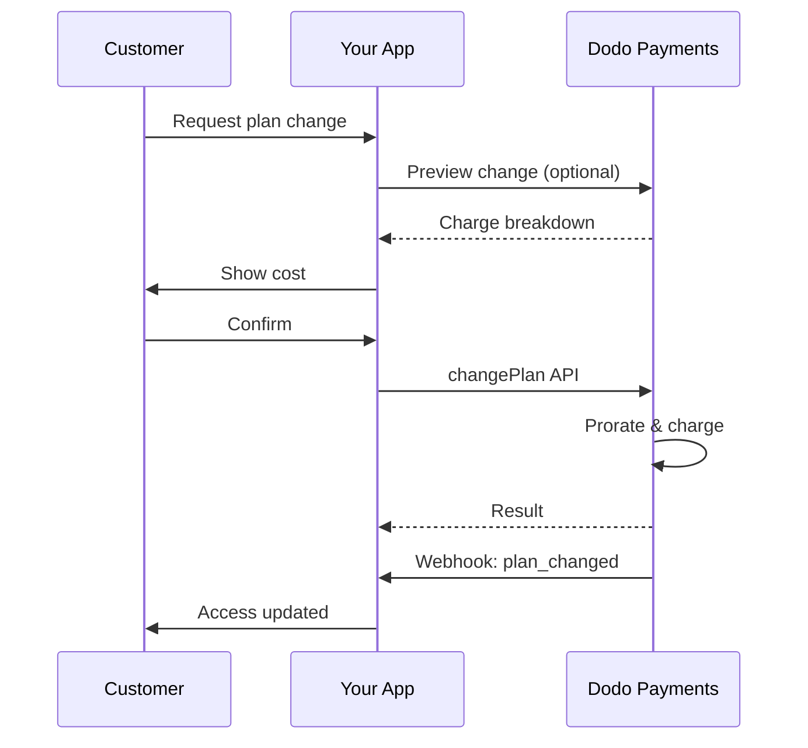
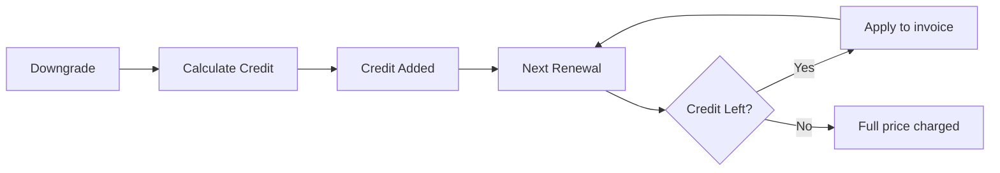
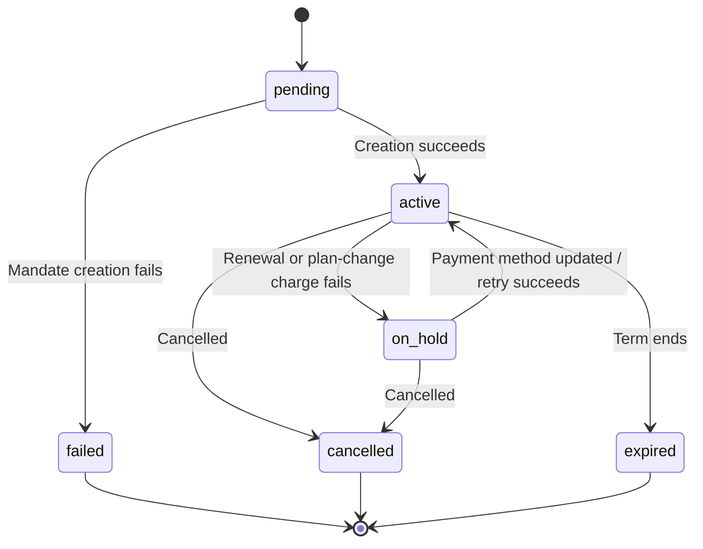

<Info>
구독을 사용하면 자동 갱신을 통해 지속적인 액세스를 판매할 수 있습니다. 유연한 청구 주기, 무료 체험, 플랜 변경 및 추가 기능을 사용해 고객별로 가격을 맞춤 설정하세요.
</Info>

<CardGroup cols={2}>
<Card title="Upgrade & Downgrade" icon="repeat" href="/developer-resources/subscription-upgrade-downgrade">
일할 계산 및 수량 업데이트로 플랜 변경을 관리하세요.
</Card>

<Card title="On‑Demand Subscriptions" icon="bolt" href="/developer-resources/ondemand-subscriptions">
지금 mandate를 승인하고 나중에 사용자 지정 금액을 청구하세요.
</Card>

<Card title="Customer Portal" icon="id-card" href="/features/customer-portal">
고객이 플랜, 청구 및 취소를 직접 관리할 수 있도록 하세요.
</Card>

<Card title="Subscription Webhooks" icon="code" href="/developer-resources/webhooks/intents/subscription">
생성, 갱신 및 취소와 같은 lifecycle 이벤트에 대응하세요.
</Card>
</CardGroup>

## 구독이란 무엇인가요?

구독은 고객이 일정에 따라 구매하는 반복 상품입니다. 다음과 같은 경우에 적합합니다.

- **SaaS 라이선스**: 앱, API 또는 플랫폼 액세스
- **멤버십**: 커뮤니티, 프로그램 또는 클럽
- **디지털 콘텐츠**: 강좌, 미디어 또는 프리미엄 콘텐츠
- **지원 플랜**: SLA, 성공 지원 패키지 또는 유지 관리

## 주요 이점

- **예측 가능한 수익**: 자동 갱신을 지원하는 반복 결제
- **유연한 주기**: 월간, 연간, 사용자 지정 간격 및 체험 기간
- **유연한 플랜 관리**: 업그레이드 및 다운그레이드에 대한 일할 계산
- **추가 기능 및 좌석**: 선택적이고 수량화 가능한 업그레이드 연결
- **원활한 checkout**: 호스팅 checkout 및 customer portal
- **개발자 중심**: 생성, 변경 및 사용량 추적을 위한 명확한 API

## 구독 생성

Dodo Payments 대시보드에서 구독 상품을 생성한 다음 checkout 또는 API를 통해 판매하세요. 상품과 활성 구독을 분리하면 가격을 버전별로 관리하고, 추가 기능을 연결하며, 성과를 독립적으로 추적할 수 있습니다.

### 구독 상품 생성

대시보드의 필드를 구성하여 구독 상품의 판매, 갱신 및 청구 방식을 정의하세요. 아래 섹션은 생성 양식에서 확인하는 항목과 직접 연결됩니다.

#### 상품 세부 정보

- **상품 이름** (필수): checkout, customer portal 및 인보이스에 표시되는 이름입니다.
- **상품 설명** (필수): checkout 및 인보이스에 표시되는 명확한 가치 설명입니다.
- **상품 이미지** (필수): 최대 3MB의 PNG/JPG/WebP입니다. checkout 및 인보이스에 사용됩니다.
- **브랜드**: 테마와 이메일에 사용할 특정 브랜드에 상품을 연결합니다.
- **세금 카테고리** (필수): 세금 규칙을 결정할 카테고리(예: SaaS)를 선택합니다.

<Tip>
지역별로 정확한 세금을 징수할 수 있도록 가장 적합한 세금 카테고리를 선택하세요.
</Tip>

#### 가격

- **가격 유형**: <b>Subscription</b>(이 가이드의 유형)을 선택합니다. 대안으로 Single Payment 및 Usage Based Billing이 있습니다.
- **가격** (필수): 통화가 포함된 기본 반복 가격입니다. 가격은 **$1**(또는 선택한 통화로 이에 상응하는 금액) 이상이어야 합니다. 이 최저 금액보다 낮은 금액은 지원되지 않으며 구독이 작동하지 않습니다.
- **할인 적용(%)**: 기본 가격에 적용되는 선택적 백분율 할인으로, checkout 및 인보이스에 반영됩니다.
- **반복 결제 간격** (필수): 갱신 간격입니다(예: 1개월마다). 주기(개월 또는 년)와 수량을 선택합니다.
- **구독 기간** (필수): 구독이 활성 상태로 유지되는 전체 기간입니다(예: 10년). 이 기간이 끝나면 연장하지 않는 한 갱신이 중지됩니다.
- **체험 기간(일)** (필수): 일 단위의 체험 기간을 설정합니다. 체험을 사용하지 않으려면 0을 입력합니다. 체험이 종료되면 첫 결제가 자동으로 진행됩니다.
- **추가 기능 선택**: 고객이 기본 플랜과 함께 구매할 수 있는 추가 기능을 최대 10개까지 연결합니다.

<Warning>
활성 상품의 가격을 변경하면 신규 구매에 영향을 줍니다. 기존 구독에는 플랜 변경 및 일할 계산 설정이 적용됩니다.
</Warning>

<Info>
추가 기능은 좌석 또는 스토리지와 같은 수량화 가능한 추가 항목에 적합합니다. 고객이 추가 기능을 변경할 때 허용되는 수량과 일할 계산 동작을 제어할 수 있습니다.
</Info>

#### 고급 설정

- **세금 포함 가격**: 적용 가능한 세금이 포함된 가격을 표시합니다. 최종 세금 계산은 고객의 위치에 따라 달라집니다.
- **라이선스 키 생성**: 구매 후 각 고객에게 고유 키를 발급합니다. <a href="/features/license-keys">License Keys</a> 가이드를 참조하세요.
- **디지털 상품 제공**: 구매 후 파일 또는 콘텐츠를 자동으로 제공합니다. <a href="/features/digital-product-delivery">Digital Product Delivery</a>에서 자세히 알아보세요.
- **메타데이터**: 내부 태그 또는 클라이언트 통합을 위해 사용자 지정 키-값 쌍을 연결합니다. <a href="/api-reference/metadata">Metadata</a>를 참조하세요.

<Tip>
시스템의 식별자(예: accountId)를 메타데이터에 저장하면 나중에 이벤트와 인보이스를 대조할 수 있습니다.
</Tip>

## 구독 체험

체험 기간을 사용하면 고객이 즉시 결제하지 않고 구독에 액세스할 수 있습니다. 체험이 종료되면 첫 결제가 자동으로 진행됩니다.

### 체험 구성

상품 가격 섹션에서 **Trial Period Days**를 설정합니다(체험을 사용하지 않으려면 `0`를 사용). 구독을 생성할 때 이 값을 재정의할 수 있습니다.

```typescript
// Via subscription creation
const subscription = await client.subscriptions.create({
  customer_id: 'cus_123',
  product_id: 'prod_monthly',
  trial_period_days: 14  // Overrides product's trial period
});

// Via checkout session
const session = await client.checkoutSessions.create({
  product_cart: [{ product_id: 'prod_monthly', quantity: 1 }],
  subscription_data: { trial_period_days: 14 }
});
```

<Warning>
`trial_period_days` 값은 0일에서 10,000일 사이여야 합니다.
</Warning>

### 체험 상태 감지

<Warning>
현재 체험 상태를 감지할 수 있는 직접적인 필드는 없습니다. 다음은 결제를 조회해야 하는 비효율적인 우회 방법입니다. 더 효율적인 해결 방법을 개발하고 있습니다.
</Warning>

구독이 체험 기간인지 확인하려면 해당 구독의 결제 목록을 조회하세요. 금액이 0인 결제가 정확히 하나 있으면 구독이 체험 기간입니다.

```typescript
const subscription = await client.subscriptions.retrieve('sub_123');
const payments = await client.payments.list({
  subscription_id: subscription.subscription_id
});

// Check if subscription is in trial
const isInTrial = payments.items.length === 1 && 
                  payments.items[0].total_amount === 0;
```

### 체험 기간 업데이트

`next_billing_date`을 업데이트하여 체험 기간을 연장합니다.

```typescript
await client.subscriptions.update('sub_123', {
  next_billing_date: '2025-02-15T00:00:00Z'  // New trial end date
});
```

<Warning>
`next_billing_date`을 과거 시점으로 설정할 수 없습니다. 날짜는 미래여야 합니다.
</Warning>

## 구독 플랜 변경

플랜 변경을 사용하면 구독을 업그레이드 또는 다운그레이드하고, 수량을 조정하거나, 다른 상품으로 이전할 수 있습니다. 선택한 일할 계산 모드에 따라 변경 시 즉시 청구가 발생하거나 크레딧이 생성되거나 청구 조정이 적용되지 않을 수 있습니다.

<Tip>
Dodo Payments 대시보드에서 직접 구독 플랜을 변경하고 다음 청구일을 업데이트할 수 있습니다. API 호출 없이 고객 지원 요청, 프로모션 업그레이드 또는 플랜 이전에 맞춰 구독을 빠르게 조정할 수 있습니다.
</Tip>

<Tip>
**셀프서비스 플랜 변경 활성화:** 고객이 Customer Portal를 통해 자신의 구독을 업그레이드 또는 다운그레이드하도록 하려면 어떻게 해야 하나요? 구독 상품을 Product Collection에 추가하고 Subscription Settings에서 "Allow Subscription Updates"를 활성화하세요.
</Tip>



<Card title="Product Collections" icon="layer-group" href="/features/product-collections">
  관련 상품을 컬렉션으로 그룹화하여 Customer Portal에서 원활한 업그레이드/다운그레이드 경로를 활성화하세요.
</Card>

### 일할 계산 모드

플랜 변경 시 고객에게 청구할 방식을 선택하세요.

<Info>
**네 가지 일할 계산 모드 간 빠른 비교:**

| | `prorated_immediately` | `difference_immediately` | `full_immediately` | `do_not_bill` |
|---|---|---|---|---|
| **업그레이드** | 남은 일수에 대한 일할 계산 요금 | 전체 가격 차액 청구 | 새 플랜의 전체 가격 청구 | 요금 없음 — 즉시 전환 |
| **다운그레이드** | 남은 일수에 대한 일할 계산 크레딧 | 전체 가격 차액을 크레딧으로 제공 | 크레딧 없음, 전체 요금 청구 | 크레딧 없음 — 즉시 전환 |
| **청구 주기** | 오늘을 기준으로 재설정 | 오늘을 기준으로 재설정 | 오늘을 기준으로 재설정 | 동일하게 유지 |
| **적합한 경우** | 시간에 따른 공정한 청구 | 간단한 등급 변경 | 청구 주기 재설정 | 무료 이전 또는 배려 차원의 전환 |
</Info>

#### `prorated_immediately`
현재 청구 주기에 남은 시간을 기준으로 일할 계산된 금액을 청구합니다. 사용하지 않은 시간을 반영한 공정한 청구에 적합합니다.

```typescript
await client.subscriptions.changePlan('sub_123', {
  product_id: 'prod_pro',
  quantity: 1,
  proration_billing_mode: 'prorated_immediately'
});
```

#### `difference_immediately`
가격 차액을 즉시 청구하거나(업그레이드), 향후 갱신에 사용할 크레딧을 추가합니다(다운그레이드). 간단한 업그레이드/다운그레이드 시나리오에 적합합니다.

```typescript
// Upgrade: charges $50 (difference between $30 and $80)
// Downgrade: credits remaining value, auto-applied to renewals
await client.subscriptions.changePlan('sub_123', {
  product_id: 'prod_pro',
  quantity: 1,
  proration_billing_mode: 'difference_immediately'
});
```

<Info>
`difference_immediately`을 사용한 다운그레이드 크레딧은 구독 범위에 적용되며 향후 갱신에 자동으로 사용됩니다. 이는 <a href="/features/credit-based-billing">Credit-Based Billing</a> entitlement와는 다릅니다.
</Info>

고객이 `difference_immediately`을 사용해 다운그레이드하면 사용하지 않은 가치가 구독 범위의 크레딧이 되어 향후 갱신 금액에서 자동으로 차감됩니다.



#### `full_immediately`
남은 시간을 무시하고 새 플랜의 전체 금액을 즉시 청구합니다. 청구 주기를 재설정할 때 적합합니다.

```typescript
await client.subscriptions.changePlan('sub_123', {
  product_id: 'prod_monthly',
  quantity: 1,
  proration_billing_mode: 'full_immediately'
});
```

#### `do_not_bill`
청구 조정 없이 새 플랜으로 전환합니다. 일할 계산 요금이나 크레딧이 없으며 고객은 단순히 새 플랜으로 이동합니다. 배려 차원의 이전, 무료 플랜 전환 또는 비용 차액을 부담하려는 경우에 적합합니다.

```typescript
await client.subscriptions.changePlan('sub_123', {
  product_id: 'prod_new_plan',
  quantity: 1,
  proration_billing_mode: 'do_not_bill'
});
```

<AccordionGroup>
<Accordion title="Example: Prorated upgrade calculation">

**시나리오**: Basic($30/월)을 사용하는 고객이 30일 주기의 16일째에 `prorated_immediately`을 사용하여 Pro($80/월)로 업그레이드합니다.

```
Unused credit from Basic = $30 × (15 remaining / 30 total) = $15.00
Prorated cost of Pro     = $80 × (15 remaining / 30 total) = $40.00
────────────────────────────────────────────────────────────────────
Immediate charge         = $40.00 − $15.00 = $25.00
```

다음 갱신일은 **2월 15일**(1월 16일 + 30일)이며 요금은 **$80.00/월**입니다.

<Tip>
더 자세한 계산 예시와 예외 사례는 전체 [업그레이드 및 다운그레이드 가이드](/developer-resources/subscription-upgrade-downgrade)를 참조하세요.
</Tip>

</Accordion>
<Accordion title="Example: Downgrade credit calculation">

**시나리오**: Pro($80/월)를 사용하는 고객이 `difference_immediately`을 사용하여 Starter($20/월)로 다운그레이드합니다.

```
Credit = Old plan − New plan = $80 − $20 = $60.00
```

$60 크레딧이 향후 갱신에 자동으로 적용됩니다.
- 갱신 1: $20 − $20(크레딧) = **$0.00**(남은 크레딧 $40)
- 갱신 2: $20 − $20(크레딧) = **$0.00**(남은 크레딧 $20)  
- 갱신 3: $20 − $20(크레딧) = **$0.00**(크레딧 소진)
- 갱신 4: **$20.00**(전체 가격)

<Info>
크레딧 관리 방법에 대한 자세한 내용은 [업그레이드 및 다운그레이드 가이드](/developer-resources/subscription-upgrade-downgrade)를 참조하세요.
</Info>

</Accordion>
</AccordionGroup>

### 추가 기능을 포함한 플랜 변경

플랜을 변경할 때 추가 기능을 수정하세요. 추가 기능은 일할 계산에 포함됩니다.

```typescript
await client.subscriptions.changePlan('sub_123', {
  product_id: 'prod_pro',
  quantity: 1,
  proration_billing_mode: 'difference_immediately',
  addons: [{ addon_id: 'addon_extra_seats', quantity: 2 }]  // Add add-ons
  // addons: []  // Empty array removes all existing add-ons
});
```

<Info>
플랜 변경은 즉시 청구를 발생시킵니다. 청구에 실패하면 구독이 `on_hold` 상태가 될 수 있습니다. `subscription.plan_changed` webhook 이벤트를 통해 변경 사항을 추적하세요.
</Info>

### 플랜 변경 미리 보기

플랜 변경을 확정하기 전에 정확한 청구 금액과 그 결과로 생성되는 구독을 미리 확인하세요.

```typescript
const preview = await client.subscriptions.previewChangePlan('sub_123', {
  product_id: 'prod_pro',
  quantity: 1,
  proration_billing_mode: 'prorated_immediately'
});

// Show customer the charge before confirming
console.log('You will be charged:', preview.immediate_charge.summary);
```

<Card title="Preview Change Plan API" icon="eye" href="/api-reference/subscriptions/preview-change-plan">
  확정하기 전에 플랜 변경을 미리 확인하세요.
</Card>

## 구독 상태

구독은 수명 동안 정의된 여러 상태를 거칩니다. 이 표는 각 상태의 의미, 발생 원인 및 복구 가능 여부와 복구 방법을 보여주는 기준입니다.

| 상태 | 의미 | 복구 가능? | 복구 방법 / 다음 단계 |
|--------|---------------|--------------|---------------------------|
| `pending` | 구독을 생성하거나 처리하는 중입니다 | — | `subscription.active`(또는 `subscription.failed`)를 기다립니다 |
| `active` | 구독이 활성 상태이며 자동으로 갱신됩니다 | — | 별도의 조치가 필요하지 않습니다 |
| `on_hold` | 갱신 결제(또는 플랜 변경 요금)에 실패하여 구독이 일시 중지되었습니다 | **예** | 결제 수단을 업데이트하여 재활성화합니다 — [Payment Retries](/features/recovery/payment-retries) 및 [Dunning](/features/recovery/subscription-dunning)을 통한 자동 처리 또는 [Update Payment Method API](/api-reference/subscriptions/update-payment-method)를 통한 수동 처리 |
| `cancelled` | 구독이 취소되어 갱신되지 않습니다 | 재구매만 가능 | 고객이 새 구독을 시작해야 합니다. [Dunning](/features/recovery/subscription-dunning)을 통해 재구매를 유도할 수 있습니다 |
| `failed` | 구독 **생성**에 실패했습니다(초기 mandate 또는 결제가 성공하지 않음) | **아니요 — 최종 상태** | 고객이 정상적인 결제 수단으로 새 구독을 생성해야 합니다 |
| `expired` | 구독이 기간의 끝에 도달했습니다 | — | 필요한 경우 고객이 새 구독을 시작해야 합니다 |

<Warning>
`on_hold`와 `failed`는 자주 혼동됩니다. `on_hold`는 이미 활성화된 구독의 갱신에 실패했을 때 발생하는 **복구 가능한** 상태입니다. `failed`는 **초기** 구독 생성에 실패했을 때만 발생하는 **최종** 상태이며 재활성화할 수 없습니다.
</Warning>

### 상태 머신



### 보류 상태

다음과 같은 경우 구독이 `on_hold` 상태가 됩니다.

- 갱신 결제 실패(잔액 부족, 카드 만료 등)
- 플랜 변경 요금 결제 실패
- 결제 수단 승인 실패

<Warning>
구독이 `on_hold` 상태이면 자동으로 갱신되지 않습니다. 구독을 재활성화하려면 결제 수단을 업데이트해야 합니다.
</Warning>

### 보류 상태에서 재활성화

`on_hold` 상태의 구독을 재활성화하려면 결제 수단을 업데이트하세요. 그러면 다음 작업이 자동으로 수행됩니다.

1. 미납 잔액에 대한 청구 생성
2. 인보이스 생성
3. 새 결제 수단을 사용한 결제 처리
4. 결제에 성공하면 구독을 `active` 상태로 재활성화

```typescript
// Reactivate subscription from on_hold
const response = await client.subscriptions.updatePaymentMethod('sub_123', {
  payment_method: {
    type: 'new',
    return_url: 'https://example.com/return'
  }
});

// For on_hold subscriptions, a charge is automatically created
if (response.payment_id) {
  console.log('Charge created:', response.payment_id);
  // Redirect customer to response.payment_link to complete payment
  // Monitor webhooks for payment.succeeded and subscription.active
}
```

<Info>
`on_hold` 구독의 결제 수단을 성공적으로 업데이트하면 `payment.succeeded` webhook 이벤트가 발생한 후 `subscription.active` webhook 이벤트가 발생합니다.
</Info>

### 전환별 Webhook 이벤트

각 전환은 webhook을 생성하므로 polling 없이 entitlement 로직을 실행할 수 있습니다.

| 전환 | 이벤트 |
|------------|-------|
| 구독 활성화 | `subscription.active` |
| 갱신 성공 | `subscription.renewed` |
| 갱신 실패 → 일시 중지 | `subscription.on_hold` |
| 생성 실패 | `subscription.failed` |
| 플랜 업그레이드/다운그레이드 | `subscription.plan_changed` |
| 취소됨 | `subscription.cancelled` |
| 기간 종료 | `subscription.expired` |
| 모든 필드 변경 | `subscription.updated` |

<Card title="Subscription Webhook Payloads" icon="webhook" href="/developer-resources/webhooks/intents/subscription">
구독 lifecycle 이벤트의 전체 payload schema를 확인하세요.
</Card>

## API 관리

<AccordionGroup>
<Accordion title="Create subscriptions">
`POST /subscriptions`을 사용하여 선택적 체험 기간 및 추가 기능과 함께 상품에서 프로그래밍 방식으로 구독을 생성하세요.

<Card title="API Reference" icon="code" href="/api-reference/subscriptions/post-subscriptions">
구독 생성 API를 확인하세요.
</Card>
</Accordion>

<Accordion title="Update subscriptions">
`PATCH /subscriptions/{id}`을 사용하여 수량을 업데이트하고, 다음 청구일에 취소하거나, 메타데이터를 수정하세요.

<Card title="API Reference" icon="code" href="/api-reference/subscriptions/patch-subscriptions">
구독 세부 정보를 업데이트하는 방법을 알아보세요.
</Card>
</Accordion>

<Accordion title="Change plans (proration)">
일할 계산 제어 기능을 사용하여 활성 상품과 수량을 변경하세요.

<Card title="API Reference" icon="code" href="/api-reference/subscriptions/change-plan">
플랜 변경 옵션을 검토하세요.
</Card>
</Accordion>

<Accordion title="On‑demand charges">
주문형 구독의 경우 필요할 때 특정 금액을 청구하세요.

<Card title="API Reference" icon="code" href="/api-reference/subscriptions/create-charge">
주문형 구독을 청구하세요.
</Card>
</Accordion>

<Accordion title="List and retrieve">
`GET /subscriptions`을 사용하여 모든 구독을 나열하고 `GET /subscriptions/{id}`을 사용하여 하나의 구독을 조회하세요.

<Card title="API Reference" icon="code" href="/api-reference/subscriptions/get-subscriptions">
목록 조회 및 검색 API를 확인하세요.
</Card>
</Accordion>

<Accordion title="Usage history">
미터링 또는 하이브리드 가격 모델의 기록된 사용량을 가져옵니다.

<Card title="API Reference" icon="code" href="/api-reference/subscriptions/get-usage-history">
사용량 기록 API를 확인하세요.
</Card>
</Accordion>

<Accordion title="Update payment method">
구독의 결제 수단을 업데이트합니다. 활성 구독의 경우 향후 갱신에 사용할 결제 수단이 업데이트됩니다. `on_hold` 상태의 구독은 미납 잔액에 대한 청구를 생성하여 재활성화합니다.

새 결제 수단 링크를 생성할 때(`New` request type), `allowed_payment_method_types`를 전달하여 해당 페이지에 고객에게 표시할 결제 수단을 제한할 수 있습니다. 목록에 없는 결제 수단은 고객에게 표시되지 않지만, 결제 수단을 포함한다고 해서 해당 수단이 표시되는 것은 아닙니다(사용 가능 여부는 고객의 위치 및 비즈니스 설정과 같은 요인에 따라 달라집니다).

<Card title="API Reference" icon="code" href="/api-reference/subscriptions/update-payment-method">
결제 수단을 업데이트하고 구독을 재활성화하는 방법을 알아보세요.
</Card>
</Accordion>
</AccordionGroup>

## 일반적인 사용 사례

- **SaaS 및 API**: 좌석 또는 사용량에 대한 추가 기능을 포함한 등급별 액세스
- **콘텐츠 및 미디어**: 입문 체험 기간을 포함한 월간 액세스
- **B2B 지원 플랜**: 프리미엄 지원 추가 기능을 포함한 연간 계약
- **도구 및 플러그인**: 라이선스 키 및 버전별 릴리스

## 통합 예시

### Checkout 세션(구독)
checkout 세션을 생성할 때 구독 상품과 선택적 추가 기능을 포함하세요.

```typescript
const session = await client.checkoutSessions.create({
  product_cart: [
    {
      product_id: 'prod_subscription',
      quantity: 1
    }
  ]
});
```

### 일할 계산을 적용한 플랜 변경
구독을 업그레이드 또는 다운그레이드하고 일할 계산 동작을 제어하세요.

```typescript
await client.subscriptions.changePlan('sub_123', {
  product_id: 'prod_new',
  quantity: 1,
  proration_billing_mode: 'difference_immediately'
});
```

### 다음 청구일에 취소
현재 청구 기간이 끝날 때 적용되는 취소를 예약하세요.

```typescript
await client.subscriptions.update('sub_123', {
  cancel_at_next_billing_date: true
});
```

### 구독 기간 연장
새 `subscription_period_count` 및 `subscription_period_interval`를 `PATCH /subscriptions/{id}`에 전달하여 구독 실행 기간을 연장합니다. 구독 만료일은 새 수량과 간격을 기준으로 다시 계산됩니다. 예를 들어 고객에게 현재 플랜의 추가 기간을 제공할 수 있습니다.

```typescript
await client.subscriptions.update('sub_123', {
  subscription_period_count: 5,
  subscription_period_interval: 'Month'
});
```

<Note>
구독 기간은 **늘릴** 수만 있으며 단축할 수는 없습니다.
</Note>

### 주문형 구독
주문형 구독을 생성하고 필요할 때 나중에 청구하세요.

```typescript
const onDemand = await client.subscriptions.create({
  customer_id: 'cus_123',
  product_id: 'prod_on_demand',
  on_demand: { mandate_only: true }
});

await client.subscriptions.charge(onDemand.id, {
  product_price: 4900,
  product_currency: 'USD',
  product_description: 'Extra usage for September'
});
```

### 활성 구독의 결제 수단 업데이트
활성 구독의 결제 수단을 업데이트하세요.

```typescript
// Update with new payment method
const response = await client.subscriptions.updatePaymentMethod('sub_123', {
  payment_method: {
    type: 'new',
    return_url: 'https://example.com/return'
  }
});

// Or use existing payment method
await client.subscriptions.updatePaymentMethod('sub_123', {
  payment_method: {
    type: 'existing',
    payment_method_id: 'pm_abc123'
  }
});
```

### on_hold 상태의 구독 재활성화
결제 실패로 보류 상태가 된 구독을 재활성화하세요.

```typescript
// Update payment method - automatically creates charge for remaining dues
const response = await client.subscriptions.updatePaymentMethod('sub_123', {
  payment_method: {
    type: 'new',
    return_url: 'https://example.com/return'
  }
});

if (response.payment_id) {
  // Charge created for remaining dues
  // Redirect customer to response.payment_link
  // Monitor webhooks: payment.succeeded → subscription.active
}
```

## RBI 규정을 준수하는 mandate를 사용하는 구독

  UPI 및 인도 카드 구독은 특정 mandate 요구 사항이 적용되는 RBI(Reserve Bank of India) 규정에 따라 운영됩니다.

  ### Mandate 한도

  mandate 유형과 금액은 구독의 반복 청구 금액에 따라 달라집니다.

  - **mandate 최저 금액 미만의 청구(기본값 ₹15,000):** 최저 금액에 대한 주문형 mandate를 생성합니다. 구독 금액은 구독 주기에 따라 mandate 한도까지 주기적으로 청구됩니다.
  - **mandate 최저 금액 이상인 청구:** 정확한 구독 금액에 대한 구독 mandate(또는 주문형 mandate)를 생성합니다.

  mandate 최저 금액은 `mandate_min_amount_inr_paise`(INR paise)을 통해 merchant별 또는 request별로 구성할 수 있습니다. 은행에 등록되는 금액은 `max(mandate_floor, billing_amount)`이므로 청구 금액이 더 낮을 때 최저 금액이 사실상 고객에게 표시되는 승인 한도가 됩니다.

RBI 규정을 준수하는 mandate 및 인도 결제 수단의 구성 가능한 mandate 최저 금액에 대한 자세한 내용은 <a href="/features/payment-methods/india#configurable-mandate-floor">India Payment Methods</a> 페이지를 참조하세요.

  ### 업그레이드 및 다운그레이드 고려 사항

  **중요:** 구독을 업그레이드 또는 다운그레이드할 때 mandate 한도를 신중하게 고려하세요.

  - 업그레이드 또는 다운그레이드로 인해 청구 금액이 Rs 15,000을 초과하고 기존 주문형 결제 한도를 넘어가면 거래 청구가 실패할 수 있습니다.
  - 이러한 경우 고객이 결제 수단을 업데이트하거나 구독을 다시 변경하여 올바른 한도의 새 mandate를 설정해야 할 수 있습니다.

  ### 고액 청구 승인

  Rs 15,000 이상의 구독 청구에 대해 다음이 적용됩니다.

  - 고객의 은행에서 거래를 승인하도록 고객에게 요청합니다.
  - 고객이 거래를 승인하지 않으면 거래가 실패하고 구독이 보류 상태가 됩니다.

  ### 48시간 처리 지연

  **처리 일정:** 인도 카드 및 UPI 구독의 반복 청구는 고유한 처리 패턴을 따릅니다.

  - 구독 주기에 따라 예정된 날짜에 청구가 **시작**됩니다.
  - 고객 계정에서 실제 **공제**가 이루어지는 시점은 결제 시작 후 **48시간**이 지난 뒤입니다.
  - 은행 API 응답에 따라 이 48시간의 대기 시간이 **추가 2~3시간**까지 연장될 수 있습니다.

  ### Mandate 취소 기간

  48시간의 처리 기간 동안 다음이 가능합니다.

  - 고객은 뱅킹 앱을 통해 mandate를 취소할 수 있습니다.
  - 고객이 이 기간에 mandate를 취소하면 구독은 **활성** 상태로 유지됩니다(인도 카드 및 UPI AutoPay 구독에만 해당하는 예외 사례).
  - 그러나 실제 공제가 실패할 수 있으며, 이 경우 구독을 **보류** 상태로 전환합니다.

  **예외 사례 처리:** 청구 시작 즉시 고객에게 혜택, 크레딧 또는 구독 사용량을 제공하는 경우 애플리케이션에서 이 48시간의 대기 시간을 적절히 처리해야 합니다. 다음을 고려하세요.

  - 결제 확인 전까지 혜택 활성화 지연
  - 유예 기간 또는 임시 액세스 구현
  - mandate 취소에 대비한 구독 상태 모니터링
  - 애플리케이션 로직에서 구독 보류 상태 처리

  <Tip>
  구독 webhook을 모니터링하여 결제 상태 변경을 추적하고 48시간의 처리 기간 중 mandate가 취소되는 예외 사례를 처리하세요.
  </Tip>

## 모범 사례

- **명확한 등급으로 시작**: 차이가 분명한 2~3개의 플랜
- **가격을 명확히 전달**: 총액, 일할 계산 및 다음 갱신을 표시
- **체험을 신중하게 활용**: 단순히 시간을 제공하는 것이 아니라 온보딩을 통해 전환
- **추가 기능 활용**: 기본 플랜은 단순하게 유지하고 추가 항목을 업셀링
- **변경 사항 테스트**: test mode에서 플랜 변경 및 일할 계산 검증

<Info>
구독은 반복 수익을 위한 유연한 기반입니다. 단순하게 시작하고 철저히 테스트한 다음 채택률, 이탈률 및 확장 지표를 바탕으로 개선하세요.
</Info>