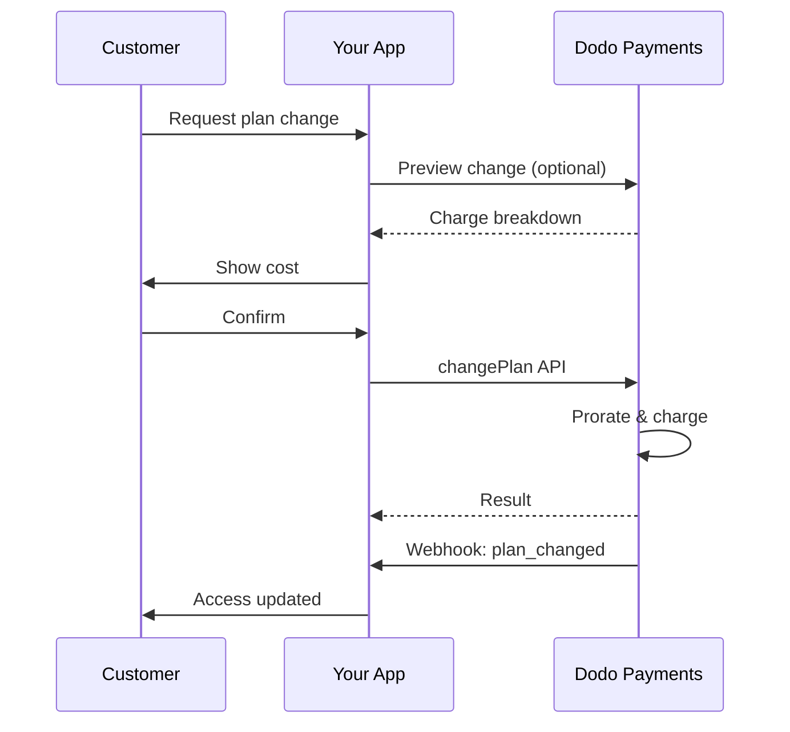
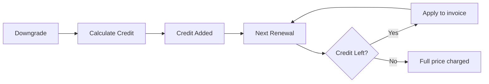
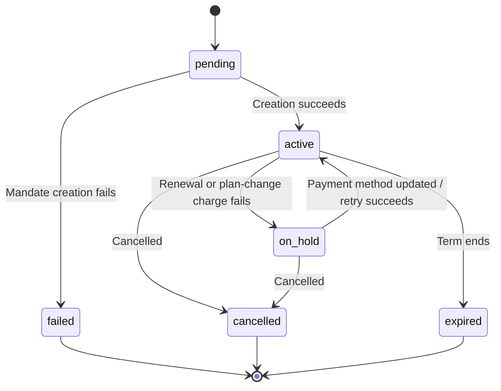

<Info>
구독을 사용하면 자동 갱신을 통해 지속적인 액세스를 판매할 수 있습니다. 유연한 청구 주기, 무료 체험, 플랜 변경 및 추가 기능을 사용해 고객별로 가격을 맞춤 설정하세요.
</Info>

<CardGroup cols={2}>
<Card title="Upgrade & Downgrade" icon="repeat" href="/developer-resources/subscription-upgrade-downgrade">
일할 계산 및 수량 업데이트로 플랜 변경을 관리하세요.
</Card>

<Card title="On‑Demand Subscriptions" icon="bolt" href="/developer-resources/ondemand-subscriptions">
지금 mandate를 승인하고 나중에 사용자 지정 금액을 청구하세요.
</Card>

<Card title="Customer Portal" icon="id-card" href="/features/customer-portal">
고객이 플랜, 청구 및 취소를 직접 관리할 수 있도록 하세요.
</Card>

<Card title="Subscription Webhooks" icon="code" href="/developer-resources/webhooks/intents/subscription">
생성, 갱신 및 취소와 같은 lifecycle 이벤트에 대응하세요.
</Card>
</CardGroup>

## 구독이란 무엇인가요?

구독은 고객이 일정에 따라 구매하는 반복 상품입니다. 다음과 같은 경우에 적합합니다.

- **SaaS 라이선스**: 앱, API 또는 플랫폼 액세스
- **멤버십**: 커뮤니티, 프로그램 또는 클럽
- **디지털 콘텐츠**: 강좌, 미디어 또는 프리미엄 콘텐츠
- **지원 플랜**: SLA, 성공 지원 패키지 또는 유지 관리

## 주요 이점

- **예측 가능한 수익**: 자동 갱신을 지원하는 반복 결제
- **유연한 주기**: 월간, 연간, 사용자 지정 간격 및 체험 기간
- **유연한 플랜 관리**: 업그레이드 및 다운그레이드에 대한 일할 계산
- **추가 기능 및 좌석**: 선택적이고 수량화 가능한 업그레이드 연결
- **원활한 checkout**: 호스팅 checkout 및 customer portal
- **개발자 중심**: 생성, 변경 및 사용량 추적을 위한 명확한 API

## 구독 생성

Dodo Payments 대시보드에서 구독 상품을 생성한 다음 checkout 또는 API를 통해 판매하세요. 상품과 활성 구독을 분리하면 가격을 버전별로 관리하고, 추가 기능을 연결하며, 성과를 독립적으로 추적할 수 있습니다.

### 구독 상품 생성

대시보드의 필드를 구성하여 구독 상품의 판매, 갱신 및 청구 방식을 정의하세요. 아래 섹션은 생성 양식에서 확인하는 항목과 직접 연결됩니다.

#### 상품 세부 정보

- **상품 이름** (필수): checkout, customer portal 및 인보이스에 표시되는 이름입니다.
- **상품 설명** (필수): checkout 및 인보이스에 표시되는 명확한 가치 설명입니다.
- **상품 이미지** (필수): 최대 3MB의 PNG/JPG/WebP입니다. checkout 및 인보이스에 사용됩니다.
- **브랜드**: 테마와 이메일에 사용할 특정 브랜드에 상품을 연결합니다.
- **세금 카테고리** (필수): 세금 규칙을 결정할 카테고리(예: SaaS)를 선택합니다.

<Tip>
지역별로 정확한 세금을 징수할 수 있도록 가장 적합한 세금 카테고리를 선택하세요.
</Tip>

#### 가격

- **가격 유형**: <b>Subscription</b>을 선택합니다(이 가이드). 대안으로 Single Payment 및 Usage Based Billing이 있습니다.
- **가격**(필수): 통화가 포함된 기본 recurring 가격입니다. 가격은 **$1**(또는 선택한 통화로 이에 상응하는 금액) 이상이어야 합니다. 이 최소 금액 미만은 지원되지 않으며 subscription이 작동하지 않습니다.
- **할인 적용 가능(%)**: 기본 가격에 적용되는 선택적 백분율 할인입니다. checkout 및 인보이스에 반영됩니다.
- **반복 결제 주기**(필수): 갱신 간격입니다(예: 1개월마다). 주기(개월 또는 년)와 수량을 선택합니다.
- **Subscription 기간**(필수): subscription이 활성 상태로 유지되는 전체 기간입니다(예: 10년). 이 기간이 끝나면 연장하지 않는 한 갱신이 중지됩니다.
- **Trial 기간(일)**(필수): trial 기간을 일 단위로 설정합니다. trial을 사용하지 않으려면 0을 입력합니다. trial이 종료되면 첫 번째 청구가 자동으로 발생합니다.
- **Trial 금액**: 유료 trial에 대한 선택적 선불 청구 금액입니다. 무료 trial의 경우 설정하지 않습니다. [Paid Trials](#paid-trials)를 참조하세요.
- **add-on 선택**: 고객이 기본 플랜과 함께 구매할 수 있는 add-on을 최대 10개까지 연결합니다.

<Warning>
활성 상품의 가격을 변경하면 신규 구매에 영향을 줍니다. 기존 구독에는 플랜 변경 및 일할 계산 설정이 적용됩니다.
</Warning>

<Info>
추가 기능은 좌석 또는 스토리지와 같은 수량화 가능한 추가 항목에 적합합니다. 고객이 추가 기능을 변경할 때 허용되는 수량과 일할 계산 동작을 제어할 수 있습니다.
</Info>

#### 고급 설정

- **세금 포함 가격**: 적용 가능한 세금이 포함된 가격을 표시합니다. 최종 세금 계산은 고객의 위치에 따라 달라집니다.
- **라이선스 키 생성**: 구매 후 각 고객에게 고유 키를 발급합니다. <a href="/features/license-keys">License Keys</a> 가이드를 참조하세요.
- **디지털 상품 제공**: 구매 후 파일 또는 콘텐츠를 자동으로 제공합니다. <a href="/features/digital-product-delivery">Digital Product Delivery</a>에서 자세히 알아보세요.
- **메타데이터**: 내부 태그 또는 클라이언트 통합을 위해 사용자 지정 키-값 쌍을 연결합니다. <a href="/api-reference/metadata">Metadata</a>를 참조하세요.

<Tip>
시스템의 식별자(예: accountId)를 메타데이터에 저장하면 나중에 이벤트와 인보이스를 대조할 수 있습니다.
</Tip>

## 구독 체험

Trial을 사용하면 고객이 전체 recurring 가격을 결제하기 전에 subscription을 평가할 수 있습니다. trial은 trial 종료 시까지 아무것도 청구하지 않는 **무료** 방식이거나, 선불로 할인된 금액을 청구하는 **유료** 방식일 수 있습니다. 두 경우 모두 trial 종료 후 첫 번째 갱신부터 전체 가격이 적용됩니다.

### 체험 구성

상품 가격 섹션에서 **Trial Period Days**를 설정합니다(체험을 사용하지 않으려면 `0`를 사용). 구독을 생성할 때 이 값을 재정의할 수 있습니다.

```typescript
// Via subscription creation
const subscription = await client.subscriptions.create({
  customer_id: 'cus_123',
  product_id: 'prod_monthly',
  trial_period_days: 14  // Overrides product's trial period
});

// Via checkout session
const session = await client.checkoutSessions.create({
  product_cart: [{ product_id: 'prod_monthly', quantity: 1 }],
  subscription_data: { trial_period_days: 14 }
});
```

<Warning>
`trial_period_days` 값은 0일에서 10,000일 사이여야 합니다.
</Warning>

### Paid Trials

Trial은 무료일 필요가 없습니다. subscription product의 recurring 가격에 **Trial 금액**을 설정하면 trial 기간에 대해 할인된 선불 요금을 청구할 수 있습니다. 이후 첫 번째 갱신부터 전체 recurring 가격이 적용됩니다.

<Frame>

</Frame>

Paid trial은 subscription 또는 checkout session별이 아니라 product의 가격에서 설정합니다:

| 필드 | 유형 | 설명 |
|-------|------|-------------|
| `trial_amount` | integer | trial에 대해 오늘 청구되는 금액으로, 가격 통화의 최소 단위입니다(예: $5.00의 경우 `500`). `trial_period_days > 0`가 필요합니다. 무료 trial의 경우 생략하거나 `null`로 설정합니다. |
| `trial_apply_discounts` | boolean | checkout 할인 코드가 trial 청구 금액을 줄이는지 여부입니다. 기본값은 `false`이므로 recurring 가격에 할인이 적용되더라도 trial 금액은 전액 청구됩니다. |

```typescript
const product = await client.products.create({
  name: 'Pro Plan',
  tax_category: 'saas',
  price: {
    type: 'recurring_price',
    price: 2900,                      // $29.00 per month after the trial
    currency: 'USD',
    payment_frequency_count: 1,
    payment_frequency_interval: 'Month',
    subscription_period_count: 1,
    subscription_period_interval: 'Year',
    trial_period_days: 14,            // A paid trial requires a positive trial period
    trial_amount: 500,                // $5.00 charged today
    trial_apply_discounts: false      // Discounts apply to the recurring price only
  }
});
```

Paid trial도 checkout을 통해 처리됩니다. trial 금액에는 세금이 부과되고, checkout session 계산 및 payment link 가격에 표시되며, Adaptive Currency markup이 통화별로 적용됩니다. [preview endpoint](/developer-resources/checkout-session)는 `trial_amount` 및 `trial_period_days`를 반환하므로 subscription이 생성되기 전에 오늘 결제할 금액을 표시할 수 있습니다.

<Info>
무료 trial은 변경되지 않습니다. **Trial 금액**을 설정하지 않으면 첫 번째 청구가 `0`이고 trial 종료 시 전체 가격이 청구되는 기존 동작이 유지됩니다.
</Info>

### Trial 오용 방지

**Trial 오용 방지**는 고객이 동일한 business에 대해 trial을 반복적으로 신청하지 못하도록 합니다. 이 기능을 사용하면 이미 trial을 사용한 고객은 새로운 trial을 받는 대신 자동으로 **유료, trial 없음 구매**로 전환됩니다.

<Frame>

</Frame>

**Settings**의 **Subscriptions** 탭에서 활성화합니다. 활성화하면 다음과 같이 동작합니다:

- 고객은 **정규화된 email**을 기준으로 매칭되며 plus-alias가 제거됩니다. 따라서 `user+trial@example.com`와 `user@example.com`는 동일한 사용자로 처리됩니다.
- 사용 기록은 **trial 활성화** 시점에 저장되므로, 같은 날 취소한 고객도 trial을 사용한 것으로 처리됩니다.
- 기존 고객은 email을 기준으로 과거 trial 기록이 backfill되므로 이전 trial 사용자도 즉시 인식됩니다.

<Info>
이 설정은 **기본적으로 꺼져 있습니다**. business 수준의 subscription 제어 항목 전체 목록은 [Subscription Settings](/features/product-collections#subscription-settings)를 참조하세요.
</Info>

### Trial 상태 감지

<Warning>
현재 trial 상태를 감지할 수 있는 직접적인 field는 없습니다. 다음은 payments를 조회해야 하는 우회 방법이며 비효율적입니다. 더 효율적인 해결 방법을 개발하고 있습니다.
</Warning>

**무료 trial** subscription이 trial 중인지 확인하려면 해당 subscription의 payments 목록을 가져옵니다. 금액이 0인 payment가 정확히 하나 있으면 subscription은 trial 기간 중입니다:

```typescript
const subscription = await client.subscriptions.retrieve('sub_123');
const payments = await client.payments.list({
  subscription_id: subscription.subscription_id
});

// Check if subscription is in trial
const isInTrial = payments.items.length === 1 && 
                  payments.items[0].total_amount === 0;
```

<Warning>
이 0원 확인 방식은 무료 trial에만 적용됩니다. [paid trial](#paid-trials)의 경우 첫 번째 payment는 `0`가 아니라 trial 금액과 같습니다. 대신 첫 번째 payment를 subscription의 `trial_amount`와 비교하거나 `next_billing_date`가 아직 trial 기간 내에 있는지 확인하세요.
</Warning>

### Trial 기간 업데이트

`next_billing_date`를 업데이트하여 trial을 연장합니다:

```typescript
await client.subscriptions.update('sub_123', {
  next_billing_date: '2025-02-15T00:00:00Z'  // New trial end date
});
```

<Warning>
`next_billing_date`를 과거 시점으로 설정할 수 없습니다. 날짜는 미래여야 합니다.
</Warning>

## Subscription 플랜 변경

플랜 변경을 통해 subscription을 upgrade 또는 downgrade하고, 수량을 조정하거나, 다른 product로 이전할 수 있습니다. 선택한 proration mode에 따라 변경 시 즉시 청구가 발생하거나 credit이 생성되거나, 청구 조정이 적용되지 않을 수 있습니다.

<Tip>
Dodo Payments dashboard에서 직접 subscription 플랜을 변경하고 다음 billing 날짜를 업데이트할 수 있습니다. API 호출 없이 고객 지원 요청, 프로모션 upgrade 또는 플랜 이전에 맞춰 subscription을 빠르게 조정할 수 있습니다.
</Tip>

<Tip>
**셀프서비스 플랜 변경 활성화:** 고객이 Customer Portal을 통해 직접 subscription을 upgrade 또는 downgrade하도록 하시겠습니까? subscription product를 Product Collection에 추가하고 Subscription Settings에서 "Allow Subscription Updates"를 활성화하세요.
</Tip>



<Card title="Product Collections" icon="layer-group" href="/features/product-collections">
  관련 product를 collection으로 그룹화하여 Customer Portal에서 원활한 upgrade/downgrade 경로를 활성화합니다.
</Card>

### Proration Mode

플랜을 변경할 때 고객에게 청구하는 방식을 선택합니다:

<Info>
**네 가지 proration mode 빠른 비교:**

| | `prorated_immediately` | `difference_immediately` | `full_immediately` | `do_not_bill` |
|---|---|---|---|---|
| **Upgrade** | 남은 일수에 대한 비례 청구 | 전체 가격 차액 청구 | 새로운 플랜의 전체 가격 청구 | 청구 없음 — 즉시 전환 |
| **Downgrade** | 남은 일수에 대한 비례 credit | 전체 가격 차액을 credit으로 적용 | credit 없음, 전체 금액 청구 | credit 없음 — 즉시 전환 |
| **Billing cycle** | 오늘로 재설정 | 오늘로 재설정 | 오늘로 재설정 | 동일하게 유지 |
| **적합한 용도** | 사용 시간에 따른 공정한 청구 | 간단한 tier 변경 | Billing cycle 재설정 | 무료 이전 또는 배려 차원의 전환 |
</Info>

#### `prorated_immediately`
현재 billing cycle의 남은 기간을 기준으로 비례 금액을 청구합니다. 사용하지 않은 기간을 반영하는 공정한 청구에 적합합니다.

```typescript
await client.subscriptions.changePlan('sub_123', {
  product_id: 'prod_pro',
  quantity: 1,
  proration_billing_mode: 'prorated_immediately'
});
```

#### `difference_immediately`
가격 차액을 즉시 청구하거나(upgrade), 향후 갱신을 위한 credit을 추가합니다(downgrade). 간단한 upgrade/downgrade 시나리오에 적합합니다.

```typescript
// Upgrade: charges $50 (difference between $30 and $80)
// Downgrade: credits remaining value, auto-applied to renewals
await client.subscriptions.changePlan('sub_123', {
  product_id: 'prod_pro',
  quantity: 1,
  proration_billing_mode: 'difference_immediately'
});
```

<Info>
`difference_immediately`를 사용한 downgrade의 credit은 subscription 범위에 적용되며 향후 갱신에 자동으로 사용됩니다. 이는 <a href="/features/credit-based-billing">Credit-Based Billing</a> entitlement와는 별개입니다.
</Info>

고객이 `difference_immediately`로 downgrade하면 사용하지 않은 금액이 subscription 범위의 credit이 되어 향후 갱신 금액을 자동으로 상쇄합니다:



#### `full_immediately`
남은 기간을 무시하고 새로운 플랜의 전체 금액을 즉시 청구합니다. Billing cycle을 재설정할 때 적합합니다.

```typescript
await client.subscriptions.changePlan('sub_123', {
  product_id: 'prod_monthly',
  quantity: 1,
  proration_billing_mode: 'full_immediately'
});
```

#### `do_not_bill`
청구 조정 없이 새로운 플랜으로 전환합니다. proration 청구도 credit도 없으며 고객은 단순히 새로운 플랜으로 이동합니다. 배려 차원의 이전, 무료 플랜 전환 또는 가격 차액을 부담하려는 경우에 적합합니다.

```typescript
await client.subscriptions.changePlan('sub_123', {
  product_id: 'prod_new_plan',
  quantity: 1,
  proration_billing_mode: 'do_not_bill'
});
```

<AccordionGroup>
<Accordion title="Example: Prorated upgrade calculation">

**시나리오**: Basic($30/월) 고객이 30일 주기의 16일째에 `prorated_immediately`를 사용하여 Pro($80/월)로 upgrade합니다.

```
Unused credit from Basic = $30 × (15 remaining / 30 total) = $15.00
Prorated cost of Pro     = $80 × (15 remaining / 30 total) = $40.00
────────────────────────────────────────────────────────────────────
Immediate charge         = $40.00 − $15.00 = $25.00
```

다음 갱신일은 **2월 15일**(1월 16일 + 30일)이며 가격은 **$80.00/월**입니다.

<Tip>
더 자세한 계산 예시와 예외 사례는 전체 [Upgrade & Downgrade Guide](/developer-resources/subscription-upgrade-downgrade)를 참조하세요.
</Tip>

</Accordion>
<Accordion title="Example: Downgrade credit calculation">

**시나리오**: Pro($80/월) 고객이 `difference_immediately`를 사용하여 Starter($20/월)로 downgrade합니다.

```
Credit = Old plan − New plan = $80 − $20 = $60.00
```

$60 credit은 향후 갱신에 자동으로 적용됩니다:
- 갱신 1: $20 − $20(credit) = **$0.00**(남은 credit $40)
- 갱신 2: $20 − $20(credit) = **$0.00**(남은 credit $20)  
- 갱신 3: $20 − $20(credit) = **$0.00**(credit 소진)
- 갱신 4: **$20.00**(전체 가격)

<Info>
credit 관리 방법에 대한 자세한 내용은 [Upgrade & Downgrade Guide](/developer-resources/subscription-upgrade-downgrade)를 참조하세요.
</Info>

</Accordion>
</AccordionGroup>

### Add-on을 사용한 플랜 변경

플랜을 변경할 때 add-on을 수정할 수 있습니다. add-on은 proration 계산에 포함됩니다:

```typescript
await client.subscriptions.changePlan('sub_123', {
  product_id: 'prod_pro',
  quantity: 1,
  proration_billing_mode: 'difference_immediately',
  addons: [{ addon_id: 'addon_extra_seats', quantity: 2 }]  // Add add-ons
  // addons: []  // Empty array removes all existing add-ons
});
```

<Info>
플랜 변경은 즉시 청구를 발생시킵니다. 청구에 실패하면 subscription이 `on_hold` status로 전환될 수 있습니다. `subscription.plan_changed` webhook event를 통해 변경 사항을 추적하세요.
</Info>

### 플랜 변경 미리보기

플랜 변경을 확정하기 전에 정확한 청구 금액과 변경 결과 subscription을 미리 확인합니다:

```typescript
const preview = await client.subscriptions.previewChangePlan('sub_123', {
  product_id: 'prod_pro',
  quantity: 1,
  proration_billing_mode: 'prorated_immediately'
});

// Show customer the charge before confirming
console.log('You will be charged:', preview.immediate_charge.summary);
```

<Card title="Preview Change Plan API" icon="eye" href="/api-reference/subscriptions/preview-change-plan">
  플랜 변경을 확정하기 전에 미리 확인하세요.
</Card>

## Subscription 상태

subscription은 수명 주기 동안 정의된 여러 status를 거칩니다. 다음 표는 각 status의 의미와 원인, 복구 가능 여부 및 복구 방법을 확인하기 위한 기준입니다.

| Status | 의미 | 복구 가능? | 복구 방법 / 다음 단계 |
|--------|---------------|--------------|---------------------------|
| `pending` | subscription을 생성하거나 처리하는 중 | — | `subscription.active`(또는 `subscription.failed`)를 기다립니다 |
| `active` | subscription이 활성 상태이며 자동으로 갱신됩니다 | — | 조치가 필요하지 않습니다 |
| `on_hold` | 갱신 payment(또는 플랜 변경 청구)에 실패하여 subscription이 일시 중지됨 | **예** | [Payment Retries](/features/recovery/payment-retries) 및 [Dunning](/features/recovery/subscription-dunning)을 통해 자동으로, 또는 [Update Payment Method API](/api-reference/subscriptions/update-payment-method)를 통해 수동으로 payment method를 업데이트하여 재활성화합니다 |
| `cancelled` | subscription이 취소되어 갱신되지 않음 | 재구매만 가능 | 고객이 새 subscription을 시작해야 합니다. [Dunning](/features/recovery/subscription-dunning)으로 재구매를 유도할 수 있습니다 |
| `failed` | subscription **생성** 실패(초기 mandate 또는 payment가 성공하지 않음) | **아니요 — terminal** | 고객이 정상적인 payment method로 새 subscription을 생성해야 합니다 |
| `expired` | subscription이 기간 종료에 도달함 | — | 원하는 경우 고객이 새 subscription을 시작해야 합니다 |

<Warning>
`on_hold`와 `failed`는 자주 혼동됩니다. `on_hold`는 이미 활성화된 subscription의 갱신에 실패했을 때 발생하는 **복구 가능한** 상태입니다. `failed`는 **초기** subscription 생성에 실패했을 때만 발생하는 **terminal** 상태이며 재활성화할 수 없습니다.
</Warning>

### 상태 머신



### On Hold 상태

다음과 같은 경우 subscription이 `on_hold` 상태가 됩니다:

- 갱신 payment 실패(잔액 부족, 카드 만료 등)
- 플랜 변경 청구 실패
- Payment method authorization 실패

<Warning>
subscription이 `on_hold` 상태이면 자동으로 갱신되지 않습니다. subscription을 재활성화하려면 payment method를 업데이트해야 합니다.
</Warning>

### On Hold 상태에서 재활성화

subscription을 `on_hold` 상태에서 재활성화하려면 payment method를 업데이트합니다. 그러면 다음 작업이 자동으로 수행됩니다:

1. 미납 잔액에 대한 청구 생성
2. 인보이스 생성
3. 새 payment method를 사용하여 payment 처리
4. payment 성공 시 subscription을 `active` 상태로 재활성화

```typescript
// Reactivate subscription from on_hold
const response = await client.subscriptions.updatePaymentMethod('sub_123', {
  payment_method: {
    type: 'new',
    return_url: 'https://example.com/return'
  }
});

// For on_hold subscriptions, a charge is automatically created
if (response.payment_id) {
  console.log('Charge created:', response.payment_id);
  // Redirect customer to response.payment_link to complete payment
  // Monitor webhooks for payment.succeeded and subscription.active
}
```

<Info>
`on_hold` subscription의 payment method를 성공적으로 업데이트하면 `payment.succeeded` webhook event가 발생한 뒤 `subscription.active` webhook event가 발생합니다.
</Info>

### 전환별 Webhook Event

각 전환은 webhook을 발생시키므로 polling 없이 entitlement 로직을 구동할 수 있습니다:

| 전환 | Event |
|------------|-------|
| Subscription 활성화 | `subscription.active` |
| 갱신 성공 | `subscription.renewed` |
| 갱신 실패 → 일시 중지 | `subscription.on_hold` |
| 생성 실패 | `subscription.failed` |
| 플랜 upgrade/downgrade | `subscription.plan_changed` |
| 취소됨 | `subscription.cancelled` |
| 기간 종료 | `subscription.expired` |
| 모든 field 변경 | `subscription.updated` |

<Card title="Subscription Webhook Payloads" icon="webhook" href="/developer-resources/webhooks/intents/subscription">
subscription lifecycle event의 전체 payload schema를 확인하세요.
</Card>

## API 관리

<AccordionGroup>
<Accordion title="Create subscriptions">
`POST /subscriptions`를 사용하여 product에서 subscription을 programmatically 생성할 수 있습니다. 선택적으로 trial 및 add-on을 포함할 수 있습니다.

<Card title="API Reference" icon="code" href="/api-reference/subscriptions/post-subscriptions">
subscription 생성 API를 확인하세요.
</Card>
</Accordion>

<Accordion title="Update subscriptions">
`PATCH /subscriptions/{id}`를 사용하여 수량을 업데이트하고, 다음 billing 날짜에 취소하거나, metadata를 수정합니다.

<Card title="API Reference" icon="code" href="/api-reference/subscriptions/patch-subscriptions">
subscription 세부 정보 업데이트 방법을 알아보세요.
</Card>
</Accordion>

<Accordion title="Change plans (proration)">
proration 제어를 사용하여 활성 product 및 수량을 변경합니다.

<Card title="API Reference" icon="code" href="/api-reference/subscriptions/change-plan">
플랜 변경 옵션을 검토하세요.
</Card>
</Accordion>

<Accordion title="On‑demand charges">
on-demand subscription의 경우 필요할 때 특정 금액을 청구합니다.

<Card title="API Reference" icon="code" href="/api-reference/subscriptions/create-charge">
on-demand subscription을 청구합니다.
</Card>
</Accordion>

<Accordion title="List and retrieve">
`GET /subscriptions`를 사용하여 모든 subscription을 나열하고 `GET /subscriptions/{id}`를 사용하여 하나를 조회합니다.

<Card title="API Reference" icon="code" href="/api-reference/subscriptions/get-subscriptions">
목록 조회 및 검색 API를 확인하세요.
</Card>
</Accordion>

<Accordion title="Usage history">
metered 또는 hybrid 가격 모델에 대해 기록된 usage를 가져옵니다.

<Card title="API Reference" icon="code" href="/api-reference/subscriptions/get-usage-history">
usage history API를 확인하세요.
</Card>
</Accordion>

<Accordion title="Update payment method">
subscription의 payment method를 업데이트합니다. 활성 subscription의 경우 향후 갱신에 사용할 payment method가 업데이트됩니다. `on_hold` 상태의 subscription의 경우 미납 잔액에 대한 청구를 생성하여 subscription을 재활성화합니다.

새 payment-method link를 생성할 때(`New` request type), `allowed_payment_method_types`를 전달하여 해당 페이지에 고객에게 표시할 payment method를 제한할 수 있습니다. 목록에 없는 method는 고객에게 표시되지 않지만, method를 포함한다고 해서 반드시 표시되는 것은 아닙니다(사용 가능 여부는 고객 위치 및 business 설정과 같은 요소에 따라 달라집니다).

<Card title="API Reference" icon="code" href="/api-reference/subscriptions/update-payment-method">
payment method 업데이트 및 subscription 재활성화 방법을 알아보세요.
</Card>
</Accordion>
</AccordionGroup>

## 일반적인 사용 사례

- **SaaS 및 API**: seat 또는 usage에 대한 add-on을 포함한 tier별 access
- **Content 및 media**: introductory trial을 포함한 월간 access
- **B2B support plan**: premium support add-on을 포함한 연간 계약
- **Tool 및 plugin**: license key 및 version별 release

## Integration 예시

### Checkout Session(subscription)
checkout session을 생성할 때 subscription product와 선택적 add-on을 포함합니다:

```typescript
const session = await client.checkoutSessions.create({
  product_cart: [
    {
      product_id: 'prod_subscription',
      quantity: 1
    }
  ]
});
```

### Proration을 사용한 플랜 변경
subscription을 upgrade 또는 downgrade하고 proration 동작을 제어합니다:

```typescript
await client.subscriptions.changePlan('sub_123', {
  product_id: 'prod_new',
  quantity: 1,
  proration_billing_mode: 'difference_immediately'
});
```

### 다음 billing 날짜에 취소
현재 billing 기간이 끝날 때 적용되는 취소를 예약합니다:

```typescript
await client.subscriptions.update('sub_123', {
  cancel_at_next_billing_date: true
});
```

### Subscription 기간 연장
새 `subscription_period_count` 및 `subscription_period_interval`를 `PATCH /subscriptions/{id}`에 전달하여 subscription 실행 기간을 연장합니다. subscription의 만료일은 새 count와 interval을 기준으로 다시 계산됩니다. 예를 들어 고객의 현재 플랜에 추가 기간을 제공할 수 있습니다:

```typescript
await client.subscriptions.update('sub_123', {
  subscription_period_count: 5,
  subscription_period_interval: 'Month'
});
```

<Note>
subscription 기간은 **연장만** 가능하며 단축할 수 없습니다.
</Note>

### On-demand subscription
on-demand subscription을 생성하고 필요할 때 나중에 청구합니다:

```typescript
const onDemand = await client.subscriptions.create({
  customer_id: 'cus_123',
  product_id: 'prod_on_demand',
  on_demand: { mandate_only: true }
});

await client.subscriptions.charge(onDemand.subscription_id, {
  product_price: 4900,
  product_currency: 'USD',
  product_description: 'Extra usage for September'
});
```

### 활성 Subscription의 payment method 업데이트
활성 subscription의 payment method를 업데이트합니다:

```typescript
// Update with new payment method
const response = await client.subscriptions.updatePaymentMethod('sub_123', {
  payment_method: {
    type: 'new',
    return_url: 'https://example.com/return'
  }
});

// Or use existing payment method
await client.subscriptions.updatePaymentMethod('sub_123', {
  payment_method: {
    type: 'existing',
    payment_method_id: 'pm_abc123'
  }
});
```

### on_hold 상태의 Subscription 재활성화
payment 실패로 on hold 상태가 된 subscription을 재활성화합니다:

```typescript
// Update payment method - automatically creates charge for remaining dues
const response = await client.subscriptions.updatePaymentMethod('sub_123', {
  payment_method: {
    type: 'new',
    return_url: 'https://example.com/return'
  }
});

if (response.payment_id) {
  // Charge created for remaining dues
  // Redirect customer to response.payment_link
  // Monitor webhooks: payment.succeeded → subscription.active
}
```

## RBI 규정을 준수하는 Mandate를 사용하는 Subscription

  UPI 및 인도 card subscription은 특정 mandate 요구 사항이 적용되는 RBI(Reserve Bank of India) 규정에 따라 운영됩니다:

  ### Mandate 한도

  mandate 유형과 금액은 subscription의 recurring 청구 금액에 따라 달라집니다:

  - **mandate 하한 미만의 청구(기본값 ₹15,000):** 하한 금액으로 on-demand mandate를 생성합니다. subscription 금액은 subscription frequency에 따라 mandate 한도까지 주기적으로 청구됩니다.
  - **mandate 하한 이상인 청구:** 정확한 subscription 금액으로 subscription mandate(또는 on-demand mandate)를 생성합니다.

  mandate 하한은 `mandate_min_amount_inr_paise`(INR paise)를 통해 merchant별 또는 request별로 구성할 수 있습니다. 은행에 등록되는 금액은 `max(mandate_floor, billing_amount)`이므로 청구 금액이 더 낮을 때 하한이 고객에게 표시되는 authorization 상한이 됩니다.

RBI 규정을 준수하는 mandate 및 인도 payment method의 구성 가능한 mandate 하한에 대한 자세한 내용은 <a href="/features/payment-methods/india#configurable-mandate-floor">India Payment Methods</a> 페이지를 참조하세요.

  ### Upgrade 및 Downgrade 고려 사항

  **중요:** subscription을 upgrade 또는 downgrade할 때 mandate 한도를 신중하게 고려하세요:

  - upgrade/downgrade로 인해 청구 금액이 Rs 15,000을 초과하고 기존 on-demand payment 한도를 넘으면 transaction 청구가 실패할 수 있습니다.
  - 이 경우 고객이 payment method를 업데이트하거나 subscription을 다시 변경하여 올바른 한도로 새 mandate를 설정해야 할 수 있습니다.

  ### 고액 청구에 대한 Authorization

  Rs 15,000 이상인 subscription 청구의 경우:

  - 고객의 은행에서 transaction을 authorize하라는 메시지가 표시됩니다.
  - 고객이 transaction을 authorize하지 못하면 transaction이 실패하고 subscription이 on hold 상태가 됩니다.

  ### 48시간 처리 지연

  **처리 일정:** 인도 card 및 UPI subscription의 recurring 청구는 고유한 처리 패턴을 따릅니다:

  - 청구는 subscription frequency에 따라 예정된 날짜에 **시작**됩니다.
  - 고객 account에서 실제 **차감**은 payment 시작 후 **48시간**이 지나야 발생합니다.
  - 은행 API 응답에 따라 이 48시간의 대기 시간이 **추가 2~3시간**까지 연장될 수 있습니다.

  ### Mandate 취소 기간

  48시간 처리 기간 동안:

  - 고객은 banking app을 통해 mandate를 취소할 수 있습니다.
  - 고객이 이 기간에 mandate를 취소해도 subscription은 **active** 상태로 유지됩니다(인도 card 및 UPI AutoPay subscription에만 해당하는 예외 사례입니다).
  - 그러나 실제 차감은 실패할 수 있으며, 이 경우 subscription을 **on hold** 상태로 전환합니다.

  **예외 사례 처리:** 청구 시작 시점에 고객에게 benefit, credit 또는 subscription usage를 즉시 제공하는 경우 애플리케이션에서 이 48시간 기간을 적절히 처리해야 합니다. 다음을 고려하세요:

  - payment confirmation까지 benefit 활성화 지연
  - grace period 또는 임시 access 구현
  - mandate 취소에 대한 subscription status 모니터링
  - 애플리케이션 로직에서 subscription hold 상태 처리

  <Tip>
  subscription webhook을 모니터링하여 payment status 변경을 추적하고 48시간 기간에 mandate가 취소되는 예외 사례를 처리하세요.
  </Tip>

## 모범 사례

- **명확한 tier로 시작**: 차이가 분명한 2~3개의 플랜
- **가격을 명확히 전달**: 총액, proration 및 다음 갱신을 표시
- **신중하게 trial 사용**: 단순히 기간을 제공하는 것이 아니라 onboarding을 통해 전환
- **add-on 활용**: 기본 플랜은 간단하게 유지하고 추가 기능을 upsell
- **변경 사항 테스트**: test mode에서 플랜 변경 및 proration 검증

<Info>
Subscription은 recurring revenue를 위한 유연한 기반입니다. 간단하게 시작하고 철저히 테스트한 뒤 adoption, churn 및 expansion 지표를 바탕으로 반복 개선하세요.
</Info>