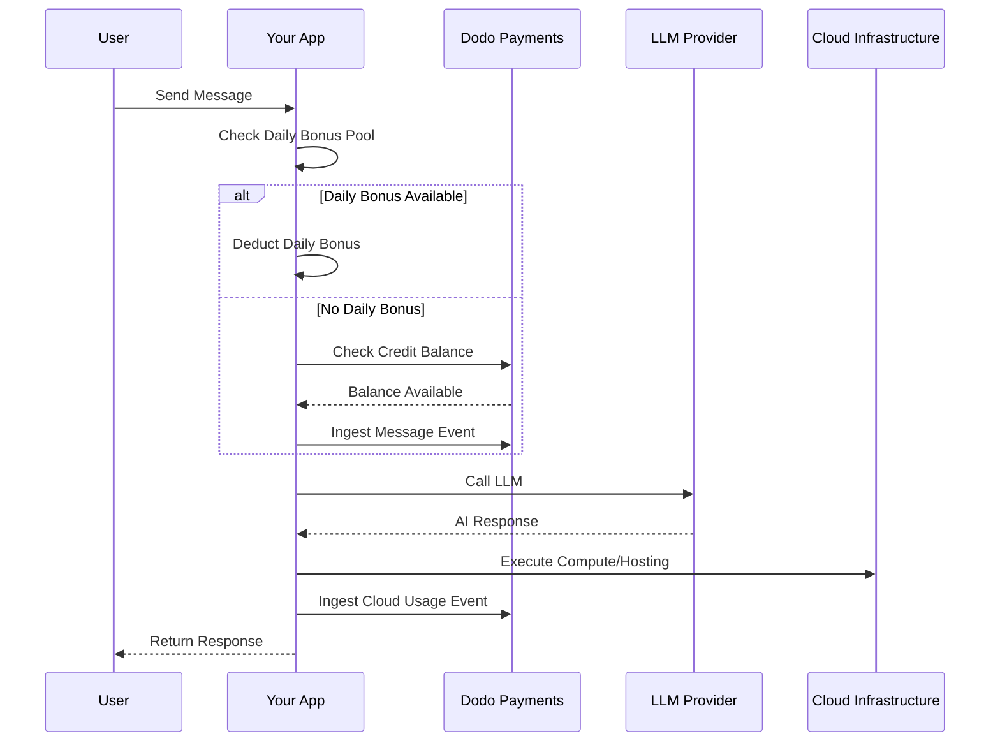

Lovable (lovable.dev) é um construtor de aplicativos web de IA que usa um modelo de assinatura baseado em créditos. Ao contrário dos sistemas baseados em tokens, Lovable simplifica a experiência do usuário cobrando um crédito por mensagem. Este modelo combina um pool mensal de créditos com um bônus diário para incentivar o engajamento consistente, permitindo uso intensivo.

## Modelo de Cobrança da Lovable

A precificação do Lovable é baseada em créditos de mensagens e cobranças medidas separadamente para infraestrutura em nuvem.

| Plano | Preço | Créditos Mensais | Bônus Diário | Principais Recursos |
| :--- | :--- | :--- | :--- | :--- |
| Gratuito | \$0/mês | 0 | 5/dia (até 30/mês) | Apenas projetos públicos |
| Pro | \$25/mês | 100 | 5/dia (até 150/mês no total) | Recargas sob demanda, Cloud + IA baseado em uso, domínios personalizados |
| Empresarial | \$50/mês | 100 | 5/dia | SSO, espaço de trabalho em equipe, modelos de design, centro de segurança |
| Enterprise | Personalizado | Personalizado | Personalizado | SCIM, suporte dedicado, registros de auditoria |

- **Assinatura baseada em crédito**: 1 crédito = 1 mensagem/prompt para a IA.
- **Créditos são compartilhados entre usuários ilimitados**: Pool em equipe, não por assento.
- **Créditos são reiniciados a cada ciclo de cobrança**: Créditos mensais são renovados na renovação.
- **Recargas de crédito sob demanda**: Usuários podem comprar mais créditos se acabarem.
- **Cobrança separada baseada em uso para Cloud + IA**: Cobrança medida para hospedagem e computação.
- **Bônus diário de créditos é resetado a cada dia**: Gota diária de 5 créditos, usar ou perder.

## O Que o Torna Único

- **Simplicidade baseada em mensagens**: 1 crédito = 1 mensagem, independentemente da complexidade. Sem contagem de tokens ou ponderação de modelo.
- **Híbrido de bônus diário + pool mensal**: Os 5 créditos de bônus diários criam um incentivo de engajamento diário, enquanto os 100 créditos mensais permitem uso intenso.
- **Pool compartilhado em equipe**: Créditos compartilhados entre usuários ilimitados por um preço fixo em equipe, não por assento.
- **Cobrança em duas camadas**: Créditos para interações de IA + cobrança medida separadamente para infraestrutura em nuvem.

## Construa Isso com Dodo Payments

Você pode replicar o modelo híbrido do Lovable usando direitos de crédito e medidores baseados em uso do Dodo Payments.

<Steps>
  <Step title="Create a Custom Unit Credit Entitlement">
    Defina o sistema de crédito de mensagens no seu painel do Dodo Payments. Este direito lida com o pool mensal de créditos.

    - **Tipo de Crédito**: Unidade Personalizada
    - **Nome da Unidade**: "Mensagens"
    - **Precisão**: 0
    - **Expiração do Crédito**: 30 dias
    - **Excedente**: Desabilitado (limite rígido quando os créditos chegam a 0)
  </Step>

  <Step title="Create Subscription Products">
    Crie seus planos e anexe o direito de crédito. Para o plano Gratuito, você lidará com o bônus diário através da lógica do aplicativo.

    - **Gratuito**: \$0/mês, 0 créditos (bônus diário gerido pela lógica do aplicativo)
    - **Pro**: \$25/mês, 100 créditos/ciclo, anexar direito de crédito
    - **Empresarial**: \$50/mês, 100 créditos/ciclo, anexar direito de crédito

    ```typescript
    import DodoPayments from 'dodopayments';

    const client = new DodoPayments({
      bearerToken: process.env.DODO_PAYMENTS_API_KEY,
    });

    const session = await client.checkoutSessions.create({
      product_cart: [
        { product_id: 'pdt_lovable_pro', quantity: 1 }
      ],
      customer: { email: 'user@example.com' },
      return_url: 'https://lovable.dev/dashboard'
    });
    ```

  </Step>

  <Step title="Create a Usage Meter for Cloud + AI">
    Lovable cobra separadamente pela infraestrutura em nuvem. Crie um medidor para acompanhar esses custos.

    - **Nome do Medidor**: `cloud.compute_seconds`
    - **Agregação**: Soma na propriedade `compute_seconds`

    Anexe este medidor aos seus produtos de assinatura com preço por unidade. Quando você ingerir o uso, a Dodo calcula o custo com base em suas tarifas.

    ```typescript
    await client.usageEvents.ingest({
      events: [{
        event_id: `compute_${Date.now()}`,
        customer_id: 'cust_123',
        event_name: 'cloud.compute_seconds',
        timestamp: new Date().toISOString(),
        metadata: {
          compute_seconds: 3600,
          project_id: 'proj_abc'
        }
      }]
    });
    ```

  </Step>

  <Step title="Implement Daily Bonus Credits (Application Logic)">
    O bônus diário é gerido no nível do aplicativo. Você pode usar um cron job para conceder esses créditos ou acompanhá-los separadamente no seu banco de dados.

    Para acompanhar o uso desses créditos de bônus na Dodo sem esgotar o saldo principal do direito imediatamente, você pode usar um nome de evento separado ou lidar com a lógica no seu aplicativo para verificar o pool de bônus primeiro.

    ```typescript
    // Example cron job logic (pseudo-code)
    // Every day at midnight UTC:
    // 1. Reset 'daily_bonus_used' to 0 for all users in your DB
    
    // When a user sends a message:
    async function handleMessage(userId: string) {
      const user = await db.users.findUnique({ where: { id: userId } });
      
      if (user.daily_bonus_used < 5) {
        // Use daily bonus
        await db.users.update({
          where: { id: userId },
          data: { daily_bonus_used: { increment: 1 } }
        });
        // Track for analytics but don't deduct from Dodo credits yet
        await client.usageEvents.ingest({
          events: [{
            event_id: `msg_bonus_${Date.now()}`,
            customer_id: userId,
            event_name: 'ai.message.bonus',
            timestamp: new Date().toISOString(),
            metadata: { type: 'daily_bonus' }
          }]
        });
      } else {
        // Deduct from Dodo credit entitlement
        await client.usageEvents.ingest({
          events: [{
            event_id: `msg_${Date.now()}`,
            customer_id: userId,
            event_name: 'ai.message',
            timestamp: new Date().toISOString(),
            metadata: { type: 'subscription_credit' }
          }]
        });
      }
    }
    ```

  </Step>

  <Step title="Send Usage Events for Messages">
    Acompanhe cada mensagem de IA como um evento de uso. Vincule o evento `ai.message` ao seu direito de crédito "Mensagens" no painel do Dodo.

    ```typescript
    await client.usageEvents.ingest({
      events: [{
        event_id: `msg_${Date.now()}`,
        customer_id: 'cust_123',
        event_name: 'ai.message',
        timestamp: new Date().toISOString(),
        metadata: {
          content_length: 450,
          project_id: 'proj_abc',
          feature_type: 'editor'
        }
      }]
    });
    ```

  </Step>

  <Step title="Handle Webhooks for Low Balance">
    Notifique os usuários quando eles estiverem com poucos créditos para que possam recarregar ou atualizar.

    ```typescript
    import DodoPayments from 'dodopayments';
    import express from 'express';

    const app = express();
    app.use(express.raw({ type: 'application/json' }));

    const client = new DodoPayments({
      bearerToken: process.env.DODO_PAYMENTS_API_KEY,
      webhookKey: process.env.DODO_PAYMENTS_WEBHOOK_KEY,
    });

    app.post('/webhooks/dodo', async (req, res) => {
      try {
        const event = client.webhooks.unwrap(req.body.toString(), {
          headers: {
            'webhook-id': req.headers['webhook-id'] as string,
            'webhook-signature': req.headers['webhook-signature'] as string,
            'webhook-timestamp': req.headers['webhook-timestamp'] as string,
          },
        });

        if (event.type === 'credit.balance_low') {
          const { customer_id, available_balance } = event.data;
          await notifyUser(customer_id, `Your balance is low: ${available_balance} messages left.`);
        }

        res.json({ received: true });
      } catch (error) {
        res.status(401).json({ error: 'Invalid signature' });
      }
    });
    ```

  </Step>
</Steps>

## Acelere com o Blueprint de Ingestão LLM

O [Blueprint de Ingestão LLM](/developer-resources/ingestion-blueprints/llm) simplifica o rastreamento ao envolver seu cliente de IA.

```typescript
import { createLLMTracker } from '@dodopayments/ingestion-blueprints';
import OpenAI from 'openai';

const tracker = createLLMTracker({
  apiKey: process.env.DODO_PAYMENTS_API_KEY,
  environment: 'live_mode',
  eventName: 'ai.message',
});

const trackedClient = tracker.wrap({
  client: new OpenAI(),
  customerId: 'cust_123',
});

// Automatically tracks the message and deducts 1 credit (if configured)
await trackedClient.chat.completions.create({
  model: 'gpt-4o',
  messages: [{ role: 'user', content: 'Build a landing page' }],
});
```

<Tip>
  Confira a [documentação completa do blueprint](/developer-resources/ingestion-blueprints/llm) para mais detalhes sobre o rastreamento automático.
</Tip>

## Visão Geral da Arquitetura



## Principais Recursos do Dodo Utilizados

Explore os recursos que tornam esta implementação possível.

<CardGroup cols={2}>
  <Card title="Credit-Based Billing" icon="coins" href="/features/credit-based-billing">
    Gerencie créditos de mensagens e pools de equipe compartilhados.
  </Card>
  <Card title="Subscriptions" icon="calendar" href="/features/subscription">
    Configure planos recorrentes para os níveis Pro e Empresarial.
  </Card>
  <Card title="Usage-Based Billing" icon="chart-line" href="/features/usage-based-billing/introduction">
    Meça o uso da infraestrutura em nuvem separadamente dos créditos de IA.
  </Card>
  <Card title="Event Ingestion" icon="bolt" href="/features/usage-based-billing/event-ingestion">
    Envie eventos de mensagens e computação em alto volume para Dodo.
  </Card>
  <Card title="Webhooks" icon="webhook" href="/developer-resources/webhooks/intents/credit">
    Automatize notificações para saldos baixos de créditos.
  </Card>
  <Card title="LLM Ingestion Blueprint" icon="brain-circuit" href="/developer-resources/ingestion-blueprints/llm">
    Simplifique o rastreamento de uso da IA com integrações pré-construídas.
  </Card>
</CardGroup>
