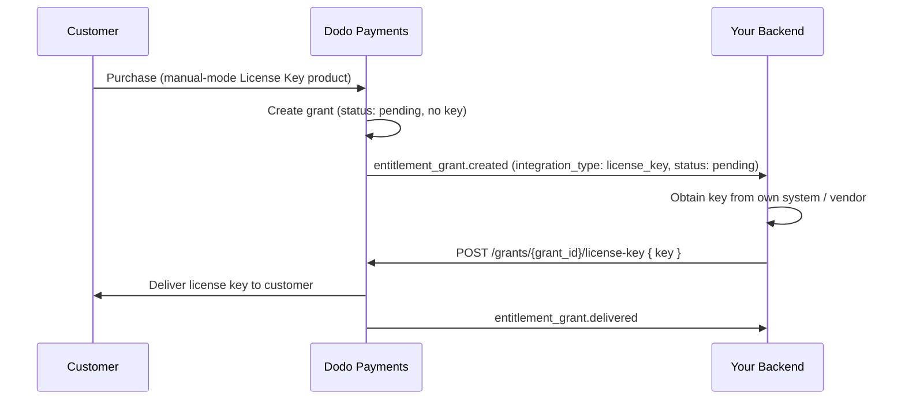

Este guia aborda a construção de um sistema de **cumprimento manual de chaves de licença** de ponta a ponta. Em vez de o Dodo Payments gerar automaticamente uma chave no pagamento, cada compra cria uma concessão `pending` e aguarda que *você* forneça o valor da chave do seu próprio sistema, de um fornecedor terceiro ou de um conjunto finito de códigos.

Ao final, você terá:

- Um produto com uma autorização de Chave de Licença definida para cumprimento `manual`.
- Um ouvinte de webhook que detecta quando um cliente está aguardando uma chave.
- Uma chamada de cumprimento que entrega a chave e notifica o cliente automaticamente.

<CardGroup cols={2}>
<Card title="License Keys overview" icon="key" href="/features/license-keys">
O ciclo completo da chave de licença e a configuração `fulfillment_mode`.
</Card>
<Card title="Fulfill License Key Grant API" icon="code" href="/api-reference/entitlements/fulfill-license-key">
Referência da API para o endpoint que você chama para entregar uma chave.
</Card>
</CardGroup>

## Como Funciona



O cumprimento manual altera apenas a etapa de **emissão**. Ativação, validação, desativação, expiração e revogação funcionam exatamente como uma chave gerada automaticamente, uma vez entregue.

## Pré-requisitos

Para seguir este guia, você precisará de:

- Uma conta de comerciante do Dodo Payments.
- Sua chave de API (`DODO_PAYMENTS_API_KEY`) e a chave secreta do webhook do painel de controle. Veja o [guia de geração de chave de API](/api-reference/introduction#api-key-generation).
- Um endpoint de backend que possa receber webhooks.

<Info>
Use `https://test.dodopayments.com` e credenciais de modo de teste durante a construção. Alterne para `https://live.dodopayments.com` e chaves ao vivo quando for para a produção.
</Info>

## Etapa 1 — Criar uma Autorização de Chave de Licença no Modo Manual

Uma **autorização** é uma definição reutilizável do que você entrega. Crie uma autorização de Chave de Licença e defina sua `fulfillment_mode` para `manual`.

<Tabs>
<Tab title="Dashboard">
<Steps>
<Step title="Open Entitlements">
Vá para **Autorizations** no seu painel e clique em **+** para criar uma nova autorização.
</Step>
<Step title="Choose License Key">
Selecione **Chave de Licença** como a integração e dê um **Nome**. O formulário expõe esses campos:

- **Modo de Cumprimento** — `Automatic` por padrão. Esta é a configuração que habilita o cumprimento manual; você a altera no próximo passo.
- **Duração da Licença** — quanto tempo cada chave emitida permanece válida, ou **Sem expiração**.
- **Limite de Ativações** — máximo de ativações por chave, ou **Ilimitado**.
- **Mensagem de Ativação** — mensagem opcional voltada ao cliente exibida quando ele ativa a chave.

<Frame>

</Frame>
</Step>
<Step title="Set Fulfillment Mode to Manual">
Abra o dropdown **Modo de Cumprimento** e altere de **Automático** para **Manual**. Esta é a configuração que conduz todo este guia — sem ela, as chaves são geradas e enviadas por e-email automaticamente e nenhuma concessão pendente é criada. Com **Manual** selecionado, cada compra cria uma concessão `pending` para você cumprir. Clique em **Criar Autorização** para salvar.
</Step>
</Steps>
</Tab>

<Tab title="API">
Crie a autorização com `integration_config.fulfillment_mode` definida como `manual`.
<CodeGroup>

```typescript Node.js theme={null}
import DodoPayments from 'dodopayments';

const client = new DodoPayments({
  bearerToken: process.env.DODO_PAYMENTS_API_KEY,
  environment: 'test_mode', // defaults to 'live_mode'
});

const entitlement = await client.entitlements.create({
  name: 'Pro License (Manual)',
  integration_type: 'license_key',
  integration_config: {
    fulfillment_mode: 'manual',
    activations_limit: 5,
    duration_count: 1,
    duration_interval: 'Year',
  },
});

console.log(entitlement.id); // ent_...
```

```python Python theme={null}
import os
from dodopayments import DodoPayments

client = DodoPayments(
    bearer_token=os.environ.get("DODO_PAYMENTS_API_KEY"),
    environment="test_mode",  # defaults to "live_mode"
)

entitlement = client.entitlements.create(
    name="Pro License (Manual)",
    integration_type="license_key",
    integration_config={
        "fulfillment_mode": "manual",
        "activations_limit": 5,
        "duration_count": 1,
        "duration_interval": "Year",
    },
)

print(entitlement.id)
```

```bash cURL theme={null}
curl -X POST https://test.dodopayments.com/entitlements \
  -H "Authorization: Bearer $DODO_PAYMENTS_API_KEY" \
  -H "Content-Type: application/json" \
  -d '{
    "name": "Pro License (Manual)",
    "integration_type": "license_key",
    "integration_config": {
      "fulfillment_mode": "manual",
      "activations_limit": 5,
      "duration_count": 1,
      "duration_interval": "Year"
    }
  }'
```

</CodeGroup>
</Tab>
</Tabs>

<Note>
`fulfillment_mode` padrão é `auto`. Omitir, ou deixar uma autorização existente inalterada, mantém o comportamento automático. Somente autorizações explicitamente definidas para `manual` criam concessões pendentes.
</Note>

## Etapa 2 — Anexe a Autorização a um Produto

Abra o produto que deseja vender, expanda **Configurações Avançadas → Autorizações e Créditos**, e selecione a **autorização de Chave de Licença que definiu como Manual** na Etapa 1. Um único produto pode entregar essa chave de licença junto com outras autorizações na mesma compra.

<Frame caption="Selecting the License Key entitlement in the product entitlements panel.">

</Frame>

<Note>
O modo de cumprimento é uma propriedade da **autorização**, não do produto. Porque você definiu como **Manual** na Etapa 1, todo produto a que essa autorização está vinculada cria concessões de chaves de licença `pending` na compra — não há nada extra para configurar aqui.
</Note>

<Tip>
Se você ainda não tem um produto, crie um primeiro (único ou assinatura). Veja o [Guia de Integração de Pagamentos Únicos](/developer-resources/integration-guide) para vender o produto através do checkout.
</Tip>

## Etapa 3 — Detectar Concessões Pendentes

Quando um cliente compra o produto, o Dodo Payments cria uma concessão em status `pending` **sem chave anexada** e dispara um webhook `entitlement_grant.created`. Este é o seu sinal de que um cliente está aguardando uma chave.

### Ouça o webhook

Configure um endpoint de webhook (Desenvolvedor → Webhooks no painel) e aja sobre as concessões de chave de licença pendentes. A implementação segue a especificação [Webhooks Padrão](https://standardwebhooks.com/).

```typescript theme={null}
import { Webhook } from 'standardwebhooks';

const webhook = new Webhook(process.env.DODO_WEBHOOK_KEY!);

export async function POST(request: Request) {
  const rawBody = await request.text();
  const headers = {
    'webhook-id': request.headers.get('webhook-id') || '',
    'webhook-signature': request.headers.get('webhook-signature') || '',
    'webhook-timestamp': request.headers.get('webhook-timestamp') || '',
  };

  await webhook.verify(rawBody, headers);
  const event = JSON.parse(rawBody);

  // A customer bought a manual-mode license key and is waiting for it.
  if (
    event.type === 'entitlement_grant.created' &&
    event.data.integration_type === 'license_key' &&
    event.data.status === 'pending'
  ) {
    await queueLicenseKeyFulfillment({
      grantId: event.data.id,
      customerId: event.data.customer_id,
    });
  }

  return new Response('ok');
}
```

A carga útil da concessão carrega `integration_type: "license_key"`, para que você possa reconhecer uma concessão de chave de licença sem uma busca extra. Veja a [referência de webhook de Concessão de Autorização](/developer-resources/webhooks/intents/entitlement-grant) para a carga útil completa.

### Ou faça polling da API de Listagem de Concessões

Se preferir não depender de webhooks, liste as concessões para a autorização e filtre por `integration_type` e `status`:

Se você preferir não depender de webhooks, liste as concessões para o direito de Chave de Licença e filtre por `status`. Toda concessão em um direito de Chave de Licença já é uma concessão de chave de licença, então nenhum filtro `integration_type` é necessário:

```typescript Node.js theme={null}
const pending = await client.entitlements.grants.list('ent_license_key_id', {
  integration_type: 'license_key',
  status: 'pending',
});

for (const grant of pending.items) {
  console.log(`Grant ${grant.id} for customer ${grant.customer_id} needs a key`);
}
```

```typescript Node.js theme={null}
const pending = await client.entitlements.grants.list('ent_license_key_id', {
  status: 'Pending',
});

for (const grant of pending.items) {
  console.log(`Grant ${grant.id} for customer ${grant.customer_id} needs a key`);
}
```

```bash cURL theme={null}
curl -G https://test.dodopayments.com/entitlements/ent_license_key_id/grants \
  -H "Authorization: Bearer $DODO_PAYMENTS_API_KEY" \
  --data-urlencode "status=Pending"
```

## Etapa 4 — Entregar a Chave

Obtenha o valor da chave do seu próprio sistema, depois envie-o com o endpoint [Cumprir Concessão de Chave de Licença](/api-reference/entitlements/fulfill-license-key). Isso requer sua chave de API secreta (permissão de Editor); não é um dos endpoints de licença pública.

<CodeGroup>

```typescript Node.js theme={null}
async function fulfill(grantId: string, key: string) {
  const res = await fetch(
    `https://test.dodopayments.com/grants/${grantId}/license-key`,
    {
      method: 'POST',
      headers: {
        'Content-Type': 'application/json',
        Authorization: `Bearer ${process.env.DODO_PAYMENTS_API_KEY}`,
      },
      body: JSON.stringify({
        key,
        // Optional — fall back to the entitlement config when omitted
        activations_limit: 5,
        expires_at: '2027-05-01T00:00:00Z',
      }),
    },
  );

  if (!res.ok) {
    // See the status code table below for handling
    throw new Error(`Fulfillment failed: ${res.status}`);
  }

  return res.json(); // updated grant, now status: "delivered"
}
```

```bash cURL theme={null}
curl -X POST https://test.dodopayments.com/grants/grant_8VbC6JDZ/license-key \
  -H "Authorization: Bearer $DODO_PAYMENTS_API_KEY" \
  -H "Content-Type: application/json" \
  -d '{
    "key": "PRO-AAAA-BBBB-CCCC-DDDD",
    "activations_limit": 5,
    "expires_at": "2027-05-01T00:00:00Z"
  }'
```

</CodeGroup>

### Campos de solicitação

<ParamField body="key" type="string" required>
A string da chave de licença a ser entregue ao cliente. Espaços em branco são removidos; um valor vazio ou apenas de espaço em branco é rejeitado.
</ParamField>

<ParamField body="activations_limit" type="integer">
Limite de ativações por chave. Retoma a configuração da autorização quando omitido.
</ParamField>

<ParamField body="expires_at" type="string">
Expiração por chave (ISO 8601). Retoma a duração da configuração da autorização quando omitido. Para concessões emitidas por assinatura, a validade permanece vinculada à assinatura independentemente.
</ParamField>

Com sucesso, a concessão avança para `delivered`, o cliente recebe automaticamente a chave (o mesmo e-mail que receberia sob cumprimento automático), e `entitlement_grant.delivered` dispara.

O cliente recebe um e-mail com a chave de licença, o produto, limite de ativação, expiração e suas instruções de ativação:

<Frame caption="The license key email the customer receives once you fulfill the grant.">

</Frame>

<Check>
Você não precisa enviar a chave por e-mail você mesmo — a entrega acontece automaticamente quando a concessão é cumprida.
</Check>

## Etapa 5 — Lidando com Erros e Novas Tentativas

O endpoint valida a concessão antes de entregar algo. Trate essas respostas:

| Status | Significado | O que fazer |
|---|---|---|
| `200` | Chave entregue, concessão agora é `delivered`. | Concluído. |
| `400` | Não é uma concessão de chave de licença, ou a chave está vazia/em branco. | Corrija a solicitação; não tente novamente como está. |
| `404` | Nenhuma concessão com esse ID para o seu negócio. | Verifique o `grant_id`. |
| `409` | Concessão não aguardando cumprimento (já entregue ou já possui uma chave), **ou** o valor da chave já existe. | Se já foi entregue, trate como sucesso. Se uma chave duplicada, forneça uma chave diferente. |
| `422` | Corpo da solicitação falhou na validação (e.g. `activations_limit < 1`). | Corrija o campo e tente novamente. |

<Warning>
O cumprimento pode ser tentado novamente em erros transitórios (timeouts, `5xx`). Cada concessão só pode ser cumprida uma vez, então uma nova tentativa após uma chamada bem-sucedida, mas não reconhecida, retorna `409` em vez de emitir uma segunda chave ou enviar um e-mail duplicado. Use o `id` da concessão como sua chave de idempotência.
</Warning>

## Verifique o Fluxo

1. Compre o produto em modo de teste (veja os [guias de checkout](/developer-resources/integration-guide)).
2. Confirme se seu webhook recebeu `entitlement_grant.created` com `status: "pending"` e `integration_type: "license_key"`, ou se a concessão aparece na resposta da Listagem de Concessões com esses filtros.
3. Chame o endpoint de cumprimento com uma chave de teste.
4. Confirme se a resposta mostra `status: "delivered"` com um `license_key` preenchido, o cliente recebe o e-mail da chave e `entitlement_grant.delivered` dispara.

<Check>
Uma vez entregue, o cliente pode [ativar e validar](/features/license-keys#activation-validation-deactivation) a chave nos endpoints de licença pública exatamente como uma chave gerada automaticamente.
</Check>

## Referência de API Relacionada

<CardGroup cols={2}>
<Card title="Create Entitlement" icon="plus" href="/api-reference/entitlements/create-entitlement">
Crie a autorização de Chave de Licença com `fulfillment_mode: manual`.
</Card>
<Card title="List Grants" icon="users" href="/api-reference/entitlements/list-grants">
Filtre por `integration_type` e `status` para encontrar concessões pendentes.
</Card>
<Card title="Fulfill License Key Grant" icon="code" href="/api-reference/entitlements/fulfill-license-key">
Entregue o valor da chave e faça a transição da concessão para entregue.
</Card>
<Card title="Entitlement Grant Webhooks" icon="webhook" href="/developer-resources/webhooks/intents/entitlement-grant">
Os eventos `entitlement_grant.*` que sinalizam concessões pendentes e entregues.
</Card>
</CardGroup>

<CardGroup cols={2}>
<Card title="Create Entitlement" icon="plus" href="/api-reference/entitlements/create-entitlement">
Create the License Key entitlement with `fulfillment_mode: manual`.
</Card>
<Card title="List Grants" icon="users" href="/api-reference/entitlements/list-grants">
Filter by `integration_type` and `status` to find pending grants.
</Card>
<Card title="Fulfill License Key Grant" icon="code" href="/api-reference/entitlements/fulfill-license-key">
Deliver the key value and transition the grant to delivered.
</Card>
<Card title="Entitlement Grant Webhooks" icon="webhook" href="/developer-resources/webhooks/intents/entitlement-grant">
The `entitlement_grant.*` events that signal pending and delivered grants.
</Card>
</CardGroup>
