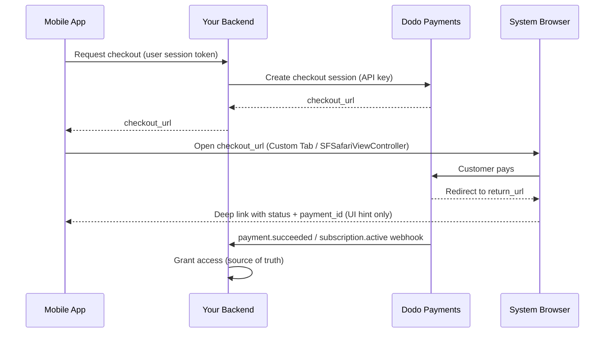

<CardGroup cols={4}>
<Card title="Quick Start" icon="rocket" href="#integration-workflow">
  Coloque sua integração de pagamentos móveis em funcionamento em 4 etapas simples
</Card>

<Card title="Platform Examples" icon="code" href="#choose-your-sdk">
  Exemplos completos de código para Android, iOS, React Native e Flutter
</Card>

<Card title="Checkout Customization" icon="sliders" href="#checkout-page-customization">
  Configure temas, preenchimento automático e 14 parâmetros específicos para dispositivos móveis
</Card>

<Card title="Mobile Recipes" icon="flask" href="#mobile-optimized-recipes">
  Configurações de checkout prontas para copiar e colar para 5 cenários móveis comuns
</Card>
</CardGroup>

<Info>
Dodo Payments disponibiliza um SDK oficial de checkout para **Android, iOS, React Native
e Flutter**. Cada um encapsula o padrão documentado abaixo (abrir a
URL de checkout, capturar o retorno e analisar o resultado) por trás de uma única chamada
`start(...)` tipada, com recuperação de sessões abandonadas integrada. Use uma WebView manual somente
se nenhuma dessas opções for adequada à sua stack.
</Info>

## Pré-requisitos

Antes de integrar Dodo Payments ao seu aplicativo móvel, verifique se você tem:

- **Conta Dodo Payments**: conta de comerciante ativa com acesso à API
- **Credenciais da API**: chave de API e chave secreta de webhook do seu dashboard
- **Projeto de aplicativo móvel**: aplicativo Android, iOS, React Native ou Flutter
- **Servidor de backend**: para lidar com segurança com a criação de sessões de checkout

## Fluxo de integração

A integração móvel segue um processo seguro de 4 etapas, no qual seu backend gerencia as chamadas de API e seu aplicativo móvel gerencia a experiência do usuário.



<Info>
O deep link `status` é apenas uma **dica de UI** sobre o que mostrar ao usuário. Sempre conceda acesso a partir do **webhook** `payment.succeeded` / `subscription.active` no seu backend — nunca somente a partir do resultado móvel.
</Info>

<Steps>
<Step title="Backend: Create Checkout Session">
<Card title="Checkout Session API Docs" icon="book" href="/developer-resources/checkout-session">
Saiba como criar uma sessão de checkout no seu backend usando Node.js, Python e outras linguagens. Consulte exemplos completos e referências de parâmetros na documentação dedicada da <strong>Checkout Sessions API</strong>.
</Card>
<Note>
**Segurança**: as sessões de checkout devem ser criadas no seu servidor de backend, nunca no aplicativo móvel. Isso protege suas chaves de API e garante a validação adequada.
</Note>

</Step>

<Step title="Mobile: Get Checkout URL">

Seu aplicativo móvel chama o backend para obter a URL de checkout. Autentique
essa solicitação com o token de sessão do próprio usuário conectado.

<Tabs>
<Tab title="iOS (Swift)">

```swift
func getCheckoutURL(productId: String, customerEmail: String, customerName: String) async throws -> String {
    let url = URL(string: "https://your-backend.com/api/create-checkout-session")!
    var request = URLRequest(url: url)
    request.httpMethod = "POST"
    request.setValue("application/json", forHTTPHeaderField: "Content-Type")
    request.setValue("Bearer \(userSessionToken)", forHTTPHeaderField: "Authorization")
    
    let requestData: [String: Any] = [
        "productId": productId,
        "customerEmail": customerEmail,
        "customerName": customerName
    ]
    request.httpBody = try JSONSerialization.data(withJSONObject: requestData)
    
    let (data, _) = try await URLSession.shared.data(for: request)
    let response = try JSONDecoder().decode(CheckoutResponse.self, from: data)
    return response.checkout_url
}
```

</Tab>
<Tab title="Android (Kotlin)">

```kotlin
suspend fun getCheckoutURL(productId: String, customerEmail: String, customerName: String): String {
    val client = OkHttpClient()
    val requestBody = JSONObject().apply {
        put("productId", productId)
        put("customerEmail", customerEmail)
        put("customerName", customerName)
    }.toString().toRequestBody("application/json".toMediaType())
    
    val request = Request.Builder()
        .url("https://your-backend.com/api/create-checkout-session")
        .header("Authorization", "Bearer $userSessionToken")
        .post(requestBody)
        .build()
    
    val response = client.newCall(request).execute()
    val responseBody = response.body?.string()
    val jsonResponse = JSONObject(responseBody ?: "")
    return jsonResponse.getString("checkout_url")
}
```

</Tab>
<Tab title="React Native (JavaScript)">

```javascript
const getCheckoutURL = async (productId, customerEmail, customerName) => {
  try {
    const response = await fetch('https://your-backend.com/api/create-checkout-session', {
      method: 'POST',
      headers: {
        'Content-Type': 'application/json',
        'Authorization': `Bearer ${userSessionToken}`,
      },
      body: JSON.stringify({
        productId,
        customerEmail,
        customerName
      })
    });
    
    const data = await response.json();
    return data.checkout_url;
  } catch (error) {
    console.error('Failed to get checkout URL:', error);
    throw error;
  }
};
```

</Tab>
<Tab title="Flutter (Dart)">

```dart
import 'dart:convert';
import 'package:http/http.dart' as http;

Future<String> getCheckoutUrl({
  required String productId,
  required String customerEmail,
  required String customerName,
}) async {
  final response = await http.post(
    Uri.parse('https://your-backend.com/api/create-checkout-session'),
    headers: {
      'Content-Type': 'application/json',
      'Authorization': 'Bearer $userSessionToken',
    },
    body: jsonEncode({
      'productId': productId,
      'customerEmail': customerEmail,
      'customerName': customerName,
    }),
  );

  if (response.statusCode != 200) {
    throw Exception('Failed to get checkout URL: ${response.statusCode}');
  }
  return jsonDecode(response.body)['checkout_url'] as String;
}
```

</Tab>
</Tabs>
<Note>
**Segurança**: os aplicativos móveis se comunicam apenas com seu backend, nunca diretamente com a Dodo Payments API.
</Note>
</Step>

<Step title="Mobile: Open Checkout in Browser">
Abra a URL de checkout em um navegador seguro dentro do aplicativo para processar o pagamento.
Ou ignore completamente a configuração manual usando o SDK oficial de checkout da sua
plataforma.

<Card title="Pick your mobile SDK" icon="box" href="#choose-your-sdk">
  Etapas de instalação e instruções de configuração para Android, iOS, React Native e Flutter.
</Card>

</Step>

<Step title="Backend: Handle Payment Completion">
Processe a conclusão do pagamento por meio de webhooks e URLs de redirecionamento para confirmar o status do pagamento.
</Step>
</Steps>

## Escolha seu SDK

Todos os SDKs móveis expõem o mesmo contrato: uma única chamada `start(...)` abre o checkout hospedado da Dodo na superfície de navegador nativa da plataforma e retorna um `CheckoutResult` tipado cujo `status` é `succeeded`, `failed`, `cancelled`, `pending` ou `expired`. Nenhum deles armazena uma chave de API ou chama a Dodo Payments API, e os quatro oferecem suporte à recuperação de sessões abandonadas.

<CardGroup cols={2}>
<Card title="Android" icon="android" href="/developer-resources/sdks/android">
  `com.dodopayments.api:checkout-android` abre uma Chrome Custom Tab. Requer `minSdk` 23.
</Card>
<Card title="iOS" icon="apple" href="/developer-resources/sdks/ios">
  `dodopayments-mobile-sdk-ios` abre `SFSafariViewController`. Requer iOS 16 ou superior.
</Card>
<Card title="React Native" icon="react" href="/developer-resources/sdks/react-native">
  `@dodopayments/react-native-checkout`, um Turbo Module sobre os dois núcleos nativos. Requer React Native 0.76 ou superior.
</Card>
<Card title="Flutter" icon="layer-group" href="/developer-resources/sdks/flutter">
  `dodopayments_checkout`, um canal Pigeon sobre os dois núcleos nativos. Requer Flutter 3.44 ou superior.
</Card>
</CardGroup>

<Warning>
O `status` retornado é uma dica de UI, não uma prova de pagamento. Confirme cada pagamento no seu backend por meio do webhook `payment.succeeded` / `subscription.active` ou recuperando o pagamento com sua chave secreta.
</Warning>

### Registrando um esquema de URL de callback

Os quatro SDKs devolvem o controle ao seu aplicativo por meio de um esquema de URL personalizado que
você escolhe, por exemplo, `myapp://checkout/return`. Registre-o uma vez por
plataforma:

<Tabs>
<Tab title="Android">

```kotlin android/app/build.gradle
android {
    defaultConfig {
        manifestPlaceholders["dodoCallbackScheme"] = "myapp"
    }
}
```

O próprio manifest do SDK já declara a atividade de redirecionamento, portanto não há
XML de manifest a ser adicionado.
</Tab>
<Tab title="iOS">

```xml Info.plist
<key>CFBundleURLTypes</key>
<array>
  <dict>
    <key>CFBundleURLName</key>
    <string>myapp</string>
    <key>CFBundleURLSchemes</key>
    <array>
      <string>myapp</string>
    </array>
  </dict>
</array>
```

No iOS, você também deve encaminhar as URLs recebidas para o SDK, pois
`SFSafariViewController` não consegue capturar sua própria URL de retorno. Consulte a página
[iOS](/developer-resources/sdks/ios) ou
[React Native](/developer-resources/sdks/react-native) para obter o
handler exato.
</Tab>
<Tab title="Expo">
`@dodopayments/react-native-checkout` inclui um config plugin que registra o esquema
para ambas as plataformas em `prebuild`. Passe a ele uma opção `scheme`:

```json app.json
{
  "expo": {
    "scheme": "myapp",
    "plugins": [
      [
        "@dodopayments/react-native-checkout",
        { "scheme": "myappcheckout" }
      ]
    ]
  }
}
```

`scheme` deve corresponder a `returnUrl` e ser diferente de `expo.scheme`, que o Expo já registra em `MainActivity`. Consulte a página do [React Native SDK](/developer-resources/sdks/react-native) para obter detalhes.

Se `android/app/build.gradle` for mantido manualmente sem um bloco `defaultConfig { }` padrão, defina o placeholder manualmente (consulte a aba Android).

Funciona somente com development builds, não com Expo Go. Execute `npx expo prebuild --clean` depois de editar `app.json`.
</Tab>
</Tabs>

<Note>
Prefere criar a integração por conta própria? Abra `checkout_url` no navegador do sistema da plataforma (Android Custom Tabs / iOS `SFSafariViewController`), intercepte a navegação para seu `return_url` e leia os parâmetros de consulta `status` e `payment_id`. Os SDKs acima fazem exatamente isso por você.
</Note>

<Warning>
**Não abra o checkout dentro de uma WebView incorporada (`WKWebView` / Android `WebView`).** Este é o problema mais comum em integrações móveis: uma WebView incorporada **impede o funcionamento do Apple Pay e do Google Pay** e também pode interromper desafios do 3-D Secure e o preenchimento automático de cartões salvos — fazendo com que os clientes vejam menos opções de pagamento e mais falhas. Sempre use o SDK ou abra `checkout_url` no navegador do sistema (Custom Tabs / `SFSafariViewController`). Essa superfície de navegador nativa é exatamente o motivo pelo qual Apple Pay e Google Pay continuam funcionando.
</Warning>

## Personalização da aparência

Todos os SDKs aceitam um parâmetro opcional `customization` em `start(...)` / `CheckoutParams` que controla a aparência e o comportamento da superfície de navegador nativa — a barra de ferramentas, os botões e a apresentação. Isso é separado do tema da própria página de checkout, que você configura no servidor por meio de [`customization.theme_config`](/developer-resources/checkout-session) na sessão de checkout.

As opções são agrupadas por plataforma porque a Custom Tab do Android e a `SFSafariViewController` do iOS expõem controles nativos diferentes. Todos os campos são opcionais; omitir completamente `customization` usa a aparência padrão de cada plataforma.

<AccordionGroup>
<Accordion title="Android - Custom Tab">

<ParamField body="toolbarColor" type="Color">
Cor de fundo da barra de ferramentas.
</ParamField>

<ParamField body="navigationBarColor" type="Color">
Cor da barra de navegação.
</ParamField>

<ParamField body="navigationBarDividerColor" type="Color">
Cor do divisor acima da barra de navegação.
</ParamField>

<ParamField body="closeButtonStyle" type="'default' | 'back'">
`default` exibe o ícone de sistema "X"; `back` desenha uma seta de voltar.
</ParamField>

<ParamField body="closeButtonPosition" type="'start' | 'end'">
Em qual lado da barra de ferramentas o botão de fechar aparece.
</ParamField>

<ParamField body="shareButtonEnabled" type="boolean">
Exibe o ícone de compartilhamento da barra de ferramentas.
</ParamField>

<ParamField body="showTitleEnabled" type="boolean">
Exibe o título da página abaixo da URL na barra de ferramentas.
</ParamField>

<ParamField body="urlBarHidingEnabled" type="boolean">
Permite que a barra de ferramentas se oculte automaticamente conforme a página é rolada.
</ParamField>

<ParamField body="bookmarksButtonEnabled" type="boolean">
Exibe "Adicionar esta página aos favoritos" no menu de opções.
</ParamField>

<ParamField body="downloadsButtonEnabled" type="boolean">
Exibe "Baixar página" no menu de opções.
</ParamField>

<ParamField body="colorScheme" type="'system' | 'light' | 'dark'">
Força a aparência clara ou escura, independentemente da configuração do sistema do dispositivo.
</ParamField>

</Accordion>

<Accordion title="iOS - SFSafariViewController">

<ParamField body="dismissButtonStyle" type="'done' | 'close' | 'cancel'">
Rótulo ou ícone do botão de dispensar.
</ParamField>

<ParamField body="presentationStyle" type="'pageSheet' | 'fullScreen'">
`pageSheet` é apresentado como um cartão com deslize para dispensar; `fullScreen` cobre a tela inteira.
</ParamField>

<ParamField body="barCollapsingEnabled" type="boolean">
Permite que a barra de ferramentas seja recolhida durante a rolagem. Só fica visível quando `presentationStyle` é `fullScreen` — `pageSheet` mantém as barras fixas independentemente desta configuração.
</ParamField>

<ParamField body="colorScheme" type="'system' | 'light' | 'dark'">
Força a aparência clara ou escura, independentemente da configuração do sistema do dispositivo.
</ParamField>

</Accordion>
</AccordionGroup>

<Tabs>
<Tab title="React Native">

```typescript
const result = await DodoCheckout.start({
  checkoutUrl,
  returnUrl: 'myapp://checkout/return',
  customization: {
    android: { toolbarColor: '#6366F1', closeButtonStyle: 'back' },
    ios: { presentationStyle: 'fullScreen', colorScheme: 'dark' },
  },
});
```

</Tab>
<Tab title="Flutter">

```dart
final result = await DodoCheckout.instance.start(
  CheckoutParams(
    checkoutUrl: Uri.parse(checkoutUrl),
    returnUrl: Uri.parse('myapp://checkout/return'),
    customization: BrowserCustomization(
      android: AndroidBrowserOptions(
        toolbarColor: Color(0xFF6366F1),
        closeButtonStyle: CloseButtonStyle.back,
      ),
      ios: IosBrowserOptions(
        presentationStyle: PresentationStyle.fullScreen,
        colorScheme: BrowserColorScheme.dark,
      ),
    ),
  ),
);
```

</Tab>
<Tab title="Android (Kotlin)">

```kotlin
val result = DodoCheckout.start(
    activity,
    CheckoutParams(
        checkoutUrl = checkoutUrl,
        returnUrl = "myapp://checkout/return",
        customization = BrowserCustomization(
            toolbarColor = Color.parseColor("#6366F1"),
            closeButtonStyle = BrowserCustomization.CloseButtonStyle.BACK,
        )
    )
) { event -> }
```

</Tab>
<Tab title="iOS (Swift)">

```swift
let result = try await DodoCheckout.start(
    checkoutUrl: checkoutUrl,
    returnUrl: URL(string: "myapp://checkout/return")!,
    customization: BrowserCustomization(
        presentationStyle: .fullScreen,
        colorScheme: .dark
    )
)
```

</Tab>
</Tabs>

## Personalização da página de checkout

A seção [Personalização da aparência](#appearance-customization) acima controla a superfície de navegador nativa — barra de ferramentas, botões e esquema de cores. A *própria página* de checkout — quais campos aparecem, o tema e quais métodos de pagamento são exibidos — é configurada no servidor quando você cria a sessão de checkout. Esses parâmetros têm o maior impacto na conversão em dispositivos móveis.

Os parâmetros abaixo ficam em três locais diferentes na solicitação da sessão de checkout — a coluna **Onde fica** informa em qual objeto cada um deve ser colocado. Errar isso é o erro mais comum: um parâmetro colocado no objeto errado é ignorado silenciosamente.

| Parâmetro | Onde fica | Benefício para dispositivos móveis | Padrão | Defina quando… |
|-----------|---------------|---------------|---------|-----------|
| `show_order_details` | `customization` | Recolhe o resumo do pedido para que os métodos de pagamento apareçam no topo da tela | `true` | Sempre defina `false` em dispositivos móveis — mover os métodos de pagamento para acima da dobra reduz significativamente o abandono |
| `minimal_address` | top-level | Exige apenas um CEP; oculta os campos de rua, cidade e estado | `false` | Quase sempre em dispositivos móveis — cada campo extra reduz as conversões |
| `theme` | `customization` | Controla a aparência clara ou escura da página de checkout | Padrão da empresa | Use `"system"` para corresponder à preferência do sistema operacional do dispositivo |
| `theme_config` | `customization` | Paleta completa da marca — cores, fontes, raio da borda e rótulo do botão de pagamento | Nenhum | Quando o checkout precisa parecer parte do seu aplicativo |
| `force_language` | `customization` | Substitui a detecção de localidade do navegador | Detecção automática | Defina a partir da localidade do seu aplicativo, em vez de depender do navegador |
| `show_on_demand_tag` | `customization` | Exibe ou oculta o rótulo "sob demanda" na página de checkout | `true` | Defina `false` quando usar cobrança sob demanda apenas para tokenização de cartão |
| `show_saved_payment_methods` | top-level | Exibe os cartões salvos de um cliente recorrente para pagamento com um toque | `false` | Ative para usuários conectados que já pagaram anteriormente |
| `allow_discount_code` | `feature_flags` | Exibe o campo de código promocional | `true` | Defina `false` para encurtar o formulário; usuários que saem para procurar um código raramente retornam |
| `allow_currency_selection` | `feature_flags` | Permite que o cliente altere a moeda de cobrança | `true` | Defina `false` quando bloquear a moeda com `billing_currency` |
| `redirect_immediately` | `feature_flags` | Ignora a página de sucesso e vai diretamente para `return_url` | `false` | Ative para uma transferência contínua de volta ao aplicativo |
| `confirm` | top-level | Finaliza o pagamento sem uma etapa adicional de confirmação | `false` | Use com `payment_method_id` para checkout com um clique |
| `short_link` | top-level | Retorna uma URL de checkout mais curta | `false` | Útil quando a URL precisa caber em uma notificação push ou SMS |
| `payment_method_id` | top-level | Pré-seleciona um método de pagamento salvo | - | Passe junto com `confirm: true` para checkout com um clique |
| `allowed_payment_method_types` | top-level | Permite apenas os métodos de pagamento exibidos | Todos ativados | Limite aos métodos que funcionam para seu tipo de produto |

<Warning>
**Sempre passe `billing_currency` e `billing_address.country` juntos.** Se um deles for omitido, Adaptive Currency poderá alterar silenciosamente a moeda de cobrança com base no endereço IP do cliente. Um comerciante viu uma assinatura nos EUA mudar para EUR quando o cliente viajou para a Europa — porque o país de cobrança não havia sido definido explicitamente.
</Warning>

<Tip>
**Maior aumento individual de conversão em dispositivos móveis:** defina `show_order_details: false` e `minimal_address: true`. Mover os métodos de pagamento para acima da dobra e reduzir os campos do formulário são as duas mudanças de maior impacto que você pode fazer.
</Tip>

<Frame caption="show_order_details: false moves the contact and payment fields above the fold, instead of behind the order summary.">
  
</Frame>

Defina `minimal_address: true` para coletar apenas um CEP, em vez dos campos completos de rua, cidade e estado:

<Frame caption="minimal_address: true reduces the billing address to a single postcode field.">
  
</Frame>

Defina `theme: "system"` para que o checkout siga a preferência de modo claro ou escuro do dispositivo:

<Frame caption="With theme: system, the checkout follows the device's light or dark appearance automatically.">
  
</Frame>

<Info>
**A disponibilidade dos métodos de pagamento varia conforme o tipo de produto.** Apple Pay e Cash App são compatíveis com assinaturas recorrentes não gratuitas. Para pagamentos únicos, todos os métodos ativados estão disponíveis.
</Info>

<Card title="Full checkout session parameter reference" icon="book" href="/developer-resources/checkout-session">
  Consulte todos os parâmetros, tipos e valores padrão disponíveis no guia Checkout Sessions.
</Card>

## Receitas otimizadas para dispositivos móveis

Cada receita abaixo é o corpo completo de uma solicitação de sessão de checkout. Copie a que corresponde ao seu cenário, substitua pelo ID do seu produto e envie-a ao endpoint de criação de sessão do seu backend.

<AccordionGroup>
<Accordion title="Minimal Mobile Checkout - fastest path to payment">

Use esta opção quando quiser o formulário mais curto possível: métodos de pagamento no topo, apenas o CEP obrigatório para o endereço, nenhum campo de desconto e tema correspondente ao dispositivo.

<Tabs>
<Tab title="Node.js SDK">

```javascript expandable
import DodoPayments from 'dodopayments';

const client = new DodoPayments({
  bearerToken: process.env.DODO_PAYMENTS_API_KEY,
  environment: 'test_mode',
});

const session = await client.checkoutSessions.create({
  product_cart: [{ product_id: 'pdt_your_product_id', quantity: 1 }],
  customer: { email: 'user@example.com', name: 'Jane Smith' },
  billing_address: { country: 'US' },
  return_url: 'myapp://checkout/success',
  cancel_url: 'myapp://checkout/cancelled',
  billing_currency: 'USD',
  minimal_address: true,
  customization: {
    show_order_details: false,
    theme: 'system',
  },
  feature_flags: {
    allow_discount_code: false,
    allow_currency_selection: false,
  },
});

console.log(session.checkout_url);
```

</Tab>
<Tab title="Python SDK">

```python expandable
import os
import dodopayments

client = dodopayments.DodoPayments(
    bearer_token=os.environ.get("DODO_PAYMENTS_API_KEY"),
    environment="test_mode",
)

session = client.checkout_sessions.create(
    product_cart=[{"product_id": "pdt_your_product_id", "quantity": 1}],
    customer={"email": "user@example.com", "name": "Jane Smith"},
    billing_address={"country": "US"},
    return_url="myapp://checkout/success",
    cancel_url="myapp://checkout/cancelled",
    billing_currency="USD",
    minimal_address=True,
    customization={
        "show_order_details": False,
        "theme": "system",
    },
    feature_flags={
        "allow_discount_code": False,
        "allow_currency_selection": False,
    },
)

print(session.checkout_url)
```

</Tab>
</Tabs>

<Note>
Consulte [Checkout Sessions](/developer-resources/checkout-session) para ver todos os parâmetros disponíveis e seus valores padrão.
</Note>
</Accordion>

<Accordion title="Branded Mobile Checkout - custom colors, fonts, and button label">

Use esta opção quando a página de checkout precisar parecer parte do seu aplicativo. Defina as cores da sua marca, uma fonte personalizada e um rótulo localizado para o botão de pagamento.

<Frame>
  
</Frame>

<Tabs>
<Tab title="Node.js SDK">

```javascript expandable
const session = await client.checkoutSessions.create({
  product_cart: [{ product_id: 'pdt_your_product_id', quantity: 1 }],
  customer: { email: 'user@example.com', name: 'Jane Smith' },
  billing_address: { country: 'US' },
  billing_currency: 'USD',
  return_url: 'myapp://checkout/success',
  minimal_address: true,
  customization: {
    show_order_details: false,
    theme: 'dark',
    theme_config: {
      dark: {
        button_primary: '#7C3AED',
        button_primary_hover: '#6D28D9',
        button_text_primary: '#FFFFFF',
        bg_primary: '#1A1A2E',
        bg_secondary: '#16213E',
        text_primary: '#E2E8F0',
      },
      pay_button_text: 'Complete Purchase',
      radius: '8px',
    },
  },
});
```

</Tab>
<Tab title="Python SDK">

```python expandable
session = client.checkout_sessions.create(
    product_cart=[{"product_id": "pdt_your_product_id", "quantity": 1}],
    customer={"email": "user@example.com", "name": "Jane Smith"},
    billing_address={"country": "US"},
    billing_currency="USD",
    return_url="myapp://checkout/success",
    minimal_address=True,
    customization={
        "show_order_details": False,
        "theme": "dark",
        "theme_config": {
            "dark": {
                "button_primary": "#7C3AED",
                "button_primary_hover": "#6D28D9",
                "button_text_primary": "#FFFFFF",
                "bg_primary": "#1A1A2E",
                "bg_secondary": "#16213E",
                "text_primary": "#E2E8F0",
            },
            "pay_button_text": "Complete Purchase",
            "radius": "8px",
        },
    },
)
```

</Tab>
</Tabs>

<Note>
`theme_config` aceita objetos separados `dark` e `light` para que a paleta se adapte à aparência atual do dispositivo. Consulte [Checkout Sessions](/developer-resources/checkout-session) para obter a referência completa das cores.
</Note>
</Accordion>

<Accordion title="One-Click Returning Customer - saved card, instant confirmation">

Use esta opção para usuários conectados que já pagaram anteriormente. Combine um ID de cliente, o método de pagamento salvo e `confirm: true` para ignorar completamente o formulário de checkout.

<Tabs>
<Tab title="Node.js SDK">

```javascript expandable
const session = await client.checkoutSessions.create({
  product_cart: [{ product_id: 'pdt_your_product_id', quantity: 1 }],
  customer: { customer_id: 'cus_returning_customer_id' },
  billing_address: { country: 'US' },
  billing_currency: 'USD',
  return_url: 'myapp://checkout/success',
  payment_method_id: 'pm_saved_payment_method_id',
  confirm: true,
  show_saved_payment_methods: true,           // top-level parameter
  feature_flags: { redirect_immediately: true },
});
```

</Tab>
<Tab title="Python SDK">

```python expandable
session = client.checkout_sessions.create(
    product_cart=[{"product_id": "pdt_your_product_id", "quantity": 1}],
    customer={"customer_id": "cus_returning_customer_id"},
    billing_address={"country": "US"},
    billing_currency="USD",
    return_url="myapp://checkout/success",
    payment_method_id="pm_saved_payment_method_id",
    confirm=True,
    show_saved_payment_methods=True,           # top-level parameter
    feature_flags={"redirect_immediately": True},
)
```

</Tab>
</Tabs>

<Note>
O `status` no retorno do deep link é apenas uma dica de UI. Confirme o acesso monitorando o webhook `payment.succeeded` no seu backend.
</Note>
</Accordion>

<Accordion title="Subscription with Free Trial - trial before first charge">

Use esta opção para produtos de assinatura que oferecem um período de teste gratuito antes do primeiro ciclo de cobrança.

<Tabs>
<Tab title="Node.js SDK">

```javascript expandable
const session = await client.checkoutSessions.create({
  product_cart: [{ product_id: 'pdt_your_subscription_product_id', quantity: 1 }],
  customer: { email: 'user@example.com', name: 'Jane Smith' },
  billing_address: { country: 'US' },
  billing_currency: 'USD',
  return_url: 'myapp://subscription/activated',
  cancel_url: 'myapp://subscription/cancelled',
  minimal_address: true,
  customization: {
    show_order_details: false,
    theme: 'system',
  },
  subscription_data: { trial_period_days: 14 },
});
```

</Tab>
<Tab title="Python SDK">

```python expandable
session = client.checkout_sessions.create(
    product_cart=[{"product_id": "pdt_your_subscription_product_id", "quantity": 1}],
    customer={"email": "user@example.com", "name": "Jane Smith"},
    billing_address={"country": "US"},
    billing_currency="USD",
    return_url="myapp://subscription/activated",
    cancel_url="myapp://subscription/cancelled",
    minimal_address=True,
    customization={"show_order_details": False, "theme": "system"},
    subscription_data={"trial_period_days": 14},
)
```

</Tab>
</Tabs>

<Note>
Conceda acesso ao recurso quando seu backend receber o webhook `subscription.active` — não quando o SDK móvel retornar. Consulte o [Guia de integração de assinaturas](/developer-resources/subscription-integration-guide) para ver o fluxo completo do webhook.
</Note>
</Accordion>

<Accordion title="On-Demand Mandate - save a card for future variable charges">

Use esta opção para tokenizar o cartão de um cliente para cobranças posteriores (recargas de carteira, pay-as-you-go e BNPL) sem exibir um rótulo de "assinatura". O cliente autoriza o método de pagamento uma vez; posteriormente, você cobra valores variáveis sob demanda.

<Info>
Este é o padrão usado por aplicativos que cobram com base no uso — por exemplo, um aplicativo de astrologia que cobra por sessão a partir de um cartão pré-autorizado, em vez de seguir uma agenda fixa.
</Info>

<Tabs>
<Tab title="Node.js SDK">

```javascript expandable
// Step 1: Authorize the mandate (no charge yet)
const session = await client.checkoutSessions.create({
  product_cart: [{ product_id: 'pdt_your_subscription_product_id', quantity: 1 }],
  customer: { email: 'user@example.com', name: 'Jane Smith' },
  billing_address: { country: 'US' },
  billing_currency: 'USD',
  return_url: 'myapp://mandate/authorized',
  cancel_url: 'myapp://mandate/cancelled',
  minimal_address: true,
  customization: {
    show_order_details: false,
    show_on_demand_tag: false, // hides the "on-demand" / "subscription" label
    theme: 'system',
  },
  subscription_data: {
    on_demand: { mandate_only: true },
  },
});

// Step 2: Later, charge any amount using the subscription ID
// (received via the subscription.active webhook after mandate authorization)
// await client.subscriptions.charge(subscriptionId, {
//   product_price: 2000,         // $20.00 in cents
//   product_currency: 'USD',
//   product_description: 'Session credits',
// });
```

</Tab>
<Tab title="Python SDK">

```python expandable
# Step 1: Authorize the mandate (no charge yet)
session = client.checkout_sessions.create(
    product_cart=[{"product_id": "pdt_your_subscription_product_id", "quantity": 1}],
    customer={"email": "user@example.com", "name": "Jane Smith"},
    billing_address={"country": "US"},
    billing_currency="USD",
    return_url="myapp://mandate/authorized",
    cancel_url="myapp://mandate/cancelled",
    minimal_address=True,
    customization={
        "show_order_details": False,
        "show_on_demand_tag": False,  # hides the "on-demand" / "subscription" label
        "theme": "system",
    },
    subscription_data={"on_demand": {"mandate_only": True}},
)

# Step 2: Later, charge any amount using the subscription ID
# client.subscriptions.charge(subscription_id, {
#     "product_price": 2000,  # $20.00 in cents
#     "product_currency": "USD",
#     "product_description": "Session credits",
# })
```

</Tab>
</Tabs>

<Warning>
As cobranças sob demanda exigem um mínimo de 1 USD (100 centavos). Valores abaixo de 1 USD serão rejeitados com `"value out of range"`. Para uma autorização de valor zero, use `mandate_only: true` conforme mostrado acima e, depois, cobre pelo menos 1 USD nas chamadas subsequentes.
</Warning>

<Note>
Consulte [Assinaturas sob demanda](/developer-resources/ondemand-subscriptions) para ver o fluxo completo de cobrança, os eventos de webhook e as políticas de novas tentativas.
</Note>
</Accordion>
</AccordionGroup>

## Fluxos de assinatura em dispositivos móveis

As assinaturas são criadas por meio do mesmo fluxo de sessão de checkout usado para pagamentos únicos — o SDK móvel abre o checkout hospedado, o cliente assina e seu aplicativo processa o retorno do deep link. O ciclo de vida da assinatura é então gerenciado inteiramente no backend.

### Assinaturas recorrentes regulares

Para cobranças em intervalos fixos (mensais ou anuais), crie uma sessão de checkout com um produto de assinatura e um deep link `return_url`. Seu backend recebe `subscription.active` quando a assinatura é confirmada.

<Info>
**Apple Pay** e **Cash App** são compatíveis com assinaturas recorrentes não gratuitas.
</Info>

Para consultar o fluxo completo de webhook do backend, veja o [Guia de integração de assinaturas](/developer-resources/subscription-integration-guide).

---

### Assinaturas sob demanda

As assinaturas sob demanda permitem autorizar o método de pagamento de um cliente uma vez e cobrar valores variáveis posteriormente — ideal para recargas de carteira, pay-as-you-go e qualquer cenário em que o valor da cobrança não seja conhecido antecipadamente. Consulte a receita **On-Demand Mandate** acima para ver o corpo completo da solicitação.

Considerações móveis importantes:

- Defina `show_on_demand_tag: false` para que a página de checkout não exiba a linguagem de "assinatura" ou "sob demanda". Em casos de uso de tokenização de cartão, os clientes não esperam terminologia de assinatura.
- Depois que o mandato for autorizado, seu backend receberá `subscription.active`. Armazene `subscription_id` — você o usará em todas as cobranças futuras.

<Warning>
A cobrança mínima é de 1 USD (100 centavos). Cobranças sob demanda abaixo de 1 USD serão rejeitadas com `"value out of range"`. Cobre pelo menos 1 USD ou use `mandate_only: true` para autorizar sem cobrar e coletar o primeiro valor real posteriormente.
</Warning>

<Warning>
**Evite novas tentativas em sequência rápida.** Se uma cobrança anterior ainda estiver sendo processada, uma nova cobrança na mesma assinatura falhará com `"Cannot create new charge as previous payment is not successful yet"`. Isso é especialmente comum com métodos de pagamento indianos (UPI, cartões de débito/crédito indianos), nos quais as regras de mandato do RBI podem manter uma transação em processamento por até 48 horas. Adicione uma verificação de intervalo de espera à sua lógica de cobrança antes de tentar novamente.
</Warning>

Consulte [Assinaturas sob demanda](/developer-resources/ondemand-subscriptions) para ver o endpoint de cobrança completo, os eventos de webhook e as políticas de novas tentativas.

---

### Assinatura com teste gratuito

Passe `subscription_data.trial_period_days` na sessão de checkout para oferecer um período de teste antes do primeiro ciclo de cobrança. O cliente autoriza seu método de pagamento durante a inscrição no teste; a primeira cobrança ocorre automaticamente quando o teste termina. Consulte a receita **Subscription with Free Trial** acima para ver o corpo completo da solicitação.

---

### Upgrades e downgrades

As alterações de plano são feitas por API no seu backend, não por meio de uma nova sessão de checkout. Dodo Payments calcula o rateio proporcional automaticamente. Para oferecer uma opção de autoatendimento aos clientes, incorpore ou vincule ao [Customer Portal](/features/customer-portal).

<CardGroup cols={2}>
<Card title="Subscription Integration Guide" icon="repeat" href="/developer-resources/subscription-integration-guide">
  Configuração completa do backend: fluxo de webhook, provisionamento de acesso e cancelamento
</Card>
<Card title="On-Demand Subscriptions" icon="bolt" href="/developer-resources/ondemand-subscriptions">
  Autorização de mandato, cobranças variáveis e políticas de novas tentativas
</Card>
<Card title="Upgrade / Downgrade" icon="arrows-up-down" href="/developer-resources/subscription-upgrade-downgrade">
  Estratégias de rateio proporcional, alterações de plano e ajustes de quantidade de assentos
</Card>
<Card title="Customer Portal" icon="user" href="/features/customer-portal">
  Gerenciamento de assinaturas por autoatendimento para seus clientes
</Card>
</CardGroup>

## Reduzindo abandonos no checkout

Os checkouts móveis apresentam mais abandonos do que os checkouts na web — telas menores, mais distrações e formulários mais longos contribuem para isso. As melhorias mais rápidas vêm da própria configuração da sessão de checkout.

### Otimize o formulário

| Configuração | Valor recomendado | Efeito |
|---------|------------------|--------|
| `show_order_details` | `false` | Recolhe o resumo do pedido; os métodos de pagamento aparecem no topo |
| `minimal_address` | `true` | Apenas o CEP é obrigatório; remove rua, cidade e estado |
| `show_saved_payment_methods` | `true` | Pagamento com um toque para clientes recorrentes |
| `allow_discount_code` | `false` | Remove o campo de código promocional |
| `theme` | `"system"` | Corresponde à preferência clara ou escura do dispositivo |
| `force_language` | Localidade do seu aplicativo | Impede que o checkout use o idioma padrão do navegador |

### Preencha previamente os dados do cliente

Cada campo que o cliente não precisa digitar é um motivo a menos para abandonar o checkout:

- **Novos clientes** — defina `customer.email` e `customer.name` a partir da sua sessão de autenticação.
- **Clientes recorrentes** — defina `customer.customer_id` para preencher automaticamente todos os dados armazenados.
- **Moeda** — sempre passe `billing_currency` e `billing_address.country` juntos.

### Ferramentas de recuperação

<CardGroup cols={2}>
<Card title="Abandoned Cart Recovery" icon="cart-shopping" href="/features/recovery/abandoned-cart-recovery">
  Sequências automatizadas de e-mails para checkouts incompletos
</Card>
<Card title="Payment Retries" icon="rotate" href="/features/recovery/payment-retries">
  Lógica inteligente de novas tentativas para renovações de assinatura com falha
</Card>
<Card title="Subscription Dunning" icon="envelope" href="/features/recovery/subscription-dunning">
  E-mails de reengajamento para assinaturas canceladas por inadimplência
</Card>
<Card title="Recovery Overview" icon="chart-line" href="/features/recovery/overview">
  Todas as ferramentas de recuperação e seu impacto combinado na receita
</Card>
</CardGroup>

<Tip>
**Teste os e-mails de abandono de carrinho antes de ativá-los.** Crie uma sessão de checkout no modo de produção e insira dados de cartão inválidos. O pagamento com falha acionará o fluxo de e-mail de recuperação, permitindo visualizar exatamente o que seus clientes receberão.
</Tip>

## Práticas recomendadas

- **Segurança**: nunca inclua uma chave de API no aplicativo. Crie sessões de checkout no backend e passe ao cliente apenas o `checkout_url` resultante.
- **Autoridade**: trate `CheckoutResult.status` como uma dica de UI. Conceda acesso somente depois que o backend confirmar o pagamento.
- **Experiência do usuário**: mostre um estado de carregamento enquanto o backend cria a sessão e trate `cancelled` como um resultado normal, não como um erro.
- **Testes**: use o modo de teste e cartões de teste e verifique o ciclo completo da URL de retorno em um dispositivo real e também em um simulador.
- **Conversão**: defina `show_order_details: false` e `minimal_address: true` para obter as melhores taxas de conclusão de checkout móvel. Mover os métodos de pagamento para acima da dobra e reduzir os campos do formulário são as duas mudanças de maior impacto que você pode fazer.
- **Moeda**: sempre passe explicitamente `billing_currency` e `billing_address.country` — se um deles estiver ausente, Adaptive Currency poderá alterar a moeda de cobrança com base no endereço IP do cliente.
- **Cobrança sob demanda**: defina `show_on_demand_tag: false` ao usar assinaturas sob demanda para tokenização de cartão. Clientes que usam um fluxo de recarga de carteira não esperam ver a linguagem de "assinatura".
- **Recuperação**: ative a recuperação de carrinhos abandonados no seu dashboard do Dodo Payments para reengajar automaticamente os clientes que não concluírem o checkout.

## Solução de problemas

### Problemas comuns

- **O callback nunca chega**: o esquema em `returnUrl` deve corresponder ao que você registrou. No Android, esse é o placeholder de manifest `dodoCallbackScheme`; no iOS e no React Native, é o tipo de URL `Info.plist`.
- **O checkout retorna ao navegador em vez de retornar ao aplicativo (iOS)**: você não encaminhou a URL recebida. Chame `DodoCheckout.handleOpenURL(url)` de `.onOpenURL`, `scene(_:openURLContexts:)` ou de um listener `Linking` do React Native.
- **`PLATFORM_ERROR` no Android**: geralmente é uma incompatibilidade de esquema. Também pode ocorrer se `MainActivity` definir `android:taskAffinity=""` (o padrão `flutter create`), fazendo com que algumas versões de OEM percam o checkout em andamento.
- **`ALREADY_IN_PROGRESS`**: ainda há um checkout aberto. Aguarde ou dispense o anterior antes de iniciar outro.
- **A compilação falha com um placeholder não resolvido**: você adicionou o SDK do Android, mas nunca definiu `manifestPlaceholders["dodoCallbackScheme"]`.
- **O pagamento foi concluído, mas o acesso não foi concedido**: isso é esperado se você estiver usando o resultado móvel como referência. Conceda acesso a partir do webhook `payment.succeeded` / `subscription.active`.
- **Apple Pay / Google Pay não aparecem no dispositivo móvel**: o checkout está sendo carregado dentro de uma WebView incorporada (`WKWebView` / Android `WebView`), que impede o funcionamento das carteiras e pode interromper o 3-D Secure. Em vez disso, abra-o com o SDK ou no navegador do sistema (Custom Tabs / `SFSafariViewController`).

## Recursos adicionais
- [Guia de integração de pagamentos](/developer-resources/integration-guide)
- [Documentação de webhook](/developer-resources/webhooks/intents/webhook-events-guide)
- [Processo de testes](/miscellaneous/testing-process)
- [Perguntas frequentes técnicas](/miscellaneous/faq)
- [Personalização da sessão de checkout](/developer-resources/checkout-session)
- [Assinaturas sob demanda](/developer-resources/ondemand-subscriptions)
- [Upgrade/downgrade de assinatura](/developer-resources/subscription-upgrade-downgrade)
- [Recuperação de carrinho abandonado](/features/recovery/abandoned-cart-recovery)
- [Customer Portal](/features/customer-portal)

<Check>
Para dúvidas ou suporte, entre em contato pelo e-mail <a href="mailto:support@dodopayments.com">support@dodopayments.com</a>.
</Check>