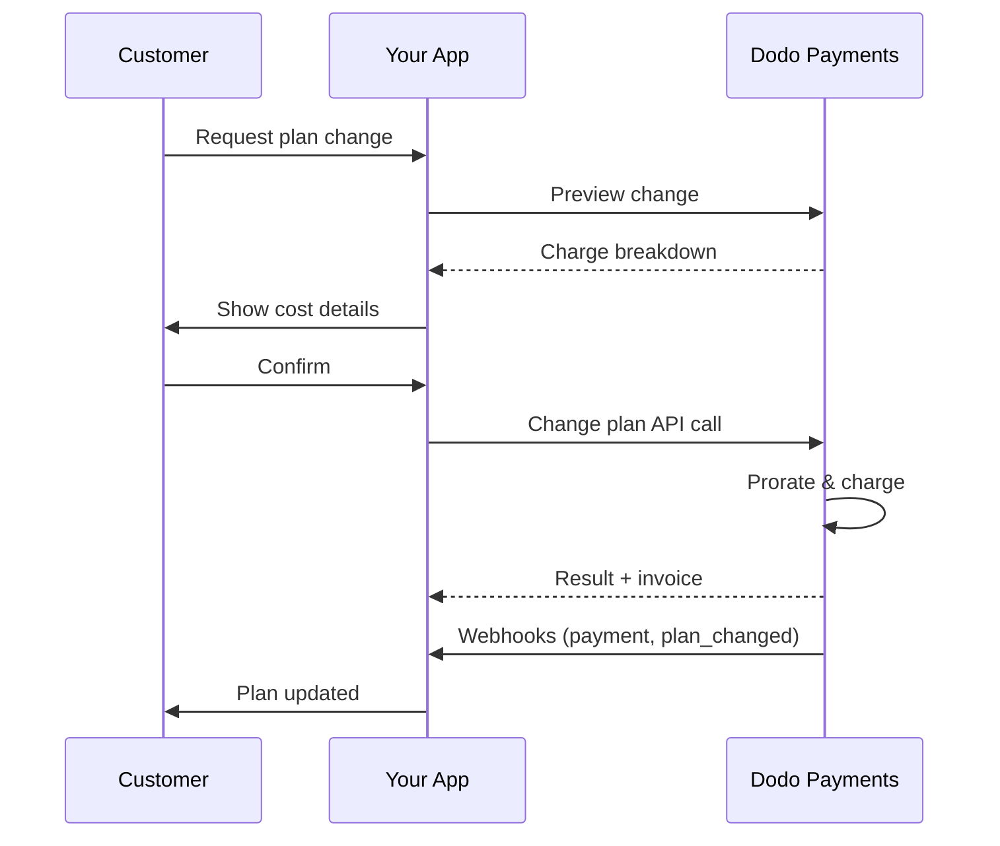
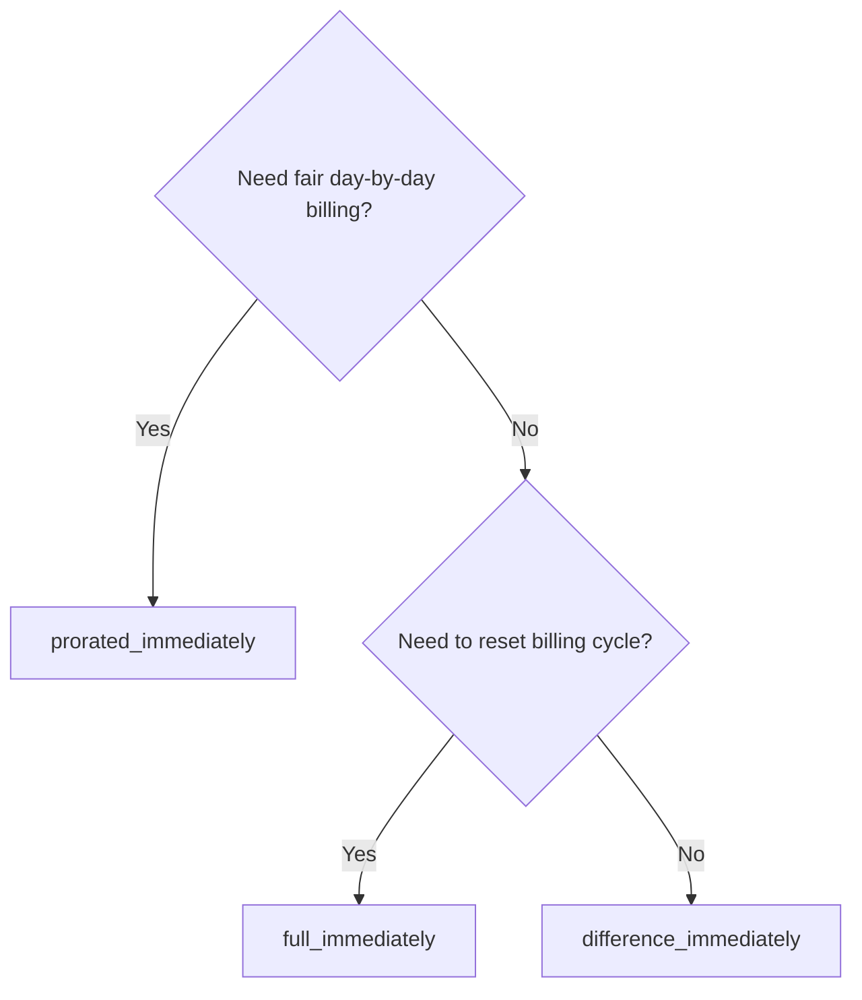
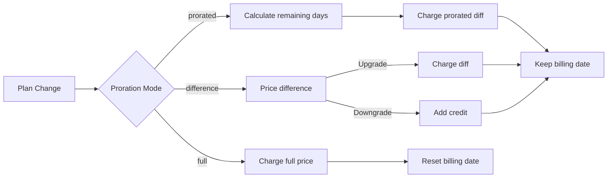

<CardGroup cols={3}>
<Card title="Change Plan API" icon="code" href="/api-reference/subscriptions/change-plan">
  Full API docs for updating subscriptions.
</Card>
<Card title="Plan Change Preview" icon="eye" href="/api-reference/subscriptions/preview-change-plan">
  See charge amounts before changing plans.
</Card>
<Card title="Integration Guide" icon="book" href="/developer-resources/subscription-integration-guide">
  Step-by-step subscription setup.
</Card>
</CardGroup>

## What is a subscription upgrade or downgrade?

Changing plans lets you move a customer between subscription tiers or quantities. Use it to:
- Align pricing with usage or features
- Move from monthly to annual (or vice versa)
- Adjust quantity for seat-based products

<Info>
Plan changes can trigger an immediate charge depending on the proration mode you choose.
</Info>

## When to use plan changes

- Upgrade when a customer needs more features, usage, or seats
- Downgrade when usage decreases
- Migrate users to a new product or price without cancelling their subscription

## Plan Change Flow



## Prerequisites

Before implementing subscription plan changes, ensure you have:

- A Dodo Payments merchant account with active subscription products
- API credentials (API key and webhook secret key) from the dashboard
- An existing active subscription to modify
- Webhook endpoint configured to handle subscription events

<Info>
For detailed setup instructions, see our [Integration Guide](/developer-resources/integration-guide#dashboard-setup).
</Info>

## Step-by-Step Implementation Guide

Follow this comprehensive guide to implement subscription plan changes in your application:

<Steps>
<Step title="Understand Plan Change Requirements">
Before implementing, determine:
- Which subscription products can be changed to which others
- What proration mode fits your business model
- How to handle failed plan changes gracefully
- Which webhook events to track for state management

<Tip>
Test plan changes thoroughly in test mode before implementing in production.
</Tip>
</Step>

<Step title="Choose Your Proration Strategy">
Select the billing approach that aligns with your business needs:

<Tabs>
<Tab title="prorated_immediately">
Best for: SaaS applications wanting to charge fairly for unused time
- Calculates exact prorated amount based on remaining cycle time
- Charges a prorated amount based on unused time remaining in the cycle
- Provides transparent billing to customers
</Tab>

<Tab title="difference_immediately">
Best for: Clear upgrade/downgrade scenarios
- Upgrade: Charge immediate difference (e.g., $30→$80 = charge $50)
- Downgrade: Credit remaining value for future renewals
- Simplifies billing logic and customer communication
</Tab>

<Tab title="full_immediately">
Best for: When you want to reset the billing cycle
- Charges full amount of new plan immediately
- Ignores remaining time from old plan
- Useful for annual to monthly transitions
</Tab>
</Tabs>
</Step>

<Step title="Implement the Change Plan API">
Use the Change Plan API to modify subscription details:

<ParamField path="subscription_id" type="string" required>
The ID of the active subscription to modify.
</ParamField>

<ParamField path="product_id" type="string" required>
The new product ID to change the subscription to.
</ParamField>

<ParamField path="quantity" type="integer" default="1">
Number of units for the new plan (for seat-based products).
</ParamField>

<ParamField path="proration_billing_mode" type="string" required>
How to handle immediate billing: `prorated_immediately`, `full_immediately`, or `difference_immediately`.
</ParamField>

<ParamField path="addons" type="array">
Optional addons for the new plan. Leaving this empty removes any existing addons.
</ParamField>

<ParamField path="on_payment_failure" type="string">
Controls behavior when the plan change payment fails:
- `prevent_change`: Keep subscription on current plan until payment succeeds
- `apply_change` (default): Apply plan change immediately regardless of payment outcome

Se não for especificado, usa a configuração padrão do nível de negócios.
</ParamField>

{/* LOCKED_PATTERN_654ba106ce306d93c6eba72bfc37d363 */}
Código de desconto opcional para aplicar ao novo plano. Se fornecido, valida e aplica o desconto à mudança de plano. Se não for fornecido e a assinatura tiver um desconto existente com `preserve_on_plan_change=true`, o desconto existente será mantido (se aplicável ao novo produto).
</ParamField>
</Step>

<Step title="Handle Webhook Events">
Configure o manuseio de webhooks para acompanhar os resultados da mudança de plano:

- `subscription.active`: Mudança de plano bem-sucedida, assinatura atualizada
- `subscription.plan_changed`: Plano de assinatura alterado (atualização/downgrade/atualização de complemento)
- `subscription.on_hold`: Cobrança de mudança de plano falhou, assinatura pausada
- `payment.succeeded`: Cobrança imediata para mudança de plano bem-sucedida
- `payment.failed`: Cobrança imediata falhou

<Warning>
Sempre verifique as assinaturas de webhook e implemente o processamento idempotente de eventos.
</Warning>
</Step>

<Step title="Update Your Application State">
Baseado em eventos de webhook, atualize seu aplicativo:
- Conceda/revoque funcionalidades com base no novo plano
- Atualize o painel do cliente com detalhes do novo plano
- Envie e-mails de confirmação sobre mudanças de plano
- Registre alterações de cobrança para fins de auditoria
</Step>

<Step title="Test and Monitor">
Teste completamente sua implementação:
- Teste todos os modos de prorrateio com diferentes cenários
- Verifique se o manuseio de webhooks funciona corretamente
- Monitore as taxas de sucesso de mudança de plano
- Configure alertas para mudanças de plano falhadas

<Check>
Sua implementação de mudança de plano de assinatura está agora pronta para uso em produção.
</Check>
</Step>
</Steps>

## Pré-visualizar Mudanças de Plano

Antes de se comprometer com uma mudança de plano, use a API de Pré-visualização para mostrar aos clientes exatamente quanto eles serão cobrados:

<Tabs>
<Tab title="Node.js SDK">

```javascript
const preview = await client.subscriptions.previewChangePlan('sub_123', {
  product_id: 'prod_pro',
  quantity: 1,
  proration_billing_mode: 'prorated_immediately'
});

// Show customer the charge before confirming
console.log('Immediate charge:', preview.immediate_charge.summary);
console.log('New plan details:', preview.new_plan);
```

</Tab>

<Tab title="Python SDK">

```python
preview = client.subscriptions.preview_change_plan(
    subscription_id="sub_123",
    product_id="prod_pro",
    quantity=1,
    proration_billing_mode="prorated_immediately"
)

# Show customer the charge before confirming
print("Immediate charge:", preview.immediate_charge.summary)
print("New plan details:", preview.new_plan)
```

</Tab>
</Tabs>

<Tip>
Use a API de pré-visualização para construir diálogos de confirmação que mostrem aos clientes o valor exato que eles serão cobrados antes de confirmarem uma mudança de plano.
</Tip>

## Mudar Plano API

Use a API de Mudança de Plano para modificar o produto, quantidade e comportamento de prorrateio para uma assinatura ativa.

### Exemplos de início rápido

<Tabs>
  <Tab title="Node.js SDK">

    ```javascript
    import DodoPayments from 'dodopayments';

    const client = new DodoPayments({
      bearerToken: process.env.DODO_PAYMENTS_API_KEY,
      environment: 'test_mode', // defaults to 'live_mode'
    });

    async function changePlan() {
      const result = await client.subscriptions.changePlan('sub_123', {
        product_id: 'prod_new',
        quantity: 3,
        proration_billing_mode: 'prorated_immediately',
        on_payment_failure: 'prevent_change', // Optional: control behavior on payment failure
      });
      console.log(result.status, result.invoice_id, result.payment_id);
    }

    changePlan();
    ```

  </Tab>
  <Tab title="Python SDK">

    ```python
    import os
    from dodopayments import DodoPayments

    client = DodoPayments(
        bearer_token=os.environ.get("DODO_PAYMENTS_API_KEY"),
        environment="test_mode",  # defaults to "live_mode"
    )

    result = client.subscriptions.change_plan(
        subscription_id="sub_123",
        product_id="prod_new",
        quantity=3,
        proration_billing_mode="prorated_immediately",
        on_payment_failure="prevent_change",  # Optional: control behavior on payment failure
    )
    print(result.status, result.get("invoice_id"), result.get("payment_id"))
    ```

  </Tab>
  <Tab title="Go SDK">

    ```go
    package main

    import (
      "context"
      "fmt"
      "github.com/dodopayments/dodopayments-go"
      "github.com/dodopayments/dodopayments-go/option"
    )

    func main() {
      client := dodopayments.NewClient(option.WithBearerToken("YOUR_TOKEN"))
      res, err := client.Subscriptions.ChangePlan(context.TODO(), dodopayments.SubscriptionChangePlanParams{
        SubscriptionID: dodopayments.F("sub_123"),
        ProductID:             dodopayments.F("prod_new"),
        Quantity:              dodopayments.F(int64(3)),
        ProrationBillingMode:  dodopayments.F(dodopayments.SubscriptionChangePlanParamsProrationBillingModeProratedImmediately),
        OnPaymentFailure:      dodopayments.F(dodopayments.OnPaymentFailurePreventChange), // Optional
      })
      if err != nil { panic(err) }
      fmt.Println(res.Status, res.InvoiceID, res.PaymentID)
    }
    ```

  </Tab>
  <Tab title="HTTP">

    ```bash
    curl -X POST "$DODO_API_BASE/subscriptions/sub_123/change-plan" \
      -H "Authorization: Bearer $DODO_PAYMENTS_API_KEY" \
      -H "Content-Type: application/json" \
      -d '{
        "product_id": "prod_new",
        "quantity": 3,
        "proration_billing_mode": "prorated_immediately",
        "on_payment_failure": "prevent_change"
      }'
    ```

  </Tab>
</Tabs>

```json Success
{
  "status": "processing",
  "subscription_id": "sub_123",
  "invoice_id": "inv_789",
  "payment_id": "pay_456",
  "proration_billing_mode": "prorated_immediately"
}
```

<Note>
Campos como <code>invoice_id</code> e <code>payment_id</code> são retornados apenas quando uma cobrança imediata e/ou fatura é criada durante a mudança de plano. Sempre confie em eventos de webhook (por exemplo, <code>payment.succeeded</code>, <code>subscription.plan_changed</code>) para confirmar resultados.
</Note>

<Warning>
Se a cobrança imediata falhar, a assinatura pode mover-se para `subscription.on_hold` até que o pagamento seja bem-sucedido.
</Warning>

## Gerenciando Complementos

Ao mudar planos de assinatura, você também pode modificar complementos:

```javascript
// Add addons to the new plan
await client.subscriptions.changePlan('sub_123', {
  product_id: 'prod_new',
  quantity: 1,
  proration_billing_mode: 'difference_immediately',
  addons: [
    { addon_id: 'addon_123', quantity: 2 }
  ]
});

// Remove all existing addons
await client.subscriptions.changePlan('sub_123', {
  product_id: 'prod_new',
  quantity: 1,
  proration_billing_mode: 'difference_immediately',
  addons: [] // Empty array removes all existing addons
});
```

<Info>
Complementos são incluídos no cálculo de prorrateio e serão cobrados conforme o modo de prorrateio selecionado.
</Info>

## Aplicando Códigos de Desconto

Você pode aplicar um código de desconto ao mudar planos de assinatura. Isso é útil para oferecer preços promocionais em upgrades ou migrações.

<Tabs>
<Tab title="Node.js SDK">

```javascript
// Apply a discount code during plan change
await client.subscriptions.changePlan('sub_123', {
  product_id: 'prod_pro',
  quantity: 1,
  proration_billing_mode: 'prorated_immediately',
  discount_code: 'UPGRADE20'
});
```

</Tab>
<Tab title="Python SDK">

```python
# Apply a discount code during plan change
client.subscriptions.change_plan(
    subscription_id="sub_123",
    product_id="prod_pro",
    quantity=1,
    proration_billing_mode="prorated_immediately",
    discount_code="UPGRADE20"
)
```

</Tab>
<Tab title="HTTP">

```bash
curl -X POST "$DODO_API_BASE/subscriptions/sub_123/change-plan" \
  -H "Authorization: Bearer $DODO_PAYMENTS_API_KEY" \
  -H "Content-Type: application/json" \
  -d '{
    "product_id": "prod_pro",
    "quantity": 1,
    "proration_billing_mode": "prorated_immediately",
    "discount_code": "UPGRADE20"
  }'
```

</Tab>
</Tabs>

### Comportamento do Desconto na Mudança de Plano

| Cenário | Comportamento |
|----------|----------|
| `discount_code` fornecido | Valida e aplica o desconto no novo plano. |
| Nenhum código fornecido, desconto existente com `preserve_on_plan_change=true` | Desconto existente é automaticamente preservado se aplicável ao novo produto. |
| Nenhum código fornecido, nenhum desconto preservável | Nenhum desconto aplicado ao novo plano. |

<Tip>
Use a [Preview Plan Change API](/api-reference/subscriptions/preview-change-plan) com um `discount_code` para mostrar aos clientes exatamente quanto eles vão economizar antes de confirmar a mudança de plano.
</Tip>

## Modos de Prorrateio

Escolha como cobrar o cliente ao mudar planos:

#### `prorated_immediately`
- Cobra pela diferença parcial no ciclo atual
- Se estiver no período de teste, cobra imediatamente e muda para o novo plano agora
- Downgrade: pode gerar um crédito prorrateado aplicado a renovações futuras

#### `full_immediately`
- Cobra o valor total do novo plano imediatamente
- Ignora o tempo restante do plano antigo

<Info>
Créditos criados por downgrades usando <code>difference_immediately</code> são específicos da assinatura e distintos de direitos de <a href="/features/credit-based-billing">Faturamento Baseado em Crédito</a>. Eles são aplicados automaticamente a renovações futuras da mesma assinatura e não são transferíveis entre assinaturas.
</Info>

#### `difference_immediately`
- Upgrade: cobra imediatamente a diferença de preço entre planos antigos e novos
- Downgrade: adiciona o valor restante como crédito interno à assinatura e aplica automaticamente em renovações

| Funcionalidade | `prorated_immediately` | `difference_immediately` | `full_immediately` |
|---------|----------------------|------------------------|-------------------|
| **Cobrança de upgrade** | Diferença prorrateada para dias restantes | Diferença de preço total entre planos | Preço total do novo plano |
| **Crédito de downgrade** | Crédito prorrateado para dias restantes | Diferença de preço total como crédito | Sem crédito |
| **Ciclo de cobrança** | Inalterado | Inalterado | Reinicia hoje |
| **Comportamento do período de teste** | Termina o teste, cobra imediatamente | Termina o teste, cobra imediatamente | Termina o teste, cobra o valor total |
| **Melhor para** | Cobrança justa baseada em tempo | Matemática simples de upgrade/downgrade | Reiniciando ciclos de cobrança |
| **Complexidade** | Média (cálculo de dias) | Baixa (subtração simples) | Baixa (cobrança total) |



### Cenários de Exemplo

Use esses números canônicos de forma consistente:
- Plano atual: **Básico** a **$30/mês**
- Alvo de upgrade: **Pro** a **$80/mês**
- Alvo de downgrade (a partir do Pro): **Iniciante** a **$20/mês**
- Ciclo de cobrança: **30 dias**, iniciado em **1º de janeiro**
- Mudança de plano ocorre em **16 de janeiro** (15 dias restantes, 15 dias utilizados)

<AccordionGroup>
  <Accordion title="Upgrade: Basic ($30) → Pro ($80) with prorated_immediately">

    ```
    Step 1: Calculate unused credit from current plan
      Unused days = 15 out of 30 days
      Credit = $30 × (15/30) = $15.00

    Step 2: Calculate prorated cost of new plan
      Remaining days = 15 out of 30 days
      New plan cost = $80 × (15/30) = $40.00

    Step 3: Calculate immediate charge
      Charge = New plan cost − Credit
      Charge = $40.00 − $15.00 = $25.00

    → Customer pays $25.00 now
    → Next renewal (Feb 1): $80.00/month
    ```

    ```javascript
    await client.subscriptions.changePlan('sub_123', {
      product_id: 'prod_pro',
      quantity: 1,
      proration_billing_mode: 'prorated_immediately'
    })
    ```

  </Accordion>

  <Accordion title="Downgrade: Pro ($80) → Starter ($20) with prorated_immediately">

    ```
    Step 1: Calculate unused credit from current plan
      Unused days = 15 out of 30 days
      Credit = $80 × (15/30) = $40.00

    Step 2: Calculate prorated cost of new plan
      Remaining days = 15 out of 30 days
      New plan cost = $20 × (15/30) = $10.00

    Step 3: Calculate credit balance
      Credit = $40.00 − $10.00 = $30.00

    → No charge — $30.00 credit added to subscription
    → Credit auto-applies to future renewals
    → Next renewal (Feb 1): $20.00 − $30.00 credit = $0.00
    → Following renewal (Mar 1): $20.00 − $10.00 remaining credit = $10.00
    ```

    ```javascript
    await client.subscriptions.changePlan('sub_123', {
      product_id: 'prod_starter',
      quantity: 1,
      proration_billing_mode: 'prorated_immediately'
    })
    ```

  </Accordion>

  <Accordion title="Upgrade: Basic ($30) → Pro ($80) with difference_immediately">

    ```
    Immediate charge = New plan price − Old plan price
                     = $80 − $30
                     = $50.00

    → Customer pays $50.00 now (regardless of cycle position)
    → Next renewal (Feb 1): $80.00/month
    ```

    ```javascript
    await client.subscriptions.changePlan('sub_123', {
      product_id: 'prod_pro',
      quantity: 1,
      proration_billing_mode: 'difference_immediately'
    })
    ```

  </Accordion>

  <Accordion title="Downgrade: Pro ($80) → Starter ($20) with difference_immediately">

    ```
    Credit = Old plan price − New plan price
           = $80 − $20
           = $60.00

    → No charge — $60.00 credit added to subscription
    → Credit auto-applies to future renewals
    → Next renewal: $20.00 − $20.00 (from credit) = $0.00
    → Following renewal: $20.00 − $20.00 (from credit) = $0.00
    → Third renewal: $20.00 − $20.00 (from remaining credit) = $0.00
    ```

    ```javascript
    await client.subscriptions.changePlan('sub_123', {
      product_id: 'prod_starter',
      quantity: 1,
      proration_billing_mode: 'difference_immediately'
    })
    ```

  </Accordion>

  <Accordion title="Upgrade: Basic ($30) → Pro ($80) with full_immediately">

    ```
    Immediate charge = Full new plan price = $80.00

    → Customer pays $80.00 now
    → No credit for unused time on old plan
    → Billing cycle resets to today (January 16)
    → Next renewal: February 16 at $80.00/month
    ```

    ```javascript
    await client.subscriptions.changePlan('sub_123', {
      product_id: 'prod_pro',
      quantity: 1,
      proration_billing_mode: 'full_immediately'
    })
    ```

  </Accordion>

  <Accordion title="Mid-cycle upgrade with add-ons using prorated_immediately">

    ```
    Current: Basic plan ($30/month), no add-ons
    New: Pro plan ($80/month) + Extra Seats add-on ($10/seat × 3 seats = $30/month)
    Change on day 16 of 30 (15 days remaining)

    Step 1: Credit from current plan
      Credit = $30 × (15/30) = $15.00

    Step 2: Prorated cost of new plan + add-ons
      New plan = $80 × (15/30) = $40.00
      Add-ons = $30 × (15/30) = $15.00
      Total new = $55.00

    Step 3: Immediate charge
      Charge = $55.00 − $15.00 = $40.00

    → Customer pays $40.00 now
    → Next renewal: $80.00 + $30.00 = $110.00/month
    ```

    ```javascript
    await client.subscriptions.changePlan('sub_123', {
      product_id: 'prod_pro',
      quantity: 1,
      proration_billing_mode: 'prorated_immediately',
      addons: [
        { addon_id: 'addon_seats', quantity: 3 }
      ]
    })
    ```

  </Accordion>
</AccordionGroup>

### Como cada modo processa a cobrança



<Tip>
Escolha `prorated_immediately` para contabilidade justa; escolha `full_immediately` para reiniciar a cobrança; use `difference_immediately` para upgrades simples e crédito automático em downgrades.
</Tip>

## Lidando com Falhas de Pagamento

Controle o que acontece quando um pagamento de mudança de plano falha usando o parâmetro `on_payment_failure`.

### Modos de Falha de Pagamento

<Tabs>
<Tab title="prevent_change (Recommended for critical upgrades)">
**Comportamento**: Mantenha a assinatura em seu plano atual até que o pagamento seja bem-sucedido.

- Mudança de plano é marcada como "pendente"
- O cliente mantém o acesso ao plano atual
- A assinatura se move para o estado `active` apenas após o pagamento bem-sucedido
- Útil quando você quer garantir o pagamento antes de conceder funcionalidades upgrades

```javascript
await client.subscriptions.changePlan('sub_123', {
  product_id: 'prod_pro',
  quantity: 1,
  proration_billing_mode: 'prorated_immediately',
  on_payment_failure: 'prevent_change'
});
```

</Tab>

<Tab title="apply_change (Default)">
**Comportamento**: Aplique a mudança de plano imediatamente, independentemente do resultado do pagamento.

- Mudança de plano é aplicada mesmo que o pagamento falhe
- O cliente obtém acesso imediato ao novo plano
- Assinatura pode mover-se para `on_hold` se o pagamento falhar
- Bom para upgrades não críticos ou quando confia no cliente

```javascript
await client.subscriptions.changePlan('sub_123', {
  product_id: 'prod_pro',
  quantity: 1,
  proration_billing_mode: 'prorated_immediately',
  on_payment_failure: 'apply_change' // This is the default
});
```

</Tab>
</Tabs>

<Info>
Se não for especificado, o parâmetro `on_payment_failure` usa a configuração padrão do nível de negócios configurada no painel de controle.
</Info>

### Quando Usar Cada Modo

| Cenário | Modo Recomendado | Motivo |
|----------|------------------|--------|
| Atualizando para funcionalidades premium | `prevent_change` | Garanta o pagamento antes de conceder acesso |
| Aumento de quantidade (mais lugares) | `prevent_change` | Evite uso sem pagamento |
| Rebaixando planos | `apply_change` | Cliente está reduzindo gastos |
| Clientes empresariais confiáveis | `apply_change` | Menor risco de não pagamento |
| Conversão de teste para pago | `prevent_change` | Momento crítico de pagamento |

## Lidando com webhooks

Acompanhe o estado da assinatura por meio de webhooks para confirmar mudanças de planos e pagamentos.

### Tipos de eventos para lidar
- `subscription.active`: assinatura ativada
- `subscription.plan_changed`: plano de assinatura alterado (atualização/downgrade/mudanças de complemento)
- `subscription.on_hold`: cobrança falhou, assinatura pausada
- `subscription.renewed`: renovação bem-sucedida
- `payment.succeeded`: pagamento para mudança de plano ou renovação bem-sucedido
- `payment.failed`: pagamento falhou

<Info>
Recomendamos a condução da lógica de negócios a partir de eventos de assinatura e o uso de eventos de pagamento para confirmação e reconciliação.
</Info>

### Verifique assinaturas e lide com intenções

<Tabs>
  <Tab title="Next.js Route Handler">

    ```javascript
    import { NextRequest, NextResponse } from 'next/server';
    
    export async function POST(req) {
      const webhookId = req.headers.get('webhook-id');
      const webhookSignature = req.headers.get('webhook-signature');
      const webhookTimestamp = req.headers.get('webhook-timestamp');
      const secret = process.env.DODO_WEBHOOK_SECRET;
    
      const payload = await req.text();
      // verifySignature is a placeholder – in production, use a Standard Webhooks library
      const { valid, event } = await verifySignature(
        payload,
        { id: webhookId, signature: webhookSignature, timestamp: webhookTimestamp },
        secret
      );
      if (!valid) return NextResponse.json({ error: 'Invalid signature' }, { status: 400 });
    
      switch (event.type) {
        case 'subscription.active':
          // mark subscription active in your DB
          break;
        case 'subscription.plan_changed':
          // refresh entitlements and reflect the new plan in your UI
          break;
        case 'subscription.on_hold':
          // notify user to update payment method
          break;
        case 'subscription.renewed':
          // extend access window
          break;
        case 'payment.succeeded':
          // reconcile payment for plan change
          break;
        case 'payment.failed':
          // log and alert
          break;
        default:
          // ignore unknown events
          break;
      }
    
      return NextResponse.json({ received: true });
    }
    ```

  </Tab>
  <Tab title="Express.js">

    ```javascript
    import express from 'express';
    
    const app = express();
    app.post('/webhooks/dodo', express.raw({ type: 'application/json' }), async (req, res) => {
      const webhookId = req.header('webhook-id');
      const webhookSignature = req.header('webhook-signature');
      const webhookTimestamp = req.header('webhook-timestamp');
      const secret = process.env.DODO_WEBHOOK_SECRET;
      const payload = req.body.toString('utf8');
    
      const { valid, event } = await verifySignature(
        payload,
        { id: webhookId, signature: webhookSignature, timestamp: webhookTimestamp },
        secret
      );
      if (!valid) return res.status(400).send('Invalid signature');
    
      // handle events like above
      res.json({ received: true });
    });
    
    app.listen(3000);
    ```

  </Tab>
</Tabs>

<Note>
Para esquemas de payload detalhados, veja os <a href="/developer-resources/webhooks/intents/subscription">Payloads de Webhook de Assinatura</a> e <a href="/developer-resources/webhooks/intents/payment">Payloads de Webhook de Pagamento</a>.
</Note>

## Melhores Práticas

Siga estas recomendações para mudanças confiáveis de plano de assinatura:

### Estratégia de Mudança de Plano
- **Teste completamente**: Sempre teste mudanças de plano no modo de teste antes da produção
- **Escolha o prorrateio com cuidado**: Selecione o modo de prorrateio que se alinha com seu modelo de negócios
- **Lide com falhas graciosamente**: Implemente tratamento adequado de erros e lógica de tentativa
- **Monitore taxas de sucesso**: Acompanhe as taxas de sucesso/falha de mudança de plano e investigue problemas

### Implementação de Webhook
- **Verifique assinaturas**: Sempre valide assinaturas de webhook para garantir autenticidade
- **Implemente idempotência**: Lide graciosamente com eventos de webhook duplicados
- **Processe de forma assíncrona**: Não bloqueie respostas de webhook com operações pesadas
- **Registre tudo**: Mantenha registros detalhados para depuração e fins de auditoria

### Experiência do Usuário
- **Comunique claramente**: Informe os clientes sobre mudanças de cobrança e tempo
- **Forneça confirmações**: Envie confirmações por e-mail para mudanças de plano bem-sucedidas
- **Lide com casos extremos**: Considere períodos de teste, prorrateio e pagamentos falhados
- **Atualize a interface imediatamente**: Reflita mudanças de plano na interface do seu aplicativo

## Problemas Comuns e Soluções

Resolva problemas típicos encontrados durante mudanças de plano de assinatura:

<AccordionGroup>
<Accordion title="Charge created but subscription not updated">
**Sintomas**: Chamada de API bem-sucedida, mas assinatura permanece no plano antigo

**Causas comuns**:
- Processamento de webhook falhou ou foi atrasado
- Estado do aplicativo não atualizado após o recebimento de webhooks
- Problemas de transação no banco de dados durante atualização de estado

**Soluções**:
- Implemente um manuseio robusto de webhooks com lógica de tentativa
- Use operações idempotentes para atualizações de estado
- Adicione monitoramento para detectar e alertar sobre eventos de webhook perdidos
- Verifique se o endpoint do webhook está acessível e respondendo corretamente
</Accordion>

<Accordion title="Credits not applied after downgrade">
**Sintomas**: Cliente rebaixa, mas não vê saldo de crédito

**Causas comuns**:
- Expectativas do modo de prorrateio: rebaixamentos creditam a diferença total do preço do plano com `difference_immediately`, enquanto `prorated_immediately` cria um crédito prorrateado com base no tempo restante no ciclo
- Créditos são específicos da assinatura e não transferem entre assinaturas
- Saldo de crédito não visível no painel do cliente

**Soluções**:
- Use `difference_immediately` para rebaixamentos quando quiser créditos automáticos
- Explique aos clientes que créditos se aplicam a renovações futuras da mesma assinatura
- Implemente um portal do cliente para mostrar saldos de crédito
- Verifique a pré-visualização da próxima fatura para ver créditos aplicados
</Accordion>

<Accordion title="Webhook signature verification fails">
**Sintomas**: Eventos de webhook rejeitados devido a assinatura inválida

**Causas comuns**:
- Chave secreta do webhook incorreta
- Corpo de solicitação bruta modificado antes da verificação de assinatura
- Algoritmo de verificação de assinatura errado

**Soluções**:
- Verifique se você está usando o `DODO_WEBHOOK_SECRET` correto do painel de controle
- Leia o corpo da solicitação bruta antes de qualquer middleware de análise JSON
- Use a biblioteca padrão de verificação de webhook para sua plataforma
- Teste a verificação de assinatura de webhook no ambiente de desenvolvimento
</Accordion>

<Accordion title="Plan change fails with 422 error">
**Sintomas**: API retorna erro 422 Entidade Não Processável

**Causas comuns**:
- ID da assinatura ou do produto inválido
- Assinatura não está em estado ativo
- Parâmetros obrigatórios ausentes
- Produto não disponível para mudanças de plano

**Soluções**:
- Verifique se a assinatura existe e está ativa
- Verifique se o ID do produto é válido e disponível
- Garanta que todos os parâmetros obrigatórios sejam fornecidos
- Revise a documentação da API para requisitos de parâmetros
</Accordion>

<Accordion title="Immediate charge fails during plan change">
**Sintomas**: Mudança de plano iniciada, mas cobrança imediata falha

**Causas comuns**:
- Fundos insuficientes no método de pagamento do cliente
- Método de pagamento expirado ou inválido
- Banco recusou a transação
- Detecção de fraude bloqueou a cobrança

**Soluções**:
- Lide adequadamente com eventos de webhook `payment.failed`
- Notifique o cliente para atualizar o método de pagamento
- Implemente lógica de tentativa para falhas temporárias
- Considere permitir mudanças de plano com cobranças imediatas falhadas
</Accordion>

<Accordion title="Subscription on hold after plan change">
**Sintomas**: Cobrança de mudança de plano falha e assinatura move-se para estado `on_hold`

**O que acontece**:
Quando uma cobrança de mudança de plano falha, a assinatura é automaticamente colocada no estado `on_hold`. A assinatura não será renovada automaticamente até que o método de pagamento seja atualizado.

**Solução**: Atualize o método de pagamento para reativar a assinatura

Para reativar uma assinatura de estado `on_hold` após uma mudança de plano falhada:

1. **Atualize o método de pagamento** usando a API de Atualização de Método de Pagamento
2. **Criação automática de cobrança**: A API cria automaticamente uma cobrança para débitos remanescentes
3. **Geração de fatura**: Uma fatura é gerada para a cobrança
4. **Processamento de pagamento**: O pagamento é processado usando o novo método de pagamento
5. **Reativação**: Após o pagamento bem-sucedido, a assinatura é reativada para o estado `active`

<CodeGroup>

```javascript Node.js
// Reactivate subscription from on_hold after failed plan change
async function reactivateAfterFailedPlanChange(subscriptionId) {
  // Update payment method - automatically creates charge for remaining dues
  const response = await client.subscriptions.updatePaymentMethod(subscriptionId, {
    type: 'new',
    return_url: 'https://example.com/return'
  });
  
  if (response.payment_id) {
    console.log('Charge created for remaining dues:', response.payment_id);
    console.log('Payment link:', response.payment_link);
    
    // Redirect customer to payment_link to complete payment
    // Monitor webhooks for:
    // 1. payment.succeeded - charge succeeded
    // 2. subscription.active - subscription reactivated
  }
  
  return response;
}

// Or use existing payment method if available
async function reactivateWithExistingPaymentMethod(subscriptionId, paymentMethodId) {
  const response = await client.subscriptions.updatePaymentMethod(subscriptionId, {
    type: 'existing',
    payment_method_id: paymentMethodId
  });
  
  // Monitor webhooks for payment.succeeded and subscription.active
  return response;
}
```

```python Python
# Reactivate subscription from on_hold after failed plan change
def reactivate_after_failed_plan_change(subscription_id):
    # Update payment method - automatically creates charge for remaining dues
    response = client.subscriptions.update_payment_method(
        subscription_id=subscription_id,
        type="new",
        return_url="https://example.com/return"
    )
    
    if response.payment_id:
        print("Charge created for remaining dues:", response.payment_id)
        print("Payment link:", response.payment_link)
        
        # Redirect customer to payment_link to complete payment
        # Monitor webhooks for:
        # 1. payment.succeeded - charge succeeded
        # 2. subscription.active - subscription reactivated
    
    return response

# Or use existing payment method if available
def reactivate_with_existing_payment_method(subscription_id, payment_method_id):
    response = client.subscriptions.update_payment_method(
        subscription_id=subscription_id,
        type="existing",
        payment_method_id=payment_method_id
    )
    
    # Monitor webhooks for payment.succeeded and subscription.active
    return response
```

</CodeGroup>

**Eventos de webhook para monitorar**:
- `subscription.on_hold`: Assinatura colocada em espera (recebido quando a cobrança de mudança de plano falha)
- `payment.succeeded`: Pagamento para débitos remanescentes bem-sucedido (após atualizar o método de pagamento)
- `subscription.active`: Assinatura reativada após pagamento bem-sucedido

**Melhores práticas**:
- Notifique os clientes imediatamente quando uma cobrança de mudança de plano falhar
- Forneça instruções claras sobre como atualizar o método de pagamento deles
- Monitorar eventos de webhook para rastrear o status de reativação
- Considere implementar lógica de repetição automática para falhas temporárias de pagamento

<Card title="Update Payment Method API Reference" icon="code" href="/api-reference/subscriptions/update-payment-method">
Veja a documentação completa da API para atualizar métodos de pagamento e reativar assinaturas.
</Card>
</Accordion>
</AccordionGroup>

## Testando Sua Implementação

Siga estas etapas para testar completamente sua implementação de mudança de plano de assinatura:

<Steps>
<Step title="Set up test environment">
- Use chaves de API de teste e produtos de teste
- Crie assinaturas de teste com diferentes tipos de plano
- Configure o endpoint de webhook de teste
- Configure monitoramento e registro
</Step>

<Step title="Test different proration modes">
- Teste `prorated_immediately` com várias posições de ciclo de cobrança
- Teste `difference_immediately` para upgrades e downgrades
- Teste `full_immediately` para reiniciar ciclos de cobrança
- Verifique se os cálculos de crédito estão corretos
</Step>

<Step title="Test webhook handling">
- Verifique se todos os eventos de webhook relevantes são recebidos
- Teste a verificação de assinatura de webhook
- Lide graciosamente com eventos de webhook duplicados
- Teste cenários de falha de processamento de webhook
</Step>

<Step title="Test error scenarios">
- Teste com IDs de assinatura inválidos
- Teste com métodos de pagamento expirados
- Teste falhas de rede e timeouts
- Teste com fundos insuficientes
</Step>

<Step title="Monitor in production">
- Configure alertas para mudanças de plano falhadas
- Monitore os tempos de processamento de webhook
- Acompanhe as taxas de sucesso das mudanças de plano
- Revise os tickets de suporte ao cliente para problemas de mudança de plano
</Step>
</Steps>

## Tratamento de Erro

Lide com erros comuns da API de forma graciosa em sua implementação:

### Códigos de Status HTTP

<AccordionGroup>
<Accordion title="200 OK">
Solicitação de mudança de plano processada com sucesso. A assinatura está sendo atualizada e o processamento do pagamento foi iniciado.
</Accordion>

<Accordion title="400 Bad Request">
Parâmetros de solicitação inválidos. Verifique se todos os campos obrigatórios são fornecidos e devidamente formatados.
</Accordion>

<Accordion title="401 Unauthorized">
Chave de API inválida ou ausente. Verifique se seu `DODO_PAYMENTS_API_KEY` está correto e possui permissões adequadas.
</Accordion>

<Accordion title="404 Not Found">
ID de assinatura não encontrado ou não pertence à sua conta.
</Accordion>

<Accordion title="422 Unprocessable Entity">
A assinatura não pode ser alterada (por exemplo, já cancelada, produto não disponível, etc.).
</Accordion>

<Accordion title="500 Internal Server Error">
Ocorreu um erro no servidor. Tente novamente após um breve intervalo.
</Accordion>
</AccordionGroup>

### Formato de Resposta de Erro

```json
{
  "error": {
    "code": "subscription_not_found",
    "message": "The subscription with ID 'sub_123' was not found",
    "details": {
      "subscription_id": "sub_123"
    }
  }
}
```

## Próximos Passos

- Revise a <a href="/api-reference/subscriptions/change-plan">API de Mudança de Plano</a>
- Explore <a href="/features/credit-based-billing">Faturamento Baseado em Crédito</a>
- Implemente alertas para `subscription.on_hold`
- Confira nosso <a href="/developer-resources/webhooks">Guia de Integração de Webhooks</a>
