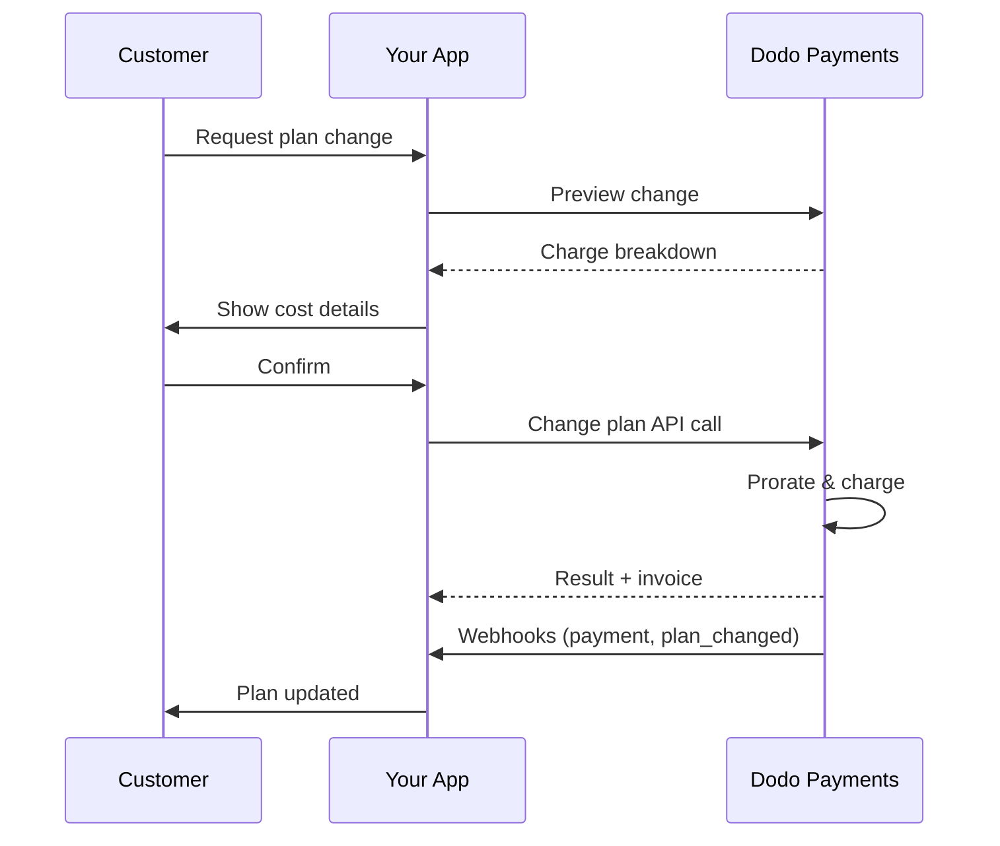
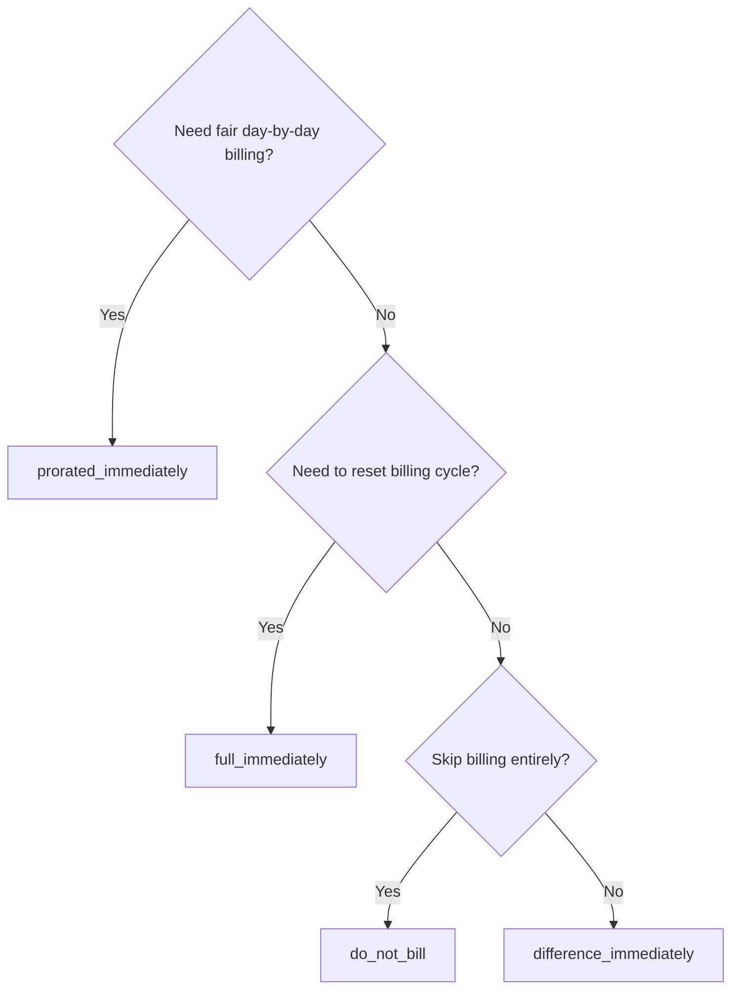
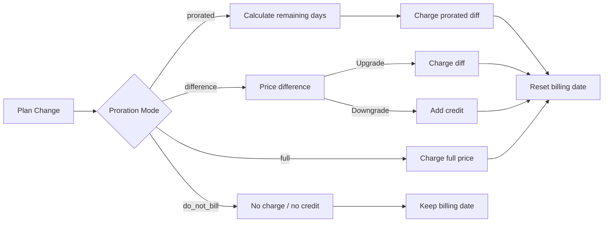

<CardGroup cols={3}>
<Card title="Change Plan API" icon="code" href="/api-reference/subscriptions/change-plan">
  Full API docs for updating subscriptions.
</Card>
<Card title="Plan Change Preview" icon="eye" href="/api-reference/subscriptions/preview-change-plan">
  See charge amounts before changing plans.
</Card>
<Card title="Integration Guide" icon="book" href="/developer-resources/subscription-integration-guide">
  Step-by-step subscription setup.
</Card>
</CardGroup>

## What is a subscription upgrade or downgrade?

Changing plans lets you move a customer between subscription tiers or quantities. Use it to:
- Align pricing with usage or features
- Move from monthly to annual (or vice versa)
- Adjust quantity for seat-based products

<Info>
Plan changes can trigger an immediate charge depending on the proration mode you choose.
</Info>

## When to use plan changes

- Upgrade when a customer needs more features, usage, or seats
- Downgrade when usage decreases
- Migrate users to a new product or price without cancelling their subscription

## Plan Change Flow



## Prerequisites

Before implementing subscription plan changes, ensure you have:

- A Dodo Payments merchant account with active subscription products
- API credentials (API key and webhook secret key) from the dashboard
- An existing active subscription to modify
- Webhook endpoint configured to handle subscription events

<Info>
For detailed setup instructions, see our [Integration Guide](/developer-resources/integration-guide#dashboard-setup).
</Info>

## Step-by-Step Implementation Guide

Follow this comprehensive guide to implement subscription plan changes in your application:

<Steps>
<Step title="Understand Plan Change Requirements">
Before implementing, determine:
- Which subscription products can be changed to which others
- What proration mode fits your business model
- How to handle failed plan changes gracefully
- Which webhook events to track for state management

<Tip>
Test plan changes thoroughly in test mode before implementing in production.
</Tip>
</Step>

<Step title="Choose Your Proration Strategy">
Select the billing approach that aligns with your business needs:

<Tabs>
<Tab title="prorated_immediately">
Best for: SaaS applications wanting to charge fairly for unused time
- Calculates exact prorated amount based on remaining cycle time
- Charges a prorated amount based on unused time remaining in the cycle
- Provides transparent billing to customers
</Tab>

<Tab title="difference_immediately">
Best for: Clear upgrade/downgrade scenarios
- Upgrade: Charge immediate difference (e.g., $30→$80 = charge $50)
- Downgrade: Credit remaining value for future renewals
- Simplifies billing logic and customer communication
</Tab>

<Tab title="full_immediately">
Best for: When you want to reset the billing cycle
- Charges full amount of new plan immediately
- Ignores remaining time from old plan
- Useful for annual to monthly transitions
</Tab>

<Tab title="do_not_bill">
Best for: Free migrations, courtesy switches, or absorbing cost differences
- No charges or credits calculated
- Customer moves to the new plan immediately without any billing adjustment
- Billing cycle remains unchanged
</Tab>
</Tabs>
</Step>

<Step title="Implement the Change Plan API">
Use the Change Plan API to modify subscription details:

<ParamField path="subscription_id" type="string" required>
The ID of the active subscription to modify.
</ParamField>

<ParamField path="product_id" type="string" required>
The new product ID to change the subscription to.
</ParamField>

<ParamField path="quantity" type="integer" required>
Number of units for the new plan (for seat-based products).
</ParamField>

<ParamField path="proration_billing_mode" type="string" required>
How to handle immediate billing: `prorated_immediately`, `full_immediately`, `difference_immediately`, or `do_not_bill`.
</ParamField>

<ParamField path="addons" type="array">
Optional addons for the new plan. Leaving this empty removes any existing addons.
</ParamField>

<ParamField path="on_payment_failure" type="string">
Controls behavior when the plan change payment fails:
- `prevent_change`: Keep subscription on current plan until payment succeeds
- `apply_change` (default): Apply plan change immediately regardless of payment outcome

If not specified, uses the business-level default setting.
</ParamField>

<ParamField path="collect_via_payment_link" type="boolean">
Cole o valor da alteração do plano com um link de pagamento em vez de cobrar o método de pagamento salvo da assinatura. O cliente paga em uma página de checkout hospedada.

Requer a capacidade `allow_plan_change_via_payment_link` da empresa (**Settings → Subscriptions → Collect Plan Change Payments by Payment Link**), `effective_at: immediately` e `on_payment_failure: prevent_change`. Consulte [Coletando pagamento por meio de um link de checkout](#collecting-payment-via-a-checkout-link).

Ignorado pela rota de preview.
</ParamField>

<ParamField path="discount_codes" type="array">
Códigos de desconto **empilhados** opcionais para aplicar ao novo plano (máx. 20, aplicados na ordem do array). O comportamento depende do que você enviar:

- **Não informado / `null`** — os descontos existentes com `preserve_on_plan_change=true` são preservados quando aplicáveis ao novo produto.
- **`[]` (array vazio)** — remove todos os descontos existentes da assinatura.
- **`["CODE_A", "CODE_B", ...]`** — substitui todos os descontos existentes por este conjunto empilhado.
</ParamField>

<ParamField path="discount_code" type="string" deprecated>
**Obsoleto** — prefira `discount_codes` para novas integrações. Este campo ainda funciona para compatibilidade retroativa, mas não pode ser combinado com `discount_codes` na mesma solicitação.
</ParamField>

<ParamField path="effective_at" type="string" default="immediately">
Quando aplicar a alteração do plano:
- `immediately` (padrão): aplica a alteração do plano imediatamente
- `next_billing_date`: agenda a alteração para a próxima data de cobrança. O cliente mantém o plano atual até o fim do período de cobrança.

Use `next_billing_date` para downgrades, para que os clientes mantenham os benefícios do plano atual até o fim do período de cobrança.
</ParamField>
</Step>

<Step title="Handle Webhook Events">
Configure o tratamento de webhooks para acompanhar os resultados das alterações de plano:

- `subscription.active`: alteração do plano concluída, assinatura atualizada
- `subscription.plan_changed`: plano da assinatura alterado (upgrade/downgrade/atualização de addon)
- `subscription.on_hold`: cobrança da alteração do plano falhou, renovações interrompidas
- `payment.succeeded`: cobrança imediata da alteração do plano concluída
- `payment.failed`: cobrança imediata falhou

<Warning>
Sempre verifique as assinaturas dos webhooks e implemente o processamento idempotente de eventos.
</Warning>
</Step>

<Step title="Update Your Application State">
Com base nos eventos de webhook, atualize sua aplicação:
- Conceda ou revogue recursos com base no novo plano
- Atualize o dashboard do cliente com os detalhes do novo plano
- Envie emails de confirmação sobre as alterações do plano
- Registre as alterações de cobrança para fins de auditoria
</Step>

<Step title="Test and Monitor">
Teste sua implementação detalhadamente:
- Teste todos os modos de proration em diferentes cenários
- Verifique se o tratamento de webhooks funciona corretamente
- Monitore as taxas de sucesso das alterações de plano
- Configure alertas para alterações de plano malsucedidas

<Check>
Sua implementação de alteração de plano de assinatura está pronta para uso em produção.
</Check>
</Step>
</Steps>

## Visualizar alterações de plano

Antes de confirmar uma alteração de plano, use a Preview API para mostrar aos clientes exatamente quanto será cobrado:

<Tabs>
<Tab title="Node.js SDK">

```javascript
const preview = await client.subscriptions.previewChangePlan('sub_123', {
  product_id: 'pdt_pro',
  quantity: 1,
  proration_billing_mode: 'prorated_immediately'
});

// Show customer the charge before confirming
console.log('Immediate charge:', preview.immediate_charge.summary);
console.log('New plan details:', preview.new_plan);
```

</Tab>

<Tab title="Python SDK">

```python
preview = client.subscriptions.preview_change_plan(
    subscription_id="sub_123",
    product_id="pdt_pro",
    quantity=1,
    proration_billing_mode="prorated_immediately"
)

# Show customer the charge before confirming
print("Immediate charge:", preview.immediate_charge.summary)
print("New plan details:", preview.new_plan)
```

</Tab>
</Tabs>

<Tip>
Use a Preview API para criar diálogos de confirmação que mostrem aos clientes o valor exato que será cobrado antes de confirmarem uma alteração de plano.
</Tip>

## Change Plan API

Use a Change Plan API para modificar o produto, a quantidade e o comportamento de proration de uma assinatura ativa.

### Exemplos de início rápido

<Tabs>
  <Tab title="Node.js SDK">

    ```javascript
    import DodoPayments from 'dodopayments';

    const client = new DodoPayments({
      bearerToken: process.env.DODO_PAYMENTS_API_KEY,
      environment: 'test_mode', // defaults to 'live_mode'
    });

    async function changePlan() {
      // change-plan returns 200 with an empty body.
      await client.subscriptions.changePlan('sub_123', {
        product_id: 'pdt_new',
        quantity: 3,
        proration_billing_mode: 'prorated_immediately',
        on_payment_failure: 'prevent_change', // Optional: control behavior on payment failure
      });
      console.log('Plan change accepted; awaiting webhooks');
    }

    changePlan();
    ```

  </Tab>
  <Tab title="Python SDK">

    ```python
    import os
    from dodopayments import DodoPayments

    client = DodoPayments(
        bearer_token=os.environ.get("DODO_PAYMENTS_API_KEY"),
        environment="test_mode",  # defaults to "live_mode"
    )

    # change_plan returns 200 with an empty body.
    client.subscriptions.change_plan(
        subscription_id="sub_123",
        product_id="pdt_new",
        quantity=3,
        proration_billing_mode="prorated_immediately",
        on_payment_failure="prevent_change",  # Optional: control behavior on payment failure
    )
    print("Plan change accepted; awaiting webhooks")
    ```

  </Tab>
  <Tab title="Go SDK">

    ```go
    package main

    import (
      "context"
      "fmt"
      "github.com/dodopayments/dodopayments-go"
      "github.com/dodopayments/dodopayments-go/option"
    )

    func main() {
      client := dodopayments.NewClient(option.WithBearerToken("YOUR_TOKEN"))
      // ChangePlan returns no response body; a nil error means the change succeeded.
      err := client.Subscriptions.ChangePlan(context.TODO(), "sub_123", dodopayments.SubscriptionChangePlanParams{
        UpdateSubscriptionPlanReq: dodopayments.UpdateSubscriptionPlanReqParam{
          ProductID:            dodopayments.F("pdt_new"),
          Quantity:             dodopayments.F(int64(3)),
          ProrationBillingMode: dodopayments.F(dodopayments.UpdateSubscriptionPlanReqProrationBillingModeProratedImmediately),
          OnPaymentFailure:     dodopayments.F(dodopayments.UpdateSubscriptionPlanReqOnPaymentFailurePreventChange), // Optional
        },
      })
      if err != nil { panic(err) }
      fmt.Println("Plan change applied")
    }
    ```

  </Tab>
  <Tab title="HTTP">

    ```bash
    curl -X POST "$DODO_API_BASE/subscriptions/sub_123/change-plan" \
      -H "Authorization: Bearer $DODO_PAYMENTS_API_KEY" \
      -H "Content-Type: application/json" \
      -d '{
        "product_id": "pdt_new",
        "quantity": 3,
        "proration_billing_mode": "prorated_immediately",
        "on_payment_failure": "prevent_change"
      }'
    ```

  </Tab>
</Tabs>

Uma alteração de plano bem-sucedida retorna `200 OK` imediatamente — antes que qualquer cobrança seja efetivamente liquidada. O conteúdo do corpo (`ChangePlanResponse`) depende de como a alteração foi coletada:

| Caso | `payment_id` / `payment_link` / `client_secret` / `expires_on` |
|------|------------------------------------------------------------|
| Alteração agendada (`effective_at: next_billing_date`) | Tudo `null` — nada é cobrado ainda |
| `proration_billing_mode: do_not_bill` | Tudo `null` — nada a cobrar |
| Cobrança imediata comum (método de pagamento salvo) | Tudo `null` |
| `collect_via_payment_link: true` (link emitido) | Tudo **preenchido** — identificadores de checkout para o cliente |

<Note>
Em todos os casos, esta resposta não é um resultado de pagamento — indica apenas que a própria solicitação foi aceita. Ela não informa se uma cobrança imediata foi realmente concluída.

Para uma **cobrança imediata comum**, o resultado é resolvido fora da sessão, logo após a chamada.

Para uma **solicitação `collect_via_payment_link`**, o resultado é resolvido posteriormente e de forma assíncrona — a resposta fornece apenas um link de checkout, a assinatura permanece no plano atual e nada se sabe sobre o resultado até que o cliente conclua o pagamento nesse link.

De qualquer forma, não deduza o resultado a partir desta resposta. Confirme-o por meio de um webhook (<code>payment.succeeded</code>, <code>payment.failed</code>, <code>subscription.plan_changed</code>) ou lendo novamente a assinatura com <code>GET /subscriptions/&#123;subscription_id&#125;</code> — consulte [O que acontece enquanto o link não é pago](#what-happens-while-the-link-is-unpaid) especificamente para o caso de link de pagamento.
</Note>

<Warning>
Se a cobrança imediata falhar, a assinatura poderá passar para `subscription.on_hold` até que o pagamento seja concluído.
</Warning>

## Coletando pagamento por meio de um link de checkout

Por padrão, uma alteração imediata de plano cobra diretamente o método de pagamento salvo da assinatura. Defina `collect_via_payment_link: true` para enviar o cliente a uma página de checkout hospedada — útil quando não há um método de pagamento salvo que você possa cobrar fora da sessão ou quando você quer que o cliente confirme ativamente o novo preço.

<Info>
Isso também habilita o toggle **Collect Plan Change Payments by Payment Link** em **Settings → Subscriptions**, que direciona o fluxo de alteração de plano do [Customer Portal](/features/customer-portal#collecting-plan-change-payments-by-payment-link) integrado para o checkout, em vez do cartão salvo.
</Info>

### Requisitos

`collect_via_payment_link: true` só funciona quando **todos** os requisitos a seguir são atendidos — caso contrário, a solicitação falha com `422`:

- A empresa tem a capacidade `allow_plan_change_via_payment_link` habilitada (**Settings → Subscriptions → Collect Plan Change Payments by Payment Link**).
- `effective_at` é `immediately` (o padrão). Uma alteração agendada (`next_billing_date`) nunca precisa de uma página de checkout, pois nada é cobrado até que seja aplicada.
- O `on_payment_failure` **efetivo** é resolvido como `prevent_change`. Você não precisa enviá-lo explicitamente — se o padrão no nível da empresa (consulte **Padrões da empresa e de cobrança** abaixo) já for `prevent_change`, omitir o campo também atende a esse requisito. Um `apply_change` explícito ou um padrão resolvido como `apply_change` falha com `422`.

<Info>
`collect_via_payment_link` não se limita a upgrades — ele se aplica a qualquer alteração imediata que resulte em uma cobrança, incluindo downgrades, desde que os requisitos acima sejam atendidos.
</Info>

Se a alteração resultar em **zero ou um crédito** — `proration_billing_mode: do_not_bill` ou outro modo que ocasionalmente resulte em zero neste ciclo — não há nada a colocar em uma página de checkout. Nenhum link de pagamento é emitido, `payment_link` e similares retornam `null`, e a alteração é aplicada imediatamente, da mesma forma que seria sem `collect_via_payment_link`. Isso não é um `422`; o sinalizador só tem efeito quando há um valor positivo a cobrar. Se você definir `collect_via_payment_link` genericamente nas alterações de plano, em vez de usá-lo apenas em upgrades claros, chame [Preview Plan Change](/api-reference/subscriptions/preview-change-plan) primeiro e solicite um link somente quando o valor exibido na preview justificar a cobrança.

<Tabs>
<Tab title="Node.js SDK">

```javascript
const response = await client.subscriptions.changePlan('sub_123', {
  product_id: 'pdt_pro',
  quantity: 1,
  proration_billing_mode: 'prorated_immediately',
  effective_at: 'immediately',
  on_payment_failure: 'prevent_change',
  collect_via_payment_link: true,
});

// Hand response.payment_link to your frontend and send the customer there
console.log(response.payment_link);
```

</Tab>
<Tab title="Python SDK">

```python
response = client.subscriptions.change_plan(
    subscription_id="sub_123",
    product_id="pdt_pro",
    quantity=1,
    proration_billing_mode="prorated_immediately",
    effective_at="immediately",
    on_payment_failure="prevent_change",
    collect_via_payment_link=True,
)

# Hand response.payment_link to your frontend and send the customer there
print(response.payment_link)
```

</Tab>
<Tab title="HTTP">

```bash
curl -X POST "$DODO_API_BASE/subscriptions/sub_123/change-plan" \
  -H "Authorization: Bearer $DODO_PAYMENTS_API_KEY" \
  -H "Content-Type: application/json" \
  -d '{
    "product_id": "pdt_pro",
    "quantity": 1,
    "proration_billing_mode": "prorated_immediately",
    "effective_at": "immediately",
    "on_payment_failure": "prevent_change",
    "collect_via_payment_link": true
  }'
```

</Tab>
</Tabs>

Uma solicitação bem-sucedida retorna os identificadores de checkout:

```json
{
  "payment_id": "<payment_id>",
  "payment_link": "https://checkout.dodopayments.com/...",
  "client_secret": "<client_secret>",
  "expires_on": "<expires_on>"
}
```

### O que acontece enquanto o link não é pago

- A assinatura permanece no plano **atual** — `product_id`, `recurring_pre_tax_amount` e `next_billing_date` permanecem inalterados até que o link seja pago.
- Uma nova solicitação `change-plan` para a mesma assinatura é rejeitada com `409 PendingPlanChangeExists` enquanto o link estiver pendente. Cancele uma alteração *agendada* com `DELETE /subscriptions/{subscription_id}/change-plan/scheduled` se necessário, mas esse endpoint não cancela uma alteração pendente por link de pagamento — apenas um pagamento bem-sucedido ou a expiração faz isso.
- O cliente pode tentar novamente com um cartão na **mesma** sessão de checkout após uma recusa; uma nova chamada `change-plan` não é o caminho para tentar novamente.
- Se o link nunca for pago, ele deixará de funcionar após `expires_on` — a assinatura será automaticamente liberada para aceitar uma nova solicitação de alteração de plano pouco depois.
- Se já existia uma alteração *agendada* (`next_billing_date`) e você a substituir por `cancel_scheduled_change_plan: true`, o agendamento original permanece enquanto o link não for pago e só é cancelado quando o link é pago — na mesma transação que aplica o novo plano.

<Warning>
Depois que uma alteração imediata por link de pagamento é emitida, todas as solicitações posteriores de alteração de plano nessa assinatura — incluindo a preview sem efeitos colaterais — são bloqueadas até que o link seja resolvido. Não emita um link que você não pretenda que o cliente pague imediatamente.
</Warning>

## Gerenciando addons

Ao alterar os planos de assinatura, você também pode modificar addons:

```javascript
// Add addons to the new plan
await client.subscriptions.changePlan('sub_123', {
  product_id: 'pdt_new',
  quantity: 1,
  proration_billing_mode: 'difference_immediately',
  addons: [
    { addon_id: 'addon_123', quantity: 2 }
  ]
});

// Remove all existing addons
await client.subscriptions.changePlan('sub_123', {
  product_id: 'pdt_new',
  quantity: 1,
  proration_billing_mode: 'difference_immediately',
  addons: [] // Empty array removes all existing addons
});
```

<Info>
Os addons são incluídos no cálculo de proration e serão cobrados de acordo com o modo de proration selecionado.
</Info>

## Aplicando códigos de desconto

Você pode aplicar um ou mais **códigos de desconto empilhados** ao alterar os planos de assinatura (máx. 20, aplicados na ordem do array). Isso é útil para oferecer preços promocionais em upgrades ou migrações.

<Tabs>
<Tab title="Node.js SDK">

```javascript
// Apply stacked discount codes during plan change
await client.subscriptions.changePlan('sub_123', {
  product_id: 'pdt_pro',
  quantity: 1,
  proration_billing_mode: 'prorated_immediately',
  discount_codes: ['UPGRADE20']
});
```

</Tab>
<Tab title="Python SDK">

```python
# Apply stacked discount codes during plan change
client.subscriptions.change_plan(
    subscription_id="sub_123",
    product_id="pdt_pro",
    quantity=1,
    proration_billing_mode="prorated_immediately",
    discount_codes=["UPGRADE20"]
)
```

</Tab>
<Tab title="HTTP">

```bash
curl -X POST "$DODO_API_BASE/subscriptions/sub_123/change-plan" \
  -H "Authorization: Bearer $DODO_PAYMENTS_API_KEY" \
  -H "Content-Type: application/json" \
  -d '{
    "product_id": "pdt_pro",
    "quantity": 1,
    "proration_billing_mode": "prorated_immediately",
    "discount_codes": ["UPGRADE20"]
  }'
```

</Tab>
</Tabs>

### Comportamento dos descontos na alteração de plano

| Valor de `discount_codes` | Comportamento |
|------------------------|----------|
| Não informado / `null` | Os descontos existentes com `preserve_on_plan_change=true` são preservados automaticamente quando aplicáveis ao novo produto. |
| `[]` (array vazio) | **Todos** os descontos existentes são removidos da assinatura. |
| `["CODE_A", "CODE_B", ...]` | Substitui todos os descontos existentes por este conjunto empilhado, validado e aplicado na ordem do array. |

<Info>
O campo singular `discount_code` neste endpoint está **obsoleto**, mas ainda funciona para compatibilidade retroativa — as integrações existentes não precisam ser alteradas imediatamente. Ele não pode ser combinado com `discount_codes` na mesma solicitação. Migre para o formato de array quando for conveniente.
</Info>

<Tip>
Use a [Preview Plan Change API](/api-reference/subscriptions/preview-change-plan) com `discount_codes` para mostrar aos clientes exatamente quanto eles economizarão antes de confirmar a alteração do plano.
</Tip>

## Modos de proration

Escolha como cobrar o cliente ao alterar os planos:

#### `prorated_immediately`
- Cobra a diferença proporcional referente ao ciclo atual
- Se estiver em trial, cobra imediatamente e muda para o novo plano agora
- Downgrade: pode gerar um crédito proporcional aplicado a renovações futuras

#### `full_immediately`
- Cobra imediatamente o valor total do novo plano
- Ignora o tempo restante do plano antigo

<Info>
Os créditos criados por downgrades usando <code>difference_immediately</code> são específicos da assinatura e distintos dos benefícios de <a href="/features/credit-based-billing">Credit-Based Billing</a>. Eles são aplicados automaticamente a renovações futuras da mesma assinatura e não podem ser transferidos entre assinaturas.
</Info>

#### `difference_immediately`
- Upgrade: cobra imediatamente a diferença de preço entre os planos antigo e novo
- Downgrade: adiciona o valor restante como crédito interno à assinatura e aplica automaticamente nas renovações

#### `do_not_bill`
- Nenhuma cobrança ou crédito é calculado
- O cliente muda imediatamente para o novo plano sem qualquer ajuste de cobrança
- O ciclo de cobrança permanece inalterado
- Ideal para migrações de cortesia, mudanças para planos gratuitos ou absorção de diferenças de custo

| Recurso | `prorated_immediately` | `difference_immediately` | `full_immediately` | `do_not_bill` |
|---------|----------------------|------------------------|-------------------|--------------|
| **Cobrança de upgrade** | Diferença proporcional aos dias restantes | Diferença de preço total entre os planos | Preço total do novo plano | Sem cobrança |
| **Crédito de downgrade** | Crédito proporcional aos dias restantes | Diferença de preço total como crédito | Sem crédito | Sem crédito |
| **Ciclo de cobrança** | Reinicia hoje | Reinicia hoje | Reinicia hoje | Inalterado |
| **Comportamento no trial** | Encerra o trial e cobra imediatamente | Encerra o trial e cobra imediatamente | Encerra o trial e cobra o valor total | Encerra o trial sem cobrança |
| **Ideal para** | Cobrança justa baseada no tempo | Cálculo simples de upgrade/downgrade | Reinicialização de ciclos de cobrança | Migrações gratuitas ou mudanças de cortesia |
| **Complexidade** | Média (cálculo de dias) | Baixa (subtração simples) | Baixa (cobrança total) | Nenhuma |



### Cenários de exemplo

Use estes números canônicos de forma consistente:
- Plano atual: **Basic** a **$30/mês**
- Destino do upgrade: **Pro** a **$80/mês**
- Destino do downgrade (do Pro): **Starter** a **$20/mês**
- Ciclo de cobrança: **30 dias**, iniciado em **1º de janeiro**
- A alteração do plano ocorre em **16 de janeiro** (15 dias restantes, 15 dias usados)

<AccordionGroup>
  <Accordion title="Upgrade: Basic ($30) → Pro ($80) with prorated_immediately">

    ```
    Step 1: Calculate unused credit from current plan
      Unused days = 15 out of 30 days
      Credit = $30 × (15/30) = $15.00

    Step 2: Calculate prorated cost of new plan
      Remaining days = 15 out of 30 days
      New plan cost = $80 × (15/30) = $40.00

    Step 3: Calculate immediate charge
      Charge = New plan cost − Credit
      Charge = $40.00 − $15.00 = $25.00

    → Customer pays $25.00 now
    → Billing cycle resets to today (January 16)
    → Next renewal (Feb 15): $80.00/month
    ```

    ```javascript
    await client.subscriptions.changePlan('sub_123', {
      product_id: 'pdt_pro',
      quantity: 1,
      proration_billing_mode: 'prorated_immediately'
    })
    ```

  </Accordion>

  <Accordion title="Downgrade: Pro ($80) → Starter ($20) with prorated_immediately">

    ```
    Step 1: Calculate unused credit from current plan
      Unused days = 15 out of 30 days
      Credit = $80 × (15/30) = $40.00

    Step 2: Calculate prorated cost of new plan
      Remaining days = 15 out of 30 days
      New plan cost = $20 × (15/30) = $10.00

    Step 3: Calculate credit balance
      Credit = $40.00 − $10.00 = $30.00

    → No charge — $30.00 credit added to subscription
    → Billing cycle resets to today (January 16)
    → Credit auto-applies to future renewals
    → Next renewal (Feb 15): $20.00 − $20.00 (from credit) = $0.00 ($10.00 credit remaining)
    → Following renewal (Mar 15): $20.00 − $10.00 remaining credit = $10.00
    ```

    ```javascript
    await client.subscriptions.changePlan('sub_123', {
      product_id: 'pdt_starter',
      quantity: 1,
      proration_billing_mode: 'prorated_immediately'
    })
    ```

  </Accordion>

  <Accordion title="Upgrade: Basic ($30) → Pro ($80) with difference_immediately">

    ```
    Immediate charge = New plan price − Old plan price
                     = $80 − $30
                     = $50.00

    → Customer pays $50.00 now (regardless of cycle position)
    → Billing cycle resets to today (January 16)
    → Next renewal (Feb 15): $80.00/month
    ```

    ```javascript
    await client.subscriptions.changePlan('sub_123', {
      product_id: 'pdt_pro',
      quantity: 1,
      proration_billing_mode: 'difference_immediately'
    })
    ```

  </Accordion>

  <Accordion title="Downgrade: Pro ($80) → Starter ($20) with difference_immediately">

    ```
    Credit = Old plan price − New plan price
           = $80 − $20
           = $60.00

    → No charge — $60.00 credit added to subscription
    → Credit auto-applies to future renewals
    → Next renewal: $20.00 − $20.00 (from credit) = $0.00
    → Following renewal: $20.00 − $20.00 (from credit) = $0.00
    → Third renewal: $20.00 − $20.00 (from remaining credit) = $0.00
    ```

    ```javascript
    await client.subscriptions.changePlan('sub_123', {
      product_id: 'pdt_starter',
      quantity: 1,
      proration_billing_mode: 'difference_immediately'
    })
    ```

  </Accordion>

  <Accordion title="Upgrade: Basic ($30) → Pro ($80) with full_immediately">

    ```
    Immediate charge = Full new plan price = $80.00

    → Customer pays $80.00 now
    → No credit for unused time on old plan
    → Billing cycle resets to today (January 16)
    → Next renewal: February 16 at $80.00/month
    ```

    ```javascript
    await client.subscriptions.changePlan('sub_123', {
      product_id: 'pdt_pro',
      quantity: 1,
      proration_billing_mode: 'full_immediately'
    })
    ```

  </Accordion>

  <Accordion title="Mid-cycle upgrade with add-ons using prorated_immediately">

    ```
    Current: Basic plan ($30/month), no add-ons
    New: Pro plan ($80/month) + Extra Seats add-on ($10/seat × 3 seats = $30/month)
    Change on day 16 of 30 (15 days remaining)

    Step 1: Credit from current plan
      Credit = $30 × (15/30) = $15.00

    Step 2: Prorated cost of new plan + add-ons
      New plan = $80 × (15/30) = $40.00
      Add-ons = $30 × (15/30) = $15.00
      Total new = $55.00

    Step 3: Immediate charge
      Charge = $55.00 − $15.00 = $40.00

    → Customer pays $40.00 now
    → Next renewal: $80.00 + $30.00 = $110.00/month
    ```

    ```javascript
    await client.subscriptions.changePlan('sub_123', {
      product_id: 'pdt_pro',
      quantity: 1,
      proration_billing_mode: 'prorated_immediately',
      addons: [
        { addon_id: 'addon_seats', quantity: 3 }
      ]
    })
    ```

  </Accordion>
</AccordionGroup>

### Como cada modo processa a cobrança



<Tip>
Escolha `prorated_immediately` para uma contabilização justa baseada no tempo; escolha `full_immediately` para reiniciar a cobrança; use `difference_immediately` para upgrades simples e crédito automático em downgrades; ou use `do_not_bill` para mudar de plano sem qualquer ajuste de cobrança.
</Tip>

## Tratando falhas de pagamento

Controle o que acontece quando o pagamento de uma alteração de plano falha usando o parâmetro `on_payment_failure`.

### Modos de falha de pagamento

<Tabs>
<Tab title="prevent_change (Recommended for critical upgrades)">
**Comportamento**: mantém a assinatura no plano atual até que o pagamento seja concluído.

- A alteração do plano é marcada como "pendente"
- O cliente mantém acesso ao plano atual
- A assinatura só passa para o estado `active` após o pagamento ser concluído
- Útil quando você quer garantir o pagamento antes de conceder recursos atualizados

```javascript
await client.subscriptions.changePlan('sub_123', {
  product_id: 'pdt_pro',
  quantity: 1,
  proration_billing_mode: 'prorated_immediately',
  on_payment_failure: 'prevent_change'
});
```

</Tab>

<Tab title="apply_change (Default)">
**Comportamento**: aplica a alteração do plano imediatamente, independentemente do resultado do pagamento.

- A alteração do plano é aplicada mesmo se o pagamento falhar
- O cliente obtém acesso imediato ao novo plano
- A assinatura pode passar para o estado `on_hold` se o pagamento falhar
- Ideal para upgrades não críticos ou quando você confia no cliente

```javascript
await client.subscriptions.changePlan('sub_123', {
  product_id: 'pdt_pro',
  quantity: 1,
  proration_billing_mode: 'prorated_immediately',
  on_payment_failure: 'apply_change' // This is the default
});
```

</Tab>
</Tabs>

<Info>
Se não for especificado, o parâmetro `on_payment_failure` usará a configuração padrão no nível da empresa definida no dashboard.
</Info>

### Quando usar cada modo

| Cenário | Modo recomendado | Motivo |
|----------|------------------|--------|
| Upgrade para recursos premium | `prevent_change` | Garantir o pagamento antes de conceder acesso |
| Aumento de quantidade (mais assentos) | `prevent_change` | Evitar uso sem pagamento |
| Downgrade de planos | `apply_change` | O cliente está reduzindo os gastos |
| Clientes empresariais confiáveis | `apply_change` | Menor risco de inadimplência |
| Conversão de trial para pago | `prevent_change` | Momento crítico do pagamento |

## Padrões da empresa e de cobrança

Em vez de enviar parâmetros de proration em cada alteração de plano, você pode definir o **comportamento padrão de upgrade e downgrade** uma vez no nível da empresa. Esses padrões se aplicam a todas as alterações de plano no portal do cliente e podem ser **substituídos por coleção de produtos**.

Há padrões separados para upgrades e downgrades:

| Configuração | Campo (upgrade / downgrade) | Padrão (upgrade) | Padrão (downgrade) |
|---------|-----------------------------|-------------------|---------------------|
| Quando o novo plano começa | `effective_at_on_upgrade` / `effective_at_on_downgrade` | `immediately` | `next_billing_date` |
| Como o cliente é cobrado | `proration_billing_mode_on_upgrade` / `proration_billing_mode_on_downgrade` | `difference_immediately` | `difference_immediately` |
| Se o pagamento do cliente falhar | `on_payment_failure` | `apply_change` | `apply_change` |

Configure os padrões da empresa em **Settings → Subscriptions** e as substituições de coleção em cada coleção de produtos. Cada campo de coleção é independente — deixe-o sem definição para **herdar o padrão da empresa** ou defina um valor para substituí-lo apenas nessa coleção.

### Ordem de resolução

Para qualquer alteração de plano, cada configuração é resolvida nesta ordem:

```
per-request value (Change Plan API) → collection field (if set) → business field → system default
```

<Info>
Um valor enviado explicitamente à [Change Plan API](/api-reference/subscriptions/change-plan) sempre tem prioridade. Os padrões da empresa e da coleção só entram em vigor quando nenhum valor explícito é fornecido — o que ocorre em todas as alterações de plano iniciadas pelo portal do cliente.
</Info>

<Tip>
Uma configuração comum: manter upgrades em `immediately` + `difference_immediately` para que os clientes paguem a diferença e obtenham acesso imediatamente, e manter downgrades em `next_billing_date` para que os clientes mantenham o plano atual até o fim do ciclo.
</Tip>

## Tratando webhooks

Acompanhe o estado da assinatura por meio de webhooks para confirmar alterações de plano e pagamentos.

### Tipos de evento a tratar
- `subscription.active`: assinatura ativada
- `subscription.plan_changed`: plano da assinatura alterado (upgrade/downgrade/alterações de addon)
- `subscription.on_hold`: cobrança falhou, renovações interrompidas
- `subscription.renewed`: renovação concluída
- `payment.succeeded`: pagamento da alteração do plano ou renovação concluído
- `payment.failed`: pagamento falhou

<Info>
Recomendamos conduzir a lógica de negócios a partir dos eventos de assinatura e usar eventos de pagamento para confirmação e reconciliação.
</Info>

### Verifique assinaturas e trate intents

<Tabs>
  <Tab title="Next.js Route Handler">

    ```javascript
    import { NextRequest, NextResponse } from 'next/server';
    
    export async function POST(req) {
      const webhookId = req.headers.get('webhook-id');
      const webhookSignature = req.headers.get('webhook-signature');
      const webhookTimestamp = req.headers.get('webhook-timestamp');
      const secret = process.env.DODO_WEBHOOK_SECRET;
    
      const payload = await req.text();
      // verifySignature is a placeholder – in production, use a Standard Webhooks library
      const { valid, event } = await verifySignature(
        payload,
        { id: webhookId, signature: webhookSignature, timestamp: webhookTimestamp },
        secret
      );
      if (!valid) return NextResponse.json({ error: 'Invalid signature' }, { status: 400 });
    
      switch (event.type) {
        case 'subscription.active':
          // mark subscription active in your DB
          break;
        case 'subscription.plan_changed':
          // refresh entitlements and reflect the new plan in your UI
          break;
        case 'subscription.on_hold':
          // notify user to update payment method
          break;
        case 'subscription.renewed':
          // extend access window
          break;
        case 'payment.succeeded':
          // reconcile payment for plan change
          break;
        case 'payment.failed':
          // log and alert
          break;
        default:
          // ignore unknown events
          break;
      }
    
      return NextResponse.json({ received: true });
    }
    ```

  </Tab>
  <Tab title="Express.js">

    ```javascript
    import express from 'express';
    
    const app = express();
    app.post('/webhooks/dodo', express.raw({ type: 'application/json' }), async (req, res) => {
      const webhookId = req.header('webhook-id');
      const webhookSignature = req.header('webhook-signature');
      const webhookTimestamp = req.header('webhook-timestamp');
      const secret = process.env.DODO_WEBHOOK_SECRET;
      const payload = req.body.toString('utf8');
    
      const { valid, event } = await verifySignature(
        payload,
        { id: webhookId, signature: webhookSignature, timestamp: webhookTimestamp },
        secret
      );
      if (!valid) return res.status(400).send('Invalid signature');
    
      // handle events like above
      res.json({ received: true });
    });
    
    app.listen(3000);
    ```

  </Tab>
</Tabs>

<Note>
Para obter os schemas detalhados dos payloads, consulte os <a href="/developer-resources/webhooks/intents/subscription">payloads de webhook de assinatura</a> e os <a href="/developer-resources/webhooks/intents/payment">payloads de webhook de pagamento</a>.
</Note>

## Práticas recomendadas

Siga estas recomendações para alterações confiáveis de planos de assinatura:

### Estratégia de alteração de plano
- **Teste detalhadamente**: sempre teste as alterações de plano em modo de teste antes da produção
- **Escolha o proration com cuidado**: selecione o modo de proration alinhado ao seu modelo de negócios
- **Trate as falhas de forma adequada**: implemente tratamento de erros e lógica de novas tentativas
- **Monitore as taxas de sucesso**: acompanhe as taxas de sucesso/falha das alterações de plano e investigue os problemas

### Implementação de webhook
- **Verifique as assinaturas**: sempre valide as assinaturas dos webhooks para garantir a autenticidade
- **Implemente idempotência**: trate eventos de webhook duplicados adequadamente
- **Processe de forma assíncrona**: não bloqueie as respostas dos webhooks com operações pesadas
- **Registre tudo**: mantenha logs detalhados para depuração e auditoria

### Experiência do usuário
- **Comunique-se claramente**: informe os clientes sobre as alterações de cobrança e seus prazos
- **Forneça confirmações**: envie emails de confirmação para alterações de plano bem-sucedidas
- **Trate casos extremos**: considere períodos de trial, proration e pagamentos malsucedidos
- **Atualize a UI imediatamente**: reflita as alterações de plano na interface da sua aplicação

## Problemas comuns e soluções

Resolva problemas típicos encontrados durante alterações de planos de assinatura:

<AccordionGroup>
<Accordion title="Charge created but subscription not updated">
**Sintomas**: a chamada à API é bem-sucedida, mas a assinatura permanece no plano antigo

**Causas comuns**:
- O processamento do webhook falhou ou foi atrasado
- O estado da aplicação não foi atualizado após o recebimento dos webhooks
- Problemas na transação do banco de dados durante a atualização do estado

**Soluções**:
- Implemente um tratamento robusto de webhooks com lógica de novas tentativas
- Use operações idempotentes para atualizações de estado
- Adicione monitoramento para detectar e alertar sobre eventos de webhook não recebidos
- Verifique se o endpoint de webhook está acessível e respondendo corretamente
</Accordion>

<Accordion title="Credits not applied after downgrade">
**Sintomas**: o cliente faz downgrade, mas não vê o saldo de crédito

**Causas comuns**:
- Expectativas em relação ao modo de proration: downgrades creditam a diferença total de preço do plano com `difference_immediately`, enquanto `prorated_immediately` cria um crédito proporcional com base no tempo restante do ciclo
- Os créditos são específicos da assinatura e não são transferidos entre assinaturas
- O saldo de crédito não está visível no dashboard do cliente

**Soluções**:
- Use `difference_immediately` para downgrades quando quiser créditos automáticos
- Explique aos clientes que os créditos se aplicam a renovações futuras da mesma assinatura
- Implemente o portal do cliente para exibir os saldos de crédito
- Verifique a preview da próxima invoice para ver os créditos aplicados
</Accordion>

<Accordion title="Webhook signature verification fails">
**Sintomas**: eventos de webhook rejeitados devido a uma assinatura inválida

**Causas comuns**:
- Chave secreta de webhook incorreta
- Corpo bruto da solicitação modificado antes da verificação da assinatura
- Algoritmo incorreto de verificação da assinatura

**Soluções**:
- Verifique se você está usando o `DODO_WEBHOOK_SECRET` correto do dashboard
- Leia o corpo bruto da solicitação antes de qualquer middleware de parsing JSON
- Use a biblioteca padrão de verificação de webhook da sua plataforma
- Teste a verificação da assinatura do webhook no ambiente de desenvolvimento
</Accordion>

<Accordion title="Plan change fails with 422 error">
**Sintomas**: a API retorna o erro 422 Unprocessable Entity

**Causas comuns**:
- ID de assinatura ou ID de produto inválido
- Assinatura não está no estado ativo
- Parâmetros obrigatórios ausentes
- Produto não disponível para alterações de plano

**Soluções**:
- Verifique se a assinatura existe e está ativa
- Verifique se o ID do produto é válido e está disponível
- Garanta que todos os parâmetros obrigatórios sejam fornecidos
- Consulte a documentação da API para conhecer os requisitos dos parâmetros
</Accordion>

<Accordion title="Immediate charge fails during plan change">
**Sintomas**: alteração de plano iniciada, mas a cobrança imediata falha

**Causas comuns**:
- Saldo insuficiente no método de pagamento do cliente
- Método de pagamento expirado ou inválido
- O banco recusou a transação
- A detecção de fraude bloqueou a cobrança

**Soluções**:
- Trate os eventos de webhook `payment.failed` adequadamente
- Notifique o cliente para atualizar o método de pagamento
- Implemente lógica de novas tentativas para falhas temporárias
- Considere permitir alterações de plano com cobranças imediatas malsucedidas
</Accordion>

<Accordion title="Subscription on hold after plan change">
**Sintomas**: a cobrança da alteração do plano falha e a assinatura passa para o estado `on_hold`

**O que acontece**:
Quando uma cobrança de alteração de plano falha, a assinatura é automaticamente colocada no estado `on_hold`. A assinatura não será renovada automaticamente até que o método de pagamento seja atualizado.

**Solução**: atualize o método de pagamento para reativar a assinatura

Para reativar uma assinatura no estado `on_hold` após uma alteração de plano malsucedida:

1. **Atualize o método de pagamento** usando a Update Payment Method API
2. **Criação automática da cobrança**: a API cria automaticamente uma cobrança para os valores restantes
3. **Geração da invoice**: uma invoice é gerada para a cobrança
4. **Processamento do pagamento**: o pagamento é processado usando o novo método de pagamento
5. **Reativação**: após o pagamento bem-sucedido, a assinatura é reativada para o estado `active`

<CodeGroup>

```javascript Node.js
// Reactivate subscription from on_hold after failed plan change
async function reactivateAfterFailedPlanChange(subscriptionId) {
  // Update payment method - automatically creates charge for remaining dues
  const response = await client.subscriptions.updatePaymentMethod(subscriptionId, {
    payment_method: { type: 'new', return_url: 'https://example.com/return' }
  });
  
  if (response.payment_id) {
    console.log('Charge created for remaining dues:', response.payment_id);
    console.log('Payment link:', response.payment_link);
    
    // Redirect customer to payment_link to complete payment
    // Monitor webhooks for:
    // 1. payment.succeeded - charge succeeded
    // 2. subscription.active - subscription reactivated
  }
  
  return response;
}

// Or use existing payment method if available
async function reactivateWithExistingPaymentMethod(subscriptionId, paymentMethodId) {
  const response = await client.subscriptions.updatePaymentMethod(subscriptionId, {
    payment_method: { type: 'existing', payment_method_id: paymentMethodId }
  });
  
  // Monitor webhooks for payment.succeeded and subscription.active
  return response;
}
```

```python Python
# Reactivate subscription from on_hold after failed plan change
def reactivate_after_failed_plan_change(subscription_id):
    # Update payment method - automatically creates charge for remaining dues
    response = client.subscriptions.update_payment_method(
        subscription_id=subscription_id,
        payment_method={"type": "new", "return_url": "https://example.com/return"},
    )
    
    if response.payment_id:
        print("Charge created for remaining dues:", response.payment_id)
        print("Payment link:", response.payment_link)
        
        # Redirect customer to payment_link to complete payment
        # Monitor webhooks for:
        # 1. payment.succeeded - charge succeeded
        # 2. subscription.active - subscription reactivated
    
    return response

# Or use existing payment method if available
def reactivate_with_existing_payment_method(subscription_id, payment_method_id):
    response = client.subscriptions.update_payment_method(
        subscription_id=subscription_id,
        payment_method={"type": "existing", "payment_method_id": payment_method_id},
    )
    
    # Monitor webhooks for payment.succeeded and subscription.active
    return response
```

</CodeGroup>

**Eventos de webhook a monitorar**:
- `subscription.on_hold`: assinatura colocada em espera (recebido quando a cobrança da alteração do plano falha)
- `payment.succeeded`: pagamento dos valores restantes concluído (após a atualização do método de pagamento)
- `subscription.active`: assinatura reativada após pagamento bem-sucedido

**Práticas recomendadas**:
- Notifique os clientes imediatamente quando uma cobrança de alteração do plano falhar
- Forneça instruções claras sobre como atualizar o método de pagamento
- Monitore os eventos de webhook para acompanhar o status da reativação
- Considere implementar lógica de novas tentativas automáticas para falhas temporárias de pagamento

<Card title="Update Payment Method API Reference" icon="code" href="/api-reference/subscriptions/update-payment-method">
Consulte a documentação completa da API para atualizar métodos de pagamento e reativar assinaturas.
</Card>
</Accordion>
</AccordionGroup>

## Testando sua implementação

Siga estas etapas para testar detalhadamente sua implementação de alteração de plano de assinatura:

<Steps>
<Step title="Set up test environment">
- Use API keys de teste e produtos de teste
- Crie assinaturas de teste com diferentes tipos de plano
- Configure o endpoint de webhook de teste
- Configure monitoramento e logging
</Step>

<Step title="Test different proration modes">
- Teste `prorated_immediately` em várias posições do ciclo de cobrança
- Teste `difference_immediately` para upgrades e downgrades
- Teste `full_immediately` para reiniciar os ciclos de cobrança
- Teste `do_not_bill` para mudanças de plano sem cobrança/crédito
- Verifique se os cálculos de crédito estão corretos
</Step>

<Step title="Test webhook handling">
- Verifique se todos os eventos de webhook relevantes são recebidos
- Teste a verificação da assinatura do webhook
- Trate eventos de webhook duplicados adequadamente
- Teste cenários de falha no processamento de webhooks
</Step>

<Step title="Test error scenarios">
- Teste com IDs de assinatura inválidos
- Teste com métodos de pagamento expirados
- Teste falhas e timeouts de rede
- Teste com saldo insuficiente
</Step>

<Step title="Monitor in production">
- Configure alertas para alterações de plano malsucedidas
- Monitore os tempos de processamento dos webhooks
- Acompanhe as taxas de sucesso das alterações de plano
- Analise os tickets de suporte ao cliente relacionados a problemas de alteração de plano
</Step>
</Steps>

## Tratamento de erros

Trate os erros comuns da API adequadamente em sua implementação:

### Códigos de status HTTP

<AccordionGroup>
<Accordion title="200 OK">
Solicitação de alteração de plano processada com sucesso. O corpo da resposta está vazio, exceto no caso de uma solicitação `collect_via_payment_link` bem-sucedida, que retorna identificadores de checkout — consulte [Coletando pagamento por meio de um link de checkout](#collecting-payment-via-a-checkout-link). Se `on_payment_failure=prevent_change`, a alteração do plano permanece pendente até que o pagamento seja concluído.
</Accordion>

<Accordion title="400 Bad Request">
Parâmetros de solicitação inválidos. Verifique se todos os campos obrigatórios foram fornecidos e estão formatados corretamente.
</Accordion>

<Accordion title="401 Unauthorized">
API key inválida ou ausente. Verifique se o seu `DODO_PAYMENTS_API_KEY` está correto e tem as permissões adequadas.
</Accordion>

<Accordion title="404 Not Found">
ID da assinatura não encontrado ou não pertence à sua conta.
</Accordion>

<Accordion title="409 Conflict">
Já existe uma alteração de plano pendente para esta assinatura (`PendingPlanChangeExists`). Para uma alteração *agendada*, cancele-a com `DELETE /subscriptions/{subscription_id}/change-plan/scheduled` antes de enviar uma nova. Para uma alteração *por link de pagamento* pendente, não há endpoint de cancelamento — a assinatura aceita uma nova solicitação de alteração de plano quando o cliente paga ou o link expira.
</Accordion>

<Accordion title="422 Unprocessable Entity">
A assinatura está inativa ou sob demanda, ou a solicitação não é elegível para `collect_via_payment_link` — a empresa não tem a capacidade habilitada, `effective_at` não é `immediately` ou `on_payment_failure` não é `prevent_change`. Consulte [Requisitos](#requirements).
</Accordion>

<Accordion title="500 Internal Server Error">
Ocorreu um erro no servidor. Tente novamente após um breve intervalo.
</Accordion>
</AccordionGroup>

### Formato da resposta de erro

```json
{
  "error": {
    "code": "subscription_not_found",
    "message": "The subscription with ID 'sub_123' was not found",
    "details": {
      "subscription_id": "sub_123"
    }
  }
}
```

## Próximas etapas

- Consulte a <a href="/api-reference/subscriptions/change-plan">Change Plan API</a>
- Explore o <a href="/features/credit-based-billing">Credit-Based Billing</a>
- Implemente alertas para `subscription.on_hold`
- Confira nosso <a href="/developer-resources/webhooks">Guia de integração de Webhooks</a>
