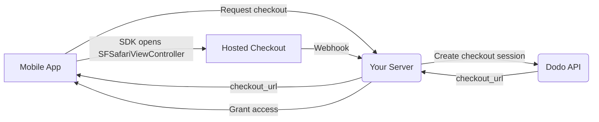

## Introdução

Dodo Payments capacita desenvolvedores a vender bens e serviços digitais em aplicativos iOS, lidando com aspectos complexos como conformidade fiscal, conversão de moeda e pagamentos. Este guia abrangente detalha como integrar o Dodo Payments em seu aplicativo iOS, especificamente para ferramentas SaaS, assinaturas de conteúdo e utilitários digitais.

## Visão Geral

Dodo Payments atua como seu **Merchant of Record (MoR)**, gerenciando aspectos críticos do seu negócio digital:

<Tabs>
<Tab title="What We Handle">
- Coleta e repasse de tributos (IVA, GST e outros impostos regionais)
- Pagamentos globais de acordo com políticas e métodos locais
- Conversão de moeda e câmbio
- Chargebacks e prevenção de fraudes
- Faturamento e recibos para o cliente final
- Conformidade com regulamentações regionais
</Tab>

<Tab title="What You Get">
- Uma API unificada para plataformas web e mobile
- Suporte a checkouts in-app (UPI, cartões, carteiras, BNPL)
- Suporte a pagamentos globais (Payoneer, Wise, transferências bancárias locais)
- Painel de análise e relatórios
- Processamento seguro de pagamentos
</Tab>
</Tabs>

## Casos de Uso

<CardGroup cols={2}>
<Card title="Subscriptions" icon="repeat">
- Acesso a conteúdo ou recursos premium
- Cobrança recorrente com opções flexíveis, testes gratuitos, prorrata, upgrades e downgrades
</Card>

<Card title="Courses and Learning" icon="graduation-cap">
- Acesso pay-per-course
- Pacotes de conteúdo combinados
- Licenças vitalícias ou renováveis
- Integração de rastreamento de progresso
</Card>

<Card title="Digital Downloads" icon="download">
- Compras pontuais (PDFs, músicas, ferramentas)
- Entrega de ativos digitais
- Gerenciamento de chaves de licença
</Card>

<Card title="SaaS Tools" icon="screwdriver-wrench">
- Assinaturas de Software como Serviço
- Cobrança baseada no uso
- Planos para equipes e empresas
</Card>
</CardGroup>

## Fluxo de Integração

Seu app abre o checkout hospedado do Dodo com o
[iOS checkout SDK](/developer-resources/sdks/ios), que o apresenta em
`SFSafariViewController` e devolve um resultado tipado.

<Warning>
Use o SDK em vez de incorporar o checkout em um `WebView`. O Apple Pay só está
disponível em uma superfície de navegador real, portanto um `WebView` reduz silenciosamente suas
conversões de carteira — e fluxos de pagamento dentro de um `WebView` são uma causa comum de rejeições na revisão da App
Store.
</Warning>

### Etapas da integração

<Steps>
<Step title="Mobile App to Your Server">
Seu app solicita ao seu próprio backend uma URL de checkout, autenticada com o
token de sessão do usuário conectado.
</Step>

<Step title="Your Server to Dodo API">
Seu backend cria uma [checkout session](/developer-resources/checkout-session)
com sua chave de API e retorna o `checkout_url` ao app.

<Warning>
Crie checkout sessions no seu servidor, nunca no app. Uma chave de API distribuída
dentro do binário de um app pode ser extraída do bundle.
</Warning>
</Step>

<Step title="Mobile App Opens Checkout">
Passe o `checkout_url` para `DodoCheckout.start(...)`. O SDK o apresenta em
`SFSafariViewController` e resolve com um resultado tipado quando o cliente
conclui ou dispensa o checkout.
</Step>

<Step title="Dodo Payments to Your Server">
Dodo Payments chama seu endpoint de webhook quando o pagamento é bem-sucedido ou a
subscription é ativada.
</Step>

<Step title="Your Server Grants Access">
Desbloqueie o conteúdo comprado a partir desse webhook, não do resultado recebido pelo app. O resultado do SDK é uma dica de UI, não uma
prova de pagamento.
</Step>
</Steps>

<CardGroup cols={2}>
<Card title="iOS Checkout SDK" icon="apple" href="/developer-resources/sdks/ios">
  Etapas de instalação e o contrato completo de `start(...)` para Swift.
</Card>
<Card title="Mobile Integration Guide" icon="mobile" href="/developer-resources/mobile-integration">
  O fluxo de ponta a ponta, além do mesmo contrato para Android, React Native e Flutter.
</Card>
</CardGroup>

## Disponibilidade regional

Dodo Payments habilita fluxos alternativos de compras no app somente nas regiões da App Store onde a Apple permite explicitamente pagamentos externos ou onde um órgão regulador ou uma ordem judicial os determina.

### Regiões compatíveis

<AccordionGroup>
<Accordion title="United States">
Compatível na medida permitida pelas ordens judiciais vigentes e pelas diretrizes atualizadas da Apple.

- Disponível conforme disposições específicas determinadas por ordem judicial
- Sujeito à conformidade da Apple com os requisitos legais
- Deve seguir as diretrizes de implementação da Apple
</Accordion>

<Accordion title="European Union (EU) App Store">
Compatível por meio dos Termos Alternativos da UE da Apple e do External Purchase Entitlement.

- Habilitado por meio dos Termos Alternativos da UE da Apple
- Requer aprovação do External Purchase Entitlement
- Deve estar em conformidade com os requisitos do Digital Markets Act da UE
</Accordion>

<Accordion title="South Korea">
Compatível por meio do StoreKit External Purchase Entitlement para binários exclusivos da Coreia.

- Disponível por meio do StoreKit External Purchase Entitlement
- Requer um binário de app específico para a Coreia
- Deve estar em conformidade com a legislação de telecomunicações da Coreia
</Accordion>
</AccordionGroup>

<Warning>
Sempre analise e cumpra os entitlements específicos de cada região da Apple e os requisitos do App Store Connect antes de habilitar o Dodo Payments para qualquer storefront. O uso de fluxos de pagamento alternativos em regiões não compatíveis pode resultar na rejeição ou remoção do app.
</Warning>

<Note>
Para alguns modelos de negócio — como serviços ou determinadas categorias de conteúdo — a Apple pode não exigir o uso de compras no app (IAP). O Dodo Payments também oferece suporte a esses modelos. Sempre verifique a classificação do seu app e as diretrizes mais recentes da Apple para determinar se o IAP é obrigatório no seu caso de uso.
</Note>

### Saiba mais

Para uma análise detalhada das políticas globais, dos precedentes legais e das abordagens estratégicas para contornar as taxas da App Store, consulte nosso guia completo:

<Card title="Bypassing App Store & Play Store Fees: A Strategic and Legal Playbook" icon="shield-check" href="/features/bypassing-app-store-fees">
Saiba onde e como implementar legalmente fluxos de pagamento alternativos, com orientações regionais atualizadas e dicas de conformidade.
</Card>