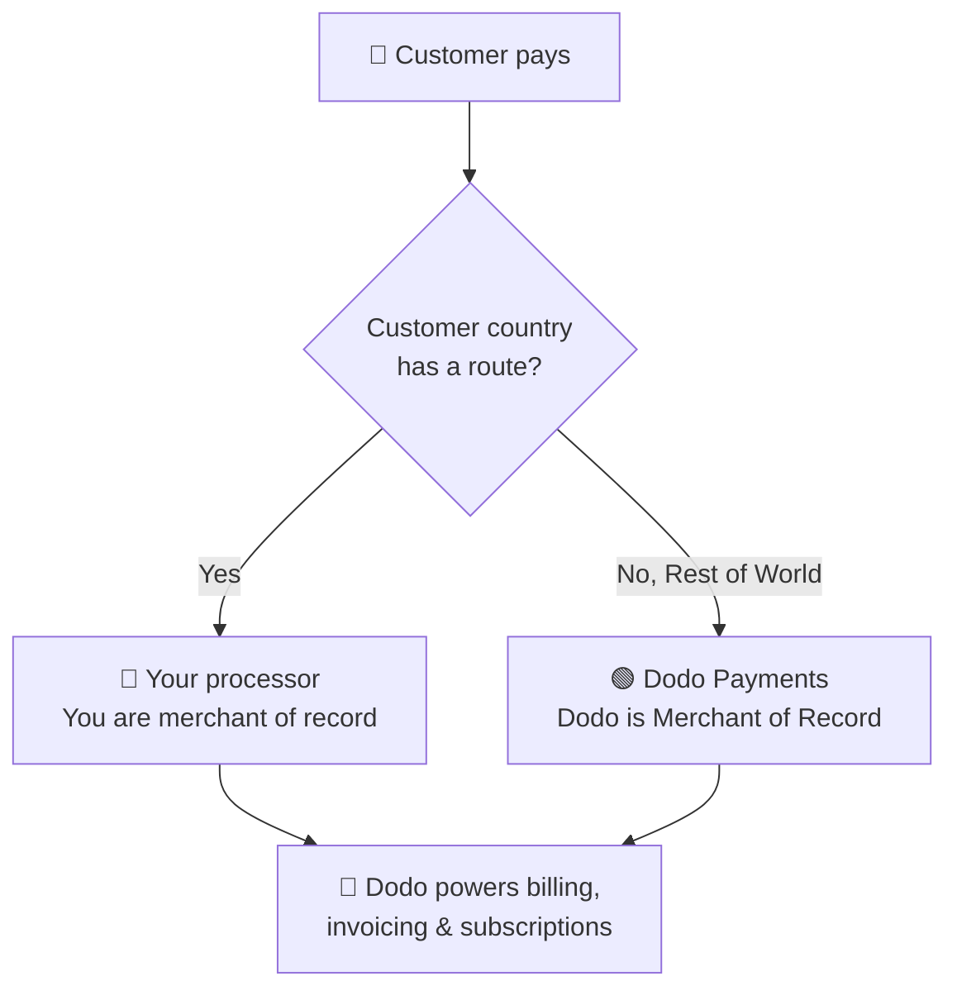

**Traga Seu Próprio Processador (BYOP)** permite conectar seu próprio processador de pagamento — atualmente **Stripe** ou **Adyen**, com suporte a mais processadores em breve — e continuar usando o Dodo Payments para tudo que está acima da transação: produtos, assinaturas, chaves de licença e o motor de direitos, faturamento, portal do cliente e análises.

Você decide, por país do cliente, se um pagamento é processado pelo **seu processador** (você permanece como merchant of record para essa rota) ou pelo **Dodo Payments** como seu Merchant of Record de serviço completo. Países que você não rotear explicitamente serão direcionados automaticamente para o Dodo.

<CardGroup cols={2}>
<Card title="Route by geography" icon="globe">
Envie pagamentos de países específicos para seu próprio processador, e tudo o mais para o Dodo.
</Card>

<Card title="Keep your processor accounts" icon="plug">
Continue usando suas contas e relacionamentos existentes do Stripe ou Adyen.
</Card>

<Card title="Stay the merchant of record" icon="building">
Nas suas próprias rotas, você permanece como vendedor legal e controla impostos, disputas e pagamentos.
</Card>

<Card title="One billing layer" icon="layer-group">
Dodo gerencia produtos, assinaturas, faturas e análises em ambas as rotas.
</Card>
</CardGroup>

## BYOP vs. Dodo como Merchant of Record

Quando você habilita o BYOP, escolhe como cada pagamento é gerenciado. Os dois modelos podem operar lado a lado, roteados por país do cliente.

| Recurso | Dodo como Merchant of Record | Traga Seu Próprio Processador |
|---------|----------------------------|--------------------------|
| Vendedor legal de registro | Dodo Payments | Sua empresa |
| Imposto (VAT, GST e vendas) | Calculado, coletado e remetido para você | Você registra, coleta e arquiva |
| Chargebacks e fraude | Responsabilidade e proteção geridas pelo Dodo | Você gerencia com as ferramentas de seu próprio processador |
| Conformidade PCI | Gerenciado pelo Dodo | Você gerencia |
| Métodos de pagamento | 30+ globais e locais, multi-moeda | Apenas cartões (crédito/débito) |
| Pagamentos | Pagamentos globais agregados | Direto do seu processador |
| Configuração | Simples, ativo em minutos | Moderado, adicione chaves e roteamento |
| Melhor para | Vendas globais, conformidade sem complicações | Processador existente e controle regional |

<Tip>
Uma configuração comum é **híbrida**: roteie para um país onde você já tem uma entidade registrada e processador (por exemplo, seu mercado doméstico) para seu próprio processador e deixe o Dodo cuidar do resto do mundo como Merchant of Record.
</Tip>

## Processadores suportados

Hoje você pode conectar **Stripe** ou **Adyen**. Suporte para mais processadores está a caminho.

<CardGroup cols={2}>
<Card title="Stripe" icon="stripe" />
<Card title="Adyen" icon="/images/logos/adyen.svg" />
</CardGroup>

<Note>
Pagamentos roteados pelo seu próprio processador atualmente suportam **apenas cartões de crédito e débito**. Estamos adicionando mais métodos de pagamento em breve.
</Note>

<Warning>
Tanto **Stripe** quanto **Adyen** exigem **acesso à API de cartão bruto** ativado na sua conta para que o Dodo possa gerenciar o faturamento no seu processador. Cada processador concede isso mediante solicitação — você arranja isso entrando em contato com o suporte do processador antes de conectar. Veja os guias do [Stripe](/features/byop/stripe) e [Adyen](/features/byop/adyen) para detalhes.
</Warning>

<Info>
Conexões são configuradas **por ambiente**. O processador que você conecta no **modo de teste** (Sandbox) é separado daquele no **modo ao vivo** (Produção); configure ambos se você quiser testar antes de ir ao vivo. O assistente de configuração segue a alternância global de teste/ao vivo do seu painel.
</Info>

## Configure o BYOP

Abra **Configurações → BYOP** no painel e selecione **Configurar** no cartão *Traga Seu Próprio Processador* para iniciar o assistente de configuração.

<Frame>

</Frame>

<Steps>
<Step title="Choose a payment processor">
Selecione o processador que você deseja conectar, **Stripe** ou **Adyen**, e continue.

<Frame>

</Frame>
</Step>

<Step title="Connect your account">
Dê à conexão um **Nome de Provedor** (útil quando você tem várias contas do mesmo processador, por exemplo, *Stripe US* e *Stripe UK*), depois insira a **Chave Secreta** do seu processador (para Stripe, sua `sk_...` key).

Para **Adyen**, insira também seu identificador de **Conta Merchant**.

<Frame>

</Frame>

Salvar cria a conexão e gera um **Endpoint de Webhook** exclusivo. Adicione essa URL como um destino de webhook no painel do seu processador e cole o **Segredo da Assinatura do Webhook** de volta no Dodo para finalizar:

- **Stripe**: cole o segredo de assinatura do endpoint de webhook que você adicionou.
- **Adyen**: cole a **chave HMAC** da *Área do Cliente → Webhooks*.

<Note>
Sua chave secreta é armazenada de forma segura e não pode ser visualizada ou alterada após o salvamento. Você apenas configura a URL do webhook gerada pelo Dodo no seu processador; nunca interage diretamente com a infraestrutura subjacente.
</Note>

<Tip>
Use **Verificar conexão** após o salvamento para executar uma chamada de teste contra seu processador e confirmar que as chaves e o segredo do webhook são válidos antes de ir ao vivo.
</Tip>
</Step>

<Step title="Configure payment routing">
Adicione **regras de roteamento** que mapeiam países de clientes para um processador. Cada país pode ser roteado para exatamente um processador.

- **Seu processador** lida com pagamentos dos países que você atribui a ele.
- **Dodo Payments** lida com **Resto do Mundo** (todo país que você não roteia explicitamente) como Merchant of Record.

<Frame>

</Frame>

Use **Adicionar Rota** para atribuir um ou mais países a um processador.

<Frame>

</Frame>

<Info>
**Diretrizes de roteamento**
- "Resto do Mundo" cobre todos os países não listados acima.
- As rotas MoR do Dodo Payments lidam automaticamente com conformidade e impostos.
- Rotas do seu próprio processador exigem configuração de impostos separada, se necessário.
</Info>
</Step>

<Step title="Configure invoice information">
Para pagamentos roteados por seu próprio processador, **você** é o vendedor na fatura. Insira os detalhes comerciais que devem aparecer nessas faturas:

- **Nome Comercial Registrado** (obrigatório)
- **ID Fiscal** (EIN, SSN, etc.; opcional, com validação de formato disponível para EINs dos EUA)
- **Descrição do Extrato** (obrigatório): o que os clientes veem em seu extrato bancário (de 5 a 22 caracteres)
- **Endereço Comercial Registrado** (obrigatório): comece a digitar para pesquisar e preencher automaticamente seu endereço
- Links para **Política de Privacidade** e **Termos de Serviço** (obrigatório)

Uma visualização ao vivo de **Cabeçalho de Fatura** mostra como os detalhes serão exibidos. Esses detalhes se aplicam **apenas** a faturas para rotas que você gerencia com seu próprio processador; pagamentos roteados por Dodo continuam a usar os detalhes de Merchant of Record do Dodo.

<Frame>

</Frame>
</Step>

<Step title="Review and finish">
Revise sua conexão com o processador, regras de roteamento e detalhes de faturamento. Confirme que os detalhes de roteamento e cobrança estão corretos, então selecione **Concluir configuração**.

<Frame>

</Frame>
</Step>
</Steps>

Uma vez configurado, o cartão BYOP mostra **Editar Configuração**, e você pode retornar ao MoR apenas a qualquer momento com **Editar regras de roteamento**.

<Frame>

</Frame>

## Como funciona o roteamento

O roteamento é determinado pelo **país do cliente** no momento do pagamento. A mesma lógica se aplica a pagamentos pontuais, sessões de checkout e assinaturas. Renovações reutilizam o processador em que a assinatura foi criada (consulte [Assinaturas](#subscriptions)).

Em uma rota gerenciada pelo **seu processador**:

- O pagamento é processado na conta do **seu** processador na moeda de faturamento.
- **Nenhum imposto é calculado ou recolhido** pelo Dodo; você permanece responsável pelo imposto nessa rota.
- As faturas usam os **detalhes comerciais e descrição do extrato** que você configurou, sem referências ao Merchant of Record.
- Pagamentos são realizados **diretamente para você** a partir do seu processador; nada passa pela carteira do Dodo.

Em uma rota gerenciada pelo **Dodo** (Resto do Mundo), o Dodo atua exatamente como seu Merchant of Record de serviço completo, lidando com impostos, conformidade, disputas, fraudes e pagamentos agregados.

## Assinaturas

As assinaturas permanecem no processador em que foram criadas. Na renovação, o Dodo cobra o mesmo processador de pagamento que foi usado para comprar a assinatura, reutilizando o mandato de pagamento armazenado contra ele. Regras de roteamento não são reavaliadas em cada renovação.

## Vendo qual processador lidou com um pagamento

Depois que o BYOP é configurado, as tabelas de **Pagamentos** e **Disputas** mostram um ícone de processador (Stripe, Adyen ou Dodo) ao lado de cada linha, e as páginas de detalhes de pagamento e disputa incluem um campo **Processador de Pagamento**, para que você sempre saiba qual rota lidou com uma determinada transação.

## Reembolsos, disputas e pagamentos

<Tabs>
<Tab title="Refunds">
Você inicia reembolsos do painel do Dodo como de costume. Para pagamentos roteados por seu próprio processador, o reembolso é executado nesse processador; para pagamentos roteados pelo Dodo, o Dodo processa o reembolso.
</Tab>

<Tab title="Disputes">
O painel do Dodo mostra disputas apenas para pagamentos **processados pelo Dodo**.

> Somente disputas processadas por Dodo são mostradas aqui. Disputas no seu próprio processador (por exemplo, Stripe) são gerenciadas no painel desse processador.

Ações de upload de evidência, aceitação e contestação estão disponíveis apenas para disputas processadas pelo Dodo. Disputas no seu processador são gerenciadas com as ferramentas do seu próprio processador.
</Tab>

<Tab title="Payouts">
Para rotas no seu próprio processador, seu processador paga você **diretamente**; esses pagamentos não aparecem no Dodo.

> Apenas pagamentos do Dodo são visíveis aqui. Pagamentos no seu próprio processador ocorrem naquele processador.

Os pagamentos do Dodo (para o volume MoR do Resto do Mundo) seguem a [estrutura de pagamentos](/features/payouts/payout-structure) padrão.
</Tab>
</Tabs>

## Análises

Receita, imposto e análises de assinaturas incluem **ambas** as rotas para que você veja a imagem completa de seu faturamento. Widgets de disputas e pagamentos mostram apenas atividade **processada pelo Dodo**, com um banner indicando que a atividade no seu próprio processador está no painel desse processador.

## Taxa de faturamento

O Dodo aplica uma pequena **taxa de faturamento BYOP** em pagamentos roteados pelo seu próprio processador, já que o Dodo ainda gerencia seus produtos, assinaturas, faturamento e análises nessas transações. Aparece como uma linha `byop_fee` no seu livro-razão. A taxa padrão é **0,5%**; a taxa exata é confirmada como parte da habilitação do BYOP para sua conta. [Entre em contato](mailto:founders@dodopayments.com) para detalhes.

## Perguntas frequentes

<AccordionGroup>
<Accordion title="Which processors can I connect?">
Stripe e Adyen são suportados hoje, com suporte a mais processadores em breve. Ambos exigem **acesso à API de cartão bruto** ativado na sua conta, que você arruma entrando em contato com o suporte do processador. Veja os guias do [Stripe](/features/byop/stripe) e [Adyen](/features/byop/adyen) para detalhes.
</Accordion>

<Accordion title="Can I route only some countries to my processor?">
Sim. Atribua países específicos ao seu processador e deixe o restante como **Resto do Mundo**, que o Dodo lida como Merchant of Record. Cada país é roteado para exatamente um processador.
</Accordion>

<Accordion title="Who is the merchant of record on BYOP routes?">
Você é. Em rotas gerenciadas pelo seu próprio processador, você permanece como vendedor legal e é responsável pelos impostos, chargebacks, conformidade PCI e pagamentos nessas transações.
</Accordion>

<Accordion title="Does Dodo calculate tax on my processor's routes?">
Não. Impostos não são calculados ou coletados em rotas gerenciadas pelo seu próprio processador; você gerencia impostos para essas transações. O Dodo continua lidando com impostos em pagamentos roteados pelo Dodo (MoR).
</Accordion>

<Accordion title="What happens to active subscriptions if I disable a processor?">
Renovações nesse processador falharão e aparecerão como pagamentos falhados no painel. Reative o processador para restaurar as renovações.
</Accordion>
</AccordionGroup>

## Comece

<Card title="What is Merchant of Record?" icon="building-columns" href="/features/mor-introduction">
Entenda como funciona o modelo MoR de serviço completo do Dodo.
</Card>
