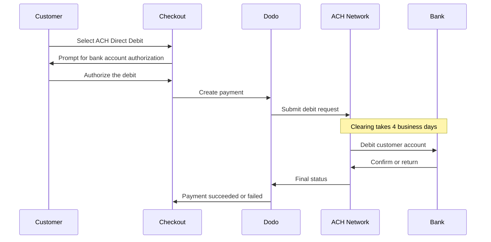

O ACH Direct Debit permite que clientes nos Estados Unidos paguem diretamente de suas contas bancárias, em vez de usar um cartão. Ele opera na rede Automated Clearing House e é oferecido em checkouts em USD para pagamentos únicos.

## Por que oferecer ACH Direct Debit?

<CardGroup cols={3}>
<Card title="Lower Processing Cost" icon="piggy-bank">
Os débitos bancários normalmente custam menos para processar do que os pagamentos com cartão, especialmente em pedidos de alto valor.
</Card>

<Card title="No Card Required" icon="building-columns">
Alcance clientes dos EUA que preferem pagar por meio de uma conta bancária ou que não querem usar um cartão em compras grandes.
</Card>

<Card title="Higher Value Orders" icon="chart-line">
A vantagem de custo em relação aos cartões aumenta conforme o valor do pedido, tornando o ACH adequado para grandes compras únicas.
</Card>
</CardGroup>

## Visão geral

| Detalhe | Valor |
| :----- | :---- |
| **Moeda de cobrança** | USD |
| **Países compatíveis** | Estados Unidos |
| **Assinaturas** | Não |
| **Valor mínimo** | $0.50 |
| **Liquidação** | 4 dias úteis |

<Warning>
O ACH Direct Debit não é instantâneo. Um pagamento leva **4 dias úteis** para ser confirmado. Portanto, não trate a autorização como liquidação — só realize o atendimento quando o pagamento atingir o estado succeeded.
</Warning>

## Como funciona



## Experiência do cliente

1. O cliente seleciona ACH Direct Debit no checkout
2. O cliente autoriza o débito em sua conta bancária nos EUA
3. O pagamento é enviado à rede ACH e entra em um estado de processamento
4. A compensação é concluída nos dias úteis seguintes
5. O pagamento passa para o estado succeeded ou falha se o banco o devolver

<Info>
Como a compensação é assíncrona, use [webhooks](/developer-resources/webhooks) para conhecer o resultado final, em vez do redirecionamento do checkout. Um redirecionamento bem-sucedido significa apenas que o cliente autorizou o débito.

O pagamento emite `payment.processing` assim que o débito é enviado e, em seguida, `payment.succeeded` ou `payment.failed` quando a compensação é concluída. Somente `payment.succeeded` é seguro para realizar o atendimento.
</Info>

## Disponibilidade

O ACH Direct Debit aparece no checkout quando todas as condições a seguir são atendidas:

- **Moeda de cobrança** é `USD`
- **País de cobrança** é `US`
- A transação é um **pagamento único**

<Note>
O ACH Direct Debit não está disponível para assinaturas. Sua janela de compensação de vários dias não é adequada para ciclos de cobrança recorrentes. Para pagamentos recorrentes, use cartões ou outro método compatível com assinaturas — consulte a [visão geral dos métodos de pagamento](/features/payment-methods).
</Note>

## Configuração

```javascript
const session = await client.checkoutSessions.create({
  product_cart: [{ product_id: 'pdt_123', quantity: 1 }],
  allowed_payment_method_types: ['ach', 'credit', 'debit'],
  billing_currency: 'USD',
  billing_address: {
    country: 'US',
    zipcode: '94102'
  },
  return_url: 'https://example.com/success'
});
```

<Note>
O ACH Direct Debit requer uma moeda de cobrança **USD** e um endereço de cobrança nos **EUA**. Se você informar seus preços em outra moeda, ative o [Adaptive Currency](/features/adaptive-currency) para que os clientes dos EUA sejam cobrados em USD e o ACH fique disponível.
</Note>

## Tipo de método da API

| Tipo | Método | País |
| :--- | :----- | :------ |
| `ach` | ACH Direct Debit | Estados Unidos |

## Reembolsos e disputas

Reembolsos e disputas para pagamentos ACH usam as mesmas APIs e os mesmos fluxos do dashboard que todos os outros métodos de pagamento — não há nenhum tratamento específico de ACH a ser implementado.

<Warning>
Como os pagamentos ACH podem ser devolvidos pelo banco do cliente depois de parecerem concluídos, evite emitir reembolsos até que o pagamento original tenha atingido o estado succeeded.
</Warning>

## Testes

<Steps>
<Step title="Enable test mode">
Use suas chaves de teste da API do Dodo Payments.
</Step>

<Step title="Set currency and billing address">
Defina a moeda de cobrança como `USD` e o país do endereço de cobrança como `US`.
</Step>

<Step title="Include `ach` in allowed methods">
Informe `ach` em `allowed_payment_method_types` ou omita o campo completamente para exibir todos os métodos elegíveis.
</Step>

<Step title="Enter the test bank details">
Insira um dos pares de números de roteamento e de conta de teste abaixo e confirme que seu handler de webhook recebe o status final do pagamento.
</Step>
</Steps>

### Contas bancárias de teste

Os clientes inserem o número da conta e o número de roteamento diretamente no checkout. No modo de teste, use o número de roteamento `110000000` com qualquer um dos números de conta abaixo para forçar um resultado específico.

| Número da conta | Número de roteamento | Comportamento |
| :------------- | :------------- | :------- |
| `000123456789` | `110000000` | O pagamento é bem-sucedido. |
| `000222222227` | `110000000` | O pagamento falha devido a fundos insuficientes. |
| `000111111113` | `110000000` | O pagamento falha porque a conta está encerrada. |
| `000111111116` | `110000000` | O pagamento falha porque nenhuma conta foi encontrada. |
| `000333333335` | `110000000` | O pagamento falha porque débitos não são autorizados na conta. |
| `000444444440` | `110000000` | O pagamento falha devido a uma moeda inválida. |
| `000555555559` | `110000000` | O pagamento é bem-sucedido e, em seguida, gera uma disputa. |
| `000000000009` | `110000000` | O pagamento permanece em processamento indefinidamente, o que é útil para testar uma interface de estado pendente. |

<Note>
A maioria dos pagamentos de teste chega a um status final muito mais rápido do que durante a janela de compensação real, portanto você não precisa esperar dias para verificar sua integração. A exceção é `000000000009`, que foi projetado para permanecer em processamento.
</Note>

## Práticas recomendadas

<AccordionGroup>
<Accordion title="Don't fulfill on authorization">
A autorização ACH não é um pagamento. Aguarde até que o pagamento atinja o estado succeeded antes de conceder acesso ou enviar o pedido — o débito ainda pode ser devolvido pelo banco do cliente.
</Accordion>

<Accordion title="Set customer expectations at checkout">
Informe aos clientes que pagamentos bancários não são compensados instantaneamente. Isso reduz os chamados ao suporte perguntando por que um pedido ainda está pendente.
</Accordion>

<Accordion title="Provide card fallbacks">
Sempre inclua `credit` e `debit` junto com `ach` para que clientes que precisam de acesso instantâneo ao seu produto possam escolher um método mais rápido.
</Accordion>

<Accordion title="Use ACH for high-value one-time purchases">
A vantagem de custo do ACH aumenta conforme o valor do pedido, portanto ele é mais útil em grandes compras únicas do que em compras pequenas.
</Accordion>
</AccordionGroup>

## Solução de problemas

<AccordionGroup>
<Accordion title="ACH not appearing at checkout">
**Verifique:**
1. A moeda de cobrança está definida como `USD`?
2. O país de cobrança do cliente é `US`?
3. `ach` está incluído em `allowed_payment_method_types`?
4. Este é um pagamento único? O ACH não é oferecido para assinaturas.

**Solução:** remova temporariamente `allowed_payment_method_types` para ver todos os métodos elegíveis e, em seguida, verifique a moeda de cobrança e o país do endereço na sua solicitação da API.
</Accordion>

<Accordion title="ACH not appearing on a subscription checkout">
**Causa:** o ACH Direct Debit é oferecido apenas para pagamentos únicos.

**Solução:** use cartões ou outro método compatível com assinaturas para cobranças recorrentes.
</Accordion>

<Accordion title="Payment stuck in processing">
**Causa:** isso é esperado. Os pagamentos ACH permanecem em estado de processamento durante toda a janela de compensação, por muito mais tempo que os pagamentos com cartão.

**Solução:** aguarde o webhook final. Não tente novamente o pagamento — uma nova tentativa pode debitar o cliente duas vezes.
</Accordion>

<Accordion title="Payment failed after initially succeeding at checkout">
**Causa:** o banco do cliente devolveu o débito — geralmente por fundos insuficientes ou por uma conta encerrada.

**Solução:** trate o pagamento como falho e peça ao cliente que tente novamente com outro método de pagamento. Sempre condicione o atendimento ao estado succeeded para evitar esse problema.
</Accordion>
</AccordionGroup>

## Páginas relacionadas

<CardGroup cols={2}>
<Card title="Payment Methods Overview" icon="credit-card" href="/features/payment-methods">
Veja todos os métodos de pagamento compatíveis.
</Card>

<Card title="Adaptive Currency" icon="globe" href="/features/adaptive-currency">
Suporte a moedas e conversão automática.
</Card>

<Card title="Checkout Guide" icon="book" href="/developer-resources/checkout-session">
Guia completo de implementação do checkout.
</Card>

<Card title="Webhooks" icon="webhook" href="/developer-resources/webhooks">
Trate confirmações de pagamento atrasadas de forma assíncrona.
</Card>
</CardGroup>
